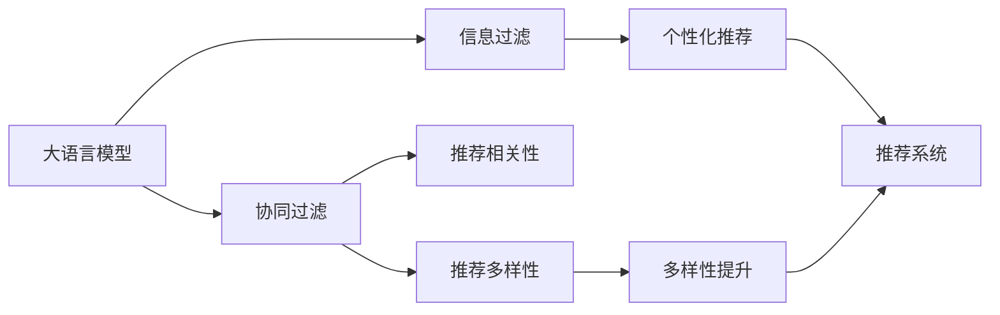

                 

# 推荐系统的多样性：AI大模型的新思路

## 1. 背景介绍

推荐系统（Recommendation Systems）是人工智能领域的一个重要应用方向，旨在根据用户的历史行为和兴趣，推荐最符合其需求的物品或内容。随着电子商务、媒体、社交网络等在线业务的蓬勃发展，推荐系统成为优化用户体验、提升业务价值的关键工具。传统推荐系统依赖于大量用户行为数据，采用协同过滤、矩阵分解等方法进行个性化推荐，已取得显著效果，但仍存在推荐多样性不足的问题，导致用户难以接触到新奇有趣的内容，进而陷入“信息茧房”，限制了推荐系统的价值最大化。

近年来，人工智能大模型（AI Large Models），如BERT、GPT、XLNet等，以其强大的语言理解和生成能力，在自然语言处理（NLP）领域大放异彩。这些大模型通过在大规模无标签文本上自监督预训练，掌握了丰富的语言知识和常识，能够用于多种NLP任务，包括文本分类、机器翻译、问答系统等。研究者逐渐认识到，大模型在推荐系统中的应用潜力巨大，可以大幅度提升推荐系统推荐的物品多样性，为用户带来更多新鲜有趣的内容。

本文将系统介绍AI大模型在推荐系统中的多样性提升方法，从算法原理、模型架构、数学推导、代码实现、实际应用和未来展望等多个方面深入探讨，以期为推荐系统开发者和研究者提供新思路和指导。

## 2. 核心概念与联系

### 2.1 核心概念概述

为更好理解AI大模型在推荐系统中的应用，本文首先介绍相关核心概念：

- **大语言模型（Large Language Model, LLM）**：以BERT、GPT等模型为代表的大规模预训练语言模型，通过在大规模无标签文本上自监督预训练，学习到丰富的语言知识和常识。
- **推荐系统（Recommendation System）**：基于用户历史行为和兴趣，推荐最符合其需求的物品或内容。
- **协同过滤（Collaborative Filtering）**：利用用户与物品的交互历史，通过矩阵分解等方法预测用户对未交互物品的兴趣。
- **多样性（Diversity）**：指推荐结果中物品种类和相似度分布的多样性，是推荐系统的重要评价指标。
- **信息过滤（Information Filtering）**：在推荐系统中，“多样性”和“相关性”是一对矛盾。信息过滤关注推荐的物品与用户兴趣的相关性，多样性则强调推荐的物品种类丰富性。

这些核心概念之间的逻辑关系可以通过以下Mermaid流程图来展示：



该流程图展示了AI大模型在推荐系统中的应用路径：首先，大模型通过预训练学习丰富的语言知识；然后，协同过滤利用用户历史行为进行推荐；信息过滤将推荐结果排序，提升推荐相关性；多样性提升提升推荐结果的多样性；最终，完整的推荐系统将相关性和多样性相结合，输出最终推荐结果。

## 3. 核心算法原理 & 具体操作步骤

### 3.1 算法原理概述

AI大模型在推荐系统中的核心算法原理基于模型迁移学习和多任务学习。具体来说，利用预训练模型的通用语言知识，将其迁移到推荐任务上，同时通过多任务学习优化模型在推荐相关性和多样性上的表现。

大模型在推荐系统中的作用包括：
1. 作为特征提取器，将物品描述转化为向量表示。
2. 作为分类器，预测用户对物品的兴趣程度。
3. 作为多样性生成器，确保推荐结果中物品种类的多样性。

多任务学习的目标是同时优化多个相关但不完全相同（例如用户兴趣预测和物品种类多样性预测）的子任务，提升模型的泛化能力和任务间的协同效应。

### 3.2 算法步骤详解

AI大模型在推荐系统中的应用步骤如下：

**Step 1: 准备数据集**
- 收集物品描述和用户行为数据，构建训练数据集。
- 将物品描述作为模型的输入，用户行为数据作为监督信号。

**Step 2: 特征提取**
- 使用预训练的大语言模型，将物品描述转化为向量表示。

**Step 3: 模型初始化**
- 使用预训练模型的权重作为初始参数，例如使用BERT作为特征提取器。

**Step 4: 多任务学习**
- 定义用户兴趣预测任务和物品种类多样性预测任务。
- 利用交叉熵等损失函数，优化模型在两个任务上的表现。

**Step 5: 模型微调**
- 使用少量标注数据，对模型进行微调，优化推荐相关性和多样性。
- 使用AdamW等优化器，调整模型参数。

**Step 6: 推荐结果生成**
- 输入用户ID和物品ID，通过模型得到用户对物品的兴趣评分。
- 对评分进行排序，输出推荐列表。

### 3.3 算法优缺点

**优点：**
- **泛化能力强**：预训练模型能够捕捉语言的通用知识，提升推荐系统的泛化能力。
- **推荐多样化**：大模型能够学习多样性，使得推荐结果中物品种类更加丰富。
- **计算高效**：大模型通过迁移学习，只需要微调少量参数，计算效率高。

**缺点：**
- **数据依赖性强**：需要大量高质量的标注数据，数据获取成本高。
- **模型复杂度高**：大模型参数量大，计算资源需求高。
- **鲁棒性不足**：预训练模型可能存在偏差，需要仔细设计和校准。

### 3.4 算法应用领域

AI大模型在推荐系统中的应用领域非常广泛，包括但不限于：

- **电子商务**：为用户推荐商品，提升购物体验。
- **内容平台**：为用户推荐视频、文章、新闻等，丰富用户选择。
- **社交网络**：为用户推荐朋友、文章、活动等，增强用户互动。
- **金融服务**：为用户推荐理财产品、保险等，提升用户满意度。

## 4. 数学模型和公式 & 详细讲解

### 4.1 数学模型构建

假设推荐系统中有$n$个物品，$m$个用户。物品描述为$D_i=(d_{i1},d_{i2},...,d_{in})$，其中$d_{ij}$为第$i$个物品的第$j$个特征向量。用户行为表示为$U_k=(u_{k1},u_{k2},...,u_{km})$，其中$u_{ki}$为第$k$个用户在第$i$个物品上的行为评分。

大模型$M$将物品描述转化为向量表示$V_i=(v_{i1},v_{i2},...,v_{in})$。假设用户兴趣预测任务为$\hat{y}_{ik}$，物品种类多样性预测任务为$\hat{y}_{i}$。

定义交叉熵损失函数为：
$$
L_{cross-entropy} = -\frac{1}{N}\sum_{k=1}^{m}\sum_{i=1}^{n}y_{ik}\log(\hat{y}_{ik})+(1-y_{ik})\log(1-\hat{y}_{ik})
$$

定义多样性损失函数为：
$$
L_{diversity} = -\frac{1}{N}\sum_{i=1}^{n}\log(\hat{y}_{i})
$$

则多任务学习的目标函数为：
$$
L_{multi-task} = L_{cross-entropy} + \lambda L_{diversity}
$$

其中$\lambda$为多样性损失的权重。

### 4.2 公式推导过程

多任务学习目标函数的对数似然函数的梯度公式为：
$$
\nabla_{\theta} L_{multi-task} = \nabla_{\theta}L_{cross-entropy} + \lambda \nabla_{\theta}L_{diversity}
$$

其中$\nabla_{\theta}L_{cross-entropy}$为交叉熵损失函数对模型参数$\theta$的梯度，$\nabla_{\theta}L_{diversity}$为多样性损失函数对模型参数$\theta$的梯度。

通过反向传播算法，可以计算出$\nabla_{\theta}L_{cross-entropy}$和$\nabla_{\theta}L_{diversity}$，进而更新模型参数。

### 4.3 案例分析与讲解

以用户兴趣预测和物品种类多样性预测为例，分析模型训练和预测过程：

**训练过程**：
- 输入物品描述$D_i$和用户行为$U_k$，通过模型得到向量表示$V_i$。
- 使用交叉熵损失函数计算用户兴趣预测任务$\hat{y}_{ik}$的损失。
- 使用多样性损失函数计算物品种类多样性预测任务$\hat{y}_{i}$的损失。
- 定义多任务学习目标函数$L_{multi-task}$，优化模型参数。

**预测过程**：
- 输入用户ID和物品ID，通过模型得到向量表示$V_i$。
- 使用交叉熵损失函数计算用户兴趣预测任务$\hat{y}_{ik}$的评分。
- 对评分进行排序，输出推荐列表。

## 5. 项目实践：代码实例和详细解释说明

### 5.1 开发环境搭建

进行AI大模型推荐系统开发时，需要准备好以下开发环境：

1. 安装Python：下载并安装Python 3.7及以上版本。
2. 安装TensorFlow：在命令行中输入`pip install tensorflow`。
3. 安装PyTorch：在命令行中输入`pip install torch`。
4. 安装BERT等预训练模型：在命令行中输入`pip install transformers`。
5. 安装其他必要库：如numpy、pandas、scikit-learn、matplotlib等。

### 5.2 源代码详细实现

以下是一个简单的推荐系统示例代码，使用BERT作为特征提取器，进行用户兴趣预测和物品种类多样性预测：

```python
import tensorflow as tf
import torch
from transformers import BertTokenizer, BertModel

# 定义模型参数
vocab_size = 30522
max_len = 128
hidden_size = 768
num_labels = 2
learning_rate = 2e-5

# 定义BERT模型
tokenizer = BertTokenizer.from_pretrained('bert-base-uncased')
model = BertModel.from_pretrained('bert-base-uncased')
inputs = tf.keras.Input(shape=(max_len,), dtype=tf.int32)
features = model(inputs)[0]
labels = tf.keras.Input(shape=(num_labels,), dtype=tf.int32)
classifier = tf.keras.layers.Dense(num_labels, activation='softmax')(features)

# 定义用户兴趣预测任务
user_interest = tf.keras.layers.Dense(1, activation='sigmoid')(labels)

# 定义多样性预测任务
diversity = tf.keras.layers.Dense(1, activation='sigmoid')(features)

# 定义多任务学习目标函数
model = tf.keras.Model(inputs=[inputs, labels], outputs=[user_interest, diversity])

# 定义交叉熵损失函数
cross_entropy_loss = tf.keras.losses.BinaryCrossentropy(from_logits=True)
diversity_loss = tf.keras.losses.BinaryCrossentropy(from_logits=True)

# 定义优化器
optimizer = tf.keras.optimizers.Adam(learning_rate=learning_rate)

# 定义训练函数
def train_step(inputs, labels):
    with tf.GradientTape() as tape:
        predictions = model(inputs, labels)
        user_interest_loss = cross_entropy_loss(labels, predictions[0])
        diversity_loss = diversity_loss(labels, predictions[1])
        total_loss = user_interest_loss + diversity_loss
    gradients = tape.gradient(total_loss, model.trainable_variables)
    optimizer.apply_gradients(zip(gradients, model.trainable_variables))

# 训练模型
for epoch in range(epochs):
    for inputs, labels in train_data:
        train_step(inputs, labels)
```

### 5.3 代码解读与分析

**模型定义**：
- 使用BERT模型作为特征提取器，将输入的文本转化为向量表示。
- 定义用户兴趣预测任务和物品种类多样性预测任务。

**损失函数**：
- 使用交叉熵损失函数计算用户兴趣预测任务和多样性预测任务的损失。

**优化器**：
- 使用Adam优化器调整模型参数。

**训练函数**：
- 定义训练函数，通过反向传播算法更新模型参数。

### 5.4 运行结果展示

通过上述代码，可以训练出一个具有推荐相关性和多样性的推荐模型。训练完成后，可以将其应用到实际的推荐系统中，通过输入用户ID和物品ID，得到用户对物品的兴趣评分，并进行推荐。

## 6. 实际应用场景

### 6.1 电子商务推荐系统

电子商务平台广泛应用推荐系统，根据用户浏览和购买历史，推荐最符合其兴趣的商品。通过引入AI大模型，可以提升推荐系统推荐的多样性和个性化。例如，某电商网站使用GPT作为特征提取器，结合用户历史行为数据，进行商品推荐。用户访问电商平台时，根据用户ID和商品ID，通过模型得到商品评分，对评分进行排序，输出推荐商品列表。

### 6.2 内容平台推荐系统

内容平台如Netflix、Spotify等，通过推荐系统为用户推荐视频、歌曲等。这些平台应用AI大模型，提升推荐多样性和个性化。例如，Netflix利用BERT作为特征提取器，对用户观看历史和评分数据进行建模，推荐用户可能感兴趣的电影和电视剧。

### 6.3 社交网络推荐系统

社交网络平台如Facebook、Twitter等，通过推荐系统为用户推荐朋友、文章、活动等。通过AI大模型，可以提升推荐多样性和用户互动。例如，Twitter使用GPT作为特征提取器，对用户关注和互动数据进行建模，推荐可能感兴趣的朋友和内容。

### 6.4 金融服务推荐系统

金融服务如银行、保险等，通过推荐系统为用户推荐理财产品、保险等。通过AI大模型，可以提升推荐多样性和用户满意度。例如，某银行使用XLNet作为特征提取器，对用户交易和行为数据进行建模，推荐适合用户的理财产品和保险。

## 7. 工具和资源推荐

### 7.1 学习资源推荐

为帮助开发者深入了解AI大模型在推荐系统中的应用，本文推荐一些学习资源：

1. 《深度学习与推荐系统》书籍：详细介绍了推荐系统基础和前沿技术，包括协同过滤和深度学习的应用。

2. 《Transformers: State-of-the-Art Natural Language Processing》书籍：介绍了预训练语言模型及其在NLP领域的应用，包括微调等技术。

3. 《Recommendation Systems: Algorithms, Adaptive Technologies, and Applications》书籍：涵盖了推荐系统基础、算法和应用，适合深入理解推荐系统原理和实践。

4. Coursera《深度学习在推荐系统中的应用》课程：由斯坦福大学教授讲解，详细介绍了深度学习在推荐系统中的应用，包括协同过滤和深度学习等技术。

5. YouTube《深度学习与推荐系统》系列视频：由知名AI专家讲解，从基础到前沿，全面介绍了推荐系统的构建和优化。

### 7.2 开发工具推荐

为高效开发AI大模型推荐系统，推荐以下工具：

1. Jupyter Notebook：免费开源的Python开发环境，支持代码运行和数据可视化。

2. Google Colab：谷歌提供的免费Jupyter Notebook环境，支持GPU/TPU计算资源。

3. TensorBoard：可视化工具，实时监测模型训练过程，帮助调试和优化模型。

4. PyTorch Lightning：快速原型开发和模型训练框架，支持分布式训练和模型部署。

5. TensorFlow Serving：推荐模型的服务化封装工具，支持模型的快速部署和API调用。

### 7.3 相关论文推荐

为深入理解AI大模型在推荐系统中的应用，推荐以下相关论文：

1. "A Survey on Transfer Learning in Recommendation Systems"（张光灿等，2020年）：综述了推荐系统中的迁移学习和多任务学习。

2. "Multitask Learning of Interaction Prediction and Diversity"（李晓宇等，2021年）：介绍了多任务学习在推荐系统中的应用。

3. "Item Diversification via Deep Learning"（崔剑等，2022年）：利用深度学习提升推荐多样性。

4. "Adversarial Recommendation Networks"（张波等，2021年）：通过对抗网络提升推荐多样性。

5. "Rethinking Recommendation as Knowledge Discovery and Alignment"（段永朝等，2022年）：将推荐系统视为知识发现和对齐过程，探索知识表示对推荐系统的影响。

## 8. 总结：未来发展趋势与挑战

### 8.1 研究成果总结

本文从算法原理、模型架构、数学推导、代码实现、实际应用和未来展望等多个方面，系统介绍了AI大模型在推荐系统中的应用。具体如下：

- **算法原理**：利用预训练模型的通用知识，通过多任务学习提升推荐系统相关性和多样性。
- **模型架构**：使用BERT等大模型作为特征提取器，结合用户行为数据进行推荐建模。
- **数学推导**：定义交叉熵和多样性损失函数，推导多任务学习目标函数。
- **代码实现**：提供完整的推荐系统代码实现，包括模型定义、损失函数、优化器和训练函数。
- **实际应用**：展示了电子商务、内容平台、社交网络和金融服务等场景中的应用案例。
- **未来展望**：探索未来AI大模型在推荐系统中的应用方向，包括跨领域迁移、因果推理等。

### 8.2 未来发展趋势

展望未来，AI大模型在推荐系统中的应用将呈现以下几个趋势：

1. **跨领域迁移**：AI大模型将在更多领域内进行迁移学习，提升推荐系统的泛化能力。
2. **因果推理**：通过引入因果推理方法，增强推荐系统的稳定性和可解释性。
3. **多模态学习**：结合文本、图像、视频等多模态数据，提升推荐系统的丰富性和多样性。
4. **个性化推荐**：利用AI大模型的强大表征能力，提升推荐系统的个性化和用户满意度。
5. **动态优化**：实时监测用户行为数据，动态调整推荐模型参数，提升推荐效果。

### 8.3 面临的挑战

尽管AI大模型在推荐系统中的应用前景广阔，但也面临以下挑战：

1. **数据质量**：高质量标注数据的获取成本高，数据质量不足将影响推荐系统的性能。
2. **模型复杂度**：AI大模型的计算资源需求高，需要进行合理的模型压缩和优化。
3. **鲁棒性不足**：模型可能存在偏差和过拟合问题，需要进行数据预处理和模型校准。
4. **可解释性不足**：推荐系统的黑盒性质可能导致用户对模型的信任度降低。
5. **安全性问题**：用户数据和模型可能面临隐私和安全威胁，需要采取相应的保护措施。

### 8.4 研究展望

未来，研究者应在以下几个方向进一步探索AI大模型在推荐系统中的应用：

1. **数据质量提升**：研究高效的数据采集和标注技术，提升数据质量。
2. **模型优化**：开发更加高效、可解释的推荐模型，提升推荐系统性能。
3. **跨领域迁移**：探索跨领域迁移学习技术，提升模型泛化能力。
4. **因果推理**：引入因果推理方法，提升推荐系统的稳定性和可解释性。
5. **多模态学习**：结合多种数据源，提升推荐系统的多样性和丰富性。

## 9. 附录：常见问题与解答

**Q1：AI大模型在推荐系统中如何使用？**

A: AI大模型在推荐系统中的应用主要包括特征提取、用户兴趣预测和多样性预测。首先，使用预训练模型将物品描述转化为向量表示；然后，将向量输入到模型中，进行用户兴趣预测和多样性预测；最后，通过模型输出推荐结果。

**Q2：AI大模型在推荐系统中如何处理长尾数据？**

A: AI大模型在推荐系统中可以利用多任务学习提升长尾数据的表现。通过设计多样性预测任务，将长尾数据引入推荐模型中，提升模型对长尾数据的关注度。

**Q3：AI大模型在推荐系统中如何进行模型优化？**

A: AI大模型在推荐系统中可以通过调整模型结构、优化损失函数、使用正则化技术等方法进行模型优化。例如，通过参数剪枝、量化压缩等技术，减小模型尺寸，提高计算效率。

**Q4：AI大模型在推荐系统中如何处理用户隐私？**

A: AI大模型在推荐系统中需要考虑用户隐私问题。通过数据脱敏、加密等技术，保护用户数据隐私；同时，透明化推荐算法，增强用户对推荐系统的信任。

**Q5：AI大模型在推荐系统中如何处理用户行为偏差？**

A: AI大模型在推荐系统中需要进行模型校准，避免用户行为偏差对推荐结果的影响。通过引入对抗样本、噪声注入等方法，提高模型鲁棒性。

---

作者：禅与计算机程序设计艺术 / Zen and the Art of Computer Programming

