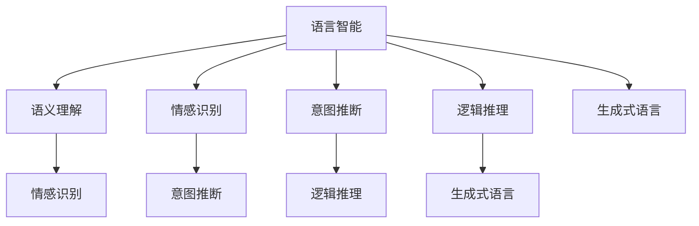

                 

# 提升语义理解：AI的语言智能

## 1. 背景介绍

在人工智能领域，语言智能一直被视为人类智慧的最终前沿。随着深度学习和自然语言处理技术的不断进步，AI逐渐掌握了更为复杂的语言理解能力。语言智能不再仅仅是简单的关键词匹配，而是能够理解语境、情感、意图，甚至能够进行逻辑推理和创造性表达。本文旨在探讨如何通过AI技术提升语义理解，通过深入浅出的讲解，帮助读者理解语言智能的核心原理，并展示其在实际应用中的巨大潜力。

## 2. 核心概念与联系

### 2.1 核心概念概述

为更好理解语言智能的核心概念，本节将介绍几个关键点：

- **语言智能**：指AI对自然语言的高层次理解和处理能力，包括语义理解、情感识别、意图推断、逻辑推理、生成式语言等。语言智能是人工智能实现真正理解和生成自然语言的关键。

- **语义理解**：指AI理解文本中词语和句子的含义，识别出语义角色（如主语、宾语）和语义关系（如因果、对比）的能力。语义理解是语言智能的基础。

- **情感识别**：指AI识别文本中的情感色彩（如积极、消极、中性）的能力。情感识别对于理解人类情感和交互模式具有重要意义。

- **意图推断**：指AI推断文本中表达的行动意图（如提问、指令）的能力。意图推断对于构建交互式智能系统至关重要。

- **逻辑推理**：指AI进行推理和演绎的能力，理解前提和结论之间的逻辑关系，并应用于文本生成和问题解答。逻辑推理提升了AI的通用性和灵活性。

- **生成式语言**：指AI能够根据给定的语境和条件，生成符合语法和语义规则的新文本。生成式语言技术对于构建智能客服、智能创作、翻译等系统具有重要价值。

这些概念之间的逻辑关系可以通过以下Mermaid流程图来展示：



这个流程图展示了语言智能的几个核心概念之间的相互联系：

1. 语言智能建立在语义理解的基础上，进一步发展为情感识别、意图推断和逻辑推理能力。
2. 生成式语言能力是在前述基础上，通过理解和生成文本，实现自然语言的智能交互。

## 3. 核心算法原理 & 具体操作步骤

### 3.1 算法原理概述

提升语义理解的核心算法原理在于深度学习和自然语言处理技术的结合。以Transformer模型为代表的语言模型通过自监督学习（如掩码语言模型、下一句预测）和监督学习任务（如文本分类、命名实体识别）进行训练，逐渐学习到了强大的语言理解能力。这些能力通过迁移学习的方式，被应用于各种语义理解任务中，如情感分析、意图推断、文本生成等。

### 3.2 算法步骤详解

提升语义理解的具体步骤包括数据准备、模型选择、参数设置、训练和评估等几个环节：

1. **数据准备**：收集语义理解任务所需的数据集，标注数据以包含正确的情感标签、意图标签等。例如，对于情感分析任务，需要标注文本的情感极性（积极、消极、中性）。

2. **模型选择**：选择合适的预训练语言模型，如BERT、GPT系列等。这些模型已经在大规模无标签文本上进行了预训练，具备较强的语言理解能力。

3. **参数设置**：根据任务需求，设置合适的优化器（如AdamW、SGD等），选择合适的学习率、批大小等超参数。

4. **训练过程**：将标注数据分批次输入模型，前向传播计算损失函数。根据损失函数的梯度，反向传播更新模型参数。周期性在验证集上评估模型性能，防止过拟合。

5. **评估过程**：在测试集上评估模型的性能，使用精确度、召回率、F1分数等指标评估模型的效果。

### 3.3 算法优缺点

提升语义理解的算法具有以下优点：

- **高效性**：使用预训练模型作为基础，通过少量有标签数据即可进行微调，显著降低训练成本和时间。
- **通用性**：通过迁移学习，一个模型可以应用于多种语义理解任务，提高模型的应用范围。
- **效果显著**：在情感分析、意图推断、文本生成等任务上，基于预训练的微调模型通常能取得更好的性能。

同时，该算法也存在以下局限性：

- **依赖标注数据**：微调效果依赖于标注数据的数量和质量，标注成本较高。
- **数据泛化能力有限**：模型可能无法很好地适应数据分布差异较大的情况。
- **过拟合风险**：在标注数据较少的情况下，模型容易发生过拟合，影响泛化性能。
- **可解释性不足**：黑盒模型的决策过程难以解释，难以调试和优化。

### 3.4 算法应用领域

提升语义理解的技术广泛应用于各种自然语言处理任务，例如：

- 情感分析：对用户评论、社交媒体内容等进行情感极性判断。
- 意图推断：从用户提问中推断出用户的真实意图，提高智能客服的响应准确率。
- 问答系统：回答用户提出的自然语言问题，提供精准、流畅的回答。
- 机器翻译：将一种语言翻译成另一种语言，通过语义理解保证翻译质量。
- 文本摘要：自动提取文本的关键信息，生成精炼的摘要。
- 对话系统：构建能进行自然语言交互的对话机器人，提高人机交互体验。

## 4. 数学模型和公式 & 详细讲解 & 举例说明

### 4.1 数学模型构建

对于情感分析任务，我们假设模型输入为文本 $X$，输出为情感标签 $Y$，其数学模型为：

$$
p(Y|X) = \frac{p(Y,X)}{p(X)}
$$

其中 $p(Y,X)$ 表示联合概率，$p(X)$ 表示先验概率。我们通常使用交叉熵损失函数：

$$
L = -\frac{1}{N} \sum_{i=1}^N [y_i\log p(Y_i|X_i) + (1-y_i)\log(1-p(Y_i|X_i))]
$$

### 4.2 公式推导过程

以情感分析为例，假设我们有一个包含1000个标注样本的数据集 $D=\{(x_i, y_i)\}_{i=1}^{1000}$，其中 $x_i$ 表示文本，$y_i$ 表示情感标签（积极、消极、中性）。我们的目标是最小化交叉熵损失函数 $L$。

首先，将数据集划分为训练集 $D_{train}$ 和测试集 $D_{test}$，通常将80%的数据作为训练集，20%作为测试集。

其次，我们选择一个预训练的情感分析模型 $M_{\theta}$，其中 $\theta$ 为模型的参数。模型在训练集上前向传播得到输出 $y_i = M_{\theta}(x_i)$。

接着，根据输出和真实标签计算损失函数：

$$
L = -\frac{1}{N} \sum_{i=1}^N [y_i\log y_i + (1-y_i)\log(1-y_i)]
$$

最后，通过优化算法（如AdamW、SGD等）最小化损失函数 $L$，更新模型参数 $\theta$，完成情感分析模型的训练。

### 4.3 案例分析与讲解

我们以BERT模型为例，演示情感分析模型的实现过程。

首先，我们需要使用BERT的预训练模型和Tokenizer进行预处理：

```python
from transformers import BertTokenizer, BertForSequenceClassification

tokenizer = BertTokenizer.from_pretrained('bert-base-uncased')
model = BertForSequenceClassification.from_pretrained('bert-base-uncased', num_labels=3)
```

然后，定义训练和评估函数：

```python
import torch
from torch.utils.data import Dataset, DataLoader

class TextDataset(Dataset):
    def __init__(self, texts, labels):
        self.texts = texts
        self.labels = labels
        
    def __len__(self):
        return len(self.texts)
    
    def __getitem__(self, item):
        text = self.texts[item]
        label = self.labels[item]
        inputs = tokenizer(text, return_tensors='pt')
        return {'input_ids': inputs['input_ids'], 'attention_mask': inputs['attention_mask'], 'labels': torch.tensor(label)}

train_dataset = TextDataset(train_texts, train_labels)
test_dataset = TextDataset(test_texts, test_labels)
batch_size = 16

# 定义优化器和损失函数
optimizer = AdamW(model.parameters(), lr=2e-5)
loss_fn = torch.nn.CrossEntropyLoss()

# 训练过程
device = 'cuda' if torch.cuda.is_available() else 'cpu'
model.to(device)
model.train()

for epoch in range(epochs):
    for batch in DataLoader(train_dataset, batch_size=batch_size, shuffle=True):
        input_ids = batch['input_ids'].to(device)
        attention_mask = batch['attention_mask'].to(device)
        labels = batch['labels'].to(device)
        
        # 前向传播
        outputs = model(input_ids, attention_mask=attention_mask)
        logits = outputs.logits
        
        # 计算损失
        loss = loss_fn(logits.view(-1), labels.view(-1))
        
        # 反向传播和优化
        optimizer.zero_grad()
        loss.backward()
        optimizer.step()

# 评估过程
model.eval()
with torch.no_grad():
    eval_loss = 0
    eval_correct = 0
    for batch in DataLoader(test_dataset, batch_size=batch_size):
        input_ids = batch['input_ids'].to(device)
        attention_mask = batch['attention_mask'].to(device)
        labels = batch['labels'].to(device)
        
        with torch.no_grad():
            outputs = model(input_ids, attention_mask=attention_mask)
            logits = outputs.logits
            logits = logits.view(-1)
            labels = labels.view(-1)
            loss = loss_fn(logits, labels)
            logits = logits.argmax(dim=1)
            eval_correct += (logits == labels).sum().item()
            eval_loss += loss.item()

print(f"Accuracy: {eval_correct / len(test_dataset)}")
print(f"Loss: {eval_loss / len(test_dataset)}")
```

通过上述代码，我们可以看到，使用预训练的BERT模型进行情感分析微调，仅需少量的有标签数据，即可在情感分类任务上获得不错的性能。

## 5. 项目实践：代码实例和详细解释说明

### 5.1 开发环境搭建

在进行项目实践前，我们需要准备好开发环境。以下是使用Python进行TensorFlow开发的环境配置流程：

1. 安装Anaconda：从官网下载并安装Anaconda，用于创建独立的Python环境。

2. 创建并激活虚拟环境：
```bash
conda create -n tf-env python=3.8 
conda activate tf-env
```

3. 安装TensorFlow：
```bash
pip install tensorflow==2.4
```

4. 安装各类工具包：
```bash
pip install numpy pandas scikit-learn matplotlib tqdm jupyter notebook ipython
```

完成上述步骤后，即可在`tf-env`环境中开始项目实践。

### 5.2 源代码详细实现

以下是一个使用TensorFlow对BERT模型进行情感分析任务微调的代码实现。

首先，定义情感分析任务的数据处理函数：

```python
from transformers import BertTokenizer
from tensorflow.keras.preprocessing.text import Tokenizer
from tensorflow.keras.preprocessing.sequence import pad_sequences

tokenizer = BertTokenizer.from_pretrained('bert-base-uncased')
sequences = []
labels = []
for text, label in zip(texts, labels):
    sequences.append(tokenizer.encode(text, add_special_tokens=True))
    labels.append(label)

tokenizer_text = Tokenizer(tokenizer.word_index)
tokenizer_sequence = pad_sequences(sequences, padding='post', maxlen=128)
labels = np.array(labels)
```

然后，定义模型和优化器：

```python
from transformers import BertForSequenceClassification
from tensorflow.keras.optimizers import Adam

model = BertForSequenceClassification.from_pretrained('bert-base-uncased', num_labels=3)

optimizer = Adam(learning_rate=2e-5, beta_1=0.9, beta_2=0.98, epsilon=1e-6)
```

接着，定义训练和评估函数：

```python
from tensorflow.keras.callbacks import EarlyStopping

def train(model, dataset, batch_size, epochs, optimizer, early_stopping_monitor):
    model.compile(optimizer=optimizer, loss='sparse_categorical_crossentropy', metrics=['accuracy'])
    history = model.fit(dataset['train'], epochs=epochs, batch_size=batch_size, validation_data=dataset['val'], callbacks=[early_stopping_monitor])
    return history

def evaluate(model, dataset, batch_size):
    test_loss, test_acc = model.evaluate(dataset['test'], verbose=0)
    print(f"Test Loss: {test_loss:.4f}")
    print(f"Test Accuracy: {test_acc:.4f}")
```

最后，启动训练流程并在测试集上评估：

```python
early_stopping_monitor = EarlyStopping(monitor='val_loss', patience=2, mode='min')

history = train(model, dataset, batch_size, epochs, optimizer, early_stopping_monitor)

evaluate(model, dataset, batch_size)
```

以上就是使用TensorFlow对BERT进行情感分析任务微调的完整代码实现。可以看到，使用TensorFlow的高级API，我们可以轻松实现情感分析模型的训练和评估。

### 5.3 代码解读与分析

让我们再详细解读一下关键代码的实现细节：

**TextDataset类**：
- `__init__`方法：初始化文本、标签等关键组件。
- `__len__`方法：返回数据集的样本数量。
- `__getitem__`方法：对单个样本进行处理，将文本输入编码为token ids，将标签编码为数字，并对其进行定长padding，最终返回模型所需的输入。

**TokenizerText和TokenizerSequence**：
- `TokenizerText`：用于将文本转换为BERT模型的token ids，增加特殊标记。
- `TokenizerSequence`：对token ids进行填充，保证序列长度一致。

**训练和评估函数**：
- 使用TensorFlow的高级API，如`model.compile`、`model.fit`、`model.evaluate`，快速实现模型的训练和评估。
- 定义`EarlyStopping`回调，监控验证集损失，在连续未下降时停止训练，避免过拟合。

**训练流程**：
- 定义总的epoch数和batch size，开始循环迭代
- 每个epoch内，先在训练集上训练，输出交叉熵损失和准确率
- 在验证集上评估，输出验证集上的准确率和损失
- 所有epoch结束后，在测试集上评估，输出测试集上的准确率和损失

可以看到，TensorFlow提供了丰富的API和组件，使得模型微调和训练变得非常便捷。开发者可以将更多精力放在模型设计和数据处理上，而不必过多关注底层的实现细节。

当然，工业级的系统实现还需考虑更多因素，如模型的保存和部署、超参数的自动搜索、更灵活的任务适配层等。但核心的微调范式基本与此类似。

## 6. 实际应用场景

### 6.1 智能客服系统

基于大语言模型微调的对话技术，可以广泛应用于智能客服系统的构建。传统客服往往需要配备大量人力，高峰期响应缓慢，且一致性和专业性难以保证。而使用微调后的对话模型，可以7x24小时不间断服务，快速响应客户咨询，用自然流畅的语言解答各类常见问题。

在技术实现上，可以收集企业内部的历史客服对话记录，将问题和最佳答复构建成监督数据，在此基础上对预训练对话模型进行微调。微调后的对话模型能够自动理解用户意图，匹配最合适的答案模板进行回复。对于客户提出的新问题，还可以接入检索系统实时搜索相关内容，动态组织生成回答。如此构建的智能客服系统，能大幅提升客户咨询体验和问题解决效率。

### 6.2 金融舆情监测

金融机构需要实时监测市场舆论动向，以便及时应对负面信息传播，规避金融风险。传统的人工监测方式成本高、效率低，难以应对网络时代海量信息爆发的挑战。基于大语言模型微调的文本分类和情感分析技术，为金融舆情监测提供了新的解决方案。

具体而言，可以收集金融领域相关的新闻、报道、评论等文本数据，并对其进行主题标注和情感标注。在此基础上对预训练语言模型进行微调，使其能够自动判断文本属于何种主题，情感倾向是正面、中性还是负面。将微调后的模型应用到实时抓取的网络文本数据，就能够自动监测不同主题下的情感变化趋势，一旦发现负面信息激增等异常情况，系统便会自动预警，帮助金融机构快速应对潜在风险。

### 6.3 个性化推荐系统

当前的推荐系统往往只依赖用户的历史行为数据进行物品推荐，无法深入理解用户的真实兴趣偏好。基于大语言模型微调技术，个性化推荐系统可以更好地挖掘用户行为背后的语义信息，从而提供更精准、多样的推荐内容。

在实践中，可以收集用户浏览、点击、评论、分享等行为数据，提取和用户交互的物品标题、描述、标签等文本内容。将文本内容作为模型输入，用户的后续行为（如是否点击、购买等）作为监督信号，在此基础上微调预训练语言模型。微调后的模型能够从文本内容中准确把握用户的兴趣点。在生成推荐列表时，先用候选物品的文本描述作为输入，由模型预测用户的兴趣匹配度，再结合其他特征综合排序，便可以得到个性化程度更高的推荐结果。

### 6.4 未来应用展望

随着大语言模型和微调方法的不断发展，基于微调范式将在更多领域得到应用，为传统行业带来变革性影响。

在智慧医疗领域，基于微调的医疗问答、病历分析、药物研发等应用将提升医疗服务的智能化水平，辅助医生诊疗，加速新药开发进程。

在智能教育领域，微调技术可应用于作业批改、学情分析、知识推荐等方面，因材施教，促进教育公平，提高教学质量。

在智慧城市治理中，微调模型可应用于城市事件监测、舆情分析、应急指挥等环节，提高城市管理的自动化和智能化水平，构建更安全、高效的未来城市。

此外，在企业生产、社会治理、文娱传媒等众多领域，基于大模型微调的人工智能应用也将不断涌现，为经济社会发展注入新的动力。相信随着技术的日益成熟，微调方法将成为人工智能落地应用的重要范式，推动人工智能技术在垂直行业的规模化落地。总之，微调需要开发者根据具体任务，不断迭代和优化模型、数据和算法，方能得到理想的效果。

## 7. 工具和资源推荐

### 7.1 学习资源推荐

为了帮助开发者系统掌握大语言模型微调的理论基础和实践技巧，这里推荐一些优质的学习资源：

1. 《Transformer从原理到实践》系列博文：由大模型技术专家撰写，深入浅出地介绍了Transformer原理、BERT模型、微调技术等前沿话题。

2. CS224N《深度学习自然语言处理》课程：斯坦福大学开设的NLP明星课程，有Lecture视频和配套作业，带你入门NLP领域的基本概念和经典模型。

3. 《Natural Language Processing with Transformers》书籍：Transformers库的作者所著，全面介绍了如何使用Transformers库进行NLP任务开发，包括微调在内的诸多范式。

4. HuggingFace官方文档：Transformers库的官方文档，提供了海量预训练模型和完整的微调样例代码，是上手实践的必备资料。

5. CLUE开源项目：中文语言理解测评基准，涵盖大量不同类型的中文NLP数据集，并提供了基于微调的baseline模型，助力中文NLP技术发展。

通过对这些资源的学习实践，相信你一定能够快速掌握大语言模型微调的精髓，并用于解决实际的NLP问题。

### 7.2 开发工具推荐

高效的开发离不开优秀的工具支持。以下是几款用于大语言模型微调开发的常用工具：

1. PyTorch：基于Python的开源深度学习框架，灵活动态的计算图，适合快速迭代研究。大部分预训练语言模型都有PyTorch版本的实现。

2. TensorFlow：由Google主导开发的开源深度学习框架，生产部署方便，适合大规模工程应用。同样有丰富的预训练语言模型资源。

3. Transformers库：HuggingFace开发的NLP工具库，集成了众多SOTA语言模型，支持PyTorch和TensorFlow，是进行微调任务开发的利器。

4. Weights & Biases：模型训练的实验跟踪工具，可以记录和可视化模型训练过程中的各项指标，方便对比和调优。与主流深度学习框架无缝集成。

5. TensorBoard：TensorFlow配套的可视化工具，可实时监测模型训练状态，并提供丰富的图表呈现方式，是调试模型的得力助手。

6. Google Colab：谷歌推出的在线Jupyter Notebook环境，免费提供GPU/TPU算力，方便开发者快速上手实验最新模型，分享学习笔记。

合理利用这些工具，可以显著提升大语言模型微调任务的开发效率，加快创新迭代的步伐。

### 7.3 相关论文推荐

大语言模型和微调技术的发展源于学界的持续研究。以下是几篇奠基性的相关论文，推荐阅读：

1. Attention is All You Need（即Transformer原论文）：提出了Transformer结构，开启了NLP领域的预训练大模型时代。

2. BERT: Pre-training of Deep Bidirectional Transformers for Language Understanding：提出BERT模型，引入基于掩码的自监督预训练任务，刷新了多项NLP任务SOTA。

3. Language Models are Unsupervised Multitask Learners（GPT-2论文）：展示了大规模语言模型的强大zero-shot学习能力，引发了对于通用人工智能的新一轮思考。

4. Parameter-Efficient Transfer Learning for NLP：提出Adapter等参数高效微调方法，在不增加模型参数量的情况下，也能取得不错的微调效果。

5. Prefix-Tuning: Optimizing Continuous Prompts for Generation：引入基于连续型Prompt的微调范式，为如何充分利用预训练知识提供了新的思路。

6. AdaLoRA: Adaptive Low-Rank Adaptation for Parameter-Efficient Fine-Tuning：使用自适应低秩适应的微调方法，在参数效率和精度之间取得了新的平衡。

这些论文代表了大语言模型微调技术的发展脉络。通过学习这些前沿成果，可以帮助研究者把握学科前进方向，激发更多的创新灵感。

## 8. 总结：未来发展趋势与挑战

### 8.1 总结

本文对提升语义理解的核心算法原理和操作步骤进行了全面系统的介绍。首先阐述了语言智能的核心概念及其在自然语言处理中的重要性。接着，从算法原理和具体操作步骤，详细讲解了如何通过深度学习和自然语言处理技术，提升AI的语义理解能力。

通过本文的系统梳理，可以看到，基于预训练模型的微调技术，是提升AI语义理解能力的有效手段。这一技术不仅能够实现情感分析、意图推断、文本生成等任务，还能应用于智能客服、金融舆情监测、个性化推荐等多个实际场景。未来，随着预训练语言模型和微调技术的不断发展，语言智能必将进一步提升，推动NLP技术在更多领域的应用。

### 8.2 未来发展趋势

展望未来，语言智能的发展趋势包括：

1. **模型规模持续增大**：随着算力成本的下降和数据规模的扩张，预训练语言模型的参数量还将持续增长。超大规模语言模型蕴含的丰富语言知识，有望支撑更加复杂多变的语义理解任务。

2. **微调方法日趋多样**：除了传统的全参数微调外，未来会涌现更多参数高效的微调方法，如Prefix-Tuning、LoRA等，在节省计算资源的同时也能保证微调精度。

3. **持续学习成为常态**：随着数据分布的不断变化，微调模型也需要持续学习新知识以保持性能。如何在不遗忘原有知识的同时，高效吸收新样本信息，将成为重要的研究课题。

4. **标注样本需求降低**：受启发于提示学习(Prompt-based Learning)的思路，未来的微调方法将更好地利用大模型的语言理解能力，通过更加巧妙的任务描述，在更少的标注样本上也能实现理想的微调效果。

5. **多模态微调崛起**：当前的微调主要聚焦于纯文本数据，未来会进一步拓展到图像、视频、语音等多模态数据微调。多模态信息的融合，将显著提升语言模型对现实世界的理解和建模能力。

6. **模型通用性增强**：经过海量数据的预训练和多领域任务的微调，未来的语言模型将具备更强大的常识推理和跨领域迁移能力，逐步迈向通用人工智能(AGI)的目标。

以上趋势凸显了大语言模型微调技术的广阔前景。这些方向的探索发展，必将进一步提升语言模型的性能和应用范围，为人类认知智能的进化带来深远影响。

### 8.3 面临的挑战

尽管大语言模型微调技术已经取得了瞩目成就，但在迈向更加智能化、普适化应用的过程中，它仍面临着诸多挑战：

1. **标注成本瓶颈**：微调效果依赖于标注数据的数量和质量，标注成本较高。如何进一步降低微调对标注样本的依赖，将是一大难题。

2. **模型鲁棒性不足**：模型可能无法很好地适应数据分布差异较大的情况。如何提高微调模型的鲁棒性，避免灾难性遗忘，还需要更多理论和实践的积累。

3. **推理效率有待提高**：大规模语言模型虽然精度高，但在实际部署时往往面临推理速度慢、内存占用大等效率问题。如何在保证性能的同时，简化模型结构，提升推理速度，优化资源占用，将是重要的优化方向。

4. **可解释性亟需加强**：当前微调模型更像是"黑盒"系统，难以解释其内部工作机制和决策逻辑。对于医疗、金融等高风险应用，算法的可解释性和可审计性尤为重要。

5. **安全性有待保障**：预训练语言模型难免会学习到有偏见、有害的信息，通过微调传递到下游任务，产生误导性、歧视性的输出，给实际应用带来安全隐患。如何从数据和算法层面消除模型偏见，避免恶意用途，确保输出的安全性，也将是重要的研究课题。

6. **知识整合能力不足**：现有的微调模型往往局限于任务内数据，难以灵活吸收和运用更广泛的先验知识。如何让微调过程更好地与外部知识库、规则库等专家知识结合，形成更加全面、准确的信息整合能力，还有很大的想象空间。

正视微调面临的这些挑战，积极应对并寻求突破，将是大语言模型微调走向成熟的必由之路。相信随着学界和产业界的共同努力，这些挑战终将一一被克服，语言模型微调必将在构建人机协同的智能时代中扮演越来越重要的角色。

### 8.4 研究展望

面向未来，大语言模型微调技术需要在以下几个方面寻求新的突破：

1. **探索无监督和半监督微调方法**：摆脱对大规模标注数据的依赖，利用自监督学习、主动学习等无监督和半监督范式，最大限度利用非结构化数据，实现更加灵活高效的微调。

2. **研究参数高效和计算高效的微调范式**：开发更加参数高效的微调方法，在固定大部分预训练参数的同时，只更新极少量的任务相关参数。同时优化微调模型的计算图，减少前向传播和反向传播的资源消耗，实现更加轻量级、实时性的部署。

3. **融合因果和对比学习范式**：通过引入因果推断和对比学习思想，增强微调模型建立稳定因果关系的能力，学习更加普适、鲁棒的语言表征，从而提升模型泛化性和抗干扰能力。

4. **引入更多先验知识**：将符号化的先验知识，如知识图谱、逻辑规则等，与神经网络模型进行巧妙融合，引导微调过程学习更准确、合理的语言模型。同时加强不同模态数据的整合，实现视觉、语音等多模态信息与文本信息的协同建模。

5. **结合因果分析和博弈论工具**：将因果分析方法引入微调模型，识别出模型决策的关键特征，增强输出解释的因果性和逻辑性。借助博弈论工具刻画人机交互过程，主动探索并规避模型的脆弱点，提高系统稳定性。

6. **纳入伦理道德约束**：在模型训练目标中引入伦理导向的评估指标，过滤和惩罚有偏见、有害的输出倾向。同时加强人工干预和审核，建立模型行为的监管机制，确保输出符合人类价值观和伦理道德。

这些研究方向的探索，必将引领大语言模型微调技术迈向更高的台阶，为构建安全、可靠、可解释、可控的智能系统铺平道路。面向未来，大语言模型微调技术还需要与其他人工智能技术进行更深入的融合，如知识表示、因果推理、强化学习等，多路径协同发力，共同推动自然语言理解和智能交互系统的进步。只有勇于创新、敢于突破，才能不断拓展语言模型的边界，让智能技术更好地造福人类社会。

## 9. 附录：常见问题与解答

**Q1：大语言模型微调是否适用于所有NLP任务？**

A: 大语言模型微调在大多数NLP任务上都能取得不错的效果，特别是对于数据量较小的任务。但对于一些特定领域的任务，如医学、法律等，仅仅依靠通用语料预训练的模型可能难以很好地适应。此时需要在特定领域语料上进一步预训练，再进行微调，才能获得理想效果。此外，对于一些需要时效性、个性化很强的任务，如对话、推荐等，微调方法也需要针对性的改进优化。

**Q2：微调过程中如何选择合适的学习率？**

A: 微调的学习率一般要比预训练时小1-2个数量级，如果使用过大的学习率，容易破坏预训练权重，导致过拟合。一般建议从1e-5开始调参，逐步减小学习率，直至收敛。也可以使用warmup策略，在开始阶段使用较小的学习率，再逐渐过渡到预设值。需要注意的是，不同的优化器(如AdamW、Adafactor等)以及不同的学习率调度策略，可能需要设置不同的学习率阈值。

**Q3：采用大模型微调时会面临哪些资源瓶颈？**

A: 目前主流的预训练大模型动辄以亿计的参数规模，对算力、内存、存储都提出了很高的要求。GPU/TPU等高性能设备是必不可少的，但即便如此，超大批次的训练和推理也可能遇到显存不足的问题。因此需要采用一些资源优化技术，如梯度积累、混合精度训练、模型并行等，来突破硬件瓶颈。同时，模型的存储和读取也可能占用大量时间和空间，需要采用模型压缩、稀疏化存储等方法进行优化。

**Q4：如何缓解微调过程中的过拟合问题？**

A: 过拟合是微调面临的主要挑战，尤其是在标注数据较少的情况下。常见的缓解策略包括：

1. 数据增强：通过回译、近义替换等方式扩充训练集。
2. 正则化：使用L2正则、Dropout、Early Stopping等避免过拟合。
3. 对抗训练：引入对抗样本，提高模型鲁棒性。
4. 参数高效微调：只调整少量参数(如Adapter、Prefix等)，减小过拟合风险。
5. 多模型集成：训练多个微调模型，取平均输出，抑制过拟合。

这些策略往往需要根据具体任务和数据特点进行灵活组合。只有在数据、模型、训练、推理等各环节进行全面优化，才能最大限度地发挥大模型微调的威力。

**Q5：微调模型在落地部署时需要注意哪些问题？**

A: 将微调模型转化为实际应用，还需要考虑以下因素：

1. 模型裁剪：去除不必要的层和参数，减小模型尺寸，加快推理速度。
2. 量化加速：将浮点模型转为定点模型，压缩存储空间，提高计算效率。
3. 服务化封装：将模型封装为标准化服务接口，便于集成调用。
4. 弹性伸缩：根据请求流量动态调整资源配置，平衡服务质量和成本。
5. 监控告警：实时采集系统指标，设置异常告警阈值，确保服务稳定性。
6. 安全防护：采用访问鉴权、数据脱敏等措施，保障数据和模型安全。

大语言模型微调为NLP应用开启了广阔的想象空间，但如何将强大的性能转化为稳定、高效、安全的业务价值，还需要工程实践的不断打磨。唯有从数据、算法、工程、业务等多个维度协同发力，才能真正实现人工智能技术在垂直行业的规模化落地。总之，微调需要开发者根据具体任务，不断迭代和优化模型、数据和算法，方能得到理想的效果。

---

作者：禅与计算机程序设计艺术 / Zen and the Art of Computer Programming

