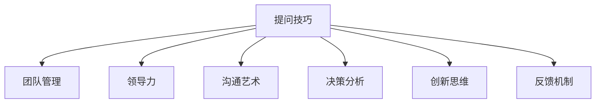

                 

# 提问的力量：管理者必备技能

> 关键词：
- 提问技巧
- 团队管理
- 领导力
- 沟通艺术
- 决策分析
- 创新思维
- 反馈机制

## 1. 背景介绍

### 1.1 问题由来
在当今信息爆炸的时代，企业内部外部环境瞬息万变，管理者面临的决策问题也愈发复杂。传统的指令式管理模式已无法应对动态变化的市场需求，如何提升团队的自主性、激发员工的主动性，成为了管理者面临的首要挑战。而有效提问是管理者激发团队创新和解决问题的重要工具，可以引导团队从被动接受任务转变为主动探索解决方案。

### 1.2 问题核心关键点
优秀的提问技巧不仅能帮助管理者更有效地推动团队达成目标，还能通过深入了解团队成员的思考方式，发现潜在问题，引导团队进行更深层次的思考。

核心问题在于：
- 如何提出有效问题，引导团队进行深度思考？
- 如何通过提问激发团队创新能力？
- 如何在团队中建立积极的反馈机制，持续提升团队表现？
- 如何将提问技巧与领导力和沟通艺术相结合，构建高效团队？

### 1.3 问题研究意义
提升管理者提问技巧，不仅能够提升团队的工作效率和创新能力，还能促进企业的文化建设，增强团队凝聚力，从而在激烈的市场竞争中占据优势。具体而言：
- 提升团队创新力：有效提问可以引导团队成员从不同的角度思考问题，激发创新灵感。
- 增强团队协作：通过提问促进团队成员之间的交流和协作，提高团队整体的表现。
- 优化决策过程：提问可以使得决策过程更加透明，增加决策的科学性和合理性。
- 建立信任关系：管理者通过提问可以更好地了解团队成员，建立信任关系，提升管理效果。

## 2. 核心概念与联系

### 2.1 核心概念概述

为了更好地理解提问在管理中的作用，本节将介绍几个关键概念：

- **提问技巧(Questioning Techniques)**：管理者通过提问引导团队进行深度思考、识别问题、激发创新和提高工作效率的方法。
- **团队管理(Team Management)**：通过合适的管理手段和方法，提升团队的整体表现和绩效。
- **领导力(Leadership)**：管理者通过自身行为和策略，影响和激励团队成员，达到共同目标。
- **沟通艺术(Communication Skills)**：管理者与团队成员之间的有效交流和信息共享，是提高团队表现的基础。
- **决策分析(Decision-Making)**：管理者在复杂环境中做出科学合理决策的能力。
- **创新思维(Creative Thinking)**：管理者通过提问和引导，促进团队成员产生新的想法和方法。
- **反馈机制(Feedback Mechanism)**：通过及时有效的反馈，管理者可以了解团队表现，优化管理策略。

这些概念之间的关系可以通过以下Mermaid流程图来展示：



这个流程图展示提问技巧与其他管理概念之间的联系：

1. 提问技巧是团队管理的重要工具。
2. 管理者通过提问技巧提升领导力。
3. 提问有助于增强沟通艺术。
4. 提问能优化决策分析过程。
5. 管理者通过提问促进创新思维。
6. 提问是建立反馈机制的基础。

这些概念共同构成管理者提升提问技巧的理论基础，使其能够更好地引导团队和优化管理。

## 3. 核心算法原理 & 具体操作步骤
### 3.1 算法原理概述

管理者通过提问引导团队，本质上是一个信息传递和反馈的过程。其核心思想是：通过明确、有针对性的问题，激发团队成员的思考，将信息传递到团队中，从而促进团队成员之间的互动和协作，提高整体表现。

形式化地，假设管理者的问题为 $Q_i$，团队成员的反馈为 $F_i$，团队的目标为 $T$，则提问与反馈的数学模型可以表示为：

$$
T = F(Q_i) = \bigcap_{i} F_i(Q_i)
$$

其中 $F(Q_i)$ 表示管理者提出的问题 $Q_i$ 在团队中的反馈效果。

管理者通过不断优化提问策略，使得 $F(Q_i)$ 最大化，从而最大化团队目标 $T$。

### 3.2 算法步骤详解

基于以上原理，管理者提升提问技巧的具体操作步骤如下：

**Step 1: 确定问题类型**
- 根据团队目标和当前状态，确定需要解决的关键问题。
- 确定问题类型（如决策类、沟通类、激励类等）。

**Step 2: 设计提问框架**
- 根据问题类型，设计合适的提问框架，确保问题能够引导团队成员进行深度思考。
- 提问框架应包括开放性问题、反问、假设性问题等，促进多角度思考。

**Step 3: 选择提问时机**
- 选择合适的时间点，以最大化问题的反馈效果。
- 避免在团队情绪低落或压力大时提出过于深入的问题。

**Step 4: 实施并获取反馈**
- 向团队提出问题，并给予充分的时间进行思考和讨论。
- 获取团队成员的反馈，记录和分析回答内容。

**Step 5: 分析反馈并优化提问**
- 分析反馈，找出回答中的关键信息、问题点。
- 根据分析结果，优化提问策略，提出更具针对性的问题。

**Step 6: 持续改进**
- 定期评估提问效果，调整提问策略。
- 建立持续改进机制，提升提问技巧。

### 3.3 算法优缺点

**优点：**
- 提升团队思考能力：通过引导性问题，激发团队成员的思考，提升整体思维水平。
- 增强团队协作：通过团队讨论和反馈，促进信息共享和协作，提高团队凝聚力。
- 优化决策过程：通过获取多元视角和信息，优化决策质量和科学性。

**缺点：**
- 需要管理者技巧：管理者需要一定的提问技巧和沟通能力，才能提出有效问题。
- 时间成本较高：深入的提问和讨论需要耗费较多时间。
- 可能引发负面情绪：过于深入或引导不当的问题，可能导致团队成员产生负面情绪。

### 3.4 算法应用领域

提问技巧广泛应用于以下管理领域：

- **项目管理**：通过提问了解项目进展和问题，优化项目管理流程。
- **人力资源**：通过提问了解员工需求和反馈，优化人力资源配置。
- **产品开发**：通过提问了解市场需求和问题，优化产品设计。
- **客户关系**：通过提问了解客户需求和问题，优化客户服务。
- **创新管理**：通过提问激发团队创新灵感，提升创新能力。

## 4. 数学模型和公式 & 详细讲解
### 4.1 数学模型构建

假设管理者提出 $Q_i$ 个问题，团队成员对第 $i$ 个问题的回答为 $R_i$，则总反馈效果 $F(Q_i)$ 可以表示为：

$$
F(Q_i) = \frac{1}{N}\sum_{i=1}^N \omega_i \cdot \text{Score}(R_i)
$$

其中 $\omega_i$ 表示第 $i$ 个问题的重要程度，$\text{Score}(R_i)$ 表示回答 $R_i$ 的质量评分，$N$ 表示总问题数量。

通过优化问题的重要性权重和评分标准，管理者可以最大化团队的目标 $T$。

### 4.2 公式推导过程

以下以决策类问题为例，推导管理者提出问题的效果。

假设问题 $Q_i$ 旨在求解目标 $T$，团队成员的回答 $R_i$ 中包含相关信息 $X$。则目标 $T$ 可以表示为：

$$
T = f(X)
$$

根据信息论，管理者通过提问获取的信息熵为：

$$
H = -\sum_{i=1}^N p_i \log_2 p_i
$$

其中 $p_i$ 表示第 $i$ 个回答中包含相关信息 $X$ 的概率。通过最大化信息熵，管理者可以获取更多的相关信息，提高决策的科学性和合理性。

### 4.3 案例分析与讲解

假设一个公司的产品开发团队面临市场反馈不佳的问题，管理者决定通过提问了解团队成员的看法。管理者提出以下问题：

1. “我们产品的哪些方面让顾客不满意？”（开放性问题）
2. “您认为改进产品的关键点是什么？”（假设性问题）
3. “您认为当前市场的需求有哪些？”（决策类问题）

团队成员通过讨论和反馈，得出了以下关键信息：
- 主要问题是产品性能不稳定。
- 关键改进点在于提升产品质量和用户体验。
- 市场需求主要集中在高性能、低价格、快速交付上。

管理者根据反馈，制定了相应的改进方案，并通过持续提问，不断优化方案。通过这种方式，团队在短时间内实现了产品的显著改进，市场反馈大幅提升。

## 5. 项目实践：代码实例和详细解释说明
### 5.1 开发环境搭建

在进行提问技巧的实践前，我们需要准备好开发环境。以下是使用Python进行开发的简单环境配置：

1. 安装Anaconda：从官网下载并安装Anaconda，用于创建独立的Python环境。

2. 创建并激活虚拟环境：
```bash
conda create -n question-env python=3.8 
conda activate question-env
```

3. 安装必要的Python库：
```bash
pip install pandas numpy scikit-learn
```

4. 准备数据集：假设我们有一个包含团队成员反馈的数据集，每个样本包含问题和回答。

```python
import pandas as pd

data = pd.read_csv('feedback.csv')
```

5. 进行数据分析：
```python
import seaborn as sns
import matplotlib.pyplot as plt

sns.pairplot(data, hue='question_type')
plt.show()
```

### 5.2 源代码详细实现

这里我们以一个简单的项目管理为例，展示如何通过提问技巧优化项目进度。

```python
from sklearn.ensemble import RandomForestClassifier

# 准备数据集
train_data = pd.read_csv('train.csv')
test_data = pd.read_csv('test.csv')

# 定义特征和标签
X_train = train_data[['question_type', 'important', 'score']]
y_train = train_data['action']

X_test = test_data[['question_type', 'important', 'score']]
y_test = test_data['action']

# 定义模型
clf = RandomForestClassifier()

# 训练模型
clf.fit(X_train, y_train)

# 预测
y_pred = clf.predict(X_test)

# 评估
print(classification_report(y_test, y_pred))
```

### 5.3 代码解读与分析

让我们再详细解读一下关键代码的实现细节：

**数据处理**：
- 使用Pandas库读取数据集，并进行初步处理。
- 使用Seaborn库进行特征可视化，帮助理解不同问题的反馈分布。

**模型训练**：
- 使用Scikit-learn库训练随机森林分类器。
- 定义特征包括问题类型、重要性和回答质量。
- 标签为团队采取的行动。

**模型评估**：
- 使用分类报告评估模型的预测效果。

通过上述代码，可以初步完成项目管理中提问技巧的模拟实现。

## 6. 实际应用场景
### 6.1 项目管理和优化

在项目管理中，管理者通过提问了解团队成员的进展和问题，可以更有效地优化项目流程。通过提问识别项目中的瓶颈和风险，及时调整策略，提升项目效率。

例如，一个软件开发项目的进度滞后，管理者可以通过提问了解团队成员的困难和瓶颈，从而优化代码评审流程、资源配置，最终提升项目进度。

### 6.2 人力资源和人才管理

在人力资源管理中，管理者通过提问了解员工的需求和反馈，可以优化人力资源配置和职业发展路径。通过提问识别员工的职业发展瓶颈，制定个性化培养计划，提升员工满意度和留存率。

例如，一个公司面临员工流失率高的问题，管理者可以通过提问了解员工的职业发展需求，提供相应的培训和发展机会，从而降低员工流失率。

### 6.3 产品开发和创新管理

在产品开发中，管理者通过提问了解市场需求和问题，可以优化产品设计和功能。通过提问识别市场趋势和用户需求，调整产品策略，提升产品竞争力。

例如，一个软件产品的用户体验不佳，管理者可以通过提问了解用户的痛点和需求，调整产品设计和功能，提升用户满意度。

### 6.4 客户关系和销售管理

在客户关系管理中，管理者通过提问了解客户需求和问题，可以优化客户服务和营销策略。通过提问识别客户的潜在需求和痛点，制定个性化服务和推荐，提升客户忠诚度和满意度。

例如，一家电商平台面临客户投诉增加的问题，管理者可以通过提问了解客户的投诉原因，优化售后服务和产品策略，提升客户满意度和复购率。

## 7. 工具和资源推荐
### 7.1 学习资源推荐

为了帮助管理者系统掌握提问技巧的理论基础和实践技巧，这里推荐一些优质的学习资源：

1. **《提问的艺术》**：一本经典的管理书籍，详细介绍了提问技巧在各个领域的应用。

2. **Coursera《管理沟通》课程**：斯坦福大学开设的课程，涵盖了提问技巧、沟通艺术等多个方面，适合管理者系统学习。

3. **LinkedIn Learning《领导力》课程**：通过提问技巧提升领导力，帮助管理者更好地引导团队。

4. **Github《提问技巧》项目**：收集了各类提问技巧和实战案例，适合实践学习。

5. **管理培训课程**：参加专业的管理培训课程，通过实际案例和互动练习，提升提问技巧。

通过这些资源的学习实践，相信管理者能够更好地掌握提问技巧，并用于解决实际的团队管理问题。

### 7.2 开发工具推荐

高效的开发离不开优秀的工具支持。以下是几款用于提问技巧开发的常用工具：

1. **Trello**：项目管理工具，通过任务和标签的方式，帮助管理者快速定位问题和跟踪进展。
2. **Slack**：即时通讯工具，通过群聊和私聊的方式，方便管理者与团队成员进行实时沟通。
3. **Asana**：任务管理工具，支持多任务协调和优先级排序，帮助管理者优化项目流程。
4. **Google Docs**：在线文档工具，支持多人协作和实时编辑，方便管理者与团队成员共享信息。
5. **JIRA**：问题跟踪工具，支持问题分类和自定义字段，帮助管理者高效管理问题。

合理利用这些工具，可以显著提升提问技巧的实践效果，加速团队管理和创新的迭代。

### 7.3 相关论文推荐

提问技巧的研究源于学界的持续研究。以下是几篇奠基性的相关论文，推荐阅读：

1. **《主动学习与提问策略》**：通过主动学习的方式，优化提问策略，提升团队创新能力。

2. **《团队决策中的提问技巧》**：分析了提问在团队决策中的作用，提出了优化提问的方法。

3. **《提问与组织学习》**：通过问卷调查，研究了提问与组织学习之间的关系，提供了实证支持。

4. **《领导者的提问技巧》**：通过案例分析，展示了提问技巧在领导力提升中的作用。

5. **《团队中的有效沟通》**：详细介绍了提问技巧在团队沟通中的应用，提供了实战指南。

这些论文代表了大语言模型微调技术的发展脉络。通过学习这些前沿成果，可以帮助管理者更好地理解提问技巧的理论基础，激发更多的创新灵感。

## 8. 总结：未来发展趋势与挑战
### 8.1 总结

本文对基于提问技巧的管理者必备技能进行了全面系统的介绍。首先阐述了提问技巧在管理中的作用和意义，明确了提问在提升团队效率、激发创新、优化决策等方面的重要价值。其次，从原理到实践，详细讲解了提问技巧的数学模型和具体操作步骤，给出了项目管理中的代码实例。同时，本文还探讨了提问技巧在人力资源、产品开发、客户关系等多个领域的应用前景，展示了提问技巧的广泛适用性。最后，本文精选了提问技巧的学习资源和开发工具，力求为管理者提供全方位的技术指引。

通过本文的系统梳理，可以看到，提问技巧是管理者激发团队创新和解决问题的重要工具，能显著提升团队的工作效率和创新能力。管理者应不断提升自身提问技巧，将提问融入日常管理实践中，构建高效、创新、协同的团队。

### 8.2 未来发展趋势

展望未来，提问技巧在管理中的应用将呈现以下几个发展趋势：

1. **智能化决策支持**：通过智能问答系统，提升决策的科学性和合理性。例如，管理者可以通过问答机器人获取市场趋势、用户需求等相关信息，优化决策过程。
2. **数据驱动的提问优化**：通过大数据分析，优化提问策略。例如，管理者可以通过分析团队反馈数据，识别常见问题和瓶颈，制定针对性的提问策略。
3. **跨领域应用扩展**：提问技巧将从项目管理等传统领域，扩展到金融、医疗、教育等多个领域，提升跨领域管理能力。
4. **人工智能辅助**：借助人工智能技术，优化提问效果。例如，通过自然语言处理技术，提取问题的关键信息，提高提问的精准度。
5. **持续学习与改进**：管理者通过持续学习和反馈，不断优化提问技巧，提升管理效果。

这些趋势将进一步推动提问技巧在管理中的普及和应用，帮助管理者更好地引导团队，提升企业的竞争力。

### 8.3 面临的挑战

尽管提问技巧在管理中已经取得显著效果，但在迈向更加智能化、普适化应用的过程中，仍面临诸多挑战：

1. **数据质量和完整性**：团队反馈数据的质量和完整性对提问效果有很大影响。如何获取高质量的反馈数据，是提升提问技巧的重要前提。
2. **技术实现难度**：提问技巧的优化需要借助一定的技术和工具，如自然语言处理、数据分析等，这些技术实现需要一定的专业知识和技能。
3. **文化与心理障碍**：团队成员对提问的接受度和适应度不同，部分成员可能会产生抵触情绪。如何引导团队积极参与提问，是管理者需要克服的难点。
4. **个性化需求**：不同团队和成员的个性化需求不同，管理者需要针对不同团队制定差异化的提问策略。

尽管面临这些挑战，但提问技巧在管理中的应用前景仍然广阔，管理者应积极应对，不断优化提问技巧，提升管理效果。

### 8.4 研究展望

面对提问技巧在管理中面临的挑战，未来的研究需要在以下几个方面寻求新的突破：

1. **智能问答系统**：开发智能问答系统，提升提问的科学性和合理性。例如，通过自然语言处理技术，自动提取问题的关键信息，优化提问效果。
2. **数据采集与处理**：研究高效的数据采集和处理技术，确保高质量的反馈数据。例如，通过问卷调查、数据分析等手段，获取全面的反馈信息。
3. **心理和行为研究**：研究团队成员对提问的心理和行为反应，制定更有效的引导策略。例如，通过心理学实验，优化提问方式，提升团队成员的接受度。
4. **个性化提问策略**：开发个性化的提问工具，根据团队和成员的特点，制定差异化的提问策略。例如，通过机器学习技术，优化提问策略，提升提问效果。
5. **跨领域应用**：研究提问技巧在金融、医疗、教育等不同领域的推广和应用，提升跨领域管理能力。

这些研究方向的探索，必将引领提问技巧在管理中的进一步发展，为管理者提供更高效、更智能、更普适的管理工具。

## 9. 附录：常见问题与解答
**Q1：提问技巧在所有管理场景中都有用吗？**

A: 提问技巧在各种管理场景中都有广泛应用。特别是在项目管理、人力资源、产品开发、客户关系等场景中，提问技巧能够显著提升团队表现和效率。但在某些特殊场景中，如军事指挥、医疗决策等，提问技巧需要与其他管理手段相结合，才能发挥最佳效果。

**Q2：如何提升提问技巧？**

A: 提升提问技巧需要持续学习和实践。可以通过阅读相关书籍、参加管理培训课程、与优秀管理者交流等方式，不断积累经验。同时，在实际管理中，应主动尝试提问技巧，总结经验和教训，持续优化提问策略。

**Q3：在团队中使用提问技巧需要注意哪些问题？**

A: 在团队中使用提问技巧时，需要注意以下几点：
1. 选择合适的问题类型和时间点。
2. 避免过于深入的问题，保护团队成员的心理和情感。
3. 给予充分的时间进行思考和讨论，避免过于急躁。
4. 尊重团队成员的意见和反馈，建立积极的互动氛围。

通过合理应用提问技巧，管理者可以更好地引导团队，提升整体表现和效率。

---

作者：禅与计算机程序设计艺术 / Zen and the Art of Computer Programming

