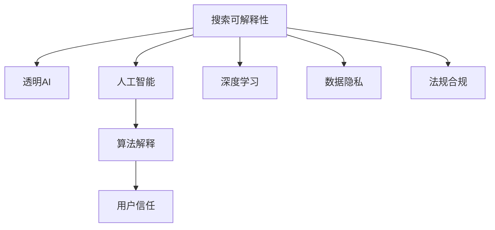

                 

# 提高搜索可解释性：AI的透明度

> 关键词：搜索可解释性, 透明AI, 人工智能, 深度学习, 算法解释, 用户信任

## 1. 背景介绍

### 1.1 问题由来
随着人工智能(AI)技术的快速发展，深度学习模型在众多领域取得了显著的成果。然而，模型的复杂性不断增加，导致其决策过程难以解释和理解，这在一定程度上影响了用户的信任和接受度。特别是在医疗、金融等对决策透明度要求极高的领域，模型的不透明性往往会被放大，甚至导致误导性的决策。

### 1.2 问题核心关键点
在AI模型中，可解释性是指模型的决策过程可以被用户理解和解释。它不仅能帮助用户理解模型的输出，还能提升用户对模型的信任，使其在实际应用中更加可靠。目前，提高AI模型的可解释性成为研究的重点之一，尤其是在搜索场景中，模型的透明度直接关系到搜索结果的公正性和可信度。

### 1.3 问题研究意义
提高AI模型的可解释性，对于构建透明、可信的AI系统具有重要意义：

1. **增强用户信任**：透明的模型让用户能够理解和信服其输出结果，减少对AI的质疑和抵制。
2. **提高决策质量**：可解释性有助于发现模型的偏见和错误，及时调整优化，提升决策质量。
3. **推动法规合规**：透明性有助于满足数据隐私和算法透明的相关法规要求，保障用户权益。
4. **促进算法创新**：透明的算法设计更利于研究者理解问题本质，推动AI技术的发展和创新。
5. **提升应用价值**：可解释性有助于揭示模型的内在机制，为其他领域的应用提供借鉴，促进跨领域技术的融合和创新。

## 2. 核心概念与联系

### 2.1 核心概念概述

为更好地理解提高搜索可解释性的方法，本节将介绍几个关键概念及其相互关系：

- **搜索可解释性**：指用户能够理解搜索算法的工作原理和决策过程，明确搜索结果的生成机制。
- **透明AI**：指AI系统的决策和推理过程可以被用户清晰理解，具有一定的透明度和可解释性。
- **人工智能**：以深度学习为代表的智能技术，通过大量数据训练生成复杂的决策模型。
- **深度学习**：一种能够处理复杂数据和任务的高效学习范式，由多层神经网络组成。
- **算法解释**：通过一定的技术和方法，将模型复杂的内在表示转化为易于理解的形式。
- **用户信任**：用户对AI系统输出的信任和接受度，是系统成功应用的关键因素。

这些核心概念之间的逻辑关系可以通过以下Mermaid流程图来展示：



该流程图展示了从搜索可解释性到透明AI的整个链条，其中涉及了人工智能、深度学习和算法解释等多个关键概念，以及用户信任和数据隐私、法规合规等重要考量。

## 3. 核心算法原理 & 具体操作步骤
### 3.1 算法原理概述

提高搜索可解释性的核心在于将复杂的内在表示转化为易于理解的形式。一般来说，这一过程可以分为两个阶段：模型解释和结果解释。模型解释主要是通过各种技术手段，将模型的决策机制解释清楚；结果解释则是对搜索结果进行清晰展示，让用户能够理解和信任输出结果。

### 3.2 算法步骤详解

**Step 1: 模型解释**

- **LIME**: 局部可解释模型-agnostic解释方法，通过生成与模型输出相关的简单模型，来解释复杂模型的决策。
- **SHAP**: 可解释的加性模型，通过将预测值分解为各个特征的影响和权重，提供逐特征的解释。
- **IBM AIX**: 结合人工智能和认知科学的解释方法，通过对用户提问和反馈，生成交互式的解释。

**Step 2: 结果解释**

- **可视化展示**：利用图表、树状图、热图等直观的方式，展示搜索结果的生成机制和关键特征。
- **交互式界面**：提供交互式界面，允许用户输入自定义查询，动态生成并解释搜索结果。
- **文本解释**：通过自然语言生成技术，将搜索结果转换为易于理解的文本描述。

### 3.3 算法优缺点

**LIME的优点**：
- 适用于任何模型，不依赖特定架构。
- 生成简单的局部模型，易于理解。
- 解释精度高，适用于复杂决策场景。

**LIME的缺点**：
- 解释的局部性较强，难以解释全局行为。
- 计算复杂度较高，特别是对于高维数据和大型模型。

**SHAP的优点**：
- 提供逐特征的解释，解释结果更加细致。
- 易于理解和展示，适合非技术用户。
- 解释精度高，适用于各种模型。

**SHAP的缺点**：
- 对数据和模型的依赖较强，计算成本较高。
- 解释的复杂度较高，难以进行全局解释。

**IBM AIX的优点**：
- 结合认知科学，提供上下文相关的解释。
- 通过用户互动，动态生成解释。
- 解释的灵活性高，适合多种应用场景。

**IBM AIX的缺点**：
- 交互界面复杂，需要大量用户交互。
- 对模型的依赖性强，解释的精度和效果受模型影响。
- 实现难度较大，需要一定的技术积累。

### 3.4 算法应用领域

提高搜索可解释性的方法在多个领域都有应用，如医疗、金融、法律、智能客服等。

- **医疗领域**：帮助医生理解模型的诊断逻辑，增强对病患的解释能力，提升患者信任度。
- **金融领域**：解释贷款评估模型的决策过程，确保公正透明，增强用户对金融服务的信任。
- **法律领域**：解释法律推理模型的判决依据，确保司法公正，提升公众对司法的信任。
- **智能客服**：解释自动回复模型的推理逻辑，提高客户对AI客服的信任和满意度。

## 4. 数学模型和公式 & 详细讲解  
### 4.1 数学模型构建

在提高搜索可解释性中，常用的数学模型包括局部可解释模型(LIME)和可解释的加性模型(SHAP)。这里我们以LIME为例，构建数学模型。

**LIME模型**：
设模型为 $f(x)$，其中 $x$ 是输入特征向量，$f(x)$ 是模型的预测值。LIME的目的是找到一个简单的局部模型 $g(x)$，使得在给定的输入 $x_0$ 附近，$f(x)$ 和 $g(x)$ 的预测值尽可能接近，即：

$$
\min_{g(x)} \sum_{i=1}^{N} \ell(f(x_i), g(x_i))
$$

其中 $\ell$ 是损失函数，$x_1, x_2, ..., x_N$ 是在 $x_0$ 附近的样本点。

### 4.2 公式推导过程

**LIME的求解过程**：
1. 从训练数据中随机选择 $N$ 个样本点 $x_1, x_2, ..., x_N$，与输入点 $x_0$ 构成邻域。
2. 通过求解线性回归模型：
   $$
   g(x) = g_0 + \sum_{i=1}^{d} \alpha_i \phi_i(x)
   $$
   其中 $g_0$ 是模型截距，$\alpha_i$ 是权重，$\phi_i(x)$ 是特征 $x_i$ 的基函数。
3. 通过最小化损失函数 $\ell(f(x_0), g(x_0))$，得到最优的 $\alpha$ 和 $g_0$。
4. 得到局部解释模型 $g(x)$，其预测结果即为 $x_0$ 处的解释。

**SHAP的求解过程**：
1. 将预测结果 $f(x)$ 表示为一系列基函数的线性组合：
   $$
   f(x) = \sum_{i=1}^{d} s_i(x) + b
   $$
   其中 $s_i(x)$ 是SHAP值，$b$ 是偏置项。
2. 通过求解线性回归模型：
   $$
   s_i(x) = \alpha_i f(x) - \beta_i
   $$
   其中 $\alpha_i$ 和 $\beta_i$ 是线性回归的参数。
3. 将每个特征 $x_i$ 的SHAP值 $\phi_i(x)$ 求和，即得到全局解释模型。

### 4.3 案例分析与讲解

**案例一：医疗影像诊断**

假设有一个深度学习模型用于医疗影像的肿瘤诊断，模型输入为影像特征，输出为肿瘤是否存在的概率。通过LIME，可以得到每个影像特征对模型输出的影响，从而解释模型诊断的依据。例如，模型可能对影像中肿瘤的边缘特征更加敏感，而对内部结构不太关注。

**案例二：金融贷款评估**

假设有一个深度学习模型用于评估贷款申请的信用风险，模型输入为申请人的经济状况和信用历史，输出为贷款批准的概率。通过SHAP，可以得到每个特征对模型输出的影响，例如申请人收入、贷款额度等特征对信用评估的影响。

## 5. 项目实践：代码实例和详细解释说明
### 5.1 开发环境搭建

在进行搜索可解释性的项目实践前，我们需要准备好开发环境。以下是使用Python进行TensorFlow开发的环境配置流程：

1. 安装Anaconda：从官网下载并安装Anaconda，用于创建独立的Python环境。

2. 创建并激活虚拟环境：
```bash
conda create -n tf-env python=3.8 
conda activate tf-env
```

3. 安装TensorFlow：根据CUDA版本，从官网获取对应的安装命令。例如：
```bash
conda install tensorflow=2.7 
conda install tensorflow-io
```

4. 安装TensorBoard：
```bash
pip install tensorboard
```

5. 安装Pandas、Numpy等库：
```bash
pip install pandas numpy matplotlib
```

完成上述步骤后，即可在`tf-env`环境中开始搜索可解释性的实践。

### 5.2 源代码详细实现

下面以金融贷款评估为例，展示使用TensorFlow进行贷款信用评估模型的解释。

首先，定义贷款评估模型的输入和输出：

```python
import tensorflow as tf

# 定义模型输入和输出
x = tf.keras.layers.Input(shape=(3,), name='features')
y = tf.keras.layers.Dense(units=1, activation='sigmoid')(x)

model = tf.keras.Model(inputs=x, outputs=y)
```

然后，定义解释模型LIME：

```python
from lime.lime_tabular import LimeTabularExplainer

# 创建解释器
explainer = LimeTabularExplainer(data, classes=labels, feature_names=['feature1', 'feature2', 'feature3'], discretize_continuous=True)

# 生成解释模型
explica_model = explainer.explain_instance(input, model.predict)
```

最后，进行模型解释和结果展示：

```python
# 输出解释结果
print(explica_model.as_list())

# 绘制解释图
explica_model.display(target=1, feature_names=['feature1', 'feature2', 'feature3'])
```

以上就是使用TensorFlow对金融贷款评估模型进行解释的完整代码实现。可以看到，通过LIME，我们可以快速生成每个特征对模型输出的影响，为模型的决策过程提供直观的解释。

### 5.3 代码解读与分析

让我们再详细解读一下关键代码的实现细节：

**Input层和Dense层**：
- 定义模型的输入和输出，使用Dense层构建二分类模型。

**LimeTabularExplainer**：
- 创建解释器，定义特征列表和输出类别标签，并设置连续特征的离散化处理。
- 使用explain_instance方法生成解释模型，输入为样本特征向量，模型为贷款评估模型，生成每个特征的解释。

**输出解释**：
- 输出解释结果，以列表形式展示每个特征对模型输出的影响。
- 绘制解释图，通过交互式界面展示每个特征对模型输出的贡献度。

通过LIME，我们可以直观地理解模型决策过程，为金融贷款评估提供透明的解释，增强用户对AI系统的信任。

当然，在实际应用中，还需要根据具体任务调整模型结构和参数，进行细致的数据预处理和特征工程，确保模型解释的准确性和可靠性。

## 6. 实际应用场景
### 6.1 金融贷款评估

基于搜索可解释性的金融贷款评估模型，可以广泛应用于银行业务的信用风险管理。传统贷款评估依赖人工审批，存在主观性和局限性。而使用基于可解释性的贷款评估模型，可以实时自动生成贷款审批结果，并提供透明的解释，确保贷款审批的公正性和准确性。

在技术实现上，可以收集贷款申请人的收入、负债、信用历史等数据，构建深度学习模型进行贷款评估，并结合LIME或SHAP等方法进行解释。模型输出的解释可以帮助用户理解模型对贷款申请的决策依据，增强对AI系统的信任。

### 6.2 医疗影像诊断

在医疗影像诊断领域，基于搜索可解释性的AI模型可以提升医生的诊断效率和准确性。医生面对大量的影像数据，需要耗费大量时间进行诊断。而使用AI模型进行初步筛查，并提供可解释的诊断依据，能够大幅减少医生的工作量，提升诊断质量。

在技术实现上，可以收集大量的医疗影像数据，构建深度学习模型进行肿瘤诊断，并使用LIME等方法对诊断结果进行解释。解释结果可以帮助医生理解模型对影像的诊断依据，提高诊断的准确性和可信度。

### 6.3 智能客服

智能客服系统中的AI模型，能够通过搜索可解释性技术，提供透明的对话过程，增强用户对AI客服的信任和满意度。用户在使用智能客服时，往往需要了解AI的推理逻辑和决策依据。通过可解释性的技术，客服系统可以向用户展示每次对话的推理过程，提供详细的解释，增强用户体验。

在技术实现上，可以收集历史对话记录，构建对话模型进行自动回复，并使用IBM AIX等方法生成对话解释。解释结果可以动态展示在对话界面上，供用户查阅。

## 7. 工具和资源推荐
### 7.1 学习资源推荐

为了帮助开发者系统掌握提高搜索可解释性的技术基础和实践技巧，这里推荐一些优质的学习资源：

1. 《深度学习入门》系列书籍：深入浅出地介绍了深度学习的基本原理和常用技术，适合初学者入门。
2. 《TensorFlow实战Google深度学习》书籍：由Google官方出品，全面介绍了TensorFlow的实现原理和应用案例，是深度学习开发的必备资料。
3. 《LIME: Explaining the predictions of any differentiable classifier》论文：LIME的原始论文，详细介绍了LIME算法的原理和实现方法。
4. 《SHAP: A Unified Approach to Interpreting Model Predictions》论文：SHAP的原始论文，介绍了可解释性加性模型的原理和应用。
5. 《IBM AIX: Explaining the Output of an AI》论文：IBM AIX的原始论文，介绍了结合认知科学的AI解释方法。

通过对这些资源的学习实践，相信你一定能够快速掌握提高搜索可解释性的精髓，并用于解决实际的NLP问题。

### 7.2 开发工具推荐

高效的开发离不开优秀的工具支持。以下是几款用于提高搜索可解释性开发的常用工具：

1. TensorFlow：由Google主导开发的开源深度学习框架，生产部署方便，适合大规模工程应用。支持多种模型解释方法，如LIME、SHAP等。
2. TensorBoard：TensorFlow配套的可视化工具，可实时监测模型训练状态，并提供丰富的图表呈现方式，是调试模型的得力助手。
3. LIME：提供简单易用的Python库，用于生成局部可解释模型，支持多种解释方法和模型。
4. SHAP：提供Python库，用于生成可解释性加性模型，支持多种模型和特征类型。
5. IBM AIX：结合认知科学的解释方法，提供交互式解释界面，支持多种模型和特征类型。
6. Weights & Biases：模型训练的实验跟踪工具，可以记录和可视化模型训练过程中的各项指标，方便对比和调优。

合理利用这些工具，可以显著提升搜索可解释性的开发效率，加快创新迭代的步伐。

### 7.3 相关论文推荐

提高搜索可解释性的研究源于学界的持续研究。以下是几篇奠基性的相关论文，推荐阅读：

1. Ribeiro et al., "Why should I trust you?" Explaining the predictions of any differentiable classifier：LIME算法的原始论文，详细介绍了局部可解释模型的原理和实现方法。
2. Lundberg et al., "A Unified Approach to Interpreting Model Predictions”：SHAP算法的原始论文，介绍了可解释性加性模型的原理和应用。
3. Hadi Fanaee-T et al., "Interpretable Models Using Space-Filling Curves”：提出了基于分形曲线的解释方法，为提高搜索可解释性提供了新的思路。
4. Kim et al., "Explaining the Predictions of Deep Neural Networks”：总结了深度学习模型解释的多种方法，为不同模型和任务提供了参考。

这些论文代表了大语言模型微调技术的发展脉络。通过学习这些前沿成果，可以帮助研究者把握学科前进方向，激发更多的创新灵感。

## 8. 总结：未来发展趋势与挑战
### 8.1 总结

本文对提高搜索可解释性的方法进行了全面系统的介绍。首先阐述了搜索可解释性的重要性和研究背景，明确了透明AI在实际应用中的意义和价值。其次，从原理到实践，详细讲解了模型解释和结果解释的数学模型和实现方法，给出了模型解释的具体代码实例。同时，本文还广泛探讨了提高搜索可解释性的方法在多个行业领域的应用前景，展示了透明AI的巨大潜力。此外，本文精选了提高搜索可解释性的各类学习资源，力求为读者提供全方位的技术指引。

通过本文的系统梳理，可以看到，提高搜索可解释性的方法在AI系统中的应用前景广阔，不仅能够提升模型的透明度和可信度，还能增强用户对AI系统的信任和接受度。未来，伴随技术不断进步，透明AI将在更多领域发挥其独特价值，成为AI技术发展的重要推动力。

### 8.2 未来发展趋势

展望未来，提高搜索可解释性的技术将呈现以下几个发展趋势：

1. **算法多样性**：未来将出现更多高效、灵活的模型解释和结果展示方法，满足不同任务和用户需求。
2. **自动化解释**：借助自动化技术和人工智能，实现模型的自动解释和报告生成，降低解释成本和难度。
3. **多模态解释**：结合文本、图像、语音等多模态数据，提供更全面、详细的解释，提升用户理解度。
4. **交互式解释**：通过交互式界面和自然语言生成技术，实现动态解释，增强用户互动体验。
5. **联邦学习解释**：在分布式系统上，实现模型解释的分布式计算，保护数据隐私的同时提供透明解释。
6. **跨领域应用**：提高搜索可解释性的方法将拓展到更多领域，如医疗、金融、法律、教育等，提升各行业的AI应用水平。

这些趋势凸显了提高搜索可解释性技术的前景和重要性。未来的研究需要在算法、技术和应用等多个方面不断探索，才能更好地服务于透明AI的发展。

### 8.3 面临的挑战

尽管提高搜索可解释性的技术取得了显著进展，但在实现透明AI的过程中，仍面临诸多挑战：

1. **解释精度和准确性**：模型解释的精度和准确性直接关系到用户对AI系统的信任。如何提高解释的可靠性和有效性，仍然是一个难题。
2. **计算成本和资源消耗**：生成复杂解释模型和高精度解释结果，往往需要较大的计算资源，如何降低计算成本，是提高搜索可解释性的重要方向。
3. **解释的可解释性**：解释模型本身也需要可解释，否则解释模型的输出仍然难以理解。如何构建可解释性强的解释模型，是未来研究的关键。
4. **用户需求的多样性**：不同用户对解释的需求不同，如何提供个性化的解释服务，满足不同用户的需求，是提高搜索可解释性的重要任务。
5. **隐私和数据安全**：在生成解释的过程中，如何保护用户隐私和数据安全，避免数据泄露和滥用，是提高搜索可解释性必须解决的问题。

这些挑战需要研究者不断探索和优化，才能实现透明AI的广泛应用。

### 8.4 研究展望

面对提高搜索可解释性所面临的种种挑战，未来的研究需要在以下几个方面寻求新的突破：

1. **优化模型解释算法**：结合多种解释方法，如LIME、SHAP、IBM AIX等，实现多种方法的组合和优化，提升解释精度和效果。
2. **引入新解释技术**：引入新的解释技术，如符号化推理、因果推断等，增强解释的全面性和逻辑性。
3. **增强解释模型可解释性**：开发可解释性强的解释模型，降低解释本身的复杂度，提升解释的可靠性和可用性。
4. **构建多模态解释系统**：结合文本、图像、语音等多模态数据，构建全面的解释系统，提升用户对AI系统的理解和信任。
5. **推动法规和标准建设**：制定和推广AI透明度的法规和标准，推动透明AI在各行业的应用，保障用户权益。
6. **提高AI系统的可解释性**：从模型设计、训练、优化等多个环节入手，提高AI系统的可解释性，促进AI技术的发展和应用。

这些研究方向将引领提高搜索可解释性技术迈向更高的台阶，为构建透明、可信的AI系统铺平道路。面向未来，提高搜索可解释性技术还需要与其他人工智能技术进行更深入的融合，如知识表示、因果推理、强化学习等，多路径协同发力，共同推动自然语言理解和智能交互系统的进步。只有勇于创新、敢于突破，才能不断拓展语言模型的边界，让智能技术更好地造福人类社会。

## 9. 附录：常见问题与解答

**Q1: 提高搜索可解释性对AI系统的影响有哪些？**

A: 提高搜索可解释性对AI系统有以下几方面的影响：
1. **增强用户信任**：透明的模型让用户能够理解和信服其输出结果，减少对AI的质疑和抵制。
2. **提高决策质量**：可解释性有助于发现模型的偏见和错误，及时调整优化，提升决策质量。
3. **推动法规合规**：透明性有助于满足数据隐私和算法透明的相关法规要求，保障用户权益。
4. **促进算法创新**：透明的算法设计更利于研究者理解问题本质，推动AI技术的发展和创新。
5. **提升应用价值**：可解释性有助于揭示模型的内在机制，为其他领域的应用提供借鉴，促进跨领域技术的融合和创新。

**Q2: 提高搜索可解释性时，如何选择解释方法？**

A: 选择合适的解释方法需要考虑多个因素，包括模型类型、任务需求、用户背景等。一般来说，可以采用以下策略：
1. **多方法结合**：结合多种解释方法，如LIME、SHAP、IBM AIX等，综合各方法的优点，提升解释效果。
2. **用户需求优先**：根据用户对解释的需求和背景，选择最合适的解释方法。例如，非技术用户可能更适合使用可视化展示，而技术用户可能更倾向于数学模型和计算结果。
3. **模型特性分析**：分析模型的特性和行为，选择最适合的解释方法。例如，对于复杂模型，LIME和SHAP等方法可能更适合；对于简单模型，文本解释和可视化展示可能更合适。

**Q3: 提高搜索可解释性的过程中，如何平衡模型性能和解释成本？**

A: 在提高搜索可解释性的过程中，平衡模型性能和解释成本是关键问题。一般来说，可以采用以下策略：
1. **动态解释**：在模型推理时，动态生成解释，减少解释成本。例如，在机器翻译模型中，动态生成翻译解释，实时展示每个单词的翻译过程。
2. **分层解释**：将解释分层，先在关键层上生成解释，再逐步向下生成更详细的解释。例如，在图像识别模型中，先生成类别层解释，再生成像素层解释。
3. **解释精简**：对于次要特征和细节，可以采用简化的解释方法，减少解释复杂度。例如，在贷款评估模型中，先解释主要特征对贷款评估的影响，再解释次要特征。
4. **模型简化**：在不显著降低模型性能的前提下，简化模型结构，减少计算复杂度，从而降低解释成本。例如，在自然语言处理模型中，使用较小的模型或剪枝方法，减少计算复杂度。

**Q4: 提高搜索可解释性的过程中，如何确保解释的可解释性？**

A: 确保解释的可解释性是提高搜索可解释性的重要问题。一般来说，可以采用以下策略：
1. **可视化展示**：使用图表、树状图、热图等直观的方式，展示解释结果，确保解释易于理解和接受。例如，在医疗影像诊断中，使用热图展示模型对影像中不同区域的关注度。
2. **文本解释**：通过自然语言生成技术，将解释结果转换为易于理解的文本描述，确保解释的全面性和逻辑性。例如，在金融贷款评估中，使用文本描述解释模型对贷款申请的决策依据。
3. **多模态融合**：结合文本、图像、语音等多模态数据，提供更全面、详细的解释，确保解释的可解释性。例如，在智能客服中，结合文字和语音数据，生成多模态解释。
4. **用户互动**：通过用户互动，动态生成和优化解释，确保解释的全面性和逻辑性。例如，在医疗诊断中，通过用户反馈，动态调整解释结果。

通过这些策略，可以确保解释的可解释性，提升用户对AI系统的理解和信任。

---

作者：禅与计算机程序设计艺术 / Zen and the Art of Computer Programming

