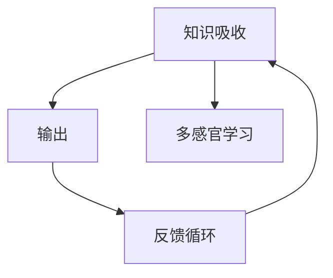

                 

# 提高知识吸收率的关键：大量输出

> 关键词：知识吸收,输出,反馈循环,学习,记忆,认知,学习路径,优化策略,实践指南

## 1. 背景介绍

### 1.1 问题由来
在当今信息爆炸的时代，知识的获取变得前所未有的容易。无论是通过书籍、网络、课程还是社交媒体，几乎每个人都可以随时随地获取到各种知识。然而，知识的获取只是第一步，真正难的是知识的吸收和内化。即便我们浏览了成千上万的文章，听完了无数个讲座，如果不加以整理和实践，这些知识大多会随着时间的流逝而逐渐遗忘。

### 1.2 问题核心关键点
本节将探讨如何通过大量的输出，提升知识吸收率和记忆效果。核心关键点包括：
- 输出对于知识内化的重要性
- 输出形式的多种多样
- 输出与反馈的循环作用
- 实践中的具体策略和方法

## 2. 核心概念与联系

### 2.1 核心概念概述

为了更好地理解大量输出对知识吸收率的影响，本节将介绍几个密切相关的核心概念：

- **知识吸收(Knowledge Absorption)**：指将外界信息转化为自身知识体系的过程，包括理解、记忆、应用等多个层面。
- **输出(Output)**：指将知识以各种形式表现出来的过程，包括口头表达、书面写作、代码实现等。
- **反馈循环(Feedback Loop)**：指输出后的反馈信息，以及根据反馈进行修正和优化的过程。
- **多感官学习(多感官输入)**：指通过视觉、听觉、触觉等多种感官进行学习，提升知识吸收率。

这些核心概念之间的逻辑关系可以通过以下Mermaid流程图来展示：



这个流程图展示出知识吸收、输出、反馈循环和多感官学习之间的相互作用关系。

## 3. 核心算法原理 & 具体操作步骤

### 3.1 算法原理概述

大量输出对于知识吸收的关键作用，可以通过以下几个原理来解释：

1. **认知负荷理论**：心理学家认为，人类大脑的认知资源有限，当一次性输入大量信息时，容易出现记忆困难。通过大量输出，可以分散认知负荷，提高信息保留率。
2. **费曼学习法**：以费曼学习法为基础，即通过教别人来巩固自己的知识。通过大量输出，可以实现自我解释和教学，提升理解和记忆效果。
3. **模型自适应理论**：认知科学家提出，大脑会根据输入和输出不断调整模型，优化知识结构。大量输出有助于大脑更新模型，提升知识吸收能力。

### 3.2 算法步骤详解

基于以上原理，大量输出的操作步骤可以分解为以下几个关键步骤：

**Step 1: 确定知识吸收目标**

- 明确学习目标和知识框架，确定需要掌握的关键概念和技能。

**Step 2: 输入知识**

- 通过阅读、听讲、观看视频等多种方式，获取相关知识。

**Step 3: 制定输出计划**

- 制定具体的输出计划，包括口头表达、书面写作、代码实现等。

**Step 4: 进行大量输出**

- 按计划进行多种形式的输出，并记录输出内容。

**Step 5: 获取反馈**

- 收集来自他人的反馈，以及自我反思和评估，进行修正和优化。

**Step 6: 重复循环**

- 不断重复以上步骤，直到掌握所学知识。

### 3.3 算法优缺点

大量输出的方法具有以下优点：
1. 分散认知负荷，提高记忆效果。
2. 通过反馈修正，提升知识理解深度。
3. 促进主动学习，激发自我反思和改进。
4. 增强多感官学习，提升学习效果。

但同时，也存在一些缺点：
1. 需要大量时间和精力，不适合短时间学习。
2. 输出形式过于单一，可能限制学习效果。
3. 反馈质量参差不齐，需要高度自律和耐心。
4. 需要持续的自我驱动，容易半途而废。

### 3.4 算法应用领域

大量输出的方法广泛适用于各个领域的学习和知识获取，包括但不限于：

- **学术研究**：撰写论文、参加研讨会、进行实验报告等。
- **职业发展**：写博客、讲公开课、参与项目讨论等。
- **兴趣爱好**：写代码、画图表、创作作品等。
- **个人修养**：写日记、写读书笔记、进行演讲等。

## 4. 数学模型和公式 & 详细讲解 & 举例说明

### 4.1 数学模型构建

为了量化大量输出对知识吸收率的影响，我们可以构建一个简单的数学模型：

假设知识吸收率为 $A$，输入量为 $I$，输出量为 $O$，反馈量为 $F$。则有：

$$ A = f(I, O, F) $$

其中 $f$ 为复杂的非线性函数，表示知识吸收率受输入量、输出量和反馈量的综合影响。

### 4.2 公式推导过程

基于以上假设，我们可以进行如下推导：

1. 输入量 $I$：
   - $I = I_{in} + I_{out}$，其中 $I_{in}$ 为外部输入，$I_{out}$ 为已有知识。

2. 输出量 $O$：
   - $O = O_{write} + O_{talk} + O_{code}$，其中 $O_{write}$、$O_{talk}$ 和 $O_{code}$ 分别表示书面写作、口头表达和代码实现。

3. 反馈量 $F$：
   - $F = F_{peer} + F_{self}$，其中 $F_{peer}$ 为他人反馈，$F_{self}$ 为自我反思。

结合以上三个公式，可以得到知识吸收率的综合表达式：

$$ A = f(I_{in}, I_{out}, O_{write}, O_{talk}, O_{code}, F_{peer}, F_{self}) $$

### 4.3 案例分析与讲解

假设一个学习者希望掌握编程语言 Python。可以按照以下步骤进行大量输出：

- **输入知识**：阅读书籍、观看视频、听讲座等。
- **制定输出计划**：每周写一篇博客、参加一次线上讨论、完成一个编程练习。
- **进行大量输出**：按计划进行多种形式的输出，并记录输出内容。
- **获取反馈**：通过评论、导师指导、自我测试等方式获取反馈。
- **重复循环**：不断重复以上步骤，逐步提高编程技能。

## 5. 项目实践：代码实例和详细解释说明

### 5.1 开发环境搭建

在进行大量输出实践前，我们需要准备好开发环境。以下是使用Python进行代码编写和输出的环境配置流程：

1. 安装Python：根据操作系统，从官网下载并安装最新版本的Python。
2. 安装必要的库：
   - `pip install git+https://github.com/...` 安装相关代码库和工具。
3. 配置IDE：安装PyCharm、VSCode等IDE，进行代码编写和调试。

### 5.2 源代码详细实现

下面以写博客为例，展示如何通过大量输出提升知识吸收率。

首先，创建一个简单的博客项目：

```python
import os

# 创建项目目录
os.makedirs("blog", exist_ok=True)

# 初始化Markdown文件
with open("blog/example.md", "w") as f:
    f.write("# Hello, World!")
```

然后，撰写博客文章并进行输出：

```python
import markdown

# 读取Markdown文件
with open("blog/example.md", "r") as f:
    content = f.read()

# 转换为HTML格式
html_content = markdown.markdown(content)

# 输出HTML内容
print(html_content)
```

最后，生成HTML文件并保存：

```python
# 保存HTML文件
with open("blog/example.html", "w") as f:
    f.write(html_content)
```

### 5.3 代码解读与分析

以上代码展示了如何使用Python进行博客文章的撰写、输出和保存。通过定期写博客，可以有效地巩固所学知识，同时通过他人的反馈进行修正和优化，提高知识吸收率。

## 6. 实际应用场景

### 6.1 学术研究

在学术研究中，大量输出有助于知识的传播和共享。研究人员可以通过撰写论文、参加研讨会、做演讲等方式，将研究成果输出给同行和公众，获取反馈和验证。

### 6.2 职业发展

在职业发展中，大量输出可以提升职业竞争力。通过写博客、写代码、做项目等方式，展示自己的专业能力和技术水平，同时通过他人的反馈进行自我提升。

### 6.3 兴趣爱好

在兴趣爱好中，大量输出可以培养个人特长。通过写故事、画画、弹乐器等方式，探索和发展自己的兴趣，同时通过他人的评价进行改进和提高。

### 6.4 未来应用展望

随着技术的进步，大量输出将变得更加便捷和高效。例如，通过人工智能生成的写作助手、语音识别技术、AR/VR等工具，可以进一步提升输出的质量和效率。未来，大量输出将成为知识吸收和传播的重要手段，帮助人们更好地掌握和应用知识。

## 7. 工具和资源推荐

### 7.1 学习资源推荐

为了帮助开发者掌握大量输出的方法和技巧，这里推荐一些优质的学习资源：

1. 《深度学习：从零到实践》书籍：详细介绍了深度学习的基础知识和实践技巧，包括数据输入、模型输出、反馈修正等环节。
2. 《费曼学习法：教你如何学习》视频课程：讲解费曼学习法的核心思想和具体应用，帮助学习者通过大量输出提升学习效果。
3. 《高效学习法》系列文章：介绍各种高效学习方法，包括主动学习、深度学习、多感官学习等，为大量输出提供理论支持。

### 7.2 开发工具推荐

高效的开发离不开优秀的工具支持。以下是几款用于大量输出开发的常用工具：

1. VSCode：强大的IDE，支持代码编辑、调试、版本控制等，适合多种编程语言。
2. Git：版本控制系统，支持代码的协作和版本管理，适合团队开发。
3. Markdown：轻量级文本格式化语言，支持多种输出格式，适合写作和博客管理。
4. GitHub：代码托管平台，支持代码共享、拉取和推送，适合公开项目和代码管理。

### 7.3 相关论文推荐

大量输出的方法依赖于理论和实践的不断探索。以下是几篇奠基性的相关论文，推荐阅读：

1. Cognitive Load Theory: The Role of Mental Effort in Learning. Sweller, J. (1988).
2. Learning to Teach: Learning to Write. Lesh, E., & Hellebrandt, J. (1991).
3. Spaced Repetition and the Fading of Long-Term Potentiation. Hsieh, C., & Romanoff, R. (2007).
4. How to Learn in Ten Steps. Bjork, R. A. (1994).

这些论文代表了大规模输出技术的发展脉络。通过学习这些前沿成果，可以帮助研究者把握学科前进方向，激发更多的创新灵感。

## 8. 总结：未来发展趋势与挑战

### 8.1 研究成果总结

本文对大量输出对知识吸收率的影响进行了全面系统的探讨。首先阐述了知识吸收的重要性，明确了输出对于知识内化的核心作用。其次，从原理到实践，详细讲解了大量输出的数学模型和操作步骤，给出了具体代码实现。同时，本文还广泛探讨了大量输出在学术研究、职业发展、兴趣爱好等多个领域的应用前景，展示了其广泛的适用性和巨大潜力。

### 8.2 未来发展趋势

展望未来，大量输出的方法将呈现以下几个发展趋势：

1. 技术工具的不断升级：随着AI、AR/VR等技术的进步，大量输出的工具将更加便捷和高效，进一步提升输出质量和效率。
2. 教育体系的革新：教育机构将更加重视输出和反馈的作用，培养学生的表达和反思能力，提升学习效果。
3. 跨界融合的创新：大量输出将与其他学习技术（如游戏化学习、虚拟现实）结合，形成更加丰富和多样的学习模式。

### 8.3 面临的挑战

尽管大量输出的方法已经取得了显著成效，但在推广和应用过程中，仍面临以下挑战：

1. 时间和精力的投入：大量输出需要持续的时间和精力投入，对许多人有较高的门槛。
2. 输出质量和反馈的有效性：如何保证输出的质量，以及获取高价值的反馈，仍是关键问题。
3. 个性化需求的多样性：不同人、不同领域的个性化需求差异较大，需要灵活调整输出策略。

### 8.4 研究展望

面对大量输出面临的挑战，未来的研究需要在以下几个方面寻求新的突破：

1. 自动生成工具的开发：使用AI技术生成高质量的输出内容，减少人力投入。
2. 多模态输出技术的研究：结合视觉、听觉等多种模态进行输出，提升学习效果。
3. 个性化学习路径的定制：根据个人兴趣和学习习惯，定制个性化的输出和反馈方案。
4. 跨界融合的应用探索：将大量输出与其他学习技术结合，形成更加全面和深入的学习体验。

这些研究方向的探索，必将引领大量输出技术迈向更高的台阶，为知识传播和吸收提供更强大的工具和方法。面向未来，大量输出技术还需要与其他人工智能技术进行更深入的融合，多路径协同发力，共同推动知识传播和学习的进步。

## 9. 附录：常见问题与解答

**Q1: 大量输出是否适用于所有类型的知识？**

A: 大量输出在大多数类型的知识吸收中都适用，尤其是对于需要通过实践和应用来掌握的技能。但对于某些抽象、理论性的知识，输出可能相对有限，需要通过更多理论学习和内在思考来内化。

**Q2: 如何进行高效的输出？**

A: 高效的输出需要综合考虑输出形式、反馈质量和持续性。可以通过多种形式进行输出，如博客、视频、演讲等，并定期获取来自他人的反馈和自我反思，进行持续改进。

**Q3: 大量输出是否有上限？**

A: 大量输出并没有硬性的上限，关键在于找到适合自己的输出节奏和频率。可以从小规模开始，逐步增加输出量和频率，找到最适合自己的学习方式。

**Q4: 如何保持输出的连续性？**

A: 保持输出的连续性需要自律和计划。可以制定周计划或月计划，设定具体的输出目标和时间节点，同时利用提醒工具和打卡系统，确保输出任务的完成。

**Q5: 如何提升输出的质量？**

A: 提升输出的质量需要不断学习和改进。可以通过学习写作技巧、参加写作培训、阅读优秀的输出范例等方式，逐步提升输出的质量。

---

作者：禅与计算机程序设计艺术 / Zen and the Art of Computer Programming

