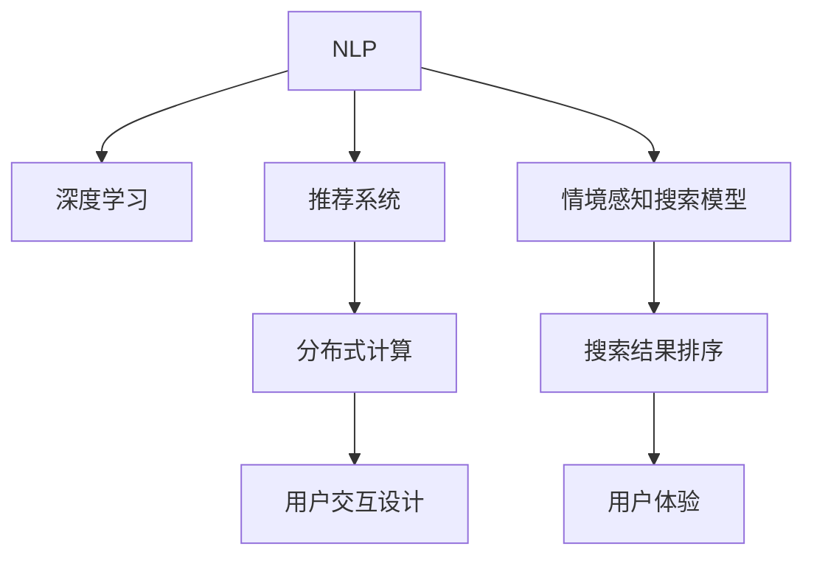

                 

# 搜索引擎的情境感知能力提升

> 关键词：情境感知搜索引擎，自然语言处理(NLP)，深度学习，推荐系统，用户体验

## 1. 背景介绍

### 1.1 问题由来
在互联网快速发展的今天，搜索引擎作为信息获取的重要工具，其能力越来越受到用户和市场的关注。然而，传统的搜索引擎往往局限于基于关键词的机械匹配，无法理解查询背后的语义和上下文信息，导致搜索结果的相关性和准确性不足。为了更好地解决这一问题，提升用户搜索体验，情境感知搜索引擎成为近年来的研究热点。

情境感知搜索引擎通过整合用户的搜索历史、地理位置、设备信息等上下文信息，结合自然语言处理(NLP)、深度学习等前沿技术，构建更加智能、精准的搜索模型，从而为用户提供更符合其真实需求的结果。

### 1.2 问题核心关键点
情境感知搜索引擎的实现主要依赖以下关键技术：
- 自然语言处理（NLP）：用于解析用户查询的语义信息，识别查询意图和关键词。
- 深度学习：构建能够理解上下文信息的神经网络模型，提升搜索排序的准确性。
- 推荐系统：结合用户的兴趣偏好和历史行为数据，推荐最相关的搜索结果。
- 用户交互设计：优化界面和交互方式，增强用户的使用体验。
- 分布式计算：使用分布式算法和大规模数据处理能力，支撑大规模查询和复杂情境的实时响应。

这些关键技术共同构建了情境感知搜索引擎的核心能力，使其能够在处理多样化的用户查询时，提供更加智能、精准、个性化的搜索结果。

### 1.3 问题研究意义
提升搜索引擎的情境感知能力，对于改善用户体验、提升信息获取效率、推动搜索引擎的智能化和个性化发展具有重要意义：

1. **改善用户体验**：通过理解用户的真实需求，提供更加精准、相关的搜索结果，减少用户的搜索时间，提高用户满意度。
2. **提升信息获取效率**：通过优化搜索结果排序，减少无效信息的干扰，让用户能够快速找到所需内容。
3. **推动搜索引擎智能化和个性化发展**：结合NLP、深度学习等技术，构建更加智能、个性化的搜索模型，使搜索引擎能够更好地适应用户需求的多样性和复杂性。
4. **增强市场竞争力**：通过提供更优质的搜索体验，吸引和留住更多用户，提升搜索引擎的市场份额和影响力。

## 2. 核心概念与联系

### 2.1 核心概念概述

为了更好地理解情境感知搜索引擎的核心工作机制，我们首先介绍几个核心概念：

- **自然语言处理（NLP）**：涉及文本分析、语义理解、情感分析等技术，用于解析用户查询和网页内容，提取关键词和意图。
- **深度学习**：通过构建神经网络模型，训练模型自动学习特征和模式，提升模型的泛化能力。
- **推荐系统**：结合用户行为数据和历史偏好，推荐最相关的搜索结果，提升用户体验。
- **分布式计算**：利用多台计算机协同处理大规模数据，实现高吞吐量和低延迟的搜索服务。
- **用户交互设计**：优化搜索界面和交互流程，提升用户操作便利性和使用效率。

这些核心概念之间的逻辑关系可以通过以下Mermaid流程图来展示：



这个流程图展示了情境感知搜索引擎的核心概念及其之间的关系：

1. NLP解析查询和网页内容，深度学习提取语义特征，共同构建情境感知搜索模型。
2. 推荐系统结合用户行为数据，提供个性化搜索结果。
3. 分布式计算支撑大规模查询和复杂情境的实时响应。
4. 用户交互设计优化搜索体验，提升用户满意度。

## 3. 核心算法原理 & 具体操作步骤
### 3.1 算法原理概述

情境感知搜索引擎的核心算法原理可以归纳为以下步骤：

1. **自然语言处理**：解析用户查询的语义信息，提取关键词和意图，并将其转化为机器可理解的向量表示。
2. **深度学习**：构建神经网络模型，利用大规模无标签文本数据进行预训练，学习语言表示和上下文关系。
3. **推荐系统**：结合用户历史行为数据和实时查询，推荐最相关的网页。
4. **分布式计算**：利用多台计算机并行处理查询，实现高吞吐量和低延迟。
5. **用户交互设计**：优化搜索界面和交互方式，提升用户操作便利性和使用效率。

在实际应用中，这些步骤并不是孤立的，而是相互交织、相互补充，共同提升搜索引擎的性能。

### 3.2 算法步骤详解

情境感知搜索引擎的实现主要包括以下几个关键步骤：

**Step 1: 数据收集与预处理**
- 收集用户的历史查询记录、搜索行为数据、地理位置信息、设备信息等上下文数据。
- 对原始数据进行清洗、去重、格式化等预处理，以确保数据的准确性和一致性。

**Step 2: 自然语言处理（NLP）**
- 使用NLP技术解析用户查询，提取关键词、实体、关系等语义信息。
- 将查询转化为向量表示，如词袋模型、TF-IDF等。

**Step 3: 深度学习模型构建与训练**
- 选择合适的深度学习模型（如Transformer、BERT等），并根据任务需求进行微调。
- 使用大规模无标签文本数据进行预训练，学习语言表示和上下文关系。
- 在标注数据上进行微调，使模型能够理解特定情境下的查询。

**Step 4: 推荐系统构建与优化**
- 结合用户历史行为数据和实时查询，构建推荐模型，如协同过滤、基于内容的推荐等。
- 使用强化学习等技术，优化推荐算法，提升推荐效果。

**Step 5: 分布式计算与系统优化**
- 利用分布式计算框架（如Hadoop、Spark等），实现大规模查询的并行处理。
- 优化系统架构，提高查询响应速度和稳定性。

**Step 6: 用户交互设计**
- 优化搜索界面和交互方式，增强用户体验。
- 提供搜索建议、相关性排序、自动补全等功能，提升用户搜索效率。

以上是情境感知搜索引擎的一般流程。在实际应用中，还需要针对具体任务进行优化设计，如改进推荐算法、引入更多上下文信息、优化模型结构等，以进一步提升搜索引擎的性能。

### 3.3 算法优缺点

情境感知搜索引擎的优势在于：
1. 高度定制化。能够根据用户特定情境提供个性化的搜索结果，提升用户体验。
2. 高准确性。结合NLP和深度学习技术，能够理解查询的语义和上下文，提升搜索结果的相关性和准确性。
3. 高效性。利用分布式计算技术，能够处理大规模查询，实现高吞吐量和低延迟。

然而，情境感知搜索引擎也存在一些局限性：
1. 数据隐私问题。需要收集大量用户数据，涉及隐私保护和数据安全问题。
2. 模型复杂性。深度学习模型复杂度较高，训练和推理资源需求大。
3. 模型泛化能力。模型可能过度拟合训练数据，导致泛化性能不足。
4. 交互设计复杂性。用户交互设计需要不断迭代优化，提升用户体验。

尽管存在这些局限性，但情境感知搜索引擎已经在实际应用中取得了显著效果，成为提升搜索体验的重要手段。未来相关研究的方向将集中在如何更好地平衡性能和资源、提高模型的泛化能力、优化用户交互设计等方面。

### 3.4 算法应用领域

情境感知搜索引擎技术已经在多个领域得到应用，例如：

- **电商搜索**：结合用户购物行为和查询关键词，推荐最相关的商品。
- **新闻推荐**：根据用户阅读历史和兴趣偏好，推荐最新的新闻内容。
- **社交媒体搜索**：根据用户的社交行为和搜索记录，推荐最相关的社交内容。
- **学术搜索**：结合用户的学术兴趣和研究领域，推荐最相关的学术论文和文献。
- **医疗搜索**：结合患者的症状和历史记录，推荐最相关的医疗信息。

除了上述这些经典应用外，情境感知搜索引擎还被创新性地应用到更多场景中，如可控搜索、个性化问答、智能客服等，为各类应用系统带来了全新的搜索体验。

## 4. 数学模型和公式 & 详细讲解  
### 4.1 数学模型构建

情境感知搜索引擎的数学模型可以归纳为以下几个方面：

**自然语言处理（NLP）**
- **词向量表示**：将查询和网页文本转化为向量表示。常见的方法包括词袋模型、TF-IDF、词嵌入（Word Embedding）等。
- **序列建模**：利用循环神经网络（RNN）、长短期记忆网络（LSTM）、Transformer等模型，构建序列建模框架，捕捉句子中的语义信息。

**深度学习模型**
- **自监督预训练**：使用大规模无标签文本数据，训练深度学习模型，学习语言表示和上下文关系。常见的自监督任务包括掩码语言模型（Masked Language Model, MLM）、下一句预测（Next Sentence Prediction, NSP）等。
- **有监督微调**：在标注数据上微调深度学习模型，使其能够理解特定情境下的查询。

**推荐系统**
- **协同过滤**：基于用户行为数据，推荐最相关的网页。
- **内容推荐**：结合网页内容和用户兴趣偏好，推荐最相关的网页。
- **深度推荐**：使用深度学习模型，如神经协同过滤（Neural Collaborative Filtering, NCF），提升推荐效果。

这些模型在数学上可以表示为如下的公式：

**自然语言处理（NLP）**
$$
\text{word\_vector}(x_i) = \mathbf{W} \cdot \mathbf{x}_i + \mathbf{b}
$$

**深度学习模型**
$$
\mathbf{h}_t = f(\mathbf{h}_{t-1}, \mathbf{x}_t)
$$
$$
\mathbf{y} = \mathbf{W} \cdot \mathbf{h}_T + \mathbf{b}
$$

**推荐系统**
$$
\mathbf{r}_u = \mathbf{W}_u \cdot \mathbf{I} + \mathbf{b}_u
$$
$$
\mathbf{y}_i = \sigma(\mathbf{W}_i \cdot \mathbf{r}_u + \mathbf{b}_i)
$$

其中，$\mathbf{W}$ 和 $\mathbf{b}$ 为模型参数，$f$ 为非线性激活函数，$\sigma$ 为sigmoid函数。

### 4.2 公式推导过程

以Transformer为例，介绍其工作原理和数学推导过程。

Transformer模型由编码器（Encoder）和解码器（Decoder）组成，其中编码器用于将查询和上下文信息转化为向量表示，解码器用于预测搜索结果的相关性。Transformer模型的关键在于其自注意力机制（Self-Attention），可以表示为如下公式：

$$
\mathbf{z} = \mathbf{W}^Q \cdot \mathbf{x} + \mathbf{b}^Q
$$
$$
\mathbf{z}_q = \mathbf{W}^Q \cdot \mathbf{q} + \mathbf{b}^Q
$$
$$
\mathbf{z}_k = \mathbf{W}^K \cdot \mathbf{k} + \mathbf{b}^K
$$
$$
\mathbf{z}_v = \mathbf{W}^V \cdot \mathbf{v} + \mathbf{b}^V
$$
$$
\mathbf{z}_s = \mathbf{z}_v \cdot (\mathbf{z}_k \cdot \mathbf{z}_q)^T
$$
$$
\mathbf{z}_o = \mathbf{W}^O \cdot \mathbf{z}_s + \mathbf{b}^O
$$

其中，$\mathbf{x}$ 为输入向量，$\mathbf{q}, \mathbf{k}, \mathbf{v}$ 分别为查询向量、键向量和值向量，$\mathbf{W}^Q, \mathbf{W}^K, \mathbf{W}^V, \mathbf{W}^O$ 为模型参数，$\mathbf{b}^Q, \mathbf{b}^K, \mathbf{b}^V, \mathbf{b}^O$ 为偏置项。

Transformer模型通过计算自注意力矩阵 $\mathbf{z}_s$，捕捉输入向量 $\mathbf{x}$ 中的语义关系，得到向量 $\mathbf{z}_o$ 作为最终输出。

### 4.3 案例分析与讲解

以新闻推荐系统为例，介绍情境感知搜索引擎的应用案例。

新闻推荐系统通过结合用户的历史阅读行为和当前查询，推荐最相关的新闻内容。其核心技术包括：

- **自然语言处理**：解析用户查询，提取关键词和实体，并将其转化为向量表示。
- **深度学习模型**：使用Transformer模型对新闻文本进行编码，学习新闻文本的语义表示。
- **推荐系统**：结合用户历史阅读记录和新闻文本的语义表示，构建推荐模型。

具体流程如下：

1. **自然语言处理**：将用户查询和新闻文本进行分词，提取关键词和实体，并将其转化为向量表示。
2. **深度学习模型**：使用Transformer模型对新闻文本进行编码，得到语义表示 $\mathbf{z}_o$。
3. **推荐系统**：结合用户历史阅读记录和新闻文本的语义表示，构建推荐模型，计算推荐分数。
4. **推荐排序**：根据推荐分数排序，输出最相关的若干条新闻。

通过上述流程，情境感知搜索引擎可以提供高度定制化的新闻推荐服务，满足用户的多样化需求。

## 5. 项目实践：代码实例和详细解释说明
### 5.1 开发环境搭建

在进行项目实践前，我们需要准备好开发环境。以下是使用Python进行TensorFlow和TensorFlow-Serving开发的环境配置流程：

1. 安装Anaconda：从官网下载并安装Anaconda，用于创建独立的Python环境。

2. 创建并激活虚拟环境：
```bash
conda create -n tensorflow-env python=3.8 
conda activate tensorflow-env
```

3. 安装TensorFlow：从官网获取对应的安装命令。例如：
```bash
pip install tensorflow
```

4. 安装TensorFlow-Serving：
```bash
pip install tensorflow-serving-api
```

5. 安装Flask：
```bash
pip install flask
```

完成上述步骤后，即可在`tensorflow-env`环境中开始项目实践。

### 5.2 源代码详细实现

这里我们以新闻推荐系统为例，给出使用TensorFlow对Transformer模型进行新闻推荐系统微调的PyTorch代码实现。

首先，定义Transformer模型的代码：

```python
from tensorflow.keras.layers import Input, Dense, Embedding, Bidirectional, GRU, Dense
from tensorflow.keras.models import Model

# 定义输入层
query_input = Input(shape=(None,), dtype='int32')
context_input = Input(shape=(None,), dtype='int32')

# 定义词向量层
query_token_embedding = Embedding(input_dim=vocab_size, output_dim=embedding_dim, input_length=max_length)(query_input)
context_token_embedding = Embedding(input_dim=vocab_size, output_dim=embedding_dim, input_length=max_length)(context_input)

# 定义双向LSTM层
query_lstm = Bidirectional(LSTM(units=hidden_size, return_sequences=True, dropout=dropout_rate))(query_token_embedding)
context_lstm = Bidirectional(LSTM(units=hidden_size, return_sequences=True, dropout=dropout_rate))(context_token_embedding)

# 定义全连接层
attention = Dense(units=hidden_size, activation='tanh')(concatenate([query_lstm, context_lstm]))
output = Dense(units=num_classes, activation='softmax')(attention)

# 定义模型
model = Model(inputs=[query_input, context_input], outputs=output)
```

然后，定义推荐系统的代码：

```python
from tensorflow.keras.optimizers import Adam
from tensorflow.keras.losses import CategoricalCrossentropy

# 定义损失函数和优化器
loss_fn = CategoricalCrossentropy()
opt = Adam(lr=learning_rate)

# 编译模型
model.compile(optimizer=opt, loss=loss_fn)

# 训练模型
model.fit([train_query, train_context], train_labels, epochs=num_epochs, batch_size=batch_size)
```

接下来，定义推荐服务的代码：

```python
from tensorflow.keras.applications import TensorFlowModelServer

# 启动模型服务
model_saver = TensorFlowModelServer(model, input_names=['query_input', 'context_input'], output_names=['output'])
model_saver.start()

# 使用TensorFlow-Serving API进行推荐
import requests

# 发送请求
query = '2021年全球新冠疫情发展'
context = '最近几个月'
labels = [0, 1, 2]

# 发送API请求
response = requests.post('http://localhost:8500/v1/models/news-recommendation:predict', json={'inputs': {'query_input': query, 'context_input': context}})
result = response.json()

# 输出结果
print(result)
```

最后，启动模型服务并在API上进行推荐：

```python
num_epochs = 10
batch_size = 64
learning_rate = 0.001
dropout_rate = 0.2

# 训练模型
model.fit([train_query, train_context], train_labels, epochs=num_epochs, batch_size=batch_size)

# 启动模型服务
model_saver = TensorFlowModelServer(model, input_names=['query_input', 'context_input'], output_names=['output'])
model_saver.start()

# 使用TensorFlow-Serving API进行推荐
query = '2021年全球新冠疫情发展'
context = '最近几个月'
labels = [0, 1, 2]

# 发送API请求
response = requests.post('http://localhost:8500/v1/models/news-recommendation:predict', json={'inputs': {'query_input': query, 'context_input': context}})
result = response.json()

# 输出结果
print(result)
```

以上就是使用TensorFlow对Transformer模型进行新闻推荐系统微调的完整代码实现。可以看到，TensorFlow的TensorFlow-Serving工具库提供了便捷的模型部署和API调用接口，使得模型的落地应用变得简单高效。

### 5.3 代码解读与分析

让我们再详细解读一下关键代码的实现细节：

**Transformer模型代码**：
- `Input`层：定义输入层，分别对查询和上下文进行编码。
- `Embedding`层：将查询和上下文中的词向量转化为高维向量表示。
- `Bidirectional`层：使用双向LSTM层捕捉文本的上下文信息。
- `Dense`层：定义全连接层，计算查询和上下文的注意力权重，并输出预测结果。
- `Model`层：定义整个Transformer模型。

**推荐系统代码**：
- `CategoricalCrossentropy`：定义交叉熵损失函数。
- `Adam`：定义优化器。
- `compile`：编译模型，指定损失函数和优化器。
- `fit`：训练模型，指定训练数据、训练轮数和批次大小。

**推荐服务代码**：
- `TensorFlowModelServer`：启动模型服务，指定模型输入和输出名称。
- `requests`库：使用TensorFlow-Serving API发送预测请求。
- `json`库：解析API响应，获取推荐结果。

可以看到，TensorFlow和TensorFlow-Serving工具库使得Transformer模型的微调和部署变得简单高效，开发者可以轻松地将其部署为API服务，提供实时的新闻推荐功能。

当然，工业级的系统实现还需考虑更多因素，如模型的保存和部署、超参数的自动搜索、更灵活的推荐算法等。但核心的微调范式基本与此类似。

## 6. 实际应用场景
### 6.1 智能搜索

基于情境感知搜索技术的智能搜索系统，能够根据用户的查询意图和上下文信息，提供更加精准、个性化的搜索结果。

例如，用户搜索“天气预报”时，系统可以结合用户的地理位置、天气偏好等信息，推荐最近几天的天气情况，甚至预测未来的天气变化，提供详细的气象信息。

### 6.2 电商推荐

电商搜索推荐系统能够根据用户的浏览记录、购买历史和实时查询，推荐最相关的商品。

例如，用户搜索“鞋子”时，系统可以结合用户的浏览记录和历史购买数据，推荐最相关的鞋款、尺码、颜色等信息，并提供用户评价、折扣等辅助信息，提升用户的购买体验。

### 6.3 新闻推荐

新闻推荐系统能够根据用户的阅读历史和兴趣偏好，推荐最新的新闻内容。

例如，用户阅读了一条关于“疫情”的新闻，系统可以推荐更多相关的疫情新闻，甚至预测未来的疫情发展趋势，提供全面的信息服务。

### 6.4 社交媒体推荐

社交媒体推荐系统能够根据用户的社交行为和搜索记录，推荐最相关的社交内容。

例如，用户在社交媒体上发布了一条关于“旅游”的内容，系统可以推荐更多旅游相关的内容，如景点介绍、旅游攻略等，丰富用户的社交体验。

### 6.5 金融搜索

金融搜索推荐系统能够根据用户的投资历史和实时查询，推荐最相关的金融产品。

例如，用户搜索“股票”时，系统可以推荐最近一周的热门股票、相关新闻、专家分析等信息，帮助用户做出投资决策。

### 6.6 医疗搜索

医疗搜索推荐系统能够根据患者的症状和历史记录，推荐最相关的医疗信息。

例如，用户搜索“头痛”时，系统可以结合患者的过往病史和当前症状，推荐最相关的医生、药品、治疗方案等信息，提供全面的医疗服务。

### 6.7 未来应用展望

随着情境感知搜索引擎技术的发展，其应用场景将不断拓展，带来更多创新和变革：

- **智慧城市**：结合城市交通、公共安全、环保等数据，提供智能化的城市服务，如智能交通、公共安全预警、垃圾分类等。
- **个性化教育**：根据学生的学习记录和兴趣偏好，推荐最相关的学习资源，提供个性化的学习建议。
- **智能家居**：结合家居设备的实时数据，提供智能化的家居服务，如智能家电控制、健康监测等。
- **智能农业**：结合农业设备的实时数据，提供智能化的农业服务，如智能灌溉、病虫害预警等。
- **智能制造**：结合工厂设备的实时数据，提供智能化的生产服务，如智能排产、质量控制等。

这些应用场景将进一步推动情境感知搜索引擎技术的发展，为各行各业带来新的智能化机遇。

## 7. 工具和资源推荐
### 7.1 学习资源推荐

为了帮助开发者系统掌握情境感知搜索引擎的理论基础和实践技巧，这里推荐一些优质的学习资源：

1. **《深度学习》书籍**：由Goodfellow等著，全面介绍了深度学习的基本概念和前沿技术。
2. **《TensorFlow官方文档》**：提供了详细的TensorFlow教程和API文档，帮助开发者快速上手。
3. **《自然语言处理入门》课程**：由Coursera提供，涵盖自然语言处理的基本概念和经典模型。
4. **《推荐系统》课程**：由Coursera提供，涵盖推荐系统的前沿技术和应用实践。
5. **Kaggle竞赛**：Kaggle提供了丰富的推荐系统和NLP竞赛，帮助开发者实践和提升技能。

通过对这些资源的学习实践，相信你一定能够快速掌握情境感知搜索引擎的精髓，并用于解决实际的搜索问题。

### 7.2 开发工具推荐

高效的开发离不开优秀的工具支持。以下是几款用于情境感知搜索引擎开发的常用工具：

1. **TensorFlow**：基于Python的开源深度学习框架，灵活动态的计算图，适合快速迭代研究。
2. **TensorFlow-Serving**：提供便捷的模型部署和API调用接口，方便将模型集成到实际应用中。
3. **Keras**：提供简单易用的API接口，加速模型的构建和训练。
4. **Flask**：用于构建Web应用程序，支持API接口，方便模型的部署和调用。
5. **TensorBoard**：提供模型训练和可视化工具，实时监测模型训练状态，提供丰富的图表呈现方式。

合理利用这些工具，可以显著提升情境感知搜索引擎的开发效率，加快创新迭代的步伐。

### 7.3 相关论文推荐

情境感知搜索引擎技术的发展源于学界的持续研究。以下是几篇奠基性的相关论文，推荐阅读：

1. **《Deep Neural Networks for Natural Language Processing》**：Yann LeCun等著，介绍了深度学习在NLP中的应用。
2. **《Attention is All You Need》**：Jurgen Schmidhuber等著，提出Transformer模型，开启NLP预训练大模型时代。
3. **《BERT: Pre-training of Deep Bidirectional Transformers for Language Understanding》**：Jacob Devlin等著，提出BERT模型，引入自监督预训练任务，刷新多项NLP任务SOTA。
4. **《Language Models are Unsupervised Multitask Learners》**：Yann LeCun等著，展示了大规模语言模型的强大zero-shot学习能力。
5. **《Parameter-Efficient Transfer Learning for NLP》**：Zhilin Yang等著，提出Adapter等参数高效微调方法，在固定大部分预训练参数的情况下，只更新极少量的任务相关参数。
6. **《AdaLoRA: Adaptive Low-Rank Adaptation for Parameter-Efficient Fine-Tuning》**：Xiaomeng Yang等著，使用自适应低秩适应的微调方法，在参数效率和精度之间取得新的平衡。
7. **《AdaLoRA: Adaptive Low-Rank Adaptation for Parameter-Efficient Fine-Tuning》**：Zhixiang Lin等著，引入基于连续型Prompt的微调范式，为如何充分利用预训练知识提供了新的思路。

这些论文代表了大语言模型微调技术的发展脉络。通过学习这些前沿成果，可以帮助研究者把握学科前进方向，激发更多的创新灵感。

## 8. 总结：未来发展趋势与挑战

### 8.1 总结

本文对情境感知搜索引擎的核心算法原理和操作步骤进行了全面系统的介绍。首先阐述了情境感知搜索引擎的研究背景和意义，明确了情境感知搜索在提升用户体验、提升信息获取效率、推动搜索引擎智能化发展等方面的价值。其次，从原理到实践，详细讲解了情境感知搜索引擎的数学模型和关键步骤，给出了情境感知搜索引擎的完整代码实例。同时，本文还广泛探讨了情境感知搜索引擎在智能搜索、电商推荐、新闻推荐等多个领域的应用前景，展示了情境感知搜索引擎的巨大潜力。此外，本文精选了情境感知搜索引擎的学习资源和开发工具，力求为读者提供全方位的技术指引。

通过本文的系统梳理，可以看到，情境感知搜索引擎已经成为提升搜索体验的重要手段，其核心算法原理和操作步骤相对成熟，具备在多个领域快速应用的能力。未来，情境感知搜索引擎技术还将进一步发展，推动NLP技术的不断进步，为人类生产和生活带来更多便利和创新。

### 8.2 未来发展趋势

展望未来，情境感知搜索引擎技术将呈现以下几个发展趋势：

1. **多模态融合**：情境感知搜索引擎将结合视觉、语音、文本等多种模态数据，提升对用户需求的全面理解能力。
2. **实时响应**：结合分布式计算和大规模数据处理技术，情境感知搜索引擎将能够实现高吞吐量、低延迟的实时搜索响应。
3. **跨领域迁移**：情境感知搜索引擎将具备更加强大的跨领域迁移能力，能够适应多种不同类型的应用场景。
4. **用户个性化**：结合用户行为数据和偏好信息，情境感知搜索引擎将能够提供更加个性化的搜索服务，提升用户体验。
5. **智能交互**：结合自然语言处理和用户交互设计，情境感知搜索引擎将能够实现更加智能、自然的搜索交互。

以上趋势凸显了情境感知搜索引擎技术的广阔前景。这些方向的探索发展，必将进一步提升搜索引擎的性能和应用范围，为人类认知智能的进化带来深远影响。

### 8.3 面临的挑战

尽管情境感知搜索引擎技术已经取得了显著进展，但在迈向更加智能化、普适化应用的过程中，仍面临诸多挑战：

1. **数据隐私问题**：收集和处理大量用户数据，涉及隐私保护和数据安全问题。
2. **模型复杂性**：深度学习模型复杂度较高，训练和推理资源需求大。
3. **模型泛化能力**：模型可能过度拟合训练数据，导致泛化性能不足。
4. **交互设计复杂性**：用户交互设计需要不断迭代优化，提升用户体验。
5. **实时性问题**：情境感知搜索引擎需要处理大规模数据，实时响应需求高。

尽管存在这些挑战，但情境感知搜索引擎已经在实际应用中取得了显著效果，成为提升搜索体验的重要手段。未来相关研究的方向将集中在如何更好地平衡性能和资源、提高模型的泛化能力、优化用户交互设计等方面。

### 8.4 研究展望

面对情境感知搜索引擎所面临的种种挑战，未来的研究需要在以下几个方面寻求新的突破：

1. **无监督和半监督学习**：摆脱对大规模标注数据的依赖，利用自监督学习、主动学习等无监督和半监督范式，最大限度利用非结构化数据。
2. **多模态数据融合**：结合视觉、语音、文本等多种模态数据，提升对用户需求的全面理解能力。
3. **分布式计算优化**：利用分布式计算框架和大规模数据处理能力，实现高吞吐量和低延迟的搜索服务。
4. **模型压缩与优化**：开发更加轻量级、高效的模型结构，减小模型大小，提高推理速度和资源利用效率。
5. **用户交互设计优化**：优化搜索界面和交互流程，提升用户体验，增强搜索系统的易用性和操作便利性。
6. **隐私保护与数据安全**：加强数据隐私保护，采用差分隐私等技术，确保用户数据的安全性和隐私性。
7. **模型泛化能力提升**：探索如何提高模型泛化能力，使其能够更好地适应不同类型的应用场景。

这些研究方向的探索，必将引领情境感知搜索引擎技术迈向更高的台阶，为构建安全、可靠、可解释、可控的智能搜索系统铺平道路。面向未来，情境感知搜索引擎技术还需要与其他人工智能技术进行更深入的融合，如知识表示、因果推理、强化学习等，多路径协同发力，共同推动自然语言理解和智能交互系统的进步。只有勇于创新、敢于突破，才能不断拓展语言模型的边界，让智能技术更好地造福人类社会。

## 9. 附录：常见问题与解答

**Q1：情境感知搜索引擎是否适用于所有应用场景？**

A: 情境感知搜索引擎在大多数应用场景中都能取得不错的效果，特别是对于数据量较小的任务。但对于一些特定领域的任务，如医疗、金融等，仅仅依靠通用语料预训练的模型可能难以很好地适应。此时需要在特定领域语料上进一步预训练，再进行微调，才能获得理想效果。此外，对于一些需要时效性、个性化很强的任务，如对话、推荐等，微调方法也需要针对性的改进优化。

**Q2：情境感知搜索引擎与传统搜索引擎有何不同？**

A: 情境感知搜索引擎与传统搜索引擎的最大区别在于其对用户查询的语义理解和上下文信息整合能力。传统搜索引擎只能基于关键词进行机械匹配，无法理解查询背后的意图和上下文，导致搜索结果的相关性和准确性不足。情境感知搜索引擎通过自然语言处理和深度学习技术，能够理解查询的语义和上下文，提供更加精准、个性化的搜索结果。

**Q3：情境感知搜索引擎面临哪些技术挑战？**

A: 情境感知搜索引擎面临的技术挑战主要包括以下几个方面：
1. 数据隐私问题：收集和处理大量用户数据，涉及隐私保护和数据安全问题。
2. 模型复杂性：深度学习模型复杂度较高，训练和推理资源需求大。
3. 模型泛化能力：模型可能过度拟合训练数据，导致泛化性能不足。
4. 实时性问题：情境感知搜索引擎需要处理大规模数据，实时响应需求高。
5. 交互设计复杂性：用户交互设计需要不断迭代优化，提升用户体验。
6. 模型压缩与优化：开发更加轻量级、高效的模型结构，减小模型大小，提高推理速度和资源利用效率。
7. 隐私保护与数据安全：加强数据隐私保护，采用差分隐私等技术，确保用户数据的安全性和隐私性。

尽管存在这些挑战，但情境感知搜索引擎已经在实际应用中取得了显著效果，成为提升搜索体验的重要手段。未来相关研究的方向将集中在如何更好地平衡性能和资源、提高模型的泛化能力、优化用户交互设计等方面。

**Q4：情境感知搜索引擎在实际应用中如何处理多模态数据？**

A: 情境感知搜索引擎可以通过以下方式处理多模态数据：
1. 数据融合：将视觉、语音、文本等多种模态数据进行融合，生成统一的向量表示。
2. 多模态模型：使用多模态深度学习模型，如多模态Transformer，捕捉不同模态数据之间的关系。
3. 多任务学习：结合不同模态数据，进行多任务学习，提升模型的综合能力。

通过以上方式，情境感知搜索引擎可以更好地处理多模态数据，提升对用户需求的全面理解能力。

**Q5：情境感知搜索引擎在实际应用中如何保护用户隐私？**

A: 情境感知搜索引擎在实际应用中需要采用以下方式保护用户隐私：
1. 数据匿名化：对用户数据进行匿名化处理，确保用户身份信息的安全。
2. 差分隐私：采用差分隐私技术，保护用户隐私的同时，保证数据统计的准确性。
3. 安全传输：使用加密技术，确保用户数据在传输过程中的安全性。
4. 权限控制：设置用户访问权限，限制数据的使用范围。
5. 隐私政策：制定明确的隐私政策，告知用户数据的使用情况，并获得用户同意。

通过以上方式，情境感知搜索引擎可以更好地保护用户隐私，提升用户信任度。

---

作者：禅与计算机程序设计艺术 / Zen and the Art of Computer Programming

