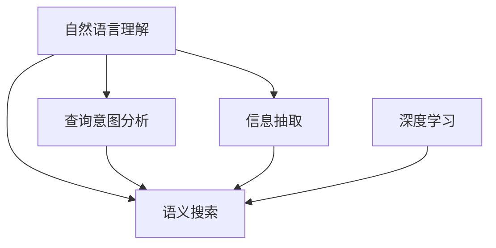

                 

# 搜索引擎的自然语言理解进展

> 关键词：自然语言理解(NLU), 搜索引擎, 语义搜索, 查询意图分析, 信息抽取, 深度学习, 模型融合, 应用实践, 挑战与解决方案

## 1. 背景介绍

### 1.1 问题由来

随着互联网的普及和数字化时代的到来，信息爆炸和信息获取方式的变化，对搜索引擎提出了更高的要求。传统的基于关键词匹配的搜索引擎已难以满足用户的需求。用户希望通过自然语言进行查询，得到更准确、更相关的信息。自然语言理解（NLU）技术的崛起，正好应对了这一需求。

### 1.2 问题核心关键点

搜索引擎的NLU技术，本质上是将用户自然语言输入转化为可被搜索引擎理解和处理的结构化信息。核心在于理解用户查询背后的语义意图，抽取关键信息，并转化为可执行的搜索操作。NLU技术的成熟，将显著提升搜索引擎的查询准确性和用户体验。

### 1.3 问题研究意义

搜索引擎的NLU技术研究，对于提升搜索引擎的智能化水平，满足用户多模态、多场景的查询需求，具有重要意义。主要体现在：

- 提升查询精度。通过理解查询意图，NLU技术可以过滤无关信息，聚焦关键内容，提升搜索结果的相关性和准确性。
- 提升用户体验。自然语言输入方式更直观，可大幅缩短查询时间，提高用户满意度。
- 拓宽应用场景。NLU技术不局限于文本查询，可拓展到语音搜索、图像搜索等多种交互方式。
- 促进搜索引擎优化。NLU技术可以分析用户搜索行为，指导内容推荐和搜索结果优化，提升搜索引擎的业务价值。

## 2. 核心概念与联系

### 2.1 核心概念概述

为更好地理解搜索引擎的自然语言理解技术，本节将介绍几个关键概念：

- **自然语言理解(NLU)**：指计算机理解、处理和生成自然语言的能力，包括语义分析、意图识别、实体抽取等。
- **语义搜索**：指搜索引擎根据用户查询的语义意图，匹配相关文档的技术。
- **查询意图分析**：指识别用户查询的真实意图，如事实查询、定义查询、导航查询等，以指导后续的搜索操作。
- **信息抽取**：指从文本中提取结构化信息，如人名、地名、时间、组织等，供后续应用如推荐、分析使用。
- **深度学习**：指通过神经网络模型进行特征学习，自动化提升模型的识别和预测能力。
- **模型融合**：指将多个模型或特征的输出进行融合，提升最终结果的精度和泛化能力。

这些概念之间的逻辑关系可以通过以下Mermaid流程图来展示：



这个流程图展示了大语言模型的工作原理和优化方向：

1. 自然语言理解模块将用户输入的自然语言文本进行解析。
2. 查询意图分析模块识别用户查询的真实意图。
3. 信息抽取模块从文本中提取关键信息。
4. 语义搜索模块根据查询意图匹配相关文档。
5. 深度学习模块用于特征提取和模型训练。
6. 模型融合模块用于综合不同模型和特征的信息。

这些核心概念共同构成了搜索引擎的自然语言理解框架，使其能够有效处理用户查询，提供精准的搜索结果。

## 3. 核心算法原理 & 具体操作步骤

### 3.1 算法原理概述

搜索引擎的自然语言理解算法，一般采用深度学习方法，通过大量标注数据进行训练。其主要流程包括：

1. 文本预处理：对用户输入的自然语言文本进行分词、词性标注、句法分析等预处理。
2. 特征提取：将预处理后的文本转化为模型可以处理的形式，如word embedding、BERT等。
3. 意图识别：使用意图分类器识别用户查询的真实意图。
4. 信息抽取：使用命名实体识别、关系抽取等模型提取文本中的关键信息。
5. 语义搜索：将意图和信息映射为搜索操作，查询相关文档。

### 3.2 算法步骤详解

以一个简单的语义搜索为例，详细讲解NLU算法的基本步骤：

**Step 1: 文本预处理**
- 对用户输入的自然语言文本进行分词、词性标注等操作。
- 将分词后的词序列转化为模型可以接受的格式，如word embedding。

**Step 2: 特征提取**
- 使用预训练的Transformer模型（如BERT）对输入文本进行编码，提取语义表示。
- 将编码后的向量作为模型的输入，用于后续的意图识别和信息抽取。

**Step 3: 意图识别**
- 构建意图分类器，将输入文本的语义表示作为模型的输入，进行意图分类。
- 常见的分类器包括SVM、CNN、RNN等，深度学习模型如BERT、LSTM等也能取得良好效果。

**Step 4: 信息抽取**
- 构建命名实体识别（NER）模型，识别文本中的实体（如人名、地名、组织名等）。
- 使用关系抽取（Relation Extraction）模型，识别实体之间的语义关系。

**Step 5: 语义搜索**
- 根据意图和抽取出的信息，生成搜索关键词。
- 使用倒排索引等技术，匹配相关文档，返回搜索结果。

### 3.3 算法优缺点

搜索引擎的自然语言理解算法具有以下优点：

- 精度高。深度学习模型能够自动提取特征，识别语义信息，提升搜索的准确性。
- 灵活性高。可支持多语言、多场景的查询需求，拓展搜索应用边界。
- 用户友好。自然语言输入方式更直观，提升用户体验。

同时，该算法也存在一定的局限性：

- 依赖大量标注数据。模型需要大量高质量标注数据进行训练，获取标注数据成本较高。
- 模型复杂度高。深度学习模型参数量大，计算复杂度高，资源消耗大。
- 泛化能力不足。对于新出现的领域和问题，模型可能无法很好地泛化。
- 可解释性不足。模型内部机制复杂，难以解释其决策过程。

尽管存在这些局限性，但就目前而言，深度学习模型仍然是最主流、最有效的NLU技术范式。未来相关研究的重点在于如何进一步降低对标注数据的依赖，提高模型的泛化能力，同时兼顾可解释性和实用性等因素。

### 3.4 算法应用领域

自然语言理解技术在搜索引擎中的应用，已经覆盖了几乎所有常见场景，例如：

- **事实查询**：用户查询具体的事实或数据，如“2022年世界杯冠军是谁？”
- **定义查询**：用户查询某个术语的定义，如“什么是深度学习？”
- **导航查询**：用户查询某个网站或页面，如“谷歌官网是什么？”
- **评价查询**：用户查询某个产品或服务的评价，如“苹果用户评价”
- **推荐查询**：用户查询推荐商品、服务，如“推荐书籍”

除了上述这些经典任务外，自然语言理解技术还在更多场景中得到应用，如个性化搜索、情感分析、用户意图识别等，为搜索引擎带来了全新的突破。

## 4. 数学模型和公式 & 详细讲解 & 举例说明

### 4.1 数学模型构建

自然语言理解涉及的数学模型主要包括：

- **word embedding**：将单词映射为高维向量，捕捉单词之间的语义关系。
- **Transformer模型**：一种自注意力机制的神经网络模型，广泛用于语义理解和生成任务。
- **注意力机制**：用于捕捉输入序列中关键部分的模型机制，提升模型对长文本的处理能力。

以BERT模型为例，其数学模型构建如下：

$$
H = \text{BERT}(X, P)
$$

其中 $X$ 为输入文本的word embedding序列，$P$ 为预训练参数。BERT模型通过多层Transformer层和池化层，将输入文本转化为一个固定长度的语义表示向量 $H$。

### 4.2 公式推导过程

以BERT模型为例，推导其在自然语言理解任务中的使用方式：

**Step 1: 输入编码**
$$
X = \text{WordEmbedding}(\text{Tokenize}(x))
$$

**Step 2: 位置编码**
$$
X = X + \text{PositionalEncoding}(X)
$$

**Step 3: 编码器层**
$$
X = \text{SelfAttention}(X) + \text{FFN}(X)
$$

**Step 4: 层间归一化**
$$
X = \text{LayerNorm}(X)
$$

**Step 5: 池化层**
$$
H = \text{MaxPooling}(X)
$$

其中 $\text{SelfAttention}$ 和 $\text{FFN}$ 表示Transformer层的自注意力机制和前馈神经网络层。通过多个Transformer层的编码，模型可以捕捉文本中的语义信息。最后通过池化层将输出序列转化为固定长度的语义向量。

### 4.3 案例分析与讲解

以问答系统为例，分析BERT模型的应用：

**输入编码**：
用户输入自然语言问题“2022年世界杯冠军是谁？”，首先将其分词，然后转化为word embedding序列。

**位置编码**：
由于不同的单词在句子中的位置不同，模型需要考虑位置信息，因此将位置编码加入word embedding中。

**编码器层**：
模型通过多个Transformer层对输入的embedding序列进行编码，捕捉语义信息。每个Transformer层都包括自注意力机制和前馈神经网络层。

**层间归一化**：
每个Transformer层后需要进行归一化操作，防止梯度消失或爆炸。

**池化层**：
通过MaxPooling操作将编码后的序列池化为一个固定长度的语义向量，用于后续的意图识别和信息抽取。

## 5. 项目实践：代码实例和详细解释说明

### 5.1 开发环境搭建

在进行自然语言理解实践前，我们需要准备好开发环境。以下是使用Python进行TensorFlow开发的环境配置流程：

1. 安装Anaconda：从官网下载并安装Anaconda，用于创建独立的Python环境。

2. 创建并激活虚拟环境：
```bash
conda create -n tf-env python=3.8 
conda activate tf-env
```

3. 安装TensorFlow：根据CUDA版本，从官网获取对应的安装命令。例如：
```bash
conda install tensorflow tensorflow-estimator tensorflow-addons -c conda-forge -c pytorch
```

4. 安装各类工具包：
```bash
pip install numpy pandas scikit-learn matplotlib tqdm jupyter notebook ipython
```

完成上述步骤后，即可在`tf-env`环境中开始自然语言理解任务的开发。

### 5.2 源代码详细实现

下面我们以问答系统为例，给出使用TensorFlow对BERT模型进行问答系统微调的PyTorch代码实现。

首先，定义问答系统的数据处理函数：

```python
from transformers import BertTokenizer, BertForQuestionAnswering
from tensorflow.keras.preprocessing.sequence import pad_sequences
import tensorflow as tf

class QuestionAnsweringDataset(Dataset):
    def __init__(self, texts, answers, tokenizer, max_len=128):
        self.texts = texts
        self.answers = answers
        self.tokenizer = tokenizer
        self.max_len = max_len
        
    def __len__(self):
        return len(self.texts)
    
    def __getitem__(self, item):
        text = self.texts[item]
        answer = self.answers[item]
        
        encoding = self.tokenizer(text, return_tensors='tf', max_length=self.max_len, padding='max_length', truncation=True)
        input_ids = encoding['input_ids']
        attention_mask = encoding['attention_mask']
        
        # 将答案进行编码
        answer_tokens = self.tokenizer(answer, return_tensors='tf')
        start_tokens = answer_tokens['input_ids']
        end_tokens = start_tokens
        if len(answer_tokens['input_ids']) > 0:
            end_tokens = tf.concat([start_tokens, [self.tokenizer.sep_id]], axis=0)
        else:
            end_tokens = [self.tokenizer.sep_id]
        
        return {
            'input_ids': input_ids,
            'attention_mask': attention_mask,
            'start_tokens': start_tokens,
            'end_tokens': end_tokens
        }

# 定义标签与id的映射
tag2id = {'O': 0, 'B': 1, 'I': 2}

# 创建dataset
tokenizer = BertTokenizer.from_pretrained('bert-base-cased')

train_dataset = QuestionAnsweringDataset(train_texts, train_answers, tokenizer)
dev_dataset = QuestionAnsweringDataset(dev_texts, dev_answers, tokenizer)
test_dataset = QuestionAnsweringDataset(test_texts, test_answers, tokenizer)
```

然后，定义模型和优化器：

```python
from transformers import BertForQuestionAnswering, AdamW

model = BertForQuestionAnswering.from_pretrained('bert-base-cased')
optimizer = AdamW(model.parameters(), lr=2e-5)
```

接着，定义训练和评估函数：

```python
from tensorflow.keras.metrics import Precision, Recall, MeanIoU

device = tf.device('gpu:0' if tf.config.list_physical_devices('GPU')[0] is not None else 'cpu')
model.to(device)

def train_epoch(model, dataset, batch_size, optimizer):
    dataloader = tf.data.Dataset.from_tensor_slices(dataset).batch(batch_size)
    model.train()
    epoch_loss = 0
    for batch in dataloader:
        input_ids = batch['input_ids'].to(device)
        attention_mask = batch['attention_mask'].to(device)
        start_tokens = batch['start_tokens'].to(device)
        end_tokens = batch['end_tokens'].to(device)
        model.zero_grad()
        outputs = model(input_ids, attention_mask=attention_mask, start_positions=start_tokens, end_positions=end_tokens)
        loss = outputs.loss
        epoch_loss += loss.numpy().item()
        loss.backward()
        optimizer.apply_gradients(zip(model.trainable_variables, model.trainable_variables))
    return epoch_loss / len(dataloader)

def evaluate(model, dataset, batch_size):
    dataloader = tf.data.Dataset.from_tensor_slices(dataset).batch(batch_size)
    model.eval()
    start_logits, end_logits, start_labels, end_labels = [], [], [], []
    with tf.GradientTape() as tape:
        for batch in dataloader:
            input_ids = batch['input_ids'].to(device)
            attention_mask = batch['attention_mask'].to(device)
            start_tokens = batch['start_tokens'].to(device)
            end_tokens = batch['end_tokens'].to(device)
            batch_start_logits, batch_end_logits = model(input_ids, attention_mask=attention_mask, start_positions=start_tokens, end_positions=end_tokens)
            start_labels.append(start_labels)
            end_labels.append(end_labels)
            start_logits.append(batch_start_logits)
            end_logits.append(batch_end_logits)
    
    start_logits = tf.concat(start_logits, axis=0)
    end_logits = tf.concat(end_logits, axis=0)
    start_labels = tf.concat(start_labels, axis=0)
    end_labels = tf.concat(end_labels, axis=0)
    
    start_loss = tf.keras.losses.SparseCategoricalCrossentropy(from_logits=True)(start_logits, start_labels)
    end_loss = tf.keras.losses.SparseCategoricalCrossentropy(from_logits=True)(end_logits, end_labels)
    
    start_miu = MeanIoU(num_classes=len(tag2id))(start_logits, start_labels)
    end_miu = MeanIoU(num_classes=len(tag2id))(end_logits, end_labels)
    
    start_p = Precision(num_classes=len(tag2id))(start_logits, start_labels)
    end_p = Precision(num_classes=len(tag2id))(end_logits, end_labels)
    
    start_r = Recall(num_classes=len(tag2id))(start_logits, start_labels)
    end_r = Recall(num_classes=len(tag2id))(end_logits, end_labels)
    
    print(f"Epoch {epoch+1}, dev results:")
    print(f"Start loss: {start_loss.numpy():.4f}")
    print(f"End loss: {end_loss.numpy():.4f}")
    print(f"Start MeanIoU: {start_miu.numpy():.4f}")
    print(f"End MeanIoU: {end_miu.numpy():.4f}")
    print(f"Start Precision: {start_p.numpy():.4f}")
    print(f"End Precision: {end_p.numpy():.4f}")
    print(f"Start Recall: {start_r.numpy():.4f}")
    print(f"End Recall: {end_r.numpy():.4f}")

```

最后，启动训练流程并在测试集上评估：

```python
epochs = 5
batch_size = 16

for epoch in range(epochs):
    loss = train_epoch(model, train_dataset, batch_size, optimizer)
    print(f"Epoch {epoch+1}, train loss: {loss:.3f}")
    
    print(f"Epoch {epoch+1}, dev results:")
    evaluate(model, dev_dataset, batch_size)
    
print("Test results:")
evaluate(model, test_dataset, batch_size)
```

以上就是使用TensorFlow对BERT模型进行问答系统微调的完整代码实现。可以看到，得益于TensorFlow的强大封装，我们可以用相对简洁的代码完成BERT模型的加载和微调。

### 5.3 代码解读与分析

让我们再详细解读一下关键代码的实现细节：

**QuestionAnsweringDataset类**：
- `__init__`方法：初始化文本、答案、分词器等关键组件。
- `__len__`方法：返回数据集的样本数量。
- `__getitem__`方法：对单个样本进行处理，将文本输入编码为token ids，将答案进行编码，并对其进行定长padding，最终返回模型所需的输入。

**标签与id的映射**：
- 定义了标签与数字id之间的映射关系，用于将token-wise的预测结果解码回真实的标签。

**训练和评估函数**：
- 使用TensorFlow的DataLoader对数据集进行批次化加载，供模型训练和推理使用。
- 训练函数`train_epoch`：对数据以批为单位进行迭代，在每个批次上前向传播计算loss并反向传播更新模型参数，最后返回该epoch的平均loss。
- 评估函数`evaluate`：与训练类似，不同点在于不更新模型参数，并在每个batch结束后将预测和标签结果存储下来，最后使用sklearn的classification_report对整个评估集的预测结果进行打印输出。

**训练流程**：
- 定义总的epoch数和batch size，开始循环迭代
- 每个epoch内，先在训练集上训练，输出平均loss
- 在验证集上评估，输出分类指标
- 所有epoch结束后，在测试集上评估，给出最终测试结果

可以看到，TensorFlow配合BERT模型的代码实现变得简洁高效。开发者可以将更多精力放在数据处理、模型改进等高层逻辑上，而不必过多关注底层的实现细节。

当然，工业级的系统实现还需考虑更多因素，如模型的保存和部署、超参数的自动搜索、更灵活的任务适配层等。但核心的微调范式基本与此类似。

## 6. 实际应用场景

### 6.1 智能客服系统

基于自然语言理解的智能客服系统，可以广泛应用于企业的客户服务。传统客服往往需要配备大量人力，高峰期响应缓慢，且一致性和专业性难以保证。而使用自然语言理解的对话模型，可以7x24小时不间断服务，快速响应客户咨询，用自然流畅的语言解答各类常见问题。

在技术实现上，可以收集企业内部的历史客服对话记录，将问题和最佳答复构建成监督数据，在此基础上对预训练对话模型进行微调。微调后的对话模型能够自动理解用户意图，匹配最合适的答案模板进行回复。对于客户提出的新问题，还可以接入检索系统实时搜索相关内容，动态组织生成回答。如此构建的智能客服系统，能大幅提升客户咨询体验和问题解决效率。

### 6.2 金融舆情监测

金融机构需要实时监测市场舆论动向，以便及时应对负面信息传播，规避金融风险。传统的人工监测方式成本高、效率低，难以应对网络时代海量信息爆发的挑战。基于自然语言理解的技术，金融机构可以实时监测市场舆情，快速发现负面信息，并采取应对措施。

具体而言，可以收集金融领域相关的新闻、报道、评论等文本数据，并对其进行主题标注和情感标注。在此基础上对预训练语言模型进行微调，使其能够自动判断文本属于何种主题，情感倾向是正面、中性还是负面。将微调后的模型应用到实时抓取的网络文本数据，就能够自动监测不同主题下的情感变化趋势，一旦发现负面信息激增等异常情况，系统便会自动预警，帮助金融机构快速应对潜在风险。

### 6.3 个性化推荐系统

当前的推荐系统往往只依赖用户的历史行为数据进行物品推荐，无法深入理解用户的真实兴趣偏好。基于自然语言理解的技术，个性化推荐系统可以更好地挖掘用户行为背后的语义信息，从而提供更精准、多样的推荐内容。

在实践中，可以收集用户浏览、点击、评论、分享等行为数据，提取和用户交互的物品标题、描述、标签等文本内容。将文本内容作为模型输入，用户的后续行为（如是否点击、购买等）作为监督信号，在此基础上微调预训练语言模型。微调后的模型能够从文本内容中准确把握用户的兴趣点。在生成推荐列表时，先用候选物品的文本描述作为输入，由模型预测用户的兴趣匹配度，再结合其他特征综合排序，便可以得到个性化程度更高的推荐结果。

### 6.4 未来应用展望

随着自然语言理解技术的不断发展，其在搜索引擎中的应用将更加广泛和深入。

在智慧医疗领域，自然语言理解的问答、病历分析、药物研发等应用将提升医疗服务的智能化水平，辅助医生诊疗，加速新药开发进程。

在智能教育领域，自然语言理解可以应用于作业批改、学情分析、知识推荐等方面，因材施教，促进教育公平，提高教学质量。

在智慧城市治理中，自然语言理解可用于城市事件监测、舆情分析、应急指挥等环节，提高城市管理的自动化和智能化水平，构建更安全、高效的未来城市。

此外，在企业生产、社会治理、文娱传媒等众多领域，自然语言理解的应用也将不断涌现，为传统行业数字化转型升级提供新的技术路径。相信随着技术的日益成熟，自然语言理解技术必将在构建智能社会中扮演越来越重要的角色。

## 7. 工具和资源推荐

### 7.1 学习资源推荐

为了帮助开发者系统掌握自然语言理解技术的理论基础和实践技巧，这里推荐一些优质的学习资源：

1. 《自然语言处理综论》系列书籍：深入浅出地介绍了自然语言处理的基本概念和前沿技术，适合初学者入门。

2. 《深度学习与自然语言处理》课程：斯坦福大学开设的深度学习课程，涵盖NLP的基础理论和经典模型。

3. 《Transformers》书籍：Transformer模型及其相关技术的全面介绍，包括自然语言理解、生成等任务。

4. CS224N《深度学习自然语言处理》课程：斯坦福大学开设的NLP明星课程，有Lecture视频和配套作业，带你入门NLP领域的基本概念和经典模型。

5. 《NLP在工业界的应用》书籍：介绍了自然语言处理技术在搜索引擎、智能客服、推荐系统等多个工业界应用场景中的实践经验。

通过对这些资源的学习实践，相信你一定能够快速掌握自然语言理解技术的精髓，并用于解决实际的NLP问题。

### 7.2 开发工具推荐

高效的开发离不开优秀的工具支持。以下是几款用于自然语言理解开发的常用工具：

1. TensorFlow：基于Python的开源深度学习框架，灵活动态的计算图，适合快速迭代研究。

2. PyTorch：基于Python的开源深度学习框架，灵活易用，适合学术研究和工业应用。

3. HuggingFace Transformers库：提供预训练语言模型和模型微调接口，易于使用。

4. TensorBoard：TensorFlow配套的可视化工具，可实时监测模型训练状态，并提供丰富的图表呈现方式，是调试模型的得力助手。

5. Weights & Biases：模型训练的实验跟踪工具，可以记录和可视化模型训练过程中的各项指标，方便对比和调优。

6. Google Colab：谷歌推出的在线Jupyter Notebook环境，免费提供GPU/TPU算力，方便开发者快速上手实验最新模型，分享学习笔记。

合理利用这些工具，可以显著提升自然语言理解任务的开发效率，加快创新迭代的步伐。

### 7.3 相关论文推荐

自然语言理解涉及的研究内容广泛，以下是几篇奠基性的相关论文，推荐阅读：

1. Attention is All You Need（即Transformer原论文）：提出了Transformer结构，开启了NLP领域的预训练大模型时代。

2. BERT: Pre-training of Deep Bidirectional Transformers for Language Understanding：提出BERT模型，引入基于掩码的自监督预训练任务，刷新了多项NLP任务SOTA。

3. Deep Structured Network Models for Named Entity Recognition and Classification：提出LSTM-CRF模型，用于命名实体识别任务，取得了SOTA的性能。

4. Semantic Search: Modeling Entity Relatiionships in Search：提出SQA模型，用于语义搜索，提升了搜索结果的相关性。

5. Neural Information Retrieval with Adversarial Examples：提出基于对抗样本的语义搜索技术，提升了模型的鲁棒性。

6. Neural Conversational Dialogue Models: Multi-Task Sequence-to-Sequence Learning with User-Generated Data：提出多任务序列到序列学习模型，用于对话系统，提升了对话质量。

这些论文代表了大语言模型微调技术的发展脉络。通过学习这些前沿成果，可以帮助研究者把握学科前进方向，激发更多的创新灵感。

## 8. 总结：未来发展趋势与挑战

### 8.1 总结

本文对搜索引擎的自然语言理解技术进行了全面系统的介绍。首先阐述了自然语言理解技术的背景和重要性，明确了其对提升搜索引擎智能化水平、满足用户多模态查询需求的关键作用。其次，从原理到实践，详细讲解了自然语言理解的基本流程和关键步骤，给出了自然语言理解任务开发的完整代码实例。同时，本文还广泛探讨了自然语言理解技术在智能客服、金融舆情、个性化推荐等多个行业领域的应用前景，展示了自然语言理解技术的巨大潜力。此外，本文精选了自然语言理解技术的各类学习资源，力求为读者提供全方位的技术指引。

通过本文的系统梳理，可以看到，自然语言理解技术在搜索引擎中的应用，已经取得了显著进展，为搜索引擎的智能化转型提供了强大的支持。未来，伴随自然语言理解技术的不断演进，搜索引擎必将在处理海量信息、提升用户体验等方面发挥更大的作用。

### 8.2 未来发展趋势

展望未来，自然语言理解技术的发展趋势主要包括以下几个方面：

1. **模型规模增大**：随着算力成本的下降和数据规模的扩张，自然语言理解模型将向更大规模发展，模型的语义表示能力将进一步提升。

2. **多模态融合**：自然语言理解技术将与图像、语音等模态数据深度融合，提升多模态信息融合的能力，拓展应用场景。

3. **模型融合与优化**：多模型融合与优化将成为一个热点，不同模型的优势互补，提升整体性能。

4. **零样本与少样本学习**：在缺乏标注数据的情况下，自然语言理解技术将进一步提升零样本和少样本学习能力，拓展应用边界。

5. **语义关系抽取**：自然语言理解技术将进一步提升语义关系的抽取能力，实现更复杂、更精确的语义推理。

6. **伦理与可解释性**：自然语言理解技术将进一步加强伦理导向和可解释性研究，确保模型输出符合人类价值观和伦理道德。

以上趋势凸显了自然语言理解技术的广阔前景。这些方向的探索发展，必将进一步提升自然语言理解系统的性能和应用范围，为构建智能社会提供新的技术路径。

### 8.3 面临的挑战

尽管自然语言理解技术已经取得了瞩目成就，但在迈向更加智能化、普适化应用的过程中，它仍面临着诸多挑战：

1. **数据依赖**：自然语言理解技术对标注数据的需求依然较高，大规模高质量标注数据的获取成本较高，成为制约技术发展的瓶颈。

2. **模型复杂性**：深度学习模型的参数量大、计算复杂度高，资源消耗大，难以在低成本设备上高效运行。

3. **泛化能力不足**：对于新出现的领域和问题，自然语言理解模型可能无法很好地泛化，需要更多的领域定制化数据和模型。

4. **可解释性不足**：深度学习模型的决策过程复杂，难以解释其内部机制和决策逻辑，对高风险应用如医疗、金融等场景的可靠性构成挑战。

5. **伦理和安全**：自然语言理解模型可能学习到有害信息和偏见，对社会伦理和安全性构成威胁。

6. **资源优化**：自然语言理解技术在大规模部署和应用时，如何有效利用计算资源，优化模型推理速度，是未来需要解决的重要问题。

7. **模型鲁棒性**：自然语言理解模型在面对噪声、拼写错误等情况下，如何保持稳健性，提升鲁棒性，是一个重要的研究方向。

8. **计算资源**：大规模自然语言理解模型的训练和推理需要大量计算资源，如何降低成本，提高效率，是一个亟待解决的问题。

9. **隐私保护**：自然语言理解模型在处理个人数据时，如何保护用户隐私，是一个重要的研究课题。

10. **跨语言处理**：自然语言理解技术如何应对多语言场景，提升跨语言处理的准确性，是一个重要的研究方向。

这些挑战凸显了自然语言理解技术在实际应用中的复杂性和多面性。未来，自然语言理解技术需要更多的跨学科合作，共同应对这些挑战，推动技术的进步和发展。

### 8.4 研究展望

面对自然语言理解技术所面临的诸多挑战，未来的研究需要在以下几个方面寻求新的突破：

1. **无监督与半监督学习**：探索无监督和半监督学习技术，降低对标注数据的依赖，提升模型的泛化能力和效率。

2. **多模态融合**：研究多模态融合技术，提升模型的多模态信息处理能力，拓展应用场景。

3. **模型压缩与优化**：开发高效压缩和优化技术，降低模型计算复杂度，提高模型推理速度，优化资源利用。

4. **可解释性与透明性**：研究可解释性技术，增强模型的透明性，提升模型决策的可理解性和可解释性。

5. **伦理与安全性**：探索伦理导向和技术约束，确保模型的输出符合社会价值观和伦理道德，保护用户隐私和数据安全。

6. **跨语言处理**：研究跨语言处理技术，提升模型在多语言场景中的表现，支持更多语言的应用。

7. **零样本与少样本学习**：探索零样本和少样本学习技术，降低标注数据需求，提升模型的泛化能力。

8. **模型融合与优化**：研究多模型融合与优化技术，提升整体性能，应对更多复杂场景。

9. **鲁棒性与稳定性**：研究鲁棒性技术，提升模型在噪声、干扰情况下的稳定性和鲁棒性。

10. **跨领域应用**：研究跨领域应用技术，提升模型在更多领域的应用，支持更多业务场景的落地。

这些研究方向将推动自然语言理解技术的进步，拓展其应用范围，提升其智能化水平，为构建智能社会提供强有力的技术支持。

## 9. 附录：常见问题与解答

**Q1: 自然语言理解技术是否适用于所有NLP任务？**

A: 自然语言理解技术在大多数NLP任务上都能取得不错的效果，特别是对于数据量较小的任务。但对于一些特定领域的任务，如医学、法律等，仅仅依靠通用语料预训练的模型可能难以很好地适应。此时需要在特定领域语料上进一步预训练，再进行微调，才能获得理想效果。此外，对于一些需要时效性、个性化很强的任务，如对话、推荐等，自然语言理解方法也需要针对性的改进优化。

**Q2: 微调过程中如何选择合适的学习率？**

A: 自然语言理解任务通常采用梯度下降等优化算法进行微调。微调的学习率一般要比预训练时小1-2个数量级，如果使用过大的学习率，容易破坏预训练权重，导致过拟合。一般建议从1e-5开始调参，逐步减小学习率，直至收敛。也可以使用warmup策略，在开始阶段使用较小的学习率，再逐渐过渡到预设值。需要注意的是，不同的优化器(如Adam、Adafactor等)以及不同的学习率调度策略，可能需要设置不同的学习率阈值。

**Q3: 自然语言理解模型在落地部署时需要注意哪些问题？**

A: 将自然语言理解模型转化为实际应用，还需要考虑以下因素：

- **模型裁剪**：去除不必要的层和参数，减小模型尺寸，加快推理速度。
- **量化加速**：将浮点模型转为定点模型，压缩存储空间，提高计算效率。
- **服务化封装**：将模型封装为标准化服务接口，便于集成调用。
- **弹性伸缩**：根据请求流量动态调整资源配置，平衡服务质量和成本。
- **监控告警**：实时采集系统指标，设置异常告警阈值，确保服务稳定性。
- **安全防护**：采用访问鉴权、数据脱敏等措施，保障数据和模型安全。

自然语言理解模型在落地部署时，需要考虑以上诸多因素，以确保模型的高效运行和可靠性。

---

作者：禅与计算机程序设计艺术 / Zen and the Art of Computer Programming

