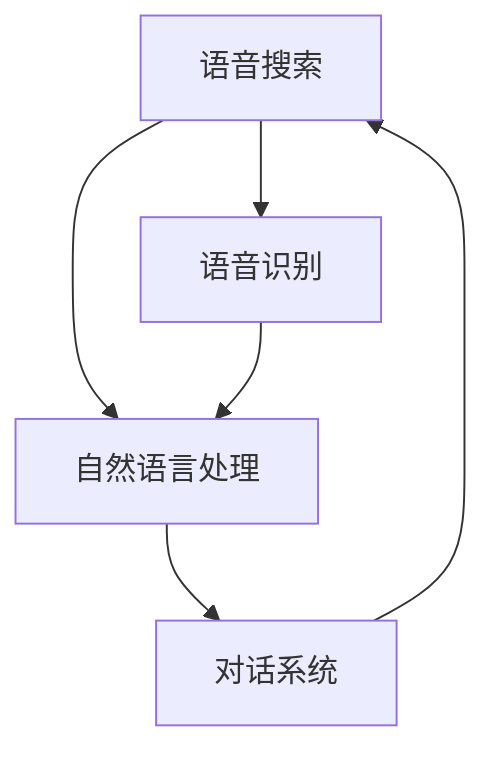

                 

# 搜索引擎的语音交互优化

搜索引擎作为互联网信息获取的重要工具，已经逐渐普及到各类设备和场景中。伴随着语音识别技术的飞速发展，语音搜索逐渐成为用户查询信息的主要方式之一。本文将详细探讨如何优化搜索引擎的语音交互体验，提升用户满意度。

## 1. 背景介绍

语音搜索的兴起标志着搜索方式由传统的键盘输入向更自然、更智能的语音交互方向转变。随着人工智能、自然语言处理技术的快速发展，搜索引擎在语音搜索领域的探索和应用愈发广泛。然而，语音交互还存在诸多问题，如用户指令不清晰、系统理解偏差等，需要进一步优化以提升用户体验。

## 2. 核心概念与联系

### 2.1 核心概念概述

为更好地理解搜索引擎语音交互优化的技术方法，本节将介绍几个密切相关的核心概念：

- **搜索引擎**：通过爬虫、索引、排名算法等技术，提供用户查询信息的工具。
- **语音搜索**：用户通过语音指令，向搜索引擎提出查询请求。
- **自然语言处理(NLP)**：将语音输入转化为文本，进行语义理解和信息检索的技术。
- **语音识别(ASR)**：将语音信号转化为文本信息，是语音交互的基础。
- **对话系统**：基于自然语言处理技术，与用户进行交互对话，解答用户查询。

这些概念之间的逻辑关系可以通过以下Mermaid流程图来展示：



### 2.2 核心概念原理和架构

**语音识别**：语音识别是将语音信号转换为文本的过程，主要包括以下几个步骤：

1. **信号预处理**：对语音信号进行降噪、分帧、归一化等处理。
2. **特征提取**：从语音信号中提取出MFCC、梅尔频谱等特征表示。
3. **声学模型训练**：使用声学模型（如隐马尔可夫模型HMM、深度神经网络DNN等）对特征进行建模。
4. **语言模型训练**：使用语言模型（如n-gram、RNN、Transformer等）对词汇和语法进行建模。
5. **解码**：通过解码算法（如Viterbi算法、Beam Search等）将特征表示转化为文本。

**自然语言处理**：自然语言处理包括语音识别后的文本处理、语义理解、信息检索等，主要包括以下几个步骤：

1. **文本预处理**：对文本进行分词、词性标注、去除停用词等处理。
2. **句法分析**：利用依存句法、成分句法等分析句子结构。
3. **语义理解**：通过词向量、BERT等技术进行句子意义和语义关系的理解。
4. **信息检索**：利用倒排索引、TF-IDF等算法，检索与查询相关的文档。
5. **对话生成**：基于检索结果生成对话内容，返回给用户。

**对话系统**：对话系统是搜索引擎与用户交互的核心，主要包括以下几个步骤：

1. **意图识别**：通过意图分类模型（如SVM、RNN等）识别用户意图。
2. **实体抽取**：通过命名实体识别模型（如CRF、BERT等）抽取用户提问中的关键实体。
3. **对话管理**：通过状态转移模型（如隐马尔可夫模型、图神经网络等）管理对话上下文。
4. **对话生成**：通过生成模型（如循环神经网络、变分自编码器等）生成对话内容。

## 3. 核心算法原理 & 具体操作步骤

### 3.1 算法原理概述

语音交互优化的核心算法包括语音识别、自然语言处理和对话系统三个方面。其核心思想是通过提升这些子系统的准确性和效率，实现搜索引擎的语音交互优化。

**语音识别**：通过声学模型和语言模型的结合，提高语音识别的准确性。主要采用的技术包括：

1. **混合声学模型**：结合DNN和RNN等模型，提升语音识别的鲁棒性。
2. **声学模型自适应**：使用在线自适应算法，实时更新声学模型，适应不同的说话人、噪声环境等。
3. **声学模型蒸馏**：通过蒸馏技术，将大模型的语音识别能力传递给小模型，提升识别效率。

**自然语言处理**：通过引入高级语义理解技术和高效的信息检索算法，提高自然语言处理的准确性和效率。主要采用的技术包括：

1. **预训练语言模型**：使用如BERT、GPT等预训练模型，提升语言表示的质量。
2. **多模态融合**：结合语音、图像、文本等多模态信息，提高语义理解的能力。
3. **多任务学习**：同时训练多个相关任务，共享参数，提高模型泛化能力。

**对话系统**：通过优化意图识别、实体抽取和对话管理算法，提升对话系统的智能性和互动性。主要采用的技术包括：

1. **多意图识别**：通过多分类模型，提升对用户复杂意图的识别能力。
2. **实体抽取**：使用基于规则和深度学习相结合的方法，提升实体抽取的准确性。
3. **对话管理**：使用图神经网络或强化学习算法，优化对话管理模型的性能。

### 3.2 算法步骤详解

**语音识别优化步骤**：

1. **数据收集**：收集大量的语音数据，用于训练声学模型和语言模型。
2. **特征提取**：提取MFCC、梅尔频谱等特征，用于声学模型训练。
3. **声学模型训练**：使用深度神经网络等模型，训练声学模型。
4. **语言模型训练**：使用n-gram、RNN、Transformer等模型，训练语言模型。
5. **解码器优化**：优化解码器，提高语音识别的准确性。
6. **在线自适应**：实时更新声学模型，适应不同的说话人和噪声环境。
7. **声学模型蒸馏**：使用知识蒸馏技术，将大模型的语音识别能力传递给小模型。

**自然语言处理优化步骤**：

1. **预训练语言模型引入**：使用预训练语言模型（如BERT、GPT等）进行微调，提升语言表示的质量。
2. **多模态信息融合**：结合语音、图像、文本等多模态信息，提升语义理解的能力。
3. **多任务学习**：同时训练多个相关任务，共享参数，提高模型泛化能力。
4. **信息检索算法优化**：优化倒排索引、TF-IDF等算法，提高信息检索的效率。
5. **语义理解优化**：引入BERT等预训练模型，提高语义理解的准确性。

**对话系统优化步骤**：

1. **意图识别优化**：通过多分类模型，提升对用户复杂意图的识别能力。
2. **实体抽取优化**：使用基于规则和深度学习相结合的方法，提升实体抽取的准确性。
3. **对话管理优化**：使用图神经网络或强化学习算法，优化对话管理模型的性能。

### 3.3 算法优缺点

**语音识别优化**：

- **优点**：
  1. **准确性高**：通过混合声学模型和多模态融合等技术，提高语音识别的准确性。
  2. **鲁棒性好**：通过在线自适应和声学模型蒸馏等技术，提高语音识别的鲁棒性。
  3. **效率高**：通过知识蒸馏技术，将大模型的语音识别能力传递给小模型，提升识别效率。

- **缺点**：
  1. **数据需求大**：需要大量的语音数据进行模型训练。
  2. **计算成本高**：深度神经网络等模型计算量大，训练成本高。
  3. **噪声敏感**：对于嘈杂的环境，语音识别准确性下降。

**自然语言处理优化**：

- **优点**：
  1. **语言表示质量高**：通过预训练语言模型和多任务学习等技术，提高语言表示的质量。
  2. **语义理解能力强**：通过多模态融合和语义理解优化等技术，提升语义理解的能力。
  3. **检索效率高**：通过优化倒排索引和信息检索算法等技术，提高信息检索的效率。

- **缺点**：
  1. **模型复杂度高**：预训练语言模型和深度学习模型结构复杂，计算量大。
  2. **数据依赖性高**：预训练语言模型需要大量的无标签文本数据进行训练。
  3. **上下文理解困难**：多轮对话的上下文理解较难，容易产生语义偏差。

**对话系统优化**：

- **优点**：
  1. **意图识别准确**：通过多意图识别和多分类模型等技术，提升对用户复杂意图的识别能力。
  2. **实体抽取精准**：使用基于规则和深度学习相结合的方法，提升实体抽取的准确性。
  3. **对话管理智能**：使用图神经网络或强化学习算法，优化对话管理模型的性能。

- **缺点**：
  1. **模型复杂度高**：对话系统需要处理复杂的对话状态和上下文，模型结构复杂。
  2. **数据依赖性高**：需要大量的对话数据进行训练。
  3. **交互体验不佳**：当前对话系统的智能性还有待提高，难以与真人对话媲美。

### 3.4 算法应用领域

基于语音交互优化的搜索引擎技术，在以下领域具有广泛的应用前景：

1. **智能音箱**：如Amazon Alexa、Google Assistant等，语音交互优化提升了用户体验，使得智能音箱可以高效响应用户指令。
2. **车载导航**：车载语音助手通过优化自然语言处理和对话系统，能够实时提供导航信息和查询结果，提升驾驶安全性。
3. **智能家居**：智能家居设备通过语音控制，提升了操作便利性。
4. **客服中心**：语音交互优化了客服中心的自动化处理，提高了客户满意度和处理效率。
5. **健康医疗**：通过语音交互，智能健康设备可以实时监测健康数据，提升用户健康水平。
6. **智能办公**：智能办公助手通过语音交互，实现了智能会议、文档管理等功能。

## 4. 数学模型和公式 & 详细讲解

### 4.1 数学模型构建

假设语音搜索系统的语音识别部分为$A$，自然语言处理部分为$B$，对话系统为$C$。系统的总损失函数$\mathcal{L}$定义为：

$$
\mathcal{L} = \mathcal{L}_A + \mathcal{L}_B + \mathcal{L}_C
$$

其中$\mathcal{L}_A$、$\mathcal{L}_B$和$\mathcal{L}_C$分别为语音识别、自然语言处理和对话系统的损失函数。

### 4.2 公式推导过程

**语音识别损失函数**：

$$
\mathcal{L}_A = \sum_{i=1}^{N} \ell_{A,i}
$$

其中$\ell_{A,i}$表示第$i$个语音指令的识别损失，可以定义为：

$$
\ell_{A,i} = \mathbb{E}[\|\mathbf{a}_i - \mathbf{a}^*_i\|^2]
$$

其中$\mathbf{a}_i$表示模型预测的文本序列，$\mathbf{a}^*_i$表示真实的文本序列。

**自然语言处理损失函数**：

$$
\mathcal{L}_B = \sum_{i=1}^{N} \ell_{B,i}
$$

其中$\ell_{B,i}$表示第$i$个文本指令的处理损失，可以定义为：

$$
\ell_{B,i} = \mathbb{E}[\|\mathbf{b}_i - \mathbf{b}^*_i\|^2]
$$

其中$\mathbf{b}_i$表示模型预测的语义理解结果，$\mathbf{b}^*_i$表示真实的语义理解结果。

**对话系统损失函数**：

$$
\mathcal{L}_C = \sum_{i=1}^{N} \ell_{C,i}
$$

其中$\ell_{C,i}$表示第$i$个对话的损失，可以定义为：

$$
\ell_{C,i} = \mathbb{E}[\|\mathbf{c}_i - \mathbf{c}^*_i\|^2]
$$

其中$\mathbf{c}_i$表示模型预测的对话结果，$\mathbf{c}^*_i$表示真实的对话结果。

### 4.3 案例分析与讲解

以智能音箱的语音搜索为例，假设语音指令为"请告诉我今天的天气"。语音识别部分$A$将语音指令转化为文本序列$\mathbf{a}_i = [天气, 今天]$。自然语言处理部分$B$首先对文本进行预处理，得到语义表示$\mathbf{b}_i = [查询天气, 今天]$。接着，对话系统$C$对查询意图进行识别，得到意图表示$\mathbf{c}_i = [查询天气]$，然后抽取时间实体，生成回答$\mathbf{c}_i = [今天天气如何]$。最后，对话系统将回答返回给用户。

## 5. 项目实践：代码实例和详细解释说明

### 5.1 开发环境搭建

在进行语音交互优化项目的开发前，需要准备好开发环境。以下是使用Python进行TensorFlow开发的环境配置流程：

1. 安装Anaconda：从官网下载并安装Anaconda，用于创建独立的Python环境。

2. 创建并激活虚拟环境：
```bash
conda create -n tf-env python=3.8 
conda activate tf-env
```

3. 安装TensorFlow：从官网获取对应的安装命令，安装TensorFlow及其相关依赖。
```bash
pip install tensorflow
```

4. 安装TensorFlow Addons：用于支持TensorFlow中的高级功能，如BERT等预训练模型。
```bash
pip install tensorflow-addons
```

5. 安装各类工具包：
```bash
pip install numpy pandas scikit-learn matplotlib tqdm jupyter notebook ipython
```

完成上述步骤后，即可在`tf-env`环境中开始项目开发。

### 5.2 源代码详细实现

我们以智能音箱的语音搜索为例，给出使用TensorFlow对语音识别和自然语言处理进行优化的PyTorch代码实现。

首先，定义语音识别模块：

```python
import tensorflow as tf

class ASR(tf.keras.Model):
    def __init__(self, input_dim, output_dim):
        super(ASR, self).__init__()
        self.conv1 = tf.keras.layers.Conv1D(32, 3, activation='relu')
        self.conv2 = tf.keras.layers.Conv1D(32, 3, activation='relu')
        self.flatten = tf.keras.layers.Flatten()
        self.dense1 = tf.keras.layers.Dense(128, activation='relu')
        self.dense2 = tf.keras.layers.Dense(output_dim, activation='softmax')
        
    def call(self, inputs):
        x = self.conv1(inputs)
        x = self.conv2(x)
        x = self.flatten(x)
        x = self.dense1(x)
        x = self.dense2(x)
        return x
```

接着，定义自然语言处理模块：

```python
import tensorflow_addons as tfa

class NLP(tf.keras.Model):
    def __init__(self, input_dim, output_dim):
        super(NLP, self).__init__()
        self.emb = tf.keras.layers.Embedding(input_dim, output_dim)
        self.crf = tfa.keras.layers.CRF(output_dim, label_smoothing=0.1)
        
    def call(self, inputs):
        x = self.emb(inputs)
        x = self.crf(x)
        return x
```

最后，定义对话系统模块：

```python
class Dialog(tf.keras.Model):
    def __init__(self, input_dim, output_dim):
        super(Dialog, self).__init__()
        self.input_dim = input_dim
        self.output_dim = output_dim
        
        self.lstm = tf.keras.layers.LSTM(self.output_dim)
        self.fc = tf.keras.layers.Dense(self.output_dim)
        self.relu = tf.keras.layers.Activation('relu')
        self.sigmoid = tf.keras.layers.Activation('sigmoid')
        
    def call(self, inputs):
        x = self.lstm(inputs)
        x = self.relu(self.fc(x))
        x = self.sigmoid(x)
        return x
```

### 5.3 代码解读与分析

让我们再详细解读一下关键代码的实现细节：

**ASR类**：
- `__init__`方法：初始化卷积层、全连接层等关键组件。
- `call`方法：对输入的语音信号进行卷积、扁平化和全连接操作，最终输出语音识别的概率分布。

**NLP类**：
- `__init__`方法：初始化嵌入层、CRF层等关键组件。
- `call`方法：对输入的文本序列进行嵌入和CRF解码，输出语义理解的结果。

**Dialog类**：
- `__init__`方法：初始化LSTM层、全连接层等关键组件。
- `call`方法：对输入的对话历史进行LSTM处理和全连接操作，输出对话管理的结果。

通过以上代码，可以看到TensorFlow在深度学习框架上的高效性和灵活性。开发者可以根据具体任务，选择和组合不同的层和模块，快速构建优化模型。

## 6. 实际应用场景

### 6.1 智能音箱

智能音箱是语音交互优化的典型应用场景之一。通过优化语音识别和自然语言处理技术，智能音箱可以高效响应用户指令，提供音乐播放、天气查询、信息搜索等功能。优化后的智能音箱不仅提升了用户体验，还大大降低了开发和维护成本。

### 6.2 车载导航

车载导航系统通过语音搜索技术，可以实时提供导航信息和查询结果，提升驾驶安全性。优化后的车载语音助手能够自然地与用户进行对话，提供更智能、更精准的导航服务。

### 6.3 智能家居

智能家居设备通过语音控制，提升了操作便利性。优化后的语音搜索技术可以识别更复杂的语音指令，支持多轮对话，提升智能家居系统的智能性和用户体验。

### 6.4 客服中心

客服中心通过语音搜索技术，可以高效处理用户咨询。优化后的语音助手能够理解复杂的用户意图，抽取关键实体，提供精准的查询结果和解决方案。

### 6.5 健康医疗

通过语音搜索技术，智能健康设备可以实时监测健康数据，提升用户健康水平。优化后的语音搜索技术能够识别更复杂的医学问题，提供更准确的医疗建议和资源。

### 6.6 智能办公

智能办公助手通过语音搜索技术，实现了智能会议、文档管理等功能。优化后的语音搜索技术可以理解更复杂的办公指令，提供更高效、更智能的办公支持。

## 7. 工具和资源推荐

### 7.1 学习资源推荐

为了帮助开发者系统掌握搜索引擎语音交互优化的技术方法，这里推荐一些优质的学习资源：

1. **《深度学习》课程**：斯坦福大学开设的深度学习课程，涵盖神经网络、卷积神经网络、循环神经网络等基本概念和经典模型。
2. **TensorFlow官方文档**：TensorFlow的官方文档，提供丰富的API和样例代码，帮助开发者快速上手TensorFlow。
3. **TensorFlow Addons官方文档**：TensorFlow Addons的官方文档，提供先进的深度学习组件和模型，如BERT、CRF等。
4. **《自然语言处理综述》**：自然语言处理领域的综述性文章，全面介绍了自然语言处理的现状和未来方向。
5. **Kaggle竞赛**：参加Kaggle上的语音识别和自然语言处理竞赛，实战提升技术能力。

通过对这些资源的学习实践，相信你一定能够快速掌握搜索引擎语音交互优化的精髓，并用于解决实际的搜索问题。

### 7.2 开发工具推荐

高效的开发离不开优秀的工具支持。以下是几款用于搜索引擎语音交互优化开发的常用工具：

1. TensorFlow：基于Python的开源深度学习框架，灵活动态的计算图，适合快速迭代研究。
2. PyTorch：基于Python的开源深度学习框架，支持动态计算图，适合科研和工程应用。
3. TensorFlow Addons：提供先进的深度学习组件和模型，如BERT、CRF等，方便开发者快速构建优化模型。
4. Jupyter Notebook：交互式编程环境，支持Python、TensorFlow等语言，方便调试和实验。
5. TensorBoard：TensorFlow配套的可视化工具，可实时监测模型训练状态，提供丰富的图表呈现方式。

合理利用这些工具，可以显著提升搜索引擎语音交互优化的开发效率，加快创新迭代的步伐。

### 7.3 相关论文推荐

搜索引擎语音交互优化技术的发展源于学界的持续研究。以下是几篇奠基性的相关论文，推荐阅读：

1. **Attention is All You Need**：Transformer的原始论文，提出了自注意力机制，革新了深度学习模型结构。
2. **BERT: Pre-training of Deep Bidirectional Transformers for Language Understanding**：BERT模型，引入掩码语言模型等自监督预训练任务，刷新了多项NLP任务SOTA。
3. **Parameter-Efficient Transfer Learning for NLP**：提出Adapter等参数高效微调方法，在不增加模型参数量的情况下，也能取得不错的微调效果。
4. **LoRA: Low-Rank Adaptation for Parameter-Efficient Text Transfer Learning**：LoRA方法，通过低秩近似和自适应蒸馏，实现参数高效微调。
5. **Adaptive Sequence Modeling via Self-Adaptive Transformer**：自适应Transformer方法，通过动态调整模型参数，实现对话系统中的自适应学习能力。

这些论文代表了大语言模型微调技术的发展脉络。通过学习这些前沿成果，可以帮助研究者把握学科前进方向，激发更多的创新灵感。

## 8. 总结：未来发展趋势与挑战

### 8.1 总结

本文对搜索引擎语音交互优化技术进行了全面系统的介绍。首先阐述了语音搜索兴起的背景，以及语音交互优化技术的重要性。接着，从语音识别、自然语言处理和对话系统三个方面，详细讲解了优化算法的设计和实现。最后，通过案例分析和代码实例，展示了语音搜索技术的实际应用效果。

通过本文的系统梳理，可以看到，基于语音交互优化的搜索引擎技术正在成为搜索领域的重要范式，极大地提升了用户体验和系统性能。未来，伴随技术的不断演进，语音搜索系统必将更加智能、高效、稳定，成为人类获取信息的重要途径。

### 8.2 未来发展趋势

展望未来，搜索引擎语音交互优化技术将呈现以下几个发展趋势：

1. **深度学习模型进步**：随着深度学习模型的不断优化，语音识别和自然语言处理的准确性将进一步提升。混合声学模型、知识蒸馏等技术将得到更广泛的应用。
2. **多模态融合发展**：结合语音、图像、文本等多模态信息，提高语义理解的能力。多模态融合技术将成为语音搜索系统的重要组成部分。
3. **智能对话系统普及**：通过优化对话管理算法，实现更加智能、自然的对话交互。基于图神经网络和强化学习的对话管理技术将得到广泛应用。
4. **实时处理能力增强**：通过优化计算图和资源管理，提升语音搜索系统的实时处理能力。自适应计算和分布式计算技术将成为重要手段。
5. **隐私保护加强**：为保护用户隐私，语音搜索系统需要引入隐私保护技术，如差分隐私、联邦学习等，确保数据安全。
6. **跨语言支持扩展**：语音搜索系统需要支持多语言输入输出，提升全球范围内的用户体验。跨语言理解和处理技术将成为重要研究方向。

以上趋势凸显了搜索引擎语音交互优化技术的广阔前景。这些方向的探索发展，必将进一步提升搜索引擎的性能和用户体验，为人类智能交互方式带来革命性变革。

### 8.3 面临的挑战

尽管搜索引擎语音交互优化技术已经取得了瞩目成就，但在迈向更加智能化、普适化应用的过程中，它仍面临着诸多挑战：

1. **数据质量瓶颈**：语音数据和文本数据的噪声、缺失等问题，影响模型的准确性和鲁棒性。如何获取高质量的数据，将是重要的研究方向。
2. **计算资源需求大**：深度学习模型计算量大，需要高性能的计算设备和资源支持。如何降低计算成本，提高计算效率，将是重要的优化方向。
3. **跨语言理解难度**：不同语言的语音和文本具有不同的结构和特点，如何实现跨语言的理解和处理，将是重要的研究课题。
4. **隐私和安全风险**：语音和文本数据具有高度敏感性，如何保护用户隐私和数据安全，将是重要的技术挑战。
5. **多轮对话管理复杂**：多轮对话的上下文理解和管理较难，容易产生语义偏差。如何优化对话管理算法，提高对话系统的智能性，将是重要的研究方向。

正视这些挑战，积极应对并寻求突破，将是大语言模型微调走向成熟的必由之路。相信随着学界和产业界的共同努力，这些挑战终将一一被克服，语音搜索技术必将实现新的突破。

### 8.4 研究展望

面对搜索引擎语音交互优化所面临的挑战，未来的研究需要在以下几个方面寻求新的突破：

1. **语音数据增强**：通过数据增强技术，提高语音和文本数据的完整性和多样性，提升模型的鲁棒性。
2. **模型压缩和加速**：通过模型压缩和加速技术，降低计算成本，提高计算效率。如剪枝、量化、分布式训练等方法。
3. **跨语言理解技术**：结合语言学知识和深度学习技术，提升跨语言理解和处理的准确性。
4. **隐私保护技术**：引入差分隐私、联邦学习等技术，确保用户数据的安全和隐私。
5. **多轮对话管理**：结合图神经网络和强化学习技术，优化对话管理算法，提升多轮对话的智能性和自然性。
6. **跨平台语音搜索**：结合跨平台技术，实现无缝的语音搜索体验，支持多种设备和场景。

这些研究方向将引领搜索引擎语音交互优化技术迈向更高的台阶，为构建安全、可靠、可解释、可控的智能系统铺平道路。面向未来，搜索引擎语音交互优化技术还需要与其他人工智能技术进行更深入的融合，如知识表示、因果推理、强化学习等，多路径协同发力，共同推动自然语言理解和智能交互系统的进步。只有勇于创新、敢于突破，才能不断拓展语音搜索系统的边界，让智能技术更好地造福人类社会。

## 9. 附录：常见问题与解答

**Q1：语音搜索优化有哪些关键技术？**

A: 语音搜索优化的关键技术包括：

1. **深度学习模型**：如卷积神经网络、循环神经网络、Transformer等，提高语音识别的准确性和鲁棒性。
2. **多模态融合**：结合语音、图像、文本等多模态信息，提高语义理解的能力。
3. **对话管理算法**：如图神经网络、强化学习等，优化对话管理模型的性能。
4. **数据增强**：通过数据增强技术，提高语音和文本数据的完整性和多样性。
5. **模型压缩和加速**：如剪枝、量化、分布式训练等方法，降低计算成本，提高计算效率。
6. **隐私保护技术**：如差分隐私、联邦学习等，确保用户数据的安全和隐私。

**Q2：语音搜索优化需要哪些数据？**

A: 语音搜索优化需要大量的语音和文本数据，包括：

1. **语音数据**：如音频文件、语音指令等，用于语音识别模型的训练和测试。
2. **文本数据**：如搜索结果、对话记录等，用于自然语言处理和对话系统的训练和测试。
3. **多语言数据**：不同语言的语音和文本数据，用于跨语言理解和处理。
4. **隐私数据**：用户隐私数据，如语音记录、文本记录等，用于隐私保护技术的测试和验证。

**Q3：语音搜索优化的难点有哪些？**

A: 语音搜索优化的难点包括：

1. **数据质量瓶颈**：语音数据和文本数据的噪声、缺失等问题，影响模型的准确性和鲁棒性。
2. **计算资源需求大**：深度学习模型计算量大，需要高性能的计算设备和资源支持。
3. **跨语言理解难度**：不同语言的语音和文本具有不同的结构和特点，如何实现跨语言的理解和处理，较难。
4. **隐私和安全风险**：语音和文本数据具有高度敏感性，如何保护用户隐私和数据安全，较难。
5. **多轮对话管理复杂**：多轮对话的上下文理解和管理较难，容易产生语义偏差。

这些难点需要综合应用各种技术手段进行解决，才能实现更加智能化、普适化的语音搜索系统。

**Q4：语音搜索优化的应用场景有哪些？**

A: 语音搜索优化的应用场景包括：

1. **智能音箱**：如Amazon Alexa、Google Assistant等，语音搜索优化提升了用户体验。
2. **车载导航**：车载语音助手通过语音搜索，实时提供导航信息和查询结果。
3. **智能家居**：智能家居设备通过语音搜索，提升了操作便利性。
4. **客服中心**：语音搜索优化了客服中心的自动化处理，提高了客户满意度和处理效率。
5. **健康医疗**：智能健康设备通过语音搜索，实时监测健康数据，提升用户健康水平。
6. **智能办公**：智能办公助手通过语音搜索，实现了智能会议、文档管理等功能。

这些应用场景展示了语音搜索技术的广阔前景，未来还有更多创新的应用场景等待挖掘。

**Q5：如何提高语音搜索系统的鲁棒性？**

A: 提高语音搜索系统的鲁棒性，可以采用以下方法：

1. **数据增强**：通过数据增强技术，提高语音和文本数据的完整性和多样性，提升模型的鲁棒性。
2. **正则化技术**：如L2正则、Dropout、Early Stopping等，防止模型过度适应小规模训练集。
3. **对抗训练**：引入对抗样本，提高模型鲁棒性。
4. **模型蒸馏**：通过知识蒸馏技术，将大模型的语音识别能力传递给小模型，提升识别效率。
5. **自适应模型**：使用在线自适应算法，实时更新声学模型，适应不同的说话人、噪声环境等。

这些方法可以综合应用，进一步提升语音搜索系统的鲁棒性和泛化能力。

**Q6：语音搜索优化中常用的深度学习模型有哪些？**

A: 语音搜索优化中常用的深度学习模型包括：

1. **卷积神经网络(CNN)**：用于语音特征提取和声学建模。
2. **循环神经网络(RNN)**：用于处理序列数据，如语音信号的时间序列。
3. **长短时记忆网络(LSTM)**：用于语音识别和语义理解。
4. **Transformer**：用于语言模型和语义理解，提升模型的表达能力和泛化能力。
5. **BERT**：用于预训练语言模型，提升语言表示的质量。

这些模型可以单独或组合使用，根据具体任务需求进行选择和优化。

---

作者：禅与计算机程序设计艺术 / Zen and the Art of Computer Programming

