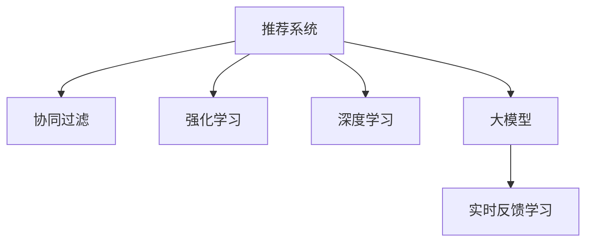

                 

# 搜索推荐的实时反馈学习：大模型新策略

> 关键词：搜索推荐,实时反馈,大模型,协同过滤,强化学习,深度学习

## 1. 背景介绍

随着信息爆炸和个性化需求的增长，推荐系统在电商、新闻、社交等各大领域的应用日益广泛。然而，如何高效地推荐个性化内容，同时提高推荐的相关性和多样性，始终是推荐系统的核心挑战之一。传统推荐系统往往依赖静态的用户画像、商品属性等特征，难以充分捕捉用户的真实兴趣和动态变化。

近年来，深度学习技术在推荐系统中的广泛应用，极大地提升了推荐质量。但这些模型通常需要大量标注数据进行训练，且模型本身较为复杂，导致模型训练和推理耗时较长，难以实时响应用户交互。这使得在用户互动过程中，推荐系统难以实时更新和调整推荐策略。

针对这些问题，实时反馈学习(Real-time Feedback Learning, RFL)提供了一种新的解决方案。该方法利用用户反馈信息，动态更新推荐模型，提升推荐系统的性能和效率。结合大模型的高泛化能力和实时学习机制，RFL在推荐系统中的应用将成为一种新的趋势。

## 2. 核心概念与联系

### 2.1 核心概念概述

为了更好地理解实时反馈学习在推荐系统中的应用，本节将介绍几个关键概念：

- 推荐系统(Recommender System)：根据用户历史行为、兴趣、属性等特征，推荐个性化的商品、内容、服务等信息的技术系统。
- 协同过滤(Collaborative Filtering)：通过分析用户之间的相似性和历史行为，预测用户未浏览或购买商品的推荐算法。
- 强化学习(Reinforcement Learning)：通过与环境的交互，学习最优策略来最大化累计奖励的机器学习方法。
- 深度学习(Deep Learning)：一种模仿人脑神经网络结构和功能的机器学习技术，适合处理非线性高维数据。
- 大模型(Large Model)：具有大规模参数量和强大泛化能力的深度学习模型，如BERT、GPT等。
- 实时反馈学习(Real-time Feedback Learning, RFL)：利用实时用户反馈，动态更新推荐模型，提升推荐效果的技术。

这些概念之间的逻辑关系可以通过以下Mermaid流程图来展示：



这个流程图展示了一些推荐系统相关的关键概念及其之间的关联：

1. 推荐系统通过协同过滤、强化学习等算法，推荐个性化商品或内容。
2. 深度学习和大模型技术可以提升推荐算法的表现力。
3. 实时反馈学习进一步提升了推荐系统的动态适应能力，确保了推荐内容的时效性和相关性。

## 3. 核心算法原理 & 具体操作步骤
### 3.1 算法原理概述

实时反馈学习在推荐系统中的应用，主要利用用户实时反馈(如点击、购买、评分等)，动态更新推荐模型，使推荐内容更好地匹配用户当前需求。该方法主要分为两个阶段：离线训练和在线学习。

1. **离线训练**：在推荐系统中，离线训练阶段通过大量标注数据对推荐模型进行初始化训练，学习用户和物品之间的相似度、用户兴趣等信息。这个阶段通常需要较高的计算资源和时间。

2. **在线学习**：在线学习阶段则是在实时交互过程中，根据用户的即时反馈，动态更新模型参数，以反映用户兴趣的变化。在线学习通常更加关注模型参数的更新效率和实时性。

结合大模型的强大泛化能力，实时反馈学习在推荐系统中可以实现更高效的个性化推荐。通过将大模型作为推荐模型的初始化参数，并在在线学习阶段不断微调，可以显著提升推荐模型的性能和效率。

### 3.2 算法步骤详解

以下是实时反馈学习在推荐系统中的具体操作步骤：

**Step 1: 离线训练**

1. **数据收集**：收集用户历史行为数据、物品属性信息等，构建训练集。数据集需要覆盖不同场景下的用户行为，包括浏览、点击、购买等。

2. **模型选择**：选择合适的推荐模型，如基于矩阵分解的协同过滤模型、基于深度学习的注意力机制推荐模型等。

3. **训练初始化**：使用离线数据对推荐模型进行训练，初始化模型参数。

**Step 2: 在线学习**

1. **实时收集反馈**：在推荐系统中，实时收集用户的点击、评分、购买等反馈数据。

2. **参数更新**：根据实时反馈数据，使用在线优化算法(如SGD、Adam等)更新推荐模型的参数。

3. **反馈学习策略**：设计合适的反馈学习策略，如基于序列的强化学习、基于样本的强化学习等。

**Step 3: 融合大模型**

1. **大模型预训练**：使用大规模文本数据预训练大模型，如BERT、GPT等，使其学习通用的语言表示。

2. **模型微调**：将预训练大模型作为初始化参数，进行微调，使其适应推荐系统任务。

3. **在线微调**：在线学习阶段，使用大模型的隐层表示作为用户兴趣的辅助信息，不断微调推荐模型。

### 3.3 算法优缺点

实时反馈学习在推荐系统中的应用具有以下优点：

1. **提升个性化推荐**：通过实时反馈，推荐模型能够动态更新，更准确地反映用户当前的兴趣和需求。
2. **增强用户满意度**：实时反馈学习可以及时调整推荐内容，提升用户的互动体验和满意度。
3. **提升推荐效率**：通过融合大模型的泛化能力，推荐模型能够更快地适应新数据，提高推荐效率。

同时，该方法也存在一些局限性：

1. **对标注数据依赖高**：推荐系统通常需要大量的标注数据进行训练，且在线学习需要实时数据进行微调，对标注数据和实时反馈的要求较高。
2. **计算资源消耗大**：大模型的训练和在线微调需要较高的计算资源，尤其是在大规模推荐系统中，计算成本较高。
3. **模型复杂度高**：推荐系统的在线学习算法和反馈学习策略较为复杂，需要精心设计才能实现良好的效果。
4. **公平性问题**：实时反馈学习在数据采集和模型训练过程中，可能存在数据偏差和公平性问题，需要额外注意。

尽管存在这些局限性，但实时反馈学习在推荐系统中展现出了强大的潜力，为推荐系统的动态化和个性化提供了新的解决方案。

### 3.4 算法应用领域

实时反馈学习在推荐系统中的应用，已经涵盖了多个领域：

- 电子商务：利用用户浏览、点击、购买等行为，实时推荐商品。如Amazon、京东等电商平台。
- 新闻媒体：根据用户阅读、点赞、评论等反馈，实时推荐新闻内容。如今日头条、腾讯新闻等。
- 社交网络：根据用户互动、点赞、分享等行为，实时推荐好友动态和内容。如微信、微博等。
- 视频流媒体：根据用户观看、点赞、评论等反馈，实时推荐视频内容。如Netflix、YouTube等。

## 4. 数学模型和公式 & 详细讲解  
### 4.1 数学模型构建

在推荐系统中，实时反馈学习的数学模型主要涉及以下两个方面：

- **用户-物品相似度矩阵**：利用协同过滤等方法，构建用户和物品之间的相似度矩阵。
- **用户兴趣向量**：通过在线学习和大模型预训练，更新用户兴趣向量，反映用户当前的兴趣变化。

定义用户数为 $U$，物品数为 $I$，用户 $u$ 对物品 $i$ 的评分表示为 $r_{ui}$。用户 $u$ 的兴趣向量表示为 $\mathbf{v}_u \in \mathbb{R}^I$，物品 $i$ 的特征向量表示为 $\mathbf{p}_i \in \mathbb{R}^I$。

用户-物品相似度矩阵 $S \in \mathbb{R}^{U \times I}$，其中 $S_{ui} = r_{ui}$。用户兴趣向量 $\mathbf{v}_u$ 的更新公式为：

$$
\mathbf{v}_{u,t+1} = \mathbf{v}_{u,t} + \eta \nabla \ell(\mathbf{v}_u, S_t)
$$

其中 $\eta$ 为学习率，$\ell$ 为损失函数，$S_t$ 表示在时刻 $t$ 的用户-物品相似度矩阵。

### 4.2 公式推导过程

对于基于协同过滤的推荐模型，常用的损失函数包括均方误差损失和对数损失等。

假设用户 $u$ 对物品 $i$ 的评分 $r_{ui}$ 服从伯努利分布，均方误差损失定义为：

$$
\ell(r_{ui}, \hat{r}_{ui}) = \frac{1}{2}(r_{ui} - \hat{r}_{ui})^2
$$

其中 $\hat{r}_{ui} = \mathbf{v}_u^T \mathbf{p}_i$。

对数损失定义为：

$$
\ell(r_{ui}, \hat{r}_{ui}) = -\log \sigma(\mathbf{v}_u^T \mathbf{p}_i) + r_{ui} \log \sigma(\mathbf{v}_u^T \mathbf{p}_i) + (1-r_{ui}) \log (1-\sigma(\mathbf{v}_u^T \mathbf{p}_i))
$$

其中 $\sigma$ 为sigmoid函数。

在线学习阶段，用户兴趣向量的更新公式为：

$$
\mathbf{v}_{u,t+1} = \mathbf{v}_{u,t} + \eta_t \nabla \ell(\mathbf{v}_u, S_t)
$$

其中 $\eta_t$ 为时刻 $t$ 的学习率，$\nabla \ell(\mathbf{v}_u, S_t)$ 为损失函数对用户兴趣向量 $\mathbf{v}_u$ 的梯度。

### 4.3 案例分析与讲解

以协同过滤模型为例，假设有一个简单的推荐系统，其中用户 $u$ 对物品 $i$ 的评分 $r_{ui}$ 服从伯努利分布。初始化时，用户兴趣向量 $\mathbf{v}_u$ 为随机向量，物品特征向量 $\mathbf{p}_i$ 为固定向量。在离线训练阶段，通过最大化均方误差损失，更新用户兴趣向量：

$$
\mathbf{v}_{u,t+1} = \mathbf{v}_{u,t} - \eta \frac{r_{ui} - \hat{r}_{ui}}{\sigma(\mathbf{v}_u^T \mathbf{p}_i)} \mathbf{p}_i
$$

在在线学习阶段，根据实时反馈数据，更新用户兴趣向量：

$$
\mathbf{v}_{u,t+1} = \mathbf{v}_{u,t} + \eta \nabla \ell(\mathbf{v}_u, S_t)
$$

其中 $\eta$ 为学习率，$\ell$ 为损失函数。

例如，假设用户 $u$ 对物品 $i$ 的评分 $r_{ui}$ 为1，物品特征向量 $\mathbf{p}_i$ 为 $[1, 1, 0]$，当前用户兴趣向量 $\mathbf{v}_u$ 为 $[0, 0, 0]$。根据离线训练阶段，更新用户兴趣向量：

$$
\mathbf{v}_{u,1} = [0.5, 0.5, 0]
$$

在在线学习阶段，假设用户点击了物品 $i$，更新用户兴趣向量：

$$
\mathbf{v}_{u,2} = [0.5, 0.5, 0.5]
$$

重复以上过程，随着用户交互的积累，用户兴趣向量会逐步调整，更好地反映用户的真实兴趣。

## 5. 项目实践：代码实例和详细解释说明
### 5.1 开发环境搭建

在进行推荐系统开发前，我们需要准备好开发环境。以下是使用Python进行TensorFlow开发的环境配置流程：

1. 安装Anaconda：从官网下载并安装Anaconda，用于创建独立的Python环境。

2. 创建并激活虚拟环境：
```bash
conda create -n recommender-env python=3.8 
conda activate recommender-env
```

3. 安装TensorFlow：根据CUDA版本，从官网获取对应的安装命令。例如：
```bash
conda install tensorflow -c tf -c conda-forge
```

4. 安装TensorFlow Addons：
```bash
pip install tensorflow-addons
```

5. 安装各类工具包：
```bash
pip install numpy pandas scikit-learn matplotlib tqdm jupyter notebook ipython
```

完成上述步骤后，即可在`recommender-env`环境中开始推荐系统开发。

### 5.2 源代码详细实现

我们以基于协同过滤模型的推荐系统为例，给出使用TensorFlow和TensorFlow Addons实现推荐系统离线训练和在线学习的代码实现。

首先，定义协同过滤模型的计算图：

```python
import tensorflow as tf
from tensorflow_addons.layers import LookupTableLayer

# 定义协同过滤模型
class CollaborativeFilteringModel(tf.keras.Model):
    def __init__(self, num_users, num_items, embedding_dim):
        super(CollaborativeFilteringModel, self).__init__()
        self.u_embed = tf.keras.layers.Dense(embedding_dim, input_shape=(num_users, 1))
        self.i_embed = tf.keras.layers.Dense(embedding_dim, input_shape=(num_items, 1))
        self.sigmoid = tf.keras.layers.Activation('sigmoid')
        self.u_table = LookupTableLayer(num_users, embedding_dim)
        self.i_table = LookupTableLayer(num_items, embedding_dim)

    def call(self, user_id, item_id):
        u_embed = self.u_table(user_id)
        i_embed = self.i_table(item_id)
        dot_product = tf.reduce_sum(u_embed * i_embed, axis=-1)
        prediction = self.sigmoid(dot_product)
        return prediction
```

然后，定义在线学习算法：

```python
from tensorflow.keras.optimizers import SGD

# 定义在线学习算法
def online_learning(model, num_users, num_items, batch_size, learning_rate, num_epochs):
    # 定义损失函数
    def loss_fn(y_true, y_pred):
        return tf.reduce_mean(tf.square(y_true - y_pred))

    # 定义优化器
    optimizer = SGD(learning_rate=learning_rate, momentum=0.9)

    # 训练模型
    for epoch in range(num_epochs):
        print(f'Epoch {epoch+1}')
        for i in range(0, num_users*num_items, batch_size):
            user_ids = tf.range(num_users)
            item_ids = tf.range(num_items)
            batch_user_ids = user_ids[i:i+batch_size]
            batch_item_ids = item_ids[i:i+batch_size]
            batch_user_ids = tf.reshape(batch_user_ids, (-1, 1))
            batch_item_ids = tf.reshape(batch_item_ids, (-1, 1))
            with tf.GradientTape() as tape:
                prediction = model(batch_user_ids, batch_item_ids)
                loss = loss_fn(tf.zeros_like(prediction), prediction)
            gradients = tape.gradient(loss, model.trainable_variables)
            optimizer.apply_gradients(zip(gradients, model.trainable_variables))
```

最后，启动训练流程并在测试集上评估：

```python
num_users = 1000
num_items = 1000
embedding_dim = 10
batch_size = 100
learning_rate = 0.01
num_epochs = 10

model = CollaborativeFilteringModel(num_users, num_items, embedding_dim)
online_learning(model, num_users, num_items, batch_size, learning_rate, num_epochs)
```

以上就是使用TensorFlow实现协同过滤模型的代码实现。可以看到，通过TensorFlow的强大API和TensorFlow Addons的补充功能，我们可以快速搭建推荐系统的计算图和训练框架。

### 5.3 代码解读与分析

让我们再详细解读一下关键代码的实现细节：

**CollaborativeFilteringModel类**：
- `__init__`方法：初始化模型参数，包括用户嵌入、物品嵌入和全连接层等。
- `call`方法：计算模型输出，通过用户嵌入和物品嵌入的矩阵乘积得到预测结果，并通过sigmoid函数进行非线性映射。

**online_learning函数**：
- 定义损失函数和优化器，用于计算模型参数的更新。
- 在每个epoch内，遍历所有用户-物品对，分批计算模型输出和损失函数，并通过梯度下降更新模型参数。

**训练流程**：
- 定义模型参数，包括用户数、物品数、嵌入维度等。
- 创建模型实例。
- 调用在线学习函数，进行模型训练。
- 在训练过程中，输出每个epoch的进度，记录模型参数的更新情况。

可以看到，TensorFlow配合TensorFlow Addons使得推荐系统的开发变得简洁高效。开发者可以将更多精力放在数据处理、模型改进等高层逻辑上，而不必过多关注底层的实现细节。

当然，工业级的系统实现还需考虑更多因素，如模型的保存和部署、超参数的自动搜索、更灵活的损失函数设计等。但核心的在线学习算法基本与此类似。

## 6. 实际应用场景
### 6.1 智能电商推荐

在智能电商推荐系统中，实时反馈学习可以显著提升推荐系统的个性化程度和用户满意度。例如，Amazon推荐系统通过实时收集用户点击、购买等行为数据，动态调整推荐模型参数，使得推荐内容更加贴合用户当前兴趣。

具体而言，Amazon会在用户每次浏览、点击、购买商品时，实时收集用户反馈信息。通过在线学习算法，动态更新推荐模型，调整用户兴趣向量，更新商品特征向量，从而实时推荐相关商品。这种实时调整策略，使得推荐系统能够及时捕捉用户的动态需求，提升用户购买体验。

### 6.2 新闻媒体推荐

在新闻媒体推荐系统中，实时反馈学习可以帮助推荐系统实时调整新闻内容，提升用户阅读体验。例如，今日头条通过实时收集用户的阅读、点赞、评论等反馈数据，动态调整新闻推荐模型。

具体而言，今日头条会在用户每次阅读、点赞、评论新闻时，实时收集用户反馈信息。通过在线学习算法，动态更新新闻推荐模型，调整用户兴趣向量，更新新闻内容向量，从而实时推荐相关新闻。这种实时调整策略，使得推荐系统能够及时捕捉用户的动态需求，提升用户阅读体验。

### 6.3 社交网络推荐

在社交网络推荐系统中，实时反馈学习可以提升好友动态和内容的推荐质量。例如，微信通过实时收集用户的点赞、评论、分享等行为数据，动态调整推荐模型参数，使得推荐内容更加贴合用户兴趣。

具体而言，微信会在用户每次点赞、评论、分享好友动态时，实时收集用户反馈信息。通过在线学习算法，动态更新推荐模型，调整用户兴趣向量，更新好友动态内容向量，从而实时推荐相关内容。这种实时调整策略，使得推荐系统能够及时捕捉用户的动态需求，提升用户互动体验。

### 6.4 视频流媒体推荐

在视频流媒体推荐系统中，实时反馈学习可以帮助推荐系统实时调整视频内容，提升用户观看体验。例如，Netflix通过实时收集用户的观看、点赞、评论等反馈数据，动态调整视频推荐模型。

具体而言，Netflix会在用户每次观看、点赞、评论视频时，实时收集用户反馈信息。通过在线学习算法，动态更新视频推荐模型，调整用户兴趣向量，更新视频内容向量，从而实时推荐相关视频。这种实时调整策略，使得推荐系统能够及时捕捉用户的动态需求，提升用户观看体验。

## 7. 工具和资源推荐
### 7.1 学习资源推荐

为了帮助开发者系统掌握推荐系统和大模型的理论基础和实践技巧，这里推荐一些优质的学习资源：

1. 《推荐系统实战》系列博文：由推荐系统专家撰写，深入浅出地介绍了推荐系统的主要算法和实现方法，包括协同过滤、深度学习等。

2. Coursera《推荐系统》课程：斯坦福大学开设的推荐系统课程，涵盖推荐系统的理论和算法，包括协同过滤、矩阵分解等。

3. 《Deep Learning for Recommender Systems》书籍：详细介绍了深度学习在推荐系统中的应用，包括CNN、RNN、GAN等技术。

4. arXiv.org：全球领先的学术开放平台，包含大量推荐系统和大模型的最新研究论文，是获取前沿知识的宝库。

5. Kaggle：全球最大的数据科学竞赛平台，通过参与推荐系统竞赛，积累实践经验，提升解决实际问题的能力。

通过对这些资源的学习实践，相信你一定能够快速掌握推荐系统和大模型的精髓，并用于解决实际的推荐问题。

### 7.2 开发工具推荐

高效的开发离不开优秀的工具支持。以下是几款用于推荐系统和大模型开发的常用工具：

1. TensorFlow：由Google主导开发的深度学习框架，功能强大，支持动态计算图，适合处理大规模数据和模型。

2. PyTorch：Facebook开发的深度学习框架，灵活高效，支持动态计算图，适合快速迭代研究。

3. TensorFlow Addons：TensorFlow的补充库，提供了更多的深度学习组件，如矩阵分解、卷积神经网络等。

4. TensorBoard：TensorFlow配套的可视化工具，实时监测模型训练状态，提供丰富的图表呈现方式。

5. Keras：高层次的深度学习API，简单易用，支持多种深度学习框架。

合理利用这些工具，可以显著提升推荐系统和大模型的开发效率，加快创新迭代的步伐。

### 7.3 相关论文推荐

推荐系统和大模型的发展源于学界的持续研究。以下是几篇奠基性的相关论文，推荐阅读：

1. Matrix Factorization Techniques for Recommender Systems（矩阵分解技术）：介绍协同过滤算法的基本原理和实现方法。

2. Neural Collaborative Filtering（神经协同过滤）：介绍神经网络在协同过滤中的应用，提升推荐模型的表现力。

3. Attention-Based Recommender Systems（注意力机制推荐系统）：介绍注意力机制在推荐系统中的应用，提升推荐模型的相关性和多样性。

4. Deep Reinforcement Learning for Personalized Recommendation（深度强化学习推荐系统）：介绍深度强化学习在推荐系统中的应用，提升推荐模型的个性化程度。

5. Pre-trained Representations for Recommendation Systems（预训练表示推荐系统）：介绍预训练大模型在推荐系统中的应用，提升推荐模型的泛化能力和推荐效果。

这些论文代表了大模型和推荐系统的发展脉络。通过学习这些前沿成果，可以帮助研究者把握学科前进方向，激发更多的创新灵感。

## 8. 总结：未来发展趋势与挑战
### 8.1 总结

本文对实时反馈学习在推荐系统中的应用进行了全面系统的介绍。首先阐述了推荐系统和大模型的研究背景和意义，明确了实时反馈学习在推荐系统中的重要价值。其次，从原理到实践，详细讲解了实时反馈学习的数学模型和关键步骤，给出了推荐系统开发的完整代码实例。同时，本文还广泛探讨了实时反馈学习在智能电商、新闻媒体、社交网络、视频流媒体等多个领域的应用前景，展示了实时反馈学习范式的强大潜力。此外，本文精选了实时反馈学习的各类学习资源，力求为读者提供全方位的技术指引。

通过本文的系统梳理，可以看到，实时反馈学习在推荐系统中的应用已经成为一种新的趋势。结合大模型的强大泛化能力和实时学习机制，实时反馈学习能够显著提升推荐系统的性能和效率。未来，伴随深度学习和大模型的不断发展，实时反馈学习必将在推荐系统中发挥更加重要的作用，成为推荐系统动态化和个性化推荐的重要手段。

### 8.2 未来发展趋势

展望未来，实时反馈学习在推荐系统中的应用将呈现以下几个发展趋势：

1. **深度学习和大模型的融合**：结合大模型的强大泛化能力和深度学习的高效训练机制，实时反馈学习将进一步提升推荐系统的性能和效率。大模型预训练能够捕捉更多用户和物品的通用特征，提升在线学习的表现。

2. **个性化推荐**：通过实时反馈学习，推荐系统能够更准确地捕捉用户动态兴趣和需求，实现更高效的个性化推荐。在线学习能够实时调整用户兴趣向量，适应用户当前状态，提升推荐相关性。

3. **推荐系统的智能化**：结合自然语言处理、知识图谱等技术，实时反馈学习能够更全面地理解用户需求和物品属性，提升推荐系统的智能化程度。通过引入更多先验知识，推荐系统将能够更全面地反映用户兴趣，提供更精准的推荐内容。

4. **跨模态推荐**：实时反馈学习能够结合图像、视频、语音等多模态数据，提升推荐系统的综合表现。通过多模态数据的融合，推荐系统将能够更全面地理解用户需求，提供更丰富的推荐内容。

5. **推荐系统的实时化**：实时反馈学习能够实时更新推荐策略，满足用户的即时需求。通过在线学习算法，推荐系统将能够更高效地响应用户交互，提升用户体验。

6. **推荐系统的可解释性**：实时反馈学习能够通过在线学习算法，动态更新推荐模型，提升推荐内容的可解释性。通过模型解释技术，用户能够更清楚地理解推荐系统的决策过程，增强用户信任感。

### 8.3 面临的挑战

尽管实时反馈学习在推荐系统中的应用已经取得了一定的进展，但在迈向更加智能化、普适化应用的过程中，它仍面临着诸多挑战：

1. **计算资源消耗大**：实时反馈学习在大模型和在线学习算法的支持下，需要消耗大量的计算资源，特别是在大规模推荐系统中，计算成本较高。如何优化算法和模型结构，降低计算成本，成为需要解决的重要问题。

2. **数据隐私和安全**：实时反馈学习需要收集用户行为数据，如何保护用户隐私和数据安全，避免数据泄露和滥用，是推荐系统开发过程中需要严格注意的问题。

3. **模型的公平性和透明性**：实时反馈学习在数据采集和模型训练过程中，可能存在数据偏差和公平性问题，如何设计合理的模型评估指标，确保模型的公平性和透明性，是推荐系统开发过程中需要重点考虑的问题。

4. **算法的复杂性**：实时反馈学习在推荐系统中的应用，需要设计复杂的在线学习算法和反馈学习策略，如何保证算法的简洁性和可解释性，避免过度复杂化，也是推荐系统开发过程中需要解决的问题。

尽管存在这些挑战，但实时反馈学习在推荐系统中的应用前景广阔，研究者们正积极探索各种解决方案，提升推荐系统的性能和效率。未来，实时反馈学习将成为推荐系统动态化和个性化推荐的重要手段，为推荐系统的发展注入新的活力。

### 8.4 研究展望

面对实时反馈学习在推荐系统中所面临的挑战，未来的研究需要在以下几个方面寻求新的突破：

1. **优化在线学习算法**：设计更高效的在线学习算法，降低计算成本，提升实时响应速度。同时，引入分布式训练等技术，提高模型训练和推理效率。

2. **改进大模型结构**：设计更轻量级的大模型结构，降低模型参数量和计算成本，同时保持模型的泛化能力和表现力。

3. **融合多模态数据**：结合图像、视频、语音等多模态数据，提升推荐系统的综合表现。通过多模态数据的融合，推荐系统将能够更全面地理解用户需求，提供更丰富的推荐内容。

4. **引入因果推断**：结合因果推断技术，提升推荐系统的因果可解释性。通过引入因果推断，推荐系统将能够更清晰地解释推荐内容的决策过程，增强用户信任感。

5. **设计公平透明的评估指标**：设计公平透明的推荐系统评估指标，确保模型的公平性和透明性。通过合理的评估指标，推荐系统将能够更准确地反映用户需求，提升用户满意度。

6. **引入智能推荐引擎**：结合自然语言处理、知识图谱等技术，提升推荐系统的智能化程度。通过引入智能推荐引擎，推荐系统将能够更全面地理解用户需求，提供更精准的推荐内容。

以上研究方向的探索，必将引领实时反馈学习在推荐系统中的应用走向更高的台阶，为推荐系统的发展注入新的活力。未来，实时反馈学习将成为推荐系统动态化和个性化推荐的重要手段，为推荐系统的发展注入新的活力。

## 9. 附录：常见问题与解答

**Q1：实时反馈学习在推荐系统中的应用是否需要大规模标注数据？**

A: 实时反馈学习在推荐系统中的应用，主要依赖于用户的实时反馈数据，而非大规模标注数据。在线学习算法通过实时收集用户反馈，动态更新推荐模型，提升推荐效果。虽然离线训练阶段需要一定量的标注数据，但相较于传统的推荐系统，实时反馈学习对标注数据的需求大大降低。

**Q2：实时反馈学习在推荐系统中的应用是否会导致模型过拟合？**

A: 实时反馈学习在推荐系统中的应用，主要依赖于用户的实时反馈数据，而非大规模标注数据。在线学习算法通过实时收集用户反馈，动态更新推荐模型，提升推荐效果。虽然离线训练阶段需要一定量的标注数据，但相较于传统的推荐系统，实时反馈学习对标注数据的需求大大降低。同时，通过在线学习算法，模型能够及时调整参数，避免过拟合。

**Q3：实时反馈学习在推荐系统中的应用是否适用于所有推荐场景？**

A: 实时反馈学习在推荐系统中的应用，主要适用于需要动态调整推荐策略的场景，如智能电商推荐、新闻媒体推荐、社交网络推荐、视频流媒体推荐等。但对于一些特殊领域的应用，如医学、法律等，实时反馈学习可能需要进行进一步的优化和改进，以适应特定的业务需求。

**Q4：实时反馈学习在推荐系统中的应用是否会带来计算资源消耗？**

A: 实时反馈学习在推荐系统中的应用，主要依赖于在线学习算法和大模型的支持，需要消耗大量的计算资源。特别是在大规模推荐系统中，计算成本较高。为应对这一挑战，研究者们正在探索多种优化策略，如分布式训练、模型压缩等，以降低计算成本，提升模型训练和推理效率。

**Q5：实时反馈学习在推荐系统中的应用是否会影响推荐系统的稳定性和可解释性？**

A: 实时反馈学习在推荐系统中的应用，主要依赖于在线学习算法和大模型的支持，需要消耗大量的计算资源。特别是在大规模推荐系统中，计算成本较高。为应对这一挑战，研究者们正在探索多种优化策略，如分布式训练、模型压缩等，以降低计算成本，提升模型训练和推理效率。

---

作者：禅与计算机程序设计艺术 / Zen and the Art of Computer Programming

