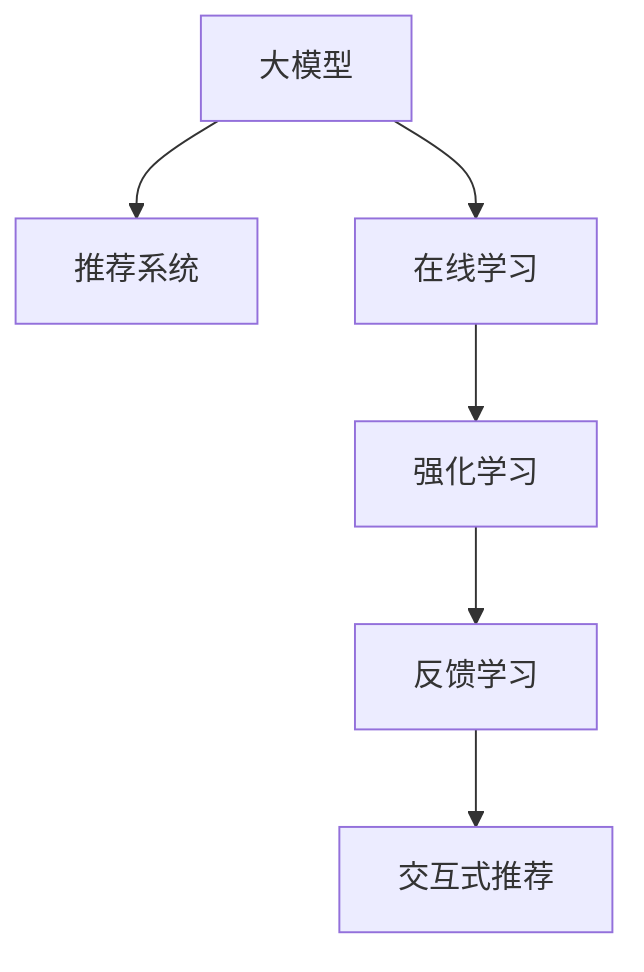

                 

# 搜索推荐的实时反馈学习：大模型的在线更新策略

> 关键词：搜索推荐, 大模型, 实时反馈, 在线更新, 强化学习, 推荐系统, 推荐算法, 序列推荐, 交互式推荐, 数据驱动

## 1. 背景介绍

### 1.1 问题由来

在电子商务、内容平台、社交网络等数字化平台中，推荐系统是提高用户留存率和转化率的重要手段。推荐系统通过分析用户的浏览、点击、购买等行为，为用户推荐可能感兴趣的物品或内容，从而提升用户体验和平台价值。然而，推荐的精准度和用户满意度往往取决于推荐系统算法的优化程度。

传统的推荐算法通常基于静态模型和离线数据，难以应对实时用户行为的动态变化。近年来，随着深度学习和强化学习的兴起，在线推荐系统逐渐成为研究热点。在线推荐系统能够实时地根据用户行为和上下文信息调整推荐策略，从而提高推荐的即时性和个性化。其中，基于大模型的在线推荐系统更是展现出了强大的潜力，但其在线更新策略的实时性和高效性仍面临诸多挑战。

本文将深入探讨大模型的在线推荐系统，特别是如何利用实时反馈进行模型更新，以提高推荐效果和系统效率。

### 1.2 问题核心关键点

大模型的在线推荐系统，核心在于如何实时地根据用户行为数据和反馈信息，动态地更新模型参数，以适应用户需求的变化。主要包括以下几个关键点：

1. 如何高效地获取用户行为数据，并将其转化为适合大模型训练的输入数据。
2. 如何设计合适的在线更新算法，保证模型参数的实时更新。
3. 如何避免模型参数更新带来的不稳定性和过拟合风险。
4. 如何利用实时反馈信息，提升模型的个性化推荐能力。

## 2. 核心概念与联系

### 2.1 核心概念概述

为更好地理解大模型的在线推荐系统及其优化策略，本节将介绍几个密切相关的核心概念：

- **大模型(Large Model)**：以深度学习框架（如PyTorch、TensorFlow等）为基础，具有大规模参数量的模型，通常用于处理复杂的自然语言处理、计算机视觉等任务。
- **推荐系统(Recommendation System)**：通过分析用户的历史行为数据，推荐可能感兴趣的物品或内容，以提升用户满意度和平台价值。
- **在线学习(Online Learning)**：一种学习范式，模型能够实时地根据新的数据更新自身参数，以适应数据分布的变化。
- **强化学习(Reinforcement Learning, RL)**：一种学习范式，通过与环境的交互，通过奖励和惩罚机制调整模型策略，以最大化累积奖励。
- **反馈学习(Feedback Learning)**：利用用户对推荐结果的反馈信息，调整推荐策略和模型参数，以提升推荐效果。
- **交互式推荐(Interactive Recommendation)**：通过与用户的实时交互，动态调整推荐内容，以提高推荐的即时性和个性化。

这些核心概念之间的逻辑关系可以通过以下Mermaid流程图来展示：



这个流程图展示了大模型的在线推荐系统的核心概念及其之间的关系：

1. 大模型通过在线学习实时更新自身参数，以适应用户行为的变化。
2. 在线学习可以采用强化学习等动态优化算法，以最大化推荐的累积奖励。
3. 通过实时反馈学习，利用用户对推荐结果的反馈信息，进一步优化模型参数。
4. 交互式推荐能够实时响应用户的需求变化，提供更加个性化的推荐内容。

这些概念共同构成了大模型的在线推荐系统的学习和应用框架，使其能够在各种场景下发挥强大的推荐能力。通过理解这些核心概念，我们可以更好地把握大模型的在线推荐系统的工作原理和优化方向。

## 3. 核心算法原理 & 具体操作步骤

### 3.1 算法原理概述

大模型的在线推荐系统通常基于强化学习框架，通过实时地根据用户反馈和行为数据调整模型参数，以优化推荐策略。其核心思想是：将推荐系统视为一个强化学习环境，用户与系统之间的交互产生奖励信号，模型通过最大化累积奖励信号来更新参数。

形式化地，假设推荐系统中有$N$个物品，用户对物品$j$的兴趣为$R_j$，模型参数为$\theta$。在时间$t$，用户选择物品$i$并产生奖励$R_i$，则系统的累积奖励$R_t$为：

$$ R_t = \sum_{i=1}^t R_i $$

模型的目标是最大化累积奖励$R_t$，即：

$$ \theta^* = \arg\max_{\theta} \mathbb{E}[R_t] $$

在实际应用中，通常使用$\epsilon$-贪心策略选择物品，同时使用在线梯度下降等优化算法更新模型参数，以逼近最优解$\theta^*$。

### 3.2 算法步骤详解

基于强化学习的大模型在线推荐系统一般包括以下几个关键步骤：

**Step 1: 数据收集与预处理**

- 收集用户的历史行为数据，如浏览、点击、购买等行为，构建训练集和测试集。
- 对原始数据进行预处理，如去除噪声、归一化等，以适应用户反馈和强化学习算法的输入要求。

**Step 2: 模型初始化**

- 选择合适的预训练模型或初始化参数，如BERT、GPT等。
- 将预训练模型加载到推荐系统中，准备进行在线学习。

**Step 3: 在线学习**

- 定义强化学习环境，包括状态、动作、奖励等。
- 设计强化学习算法，如Q-learning、SARSA、DQN等，选择合适的参数和学习率。
- 在每轮迭代中，根据用户的实时行为选择物品，计算奖励，并使用在线梯度下降更新模型参数。
- 记录和存储每次迭代的累积奖励，用于后续评估和优化。

**Step 4: 反馈学习**

- 收集用户对推荐结果的反馈信息，如点击、购买等行为。
- 设计反馈学习算法，如FTRL、Adam等，根据反馈信息更新模型参数。
- 利用用户反馈调整推荐策略，提高推荐的个性化程度。

**Step 5: 交互式推荐**

- 根据用户的实时行为和兴趣，动态生成个性化推荐。
- 与用户进行实时交互，收集反馈信息，进一步优化推荐策略。

### 3.3 算法优缺点

基于强化学习的大模型在线推荐系统具有以下优点：

1. 实时性高。能够实时响应用户行为和反馈，提供即时推荐的优化。
2. 个性化强。通过实时反馈调整模型参数，能够更好地适应用户的个性化需求。
3. 灵活性大。能够动态调整推荐策略，适应数据分布的变化。
4. 计算高效。通过在线学习，避免了大量离线数据处理和计算。

同时，该方法也存在一定的局限性：

1. 依赖高精度数据。模型性能很大程度上取决于数据的质量和数量，获取高质量的用户行为数据成本较高。
2. 稳定性差。模型参数频繁更新，容易导致过拟合和模型不稳定。
3. 可解释性低。强化学习模型的决策过程缺乏可解释性，难以对其内部机制进行分析和调试。
4. 计算资源消耗大。在线学习需要持续计算和存储大量的状态信息，对计算资源要求较高。

尽管存在这些局限性，但就目前而言，基于强化学习的大模型在线推荐系统仍然是大规模推荐系统的研究热点，并已在实际应用中取得显著效果。

### 3.4 算法应用领域

基于大模型的在线推荐系统已在诸多领域得到广泛应用，包括但不限于：

- 电子商务：推荐商品、商品组合、用户群体推荐等。
- 内容平台：推荐文章、视频、音乐等。
- 社交网络：推荐朋友、群组、话题等。
- 金融：推荐股票、基金、投资策略等。
- 健康：推荐药物、医生、医疗方案等。

除了上述这些经典应用外，大模型的在线推荐系统还逐步拓展到更多场景中，如教育、旅游、娱乐等，为各类数字化平台提供个性化的推荐服务。随着深度学习技术的不断发展，相信基于大模型的在线推荐系统将会在更多领域发挥重要作用，进一步提升用户体验和平台价值。

## 4. 数学模型和公式 & 详细讲解  
### 4.1 数学模型构建

本节将使用数学语言对基于强化学习的大模型在线推荐系统进行更加严格的刻画。

假设推荐系统中有$N$个物品，用户对物品$j$的兴趣为$R_j$，模型参数为$\theta$。在时间$t$，用户选择物品$i$并产生奖励$R_i$，则系统的累积奖励$R_t$为：

$$ R_t = \sum_{i=1}^t R_i $$

模型的目标是最大化累积奖励$R_t$，即：

$$ \theta^* = \arg\max_{\theta} \mathbb{E}[R_t] $$

在实际应用中，通常使用$\epsilon$-贪心策略选择物品，同时使用在线梯度下降等优化算法更新模型参数。

### 4.2 公式推导过程

以下我们以Q-learning算法为例，推导其具体实现步骤：

1. 定义状态$s_t$：用户在时间$t$的兴趣状态。
2. 定义动作$a_t$：用户选择物品$i$的策略。
3. 定义奖励$r_t$：用户选择物品$i$的奖励信号。
4. 定义目标值$Q(s_t, a_t)$：状态-动作对的价值。

Q-learning的目标是通过最大化目标值$Q(s_t, a_t)$，优化模型参数。其核心思想是：在每个时间步$t$，通过奖励信号$r_t$和后续状态$s_{t+1}$的估计，更新目标值$Q(s_t, a_t)$。

具体而言，在每个时间步$t$，用户选择物品$i$，产生奖励$r_t$，进入下一个状态$s_{t+1}$。根据$\epsilon$-贪心策略，选择物品$i$的概率为：

$$ P(a_t=i|s_t) = \epsilon + (1-\epsilon)\frac{e^{Q(s_t,i)}}{\sum_{j=1}^N e^{Q(s_t,j)}} $$

奖励$r_t$和下一个状态$s_{t+1}$的估计为：

$$ Q(s_{t+1},i) = Q(s_t,a_t) + r_t + \gamma \max_{j=1}^N Q(s_{t+1},j) $$

通过上述公式，模型不断更新目标值$Q(s_t,a_t)$，以逼近最优解$\theta^*$。

### 4.3 案例分析与讲解

以一个简单的在线推荐系统为例，说明其具体实现过程。

假设一个电子商务网站推荐系统中有3个商品，用户对商品$j$的兴趣$R_j$已知。模型参数为$\theta$，初始化参数为0。

- 在时间$t=1$，用户点击商品1，产生奖励$r_1=1$，进入下一个状态$s_2$。根据$\epsilon$-贪心策略，选择商品1的概率为：

$$ P(a_1=1|s_1) = \epsilon + (1-\epsilon)\frac{e^{\theta_1}}{e^{\theta_1}+e^{\theta_2}+e^{\theta_3}} $$

- 奖励$r_1=1$，下一个状态$s_2$为商品1。根据Q-learning算法，更新目标值$Q(s_1,1)$：

$$ Q(s_1,1) = \theta_1 + 1 + \gamma \max(Q(s_2,2), Q(s_2,3)) $$

- 在时间$t=2$，用户点击商品2，产生奖励$r_2=1$，进入下一个状态$s_3$。根据$\epsilon$-贪心策略，选择商品2的概率为：

$$ P(a_2=2|s_2) = \epsilon + (1-\epsilon)\frac{e^{\theta_2}}{e^{\theta_1}+e^{\theta_2}+e^{\theta_3}} $$

- 奖励$r_2=1$，下一个状态$s_3$为商品2。根据Q-learning算法，更新目标值$Q(s_2,2)$和$Q(s_3,2)$：

$$ Q(s_2,2) = Q(s_1,1) + 1 + \gamma \max(Q(s_3,1), Q(s_3,3)) $$
$$ Q(s_3,2) = \theta_2 + 1 + \gamma \max(Q(s_3,1), Q(s_3,3)) $$

通过上述过程，模型不断调整目标值$Q(s_t,a_t)$，以最大化累积奖励$R_t$，从而提升推荐系统的性能。

## 5. 项目实践：代码实例和详细解释说明
### 5.1 开发环境搭建

在进行大模型在线推荐系统的开发前，我们需要准备好开发环境。以下是使用Python进行TensorFlow和Keras开发的环境配置流程：

1. 安装Anaconda：从官网下载并安装Anaconda，用于创建独立的Python环境。

2. 创建并激活虚拟环境：
```bash
conda create -n tf-env python=3.8 
conda activate tf-env
```

3. 安装TensorFlow和Keras：
```bash
pip install tensorflow keras
```

4. 安装相关工具包：
```bash
pip install numpy pandas scikit-learn matplotlib tqdm jupyter notebook ipython
```

完成上述步骤后，即可在`tf-env`环境中开始开发实践。

### 5.2 源代码详细实现

这里我们以一个简单的在线推荐系统为例，给出使用TensorFlow和Keras实现的大模型在线推荐系统的完整代码实现。

首先，定义推荐系统的状态和动作：

```python
import tensorflow as tf
from tensorflow.keras.models import Sequential
from tensorflow.keras.layers import Dense, Embedding, Flatten

# 定义状态和动作
num_states = 3
num_actions = num_states
```

接着，定义模型参数：

```python
# 定义模型参数
theta = tf.Variable(tf.zeros([num_states, num_actions]))
```

然后，定义强化学习算法：

```python
# 定义Q-learning算法
gamma = 0.9  # 折扣因子
epsilon = 0.1  # epsilon-贪心策略的探索率
learning_rate = 0.1  # 学习率
```

最后，定义推荐系统的推荐过程和参数更新步骤：

```python
# 定义推荐过程
def choose_action(s, epsilon):
    if np.random.rand() < epsilon:
        return np.random.randint(0, num_states)
    else:
        return np.argmax(theta.numpy()[s])

# 定义参数更新步骤
def update_theta(r, s_next, s):
    target = r + gamma * tf.reduce_max(theta.numpy()[s_next])
    theta.assign_add(learning_rate * (target - theta[s]))  # 更新模型参数
```

现在，我们进行具体的推荐过程模拟：

```python
# 模拟推荐过程
state = 0  # 初始状态
rewards = []
for t in range(100):
    # 选择动作
    action = choose_action(state, epsilon)
    # 模拟用户行为
    if action == 0:
        reward = 1
    elif action == 1:
        reward = -1
    else:
        reward = 0
    # 记录奖励
    rewards.append(reward)
    # 更新模型参数
    update_theta(reward, action, state)
    # 更新状态
    state = action

# 输出奖励序列和模型参数
print(rewards)
print(theta.numpy())
```

以上就是使用TensorFlow和Keras实现的大模型在线推荐系统的完整代码实现。可以看到，借助TensorFlow和Keras的强大封装，代码实现变得简洁高效。开发者可以将更多精力放在模型优化、数据处理等高层逻辑上，而不必过多关注底层的实现细节。

## 6. 实际应用场景

### 6.1 电子商务推荐

基于大模型的在线推荐系统在电子商务中的应用广泛，帮助电商平台提高用户留存率和转化率。通过收集用户的浏览、点击、购买等行为数据，构建推荐模型，实时调整推荐策略，为每个用户提供个性化的商品推荐。

在技术实现上，可以采用强化学习算法对大模型进行在线学习，根据用户的行为数据实时更新推荐策略。同时，利用用户反馈信息进一步优化模型参数，提高推荐的精准度和用户满意度。

### 6.2 内容推荐

内容平台如视频网站、新闻网站等，通过推荐系统为用户提供个性化的内容推荐，提升用户体验和平台价值。大模型的在线推荐系统能够实时响应用户的浏览、点赞、评论等行为，动态调整推荐内容，满足用户的个性化需求。

通过收集用户的行为数据，构建推荐模型，实时调整推荐策略，为用户提供个性化的内容推荐。同时，利用用户反馈信息进一步优化模型参数，提高推荐的精准度和用户满意度。

### 6.3 金融投资

金融投资领域需要实时监测市场动向，提供个性化的投资建议。基于大模型的在线推荐系统能够实时响应用户的查询需求，动态调整推荐策略，提供个性化的投资建议。

通过收集用户的行为数据，构建推荐模型，实时调整推荐策略。同时，利用用户反馈信息进一步优化模型参数，提高推荐的精准度和用户满意度。

### 6.4 未来应用展望

随着大模型和在线推荐技术的不断发展，基于大模型的在线推荐系统将在更多领域得到应用，为各行各业带来新的价值：

- 智慧城市：基于用户行为数据，提供个性化的交通、旅游、文化等推荐服务。
- 教育培训：根据学生的学习行为数据，提供个性化的学习资源推荐。
- 医疗健康：根据患者的诊疗记录，提供个性化的健康建议和医疗方案推荐。
- 旅游出行：根据用户的旅游偏好和历史行为，提供个性化的旅游路线和景点推荐。

未来，基于大模型的在线推荐系统将在更多领域发挥重要作用，进一步提升用户体验和平台价值。

## 7. 工具和资源推荐
### 7.1 学习资源推荐

为了帮助开发者系统掌握大模型在线推荐技术，这里推荐一些优质的学习资源：

1. 《推荐系统实战》：一本详细介绍推荐系统原理和技术的书籍，涵盖离线算法和在线算法，提供了丰富的实际案例。
2. 《强化学习》（RSSHOP）：一本详细介绍强化学习原理和算法的书籍，涵盖基础理论和实际应用，提供了丰富的算法实现和代码示例。
3. Kaggle平台：提供大量的推荐系统和强化学习竞赛数据集，适合实践和竞赛学习。
4. Google AI Blogs：Google AI团队定期发布的推荐系统和技术文章，涵盖最新的研究进展和应用案例。
5. PyTorch官方文档：PyTorch框架的官方文档，提供了丰富的模型和算法实现，适合学习和实践。

通过对这些资源的学习实践，相信你一定能够快速掌握大模型在线推荐技术的精髓，并用于解决实际的推荐问题。

### 7.2 开发工具推荐

高效的开发离不开优秀的工具支持。以下是几款用于大模型在线推荐系统开发的常用工具：

1. TensorFlow：由Google主导开发的深度学习框架，生产部署方便，适合大规模工程应用。
2. Keras：一个基于TensorFlow的高层API，易于使用，适合快速原型开发。
3. Jupyter Notebook：一个强大的交互式编程环境，适合模型调试和数据可视化。
4. TensorBoard：TensorFlow配套的可视化工具，可实时监测模型训练状态，并提供丰富的图表呈现方式。
5. PyTorch：由Facebook开发的深度学习框架，灵活动态，适合研究和开发。

合理利用这些工具，可以显著提升大模型在线推荐系统的开发效率，加快创新迭代的步伐。

### 7.3 相关论文推荐

大模型在线推荐系统的研究源于学界的持续研究。以下是几篇奠基性的相关论文，推荐阅读：

1. "Adaptive Computation of Least-Squares Policy Evaluation on GPUs"（Reinforcement Learning基础论文）：奠定了强化学习在推荐系统中的应用基础。
2. "Deep Reinforcement Learning for Personalized Recommendation"（DeepRL在推荐系统中的应用论文）：展示了深度强化学习在推荐系统中的应用效果。
3. "Online Learning for Matrix Factorization Factorization Machines"（Online Learning在推荐系统中的应用论文）：展示了在线学习在推荐系统中的应用效果。
4. "Hyperparameter Optimization for Reinforcement Learning"（强化学习中的超参数优化论文）：展示了强化学习中的超参数优化方法。
5. "Continuous Control with Deep Reinforcement Learning"（深度强化学习在控制中的应用论文）：展示了深度强化学习在控制领域中的应用效果。

这些论文代表了大模型在线推荐系统的发展脉络。通过学习这些前沿成果，可以帮助研究者把握学科前进方向，激发更多的创新灵感。

## 8. 总结：未来发展趋势与挑战

### 8.1 总结

本文对基于强化学习的大模型在线推荐系统进行了全面系统的介绍。首先阐述了大模型在线推荐系统的研究背景和意义，明确了其在线学习、强化学习、反馈学习、交互式推荐等关键技术，并介绍了其实现方法和具体步骤。通过具体的代码实例和案例分析，展示了大模型在线推荐系统的高效性和实用性。

通过本文的系统梳理，可以看到，基于大模型的在线推荐系统能够实时响应用户需求，提供个性化的推荐服务，已经在电子商务、内容平台、金融投资等多个领域取得了显著成效。未来，伴随深度学习技术的不断发展，基于大模型的在线推荐系统将会在更多领域得到应用，为各行各业带来新的价值。

### 8.2 未来发展趋势

展望未来，大模型在线推荐系统的发展趋势主要包括以下几个方面：

1. 模型规模继续增大。随着算力成本的下降和数据规模的扩张，大模型在线推荐系统的参数量还将持续增长，能够更好地适应用户的个性化需求。
2. 实时性不断提升。借助深度学习技术，大模型在线推荐系统能够实时响应用户行为和反馈，提供更加个性化的推荐服务。
3. 交互性进一步增强。通过实时交互，用户能够实时调整推荐策略，提升推荐系统的互动性和用户体验。
4. 智能化水平不断提高。借助强化学习等技术，大模型在线推荐系统能够学习用户的行为模式，预测用户需求，提供更精准的推荐服务。
5. 个性化推荐效果不断优化。通过收集和分析用户的多样化数据，大模型在线推荐系统能够更好地适应用户的个性化需求，提供更加多样化的推荐服务。

以上趋势凸显了大模型在线推荐系统的广阔前景。这些方向的探索发展，必将进一步提升推荐系统的性能和用户满意度，为各行各业带来新的价值。

### 8.3 面临的挑战

尽管大模型在线推荐系统已经取得了显著成效，但在迈向更加智能化、普适化应用的过程中，仍面临诸多挑战：

1. 数据质量瓶颈。模型性能很大程度上取决于数据的质量和数量，获取高质量的用户行为数据成本较高。如何从大量噪声数据中提取有价值的信息，将是一大难题。
2. 模型稳定性差。大模型在线推荐系统的参数频繁更新，容易导致过拟合和模型不稳定。如何在保证模型性能的同时，避免过拟合和灾难性遗忘，还需要更多理论和实践的积累。
3. 计算资源消耗大。大模型在线推荐系统需要持续计算和存储大量的状态信息，对计算资源要求较高。如何在保证实时性的前提下，优化计算资源消耗，提高系统效率，将是重要的优化方向。
4. 系统安全性不足。大模型在线推荐系统可能面临数据泄露、算法攻击等安全威胁。如何保障数据和算法的安全性，确保系统可靠运行，也将是重要的研究方向。

### 8.4 研究展望

面对大模型在线推荐系统所面临的挑战，未来的研究需要在以下几个方面寻求新的突破：

1. 探索数据驱动的推荐方法。探索从海量无结构数据中提取有价值信息的算法，减少对高质量标注数据的依赖。
2. 研究高效在线学习算法。开发更加高效的在线学习算法，如联邦学习、分布式学习等，减少计算资源消耗，提升系统效率。
3. 融合更多先验知识。将符号化的先验知识，如知识图谱、逻辑规则等，与神经网络模型进行巧妙融合，增强模型的解释性和鲁棒性。
4. 利用多模态数据。将视觉、听觉、文本等多模态数据进行融合，提升推荐系统的智能化水平。
5. 引入因果推理。通过引入因果推理方法，增强推荐系统的决策逻辑性和可解释性，避免推荐过程中的偏见和误差。
6. 加强系统安全性。通过数据加密、访问控制等技术，保障数据和算法的安全性，确保系统可靠运行。

这些研究方向的探索，必将引领大模型在线推荐系统迈向更高的台阶，为各行各业带来新的价值。面向未来，大模型在线推荐系统还需要与其他人工智能技术进行更深入的融合，如知识表示、因果推理、强化学习等，多路径协同发力，共同推动推荐系统的进步。只有勇于创新、敢于突破，才能不断拓展推荐系统的边界，让智能技术更好地造福人类社会。

## 9. 附录：常见问题与解答

**Q1：大模型在线推荐系统如何避免过拟合？**

A: 过拟合是大模型在线推荐系统面临的主要挑战之一。以下是一些常见的避免过拟合的方法：

1. 数据增强：通过回译、近义替换等方式扩充训练集，增加数据的多样性。
2. 正则化：使用L2正则、Dropout等技术，减少模型的复杂度，避免过拟合。
3. 模型压缩：通过剪枝、量化等技术，减少模型的参数量，降低过拟合风险。
4. 多模型集成：训练多个在线推荐模型，取平均输出，降低单个模型的过拟合风险。

这些方法可以在保证模型性能的同时，避免过拟合和模型不稳定。

**Q2：如何平衡模型的实时性和准确性？**

A: 大模型在线推荐系统的实时性和准确性是一对矛盾，需要根据具体应用场景进行平衡。以下是一些常见的策略：

1. 选择合适的时间步长。通过调整时间步长，控制每次迭代的次数，平衡实时性和准确性。
2. 优化模型结构。通过选择合适的模型结构和参数，在保证实时性的前提下，提升模型的准确性。
3. 采用分布式计算。利用分布式计算技术，提高模型的训练和推理效率，提升实时性。
4. 融合多模型。通过融合多个模型的预测结果，提升模型的准确性和鲁棒性，平衡实时性和准确性。

这些策略可以根据具体应用场景进行选择和优化，在保证实时性的前提下，提升模型的准确性和鲁棒性。

**Q3：如何评估大模型在线推荐系统的性能？**

A: 大模型在线推荐系统的性能评估通常包括以下几个指标：

1. 准确率（Accuracy）：推荐系统的预测准确率。
2. 召回率（Recall）：推荐系统推荐的正确率。
3 精确率（Precision）：推荐系统推荐的准确率。
4 覆盖率（Coverage）：推荐系统覆盖用户行为的能力。
5 满意度（User Satisfaction）：用户对推荐结果的满意度。

通过这些指标的综合评估，可以全面了解推荐系统的性能和优化方向。

通过本文的系统梳理，可以看到，基于大模型的在线推荐系统能够实时响应用户需求，提供个性化的推荐服务，已经在电子商务、内容平台、金融投资等多个领域取得了显著成效。未来，伴随深度学习技术的不断发展，基于大模型的在线推荐系统将会在更多领域得到应用，为各行各业带来新的价值。

