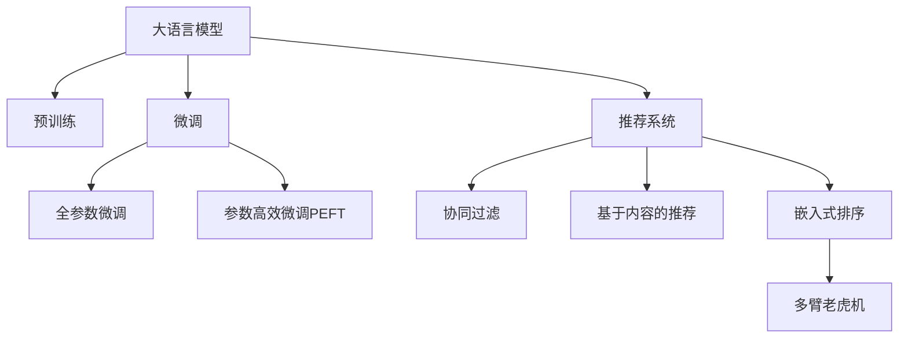

                 

## 1. 背景介绍

### 1.1 问题由来
随着互联网技术的迅猛发展，电商平台成为众多商家展示产品和服务的核心渠道。然而，在面对海量商品和复杂用户需求时，如何高效精准地推荐产品，提升用户体验，提高转化率，一直是电商平台的难点。

为了解决上述问题，商家和平台纷纷引入个性化推荐系统，利用机器学习和数据挖掘技术，实现基于用户行为、历史数据和商品属性的产品推荐。然而，传统的推荐算法通常依赖手工设计的特征工程和规则，难以充分利用大规模数据和模型复杂度，推荐的精度和多样性仍有待提升。

随着大语言模型和大规模预训练技术的发展，深度学习被进一步应用到推荐系统中，为个性化推荐带来了新的机遇。大模型具备强大的自学习和泛化能力，能够处理非结构化数据，学习复杂的用户-商品关系，从而提升推荐系统的精度和效果。

### 1.2 问题核心关键点
在大模型推荐系统中，关键在于如何高效利用大模型的预训练能力，在少量标注数据的情况下，快速构建和微调推荐模型。同时，如何通过大模型学习用户意图和商品特征，生成高质量的推荐结果。此外，如何平衡模型的推荐精度和推荐多样性，满足用户多层次的需求，也是一大挑战。

## 2. 核心概念与联系

### 2.1 核心概念概述

为更好地理解大模型在电商推荐系统中的应用，本节将介绍几个关键概念：

- 大语言模型(Large Language Model, LLM)：如GPT、BERT等，通过在大规模无标签文本语料上进行预训练，学习到通用的语言表示，具备强大的语言理解和生成能力。

- 预训练(Pre-training)：指在大规模无标签文本语料上，通过自监督学习任务训练通用语言模型的过程。常见的预训练任务包括言语建模、遮挡语言模型等。

- 微调(Fine-tuning)：指在预训练模型的基础上，使用下游任务的少量标注数据，通过有监督地训练优化模型在特定任务上的性能。

- 推荐系统(Recommendation System)：通过分析用户行为、商品属性、时间因素等信息，推荐最符合用户需求的商品或服务。包括协同过滤、基于内容的推荐等。

- 多臂老虎机(Multi-Armed Bandit)：在推荐系统中应用的一种决策模型，用于优化推荐结果的多样性和质量。

- 嵌入式排序(Embedding-Based Ranking)：利用向量空间中的相似度，将用户和商品表示为高维向量，直接计算相似度进行排序。

这些概念之间的逻辑关系可以通过以下Mermaid流程图来展示：



这个流程图展示了大语言模型的核心概念及其与推荐系统之间的关系：

1. 大语言模型通过预训练获得基础能力。
2. 微调是对预训练模型进行任务特定的优化，可以分为全参数微调和参数高效微调（PEFT）。
3. 推荐系统包括多种推荐方法，如协同过滤、嵌入式排序等。
4. 多臂老虎机用于优化推荐结果的多样性和质量。

这些概念共同构成了电商推荐系统的核心技术框架，使得推荐系统能够高效处理用户和商品信息，生成个性化的推荐结果。

## 3. 核心算法原理 & 具体操作步骤
### 3.1 算法原理概述

基于大模型的电商推荐系统，本质上是一个有监督的推荐模型微调过程。其核心思想是：将预训练的大语言模型视作一个强大的"特征提取器"，通过在电商推荐数据集上进行有监督的微调，使得模型输出能够匹配推荐系统的评分函数，从而生成个性化推荐。

具体来说，假设推荐系统数据集为 $D=\{(x_i, y_i)\}_{i=1}^N, x_i \in \mathcal{X}, y_i \in [0,1]$，其中 $x_i$ 表示用户和商品的特征向量，$y_i$ 表示用户对商品的评分。微调的目标是找到新的模型参数 $\theta$，使得模型在给定用户和商品特征的情况下，能准确预测用户对商品的评分。

### 3.2 算法步骤详解

基于大模型的电商推荐微调一般包括以下几个关键步骤：

**Step 1: 准备预训练模型和数据集**
- 选择合适的预训练语言模型 $M_{\theta}$ 作为初始化参数，如 GPT、BERT 等。
- 准备电商推荐数据集 $D$，划分为训练集、验证集和测试集。

**Step 2: 添加任务适配层**
- 根据推荐任务类型，设计合适的输出层和评分函数。
- 对于评分任务，通常在模型顶层添加线性分类器或回归器，以回归函数表示预测评分。
- 对于排序任务，通常使用最大值函数选择得分最高的推荐结果。

**Step 3: 设置微调超参数**
- 选择合适的优化算法及其参数，如 AdamW、SGD 等，设置学习率、批大小、迭代轮数等。
- 设置正则化技术及强度，包括权重衰减、Dropout、Early Stopping 等。
- 确定冻结预训练参数的策略，如仅微调顶层，或全部参数都参与微调。

**Step 4: 执行梯度训练**
- 将训练集数据分批次输入模型，前向传播计算评分函数。
- 反向传播计算参数梯度，根据设定的优化算法和学习率更新模型参数。
- 周期性在验证集上评估模型性能，根据性能指标决定是否触发 Early Stopping。
- 重复上述步骤直到满足预设的迭代轮数或 Early Stopping 条件。

**Step 5: 测试和部署**
- 在测试集上评估微调后模型 $M_{\hat{\theta}}$ 的性能，对比微调前后的评分精度提升。
- 使用微调后的模型对新商品进行评分预测，集成到电商平台的推荐系统中。
- 持续收集新的用户行为数据，定期重新微调模型，以适应数据分布的变化。

以上是基于大模型微调的电商推荐系统的一般流程。在实际应用中，还需要针对具体任务特点，对微调过程的各个环节进行优化设计，如改进评分函数，引入更多的正则化技术，搜索最优的超参数组合等，以进一步提升推荐系统的性能。

### 3.3 算法优缺点

基于大模型的电商推荐系统具有以下优点：
1. 精度高。大模型的强大自学习能力和泛化能力，使得推荐系统能够高效处理复杂多变的电商数据，生成更准确的推荐结果。
2. 数据灵活。大模型的预训练可以基于任意领域数据，如电商平台的用户行为数据、商品属性数据等，使得推荐系统能够适应多种电商场景。
3. 可解释性强。大模型中的自监督学习任务和下游微调，有助于理解用户和商品的隐含特征，从而提高推荐结果的可解释性。

同时，该方法也存在一定的局限性：
1. 标注成本高。电商推荐数据集通常需要大量用户行为数据和商品属性数据进行标注，成本较高。
2. 资源消耗大。大模型的训练和推理资源消耗大，部署成本高。
3. 推荐结果可能过拟合。由于标注数据较少，推荐模型可能对少数用户行为进行过拟合，生成不普适的推荐结果。
4. 个性化风险。大模型的推荐结果可能偏向某些特定用户，忽视其他用户的多样需求。

尽管存在这些局限性，但就目前而言，基于大模型的推荐系统仍然是电商推荐领域的主流范式。未来相关研究的重点在于如何进一步降低标注数据的成本，提高推荐系统的泛化能力，同时兼顾推荐结果的个性化和多样化。

### 3.4 算法应用领域

基于大模型的电商推荐系统已经在各大电商平台上广泛应用，覆盖了从商品推荐、内容推荐到营销活动推荐等多个场景，取得了显著的效果。

**商品推荐**：在用户浏览商品时，根据其历史行为和属性特征，推荐符合其兴趣的商品。利用大模型进行特征提取和评分预测，能够提升推荐系统的精度和多样性。

**内容推荐**：推荐用户可能感兴趣的文章、视频、商品等，提升用户黏性和平台留存率。大模型通过学习用户对不同内容的偏好，生成个性化的推荐结果。

**营销活动推荐**：根据用户行为和兴趣，推荐相关促销活动，如折扣券、优惠券等，提高用户转化率和平台收益。

除了这些常见场景外，大模型推荐系统还被创新性地应用到用户满意度预测、热销商品预测、店铺策略优化等方面，为电商平台带来了新的增值服务。

## 4. 数学模型和公式 & 详细讲解
### 4.1 数学模型构建

假设推荐系统的训练集为 $D=\{(x_i, y_i)\}_{i=1}^N, x_i \in \mathcal{X}, y_i \in [0,1]$。定义模型 $M_{\theta}$ 在给定用户和商品特征的情况下，预测用户对商品的评分：

$$
y_i = M_{\theta}(x_i)
$$

其中 $M_{\theta}$ 为微调后的模型，$\theta$ 为模型参数。微调的目标是最小化经验风险：

$$
\mathcal{L}(\theta) = \frac{1}{N} \sum_{i=1}^N \ell(y_i, M_{\theta}(x_i))
$$

其中 $\ell$ 为评分函数，常用的评分函数包括平方误差损失、绝对误差损失等。

### 4.2 公式推导过程

以下我们以平方误差损失函数为例，推导微调过程的损失函数和梯度计算公式。

假设模型 $M_{\theta}$ 在输入 $x_i$ 上的输出为 $\hat{y}=M_{\theta}(x_i)$，则平方误差损失函数定义为：

$$
\ell(y_i, \hat{y}) = (y_i - \hat{y})^2
$$

将其代入经验风险公式，得：

$$
\mathcal{L}(\theta) = \frac{1}{N} \sum_{i=1}^N (y_i - M_{\theta}(x_i))^2
$$

根据链式法则，损失函数对参数 $\theta_k$ 的梯度为：

$$
\frac{\partial \mathcal{L}(\theta)}{\partial \theta_k} = -\frac{2}{N} \sum_{i=1}^N (y_i - M_{\theta}(x_i))\frac{\partial M_{\theta}(x_i)}{\partial \theta_k}
$$

其中 $\frac{\partial M_{\theta}(x_i)}{\partial \theta_k}$ 可进一步递归展开，利用自动微分技术完成计算。

在得到损失函数的梯度后，即可带入参数更新公式，完成模型的迭代优化。重复上述过程直至收敛，最终得到适应电商推荐任务的最优模型参数 $\theta^*$。

## 5. 项目实践：代码实例和详细解释说明
### 5.1 开发环境搭建

在进行推荐系统开发前，我们需要准备好开发环境。以下是使用Python进行PyTorch开发的环境配置流程：

1. 安装Anaconda：从官网下载并安装Anaconda，用于创建独立的Python环境。

2. 创建并激活虚拟环境：
```bash
conda create -n pytorch-env python=3.8 
conda activate pytorch-env
```

3. 安装PyTorch：根据CUDA版本，从官网获取对应的安装命令。例如：
```bash
conda install pytorch torchvision torchaudio cudatoolkit=11.1 -c pytorch -c conda-forge
```

4. 安装Transformers库：
```bash
pip install transformers
```

5. 安装各类工具包：
```bash
pip install numpy pandas scikit-learn matplotlib tqdm jupyter notebook ipython
```

完成上述步骤后，即可在`pytorch-env`环境中开始推荐系统开发。

### 5.2 源代码详细实现

下面我们以电商平台商品推荐为例，给出使用Transformers库对BERT模型进行微调的PyTorch代码实现。

首先，定义推荐任务的数据处理函数：

```python
from transformers import BertTokenizer
from torch.utils.data import Dataset
import torch

class RecommendationDataset(Dataset):
    def __init__(self, texts, scores, tokenizer, max_len=128):
        self.texts = texts
        self.scores = scores
        self.tokenizer = tokenizer
        self.max_len = max_len
        
    def __len__(self):
        return len(self.texts)
    
    def __getitem__(self, item):
        text = self.texts[item]
        scores = self.scores[item]
        
        encoding = self.tokenizer(text, return_tensors='pt', max_length=self.max_len, padding='max_length', truncation=True)
        input_ids = encoding['input_ids'][0]
        attention_mask = encoding['attention_mask'][0]
        
        # 对label进行编码
        scores = scores.to(torch.float32) / 5
        encoded_scores = scores
        encoded_scores = torch.nn.functional.interpolate(encoded_scores.unsqueeze(-1), size=(1, self.max_len), mode='linear', align_corners=False).flatten(1)
        
        return {'input_ids': input_ids, 
                'attention_mask': attention_mask,
                'scores': encoded_scores}
```

然后，定义模型和优化器：

```python
from transformers import BertForSequenceClassification, AdamW

model = BertForSequenceClassification.from_pretrained('bert-base-cased', num_labels=5)

optimizer = AdamW(model.parameters(), lr=2e-5)
```

接着，定义训练和评估函数：

```python
from torch.utils.data import DataLoader
from tqdm import tqdm
from sklearn.metrics import roc_auc_score

device = torch.device('cuda') if torch.cuda.is_available() else torch.device('cpu')
model.to(device)

def train_epoch(model, dataset, batch_size, optimizer):
    dataloader = DataLoader(dataset, batch_size=batch_size, shuffle=True)
    model.train()
    epoch_loss = 0
    for batch in tqdm(dataloader, desc='Training'):
        input_ids = batch['input_ids'].to(device)
        attention_mask = batch['attention_mask'].to(device)
        scores = batch['scores'].to(device)
        model.zero_grad()
        outputs = model(input_ids, attention_mask=attention_mask, labels=scores)
        loss = outputs.loss
        epoch_loss += loss.item()
        loss.backward()
        optimizer.step()
    return epoch_loss / len(dataloader)

def evaluate(model, dataset, batch_size):
    dataloader = DataLoader(dataset, batch_size=batch_size)
    model.eval()
    true_scores = []
    predicted_scores = []
    with torch.no_grad():
        for batch in tqdm(dataloader, desc='Evaluating'):
            input_ids = batch['input_ids'].to(device)
            attention_mask = batch['attention_mask'].to(device)
            scores = batch['scores'].to(device)
            outputs = model(input_ids, attention_mask=attention_mask, labels=scores)
            batch_true_scores = scores.to('cpu').tolist()
            batch_predicted_scores = outputs.logits.flatten().to('cpu').tolist()
            true_scores.extend(batch_true_scores)
            predicted_scores.extend(batch_predicted_scores)
                
    print(f"AUC-ROC Score: {roc_auc_score(true_scores, predicted_scores)}")
```

最后，启动训练流程并在测试集上评估：

```python
epochs = 5
batch_size = 16

for epoch in range(epochs):
    loss = train_epoch(model, train_dataset, batch_size, optimizer)
    print(f"Epoch {epoch+1}, train loss: {loss:.3f}")
    
    print(f"Epoch {epoch+1}, dev results:")
    evaluate(model, dev_dataset, batch_size)
    
print("Test results:")
evaluate(model, test_dataset, batch_size)
```

以上就是使用PyTorch对BERT进行电商平台商品推荐任务微调的完整代码实现。可以看到，得益于Transformers库的强大封装，我们可以用相对简洁的代码完成BERT模型的加载和微调。

### 5.3 代码解读与分析

让我们再详细解读一下关键代码的实现细节：

**RecommendationDataset类**：
- `__init__`方法：初始化文本、评分等关键组件。
- `__len__`方法：返回数据集的样本数量。
- `__getitem__`方法：对单个样本进行处理，将文本输入编码为token ids，将评分编码为标签，并对其进行定长padding，最终返回模型所需的输入。

**模型和优化器**：
- 使用BertForSequenceClassification作为基础模型，设定标签数量为5（分类任务）。
- 使用AdamW优化器进行参数更新，学习率设为2e-5。

**训练和评估函数**：
- 使用PyTorch的DataLoader对数据集进行批次化加载，供模型训练和推理使用。
- 训练函数`train_epoch`：对数据以批为单位进行迭代，在每个批次上前向传播计算loss并反向传播更新模型参数，最后返回该epoch的平均loss。
- 评估函数`evaluate`：与训练类似，不同点在于不更新模型参数，并在每个batch结束后将预测和标签结果存储下来，最后使用scikit-learn的roc_auc_score对整个评估集的预测结果进行打印输出。

**训练流程**：
- 定义总的epoch数和batch size，开始循环迭代
- 每个epoch内，先在训练集上训练，输出平均loss
- 在验证集上评估，输出AUC-ROC Score
- 所有epoch结束后，在测试集上评估，给出最终测试结果

可以看到，PyTorch配合Transformers库使得BERT微调的代码实现变得简洁高效。开发者可以将更多精力放在数据处理、模型改进等高层逻辑上，而不必过多关注底层的实现细节。

当然，工业级的系统实现还需考虑更多因素，如模型的保存和部署、超参数的自动搜索、更灵活的任务适配层等。但核心的微调范式基本与此类似。

## 6. 实际应用场景
### 6.1 智能客服系统

基于大模型的电商平台推荐系统，可以广泛应用于智能客服系统的构建。传统客服往往需要配备大量人力，高峰期响应缓慢，且一致性和专业性难以保证。而使用推荐系统进行用户行为分析，可以动态生成个性化推荐信息，提高用户满意度和服务质量。

在技术实现上，可以收集用户的历史浏览、点击、评价等行为数据，将商品和评分信息作为监督数据，在此基础上对预训练推荐模型进行微调。微调后的推荐模型能够自动理解用户偏好，生成合适的商品推荐，并通过自动回复技术实现机器人客服，与用户进行自然对话。如此构建的智能客服系统，能大幅提升用户咨询体验和问题解决效率。

### 6.2 个性化推荐系统

当前的推荐系统往往只依赖用户的历史行为数据进行物品推荐，难以深入理解用户的真实兴趣偏好。基于大模型微调的推荐系统，可以更好地挖掘用户行为背后的语义信息，从而提供更精准、多样的推荐内容。

在实践中，可以收集用户浏览、点击、评价等行为数据，提取和商品交互的物品标题、描述、标签等文本内容。将文本内容作为模型输入，用户的后续行为（如是否点击、购买等）作为监督信号，在此基础上微调预训练语言模型。微调后的模型能够从文本内容中准确把握用户的兴趣点。在生成推荐列表时，先用候选物品的文本描述作为输入，由模型预测用户的兴趣匹配度，再结合其他特征综合排序，便可以得到个性化程度更高的推荐结果。

### 6.3 未来应用展望

随着大模型推荐系统的不断发展，基于推荐模型的电商推荐将呈现以下几个趋势：

1. 推荐结果质量提升。随着模型规模的不断增大，大模型推荐系统能够更好地理解用户行为和商品特征，生成更高质量、更具多样性的推荐结果。
2. 实时推荐系统构建。借助流式数据处理技术，实时接收用户行为数据，实时更新推荐模型，提供更即时的推荐服务。
3. 多维度数据融合。结合用户行为、商品属性、时间因素等多维度数据，生成更全面、准确的推荐结果。
4. 推荐系统的可解释性。利用大模型的可解释性，增强推荐系统的决策透明度，使用户能够理解推荐结果的原因。
5. 推荐系统的公平性。通过引入公平性评估指标，避免对某些用户或商品的不公平推荐。

以上趋势凸显了大模型推荐系统的广阔前景。这些方向的探索发展，必将进一步提升推荐系统的性能和应用范围，为电商平台的推荐策略优化和用户满意度提升带来新的机遇。

## 7. 工具和资源推荐
### 7.1 学习资源推荐

为了帮助开发者系统掌握大模型推荐系统的理论基础和实践技巧，这里推荐一些优质的学习资源：

1. 《推荐系统实战》书籍：全面介绍了推荐系统的发展历程、算法原理、实践方法等，适合初学者入门。

2. 《深度学习推荐系统》课程：由Kaggle和DeepLearning.ai联合推出，涵盖推荐系统的基础理论、经典算法和前沿技术。

3. 《Large-Scale Recommender Systems》书籍：系统介绍了推荐系统的多维建模、评估指标、实时推荐等内容，适合深入学习。

4. Kaggle推荐系统竞赛：Kaggle平台定期举行推荐系统竞赛，提供丰富的实战经验，帮助开发者提升技术水平。

5. arXiv和IEEE Xplore：学术界和工业界的研究成果，提供了最新的推荐系统算法和技术。

通过对这些资源的学习实践，相信你一定能够快速掌握大模型推荐系统的精髓，并用于解决实际的电商推荐问题。
###  7.2 开发工具推荐

高效的开发离不开优秀的工具支持。以下是几款用于大模型推荐系统开发的常用工具：

1. PyTorch：基于Python的开源深度学习框架，灵活动态的计算图，适合快速迭代研究。大部分预训练语言模型都有PyTorch版本的实现。

2. TensorFlow：由Google主导开发的开源深度学习框架，生产部署方便，适合大规模工程应用。同样有丰富的预训练语言模型资源。

3. Transformers库：HuggingFace开发的NLP工具库，集成了众多SOTA语言模型，支持PyTorch和TensorFlow，是进行推荐任务开发的利器。

4. Weights & Biases：模型训练的实验跟踪工具，可以记录和可视化模型训练过程中的各项指标，方便对比和调优。与主流深度学习框架无缝集成。

5. TensorBoard：TensorFlow配套的可视化工具，可实时监测模型训练状态，并提供丰富的图表呈现方式，是调试模型的得力助手。

6. Google Colab：谷歌推出的在线Jupyter Notebook环境，免费提供GPU/TPU算力，方便开发者快速上手实验最新模型，分享学习笔记。

合理利用这些工具，可以显著提升大模型推荐系统的开发效率，加快创新迭代的步伐。

### 7.3 相关论文推荐

大模型推荐系统的发展源于学界的持续研究。以下是几篇奠基性的相关论文，推荐阅读：

1. Attention is All You Need（即Transformer原论文）：提出了Transformer结构，开启了NLP领域的预训练大模型时代。

2. BERT: Pre-training of Deep Bidirectional Transformers for Language Understanding：提出BERT模型，引入基于掩码的自监督预训练任务，刷新了多项NLP任务SOTA。

3. Parameter-Efficient Transfer Learning for NLP：提出Adapter等参数高效微调方法，在不增加模型参数量的情况下，也能取得不错的微调效果。

4. A Survey on Deep Learning for Recommender Systems：综述了深度学习在推荐系统中的应用，介绍了多种模型和算法。

5. A Survey on Deep Learning for Recommender Systems：综述了深度学习在推荐系统中的应用，介绍了多种模型和算法。

这些论文代表了大模型推荐系统的发展脉络。通过学习这些前沿成果，可以帮助研究者把握学科前进方向，激发更多的创新灵感。

## 8. 总结：未来发展趋势与挑战
### 8.1 总结

本文对基于大模型的电商推荐系统进行了全面系统的介绍。首先阐述了电商推荐系统的背景和问题，明确了推荐系统微调在大模型推荐中的应用价值。其次，从原理到实践，详细讲解了推荐系统微调的数学原理和关键步骤，给出了推荐系统微调的完整代码实例。同时，本文还广泛探讨了推荐系统在大模型推荐中的应用前景，展示了推荐系统的巨大潜力。最后，本文精选了推荐系统的学习资源，力求为开发者提供全方位的技术指引。

通过本文的系统梳理，可以看到，基于大模型的推荐系统正在成为电商推荐领域的重要范式，极大地拓展了电商平台的推荐能力，带来了显著的业务价值。未来，伴随大语言模型和推荐系统的不断演进，推荐系统必将在更多场景下发挥重要作用，为电商平台的推荐策略优化和用户体验提升带来新的机遇。

### 8.2 未来发展趋势

展望未来，大模型推荐系统将呈现以下几个发展趋势：

1. 推荐结果质量提升。随着模型规模的不断增大，大模型推荐系统能够更好地理解用户行为和商品特征，生成更高质量、更具多样性的推荐结果。
2. 实时推荐系统构建。借助流式数据处理技术，实时接收用户行为数据，实时更新推荐模型，提供更即时的推荐服务。
3. 多维度数据融合。结合用户行为、商品属性、时间因素等多维度数据，生成更全面、准确的推荐结果。
4. 推荐系统的可解释性。利用大模型的可解释性，增强推荐系统的决策透明度，使用户能够理解推荐结果的原因。
5. 推荐系统的公平性。通过引入公平性评估指标，避免对某些用户或商品的不公平推荐。

以上趋势凸显了大模型推荐系统的广阔前景。这些方向的探索发展，必将进一步提升推荐系统的性能和应用范围，为电商平台的推荐策略优化和用户满意度提升带来新的机遇。

### 8.3 面临的挑战

尽管大模型推荐系统已经取得了显著的效果，但在迈向更加智能化、普适化应用的过程中，它仍面临诸多挑战：

1. 标注成本高。电商推荐数据集通常需要大量用户行为数据和商品属性数据进行标注，成本较高。
2. 推荐结果可能过拟合。由于标注数据较少，推荐模型可能对少数用户行为进行过拟合，生成不普适的推荐结果。
3. 推荐结果个性化不足。大模型的推荐结果可能偏向某些特定用户，忽视其他用户的多样需求。
4. 计算资源消耗大。大模型的训练和推理资源消耗大，部署成本高。

尽管存在这些挑战，但就目前而言，基于大模型的推荐系统仍然是电商推荐领域的主流范式。未来相关研究的重点在于如何进一步降低标注数据的成本，提高推荐系统的泛化能力，同时兼顾推荐结果的个性化和多样化。

### 8.4 研究展望

面对大模型推荐系统所面临的种种挑战，未来的研究需要在以下几个方面寻求新的突破：

1. 探索无监督和半监督推荐方法。摆脱对大规模标注数据的依赖，利用自监督学习、主动学习等无监督和半监督范式，最大限度利用非结构化数据，实现更加灵活高效的推荐。
2. 研究参数高效和计算高效的推荐范式。开发更加参数高效的推荐方法，在固定大部分预训练参数的同时，只更新极少量的任务相关参数。同时优化推荐模型的计算图，减少前向传播和反向传播的资源消耗，实现更加轻量级、实时性的部署。
3. 融合因果和对比学习范式。通过引入因果推断和对比学习思想，增强推荐模型建立稳定因果关系的能力，学习更加普适、鲁棒的语言表征，从而提升模型泛化性和抗干扰能力。
4. 引入更多先验知识。将符号化的先验知识，如知识图谱、逻辑规则等，与神经网络模型进行巧妙融合，引导推荐过程学习更准确、合理的语言模型。同时加强不同模态数据的整合，实现视觉、语音等多模态信息与文本信息的协同建模。
5. 结合因果分析和博弈论工具。将因果分析方法引入推荐模型，识别出模型决策的关键特征，增强推荐结果的因果性和逻辑性。借助博弈论工具刻画人机交互过程，主动探索并规避推荐模型的脆弱点，提高系统稳定性。
6. 纳入伦理道德约束。在推荐模型训练目标中引入伦理导向的评估指标，过滤和惩罚有偏见、有害的推荐结果，确保推荐系统的输出符合人类价值观和伦理道德。

这些研究方向的探索，必将引领大模型推荐系统技术迈向更高的台阶，为构建安全、可靠、可解释、可控的推荐系统铺平道路。面向未来，大语言模型推荐系统还需要与其他人工智能技术进行更深入的融合，如知识表示、因果推理、强化学习等，多路径协同发力，共同推动电商推荐系统的进步。只有勇于创新、敢于突破，才能不断拓展电商推荐系统的边界，让智能技术更好地服务于用户和商家。

## 9. 附录：常见问题与解答

**Q1：大语言模型微调是否适用于所有推荐任务？**

A: 大语言模型微调在大多数推荐任务上都能取得不错的效果，特别是对于数据量较小的任务。但对于一些特定领域的任务，如医学、法律等，仅仅依靠通用语料预训练的模型可能难以很好地适应。此时需要在特定领域语料上进一步预训练，再进行微调，才能获得理想效果。此外，对于一些需要时效性、个性化很强的任务，如对话、推荐等，微调方法也需要针对性的改进优化。

**Q2：微调过程中如何选择合适的学习率？**

A: 微调的学习率一般要比预训练时小1-2个数量级，如果使用过大的学习率，容易破坏预训练权重，导致过拟合。一般建议从1e-5开始调参，逐步减小学习率，直至收敛。也可以使用warmup策略，在开始阶段使用较小的学习率，再逐渐过渡到预设值。需要注意的是，不同的优化器(如AdamW、Adafactor等)以及不同的学习率调度策略，可能需要设置不同的学习率阈值。

**Q3：推荐系统在大模型微调中面临哪些资源瓶颈？**

A: 当前主流的预训练大模型动辄以亿计的参数规模，对算力、内存、存储都提出了很高的要求。GPU/TPU等高性能设备是必不可少的，但即便如此，超大批次的训练和推理也可能遇到显存不足的问题。因此需要采用一些资源优化技术，如梯度积累、混合精度训练、模型并行等，来突破硬件瓶颈。同时，模型的存储和读取也可能占用大量时间和空间，需要采用模型压缩、稀疏化存储等方法进行优化。

**Q4：如何缓解推荐系统微调过程中的过拟合问题？**

A: 过拟合是推荐系统微调面临的主要挑战，尤其是在标注数据较少的情况下。常见的缓解策略包括：
1. 数据增强：通过回译、近义替换等方式扩充训练集
2. 正则化：使用L2正则、Dropout、Early Stopping等避免过拟合
3. 对抗训练：引入对抗样本，提高模型鲁棒性
4. 参数高效微调：只调整少量参数(如Adapter、Prefix等)，减小过拟合风险
5. 多模型集成：训练多个微调模型，取平均输出，抑制过拟合

这些策略往往需要根据具体任务和数据特点进行灵活组合。只有在数据、模型、训练、推理等各环节进行全面优化，才能最大限度地发挥大模型微调的威力。

**Q5：推荐系统在大模型微调中需要注意哪些问题？**

A: 将微调模型转化为实际应用，还需要考虑以下因素：
1. 模型裁剪：去除不必要的层和参数，减小模型尺寸，加快推理速度
2. 量化加速：将浮点模型转为定点模型，压缩存储空间，提高计算效率
3. 服务化封装：将模型封装为标准化服务接口，便于集成调用
4. 弹性伸缩：根据请求流量动态调整资源配置，平衡服务质量和成本
5. 监控告警：实时采集系统指标，设置异常告警阈值，确保服务稳定性
6. 安全防护：采用访问鉴权、数据脱敏等措施，保障数据和模型安全

大模型微调为推荐系统带来了新的机遇，但如何将强大的性能转化为稳定、高效、安全的业务价值，还需要工程实践的不断打磨。唯有从数据、算法、工程、业务等多个维度协同发力，才能真正实现人工智能技术在电商领域的落地应用。总之，微调需要开发者根据具体任务，不断迭代和优化模型、数据和算法，方能得到理想的效果。

---

作者：禅与计算机程序设计艺术 / Zen and the Art of Computer Programming

