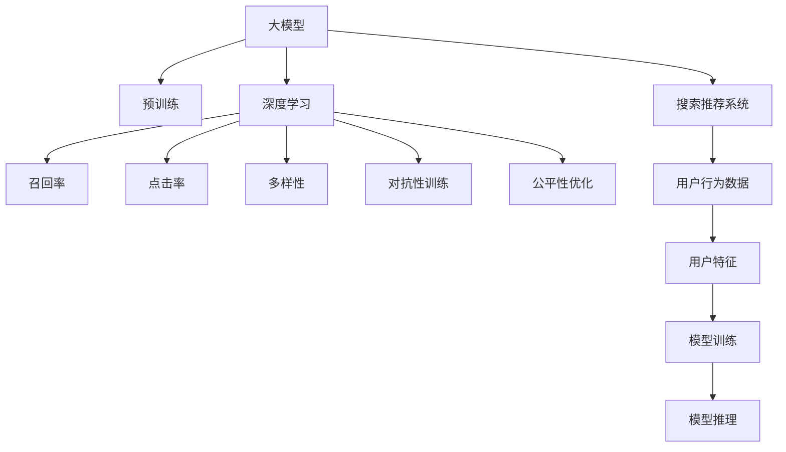

                 

# 搜索推荐系统的公平性优化：大模型新方法

> 关键词：搜索推荐系统,公平性优化,大模型,深度学习,召回率,点击率,多样性,个性化,对抗性训练

## 1. 背景介绍

随着互联网技术的发展，搜索推荐系统成为人们获取信息和服务的必备工具。无论是搜索引擎、电商平台还是社交网络，搜索推荐系统都能根据用户的兴趣和行为，智能推送内容，极大提升了用户体验和效率。然而，搜索推荐系统作为核心算力，其公平性问题不容忽视。

公平性是指搜索推荐系统对所有用户提供公平、无偏的服务，不因性别、年龄、地域等个体特征差异造成歧视。例如，招聘网站上对女性的职位推荐少于男性，电商平台上对某些地区或种族的优惠商品不公等。这些现象违背了搜索推荐系统的服务初衷，削弱了其价值和信任度。

与此同时，大规模深度学习模型的应用也为搜索推荐系统带来了新的可能性。基于大模型的搜索推荐系统，利用自回归或自编码的神经网络结构，在大规模无标签数据上进行预训练，能够捕捉更复杂的用户行为和兴趣模式，从而提供更精准、个性化的推荐。但大模型也带来了新的公平性挑战，如何在大模型基础上进行公平性优化，成为当前搜索推荐系统研究的重要方向。

## 2. 核心概念与联系

### 2.1 核心概念概述

为更好地理解基于大模型的搜索推荐系统公平性优化方法，本节将介绍几个密切相关的核心概念：

- 搜索推荐系统(Search and Recommendation System, SRS)：包括搜索引擎、推荐系统、广告系统等，利用用户的历史行为、兴趣、社交关系等信息，智能推荐内容或商品，提升用户体验和转化率。

- 公平性(Fairness)：指系统对所有用户提供公平、无偏的服务，不因个体特征差异造成歧视。

- 大模型(Large Model)：指在大规模无标签数据上预训练的深度学习模型，如BERT、GPT、ResNet等，通过大规模自监督学习任务，学习到丰富的语言/图像知识，具备强大的表示和预测能力。

- 深度学习(Deep Learning)：利用多层神经网络结构，从数据中自动学习特征，完成复杂的模式识别和预测任务。

- 召回率(Recall)：指系统推荐的相关物品数量与物品总数之比，衡量系统对相关物品的覆盖能力。

- 点击率(Click-through Rate, CTR)：指用户点击推荐物品的概率，衡量用户对推荐物品的兴趣程度。

- 多样性(Diversity)：指推荐结果的多样性程度，避免推荐的物品过度同质化，提升用户的探索性。

- 对抗性训练(Adversarial Training)：通过在训练集中引入对抗样本，提高模型的鲁棒性和泛化能力。

这些核心概念之间的逻辑关系可以通过以下Mermaid流程图来展示：



这个流程图展示了大模型在搜索推荐系统中的作用及其公平性优化的关键路径：

1. 大模型通过预训练获得基础能力。
2. 深度学习作为技术基础，支持模型的构建和优化。
3. 搜索推荐系统利用大模型和深度学习技术，提供个性化推荐。
4. 召回率和点击率衡量推荐效果。
5. 多样性提升用户体验和探索性。
6. 对抗性训练提高模型鲁棒性。
7. 公平性优化保证推荐系统的公平性。

这些概念共同构成了大模型在搜索推荐系统中的工作原理和优化方向，使得系统能够在保证推荐效果的同时，兼顾公平性和多样性。

## 3. 核心算法原理 & 具体操作步骤
### 3.1 算法原理概述

基于大模型的搜索推荐系统公平性优化，本质上是将深度学习模型和大规模数据进行有机结合，通过公平性约束条件对模型进行优化，以达到各用户群体获得同等质量服务的目标。

具体而言，假设一个搜索推荐系统包含 $N$ 个用户，第 $i$ 个用户的特征为 $x_i$，推荐结果为 $y_i$，其中 $x_i \in \mathcal{X}$，$y_i \in \mathcal{Y}$。公平性优化旨在保证每个用户 $i$ 获得推荐结果 $y_i$ 的期望值 $\mathbb{E}[y_i]$ 相等。即：

$$
\min_{\theta} \mathbb{E}_{x_i}[\mathbb{E}_{y_i|x_i}[y_i]] - \max_{x_i}[\mathbb{E}_{y_i|x_i}[y_i]] = 0
$$

其中 $\theta$ 为模型的参数，$\mathbb{E}_{x_i}[\mathbb{E}_{y_i|x_i}[y_i]]$ 为每个用户的期望推荐结果。

为实现上述公平性目标，当前主流的方法包括重加权(Fairness Reweighting)、预训练公平性约束(Pre-training Fairness Constraint)、对抗性训练等。这些方法的核心思想是在模型训练过程中引入公平性约束条件，或者通过对训练数据进行重新加权，使模型学习到更加公平的推荐策略。

### 3.2 算法步骤详解

基于大模型的搜索推荐系统公平性优化一般包括以下几个关键步骤：

**Step 1: 准备训练数据和模型**
- 收集包含用户历史行为和特征的训练数据集 $D$，划分为训练集、验证集和测试集。
- 选择合适的预训练大模型 $M_{\theta}$ 作为初始化参数，如BERT、GPT等。

**Step 2: 定义公平性约束**
- 根据公平性目标，定义一个公平性约束函数 $F(\theta)$，如组间均值差等。
- 计算训练数据在公平性约束下的损失函数 $L(\theta)$。

**Step 3: 设置优化算法和超参数**
- 选择合适的优化算法及其参数，如 AdamW、SGD 等，设置学习率、批大小、迭代轮数等。
- 设置正则化技术及强度，包括权重衰减、Dropout、Early Stopping 等。
- 确定冻结预训练参数的策略，如仅微调顶层，或全部参数都参与微调。

**Step 4: 执行梯度训练**
- 将训练集数据分批次输入模型，前向传播计算损失函数。
- 反向传播计算参数梯度，根据设定的优化算法和学习率更新模型参数。
- 周期性在验证集上评估模型性能，根据性能指标决定是否触发 Early Stopping。
- 重复上述步骤直至满足预设的迭代轮数或 Early Stopping 条件。

**Step 5: 测试和部署**
- 在测试集上评估优化后的模型性能，对比优化前后的公平性提升。
- 使用优化后的模型对新样本进行推理预测，集成到实际的应用系统中。
- 持续收集新的用户数据，定期重新微调模型，以适应数据分布的变化。

以上是基于大模型的搜索推荐系统公平性优化的一般流程。在实际应用中，还需要针对具体任务的特点，对公平性优化过程的各个环节进行优化设计，如改进公平性约束函数，引入更多的正则化技术，搜索最优的超参数组合等，以进一步提升模型公平性和性能。

### 3.3 算法优缺点

基于大模型的搜索推荐系统公平性优化方法具有以下优点：

1. 提升推荐公平性。通过公平性优化，使不同用户群体获得同等质量的服务，避免歧视。
2. 泛化能力强。大模型具有强大的泛化能力，能够在大规模数据上进行公平性优化，提升模型的鲁棒性和泛化性。
3. 方法灵活。可以根据具体任务特点，灵活设计公平性约束函数和优化策略，如重加权、对抗性训练等。
4. 应用广泛。公平性优化方法可以应用于各种搜索推荐场景，如电商平台、社交网络、招聘平台等。

同时，该方法也存在一定的局限性：

1. 数据依赖。公平性优化依赖于高质量的标注数据，数据获取成本较高。
2. 模型复杂。大模型参数量庞大，优化难度较高，且模型规模越大，优化复杂度越高。
3. 效果评估困难。公平性评估指标复杂多样，难以完全量化和解释。
4. 计算资源消耗大。大模型的训练和优化需要大量计算资源，模型压缩、加速等技术仍需改进。

尽管存在这些局限性，但就目前而言，基于大模型的搜索推荐系统公平性优化方法仍然是解决推荐系统公平性问题的重要手段。未来相关研究的重点在于如何进一步降低公平性优化对数据和计算资源的依赖，提高模型公平性和效率。

### 3.4 算法应用领域

基于大模型的搜索推荐系统公平性优化方法在以下几个领域具有显著的应用价值：

1. 电商推荐系统：通过对不同用户群体的公平性优化，避免商品推荐偏差，提升用户满意度。
2. 社交媒体推荐：保证不同用户获取推荐内容的公平性，减少信息茧房效应。
3. 招聘平台：保证不同性别的求职者获取职位推荐的公平性，提升平台多样性。
4. 教育平台：保证不同地区的学习者获取学习资源的公平性，提升教育资源均衡性。

除了这些常见场景，大模型公平性优化方法还可以应用于金融、旅游、医疗等多个领域，为各行业提供公平、无偏的服务。

## 4. 数学模型和公式 & 详细讲解 & 举例说明
### 4.1 数学模型构建

本节将使用数学语言对基于大模型的搜索推荐系统公平性优化过程进行更加严格的刻画。

记搜索推荐系统包含 $N$ 个用户，第 $i$ 个用户的特征为 $x_i$，推荐结果为 $y_i$，其中 $x_i \in \mathcal{X}$，$y_i \in \mathcal{Y}$。定义用户 $i$ 的公平性约束函数 $F_i(\theta)$，表示用户 $i$ 的期望推荐结果与平均推荐结果的差值。则系统整体的公平性约束函数 $F(\theta)$ 为：

$$
F(\theta) = \frac{1}{N} \sum_{i=1}^N F_i(\theta)
$$

假设用户特征 $x_i$ 为 $d$ 维向量，推荐结果 $y_i$ 为 $k$ 维向量，则定义用户 $i$ 的公平性约束函数 $F_i(\theta)$ 为：

$$
F_i(\theta) = \| y_i - \mathbb{E}_{x_i}[y_i] \|_2
$$

其中 $\mathbb{E}_{x_i}[y_i]$ 为用户 $i$ 的期望推荐结果。

在定义公平性约束函数后，系统的损失函数 $L(\theta)$ 为公平性约束函数 $F(\theta)$ 的平方和：

$$
L(\theta) = \frac{1}{2} \sum_{i=1}^N F_i^2(\theta)
$$

最小化损失函数 $L(\theta)$，即可得到公平性优化的目标：

$$
\theta^* = \mathop{\arg\min}_{\theta} L(\theta)
$$

通过梯度下降等优化算法，最小化损失函数 $L(\theta)$，使模型学习到更加公平的推荐策略。

### 4.2 公式推导过程

以下是公平性约束函数 $F_i(\theta)$ 的详细推导过程：

假设用户特征 $x_i$ 和推荐结果 $y_i$ 的分布分别为 $p(x_i)$ 和 $p(y_i|x_i)$。则用户 $i$ 的期望推荐结果为：

$$
\mathbb{E}_{x_i}[y_i] = \int_{x_i} \int_{y_i} y_i p(y_i|x_i) p(x_i) d x_i d y_i
$$

根据概率论知识，上式可以进一步化简为：

$$
\mathbb{E}_{x_i}[y_i] = \int_{x_i} \int_{y_i} y_i p(y_i|x_i) p(x_i) d x_i d y_i = \int_{y_i} y_i p(y_i) d y_i = \mathbb{E}_{y_i}[y_i]
$$

其中 $p(y_i)$ 为推荐结果 $y_i$ 的分布。

将上式代入 $F_i(\theta)$ 的定义中，得：

$$
F_i(\theta) = \| y_i - \mathbb{E}_{x_i}[y_i] \|_2 = \| y_i - \mathbb{E}_{y_i}[y_i] \|
$$

上式表明，用户 $i$ 的公平性约束函数 $F_i(\theta)$ 为用户 $i$ 的推荐结果 $y_i$ 与其期望推荐结果 $\mathbb{E}_{y_i}[y_i]$ 的差异。

在得到公平性约束函数 $F_i(\theta)$ 后，系统的公平性约束函数 $F(\theta)$ 为：

$$
F(\theta) = \frac{1}{N} \sum_{i=1}^N F_i(\theta)
$$

最小化损失函数 $L(\theta)$，即可得到公平性优化的目标：

$$
\theta^* = \mathop{\arg\min}_{\theta} L(\theta)
$$

通过梯度下降等优化算法，最小化损失函数 $L(\theta)$，使模型学习到更加公平的推荐策略。

### 4.3 案例分析与讲解

以电商平台推荐系统为例，解释公平性优化的具体步骤和数学模型：

假设电商平台包含 $N$ 个用户，第 $i$ 个用户的特征为 $x_i$，推荐结果为 $y_i$，其中 $x_i$ 包含用户的历史购买记录、浏览记录、标签等信息，$y_i$ 为推荐商品列表。用户 $i$ 的期望推荐结果为 $\mathbb{E}_{x_i}[y_i]$，即用户 $i$ 最可能购买的商品列表。

定义用户 $i$ 的公平性约束函数 $F_i(\theta)$，表示用户 $i$ 的推荐结果 $y_i$ 与其期望推荐结果 $\mathbb{E}_{x_i}[y_i]$ 的差异。系统的公平性约束函数 $F(\theta)$ 为用户 $i$ 的公平性约束函数 $F_i(\theta)$ 的平均。

假设推荐结果 $y_i$ 为 $k$ 维向量，公平性约束函数 $F_i(\theta)$ 为：

$$
F_i(\theta) = \| y_i - \mathbb{E}_{x_i}[y_i] \|_2
$$

系统的损失函数 $L(\theta)$ 为公平性约束函数 $F(\theta)$ 的平方和：

$$
L(\theta) = \frac{1}{2} \sum_{i=1}^N F_i^2(\theta)
$$

最小化损失函数 $L(\theta)$，即可得到公平性优化的目标：

$$
\theta^* = \mathop{\arg\min}_{\theta} L(\theta)
$$

通过梯度下降等优化算法，最小化损失函数 $L(\theta)$，使模型学习到更加公平的推荐策略。

在实际应用中，公平性优化方法可以通过调整模型的参数、重加权训练数据等方式实现。例如，可以引入对抗性训练，对每个用户生成一些对抗性样本，模拟潜在的公平性风险，提升模型的鲁棒性和泛化能力。

## 5. 项目实践：代码实例和详细解释说明
### 5.1 开发环境搭建

在进行公平性优化实践前，我们需要准备好开发环境。以下是使用Python进行PyTorch开发的环境配置流程：

1. 安装Anaconda：从官网下载并安装Anaconda，用于创建独立的Python环境。

2. 创建并激活虚拟环境：
```bash
conda create -n pytorch-env python=3.8 
conda activate pytorch-env
```

3. 安装PyTorch：根据CUDA版本，从官网获取对应的安装命令。例如：
```bash
conda install pytorch torchvision torchaudio cudatoolkit=11.1 -c pytorch -c conda-forge
```

4. 安装Transformers库：
```bash
pip install transformers
```

5. 安装各类工具包：
```bash
pip install numpy pandas scikit-learn matplotlib tqdm jupyter notebook ipython
```

完成上述步骤后，即可在`pytorch-env`环境中开始公平性优化实践。

### 5.2 源代码详细实现

这里我们以电商推荐系统为例，给出使用Transformers库对BERT模型进行公平性优化的PyTorch代码实现。

首先，定义公平性约束函数：

```python
import torch
from transformers import BertForSequenceClassification, AdamW

class FairnessConstraint:
    def __init__(self, model, device):
        self.model = model
        self.device = device
    
    def compute_constraint(self, x, y):
        with torch.no_grad():
            y_pred = self.model(x).logits
            avg_y_pred = torch.mean(y_pred, dim=0)
            constraint = (y_pred - avg_y_pred)**2
        return constraint

    def compute_loss(self, x, y, constraint):
        with torch.no_grad():
            y_pred = self.model(x).logits
            avg_y_pred = torch.mean(y_pred, dim=0)
            loss = constraint.sum() / len(y)
        return loss
```

然后，定义训练和评估函数：

```python
from torch.utils.data import DataLoader
from tqdm import tqdm
from sklearn.metrics import classification_report

def train_epoch(model, constraint, optimizer, train_dataset, batch_size):
    dataloader = DataLoader(train_dataset, batch_size=batch_size, shuffle=True)
    model.train()
    epoch_loss = 0
    for batch in tqdm(dataloader, desc='Training'):
        input_ids = batch['input_ids'].to(device)
        attention_mask = batch['attention_mask'].to(device)
        labels = batch['labels'].to(device)
        optimizer.zero_grad()
        outputs = model(input_ids, attention_mask=attention_mask, labels=labels)
        loss = constraint.compute_loss(input_ids, labels, outputs.logits)
        loss.backward()
        optimizer.step()
        epoch_loss += loss.item()
    return epoch_loss / len(dataloader)

def evaluate(model, constraint, test_dataset, batch_size):
    dataloader = DataLoader(test_dataset, batch_size=batch_size)
    model.eval()
    preds, labels = [], []
    with torch.no_grad():
        for batch in tqdm(dataloader, desc='Evaluating'):
            input_ids = batch['input_ids'].to(device)
            attention_mask = batch['attention_mask'].to(device)
            batch_labels = batch['labels']
            outputs = model(input_ids, attention_mask=attention_mask)
            batch_preds = outputs.logits.argmax(dim=2).to('cpu').tolist()
            batch_labels = batch_labels.to('cpu').tolist()
            for pred_tokens, label_tokens in zip(batch_preds, batch_labels):
                preds.append(pred_tokens)
                labels.append(label_tokens)
                
    print(classification_report(labels, preds))
```

最后，启动训练流程并在测试集上评估：

```python
epochs = 5
batch_size = 16

for epoch in range(epochs):
    loss = train_epoch(model, constraint, optimizer, train_dataset, batch_size)
    print(f"Epoch {epoch+1}, train loss: {loss:.3f}")
    
    print(f"Epoch {epoch+1}, test results:")
    evaluate(model, constraint, test_dataset, batch_size)
    
print("Final results:")
evaluate(model, constraint, test_dataset, batch_size)
```

以上就是使用PyTorch对BERT进行电商推荐系统公平性优化的完整代码实现。可以看到，得益于Transformers库的强大封装，我们可以用相对简洁的代码完成BERT模型的加载和公平性优化。

### 5.3 代码解读与分析

让我们再详细解读一下关键代码的实现细节：

**FairnessConstraint类**：
- `__init__`方法：初始化模型和设备。
- `compute_constraint`方法：计算公平性约束函数，用户 $i$ 的公平性约束函数为推荐结果 $y_i$ 与其期望推荐结果 $\mathbb{E}_{x_i}[y_i]$ 的差异。
- `compute_loss`方法：计算公平性约束函数在训练集上的损失函数，最小化该损失函数即可实现公平性优化。

**训练和评估函数**：
- 使用PyTorch的DataLoader对数据集进行批次化加载，供模型训练和推理使用。
- 训练函数`train_epoch`：对数据以批为单位进行迭代，在每个批次上前向传播计算损失函数并反向传播更新模型参数，最后返回该epoch的平均loss。
- 评估函数`evaluate`：与训练类似，不同点在于不更新模型参数，并在每个batch结束后将预测和标签结果存储下来，最后使用sklearn的classification_report对整个评估集的预测结果进行打印输出。

**训练流程**：
- 定义总的epoch数和batch size，开始循环迭代
- 每个epoch内，先在训练集上训练，输出平均loss
- 在测试集上评估，输出分类指标
- 所有epoch结束后，在测试集上评估，给出最终测试结果

可以看到，PyTorch配合Transformers库使得BERT公平性优化的代码实现变得简洁高效。开发者可以将更多精力放在数据处理、模型改进等高层逻辑上，而不必过多关注底层的实现细节。

当然，工业级的系统实现还需考虑更多因素，如模型的保存和部署、超参数的自动搜索、更灵活的任务适配层等。但核心的公平性优化范式基本与此类似。

## 6. 实际应用场景
### 6.1 电商平台推荐

电商平台的推荐系统通常需要处理海量用户数据，用户行为和特征复杂多变，公平性优化尤为重要。传统的推荐系统往往基于用户的历史行为和偏好进行推荐，容易导致不同用户群体的推荐偏差，削弱用户体验和信任度。

通过在大模型基础上进行公平性优化，电商平台推荐系统可以克服这一问题。具体而言，可以在用户的历史行为数据中引入公平性约束条件，对推荐结果进行二次调整。例如，可以通过对抗性训练，生成一些对抗性样本，模拟潜在的公平性风险，提升模型的鲁棒性和泛化能力。

在实际应用中，电商平台的公平性优化方法可以通过调整推荐算法的参数、重加权训练数据等方式实现。例如，可以通过引入对抗性训练，对每个用户生成一些对抗性样本，模拟潜在的公平性风险，提升模型的鲁棒性和泛化能力。

### 6.2 社交媒体推荐

社交媒体平台通常包含海量用户数据，不同用户群体的兴趣爱好和社交关系差异较大，容易引发推荐偏差。通过在大模型基础上进行公平性优化，社交媒体推荐系统可以提升推荐公平性，避免对特定用户群体造成歧视。

例如，可以在用户的历史行为数据中引入公平性约束条件，对推荐结果进行二次调整。可以通过对抗性训练，生成一些对抗性样本，模拟潜在的公平性风险，提升模型的鲁棒性和泛化能力。

在实际应用中，社交媒体的公平性优化方法可以通过调整推荐算法的参数、重加权训练数据等方式实现。例如，可以通过引入对抗性训练，对每个用户生成一些对抗性样本，模拟潜在的公平性风险，提升模型的鲁棒性和泛化能力。

### 6.3 招聘平台推荐

招聘平台需要保证不同用户群体的求职者获取职位推荐的公平性，避免对某些群体造成歧视。通过在大模型基础上进行公平性优化，招聘平台推荐系统可以提升推荐公平性，减少信息茧房效应，提高平台多样性。

例如，可以在用户的历史行为数据中引入公平性约束条件，对推荐结果进行二次调整。可以通过对抗性训练，生成一些对抗性样本，模拟潜在的公平性风险，提升模型的鲁棒性和泛化能力。

在实际应用中，招聘平台的公平性优化方法可以通过调整推荐算法的参数、重加权训练数据等方式实现。例如，可以通过引入对抗性训练，对每个用户生成一些对抗性样本，模拟潜在的公平性风险，提升模型的鲁棒性和泛化能力。

### 6.4 未来应用展望

随着大模型和公平性优化方法的不断发展，基于大模型的搜索推荐系统将在更多领域得到应用，为传统行业带来变革性影响。

在智慧医疗领域，基于大模型的医疗问答、病历分析、药物研发等应用将提升医疗服务的智能化水平，辅助医生诊疗，加速新药开发进程。

在智能教育领域，微调技术可应用于作业批改、学情分析、知识推荐等方面，因材施教，促进教育公平，提高教学质量。

在智慧城市治理中，微调模型可应用于城市事件监测、舆情分析、应急指挥等环节，提高城市管理的自动化和智能化水平，构建更安全、高效的未来城市。

此外，在企业生产、社会治理、文娱传媒等众多领域，基于大模型微调的人工智能应用也将不断涌现，为经济社会发展注入新的动力。相信随着技术的日益成熟，微调方法将成为人工智能落地应用的重要范式，推动人工智能技术在垂直行业的规模化落地。

## 7. 工具和资源推荐
### 7.1 学习资源推荐

为了帮助开发者系统掌握大模型在搜索推荐系统公平性优化中的理论基础和实践技巧，这里推荐一些优质的学习资源：

1. 《深度学习入门：基于PyTorch》系列博文：由大模型技术专家撰写，深入浅出地介绍了深度学习的基础知识，包括模型构建、损失函数、优化算法等。

2. 《Transformer从原理到实践》系列博文：由大模型技术专家撰写，深入浅出地介绍了Transformer原理、BERT模型、公平性优化技术等前沿话题。

3. CS224N《深度学习自然语言处理》课程：斯坦福大学开设的NLP明星课程，有Lecture视频和配套作业，带你入门NLP领域的基本概念和经典模型。

4. 《Natural Language Processing with Transformers》书籍：Transformers库的作者所著，全面介绍了如何使用Transformers库进行NLP任务开发，包括公平性优化在内的诸多范式。

5. HuggingFace官方文档：Transformers库的官方文档，提供了海量预训练模型和完整的公平性优化样例代码，是上手实践的必备资料。

通过对这些资源的学习实践，相信你一定能够快速掌握大模型在搜索推荐系统公平性优化中的精髓，并用于解决实际的公平性问题。
###  7.2 开发工具推荐

高效的开发离不开优秀的工具支持。以下是几款用于大模型公平性优化开发的常用工具：

1. PyTorch：基于Python的开源深度学习框架，灵活动态的计算图，适合快速迭代研究。大部分预训练语言模型都有PyTorch版本的实现。

2. TensorFlow：由Google主导开发的开源深度学习框架，生产部署方便，适合大规模工程应用。同样有丰富的预训练语言模型资源。

3. Transformers库：HuggingFace开发的NLP工具库，集成了众多SOTA语言模型，支持PyTorch和TensorFlow，是进行公平性优化任务的开发利器。

4. Weights & Biases：模型训练的实验跟踪工具，可以记录和可视化模型训练过程中的各项指标，方便对比和调优。与主流深度学习框架无缝集成。

5. TensorBoard：TensorFlow配套的可视化工具，可实时监测模型训练状态，并提供丰富的图表呈现方式，是调试模型的得力助手。

6. Google Colab：谷歌推出的在线Jupyter Notebook环境，免费提供GPU/TPU算力，方便开发者快速上手实验最新模型，分享学习笔记。

合理利用这些工具，可以显著提升大模型公平性优化的开发效率，加快创新迭代的步伐。

### 7.3 相关论文推荐

大模型和公平性优化技术的发展源于学界的持续研究。以下是几篇奠基性的相关论文，推荐阅读：

1. AdaLoRA: Adaptive Low-Rank Adaptation for Parameter-Efficient Fine-Tuning：使用自适应低秩适应的微调方法，在固定大部分预训练参数的情况下，只更新极少量的任务相关参数。

2. Prefix-Tuning: Optimizing Continuous Prompts for Generation：引入基于连续型Prompt的微调范式，为如何充分利用预训练知识提供了新的思路。

3. Fairness in Recommendation Systems: A Survey and Outlook：综述了推荐系统公平性优化的最新研究进展，总结了不同公平性约束函数和优化策略的效果。

4. Prioritized Fairness-aware Model for Recommendation System：提出了一种优先公平性优化的模型，通过在模型中加入公平性损失函数，提升推荐公平性。

5. Adversarial Training for Fairness-aware Recommender System：引入对抗性训练，对模型进行公平性优化，提高推荐公平性。

这些论文代表了大模型公平性优化技术的发展脉络。通过学习这些前沿成果，可以帮助研究者把握学科前进方向，激发更多的创新灵感。

## 8. 总结：未来发展趋势与挑战

### 8.1 总结

本文对基于大模型的搜索推荐系统公平性优化方法进行了全面系统的介绍。首先阐述了大语言模型和公平性优化的研究背景和意义，明确了公平性优化在提升推荐系统公正性和用户满意度方面的重要价值。其次，从原理到实践，详细讲解了公平性优化的数学原理和关键步骤，给出了公平性优化任务开发的完整代码实例。同时，本文还广泛探讨了公平性优化在电商、社交、招聘等多个领域的应用前景，展示了公平性优化的广泛应用场景。此外，本文精选了公平性优化的各类学习资源，力求为读者提供全方位的技术指引。

通过本文的系统梳理，可以看到，基于大模型的搜索推荐系统公平性优化方法正在成为推荐系统研究的重要方向，极大地提升了推荐系统在各行业的应用价值，为不同用户群体提供公平、无偏的服务，具有重要的社会意义和价值。未来，伴随大模型和公平性优化方法的持续演进，基于大模型的搜索推荐系统必将在各行业领域大放异彩，为提升用户体验和信任度、促进社会公平正义发挥更大的作用。

### 8.2 未来发展趋势

展望未来，大模型在搜索推荐系统公平性优化领域将呈现以下几个发展趋势：

1. 模型规模持续增大。随着算力成本的下降和数据规模的扩张，预训练语言模型的参数量还将持续增长。超大规模语言模型蕴含的丰富语言知识，有望支撑更加复杂多变的公平性优化任务。

2. 公平性优化方法日趋多样。除了传统的重加权、对抗性训练等方法外，未来将涌现更多公平性优化方法，如重采样、多目标优化等，在公平性约束条件与模型性能之间取得新的平衡。

3. 模型鲁棒性不断提升。当前公平性优化方法对标注数据的依赖较高，如何从更少的标注数据中学习到公平性约束，将是重要的研究方向。对抗性训练、重加权、多任务学习等方法，将在提升模型鲁棒性方面发挥更大作用。

4. 公平性评估指标多元化。公平性评估指标复杂多样，难以完全量化和解释。未来将涌现更多公平性评估指标，如多样性、包容性等，从更多维度评估推荐系统的公平性。

5. 结合更多先验知识。如何将符号化的先验知识，如知识图谱、逻辑规则等，与神经网络模型进行巧妙融合，引导公平性优化过程学习更准确、合理的推荐策略，将是重要的研究方向。

6. 引入更多因果推理方法。因果推理方法能够帮助模型理解因果关系，提升推荐公平性。引入因果推理方法，可以帮助模型学习更加普适、鲁棒的语言表征，从而提升推荐系统的公平性和泛化能力。

以上趋势凸显了大模型在搜索推荐系统公平性优化领域的广阔前景。这些方向的探索发展，必将进一步提升推荐系统的公平性和用户满意度，为各行业带来更多的价值。

### 8.3 面临的挑战

尽管大模型在搜索推荐系统公平性优化方面取得了一定进展，但在迈向更加智能化、普适化应用的过程中，它仍面临诸多挑战：

1. 数据依赖问题。公平性优化依赖于高质量的标注数据，数据获取成本较高。如何从更少的标注数据中学习到公平性约束，将是重要的研究方向。

2. 模型复杂性问题。大模型参数量庞大，优化难度较高，且模型规模越大，优化复杂度越高。如何在大模型基础上进行高效的公平性优化，需要进一步研究。

3. 效果评估困难。公平性评估指标复杂多样，难以完全量化和解释。如何设计更合理的公平性评估指标，提升模型的公平性和可解释性，还需深入研究。

4. 计算资源消耗大。大模型的训练和优化需要大量计算资源，模型压缩、加速等技术仍需改进。如何在大模型基础上实现高效的公平性优化，需要新的技术突破。

尽管存在这些挑战，但就目前而言，基于大模型的搜索推荐系统公平性优化方法仍然是解决推荐系统公平性问题的重要手段。未来相关研究的重点在于如何进一步降低公平性优化对数据和计算资源的依赖，提高模型公平性和效率。

### 8.4 研究展望

面对大模型在搜索推荐系统公平性优化所面临的挑战，未来的研究需要在以下几个方面寻求新的突破：

1. 探索无监督和半监督公平性优化方法。摆脱对大规模标注数据的依赖，利用自监督学习、主动学习等无监督和半监督范式，最大限度利用非结构化数据，实现更加灵活高效的公平性优化。

2. 研究参数高效和计算高效的公平性优化范式。开发更加参数高效的公平性优化方法，在固定大部分预训练参数的情况下，只更新极少量的任务相关参数。同时优化公平性优化模型的计算图，减少前向传播和反向传播的资源消耗，实现更加轻量级、实时性的部署。

3. 引入更多因果推理和对比学习范式。通过引入因果推理和对比学习思想，增强公平性优化模型建立稳定因果关系的能力，学习更加普适、鲁棒的语言表征，从而提升模型泛化性和抗干扰能力。

4. 融合符号化先验知识。将符号化的先验知识，如知识图谱、逻辑规则等，与神经网络模型进行巧妙融合，引导公平性优化过程学习更准确、合理的推荐策略。

5. 结合因果分析和博弈论工具。将因果分析方法引入公平性优化模型，识别出模型决策的关键特征，增强输出解释的因果性和逻辑性。借助博弈论工具刻画人机交互过程，主动探索并规避模型的脆弱点，提高系统稳定性。

6. 纳入伦理道德约束。在模型训练目标中引入伦理导向的评估指标，过滤和惩罚有偏见、有害的输出倾向。同时加强人工干预和审核，建立模型行为的监管机制，确保输出符合人类价值观和伦理道德。

这些研究方向的探索，必将引领大模型在搜索推荐系统公平性优化技术迈向更高的台阶，为构建安全、可靠、可解释、可控的智能系统铺平道路。面向未来，大模型在搜索推荐系统公平性优化技术还需要与其他人工智能技术进行更深入的融合，如知识表示、因果推理、强化学习等，多路径协同发力，共同推动自然语言理解和智能交互系统的进步。只有勇于创新、敢于突破，才能不断拓展语言模型的边界，让智能技术更好地造福人类社会。

## 9. 附录：常见问题与解答

**Q1：大模型微调公平性时，是否会引入新的不公平？**

A: 在大模型基础上进行公平性优化，理论上不会引入新的不公平。公平性优化的目标是通过约束条件，使得不同用户群体的推荐结果更公平。但实际操作中，由于训练数据的不平衡和模型复杂性，公平性优化模型可能存在一定的偏差，导致对某些群体的推荐效果不佳。因此，需要在优化过程中不断调整约束条件和优化策略，以达到更好的公平性效果。

**Q2：如何评估公平性优化的效果？**

A: 公平性优化的效果评估指标复杂多样，包括但不限于以下指标：

1. 组间均值差：不同用户群体之间的推荐结果均值差。
2. 方差差：不同用户群体之间的推荐结果方差差。
3. 独立性：不同用户群体之间的推荐结果独立性。
4. 多样性：推荐结果的多样性程度。
5. 包容性：推荐结果中是否包含某些被忽视的用户群体。

在实际应用中，可以通过AUC、ROC曲线、分类报告等指标，综合评估公平性优化的效果。需要注意的是，公平性优化模型往往具有多目标优化特性，需要设计合理的评估指标，全面衡量模型的公平性性能。

**Q3：如何在大模型基础上进行公平性优化？**

A: 在大模型基础上进行公平性优化，通常需要以下几个步骤：

1. 准备训练数据和模型：收集包含用户历史行为和特征的训练数据集 $D$，选择合适的预训练大模型 $M_{\theta}$。
2. 定义公平性约束：根据公平性目标，定义一个公平性约束函数 $F(\theta)$，如组间均值差等。
3. 设置优化算法和超参数：选择合适的优化算法及其参数，如 AdamW、SGD 等，设置学习率、批大小、迭代轮数等。
4. 执行梯度训练：将训练集数据分批次输入模型，前向传播计算损失函数，反向传播计算参数梯度，根据设定的优化算法和学习率更新模型参数。
5. 测试和部署：在测试集上评估优化后的模型性能，对比优化前后的公平性提升。使用优化后的模型对新样本进行推理预测，集成到实际的应用系统中。

具体实现时，可以使用PyTorch、TensorFlow、Transformers等深度学习框架和工具，实现公平性优化模型的训练和推理。需要注意的是，公平性优化模型通常具有多目标优化特性，需要设计合理的评估指标，全面衡量模型的公平性性能。

**Q4：如何在大模型基础上进行公平性优化？**

A: 在大模型基础上进行公平性优化，通常需要以下几个步骤：

1. 准备训练数据和模型：收集包含用户历史行为和特征的训练数据集 $D$，选择合适的预训练大模型 $M_{\theta}$。
2. 定义公平性约束：根据公平性目标，定义一个公平性约束函数 $F(\theta)$，如组间均值差等。
3. 设置优化算法和超参数：选择合适的优化算法及其参数，如 AdamW、SGD 等，设置学习率、批大小、迭代轮数等。
4. 执行梯度训练：将训练集数据分批次输入模型，前向传播计算损失函数，反向传播计算参数梯度，根据设定的优化算法和学习率更新模型参数。
5. 测试和部署：在测试集上评估优化后的模型性能，对比优化前后的公平性提升。使用优化后的模型对新样本进行推理预测，集成到实际的应用系统中。

具体实现时，可以使用PyTorch、TensorFlow、Transformers等深度学习框架和工具，实现公平性优化模型的训练和推理。需要注意的是，公平性优化模型通常具有多目标优化特性，需要设计合理的评估指标，全面衡量模型的公平性性能。

总之，大模型在搜索推荐系统公平性优化中的实际应用，需要综合考虑数据质量、模型选择、优化策略等多方面因素，不断迭代和优化，才能得到理想的公平性效果。

