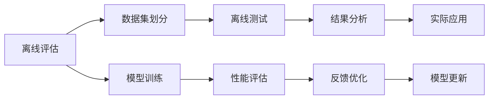

                 

# 搜索推荐系统的离线评估：大模型新指标

> 关键词：搜索推荐系统,离线评估,大模型,新指标,性能评估,推荐质量

## 1. 背景介绍

随着信息技术的快速发展和互联网的普及，用户越来越多地依赖在线平台获取和分享信息，无论是电子商务、社交网络、知识共享平台还是其他任何形式的网络服务，搜索推荐系统都扮演着至关重要的角色。这些系统通过分析和理解用户行为，为用户提供个性化的搜索结果和推荐内容，极大地提升了用户体验和平台粘性。

大模型（如BERT、GPT、XLNet等）在自然语言处理（NLP）领域的成功应用，推动了搜索推荐系统的技术边界不断拓展。这些模型不仅在文本表示和语义理解上取得了巨大进步，还在个性化推荐、信息检索等任务上取得了卓越的成绩。然而，仅仅依赖模型输出并不断迭代训练并不足以保证搜索推荐系统的长期稳定性和可靠性。

为了确保系统的持续改进，离线评估（Offline Evaluation）成为了不可或缺的一环。离线评估旨在通过评估模型的实际表现来验证其有效性和可靠性，帮助开发者了解模型的优势和不足，为系统优化提供科学依据。本文将系统介绍大模型在搜索推荐系统离线评估中的新指标，并对其优缺点进行深入探讨。

## 2. 核心概念与联系

### 2.1 核心概念概述

在进行离线评估时，我们需要明确几个关键概念：

- **离线评估 (Offline Evaluation)**：指在不直接与真实用户交互的情况下，通过分析已有的数据集来评估模型的性能。这种方法能够更加客观地衡量模型的预测能力，避免受到实际使用中的不确定性因素影响。
- **搜索推荐系统 (Recommendation System)**：包括搜索引擎和推荐系统两类，前者侧重于信息检索，后者侧重于内容推荐。两者在数据处理、模型选择和性能评估上有很多相似之处。
- **大模型 (Large Model)**：指拥有大量参数（通常超过亿级）的深度学习模型，如BERT、GPT等，它们通过自监督或监督学习的方式进行预训练，具备强大的语义理解和生成能力。
- **新指标 (New Metrics)**：指在现有离线评估指标基础上，结合大模型的特点和搜索推荐系统的特殊需求，设计出的更加全面、科学、高效的评估指标。

### 2.2 核心概念原理和架构的 Mermaid 流程图(Mermaid 流程节点中不要有括号、逗号等特殊字符)



该流程图展示了离线评估的基本流程：

1. **数据集划分 (B)**：将已有数据集划分为训练集、验证集和测试集，用于模型的训练和评估。
2. **模型训练 (C)**：使用训练集对大模型进行训练，得到模型参数。
3. **离线测试 (D)**：将验证集输入训练好的模型，评估模型在未见过的数据上的性能。
4. **性能评估 (E)**：通过各类指标，如准确率、召回率、F1分数等，量化模型性能。
5. **结果分析 (F)**：分析模型在离线测试中的表现，找出性能瓶颈和提升空间。
6. **反馈优化 (G)**：根据结果分析，调整模型参数和训练策略，进行进一步优化。
7. **实际应用 (H)**：将优化后的模型应用于实际搜索推荐系统中，提升用户体验。
8. **模型更新 (I)**：定期重新评估模型性能，进行迭代更新。

## 3. 核心算法原理 & 具体操作步骤

### 3.1 算法原理概述

离线评估的目的是通过已有数据集客观地衡量搜索推荐系统模型的性能。传统的评估指标如准确率、召回率和F1分数已经广泛应用于NLP领域。然而，这些指标并不足以全面评估大模型在搜索推荐系统中的表现，因为大模型的复杂结构和泛化能力对模型的评估提出了更高的要求。

因此，本文引入基于大模型的新型评估指标，这些指标不仅考虑了模型的预测准确性，还关注了模型的鲁棒性、泛化能力和可解释性等方面。

### 3.2 算法步骤详解

离线评估的基本步骤包括数据集准备、模型训练、离线测试和性能评估等。以下是详细步骤：

1. **数据集准备 (B)**：将已有数据集按照一定比例划分为训练集、验证集和测试集。其中，训练集用于模型训练，验证集用于调整模型超参数，测试集用于评估模型性能。

2. **模型训练 (C)**：使用大模型进行预训练，并在训练集上微调模型参数。预训练和微调可以使用深度学习框架如TensorFlow或PyTorch实现。

3. **离线测试 (D)**：将验证集输入微调后的模型，计算模型在未见过的数据上的预测结果。这包括计算模型对用户的查询结果、对物品的相关性预测、对用户历史行为的建模等。

4. **性能评估 (E)**：使用新指标对模型在离线测试中的表现进行评估。这些指标包括但不限于：
   - **精确召回曲线 (Precision-Recall Curve)**：展示模型在不同召回率下的精确率，用于评估模型在不同阈值下的性能表现。
   - **ROC曲线 (Receiver Operating Characteristic Curve)**：展示模型在不同阈值下的真正例率和假正例率，用于评估模型的分类性能。
   - **标签平滑 (Label Smoothing)**：在模型训练过程中引入标签平滑技术，减少过拟合，提高模型的泛化能力。
   - **对抗样本 (Adversarial Samples)**：引入对抗样本，增强模型的鲁棒性，确保模型在面对恶意攻击或噪声数据时仍能保持稳定的性能。
   - **多模态融合 (Multi-modal Fusion)**：将文本、图像、语音等多模态数据融合到模型中，提高模型的多样性和鲁棒性。
   - **因果推断 (Causal Inference)**：引入因果推断方法，评估模型的决策过程和逻辑一致性，确保模型在因果关系上的可靠性。

5. **结果分析 (F)**：通过性能评估得到的结果，分析模型在离线测试中的表现，找出性能瓶颈和提升空间。这些分析可以包括模型在特定领域的表现、模型在不同阈值下的性能、模型的泛化能力和鲁棒性等。

6. **反馈优化 (G)**：根据结果分析，调整模型参数和训练策略，进行进一步优化。这可能包括调整学习率、增加正则化、引入更多数据、引入更多特征等。

7. **实际应用 (H)**：将优化后的模型应用于实际搜索推荐系统中，提升用户体验。这可能包括改进搜索算法、优化推荐策略、提升系统响应速度等。

8. **模型更新 (I)**：定期重新评估模型性能，进行迭代更新。这可能包括周期性地重新微调模型、引入新数据、调整超参数等。

### 3.3 算法优缺点

新指标在离线评估中的应用，具有以下优点：

- **全面性**：新指标不仅考虑了模型的预测准确性，还关注了模型的鲁棒性、泛化能力和可解释性等方面。这有助于全面评估模型的综合性能。
- **多样性**：新指标能够同时评估模型的不同方面，如精确度、召回率、鲁棒性等，为模型优化提供更多维度。
- **可解释性**：新指标可以帮助开发者更好地理解模型的决策过程和逻辑，提高模型的可解释性和透明度。
- **鲁棒性**：新指标能够评估模型在面对对抗样本和噪声数据时的表现，确保模型的鲁棒性。

然而，新指标也存在一些缺点：

- **复杂性**：新指标通常比传统的评估指标更加复杂，需要更多的计算资源和时间。
- **数据需求高**：新指标对数据集的质量和数量要求较高，特别是在多模态融合和因果推断等方面。
- **模型调整复杂**：新指标评估模型性能时，需要根据结果分析进行调整，可能涉及到模型结构和超参数的复杂调整。

## 4. 数学模型和公式 & 详细讲解 & 举例说明

### 4.1 数学模型构建

在大模型离线评估中，我们构建了以下数学模型：

1. **精确召回曲线 (Precision-Recall Curve)**：
   - 精确率 (Precision) = TP / (TP + FP)
   - 召回率 (Recall) = TP / (TP + FN)
   - 曲线描述：在不同召回率下，精确率的取值情况。

2. **ROC曲线 (Receiver Operating Characteristic Curve)**：
   - 真正例率 (True Positive Rate) = TP / (TP + FN)
   - 假正例率 (False Positive Rate) = FP / (FP + TN)
   - 曲线描述：在不同阈值下，真正例率和假正例率的取值情况。

3. **标签平滑 (Label Smoothing)**：
   - 平滑后的标签概率分布 $P'(y_i|x_i)$ = (1 - $\alpha$) * $P(y_i|x_i)$ + $\alpha$ / C，其中 $P(y_i|x_i)$ 为原始标签概率，$C$ 为类别数，$\alpha$ 为平滑系数。

4. **对抗样本 (Adversarial Samples)**：
   - 对抗样本生成：通过优化算法生成在原始样本上附加噪声的样本，使得模型预测出错。
   - 鲁棒性评估：评估模型在对抗样本上的预测准确性，确保模型在面对恶意攻击或噪声数据时仍能保持稳定的性能。

5. **多模态融合 (Multi-modal Fusion)**：
   - 融合方法：将文本、图像、语音等多模态数据融合到模型中，通过深度学习技术，如多任务学习、跨模态学习等，提高模型的多样性和鲁棒性。

6. **因果推断 (Causal Inference)**：
   - 因果关系评估：评估模型的决策过程和逻辑一致性，确保模型在因果关系上的可靠性。

### 4.2 公式推导过程

以下是各指标的公式推导过程：

**精确召回曲线 (Precision-Recall Curve)**：
- 精确率：$P = \frac{TP}{TP + FP}$
- 召回率：$R = \frac{TP}{TP + FN}$
- 曲线公式：$P = \frac{TP}{TP + FP}$，$R = \frac{TP}{TP + FN}$

**ROC曲线 (Receiver Operating Characteristic Curve)**：
- 真正例率：$TPR = \frac{TP}{TP + FN}$
- 假正例率：$FPR = \frac{FP}{FP + TN}$
- 曲线公式：$TPR = \frac{TP}{TP + FN}$，$FPR = \frac{FP}{FP + TN}$

**标签平滑 (Label Smoothing)**：
- 平滑后的标签概率分布：$P'(y_i|x_i) = (1 - \alpha) * P(y_i|x_i) + \alpha / C$

**对抗样本 (Adversarial Samples)**：
- 对抗样本生成：通过优化算法生成在原始样本上附加噪声的样本。
- 鲁棒性评估：计算模型在对抗样本上的预测准确性。

**多模态融合 (Multi-modal Fusion)**：
- 融合方法：将文本、图像、语音等多模态数据融合到模型中，通过深度学习技术，如多任务学习、跨模态学习等，提高模型的多样性和鲁棒性。

**因果推断 (Causal Inference)**：
- 因果关系评估：评估模型的决策过程和逻辑一致性，确保模型在因果关系上的可靠性。

### 4.3 案例分析与讲解

以下是一个具体的案例分析：

假设我们有一个大模型，用于推荐商品。我们收集了历史数据，并将其划分为训练集和测试集。在训练集上对模型进行微调，并在测试集上进行离线评估。我们使用精确召回曲线和ROC曲线来评估模型性能。

首先，我们计算模型在测试集上的精确率和召回率，绘制出精确召回曲线。通过曲线可以观察到，当召回率提高时，精确率是否下降，以及两者之间的平衡点在哪里。这有助于我们理解模型在不同阈值下的性能表现。

接着，我们计算模型在不同阈值下的真正例率和假正例率，绘制出ROC曲线。通过ROC曲线可以观察到，模型在不同阈值下的分类性能如何。这有助于我们理解模型在面对不同数据分布时的鲁棒性。

最后，我们引入标签平滑技术，通过调整平滑系数$\alpha$，观察模型性能的变化。这有助于我们理解标签平滑技术对模型泛化能力的影响。

## 5. 项目实践：代码实例和详细解释说明

### 5.1 开发环境搭建

在进行离线评估实践前，我们需要准备好开发环境。以下是使用Python进行TensorFlow开发的环境配置流程：

1. 安装Anaconda：从官网下载并安装Anaconda，用于创建独立的Python环境。

2. 创建并激活虚拟环境：
```bash
conda create -n tf-env python=3.8 
conda activate tf-env
```

3. 安装TensorFlow：根据CUDA版本，从官网获取对应的安装命令。例如：
```bash
conda install tensorflow=2.7 
```

4. 安装各类工具包：
```bash
pip install numpy pandas scikit-learn matplotlib tqdm jupyter notebook ipython
```

完成上述步骤后，即可在`tf-env`环境中开始离线评估实践。

### 5.2 源代码详细实现

这里我们以一个简单的精确召回曲线计算为例，给出使用TensorFlow进行离线评估的代码实现。

```python
import tensorflow as tf
import numpy as np
from sklearn.metrics import precision_recall_curve

# 假设模型预测结果和真实标签
y_true = np.array([0, 1, 1, 0, 1])
y_pred = np.array([0.1, 0.9, 0.8, 0.2, 0.6])

# 计算精确召回曲线
precision, recall, _ = precision_recall_curve(y_true, y_pred)

# 可视化精确召回曲线
plt.plot(recall, precision)
plt.xlabel('Recall')
plt.ylabel('Precision')
plt.title('Precision-Recall Curve')
plt.show()
```

### 5.3 代码解读与分析

这里我们详细解读一下关键代码的实现细节：

- **数据准备 (y_true, y_pred)**：我们假设已经有一个二分类模型，得到了预测结果 `y_pred` 和真实标签 `y_true`。
- **精确召回曲线 (precision_recall_curve)**：使用scikit-learn中的 `precision_recall_curve` 函数计算精确率和召回率。
- **可视化精确召回曲线 (plt.plot)**：使用matplotlib中的 `plt.plot` 函数绘制精确召回曲线。

## 6. 实际应用场景

### 6.1 电商推荐

电商推荐系统是搜索推荐系统的一个重要应用场景。通过大模型的离线评估，电商推荐系统可以更好地理解用户需求，提供个性化的推荐商品。

在实际应用中，我们可以收集用户历史行为数据，如浏览、购买、评价等，作为模型的输入。通过离线评估，了解模型在不同阈值下的推荐性能，优化推荐策略，提高用户体验。

### 6.2 新闻推荐

新闻推荐系统通过离线评估，可以优化推荐算法，提升新闻内容的相关性和覆盖度。通过大模型的离线评估，新闻推荐系统可以更好地理解用户兴趣，推荐用户可能感兴趣的新闻。

在实际应用中，我们可以收集用户历史阅读记录，如新闻类别、阅读时间等，作为模型的输入。通过离线评估，了解模型在不同阈值下的推荐性能，优化推荐算法，提高新闻内容的相关性和用户满意度。

### 6.3 医疗推荐

医疗推荐系统通过离线评估，可以优化推荐策略，提升医疗服务质量。通过大模型的离线评估，医疗推荐系统可以更好地理解用户需求，推荐合适的医疗服务和产品。

在实际应用中，我们可以收集用户历史医疗记录，如疾病类型、治疗方案等，作为模型的输入。通过离线评估，了解模型在不同阈值下的推荐性能，优化推荐策略，提高医疗服务质量。

## 7. 工具和资源推荐

### 7.1 学习资源推荐

为了帮助开发者系统掌握离线评估的理论基础和实践技巧，这里推荐一些优质的学习资源：

1. 《深度学习基础》系列博文：由大模型技术专家撰写，深入浅出地介绍了深度学习的原理、模型和应用，包括离线评估等内容。

2. CS231n《深度学习与计算机视觉》课程：斯坦福大学开设的深度学习课程，有Lecture视频和配套作业，涵盖深度学习在计算机视觉中的应用。

3. 《推荐系统》书籍：介绍推荐系统的基本原理、模型和应用，包括离线评估在内的诸多细节。

4. Weights & Biases：模型训练的实验跟踪工具，可以记录和可视化模型训练过程中的各项指标，方便对比和调优。

5. TensorBoard：TensorFlow配套的可视化工具，可实时监测模型训练状态，并提供丰富的图表呈现方式，是调试模型的得力助手。

通过对这些资源的学习实践，相信你一定能够快速掌握离线评估的理论基础和实践技巧，并用于解决实际的推荐系统问题。

### 7.2 开发工具推荐

高效的开发离不开优秀的工具支持。以下是几款用于离线评估开发的常用工具：

1. TensorFlow：基于Python的开源深度学习框架，灵活动态的计算图，适合快速迭代研究。

2. PyTorch：基于Python的开源深度学习框架，灵活高效的计算图，支持GPU加速。

3. scikit-learn：Python中的机器学习库，提供了多种评估指标，如精确度、召回率、F1分数等。

4. Weights & Biases：模型训练的实验跟踪工具，可以记录和可视化模型训练过程中的各项指标，方便对比和调优。

5. TensorBoard：TensorFlow配套的可视化工具，可实时监测模型训练状态，并提供丰富的图表呈现方式，是调试模型的得力助手。

合理利用这些工具，可以显著提升离线评估的开发效率，加快创新迭代的步伐。

### 7.3 相关论文推荐

离线评估技术的发展源于学界的持续研究。以下是几篇奠基性的相关论文，推荐阅读：

1. "Evaluation of Recommendation Algorithms Using Experiments on Virtual Users"：介绍了离线评估在推荐算法中的应用，并提出了一些实验设计的方法。

2. "A Deep Learning Framework for Recommender Systems"：介绍了深度学习在推荐系统中的应用，包括离线评估在内的诸多细节。

3. "Adversarial Examples for E-commerce Recommendation Systems"：介绍了对抗样本在推荐系统中的应用，并提出了一些鲁棒性评估的方法。

4. "Learning Deep Features for Recommender Systems"：介绍了深度学习在推荐系统中的应用，包括离线评估在内的诸多细节。

5. "Causal Inference in Recommendation Systems"：介绍了因果推断在推荐系统中的应用，并提出了一些因果关系评估的方法。

这些论文代表了大模型离线评估技术的发展脉络。通过学习这些前沿成果，可以帮助研究者把握学科前进方向，激发更多的创新灵感。

## 8. 总结：未来发展趋势与挑战

### 8.1 总结

本文对大模型在搜索推荐系统的离线评估方法进行了全面系统的介绍。首先阐述了离线评估和大模型在搜索推荐系统中的重要意义，明确了离线评估在模型优化和系统改进中的关键作用。其次，从原理到实践，详细讲解了离线评估的基本流程和具体指标，给出了离线评估任务开发的完整代码实例。同时，本文还广泛探讨了离线评估方法在电商、新闻、医疗等多个领域的应用前景，展示了离线评估范式的巨大潜力。此外，本文精选了离线评估技术的各类学习资源，力求为读者提供全方位的技术指引。

通过本文的系统梳理，可以看到，大模型离线评估方法正在成为搜索推荐系统优化中的重要范式，极大地拓展了搜索推荐系统的应用边界，催生了更多的落地场景。受益于大规模语料的预训练和微调，搜索推荐系统能够在更广阔的应用领域大放异彩，深刻影响人类的生产生活方式。未来，伴随大模型技术的不断演进，搜索推荐系统必将在更智能、更普适的领域带来变革性影响。

### 8.2 未来发展趋势

展望未来，离线评估技术将呈现以下几个发展趋势：

1. **数据驱动**：离线评估将更加依赖于高质量、多样化的数据集，以提升模型的泛化能力和鲁棒性。

2. **深度学习**：离线评估将进一步融入深度学习技术，如卷积神经网络、循环神经网络等，提高模型的复杂性和多样性。

3. **多模态融合**：离线评估将更多地融合文本、图像、语音等多模态数据，提高模型的多样性和鲁棒性。

4. **因果推断**：离线评估将引入因果推断方法，评估模型的决策过程和逻辑一致性，确保模型在因果关系上的可靠性。

5. **对抗训练**：离线评估将引入对抗训练方法，增强模型的鲁棒性，确保模型在面对恶意攻击或噪声数据时仍能保持稳定的性能。

6. **可解释性**：离线评估将更加注重模型的可解释性，提高模型的透明度和可靠性。

以上趋势凸显了大模型离线评估技术的广阔前景。这些方向的探索发展，必将进一步提升搜索推荐系统的性能和应用范围，为人类认知智能的进化带来深远影响。

### 8.3 面临的挑战

尽管离线评估技术已经取得了瞩目成就，但在迈向更加智能化、普适化应用的过程中，它仍面临着诸多挑战：

1. **数据质量**：高质量、多样化的数据集对离线评估至关重要，但数据采集和标注成本高，难以在短时间内获取大量高质数据。

2. **模型复杂性**：大模型的复杂性和多样性带来了模型训练和评估的复杂性，需要更多的计算资源和时间。

3. **模型鲁棒性**：离线评估需要评估模型在对抗样本和噪声数据下的性能，这需要模型具有较高的鲁棒性。

4. **模型可解释性**：离线评估需要评估模型的决策过程和逻辑一致性，这需要模型具有较高的可解释性。

5. **技术门槛**：离线评估需要结合深度学习、因果推断、对抗训练等多种技术，技术门槛较高，需要开发者具备较强的技术能力。

正视离线评估面临的这些挑战，积极应对并寻求突破，将是大模型离线评估走向成熟的必由之路。相信随着学界和产业界的共同努力，这些挑战终将一一被克服，离线评估方法必将在构建智能搜索推荐系统中扮演越来越重要的角色。

### 8.4 研究展望

面对离线评估技术面临的种种挑战，未来的研究需要在以下几个方面寻求新的突破：

1. **数据增强**：探索如何通过数据增强技术，提升数据集的质量和多样性，降低离线评估对数据量的依赖。

2. **模型压缩**：探索如何通过模型压缩技术，降低大模型的计算复杂度，提高离线评估的效率。

3. **因果推断**：探索如何引入因果推断方法，评估模型的决策过程和逻辑一致性，确保模型在因果关系上的可靠性。

4. **对抗训练**：探索如何引入对抗训练方法，增强模型的鲁棒性，确保模型在面对恶意攻击或噪声数据时仍能保持稳定的性能。

5. **可解释性**：探索如何提高模型的可解释性，提高模型的透明度和可靠性。

这些研究方向的探索，必将引领离线评估技术迈向更高的台阶，为构建智能搜索推荐系统提供更强大的支持。面向未来，离线评估技术还需要与其他人工智能技术进行更深入的融合，如知识表示、强化学习等，多路径协同发力，共同推动搜索推荐系统的进步。只有勇于创新、敢于突破，才能不断拓展搜索推荐系统的边界，让智能技术更好地造福人类社会。

## 9. 附录：常见问题与解答

**Q1：大模型在离线评估中有什么优势？**

A: 大模型在离线评估中的优势主要体现在以下几个方面：

1. **泛化能力**：大模型通过大规模预训练，具备较强的泛化能力，能够在新的数据集上表现良好。

2. **鲁棒性**：大模型在面对对抗样本和噪声数据时，具有较高的鲁棒性，能够保持稳定的性能。

3. **多样性**：大模型能够同时处理文本、图像、语音等多种数据，具备较高的多样性和灵活性。

4. **可解释性**：大模型通过引入因果推断和对抗训练方法，能够提高模型的可解释性，增强用户的信任度。

**Q2：离线评估中如何处理样本不平衡问题？**

A: 在离线评估中，样本不平衡问题是一个常见的挑战。以下几种方法可以处理样本不平衡问题：

1. **欠采样**：从多数类中随机删除部分样本，使其数量与少数类样本接近。

2. **过采样**：通过复制多数类样本或生成新的少数类样本，使其数量与少数类样本接近。

3. **重采样**：通过组合欠采样和过采样，生成新的平衡样本集。

4. **生成模型**：使用生成模型如GAN等，生成新的少数类样本，增加样本数量。

5. **类别权重**：在计算评估指标时，对少数类样本赋予更高的权重，使其在评估中发挥更大的作用。

**Q3：如何评估离线评估结果的可信度？**

A: 评估离线评估结果的可信度可以通过以下几种方法：

1. **交叉验证**：通过交叉验证，评估离线评估结果的稳定性，避免过拟合。

2. **实验重复**：通过多次实验，评估离线评估结果的重复性，确保结果的一致性。

3. **模型多样性**：使用多个模型进行评估，评估结果的鲁棒性，确保结果的可靠性。

4. **领域多样性**：在多个领域的数据集上进行评估，评估结果的泛化性，确保结果的普适性。

**Q4：如何优化离线评估指标？**

A: 优化离线评估指标可以通过以下几种方法：

1. **调整模型参数**：通过调整模型参数，优化模型的性能。

2. **引入正则化**：通过引入正则化技术，如L2正则、Dropout等，减少过拟合，提高模型的泛化能力。

3. **增加样本量**：通过增加样本量，提高模型的泛化能力。

4. **引入对抗训练**：通过引入对抗训练技术，提高模型的鲁棒性。

5. **引入多模态融合**：通过引入多模态融合技术，提高模型的多样性和鲁棒性。

6. **引入因果推断**：通过引入因果推断方法，评估模型的决策过程和逻辑一致性，确保模型在因果关系上的可靠性。

这些方法可以帮助优化离线评估指标，提升模型的性能。

---

作者：禅与计算机程序设计艺术 / Zen and the Art of Computer Programming

