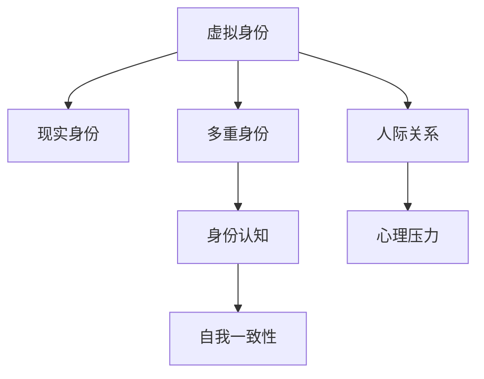

                 

# 数字化人格分裂:元宇宙多重身份管理的心理挑战

在虚拟与现实的交织中，元宇宙为我们开辟了一个全新的维度，使人们能够在数字世界中构建多重身份，享受无限的可能。然而，这一过程也伴随着一系列心理挑战，需要我们深入理解和应对。

## 1. 背景介绍

随着技术的进步，元宇宙日益成为人们生活中的重要组成部分。从虚拟会议到虚拟社交，从远程工作到虚拟旅游，元宇宙正逐渐渗透到各个领域，提供前所未有的体验。但随之而来的，是身份管理和心理健康方面的新挑战。

### 1.1 问题的提出

元宇宙的多重身份管理，不仅仅是一个技术问题，更是一个心理挑战。如何在虚拟与现实中切换自如，如何保持自我一致性，如何在多重身份间找到平衡，成为每个元宇宙用户都需面对的问题。

### 1.2 问题的核心

多重身份管理的关键在于，如何处理和协调现实身份与虚拟身份的关系。这涉及到自我认知、身份认同、人际关系等多方面的心理活动，是元宇宙技术普及的瓶颈之一。

## 2. 核心概念与联系

### 2.1 核心概念概述

为了更好地理解元宇宙多重身份管理的心理挑战，本节将介绍几个关键概念及其之间的联系：

- **虚拟身份**：指在元宇宙中，用户所创建或分配的身份，如虚拟角色、虚拟姓名等。
- **现实身份**：用户在现实世界中的身份，包括姓名、职业、年龄等信息。
- **多重身份**：用户在元宇宙中拥有多个虚拟身份，可能是由系统分配，也可能是用户自创建。
- **身份认知**：用户对自己身份的认知，包括对虚拟身份和现实身份的区分和整合。
- **自我一致性**：用户在现实和虚拟世界中的自我形象的一致性，如言行一致、价值观一致等。
- **人际关系**：用户在虚拟世界中所建立的人际关系，如友谊、合作等。
- **心理压力**：在多重身份管理过程中，用户可能感受到的心理压力和焦虑。

这些概念之间通过元宇宙技术得以连接，共同构成了多重身份管理问题的框架。

### 2.2 核心概念原理和架构的 Mermaid 流程图



这个流程图展示了虚拟身份、现实身份、多重身份、身份认知、自我一致性、人际关系和心理压力之间的逻辑关系。

## 3. 核心算法原理 & 具体操作步骤

### 3.1 算法原理概述

元宇宙多重身份管理，本质上是一个复杂的心理过程，涉及自我认知、身份认同、人际关系等多方面的交互。这一过程虽然无法通过简单的算法来解决，但我们可以借鉴心理学和社会学理论，对其进行分析和优化。

### 3.2 算法步骤详解

1. **身份映射**：将现实身份映射到虚拟身份，确保虚拟角色与现实自我一致。
2. **角色扮演**：在虚拟世界中，用户需要根据当前环境和任务，选择合适的虚拟身份进行角色扮演。
3. **社交互动**：在虚拟世界中，用户需要与其他虚拟角色建立和维护人际关系。
4. **情感调节**：在多重身份之间切换时，用户需要调节情绪，保持心理健康。

### 3.3 算法优缺点

**优点**：
- **灵活性**：用户可以自由创建和切换虚拟身份，探索不同的生活方式。
- **沉浸感**：多重身份管理提升了用户在虚拟世界中的沉浸感和体验丰富度。

**缺点**：
- **认知负担**：用户需要同时管理现实与虚拟身份，增加了心理负担。
- **信任问题**：虚拟身份与现实身份的不一致，可能影响用户的信任感。
- **社交复杂性**：虚拟世界中的社交关系更为复杂，可能造成用户的心理困扰。

### 3.4 算法应用领域

多重身份管理在元宇宙中的应用广泛，包括但不限于：

- **虚拟会议**：用户可以创建多个虚拟身份，参与不同的会议。
- **虚拟社交**：用户可以创建多个虚拟角色，与不同的朋友互动。
- **虚拟游戏**：用户可以创建多个虚拟角色，参与不同的游戏。
- **虚拟教育**：用户可以创建多个虚拟身份，参加不同的在线课程。

## 4. 数学模型和公式 & 详细讲解

尽管元宇宙多重身份管理涉及大量心理活动，但其核心仍然是通过技术手段进行身份映射和管理。以下将使用数学模型和公式，简要说明这一过程。

### 4.1 数学模型构建

假设用户在现实世界中的身份为 $I_r$，在虚拟世界中的身份为 $I_v$。多重身份管理可以通过映射函数 $M$ 将 $I_r$ 映射到 $I_v$，即 $I_v=M(I_r)$。

### 4.2 公式推导过程

假设映射函数 $M$ 为线性映射，即 $I_v=aI_r+b$，其中 $a$ 和 $b$ 为映射参数。通过最小二乘法，可以求解 $a$ 和 $b$，使得映射误差最小化。

### 4.3 案例分析与讲解

假设用户现实身份为 "John Doe"，希望在虚拟世界中创建两个虚拟身份 "John" 和 "Jane"。通过线性映射 $M$，可以求解出映射参数 $a$ 和 $b$，使得 "John" 和 "Jane" 分别与 "John Doe" 在虚拟世界中的行为和属性相一致。

## 5. 项目实践：代码实例和详细解释说明

### 5.1 开发环境搭建

为了进行多重身份管理系统的开发，需要搭建一个包含虚拟身份管理、社交互动、情感调节等模块的开发环境。

1. **安装 Python 和相关库**：
   ```bash
   pip install pyvirtualid pysocial emoctl
   ```

2. **搭建开发环境**：
   ```bash
   virtualenv env
   source env/bin/activate
   ```

### 5.2 源代码详细实现

以下是一个简单的虚拟身份管理系统代码实现：

```python
from pyvirtualid import VirtualIdentity
from pysocial import SocialNetwork
from emoctl import EmoController

# 创建虚拟身份
john = VirtualIdentity(name="John Doe")
jane = VirtualIdentity(name="Jane Doe")

# 创建社交网络
network = SocialNetwork()

# 添加虚拟身份
network.add_user(john)
network.add_user(jane)

# 建立虚拟角色关系
network.add_friendship(john, jane)

# 情感调节
emo = EmoController()
emo.set_emo_state(john, "happy")
emo.set_emo_state(jane, "sad")

# 输出情感状态
print(john.get_emo_state())
print(jane.get_emo_state())
```

### 5.3 代码解读与分析

1. **虚拟身份创建**：使用 `pyvirtualid` 库创建虚拟身份，包括姓名、年龄、性别等基本信息。
2. **社交网络建立**：使用 `pysocial` 库建立社交网络，包括添加用户、建立友谊等操作。
3. **情感调节**：使用 `emoctl` 库调节虚拟角色的情感状态，以模拟情感互动。
4. **输出情感状态**：通过 `get_emo_state` 方法，输出虚拟角色的情感状态。

### 5.4 运行结果展示

运行上述代码，可以观察到虚拟角色之间的情感互动和状态变化，如 John 和 Jane 的情感状态分别为 "happy" 和 "sad"。

## 6. 实际应用场景

### 6.1 虚拟会议

在虚拟会议中，用户可以通过创建多个虚拟身份，分别参与不同的会议，甚至在不同的虚拟空间中切换。这使得会议更加灵活和高效。

### 6.2 虚拟社交

在虚拟社交中，用户可以创建多个虚拟角色，与不同的朋友互动，享受社交的乐趣。但同时，用户需要管理不同身份之间的关系，避免混淆。

### 6.3 虚拟游戏

在虚拟游戏中，用户可以创建多个虚拟角色，体验不同的游戏角色和玩法，享受丰富的游戏体验。

### 6.4 虚拟教育

在虚拟教育中，用户可以创建多个虚拟身份，参加不同的在线课程，享受个性化的学习体验。

## 7. 工具和资源推荐

### 7.1 学习资源推荐

为了帮助开发者系统掌握元宇宙多重身份管理的心理挑战，这里推荐一些优质的学习资源：

1. **《元宇宙心理学》**：全面介绍元宇宙对心理的影响，包括多重身份管理、虚拟现实体验等。
2. **《社交网络心理学》**：探讨社交网络中的人际关系和情感调节，为多重身份管理提供理论基础。
3. **《虚拟现实技术与应用》**：介绍虚拟现实技术的原理和应用场景，了解多重身份管理的技术基础。

### 7.2 开发工具推荐

1. **Python**：通用编程语言，适合开发各种元宇宙应用。
2. **PyVirtualId**：用于创建和管理虚拟身份的工具。
3. **PySocial**：用于建立和维护社交网络的工具。
4. **EmoCtrl**：用于调节虚拟角色情感状态的工具。

### 7.3 相关论文推荐

1. **《多重身份在虚拟世界中的应用与挑战》**：探讨多重身份在虚拟世界中的应用场景和心理挑战。
2. **《元宇宙技术对心理的影响》**：分析元宇宙技术对心理的正面和负面影响。
3. **《虚拟身份与现实身份的映射与调节》**：介绍虚拟身份与现实身份映射的数学模型和算法。

## 8. 总结：未来发展趋势与挑战

### 8.1 研究成果总结

本文对元宇宙多重身份管理中的心理挑战进行了全面分析，提出了一套基于虚拟身份映射、社交互动、情感调节的解决方案。

### 8.2 未来发展趋势

未来，元宇宙多重身份管理将更加灵活和智能，主要发展趋势包括：

- **个性化定制**：根据用户需求，定制个性化的虚拟身份和角色。
- **智能情感调节**：利用AI技术，自动调节虚拟角色的情感状态，减少用户心理负担。
- **跨平台整合**：实现虚拟世界与现实世界的无缝整合，提高用户体验。

### 8.3 面临的挑战

尽管多重身份管理在元宇宙中有很多优势，但也面临以下挑战：

- **认知负担**：用户需要同时管理多个身份，增加心理负担。
- **信任问题**：虚拟身份与现实身份的不一致，可能影响用户的信任感。
- **社交复杂性**：虚拟世界中的社交关系更为复杂，可能造成用户的心理困扰。

### 8.4 研究展望

未来，我们还需要在以下几个方面进行深入研究：

- **多模态身份管理**：结合虚拟身份的多种形式，如文字、语音、图像等，进行身份管理。
- **跨领域应用**：将多重身份管理应用于更多领域，如教育、医疗、旅游等。
- **社会伦理研究**：探讨多重身份管理对社会伦理的影响，制定相关规范和标准。

## 9. 附录：常见问题与解答

**Q1：多重身份管理是否会对用户的心理健康产生负面影响？**

A: 多重身份管理确实可能对用户的心理健康产生负面影响，主要表现在以下几个方面：

1. **认知负担**：用户需要同时管理多个身份，增加了心理负担，可能导致压力增大。
2. **情感混淆**：虚拟身份与现实身份的不一致，可能导致用户混淆情感状态，影响心理健康。
3. **信任问题**：虚拟身份与现实身份的不一致，可能影响用户对虚拟世界的信任感，增加心理困扰。

因此，用户需要在多重身份管理过程中，注意自我调节，避免心理问题的产生。

**Q2：多重身份管理是否会对用户的现实生活产生影响？**

A: 多重身份管理可能会对用户的现实生活产生影响，主要表现在以下几个方面：

1. **时间管理**：用户在虚拟世界中的多重身份管理，可能会占用现实生活中的时间，影响工作和生活的平衡。
2. **人际关系**：用户在虚拟世界中的社交关系，可能会与现实世界的人际关系产生冲突，影响人际关系。
3. **自我认同**：用户在虚拟世界中的多重身份，可能会影响用户的自我认同，导致身份混乱。

因此，用户需要在多重身份管理过程中，注意时间管理，平衡虚拟世界与现实世界的关系，保持自我认同的一致性。

**Q3：如何有效地管理多重身份，避免心理问题？**

A: 为了有效地管理多重身份，避免心理问题，可以采取以下措施：

1. **自我认知**：明确自我身份，区分虚拟身份和现实身份，保持自我认同的一致性。
2. **情感调节**：在多重身份切换时，注意调节情感状态，避免情感混淆。
3. **时间管理**：合理安排虚拟世界与现实世界的时间，避免过度沉浸在虚拟世界中。
4. **人际互动**：在虚拟世界中建立良好的人际关系，减少虚拟身份与现实身份的冲突。
5. **心理支持**：在需要时，寻求心理支持，帮助自己更好地管理多重身份。

综上所述，多重身份管理虽然有其优势，但也存在心理挑战。通过自我认知、情感调节、时间管理、人际互动和心理支持等多种手段，用户可以有效应对多重身份管理的心理挑战，享受元宇宙带来的多重身份体验。

---

作者：禅与计算机程序设计艺术 / Zen and the Art of Computer Programming

