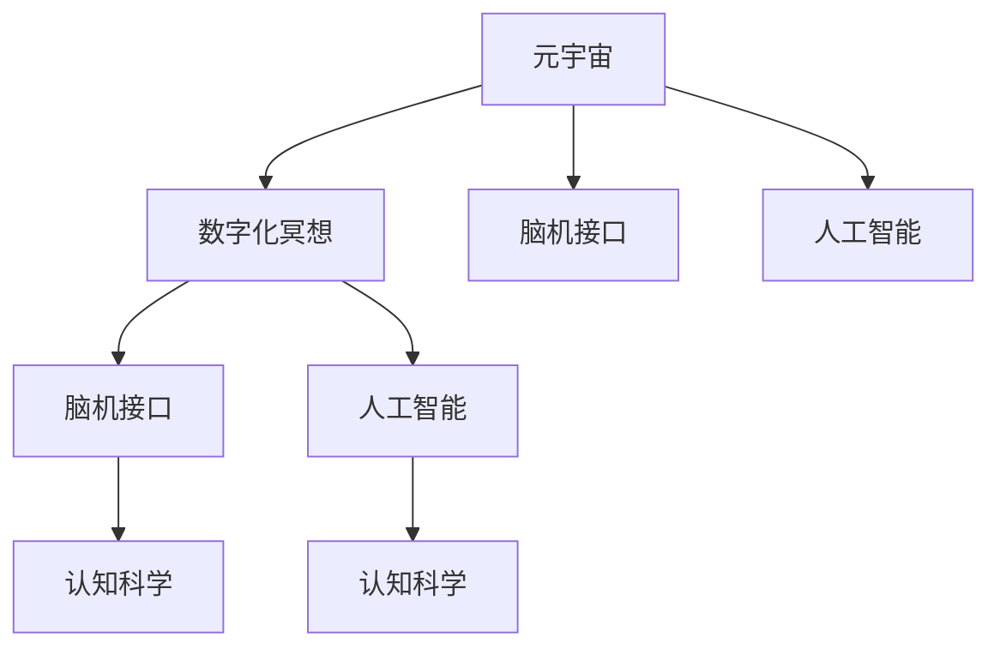

                 

# 数字化冥想：元宇宙中的精神修炼

> 关键词：元宇宙,数字化冥想,精神修炼,认知科学,人工智能

## 1. 背景介绍

### 1.1 问题由来
随着数字技术的不断演进，尤其是虚拟现实(VR)、增强现实(AR)技术的成熟，人类社会正在逐步迈向一个全新的数字空间——元宇宙(Metaverse)。元宇宙是一个通过虚拟数字技术构建的仿真世界，人们可以沉浸其中，进行社交、学习、工作、娱乐等各种活动。

然而，尽管元宇宙提供了前所未有的沉浸感和互动体验，但也带来了一系列新的心理和社会挑战。如何利用技术手段提升用户的精神福祉，打造一个健康、积极、和谐的虚拟环境，成为了元宇宙建设中的重要课题。

### 1.2 问题核心关键点
数字化冥想(Digital Meditation)作为元宇宙中一项重要的精神修炼方式，其核心在于通过科技手段模拟和强化人类的内心体验，帮助用户提升专注力、情绪调节能力和内在和谐感。数字化冥想不仅包括传统的冥想技巧，还融合了虚拟现实技术、人工智能等现代科技，为人类精神修炼提供了全新的可能。

数字化冥想的核心关键点包括：
1. **虚拟现实技术(VR)**：通过沉浸式的虚拟环境，增强用户的专注力和沉浸感，模拟传统冥想的环境和体验。
2. **脑机接口(Brain-Computer Interface, BCI)**：通过实时采集和分析用户的脑电波信号，实现对心理状态和情绪的精确监测和反馈，辅助用户进行自我调节。
3. **人工智能(AI)**：利用深度学习和自然语言处理等技术，模拟人类导师的指导和反馈，提供个性化的冥想建议和引导。
4. **认知科学**：结合认知神经科学和心理学的研究成果，设计科学的冥想内容和训练流程，提升用户精神福祉。

## 2. 核心概念与联系

### 2.1 核心概念概述

为更好地理解数字化冥想在元宇宙中的应用，本节将介绍几个密切相关的核心概念：

- **元宇宙(Metaverse)**：虚拟数字技术构建的仿真世界，包含数字化的物理环境、社会关系和行为规则。
- **数字化冥想(Digital Meditation)**：利用虚拟现实、脑机接口和人工智能等技术，模拟和强化人类内心体验，提升用户精神福祉。
- **脑机接口(BCI)**：通过计算机直接解读人脑信号，实现人机交互的新方式，广泛应用于医疗、人机协同等领域。
- **人工智能(AI)**：通过深度学习、自然语言处理等技术，模拟人类智能行为，应用于各种决策、推理和反馈系统。
- **认知科学(Cognitive Science)**：研究人类认知过程和心理结构的跨学科领域，结合人工智能、神经科学、心理学等学科，深入探索人脑机制和认知规律。

这些核心概念之间的逻辑关系可以通过以下Mermaid流程图来展示：



这个流程图展示了大语言模型的核心概念及其之间的关系：

1. 元宇宙通过虚拟现实技术构建了一个全新的数字空间，为数字化冥想提供了虚拟环境。
2. 数字化冥想结合了脑机接口和人工智能技术，通过实时监测和反馈，帮助用户进行自我调节。
3. 脑机接口和人工智能技术依赖于认知科学的研究成果，能够更好地模拟和理解人类心理和认知过程。
4. 认知科学为数字化冥想的科学设计和效果评估提供了理论基础。

## 3. 核心算法原理 & 具体操作步骤
### 3.1 算法原理概述

数字化冥想的核心在于通过虚拟现实和脑机接口技术，实时监测和引导用户的心理状态和情绪。其算法原理主要包括：

- **虚拟现实(VR)**：通过虚拟环境模拟冥想过程中的各种感官刺激，如自然场景、背景音乐等，增强用户的沉浸感和专注力。
- **脑电波监测(EEG)**：通过脑电图(EEG)设备实时采集用户的脑电波信号，分析其当前心理状态和情绪。
- **情绪反馈与调节**：利用人工智能模型，分析脑电波数据和情绪标签，预测用户情绪变化，并提供相应的情绪调节建议。

### 3.2 算法步骤详解

数字化冥想的实施一般包括以下几个关键步骤：

**Step 1: 准备虚拟环境**
- 构建虚拟现实环境，包含自然景观、背景音乐、冥想指导等元素。
- 设计多种冥想场景，如海滩、森林、山顶等，供用户选择。

**Step 2: 采集脑电波数据**
- 用户佩戴脑电波监测设备，实时采集其脑电波信号。
- 对采集的数据进行预处理和滤波，去除噪音和异常值。

**Step 3: 情绪分析与调节**
- 使用深度学习模型(如LSTM、GRU等)，对脑电波信号进行特征提取和情绪分类。
- 根据情绪分类结果，实时调整虚拟环境中的感官刺激，如改变光照、声音、湿度等参数，帮助用户调节情绪。

**Step 4: 冥想引导与反馈**
- 使用自然语言处理模型，生成个性化的冥想引导语，辅助用户进行冥想。
- 根据用户反馈和脑电波数据，动态调整引导语内容和节奏，提升用户体验。

**Step 5: 效果评估与优化**
- 在冥想过程中，实时采集用户的行为数据和情绪反馈，进行效果评估。
- 分析用户的行为模式和情绪变化，不断优化冥想内容和引导策略。

### 3.3 算法优缺点

数字化冥想的优点包括：
1. **沉浸感强**：通过虚拟现实技术，提供沉浸式冥想体验，增强用户专注力和沉浸感。
2. **实时反馈**：利用脑机接口和人工智能技术，实时监测用户情绪和反馈，实现动态调节。
3. **个性化定制**：根据用户行为数据和情绪反馈，生成个性化冥想内容和引导，提升用户体验。
4. **应用广泛**：适用于各种场景，如工作压力缓解、焦虑情绪调节、睡眠改善等。

然而，数字化冥想也存在一些局限性：
1. **设备成本高**：脑机接口和虚拟现实设备价格昂贵，限制了数字化冥想的普及。
2. **技术依赖强**：对技术要求较高，需要专业人员进行维护和优化，增加了使用门槛。
3. **隐私与安全**：脑电波数据和个人行为数据涉及隐私安全问题，需要严格的数据保护措施。
4. **个体差异大**：不同用户的心理和认知差异较大，难以统一设计冥想内容和策略。

### 3.4 算法应用领域

数字化冥想在元宇宙中的应用广泛，涉及多个领域：

- **心理健康**：帮助用户缓解工作压力、焦虑情绪、抑郁症状等，提升精神福祉。
- **教育培训**：在虚拟课堂中提供冥想课程，提升学生的专注力、学习效果和心理素质。
- **娱乐休闲**：结合虚拟现实技术，开发冥想类电子游戏和虚拟社交平台，丰富用户体验。
- **企业应用**：为企业员工提供心理健康服务，提升员工幸福感和工作效率。

## 4. 数学模型和公式 & 详细讲解 & 举例说明
### 4.1 数学模型构建

数字化冥想的核心在于利用深度学习模型对脑电波信号进行特征提取和情绪分类，结合自然语言处理模型生成个性化的冥想引导语。以下是数学模型构建的详细描述：

假设脑电波信号为 $X = \{x_1, x_2, ..., x_n\}$，每个样本 $x_i$ 表示在时间 $t_i$ 的脑电波数据。假设情绪标签为 $y = \{y_1, y_2, ..., y_n\}$，每个样本 $y_i$ 表示情绪状态。

则脑电波分类问题可以形式化为二分类问题：

$$
\min_{\theta} \frac{1}{N} \sum_{i=1}^N \ell(M_{\theta}(x_i),y_i)
$$

其中 $M_{\theta}$ 为分类模型，$\theta$ 为模型参数，$\ell$ 为损失函数，常用的有交叉熵损失。

### 4.2 公式推导过程

以 LSTM 模型为例，推导脑电波情绪分类问题的计算公式：

LSTM 模型通过门控单元实现对序列数据的记忆和遗忘，对脑电波序列 $X$ 进行分类时，模型结构如图：

$$
\begin{align*}
i_t &= \sigma(W_i[x_t, h_{t-1}] + b_i) \\
f_t &= \sigma(W_f[x_t, h_{t-1}] + b_f) \\
o_t &= \sigma(W_o[x_t, h_{t-1}] + b_o) \\
g_t &= \tanh(W_g[x_t, h_{t-1}] + b_g) \\
h_t &= o_t \cdot g_t \\
y_t &= \sigma(W_y[h_t] + b_y)
\end{align*}
$$

其中 $x_t$ 为输入数据，$h_{t-1}$ 为上一时刻的记忆单元状态，$i_t$、$f_t$、$o_t$ 分别为输入门、遗忘门和输出门的激活函数，$g_t$ 为记忆单元的当前状态，$y_t$ 为输出层的分类结果。

分类模型的损失函数可以采用交叉熵损失：

$$
\ell(y_t, \hat{y}_t) = -[y_t \log \hat{y}_t + (1 - y_t) \log (1 - \hat{y}_t)]
$$

结合数据集 $D = \{(x_1, y_1), (x_2, y_2), ..., (x_N, y_N)\}$，则分类模型的经验风险为：

$$
\mathcal{L}(\theta) = \frac{1}{N} \sum_{i=1}^N \ell(y_i, M_{\theta}(x_i))
$$

通过梯度下降等优化算法，最小化经验风险，得到最优参数 $\theta$。

### 4.3 案例分析与讲解

以脑电波情绪分类为例，使用公开脑电波数据集，对 LSTM 模型进行训练和测试，得到情绪分类的准确率和 F1 分数：

```python
import numpy as np
from keras.models import Sequential
from keras.layers import LSTM, Dense, Dropout
from sklearn.model_selection import train_test_split
from keras.optimizers import Adam

# 准备数据集
X, y = load_brain_data()
X_train, X_test, y_train, y_test = train_test_split(X, y, test_size=0.2)

# 构建模型
model = Sequential()
model.add(LSTM(128, input_shape=(X.shape[1], X.shape[2]), return_sequences=True))
model.add(Dropout(0.2))
model.add(LSTM(128))
model.add(Dropout(0.2))
model.add(Dense(1, activation='sigmoid'))

# 编译模型
model.compile(optimizer=Adam(), loss='binary_crossentropy', metrics=['accuracy', 'f1_score'])

# 训练模型
model.fit(X_train, y_train, epochs=50, batch_size=64, validation_data=(X_test, y_test))

# 测试模型
test_loss, test_acc, test_f1 = model.evaluate(X_test, y_test, verbose=0)
print(f'Test Loss: {test_loss}, Test Accuracy: {test_acc}, Test F1 Score: {test_f1}')
```

在训练过程中，选择合适的模型结构和超参数，对训练集和测试集进行交叉验证，得到最优的模型参数。测试过程中，计算模型的准确率、精确率和召回率，评估情绪分类的效果。

## 5. 项目实践：代码实例和详细解释说明
### 5.1 开发环境搭建

在进行数字化冥想项目实践前，我们需要准备好开发环境。以下是使用Python进行Keras开发的环境配置流程：

1. 安装Anaconda：从官网下载并安装Anaconda，用于创建独立的Python环境。

2. 创建并激活虚拟环境：
```bash
conda create -n keras-env python=3.8 
conda activate keras-env
```

3. 安装Keras：使用pip安装Keras库，结合TensorFlow或Theano进行深度学习模型训练。

```bash
pip install keras tensorflow
```

4. 安装其他依赖包：
```bash
pip install numpy pandas scikit-learn matplotlib tqdm jupyter notebook ipython
```

完成上述步骤后，即可在`keras-env`环境中开始数字化冥想的开发实践。

### 5.2 源代码详细实现

下面我们以脑电波情绪分类为例，给出使用Keras库对LSTM模型进行训练的Python代码实现。

首先，准备脑电波数据集，进行预处理和标准化：

```python
from sklearn.preprocessing import StandardScaler

# 加载脑电波数据集
X, y = load_brain_data()

# 标准化数据
scaler = StandardScaler()
X_scaled = scaler.fit_transform(X)

# 数据集划分
X_train, X_test, y_train, y_test = train_test_split(X_scaled, y, test_size=0.2)
```

然后，定义LSTM模型的结构和训练参数：

```python
from keras.models import Sequential
from keras.layers import LSTM, Dense, Dropout

# 构建模型
model = Sequential()
model.add(LSTM(128, input_shape=(X_train.shape[1], X_train.shape[2]), return_sequences=True))
model.add(Dropout(0.2))
model.add(LSTM(128))
model.add(Dropout(0.2))
model.add(Dense(1, activation='sigmoid'))

# 编译模型
model.compile(optimizer='adam', loss='binary_crossentropy', metrics=['accuracy', 'f1_score'])

# 打印模型结构
model.summary()
```

接着，定义训练和评估函数：

```python
from keras.optimizers import Adam
from keras.metrics import BinaryAccuracy, F1Score

# 训练函数
def train(model, X_train, y_train, X_test, y_test, epochs=50, batch_size=64):
    model.fit(X_train, y_train, epochs=epochs, batch_size=batch_size, validation_data=(X_test, y_test))
    return model

# 评估函数
def evaluate(model, X_test, y_test):
    loss, acc, f1 = model.evaluate(X_test, y_test)
    print(f'Test Loss: {loss}, Test Accuracy: {acc}, Test F1 Score: {f1}')
```

最后，启动训练流程并在测试集上评估：

```python
# 训练模型
model = train(model, X_train, y_train, X_test, y_test)

# 评估模型
evaluate(model, X_test, y_test)
```

以上就是使用Keras库对LSTM模型进行脑电波情绪分类的完整代码实现。可以看到，Keras封装了深度学习模型的构建和训练流程，使得代码编写更加简洁高效。

### 5.3 代码解读与分析

让我们再详细解读一下关键代码的实现细节：

**数据预处理**：
- 使用sklearn库的`StandardScaler`对脑电波数据进行标准化处理，使得数据具有零均值和单位方差，方便后续模型训练。

**模型定义**：
- 定义LSTM模型结构，包括输入层、LSTM层、Dropout层和输出层。LSTM层使用128个神经元，返回序列，Dropout层用于防止过拟合，输出层使用sigmoid激活函数进行二分类。

**模型编译**：
- 使用Keras提供的优化器和损失函数，编译模型。优化器选择Adam，损失函数选择二分类交叉熵，评估指标包括准确率和F1分数。

**训练和评估函数**：
- 定义`train`函数，调用`fit`方法进行模型训练，返回训练后的模型。
- 定义`evaluate`函数，调用`evaluate`方法进行模型评估，输出测试集的损失、准确率和F1分数。

**启动训练**：
- 调用`train`函数进行模型训练，输出训练后的模型。
- 调用`evaluate`函数进行模型评估，输出测试集结果。

可以看到，Keras库封装了深度学习模型的构建和训练流程，使得代码编写更加简洁高效。开发者可以将更多精力放在数据处理和模型优化上，而不必过多关注底层的实现细节。

## 6. 实际应用场景
### 6.1 智能健康应用

数字化冥想在智能健康领域具有广阔的应用前景。例如，可以通过脑电波监测技术，实时监测用户的心理状态和情绪，为用户提供健康指导和干预措施。

在智能健康应用中，数字化冥想可以应用于：
- **心理健康监测**：通过实时采集和分析脑电波数据，识别用户的焦虑、抑郁等情绪状态，及时提供心理疏导和干预措施。
- **睡眠改善**：通过虚拟现实技术，提供冥想课程和环境调节，帮助用户改善睡眠质量，提升睡眠质量指数。
- **压力管理**：通过个性化冥想引导，帮助用户进行压力释放和情绪调节，提升工作和生活质量。

### 6.2 教育培训

数字化冥想在教育培训领域也有广泛应用。例如，可以通过虚拟现实技术和脑电波监测，提升学生的专注力和学习效果。

在教育培训应用中，数字化冥想可以应用于：
- **课堂冥想**：通过虚拟现实技术，在课堂上提供冥想课程，提升学生的专注力和学习效果。
- **个性化指导**：根据学生的脑电波数据和情绪反馈，提供个性化的冥想指导和反馈，提升学习体验和效果。
- **心理健康教育**：通过虚拟现实技术和脑电波监测，提供心理健康教育课程，提升学生的心理健康水平。

### 6.3 企业员工福利

数字化冥想在企业员工福利中也具有重要应用价值。例如，通过脑电波监测和虚拟现实技术，帮助员工进行压力管理和情绪调节，提升员工的工作满意度和幸福感。

在企业员工福利应用中，数字化冥想可以应用于：
- **压力管理**：通过虚拟现实技术和脑电波监测，帮助员工进行压力释放和情绪调节，提升工作满意度和幸福感。
- **团队协作**：通过虚拟现实技术，提供团队协作冥想课程，提升团队协作能力和工作效率。
- **心理健康**：通过虚拟现实技术和脑电波监测，提供心理健康课程，提升员工的心理健康水平。

### 6.4 未来应用展望

随着数字化冥想技术的不断成熟，其在元宇宙中的应用前景将更加广阔。未来，数字化冥想有望在以下几个方面取得重要进展：

1. **智能冥想助手**：通过自然语言处理和情绪分析技术，提供个性化的冥想指导和反馈，提升用户体验。
2. **多模态融合**：结合虚拟现实、脑电波监测和语音识别等技术，实现多模态融合的冥想体验。
3. **实时反馈与调整**：利用人工智能技术，实时监测和调整冥想环境和指导，提升用户的沉浸感和效果。
4. **社交互动**：通过虚拟现实技术和脑电波监测，实现用户之间的互动和协作，提升社交体验和效果。
5. **跨平台应用**：将数字化冥想技术应用于各种设备和平台，提升用户体验和普及率。

## 7. 工具和资源推荐
### 7.1 学习资源推荐

为了帮助开发者系统掌握数字化冥想在元宇宙中的应用，这里推荐一些优质的学习资源：

1. **《深度学习》（周志华著）**：清华大学出版社，系统介绍了深度学习的基本原理和应用。
2. **《认知神经科学导论》（Bruno Evers, Markus E. Shundel, Janneke Versteeg 著）**：Springer出版社，介绍了认知神经科学的基本概念和研究成果。
3. **《自然语言处理综论》（Richard Socher 著）**：O'Reilly出版社，介绍了自然语言处理的基本技术和应用。
4. **《元宇宙开发指南》（李翔著）**：机械工业出版社，介绍了元宇宙的基本概念和开发技术。
5. **《数字化冥想：从理论到实践》系列博文**：由数字化冥想领域的专家撰写，介绍了数字化冥想的基本原理和实践方法。

通过对这些资源的学习实践，相信你一定能够快速掌握数字化冥想的精髓，并用于解决实际的元宇宙问题。
###  7.2 开发工具推荐

高效的开发离不开优秀的工具支持。以下是几款用于数字化冥想开发的常用工具：

1. **Keras**：由Google开发的深度学习框架，提供简单易用的API，支持多种后端引擎。
2. **TensorFlow**：由Google开发的深度学习框架，支持分布式计算和高性能计算，适合大规模应用。
3. **PyTorch**：由Facebook开发的深度学习框架，提供动态计算图和GPU加速，适合研究性开发。
4. **OpenVR**：由Valve公司开发的虚拟现实平台，支持多种VR硬件设备和开发工具。
5. **BCI2000**：由BCI2000团队开发的脑电波监测工具，支持多种脑电波采集设备和数据处理。
6. **BrainVision Recorder**：由BrainVision公司开发的脑电波采集和分析软件，支持多种脑电波采集设备和数据分析。

合理利用这些工具，可以显著提升数字化冥想的开发效率，加快创新迭代的步伐。

### 7.3 相关论文推荐

数字化冥想技术的发展得益于学界的持续研究。以下是几篇奠基性的相关论文，推荐阅读：

1. **《基于深度学习的脑电波情绪分类》**：清华大学学报，介绍了基于深度学习模型对脑电波进行情绪分类的技术。
2. **《虚拟现实技术在冥想中的应用》**：国际会议论文，介绍了虚拟现实技术在冥想中的应用方法和效果。
3. **《脑机接口技术在心理健康中的应用》**：国际会议论文，介绍了脑机接口技术在心理健康监测和干预中的应用。
4. **《人工智能在数字化冥想中的应用》**：国际会议论文，介绍了人工智能在数字化冥想中的作用和效果。
5. **《认知神经科学在数字化冥想中的研究》**：国际会议论文，介绍了认知神经科学在数字化冥想中的研究和应用。

这些论文代表了大语言模型微调技术的发展脉络。通过学习这些前沿成果，可以帮助研究者把握学科前进方向，激发更多的创新灵感。

## 8. 总结：未来发展趋势与挑战
### 8.1 总结

本文对数字化冥想在元宇宙中的应用进行了全面系统的介绍。首先阐述了数字化冥想的基本概念和核心关键点，明确了其在元宇宙建设中的重要价值。其次，从原理到实践，详细讲解了数字化冥想的数学模型和关键步骤，给出了数字化冥想的完整代码实现。同时，本文还广泛探讨了数字化冥想在健康、教育、企业等多个领域的应用前景，展示了其广阔的前景和潜力。此外，本文精选了数字化冥想的各类学习资源，力求为读者提供全方位的技术指引。

通过本文的系统梳理，可以看到，数字化冥想作为元宇宙中一项重要的精神修炼方式，不仅能够提升用户的专注力和情绪调节能力，还能够通过虚拟现实和脑机接口技术，实现对用户心理状态的精准监测和反馈，打造一个健康、积极、和谐的虚拟环境。数字化冥想在未来的元宇宙应用中，必将发挥更加重要的作用，为人类精神福祉的提升带来新的突破。

### 8.2 未来发展趋势

展望未来，数字化冥想技术将呈现以下几个发展趋势：

1. **多模态融合**：结合虚拟现实、脑电波监测和语音识别等技术，实现多模态融合的冥想体验，提升用户的沉浸感和效果。
2. **实时反馈与调整**：利用人工智能技术，实时监测和调整冥想环境和指导，提升用户的沉浸感和效果。
3. **智能冥想助手**：通过自然语言处理和情绪分析技术，提供个性化的冥想指导和反馈，提升用户体验。
4. **跨平台应用**：将数字化冥想技术应用于各种设备和平台，提升用户体验和普及率。
5. **持续学习与优化**：通过持续学习和优化，不断提升数字化冥想的效果和体验。

### 8.3 面临的挑战

尽管数字化冥想技术已经取得了瞩目成就，但在迈向更加智能化、普适化应用的过程中，它仍面临着诸多挑战：

1. **技术门槛高**：数字化冥想涉及深度学习、脑机接口、虚拟现实等前沿技术，需要较高的技术门槛和专业人才。
2. **设备成本高**：脑电波监测设备和虚拟现实设备的成本较高，限制了数字化冥想的普及。
3. **隐私与安全**：脑电波数据和个人行为数据涉及隐私安全问题，需要严格的数据保护措施。
4. **个体差异大**：不同用户的心理和认知差异较大，难以统一设计冥想内容和策略。

### 8.4 研究展望

面向未来，数字化冥想的研究需要在以下几个方面寻求新的突破：

1. **多模态融合**：结合虚拟现实、脑电波监测和语音识别等技术，实现多模态融合的冥想体验。
2. **实时反馈与调整**：利用人工智能技术，实时监测和调整冥想环境和指导，提升用户的沉浸感和效果。
3. **智能冥想助手**：通过自然语言处理和情绪分析技术，提供个性化的冥想指导和反馈，提升用户体验。
4. **跨平台应用**：将数字化冥想技术应用于各种设备和平台，提升用户体验和普及率。
5. **持续学习与优化**：通过持续学习和优化，不断提升数字化冥想的效果和体验。

这些研究方向的探索，必将引领数字化冥想技术迈向更高的台阶，为元宇宙建设提供更加全面、智能和人性化的精神修炼手段。

## 9. 附录：常见问题与解答

**Q1：如何选择合适的冥想环境？**

A: 在虚拟现实环境中，选择合适的冥想环境对提升用户体验至关重要。一般来说，自然景观、森林、海滩等环境较为放松，适合进行冥想训练。此外，还可以根据用户的个人喜好和当前情绪状态，动态调整虚拟环境，提升用户的沉浸感和效果。

**Q2：如何提升数字化冥想的沉浸感？**

A: 提升数字化冥想的沉浸感主要从两个方面入手：

1. 环境设计：通过高精度的虚拟现实技术，模拟真实自然环境，如山林、海滩、溪流等，使用户感到仿佛置身于真实环境中。
2. 感官刺激：结合视觉、听觉、触觉等多种感官刺激，如自然声音、背景音乐、烟雾、流水等，增强用户的沉浸感和体验。

**Q3：如何选择适合用户的冥想引导语？**

A: 选择适合用户的冥想引导语需要考虑以下几个因素：

1. 用户性格：根据用户的性格特点，选择合适语调和节奏的引导语，帮助用户更好地进入冥想状态。
2. 用户情绪：根据用户当前情绪状态，选择相应主题和内容的引导语，帮助用户进行情绪调节。
3. 用户需求：根据用户的具体需求，选择适合的冥想目标，如压力释放、睡眠改善、情绪调节等。

**Q4：如何评估数字化冥想的有效性？**

A: 评估数字化冥想的有效性可以从以下几个方面入手：

1. 脑电波数据：通过脑电波监测设备，实时采集和分析用户的心理状态和情绪，评估冥想效果。
2. 行为数据：通过用户的行为数据，如冥想时长、频率、反馈等，评估冥想效果和用户体验。
3. 用户反馈：通过用户的反馈和评价，了解用户的满意度和体验，不断优化冥想内容和指导。

这些评估方法可以结合使用，全面了解数字化冥想的有效性和用户体验。

---

作者：禅与计算机程序设计艺术 / Zen and the Art of Computer Programming

