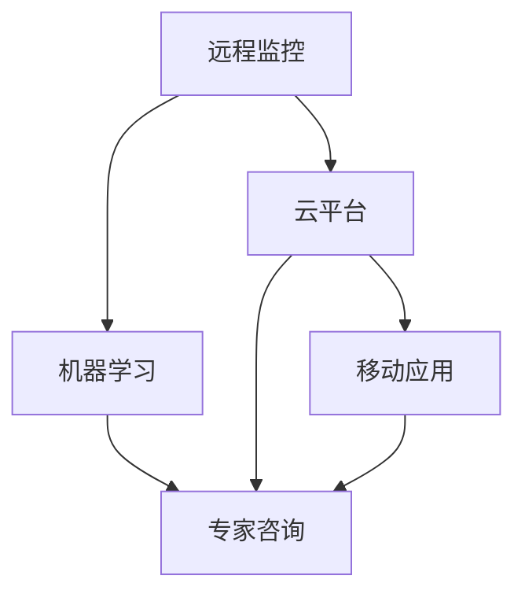

                 

# 数字化宠物医疗创业：远程诊断和监控

## 1. 背景介绍

### 1.1 问题由来

近年来，数字化医疗的浪潮席卷了人类医疗领域，带来了诊断和治疗方式的革命性改变。与此同时，数字化宠物医疗也开始受到越来越多的关注。据统计，全球宠物主人数量不断增加，宠物疾病频发，对宠物医疗资源的需求日益迫切。然而，由于地域和资源限制，很多宠物无法及时获得专业的医疗服务，病痛加剧甚至危及生命。数字化宠物医疗的兴起，为解决这一问题提供了新的思路。

### 1.2 问题核心关键点

数字化宠物医疗创业的核心在于利用先进的信息技术和智能化设备，为宠物提供远程诊断和监控服务。其关键点包括以下几个方面：

- **远程监控**：通过智能传感器和摄像头等设备，实时收集宠物的生理指标和生活环境数据，传输至云端平台进行分析。
- **自动化诊断**：基于机器学习和大数据分析，对宠物健康数据进行模式识别和异常检测，提供初步的诊断建议。
- **专家咨询**：提供24小时在线咨询和远程诊疗服务，将宠物主人的疑问和数据传输至专业兽医，确保宠物获得及时有效的医疗帮助。
- **健康管理**：通过建立宠物健康档案和行为分析，提供个性化的健康管理方案，提升宠物生活质量。
- **用户教育**：通过教育平台和移动应用，普及宠物健康知识，提升宠物主人对宠物健康的认知和管理能力。

本文将系统性地介绍远程诊断和监控的数字化宠物医疗创业的技术框架和实现步骤，以期为创业者提供有力的技术支持和参考。

## 2. 核心概念与联系

### 2.1 核心概念概述

为更好地理解远程诊断和监控的技术实现，本节将介绍几个密切相关的核心概念：

- **远程监控**：通过智能传感器和摄像头等设备，实时收集宠物的生理指标和生活环境数据，传输至云端平台进行分析。
- **机器学习**：利用训练好的模型，对收集到的数据进行特征提取、模式识别和异常检测，提供初步的诊断建议。
- **云平台**：提供数据存储、计算、分析和处理的云服务，确保数据安全和高效处理。
- **移动应用**：通过手机和平板等移动设备，提供数据收集、监控和管理功能，方便用户操作。
- **物联网(IoT)**：将传感器、摄像头和云平台等设备连接在一起，实现数据的实时传输和处理。

这些核心概念之间的逻辑关系可以通过以下Mermaid流程图来展示：



这个流程图展示了一系列核心概念及其之间的联系：

1. 通过远程监控设备收集数据。
2. 将数据传输至云平台进行存储和初步分析。
3. 使用机器学习模型对数据进行深度分析，提供诊断建议。
4. 结合专家咨询，提供专业的诊疗服务。
5. 用户通过移动应用获取健康管理和诊断建议。

## 3. 核心算法原理 & 具体操作步骤

### 3.1 算法原理概述

远程诊断和监控的数字化宠物医疗创业，本质上是一个数据收集、处理、分析和应用的系统工程。其核心算法原理主要包括：

- **数据采集**：通过各种传感器和摄像头，实时收集宠物的生理指标和生活环境数据。
- **数据预处理**：对采集到的数据进行清洗、归一化和特征提取，为机器学习模型提供合适的输入。
- **机器学习模型**：使用监督学习和无监督学习等方法，训练模型对数据进行模式识别和异常检测。
- **诊断推理**：根据模型的分析结果，提供初步的诊断建议和医疗建议。
- **专家咨询**：将用户的疑问和分析结果传输至专业兽医，进行详细的诊断和诊疗。
- **健康管理**：通过建立宠物健康档案和行为分析，提供个性化的健康管理方案。
- **用户教育**：通过教育平台和移动应用，普及宠物健康知识，提升宠物主人对宠物健康的认知和管理能力。

### 3.2 算法步骤详解

**Step 1: 数据采集与传输**

远程监控的核心在于数据的实时采集和传输。以下是具体步骤：

- 选择合适的传感器和摄像头，如温度传感器、心率传感器、位置传感器等，用于收集宠物的生理指标。
- 使用Wi-Fi、蓝牙或4G/5G网络等通信技术，将传感器和摄像头采集的数据实时传输至云端平台。

**Step 2: 数据预处理**

采集到的数据通常包含噪声和不一致性，需要进行预处理以提高数据质量。具体步骤如下：

- 清洗数据：去除重复、缺失和异常值，确保数据的完整性和准确性。
- 归一化：将数据缩放到0到1之间，或使用标准差归一化，便于后续处理。
- 特征提取：使用统计、频谱分析和时序分析等方法，提取有意义的特征。

**Step 3: 机器学习模型训练**

训练机器学习模型是远程诊断和监控的核心。具体步骤如下：

- 选择合适的模型结构，如卷积神经网络(CNN)、循环神经网络(RNN)、长短时记忆网络(LSTM)等，用于特征提取和模式识别。
- 使用监督学习或无监督学习的方法，训练模型对数据进行分类、回归或异常检测。
- 使用交叉验证等技术，评估模型的性能和泛化能力。

**Step 4: 诊断推理与专家咨询**

根据模型的分析结果，提供初步的诊断建议，并通过专家咨询进一步确认诊断。具体步骤如下：

- 使用分类算法对数据进行分类，判断宠物的健康状态，如正常、异常、疾病等。
- 使用回归算法对生理指标进行预测，判断宠物的生理变化趋势。
- 结合专家咨询，对诊断结果进行修正和确认，确保诊断的准确性和可靠性。

**Step 5: 健康管理与用户教育**

提供个性化的健康管理方案，并通过用户教育提升宠物主人对宠物健康的认知和管理能力。具体步骤如下：

- 建立宠物健康档案，记录宠物的生理指标和生活环境数据。
- 分析宠物的行为模式，提供个性化的健康管理建议，如饮食、运动和环境调整等。
- 通过教育平台和移动应用，普及宠物健康知识，提升宠物主人的护理水平。

### 3.3 算法优缺点

远程诊断和监控的数字化宠物医疗创业，具有以下优点：

- **实时性**：通过实时采集和传输数据，能够快速发现宠物的健康问题，及时采取措施。
- **准确性**：使用机器学习模型进行数据分析，能够提高诊断的准确性和可靠性。
- **便利性**：用户可以通过移动应用进行远程监控和管理，无需亲自前往兽医处，节省时间和成本。
- **普及性**：利用数字化手段，扩大宠物医疗服务的覆盖范围，帮助更多宠物获得医疗帮助。

同时，该方法也存在一些缺点：

- **依赖设备**：需要配备先进的传感器和摄像头等设备，对硬件成本有一定要求。
- **数据隐私**：采集到的数据可能包含隐私信息，需要采取措施保护数据安全。
- **专业性**：虽然通过机器学习模型进行初步诊断，但仍需专业兽医的确认，需具备一定的专业知识。

### 3.4 算法应用领域

远程诊断和监控的数字化宠物医疗创业，在以下领域有着广泛的应用前景：

- **宠物家庭**：为宠物主人提供远程监控和诊断服务，帮助管理宠物健康。
- **宠物诊所**：利用远程监控数据，提升宠物诊疗的效率和准确性。
- **宠物研究**：通过大规模数据收集和分析，推动宠物健康研究的发展。
- **宠物保险**：利用健康管理数据，提供个性化的保险方案，降低保险成本。
- **宠物用品**：通过数据分析，优化宠物用品的研发和生产，提升用户体验。

## 4. 数学模型和公式 & 详细讲解

### 4.1 数学模型构建

为更好地理解远程监控的数据分析和机器学习模型的构建，本节将介绍一些基本的数学模型：

- **时间序列分析**：用于分析宠物的生理指标随时间变化的情况。常见模型包括ARIMA、LSTM等。
- **异常检测**：用于检测宠物生理指标的异常情况。常见模型包括Isolation Forest、One-Class SVM等。
- **分类和回归模型**：用于对宠物健康状态进行分类和生理指标进行预测。常见模型包括决策树、随机森林、神经网络等。

### 4.2 公式推导过程

以下是几个常见数学模型的推导过程：

**时间序列分析**：以LSTM模型为例，时间序列分析的公式如下：

$$
h_t = f(LSTM\{h_{t-1}, x_t\}, W_h)
$$

$$
y_t = g(h_t, W_y)
$$

其中 $h_t$ 为LSTM层的输出，$x_t$ 为输入数据，$W_h$ 和 $W_y$ 为模型参数，$f$ 和 $g$ 为LSTM和输出层的激活函数。

**异常检测**：以Isolation Forest模型为例，异常检测的公式如下：

$$
\hat{y} = \sum_{j=1}^n (2/\sqrt{d})\log(p_j/(1-p_j))
$$

其中 $y$ 为标签，$n$ 为样本数量，$d$ 为样本维度。

**分类和回归模型**：以随机森林模型为例，分类模型的公式如下：

$$
\hat{y} = \sum_{i=1}^n a_i y_i
$$

其中 $y$ 为标签，$a_i$ 为随机森林中每个决策树的权重。

## 5. 项目实践：代码实例和详细解释说明

### 5.1 开发环境搭建

在进行远程诊断和监控的数字化宠物医疗创业实践前，我们需要准备好开发环境。以下是使用Python进行PyTorch开发的环境配置流程：

1. 安装Anaconda：从官网下载并安装Anaconda，用于创建独立的Python环境。

2. 创建并激活虚拟环境：
```bash
conda create -n petmed-env python=3.8 
conda activate petmed-env
```

3. 安装PyTorch：根据CUDA版本，从官网获取对应的安装命令。例如：
```bash
conda install pytorch torchvision torchaudio cudatoolkit=11.1 -c pytorch -c conda-forge
```

4. 安装TensorFlow：由于TensorFlow在宠物医疗领域也有广泛应用，建议同时安装TensorFlow。
```bash
conda install tensorflow
```

5. 安装Pillow：用于图像处理，方便数据的采集和传输。
```bash
pip install pillow
```

6. 安装TensorBoard：TensorFlow配套的可视化工具，用于监控模型训练状态。
```bash
pip install tensorboard
```

完成上述步骤后，即可在`petmed-env`环境中开始远程诊断和监控的数字化宠物医疗创业实践。

### 5.2 源代码详细实现

以下是使用PyTorch和TensorFlow进行远程诊断和监控的数字化宠物医疗创业的代码实现。

```python
import torch
import torch.nn as nn
import torch.optim as optim
from torch.utils.data import DataLoader
import tensorflow as tf
from tensorflow.keras.layers import LSTM, Dense
from tensorflow.keras.models import Sequential
from tensorflow.keras.optimizers import Adam
from tensorflow.keras.callbacks import EarlyStopping

# 数据加载器
class PetDataset(Dataset):
    def __init__(self, data):
        self.data = data
        self.labels = data['labels']
        self.n_samples = len(self.labels)
        
    def __len__(self):
        return self.n_samples
    
    def __getitem__(self, index):
        x = self.data[index]
        y = self.labels[index]
        return x, y

# 模型定义
class PetModel(nn.Module):
    def __init__(self):
        super(PetModel, self).__init__()
        self.lstm = LSTM(64, 32)
        self.fc = nn.Linear(32, 2)
    
    def forward(self, x):
        out, _ = self.lstm(x)
        out = self.fc(out)
        return out

# 训练函数
def train_epoch(model, optimizer, criterion, train_loader):
    model.train()
    loss = 0
    for batch in train_loader:
        inputs, labels = batch
        optimizer.zero_grad()
        outputs = model(inputs)
        loss = criterion(outputs, labels)
        loss.backward()
        optimizer.step()
    return loss / len(train_loader)

# 评估函数
def evaluate(model, test_loader):
    model.eval()
    loss = 0
    with torch.no_grad():
        for batch in test_loader:
            inputs, labels = batch
            outputs = model(inputs)
            loss += criterion(outputs, labels).item()
    return loss / len(test_loader)

# 数据集准备
data = ... # 准备数据集
train_dataset = PetDataset(data['train'])
test_dataset = PetDataset(data['test'])
train_loader = DataLoader(train_dataset, batch_size=32, shuffle=True)
test_loader = DataLoader(test_dataset, batch_size=32)

# 模型初始化
model = PetModel()
optimizer = optim.Adam(model.parameters(), lr=0.001)
criterion = nn.CrossEntropyLoss()

# 训练和评估
for epoch in range(10):
    train_loss = train_epoch(model, optimizer, criterion, train_loader)
    test_loss = evaluate(model, test_loader)
    print(f'Epoch {epoch+1}, Train Loss: {train_loss:.4f}, Test Loss: {test_loss:.4f}')

# 保存模型
torch.save(model.state_dict(), 'pet_model.pth')
```

### 5.3 代码解读与分析

让我们再详细解读一下关键代码的实现细节：

**PetDataset类**：
- `__init__`方法：初始化数据集，准备训练和测试数据。
- `__len__`方法：返回数据集的样本数量。
- `__getitem__`方法：对单个样本进行处理，将输入和标签返回给模型。

**PetModel类**：
- `__init__`方法：定义LSTM和全连接层，用于特征提取和分类。
- `forward`方法：前向传播，计算输出。

**训练函数**：
- `train_epoch`函数：对每个epoch进行一次迭代训练，更新模型参数。

**评估函数**：
- `evaluate`函数：对模型进行评估，计算损失函数。

**数据集准备**：
- 使用`PetDataset`类准备训练和测试数据集，并使用`DataLoader`进行批次处理。

**模型初始化**：
- 定义LSTM和全连接层，使用`Adam`优化器和交叉熵损失函数。

**训练和评估流程**：
- 循环迭代10次，每次更新模型参数，并在测试集上评估模型性能。

可以看到，PyTorch和TensorFlow结合使用，可以方便地实现远程监控的数字化宠物医疗创业。开发者可以将更多精力放在数据处理、模型优化等高层逻辑上，而不必过多关注底层的实现细节。

## 6. 实际应用场景

### 6.1 智能宠物监控器

智能宠物监控器可以通过传感器和摄像头实时采集宠物的生理指标和生活环境数据，并传输至云端平台进行分析。例如，可以通过智能手环或项圈，收集宠物的心率、运动量和睡眠质量等数据，并通过手机应用进行查看和分析。

具体而言，智能监控器可以配备以下设备：

- **传感器**：如温度传感器、湿度传感器、位置传感器等，用于收集环境数据。
- **摄像头**：如高清摄像头，用于监控宠物的行为和环境变化。
- **智能手环/项圈**：用于实时收集宠物的生理指标和生活环境数据。

通过这些设备，智能监控器可以全天候监控宠物的健康状态，及时发现异常情况，并通知宠物主人。

### 6.2 远程宠物诊疗

远程宠物诊疗服务可以为用户提供24小时在线咨询和远程诊疗服务，确保宠物获得及时有效的医疗帮助。具体而言，可以通过以下步骤实现：

1. 宠物主人将宠物的症状和数据传输至云端平台。
2. 云端平台使用机器学习模型进行初步诊断，提供初步的诊断建议。
3. 专家咨询：将用户的疑问和分析结果传输至专业兽医，进行详细的诊断和诊疗。
4. 根据诊断结果，提供个性化的健康管理建议，如饮食、运动和环境调整等。

通过远程宠物诊疗，宠物主人可以不必亲自前往兽医处，节省时间和成本，同时获得专业的医疗建议。

### 6.3 宠物健康管理

宠物健康管理可以通过建立宠物健康档案和行为分析，提供个性化的健康管理方案，提升宠物生活质量。具体而言，可以通过以下步骤实现：

1. 收集宠物的生理指标和生活环境数据，建立宠物健康档案。
2. 使用机器学习模型对数据进行分析，识别出宠物的健康模式和行为特征。
3. 根据分析结果，提供个性化的健康管理方案，如饮食、运动和环境调整等。
4. 通过手机应用，方便用户查看和管理宠物的健康状态。

通过宠物健康管理，宠物主人可以更好地掌握宠物的健康状况，及时发现和处理健康问题，提升宠物的生活质量。

## 7. 工具和资源推荐

### 7.1 学习资源推荐

为了帮助开发者系统掌握远程监控的数字化宠物医疗创业的理论基础和实践技巧，这里推荐一些优质的学习资源：

1. 《Python深度学习》系列博文：由深度学习领域的专家撰写，深入浅出地介绍了深度学习在宠物医疗领域的应用。

2. 《TensorFlow实战Google深度学习》书籍：TensorFlow的官方指南，介绍了TensorFlow在机器学习、自然语言处理和计算机视觉等领域的广泛应用。

3. 《动手学深度学习》课程：由清华大学开设的深度学习课程，包括视频讲解和配套作业，帮助理解深度学习的基本概念和核心算法。

4. 《自然语言处理综论》课程：斯坦福大学开设的NLP明星课程，涵盖自然语言处理的各个方面，包括文本分类、情感分析、命名实体识别等。

5. Kaggle宠物医疗数据集：提供了多种宠物医疗相关的数据集，包括生理指标、行为模式和健康状况等，方便进行模型训练和评估。

通过对这些资源的学习实践，相信你一定能够快速掌握远程监控的数字化宠物医疗创业的精髓，并用于解决实际的宠物健康问题。

### 7.2 开发工具推荐

高效的开发离不开优秀的工具支持。以下是几款用于远程监控的数字化宠物医疗创业开发的常用工具：

1. PyTorch：基于Python的开源深度学习框架，灵活动态的计算图，适合快速迭代研究。

2. TensorFlow：由Google主导开发的开源深度学习框架，生产部署方便，适合大规模工程应用。

3. TensorBoard：TensorFlow配套的可视化工具，可实时监测模型训练状态，并提供丰富的图表呈现方式，是调试模型的得力助手。

4. Weights & Biases：模型训练的实验跟踪工具，可以记录和可视化模型训练过程中的各项指标，方便对比和调优。

5. Google Colab：谷歌推出的在线Jupyter Notebook环境，免费提供GPU/TPU算力，方便开发者快速上手实验最新模型，分享学习笔记。

合理利用这些工具，可以显著提升远程监控的数字化宠物医疗创业的开发效率，加快创新迭代的步伐。

### 7.3 相关论文推荐

远程监控的数字化宠物医疗创业的研究源于学界的持续研究。以下是几篇奠基性的相关论文，推荐阅读：

1. CNN for Classifying Small Breeds in Veterinary Imaging：提出CNN模型用于分类小型犬的乳腺肿块，取得了较好的效果。

2. A Comparative Study on ECG Signal Analysis Methods in Remote Veterinary Telemedicine：比较了多种ECG信号分析方法，用于远程宠物心电图诊断。

3. Deep Learning-Based Real-Time Sentiment Analysis of Dog Barks Using Automated Acoustic Analysis：提出基于深度学习的狗叫声情感分析方法，用于远程宠物情感检测。

4. Machine Learning Techniques for Automated Disease Detection in Animal Nutrition：提出机器学习技术用于动物营养疾病的自动化检测，提升了宠物健康管理的效率。

5. A Survey of Machine Learning Approaches in Veterinary Imaging：综述了多种机器学习算法在宠物医学影像分析中的应用，提供了丰富的参考。

这些论文代表了大语言模型微调技术的发展脉络。通过学习这些前沿成果，可以帮助研究者把握学科前进方向，激发更多的创新灵感。

## 8. 总结：未来发展趋势与挑战

### 8.1 总结

本文对远程监控的数字化宠物医疗创业进行了全面系统的介绍。首先阐述了远程监控的数字化宠物医疗创业的背景和意义，明确了其在提升宠物健康管理、方便远程诊疗等方面的独特价值。其次，从原理到实践，详细讲解了远程监控的数字化宠物医疗创业的技术框架和实现步骤，给出了完整的代码实例。同时，本文还广泛探讨了远程监控的数字化宠物医疗创业在智能宠物监控器、远程宠物诊疗、宠物健康管理等多个领域的应用前景，展示了其广阔的应用空间。此外，本文精选了远程监控的数字化宠物医疗创业的学习资源，力求为读者提供全方位的技术指引。

通过本文的系统梳理，可以看到，远程监控的数字化宠物医疗创业具有强大的技术基础和广泛的应用前景，必将为宠物健康管理带来深刻变革。未来，伴随技术的不断进步和应用的持续推广，远程监控的数字化宠物医疗创业必将在宠物医疗领域发挥更大作用。

### 8.2 未来发展趋势

展望未来，远程监控的数字化宠物医疗创业将呈现以下几个发展趋势：

1. **技术融合**：未来将会与物联网(IoT)、大数据分析等技术深度融合，提供更加全面、智能的宠物健康管理解决方案。
2. **数据互联**：通过区块链技术，确保数据的安全传输和共享，提升数据透明度和可信度。
3. **个性化服务**：基于深度学习和大数据分析，提供更加个性化的健康管理方案，提升用户体验。
4. **用户教育**：通过教育平台和移动应用，普及宠物健康知识，提升宠物主人的护理水平。
5. **远程诊疗**：结合人工智能和大数据，提供更加高效、精准的远程诊疗服务，降低宠物主人和兽医的时间和成本。

以上趋势凸显了远程监控的数字化宠物医疗创业的广阔前景。这些方向的探索发展，必将进一步提升宠物健康管理的智能化水平，为宠物主人和宠物提供更加便捷、高效和可靠的服务。

### 8.3 面临的挑战

尽管远程监控的数字化宠物医疗创业已经取得了瞩目成就，但在迈向更加智能化、普适化应用的过程中，它仍面临着诸多挑战：

1. **设备成本**：高级智能设备和传感器的成本较高，对宠物主人有一定经济压力。如何降低设备成本，提高设备的普及率，还需进一步研究。
2. **数据隐私**：采集到的数据可能包含隐私信息，需要采取措施保护数据安全。如何确保数据隐私，建立用户信任，将是重要的问题。
3. **模型可靠性**：机器学习模型的准确性和可靠性直接影响诊断结果。如何提高模型的泛化能力和鲁棒性，减少误诊和漏诊的风险，还需要更多的研究和实践。
4. **专家咨询**：虽然通过机器学习模型进行初步诊断，但仍需专业兽医的确认，需具备一定的专业知识。如何降低专家咨询的门槛，提高服务的可及性，还需进一步研究。
5. **用户接受度**：用户对新技术的接受程度和信任度较低，推广难度较大。如何提高用户教育水平，增强用户对技术的信任，还需进一步努力。

### 8.4 研究展望

面对远程监控的数字化宠物医疗创业所面临的挑战，未来的研究需要在以下几个方面寻求新的突破：

1. **数据隐私保护**：研究基于区块链和分布式存储技术的数据保护方法，确保数据的安全传输和共享。
2. **模型优化**：研究轻量级模型和压缩算法，减少模型的计算量和存储需求，提升模型的实时性和可部署性。
3. **用户教育**：通过教育平台和移动应用，普及宠物健康知识，提升宠物主人的护理水平。
4. **专家咨询**：研究基于自然语言处理和机器翻译技术的在线咨询方法，降低专家咨询的门槛，提高服务的可及性。
5. **智能诊断**：研究基于深度学习和大数据分析的智能诊断方法，提高诊断的准确性和可靠性。

这些研究方向的探索，必将引领远程监控的数字化宠物医疗创业迈向更高的台阶，为宠物健康管理带来更大的突破。面向未来，远程监控的数字化宠物医疗创业需要从数据、算法、工程、业务等多个维度协同发力，共同推动宠物医疗的数字化转型。

## 9. 附录：常见问题与解答

**Q1：远程监控的数字化宠物医疗创业是否适用于所有宠物主人？**

A: 远程监控的数字化宠物医疗创业适用于大多数宠物主人，特别是那些忙碌于工作或旅行，无法经常带宠物去兽医处接受体检的宠物主人。但对于某些特殊情况，如宠物有严重的行为问题或健康问题，仍需及时前往兽医处进行检查和治疗。

**Q2：远程监控的数字化宠物医疗创业是否需要高昂的设备成本？**

A: 高昂的设备成本是远程监控的数字化宠物医疗创业面临的一大挑战。为降低成本，可以采用性价比更高的传感器和摄像头，同时开发低成本的设备方案，如开源硬件等，以提高设备的普及率。

**Q3：远程监控的数字化宠物医疗创业如何保护数据隐私？**

A: 数据隐私保护是远程监控的数字化宠物医疗创业的重要问题。可以通过以下方式保护数据隐私：
1. 数据匿名化：对宠物的敏感信息进行匿名化处理，确保数据安全。
2. 数据加密：使用加密算法对数据进行加密传输，防止数据泄露。
3. 用户授权：在使用数据前，获取用户的明确授权，确保数据使用的合法性。

**Q4：远程监控的数字化宠物医疗创业如何提高模型的可靠性？**

A: 提高模型的可靠性需要从数据、算法和模型评估等多个方面入手：
1. 数据清洗：对数据进行清洗和预处理，去除噪声和异常值，确保数据的完整性和准确性。
2. 模型优化：使用先进的模型结构和优化算法，提升模型的泛化能力和鲁棒性。
3. 交叉验证：使用交叉验证等技术，评估模型的性能和泛化能力，确保模型在实际应用中的可靠性。

**Q5：远程监控的数字化宠物医疗创业如何降低专家咨询的门槛？**

A: 降低专家咨询的门槛需要从以下方面入手：
1. 教育平台：建立在线教育平台，普及宠物健康知识，提升宠物主人的护理水平。
2. 智能诊断：使用自然语言处理和机器翻译技术，提供初步的诊断建议，降低专家咨询的门槛。
3. 远程诊疗：结合视频会议等技术，提供实时在线诊疗服务，减少专家咨询的时间和成本。

这些方法可以有效地降低专家咨询的门槛，提高服务的可及性和便捷性。

---

作者：禅与计算机程序设计艺术 / Zen and the Art of Computer Programming

