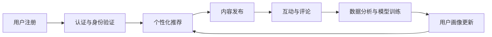

                 

# 数字化宠物社交创业：宠物主人的在线社区

## 1. 背景介绍

随着互联网的普及和社交媒体的兴起，数字化社交已经深入到人们生活的方方面面。近年来，随着家庭宠物数量激增，宠物社交需求迅速升温，许多新兴的宠物社交应用应运而生。这些应用不仅满足了宠物主人分享生活点滴的需求，还提供了宠物间的互动交流渠道，使得宠物社交成为了一个新兴的、极具潜力的市场。

本文将探讨基于数字化技术开发的宠物社交应用，旨在为宠物主人提供一个安全、便捷、有趣的互动平台。通过数据分析、机器学习和用户行为研究，我们将深入分析该应用的核心算法和技术实现，为数字化宠物社交创业提供全面的技术支持。

## 2. 核心概念与联系

### 2.1 核心概念概述

为更好地理解数字化宠物社交创业的技术框架，本节将介绍几个密切相关的核心概念：

- **数字化社交平台**：指利用互联网技术搭建的社交网络平台，用户可以通过文字、图片、视频等形式分享和互动。
- **宠物社交应用**：专指以宠物为主题，允许宠物主人分享宠物生活、交流养宠心得的社交应用。
- **数据科学**：包括数据挖掘、机器学习、统计分析等方法，用于从大量数据中提取有用信息。
- **推荐系统**：通过分析用户行为数据，为用户推荐相关内容或商品的算法系统。
- **实时互动技术**：指通过视频、音频、聊天等技术实现用户之间的实时互动。
- **用户画像构建**：通过分析用户历史数据，建立用户特征模型，用于个性化推荐和精准营销。

这些概念构成了数字化宠物社交创业的基础框架，相互之间通过数据流和用户行为进行紧密联系。

### 2.2 核心概念原理和架构的 Mermaid 流程图



此图展示了数字化宠物社交平台的核心架构流程，各模块通过数据流动进行交互。

## 3. 核心算法原理 & 具体操作步骤

### 3.1 算法原理概述

数字化宠物社交应用的核心算法包括个性化推荐、用户画像构建、实时互动等。下面将分别介绍这些算法的原理和具体操作步骤。

### 3.2 算法步骤详解

#### 3.2.1 个性化推荐

个性化推荐算法根据用户的历史行为数据，为用户推荐感兴趣的宠物内容，例如宠物图片、宠物视频、宠物知识等。推荐系统的关键在于如何构建用户兴趣模型，常用的方法包括协同过滤、基于内容的推荐、深度学习等。

##### 3.2.1.1 协同过滤

协同过滤算法通过分析用户的历史行为数据，找到具有相似兴趣的用户，从而为用户推荐他们喜欢的内容。协同过滤包括基于用户的协同过滤和基于物品的协同过滤。

##### 3.2.1.2 基于内容的推荐

基于内容的推荐算法通过分析物品的属性特征，寻找与目标物品相似的物品进行推荐。常见的属性特征包括物品的描述、标签、类别等。

##### 3.2.1.3 深度学习

深度学习算法通过构建多层神经网络模型，从用户行为数据中提取特征，进行高质量的推荐。例如，可以采用自编码器、卷积神经网络(CNN)、循环神经网络(RNN)等深度学习模型。

#### 3.2.2 用户画像构建

用户画像构建算法通过分析用户的历史行为数据，构建用户兴趣模型，用于个性化推荐和精准营销。常用的方法包括聚类分析、决策树、随机森林等。

##### 3.2.2.1 聚类分析

聚类分析算法通过将用户分为不同的兴趣群体，构建用户兴趣模型。常用的聚类算法包括K-means、DBSCAN等。

##### 3.2.2.2 决策树与随机森林

决策树与随机森林算法通过构建决策树模型或随机森林模型，预测用户对物品的兴趣，构建用户画像。

#### 3.2.3 实时互动

实时互动技术通过视频、音频、聊天等技术实现用户之间的互动交流。常用的技术包括WebRTC、FLV、RTMP等。

##### 3.2.3.1 WebRTC

WebRTC是一种实时通信技术，支持浏览器内的点对点通信，实现高质量的实时视频通话。

##### 3.2.3.2 FLV与RTMP

FLV和RTMP是流媒体技术，用于实现视频直播和点播。

### 3.3 算法优缺点

#### 3.3.1 个性化推荐

个性化推荐的优点在于能够提高用户体验，增加用户黏性。但缺点在于对数据的依赖性强，且容易出现信息过载。

#### 3.3.2 用户画像构建

用户画像构建的优点在于能够精准营销，提高转化率。但缺点在于模型的复杂度高，需要大量的标注数据。

#### 3.3.3 实时互动

实时互动的优点在于能够增强用户体验，增加社交互动性。但缺点在于对网络带宽和设备要求较高，容易产生延迟。

### 3.4 算法应用领域

个性化推荐算法广泛应用于电商、新闻、视频等领域，通过分析用户行为数据，推荐用户感兴趣的内容。用户画像构建算法用于个性化推荐、精准营销等场景，提升用户满意度。实时互动技术广泛应用于社交、视频直播等场景，增强用户互动体验。

## 4. 数学模型和公式 & 详细讲解 & 举例说明

### 4.1 数学模型构建

推荐系统通常使用矩阵分解模型来表示用户和物品之间的关系。设用户集合为 $U$，物品集合为 $I$，用户对物品的评分矩阵为 $R$。矩阵分解模型的目标是找到两个低维向量矩阵 $P$ 和 $Q$，使得 $PQ^T$ 近似于 $R$。

设 $P \in \mathbb{R}^{n \times k}, Q \in \mathbb{R}^{m \times k}$，其中 $n$ 是用户数，$m$ 是物品数，$k$ 是向量维度。推荐模型可以表示为：

$$ R \approx PQ^T $$

### 4.2 公式推导过程

基于矩阵分解模型的推荐算法步骤如下：

1. 对评分矩阵 $R$ 进行奇异值分解(SVD)：
$$ R = U \Sigma V^T $$

2. 令 $P = U \Sigma^{1/2}$，$Q = V \Sigma^{1/2}$。

3. 对 $P$ 和 $Q$ 进行梯度下降训练，使得 $PQ^T$ 尽可能接近 $R$。

4. 对用户 $u$ 的推荐物品 $i$ 的评分预测为：
$$ \hat{r}_{ui} = \sum_{k=1}^k p_{uk}q_{ki} $$

### 4.3 案例分析与讲解

以电商推荐系统为例，使用基于矩阵分解的协同过滤算法。设用户集合为 $U = \{1, 2, ..., n\}$，物品集合为 $I = \{1, 2, ..., m\}$，评分矩阵为 $R \in \mathbb{R}^{n \times m}$。设用户 $u$ 对物品 $i$ 的评分如下：

$$ R_{ui} = \left\{ 
\begin{array}{ll}
5 & \text{if user $u$ purchases item $i$} \\
0 & \text{if user $u$ does not purchase item $i$} \\
\end{array} \right.$$

假设 $R$ 进行奇异值分解后得到三个特征向量 $u_1, u_2, u_3$ 和三个奇异值 $s_1, s_2, s_3$。令 $P = \sqrt{s_1}u_1, Q = \sqrt{s_2}u_2$。假设用户 $u$ 对物品 $i$ 的评分预测如下：

$$ \hat{r}_{ui} = p_{u1}q_{i1} + p_{u2}q_{i2} $$

其中 $p_{u1}, p_{u2}$ 是用户向量 $P$ 中用户 $u$ 对应的前两个特征向量，$q_{i1}, q_{i2}$ 是物品向量 $Q$ 中物品 $i$ 对应的前两个特征向量。

## 5. 项目实践：代码实例和详细解释说明

### 5.1 开发环境搭建

在进行项目开发前，我们需要准备好开发环境。以下是使用Python进行Flask开发的环境配置流程：

1. 安装Anaconda：从官网下载并安装Anaconda，用于创建独立的Python环境。

2. 创建并激活虚拟环境：
```bash
conda create -n flask-env python=3.8 
conda activate flask-env
```

3. 安装Flask：
```bash
pip install flask
```

4. 安装SQLAlchemy：
```bash
pip install sqlalchemy
```

5. 安装WTForms：
```bash
pip install wtforms
```

6. 安装Flask-WTF：
```bash
pip install flask-wtf
```

完成上述步骤后，即可在`flask-env`环境中开始项目开发。

### 5.2 源代码详细实现

下面是使用Flask框架开发宠物社交应用的示例代码：

```python
from flask import Flask, render_template, request
from flask_sqlalchemy import SQLAlchemy
from wtforms import Form, StringField, PasswordField, SubmitField
from wtforms.validators import DataRequired, Email, EqualTo
from flask_wtf import FlaskForm
from flask_login import LoginManager, login_user, logout_user, login_required

app = Flask(__name__)
app.config['SECRET_KEY'] = 'your_secret_key'
app.config['SQLALCHEMY_DATABASE_URI'] = 'sqlite:////tmp/test.db'

db = SQLAlchemy(app)
login_manager = LoginManager(app)

class User(db.Model):
    id = db.Column(db.Integer, primary_key=True)
    username = db.Column(db.String(80), unique=True, nullable=False)
    email = db.Column(db.String(120), unique=True, nullable=False)
    password = db.Column(db.String(120), nullable=False)

    def __repr__(self):
        return '<User %r>' % self.username

@login_manager.user_loader
def load_user(user_id):
    return User.query.get(int(user_id))

class LoginForm(FlaskForm):
    username = StringField('Username', validators=[DataRequired()])
    password = PasswordField('Password', validators=[DataRequired()])
    submit = SubmitField('Log In')

@app.route('/')
def index():
    return render_template('index.html')

@app.route('/login', methods=['GET', 'POST'])
def login():
    form = LoginForm()
    if form.validate_on_submit():
        user = User.query.filter_by(username=form.username.data).first()
        if user and user.password == form.password.data:
            login_user(user)
            return redirect('/dashboard')
        else:
            flash('Invalid Credentials')
            return redirect('/login')
    return render_template('login.html', form=form)

@app.route('/logout')
@login_required
def logout():
    logout_user()
    return redirect('/')

@app.route('/dashboard')
@login_required
def dashboard():
    return render_template('dashboard.html')

if __name__ == '__main__':
    app.run(debug=True)
```

### 5.3 代码解读与分析

上面的代码展示了使用Flask框架开发宠物社交应用的简单实现。主要功能包括用户注册、登录、logout和Dashboard页面。

1. **用户模型**：使用SQLAlchemy定义了一个简单的用户模型，包含用户名、邮箱和密码。

2. **表单处理**：使用WTForms定义了一个登录表单，包括用户名和密码字段，以及一个提交按钮。

3. **路由定义**：使用Flask定义了index、login、logout和dashboard等路由，分别对应首页、登录页面、注销页面和仪表盘页面。

4. **用户认证**：使用Flask-Login库实现了用户认证，通过验证用户名和密码进行登录，并保存用户会话信息。

### 5.4 运行结果展示

执行上述代码后，可以在浏览器中访问http://localhost:5000/，看到宠物社交应用的主页。用户可以注册、登录、访问Dashboard页面等。

## 6. 实际应用场景

### 6.1 宠物主人的在线社区

宠物主人的在线社区是数字化宠物社交应用的核心场景。用户可以在平台上发布宠物照片、视频、故事，分享养宠心得，与其他宠物主人互动交流。

1. **用户注册与登录**：用户注册后可以设置个人资料，包括宠物信息、照片等。登录后可以查看自己的帖子、评论、私信等。

2. **内容发布**：用户可以发布图片、视频、文字等内容，分享宠物生活的点滴。

3. **互动与评论**：用户可以对其他用户的帖子进行点赞、评论、私信等互动，建立社交网络。

4. **个性化推荐**：根据用户的历史行为数据，为用户推荐相关宠物内容。

5. **数据分析与模型训练**：通过分析用户行为数据，构建用户兴趣模型，进行个性化推荐和精准营销。

### 6.2 在线宠物医生咨询

在线宠物医生咨询是数字化宠物社交应用的另一重要场景。用户可以通过在线咨询功能，与宠物医生进行实时互动，获得专业医疗建议。

1. **用户注册与登录**：用户注册后可以设置个人资料，包括宠物信息、照片等。登录后可以查看自己的咨询记录、预约医生等。

2. **在线咨询**：用户可以通过文字、图片、视频等形式向宠物医生咨询，医生可以实时回答问题，并提供专业建议。

3. **医疗记录管理**：用户可以记录宠物的病历、体检报告等医疗记录，方便医生查看和参考。

4. **个性化推荐**：根据用户的咨询历史和医疗记录，为用户推荐相关的宠物医生和医疗知识。

### 6.3 宠物用品推荐

宠物用品推荐是数字化宠物社交应用的商业化场景。用户可以在平台上购买宠物用品，享受个性化的推荐服务。

1. **用户注册与登录**：用户注册后可以设置个人资料，包括宠物信息、照片等。登录后可以查看自己的订单、购物车、推荐商品等。

2. **商品浏览与购买**：用户可以在平台上浏览宠物用品，查看商品介绍、价格、用户评价等。

3. **个性化推荐**：根据用户的浏览和购买历史，为用户推荐相关的宠物用品。

4. **在线客服**：用户可以通过在线客服咨询商品信息、购买问题等。

## 7. 工具和资源推荐

### 7.1 学习资源推荐

为了帮助开发者系统掌握数字化宠物社交应用的开发技术，这里推荐一些优质的学习资源：

1. **Flask官方文档**：Flask框架的官方文档，提供了详细的开发指南、API文档和示例代码。

2. **SQLAlchemy官方文档**：SQLAlchemy库的官方文档，提供了数据库操作的API文档和示例代码。

3. **WTForms官方文档**：WTForms库的官方文档，提供了表单验证和数据处理的API文档和示例代码。

4. **Flask-Login官方文档**：Flask-Login库的官方文档，提供了用户认证的API文档和示例代码。

5. **《Flask Web Development》书籍**：一本全面介绍Flask框架的书籍，适合Flask初学者和进阶开发者。

### 7.2 开发工具推荐

高效的开发离不开优秀的工具支持。以下是几款用于数字化宠物社交应用开发的常用工具：

1. **Visual Studio Code**：一款轻量级、功能强大的代码编辑器，支持多种语言和框架。

2. **Git**：版本控制工具，用于管理项目代码和协作开发。

3. **Jupyter Notebook**：一款交互式笔记本工具，适合数据分析和机器学习开发。

4. **Docker**：容器化技术，用于打包应用、管理依赖、部署环境等。

### 7.3 相关论文推荐

数字化宠物社交应用的研究涉及多个学科，包括计算机科学、人工智能、心理学等。以下是几篇相关领域的经典论文，推荐阅读：

1. **A Survey on Data Mining Techniques for Online Communities**：介绍了数据挖掘在社交网络中的应用，包括用户画像构建、个性化推荐等。

2. **A Survey on Online Social Network Data Mining**：综述了社交网络中的数据挖掘技术，包括社区发现、情感分析、用户行为预测等。

3. **Recommender Systems in Social Networks**：介绍了社交网络中的推荐系统，包括协同过滤、内容推荐、混合推荐等。

4. **An Empirical Study of How People Interact on Social Networking Websites**：通过对社交网络用户行为的研究，提出了用户行为模式和社交关系建模的方法。

5. **Social Media Analysis and Mining**：综述了社交媒体数据挖掘和分析技术，包括情感分析、话题建模、事件检测等。

这些论文代表了大数据社交网络研究的最新进展，通过学习这些前沿成果，可以帮助研究者掌握数字化宠物社交应用的开发技术。

## 8. 总结：未来发展趋势与挑战

### 8.1 研究成果总结

本文对数字化宠物社交创业的技术框架进行了全面系统的介绍。首先阐述了数字化社交平台的核心概念和应用场景，明确了个性化推荐、用户画像构建、实时互动等算法的原理和操作步骤。通过数学模型和公式推导，展示了基于矩阵分解的协同过滤算法。通过代码实例和详细解释说明，展示了使用Flask框架开发宠物社交应用的过程。通过实际应用场景和未来应用展望，展示了数字化宠物社交应用的广泛应用前景。

### 8.2 未来发展趋势

展望未来，数字化宠物社交应用将呈现以下几个发展趋势：

1. **个性化推荐算法**：随着数据量的增加和模型技术的进步，个性化推荐算法将更加精准和高效。基于深度学习的推荐系统将逐渐取代传统协同过滤算法。

2. **用户画像构建**：用户画像构建算法将更加复杂和多样。聚类分析、决策树、随机森林等算法将被广泛应用，构建更全面的用户特征模型。

3. **实时互动技术**：实时互动技术将进一步提升用户体验。WebRTC、FLV、RTMP等流媒体技术将得到更广泛的应用，支持高质量的实时视频通话和直播。

4. **情感分析与话题建模**：情感分析与话题建模技术将广泛应用于社交网络中，用于分析和理解用户情感和讨论话题。

5. **隐私保护与安全**：数字化宠物社交应用将更加注重用户隐私和数据安全。区块链、加密技术等安全技术将得到广泛应用。

### 8.3 面临的挑战

尽管数字化宠物社交应用已经取得了显著进展，但在迈向更加智能化、普适化应用的过程中，它仍面临诸多挑战：

1. **数据隐私与安全**：用户数据的隐私保护和安全问题将成为数字化宠物社交应用的瓶颈。如何确保用户数据的安全，防止数据泄露和滥用，是一个重要挑战。

2. **技术瓶颈**：当前的数据处理和分析技术还无法完全满足用户需求。如何优化算法和提高计算效率，是一个亟待解决的问题。

3. **用户体验**：用户界面和互动体验还有很大的提升空间。如何设计更加友好、易用的界面，提升用户体验，是一个重要挑战。

4. **内容监管**：宠物社交应用的内容监管是一个重要问题。如何防止低俗内容、虚假信息等不良内容传播，是一个重要挑战。

### 8.4 研究展望

面向未来，数字化宠物社交应用的研究需要在以下几个方面寻求新的突破：

1. **数据隐私与安全技术**：研究如何保护用户数据的隐私和安全，防止数据泄露和滥用。

2. **高效计算与优化算法**：研究如何优化算法和提高计算效率，提升用户体验和应用性能。

3. **智能推荐与个性化服务**：研究如何构建更全面、精准的用户画像，提升个性化推荐和服务的质量。

4. **情感分析与情感管理**：研究如何通过情感分析技术，理解和应对用户情感变化，提升用户体验。

5. **社区管理与内容监管**：研究如何构建智能社区管理平台，实现对内容的有效监管和治理。

这些研究方向的探索，必将引领数字化宠物社交应用的进一步发展，为宠物主人提供更加安全、便捷、有趣的互动平台。只有不断创新和优化，才能真正实现数字化宠物社交应用的商业化和普及。

## 9. 附录：常见问题与解答

**Q1: 如何保护用户数据隐私与安全？**

A: 数字化宠物社交应用需要严格遵守数据隐私与安全的相关法律法规，如GDPR等。可以通过以下措施保护用户数据隐私与安全：

1. 数据加密：使用数据加密技术，保护用户数据在传输和存储过程中的安全。

2. 访问控制：设置严格的访问控制权限，确保只有授权用户才能访问敏感数据。

3. 匿名化处理：对用户数据进行匿名化处理，防止数据泄露和滥用。

4. 数据审计：定期审计数据访问和使用情况，及时发现和处理潜在的安全问题。

**Q2: 如何优化算法和提高计算效率？**

A: 优化算法和提高计算效率是数字化宠物社交应用的重要研究方向。以下是一些常见的优化措施：

1. 算法优化：通过改进算法设计和算法结构，减少计算复杂度，提高算法效率。

2. 分布式计算：使用分布式计算技术，将计算任务分配到多台机器上，提升计算效率。

3. 数据压缩：对数据进行压缩和优化，减少数据存储和传输的带宽和空间占用。

4. 缓存机制：使用缓存机制，将常用的数据和计算结果存储在缓存中，减少重复计算。

5. 硬件加速：使用GPU、TPU等硬件加速设备，提升计算效率。

**Q3: 如何设计友好的用户界面和互动体验？**

A: 友好的用户界面和互动体验是数字化宠物社交应用的重要因素。以下是一些常见的设计原则：

1. 简洁明了：设计简洁、易用的用户界面，避免复杂的操作和功能。

2. 高互动性：提供丰富的互动功能，如实时聊天、视频通话等，增强用户互动体验。

3. 个性化推荐：根据用户历史行为和偏好，提供个性化的推荐内容，提升用户体验。

4. 用户反馈：收集用户反馈，及时优化和改进界面设计和互动体验。

5. 易用性测试：进行易用性测试，发现和解决界面和互动中的问题。

**Q4: 如何防止低俗内容、虚假信息等不良内容传播？**

A: 防止低俗内容、虚假信息等不良内容传播是数字化宠物社交应用的重要任务。以下是一些常见的措施：

1. 内容审核：建立内容审核机制，对发布内容进行审核和筛选，防止低俗和虚假信息传播。

2. 用户举报：提供用户举报机制，及时发现和处理不良内容。

3. 算法过滤：使用算法技术，如文本分类、情感分析等，自动检测和过滤不良内容。

4. 社区管理：建立社区管理团队，负责社区内容监管和维护，及时处理不良内容。

5. 法律法规遵守：严格遵守相关法律法规，防止不良内容传播。

**Q5: 如何提升个性化推荐和服务的质量？**

A: 提升个性化推荐和服务的质量是数字化宠物社交应用的重要目标。以下是一些常见的方法：

1. 用户画像构建：构建更全面、精准的用户画像，提升个性化推荐和服务的效果。

2. 协同过滤算法：使用协同过滤算法，根据用户历史行为和兴趣，推荐相关内容。

3. 深度学习算法：使用深度学习算法，提升推荐系统的精度和效果。

4. 实时学习与更新：使用实时学习技术，根据用户最新行为和反馈，动态更新推荐模型。

5. 多模态融合：融合多种数据类型，如文本、图片、视频等，提升推荐系统的效果。

这些措施可以提升数字化宠物社交应用的个性化推荐和服务的质量，增强用户体验和满意度。

---

作者：禅与计算机程序设计艺术 / Zen and the Art of Computer Programming

