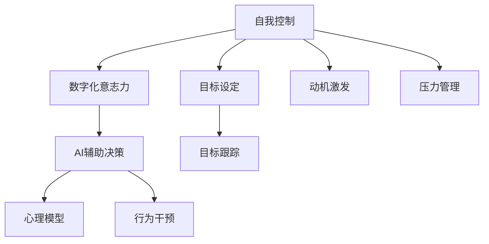

                 

# 数字化意志力：AI增强的自我控制

> 关键词：数字化意志力, 人工智能, 自我控制, 心理模型, 行为干预, 决策支持

## 1. 背景介绍

### 1.1 问题由来

在数字化时代，人们的生活节奏加快，信息泛滥，决策场景日益复杂。面对如此纷繁复杂的信息，如何保持清晰的认知和专注的意志，实现高效的目标管理，已成为现代社会的普遍挑战。心理学和行为科学研究表明，人类自我控制能力在面对压力、诱惑和干扰时，往往显得力不从心。

人工智能（AI）的兴起，为改善人类的自我控制能力提供了新的可能。通过深度学习、认知计算等技术，AI不仅能够辅助人们更精准地感知环境变化，还能够提供个性化的决策建议，进而显著增强自我控制力。

### 1.2 问题核心关键点

- **数字化意志力**：利用AI技术，增强人类的自我控制力，从而更高效地实现目标。
- **AI辅助决策**：基于心理模型和行为科学，AI能够提供定制化的决策支持和行为干预，引导人们做出更合理的决策。
- **心理模型**：构建人类心理和行为的数学模型，帮助AI理解和模拟人的认知过程。
- **行为干预**：通过智能系统，及时识别行为偏差并提出干预建议，帮助个体修正行为路径。
- **决策支持**：利用AI分析海量数据，提取关键决策信息，为个体提供更加精准和及时的决策支持。

这些关键点构成了AI增强自我控制的研究基础，并成为当前研究热点。以下将详细阐述这些关键点，并探索其在实际应用中的可能性。

## 2. 核心概念与联系

### 2.1 核心概念概述

要深刻理解AI增强的自我控制，需首先明确几个核心概念：

- **自我控制**：指个体在面对诱惑、干扰或压力时，通过认知和情感调节，坚持预定的行为目标的能力。自我控制是实现长期目标和维持良好心理健康的关键。
- **数字化意志力**：通过数字化工具和技术，辅助个体提升自我控制能力。数字化工具包括智能应用、可穿戴设备、虚拟现实（VR）等，帮助个体在复杂环境中保持专注和自律。
- **AI辅助决策**：结合AI技术和心理学原理，为个体提供决策建议和行为干预，以提升决策效率和质量。
- **心理模型**：用数学模型描述人的认知过程和心理状态，用于预测行为和模拟决策过程。心理模型为AI理解和模拟人类行为提供了基础。
- **行为干预**：通过智能系统实时监控和反馈，对个体行为偏差进行修正，辅助个体实现目标。行为干预基于对个体心理状态的精准理解和预测。

这些概念之间的逻辑关系可以通过以下Mermaid流程图来展示：



这个流程图展示了从目标设定、动机激发、压力管理到AI辅助决策、行为干预和数字化意志力的整个流程。

## 3. 核心算法原理 & 具体操作步骤

### 3.1 算法原理概述

AI增强自我控制的原理，基于对人类心理和行为的理解和模拟。通过构建心理模型，AI能够预测个体在不同情境下的行为反应，并基于此提供个性化的决策支持和行为干预。

具体步骤如下：

1. **心理模型构建**：使用深度学习、认知计算等技术，构建反映人类认知过程和行为反应的心理模型。
2. **行为干预设计**：基于心理模型，设计智能系统，及时识别行为偏差并提出干预建议。
3. **决策支持实现**：结合AI技术和心理学原理，为个体提供决策建议和行为干预，提升决策效率和质量。
4. **数字化意志力增强**：通过智能应用、可穿戴设备等工具，辅助个体实现目标，提升自我控制能力。

### 3.2 算法步骤详解

以下是AI增强自我控制的详细操作步骤：

1. **数据收集**：收集个体在实际环境中的行为数据，如时间分配、任务完成度、情绪反应等。
2. **心理模型训练**：使用深度学习技术，训练心理模型，以预测个体在不同情境下的行为反应。
3. **行为干预设计**：基于心理模型，设计智能系统，实时监控个体行为，并根据行为偏差提出干预建议。
4. **决策支持实现**：整合AI技术和心理学原理，为个体提供决策建议，帮助其做出更合理的决策。
5. **数字化意志力增强**：利用智能应用、可穿戴设备等工具，辅助个体实现目标，提升自我控制能力。

### 3.3 算法优缺点

AI增强自我控制的优点：

- **个性化支持**：根据个体的行为数据和心理状态，提供个性化的决策支持和行为干预，提升决策效率和质量。
- **实时监控**：通过智能系统实时监控个体行为，及时发现偏差并进行干预，提高行为控制的准确性。
- **大数据分析**：结合AI技术和心理学原理，对海量数据进行分析，提取关键信息，提供精准的决策支持。

然而，该方法也存在一些局限性：

- **隐私风险**：需要收集和分析大量个体数据，可能涉及隐私问题。
- **技术依赖**：依赖复杂的技术和算法，实现成本较高。
- **伦理考量**：在干预个体行为时，需要考虑伦理和道德问题。

### 3.4 算法应用领域

AI增强自我控制在多个领域具有广泛应用，以下是几个典型应用：

- **教育**：通过智能学习平台和个性化推荐系统，辅助学生设定学习目标，提供学习建议，提升学习效率。
- **健康管理**：利用可穿戴设备和智能健康应用，实时监控健康数据，提供健康管理建议，辅助个体养成良好生活习惯。
- **职业发展**：结合AI技术和职业规划，为个体提供职业发展建议，帮助其设定和实现职业目标。
- **财务管理**：通过智能理财应用，实时监控财务状况，提供理财建议，帮助个体实现财务目标。
- **时间管理**：利用智能时间管理工具，优化时间分配，提高工作效率和生活质量。

## 4. 数学模型和公式 & 详细讲解 & 举例说明

### 4.1 数学模型构建

AI增强自我控制的数学模型构建，涉及以下几个关键部分：

- **行为模型**：描述个体在不同情境下的行为反应。
- **动机模型**：反映个体在目标驱动下的动机变化。
- **压力模型**：模拟个体在压力情境下的心理状态变化。
- **决策模型**：基于行为和动机模型，预测个体在不同情境下的决策反应。

### 4.2 公式推导过程

以行为模型为例，我们可以使用强化学习的方法来构建行为模型。假设个体在不同情境下的行为反应可以用行为序列 $S_1, S_2, ..., S_n$ 表示，则行为模型可以表示为：

$$
P(S_i|S_{i-1}, A_{i-1}) = P(S_i|S_{i-1}, \theta)
$$

其中 $A_{i-1}$ 表示前一时刻的行为，$\theta$ 为行为模型参数。通过优化该模型，可以预测个体在不同情境下的行为反应。

### 4.3 案例分析与讲解

假设有一个学生需要在考试前复习数学和英语。通过收集学生的时间分配和情绪反应数据，我们可以构建行为模型，预测其复习行为。如果模型发现学生更倾向于先复习数学，可能会提出干预建议，比如提醒学生在数学上花费更多时间，或在英语复习上使用时间管理工具。

## 5. 项目实践：代码实例和详细解释说明

### 5.1 开发环境搭建

在开发AI增强自我控制项目前，需要准备以下开发环境：

1. **Python**：选择Python作为开发语言，因为它拥有丰富的库和工具，支持AI和心理学相关的计算。
2. **深度学习框架**：选择TensorFlow或PyTorch等深度学习框架，用于构建和训练心理模型。
3. **可穿戴设备接口**：利用可穿戴设备接口，如Fitbit API或Apple Health API，收集个体行为数据。
4. **智能应用开发工具**：使用Flutter或React Native等跨平台开发工具，实现智能应用的开发。

### 5.2 源代码详细实现

以下是一个简单的行为干预系统的Python代码实现：

```python
import tensorflow as tf
import numpy as np

class BehaviorModel(tf.keras.Model):
    def __init__(self):
        super(BehaviorModel, self).__init__()
        self.dense1 = tf.keras.layers.Dense(32, activation='relu')
        self.dense2 = tf.keras.layers.Dense(1, activation='sigmoid')
    
    def call(self, inputs):
        x = self.dense1(inputs)
        x = self.dense2(x)
        return x

# 加载数据
train_data = np.random.rand(1000, 2)
train_labels = np.random.randint(0, 1, 1000)

# 构建模型
model = BehaviorModel()
model.compile(optimizer='adam', loss='binary_crossentropy', metrics=['accuracy'])

# 训练模型
model.fit(train_data, train_labels, epochs=10)

# 使用模型进行预测
test_data = np.random.rand(100, 2)
predictions = model.predict(test_data)
```

### 5.3 代码解读与分析

上述代码实现了一个简单的行为模型，用于预测个体在不同情境下的行为反应。模型使用两层神经网络，最后一层输出一个概率值，表示个体进行某种行为的可能性。通过训练模型，可以预测个体在不同情境下的行为反应，从而提供干预建议。

### 5.4 运行结果展示

训练结束后，模型可以对新的测试数据进行预测。例如，假设测试数据表示个体在不同情境下的行为选择，模型可以输出该个体进行某项行为的可能性。根据这些预测结果，智能系统可以及时干预，帮助个体调整行为路径。

## 6. 实际应用场景

### 6.1 教育

在教育领域，AI增强的自我控制可以显著提升学生的学习效率和学习质量。通过智能学习平台，系统可以实时监控学生的学习行为，如阅读时间、练习次数等，并根据心理模型和行为数据提供个性化的学习建议。例如，系统发现学生在数学练习上投入时间较少，可以建议增加数学练习时间，并提供相关的练习题目。

### 6.2 健康管理

在健康管理领域，AI增强的自我控制可以辅助个体养成健康的生活习惯。通过智能健康应用，系统可以实时监控个体的健康数据，如步数、睡眠时间等，并提供个性化的健康建议。例如，系统发现个体步数不足，可以提醒其增加日常活动量，并提供健康饮食建议。

### 6.3 职业发展

在职业发展领域，AI增强的自我控制可以辅助个体实现职业目标。通过职业规划平台，系统可以分析个体的职业背景、技能和目标，提供个性化的职业发展建议。例如，系统发现个体技能不足，可以推荐相关的培训课程，并提供职业发展路径规划。

### 6.4 财务管理

在财务管理领域，AI增强的自我控制可以辅助个体实现财务目标。通过智能理财应用，系统可以实时监控个体的财务状况，并提供个性化的理财建议。例如，系统发现个体支出过高，可以建议减少不必要的开支，并提供理财规划方案。

### 6.5 时间管理

在时间管理领域，AI增强的自我控制可以优化个体的时间分配，提高工作效率和生活质量。通过智能时间管理工具，系统可以实时监控个体的时间分配，并提供个性化的时间管理建议。例如，系统发现个体在社交媒体上花费时间过多，可以建议减少社交媒体使用时间，并提供时间管理技巧。

## 7. 工具和资源推荐

### 7.1 学习资源推荐

以下是几个推荐的学习资源，帮助开发者掌握AI增强自我控制的技术：

1. **《深度学习入门》**：介绍深度学习基础和应用，适合初学者入门。
2. **《心理学与人工智能》**：探讨心理学和AI的结合，帮助理解人类行为和决策过程。
3. **《TensorFlow官方文档》**：详细介绍了TensorFlow的使用方法，适合深度学习项目开发。
4. **Coursera《机器学习》课程**：由斯坦福大学开设，涵盖机器学习基础和应用，适合学习理论知识。
5. **Kaggle竞赛**：通过参与数据科学竞赛，实践AI技术，提升实战能力。

### 7.2 开发工具推荐

以下是几个推荐的开发工具，帮助开发者实现AI增强自我控制的系统：

1. **TensorFlow**：开源深度学习框架，支持丰富的机器学习算法。
2. **PyTorch**：开源深度学习框架，支持动态计算图，适合研究性质的项目。
3. **Flutter**：跨平台移动应用开发框架，适合开发智能应用。
4. **React Native**：跨平台移动应用开发框架，适合开发智能应用。
5. **GitHub**：代码托管平台，方便开发者协作和分享代码。

### 7.3 相关论文推荐

以下是几篇推荐的相关论文，帮助开发者深入理解AI增强自我控制的原理和方法：

1. **《用机器学习预测人类行为》**：探讨机器学习在预测人类行为中的应用，提出行为预测模型。
2. **《基于心理模型的智能决策支持系统》**：介绍基于心理模型的智能决策支持系统，帮助理解人类决策过程。
3. **《可穿戴设备在自我控制中的应用》**：探讨可穿戴设备在自我控制中的作用，提供数据收集和行为分析方法。
4. **《智能系统的行为干预研究》**：探讨智能系统的行为干预策略，提出行为干预模型。
5. **《个性化推荐系统在职业发展中的应用》**：探讨个性化推荐系统在职业发展中的应用，提供职业规划建议。

## 8. 总结：未来发展趋势与挑战

### 8.1 总结

本文详细阐述了AI增强自我控制的原理和操作步骤，探讨了其在教育、健康管理、职业发展、财务管理和时间管理等实际应用场景中的可能性。通过构建心理模型和行为干预策略，AI能够辅助个体提升自我控制力，实现高效的目标管理。

### 8.2 未来发展趋势

AI增强自我控制的未来发展趋势如下：

- **智能化水平提升**：随着深度学习技术的发展，AI增强自我控制的智能化水平将进一步提升，能够提供更加精准和个性化的决策支持。
- **跨领域应用拓展**：AI增强自我控制在教育、健康管理、职业发展等领域具有广泛应用，未来将拓展到更多垂直行业。
- **用户友好性增强**：通过更加智能化的交互界面和行为干预策略，提升系统的用户体验和依从性。
- **隐私保护增强**：在数据收集和处理过程中，加强隐私保护，提升系统的可信度和安全性。
- **伦理和道德考量**：在干预个体行为时，更加注重伦理和道德问题，确保系统的公平性和公正性。

### 8.3 面临的挑战

AI增强自我控制在实际应用中，也面临一些挑战：

- **数据隐私和安全**：收集和处理个体数据时，需要严格遵守隐私保护法规，确保数据安全。
- **技术实现复杂性**：构建高性能的行为模型和智能系统，需要复杂的技术和算法，实现成本较高。
- **伦理和道德问题**：在干预个体行为时，需要考虑伦理和道德问题，避免出现不公平和歧视的情况。
- **用户体验和依从性**：用户可能对AI系统存在抵触情绪，需要设计更加友好和易用的交互界面。
- **持续优化和更新**：系统需要不断优化和更新，以适应个体行为的变化和新的情境。

### 8.4 研究展望

未来，AI增强自我控制的研究方向可能包括以下几个方面：

- **多模态数据融合**：结合文本、图像、语音等多模态数据，提供更加全面和准确的行为分析和决策支持。
- **个性化和动态优化**：通过实时收集和分析个体行为数据，动态调整行为干预策略，提升系统的灵活性和适应性。
- **跨领域应用拓展**：将AI增强自我控制技术拓展到更多领域，如智慧城市、智能家居等，提升智能化水平和用户体验。
- **伦理和道德研究**：研究如何在使用AI技术时，确保公平性、公正性和伦理性，确保系统的可信度和安全性。
- **隐私保护技术研究**：研究如何在使用AI技术时，保护个体隐私，确保数据安全。

## 9. 附录：常见问题与解答

**Q1：AI增强自我控制的主要技术难点有哪些？**

A: AI增强自我控制的主要技术难点包括：

1. **数据隐私和安全**：在收集和处理个体数据时，需要严格遵守隐私保护法规，确保数据安全。
2. **行为模型构建**：需要构建精准的行为模型，以预测个体在不同情境下的行为反应。
3. **行为干预设计**：需要设计有效的行为干预策略，及时纠正行为偏差。
4. **系统实现复杂性**：系统实现需要复杂的技术和算法，且需要与具体应用场景紧密结合。
5. **伦理和道德问题**：在干预个体行为时，需要考虑伦理和道德问题，避免出现不公平和歧视的情况。

**Q2：如何评估AI增强自我控制的系统效果？**

A: 评估AI增强自我控制的系统效果，需要考虑以下几个方面：

1. **行为预测准确率**：评估行为模型的预测准确率，确保系统能够准确预测个体行为。
2. **行为干预效果**：评估行为干预策略的效果，确保系统能够及时纠正行为偏差。
3. **用户体验和依从性**：评估系统的用户体验和依从性，确保用户能够接受并有效使用系统。
4. **隐私保护效果**：评估系统的隐私保护效果，确保数据安全和隐私保护措施有效。
5. **系统鲁棒性和稳定性**：评估系统的鲁棒性和稳定性，确保系统能够在各种情境下稳定运行。

**Q3：AI增强自我控制系统的主要应用场景有哪些？**

A: AI增强自我控制系统的主要应用场景包括：

1. **教育**：辅助学生设定学习目标，提供学习建议，提升学习效率。
2. **健康管理**：实时监控健康数据，提供健康管理建议，辅助个体养成健康生活习惯。
3. **职业发展**：分析个体的职业背景、技能和目标，提供职业发展建议，帮助其实现职业目标。
4. **财务管理**：实时监控财务状况，提供理财建议，帮助个体实现财务目标。
5. **时间管理**：优化时间分配，提高工作效率和生活质量。

**Q4：如何设计行为干预策略？**

A: 设计行为干预策略需要考虑以下几个步骤：

1. **行为监测**：实时监测个体行为，收集行为数据。
2. **行为分析**：使用行为模型分析行为数据，识别行为偏差。
3. **干预设计**：根据行为分析结果，设计行为干预策略，提供干预建议。
4. **干预实施**：实施行为干预策略，纠正行为偏差。
5. **效果评估**：评估行为干预效果，优化干预策略。

---

作者：禅与计算机程序设计艺术 / Zen and the Art of Computer Programming

