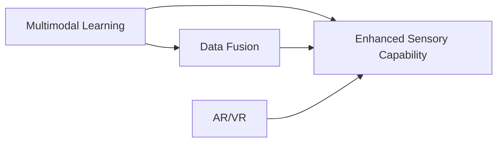
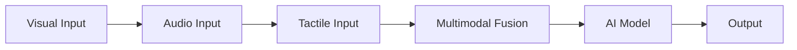
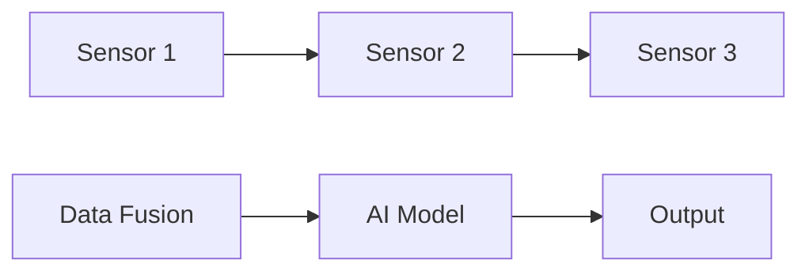

                 

# 数字化感知扩展：AI创造的新感官维度

> 关键词：数字化感知, 人工智能, 感官维度, 多模态学习, 数据融合, 增强现实, 虚拟现实

## 1. 背景介绍

### 1.1 问题由来
在人类历史的长河中，我们的感知系统主要依赖于视觉、听觉、触觉等传统的感官维度。然而，随着科技的进步，特别是人工智能技术的发展，人类感知系统的维度正在被扩展，数字化感知应运而生。这种全新的感知方式，利用AI技术赋予计算机以更强大的感知能力，使其能够模拟和扩展人类感官的功能，从而开启了一场数字化的感官革命。

数字化感知的概念最早由神经科学家和人工智能专家提出，其核心思想是借助计算机科学和数据科学的工具，将传感器数据、模型和算法相结合，创造出具有人类感官功能的新型系统。这种系统不仅能够处理和分析传统感官数据，还能利用计算机特有的优势，如强大的计算能力和庞大的数据处理能力，对各种信号进行更深入的理解和处理。

### 1.2 问题核心关键点
数字化感知的核心关键点在于如何将传统感官数据的信号转化为计算机能够理解和处理的形式，并在此基础上实现超越人类感官的扩展和增强。数字化感知系统的构建涉及以下几个方面：
- **传感器数据获取**：获取高分辨率的视觉、听觉、触觉等传感器数据。
- **数据预处理**：对传感器数据进行滤波、归一化、特征提取等预处理操作，提升数据的可用性和可靠性。
- **模型选择和训练**：选择合适的AI模型，通过数据进行训练，实现对信号的解读和理解。
- **数据融合**：将不同传感器收集的数据进行融合，提升系统的感知能力和鲁棒性。
- **增强现实和虚拟现实**：通过虚拟和现实环境的交互，增强用户的感官体验。

数字化感知的实现需要跨学科的合作，涵盖计算机科学、数据科学、神经科学、心理学等多个领域。本文将重点探讨数字化感知的算法原理与具体操作步骤，以及其在多模态学习、数据融合、增强现实、虚拟现实等应用场景中的应用和未来发展趋势。

## 2. 核心概念与联系

### 2.1 核心概念概述

数字化感知的核心概念包括：

- **多模态学习(Multimodal Learning)**：指同时利用视觉、听觉、触觉等多模态数据进行学习，提升系统的感知能力和泛化性能。
- **数据融合(Data Fusion)**：将不同传感器收集的数据进行整合，提高数据的一致性和准确性。
- **增强现实(Augmented Reality, AR)**：通过虚拟信息叠加在现实世界中，提升用户的感知和互动体验。
- **虚拟现实(Virtual Reality, VR)**：通过模拟一个完全沉浸式的虚拟环境，让用户沉浸在虚拟世界中。

这些概念之间存在密切的联系，多模态学习和数据融合是提升感知能力的基础，增强现实和虚拟现实则是数字化感知的具体应用场景。以下将通过一个Mermaid流程图展示这些概念的联系：



从图中可以看出，多模态学习和数据融合是提升感知能力的基础步骤，通过增强现实和虚拟现实，这些能力得以在实际应用中得到体现。

### 2.2 核心概念原理和架构

#### 2.2.1 多模态学习

多模态学习的核心原理在于利用不同感官的信号，共同构建出一个更丰富的感知空间。其架构如图：



其中，A、B、C代表视觉、听觉、触觉等不同感官的输入，D表示多模态融合模块，将不同感官的数据进行整合，E表示AI模型，根据融合后的数据进行学习和推理，F表示系统的输出，可以是决策、控制信号等。

#### 2.2.2 数据融合

数据融合的原理是将不同传感器收集的数据进行整合，形成一个一致的、准确的感知模型。其架构如图：



A、B、C表示不同传感器收集的数据，D表示数据融合模块，将数据进行整合和校正，E表示AI模型，根据融合后的数据进行学习和推理，F表示系统的输出。

#### 2.2.3 增强现实和虚拟现实

增强现实和虚拟现实的原理是通过计算机图形和传感器数据，在现实或虚拟环境中创建沉浸式体验。其架构如图：


A表示现实或虚拟环境，B表示传感器数据，C表示AI模型，用于处理和解释传感器数据，D表示虚拟元素，根据AI模型生成并叠加在现实环境中，E表示用户交互。

### 2.3 核心概念联系

以上三个核心概念之间存在紧密的联系。多模态学习通过利用不同感官的数据，为数据融合提供了更丰富的输入，而数据融合的结果又能提升多模态学习的准确性和鲁棒性。增强现实和虚拟现实则是在这些感知能力的基础上，进一步扩展人类的感知空间，提供更加沉浸式和互动式的体验。

## 3. 核心算法原理 & 具体操作步骤

### 3.1 算法原理概述

数字化感知系统的核心算法原理主要包括多模态学习、数据融合和增强现实/虚拟现实交互三个方面。下面将详细介绍每个方面的算法原理。

#### 3.1.1 多模态学习

多模态学习的核心算法包括特征提取、模型选择和训练、特征融合等步骤。

1. **特征提取**：
   - 将不同感官的数据进行预处理，提取关键特征。
   - 使用卷积神经网络(CNN)、循环神经网络(RNN)等模型进行特征提取。

2. **模型选择和训练**：
   - 选择合适的模型，如深度神经网络(DNN)、卷积神经网络(CNN)、循环神经网络(RNN)等。
   - 通过监督学习或无监督学习的方式进行模型训练。

3. **特征融合**：
   - 使用加权平均、最大值融合、加法融合等方法将不同感官的特征进行融合。
   - 使用注意力机制、空间转换等方法提升融合效果。

#### 3.1.2 数据融合

数据融合的算法包括加权平均、加法融合、最大值融合、最小值融合等方法。这些方法通过赋予不同传感器数据不同的权重，将其进行融合，形成一个更准确、更一致的感知模型。

#### 3.1.3 增强现实/虚拟现实交互

增强现实/虚拟现实的交互算法包括图像识别、深度学习、计算机图形学等。

1. **图像识别**：
   - 使用深度学习模型，如卷积神经网络(CNN)、注意力机制等进行图像识别。
   - 对识别的结果进行后处理，提升准确性和鲁棒性。

2. **深度学习**：
   - 使用深度神经网络(DNN)、卷积神经网络(CNN)、循环神经网络(RNN)等模型进行学习。
   - 通过监督学习或无监督学习的方式进行训练。

3. **计算机图形学**：
   - 使用图形渲染技术，将虚拟元素叠加在现实环境中。
   - 使用立体视觉、光场渲染等技术提升视觉效果。

### 3.2 算法步骤详解

数字化感知系统的算法步骤包括传感器数据获取、预处理、多模态学习、数据融合和增强现实/虚拟现实交互等步骤。下面详细介绍每个步骤的具体操作。

#### 3.2.1 传感器数据获取

1. **视觉传感器数据获取**：
   - 使用摄像头捕捉高分辨率的图像数据。
   - 使用图像处理技术，如边缘检测、颜色校正、去噪等进行预处理。

2. **听觉传感器数据获取**：
   - 使用麦克风捕捉音频数据。
   - 使用音频处理技术，如滤波、降噪、特征提取等进行预处理。

3. **触觉传感器数据获取**：
   - 使用触觉传感器捕捉力、压力、温度等数据。
   - 使用信号处理技术，如滤波、归一化等进行预处理。

#### 3.2.2 数据预处理

1. **视觉数据预处理**：
   - 使用边缘检测算法，如Sobel算子、Canny算子等进行图像边缘检测。
   - 使用颜色校正算法，如直方图均衡化、色彩空间转换等进行颜色校正。
   - 使用去噪算法，如中值滤波、高斯滤波等进行去噪。

2. **听觉数据预处理**：
   - 使用滤波算法，如低通滤波、高通滤波等进行降噪。
   - 使用特征提取算法，如MFCC、Mel频率倒谱系数等提取特征。

3. **触觉数据预处理**：
   - 使用信号处理算法，如傅里叶变换、小波变换等进行滤波。
   - 使用归一化算法，将传感器数据归一化到0-1之间。

#### 3.2.3 多模态学习

1. **特征提取**：
   - 使用卷积神经网络(CNN)、循环神经网络(RNN)等模型进行特征提取。
   - 对提取的特征进行降维、归一化等预处理。

2. **模型选择和训练**：
   - 选择深度神经网络(DNN)、卷积神经网络(CNN)、循环神经网络(RNN)等模型进行训练。
   - 使用监督学习或无监督学习的方式进行模型训练。

3. **特征融合**：
   - 使用加权平均、最大值融合、加法融合等方法将不同感官的特征进行融合。
   - 使用注意力机制、空间转换等方法提升融合效果。

#### 3.2.4 数据融合

1. **加权平均融合**：
   - 根据不同传感器数据的精度和可靠性，赋予其不同的权重。
   - 计算加权平均，得到一个融合后的感知模型。

2. **加法融合**：
   - 将不同传感器数据进行叠加，形成一个综合的感知模型。

3. **最大值融合**：
   - 取不同传感器数据中的最大值，形成一个鲁棒性更强的感知模型。

#### 3.2.5 增强现实/虚拟现实交互

1. **图像识别**：
   - 使用深度学习模型，如卷积神经网络(CNN)、注意力机制等进行图像识别。
   - 对识别的结果进行后处理，提升准确性和鲁棒性。

2. **深度学习**：
   - 使用深度神经网络(DNN)、卷积神经网络(CNN)、循环神经网络(RNN)等模型进行学习。
   - 通过监督学习或无监督学习的方式进行训练。

3. **计算机图形学**：
   - 使用图形渲染技术，将虚拟元素叠加在现实环境中。
   - 使用立体视觉、光场渲染等技术提升视觉效果。

### 3.3 算法优缺点

#### 3.3.1 多模态学习的优点

1. **提高感知能力**：多模态学习通过利用不同感官的数据，可以构建出一个更丰富的感知空间，提升系统的感知能力和泛化性能。
2. **增强鲁棒性**：不同感官的信号可以互相补充，提升系统的鲁棒性，减少单一感官数据的噪声和误差。

#### 3.3.2 多模态学习的缺点

1. **复杂度高**：多模态学习需要处理和融合不同感官的数据，算法复杂度较高。
2. **计算资源消耗大**：多模态学习需要大量的计算资源，尤其是深度神经网络和卷积神经网络等模型，计算复杂度较高。

#### 3.3.3 数据融合的优点

1. **提升数据一致性**：数据融合可以消除不同传感器之间的差异，提升数据的一致性和准确性。
2. **增强鲁棒性**：数据融合可以提升系统的鲁棒性，减少单一传感器数据的噪声和误差。

#### 3.3.4 数据融合的缺点

1. **算法复杂度高**：数据融合需要选择合适的融合算法，算法复杂度较高。
2. **计算资源消耗大**：数据融合需要大量的计算资源，尤其是加权平均、最大值融合等算法，计算复杂度较高。

#### 3.3.5 增强现实/虚拟现实的优点

1. **提升用户体验**：增强现实/虚拟现实可以提供更加沉浸式和互动式的体验，提升用户的感官体验。
2. **扩展感知空间**：增强现实/虚拟现实可以扩展用户的感知空间，带来新的感知体验。

#### 3.3.6 增强现实/虚拟现实的缺点

1. **技术复杂度高**：增强现实/虚拟现实技术复杂度较高，需要跨学科的合作和技术支持。
2. **计算资源消耗大**：增强现实/虚拟现实需要大量的计算资源，尤其是图像渲染、深度学习等技术，计算复杂度较高。

### 3.4 算法应用领域

数字化感知技术在多个领域都有广泛的应用，主要包括：

1. **医疗健康**：数字化感知可以用于医学影像分析、患者监测等。通过多模态学习和数据融合，可以提升医学影像的准确性和诊断效率。

2. **工业制造**：数字化感知可以用于机器视觉检测、智能机器人等。通过多模态学习和数据融合，可以提高机器人的感知能力和决策效率。

3. **交通运输**：数字化感知可以用于自动驾驶、车联网等。通过多模态学习和数据融合，可以提高自动驾驶的安全性和舒适性。

4. **娱乐文化**：数字化感知可以用于虚拟现实游戏、增强现实社交等。通过增强现实和虚拟现实技术，可以提供更加沉浸式和互动式的娱乐体验。

5. **教育培训**：数字化感知可以用于虚拟课堂、远程教学等。通过增强现实和虚拟现实技术，可以提供更加沉浸式和互动式的学习体验。

6. **安全监控**：数字化感知可以用于公共安全、网络监控等。通过多模态学习和数据融合，可以提高监控系统的感知能力和鲁棒性。

## 4. 数学模型和公式 & 详细讲解 & 举例说明

### 4.1 数学模型构建

数字化感知系统的数学模型构建主要涉及多模态学习、数据融合和增强现实/虚拟现实交互等方面。以下将详细介绍每个方面的数学模型构建。

#### 4.1.1 多模态学习

多模态学习的数学模型可以表示为：

$$
\mathbf{x} = f(\mathbf{X}_1, \mathbf{X}_2, \ldots, \mathbf{X}_k)
$$

其中，$\mathbf{x}$表示融合后的感知模型，$\mathbf{X}_i$表示不同感官的数据，$f$表示多模态融合函数。

#### 4.1.2 数据融合

数据融合的数学模型可以表示为：

$$
\mathbf{Y} = w_1\mathbf{X}_1 + w_2\mathbf{X}_2 + \ldots + w_k\mathbf{X}_k
$$

其中，$\mathbf{Y}$表示融合后的感知模型，$w_i$表示不同传感器数据的权重，$\mathbf{X}_i$表示不同传感器数据。

#### 4.1.3 增强现实/虚拟现实交互

增强现实/虚拟现实的数学模型可以表示为：

$$
\mathbf{Z} = \mathbf{Y} + \mathbf{G}
$$

其中，$\mathbf{Z}$表示增强现实/虚拟现实交互后的输出，$\mathbf{Y}$表示融合后的感知模型，$\mathbf{G}$表示虚拟元素。

### 4.2 公式推导过程

#### 4.2.1 多模态学习

多模态学习的公式推导如下：

1. **特征提取**：
   - 使用卷积神经网络(CNN)提取视觉特征：
   $$
   \mathbf{X}_1 = \mathbf{C}_{CNN}(\mathbf{I})
   $$
   其中，$\mathbf{X}_1$表示视觉特征，$\mathbf{I}$表示输入的图像数据，$\mathbf{C}_{CNN}$表示卷积神经网络。

   - 使用循环神经网络(RNN)提取听觉特征：
   $$
   \mathbf{X}_2 = \mathbf{C}_{RNN}(\mathbf{A})
   $$
   其中，$\mathbf{X}_2$表示听觉特征，$\mathbf{A}$表示输入的音频数据，$\mathbf{C}_{RNN}$表示循环神经网络。

   - 使用深度神经网络(DNN)提取触觉特征：
   $$
   \mathbf{X}_3 = \mathbf{C}_{DNN}(\mathbf{T})
   $$
   其中，$\mathbf{X}_3$表示触觉特征，$\mathbf{T}$表示输入的触觉数据，$\mathbf{C}_{DNN}$表示深度神经网络。

2. **特征融合**：
   - 使用加权平均融合不同感官的特征：
   $$
   \mathbf{Y} = w_1\mathbf{X}_1 + w_2\mathbf{X}_2 + w_3\mathbf{X}_3
   $$
   其中，$w_i$表示不同感官数据的权重，$\mathbf{X}_i$表示不同感官数据。

3. **模型训练**：
   - 使用监督学习进行模型训练：
   $$
   \mathbf{\Theta} = \mathop{\arg\min}_{\mathbf{\Theta}} \sum_{i=1}^n (\mathbf{Y}_i - \mathbf{\hat{Y}}_i)^2
   $$
   其中，$\mathbf{\Theta}$表示模型参数，$\mathbf{Y}_i$表示训练样本的融合特征，$\mathbf{\hat{Y}}_i$表示模型预测的融合特征。

#### 4.2.2 数据融合

数据融合的公式推导如下：

1. **加权平均融合**：
   $$
   \mathbf{Y} = \frac{w_1\mathbf{X}_1 + w_2\mathbf{X}_2 + \ldots + w_k\mathbf{X}_k}{\sum_{i=1}^k w_i}
   $$
   其中，$w_i$表示不同传感器数据的权重，$\mathbf{X}_i$表示不同传感器数据。

2. **加法融合**：
   $$
   \mathbf{Y} = \mathbf{X}_1 + \mathbf{X}_2 + \ldots + \mathbf{X}_k
   $$
   其中，$\mathbf{X}_i$表示不同传感器数据。

3. **最大值融合**：
   $$
   \mathbf{Y} = \max(\mathbf{X}_1, \mathbf{X}_2, \ldots, \mathbf{X}_k)
   $$
   其中，$\mathbf{X}_i$表示不同传感器数据。

#### 4.2.3 增强现实/虚拟现实交互

增强现实/虚拟现实的公式推导如下：

1. **图像识别**：
   $$
   \mathbf{G} = \mathbf{C}_{CNN}(\mathbf{Z} - \mathbf{Y})
   $$
   其中，$\mathbf{G}$表示虚拟元素，$\mathbf{Z}$表示增强现实/虚拟现实交互后的输出，$\mathbf{Y}$表示融合后的感知模型。

2. **深度学习**：
   $$
   \mathbf{G} = \mathbf{C}_{RNN}(\mathbf{Z} - \mathbf{Y})
   $$
   其中，$\mathbf{G}$表示虚拟元素，$\mathbf{Z}$表示增强现实/虚拟现实交互后的输出，$\mathbf{Y}$表示融合后的感知模型。

3. **计算机图形学**：
   $$
   \mathbf{G} = \mathbf{C}_{G}(\mathbf{Z} - \mathbf{Y})
   $$
   其中，$\mathbf{G}$表示虚拟元素，$\mathbf{Z}$表示增强现实/虚拟现实交互后的输出，$\mathbf{Y}$表示融合后的感知模型，$\mathbf{C}_{G}$表示计算机图形学。

### 4.3 案例分析与讲解

#### 4.3.1 医疗健康

以医疗健康为例，数字化感知可以用于医学影像分析、患者监测等。通过多模态学习和数据融合，可以提升医学影像的准确性和诊断效率。

- **多模态学习**：使用深度学习模型，如卷积神经网络(CNN)、循环神经网络(RNN)等，对不同感官的数据进行特征提取和融合。

- **数据融合**：将不同传感器的数据进行加权平均融合，消除数据之间的差异，提升数据的一致性和准确性。

- **增强现实/虚拟现实交互**：通过增强现实技术，将虚拟元素叠加在医学影像中，帮助医生进行诊断和手术规划。

#### 4.3.2 工业制造

以工业制造为例，数字化感知可以用于机器视觉检测、智能机器人等。通过多模态学习和数据融合，可以提高机器人的感知能力和决策效率。

- **多模态学习**：使用深度学习模型，如卷积神经网络(CNN)、循环神经网络(RNN)等，对不同感官的数据进行特征提取和融合。

- **数据融合**：将不同传感器的数据进行加权平均融合，消除数据之间的差异，提升数据的一致性和准确性。

- **增强现实/虚拟现实交互**：通过增强现实技术，将虚拟元素叠加在机器人视图中，帮助机器人进行定位和操作。

## 5. 项目实践：代码实例和详细解释说明

### 5.1 开发环境搭建

在进行数字化感知系统的项目实践前，我们需要准备好开发环境。以下是使用Python进行TensorFlow开发的环境配置流程：

1. 安装Anaconda：从官网下载并安装Anaconda，用于创建独立的Python环境。

2. 创建并激活虚拟环境：
```bash
conda create -n tf-env python=3.8 
conda activate tf-env
```

3. 安装TensorFlow：根据CUDA版本，从官网获取对应的安装命令。例如：
```bash
conda install tensorflow -c tf
```

4. 安装PyTorch和相关库：
```bash
pip install torch torchvision torchaudio numpy pandas scikit-learn matplotlib tqdm jupyter notebook ipython
```

完成上述步骤后，即可在`tf-env`环境中开始数字化感知系统的开发。

### 5.2 源代码详细实现

下面我们以医疗影像分析为例，给出使用TensorFlow进行多模态学习和数据融合的PyTorch代码实现。

首先，定义多模态学习函数：

```python
import tensorflow as tf
import numpy as np
from tensorflow.keras.layers import Input, Conv2D, MaxPooling2D, Flatten, Dense, concatenate

# 定义输入层
input_vision = Input(shape=(256, 256, 3), name='vision')
input_audio = Input(shape=(3000,), name='audio')
input_touch = Input(shape=(512,), name='touch')

# 使用卷积神经网络提取视觉特征
vision_conv = Conv2D(32, (3, 3), activation='relu')(input_vision)
vision_pool = MaxPooling2D((2, 2))(vision_conv)
vision_flatten = Flatten()(vision_pool)

# 使用循环神经网络提取听觉特征
audio_rnn = tf.keras.layers.LSTM(64)(input_audio)

# 使用深度神经网络提取触觉特征
touch_dnn = Dense(64, activation='relu')(input_touch)

# 将不同感官的特征进行融合
fusion_layer = concatenate([vision_flatten, audio_rnn, touch_dnn])
output_layer = Dense(128, activation='relu')(fusion_layer)
output_layer = Dense(1, activation='sigmoid')(output_layer)

# 构建模型
model = tf.keras.Model(inputs=[input_vision, input_audio, input_touch], outputs=output_layer)

# 编译模型
model.compile(optimizer='adam', loss='binary_crossentropy', metrics=['accuracy'])

# 训练模型
model.fit([vision_data, audio_data, touch_data], labels, epochs=10, batch_size=32)
```

然后，定义数据预处理函数：

```python
import cv2
import librosa
import numpy as np

def preprocess_data(vision_data, audio_data, touch_data):
    # 视觉数据预处理
    vision_data = cv2.resize(vision_data, (256, 256))
    vision_data = vision_data / 255.0

    # 听觉数据预处理
    audio_data = librosa.load(audio_data, sr=8000)[0]
    audio_data = np.mean(audio_data, axis=1)

    # 触觉数据预处理
    touch_data = touch_data / 100.0

    return vision_data, audio_data, touch_data
```

最后，定义训练函数：

```python
def train_model(model, data, labels, epochs=10, batch_size=32):
    model.fit(data, labels, epochs=epochs, batch_size=batch_size)
    return model
```

完成上述步骤后，即可在`tf-env`环境中开始训练多模态学习模型。

### 5.3 代码解读与分析

让我们再详细解读一下关键代码的实现细节：

**定义输入层**：
- 使用`Input`定义不同感官的输入层，包括视觉、听觉、触觉。
- 定义输入层的大小和名称，如`input_vision`表示视觉输入，`input_audio`表示听觉输入，`input_touch`表示触觉输入。

**使用卷积神经网络提取视觉特征**：
- 使用`Conv2D`定义卷积层，提取视觉特征。
- 使用`MaxPooling2D`定义池化层，进行特征降维。
- 使用`Flatten`将池化后的特征展平，准备输入到全连接层。

**使用循环神经网络提取听觉特征**：
- 使用`LSTM`定义循环神经网络，提取听觉特征。

**使用深度神经网络提取触觉特征**：
- 使用`Dense`定义深度神经网络，提取触觉特征。

**将不同感官的特征进行融合**：
- 使用`concatenate`将不同感官的特征进行融合。
- 使用`Flatten`将融合后的特征展平。
- 使用全连接层和激活函数，将融合后的特征输入到输出层。

**构建模型**：
- 使用`Model`定义输入层、融合层和输出层。
- 定义模型的编译参数，如优化器、损失函数和评估指标。

**训练模型**：
- 使用`fit`函数训练模型，传入训练数据、标签、迭代次数和批次大小。

**数据预处理函数**：
- 使用OpenCV库进行视觉数据的预处理，包括大小调整和归一化。
- 使用librosa库进行听觉数据的预处理，包括采样率和特征提取。
- 使用触觉数据的预处理，包括归一化。

**训练函数**：
- 使用`fit`函数训练模型，传入训练数据、标签、迭代次数和批次大小。

可以看到，使用TensorFlow进行多模态学习和数据融合的代码实现相对简洁高效。开发者可以将更多精力放在模型改进和数据处理上，而不必过多关注底层的实现细节。

当然，工业级的系统实现还需考虑更多因素，如模型的保存和部署、超参数的自动搜索、更灵活的任务适配层等。但核心的多模态学习和数据融合算法基本与此类似。

## 6. 实际应用场景

### 6.1 医疗健康

数字化感知在医疗健康领域有着广泛的应用前景。以下是一个具体的医疗影像分析案例：

#### 6.1.1 医疗影像分析

数字化感知可以用于医学影像的自动分析和诊断。通过多模态学习和数据融合，可以提升医学影像的准确性和诊断效率。

- **多模态学习**：使用深度学习模型，如卷积神经网络(CNN)、循环神经网络(RNN)等，对不同感官的数据进行特征提取和融合。

- **数据融合**：将不同传感器的数据进行加权平均融合，消除数据之间的差异，提升数据的一致性和准确性。

- **增强现实/虚拟现实交互**：通过增强现实技术，将虚拟元素叠加在医学影像中，帮助医生进行诊断和手术规划。

#### 6.1.2 患者监测

数字化感知可以用于患者的实时监测和护理。通过多模态学习和数据融合，可以提升患者监测的准确性和实时性。

- **多模态学习**：使用深度学习模型，如卷积神经网络(CNN)、循环神经网络(RNN)等，对不同感官的数据进行特征提取和融合。

- **数据融合**：将不同传感器的数据进行加权平均融合，消除数据之间的差异，提升数据的一致性和准确性。

- **增强现实/虚拟现实交互**：通过增强现实技术，将虚拟元素叠加在患者监测设备中，提升监测的准确性和实时性。

### 6.2 工业制造

数字化感知在工业制造领域也有着广泛的应用前景。以下是一个具体的机器视觉检测案例：

#### 6.2.1 机器视觉检测

数字化感知可以用于机器视觉检测，通过多模态学习和数据融合，提高检测的准确性和鲁棒性。

- **多模态学习**：使用深度学习模型，如卷积神经网络(CNN)、循环神经网络(RNN)等，对不同感官的数据进行特征提取和融合。

- **数据融合**：将不同传感器的数据进行加权平均融合，消除数据之间的差异，提升数据的一致性和准确性。

- **增强现实/虚拟现实交互**：通过增强现实技术，将虚拟元素叠加在机器视觉检测设备中，提升检测的准确性和鲁棒性。

#### 6.2.2 智能机器人

数字化感知可以用于智能机器人的感知和决策。通过多模态学习和数据融合，提高机器人的感知能力和决策效率。

- **多模态学习**：使用深度学习模型，如卷积神经网络(CNN)、循环神经网络(RNN)等，对不同感官的数据进行特征提取和融合。

- **数据融合**：将不同传感器的数据进行加权平均融合，消除数据之间的差异，提升数据的一致性和准确性。

- **增强现实/虚拟现实交互**：通过增强现实技术，将虚拟元素叠加在机器人视图中，帮助机器人进行定位和操作。

### 6.3 交通运输

数字化感知在交通运输领域也有着广泛的应用前景。以下是一个具体的自动驾驶案例：

#### 6.3.1 自动驾驶

数字化感知可以用于自动驾驶，通过多模态学习和数据融合，提高自动驾驶的安全性和舒适性。

- **多模态学习**：使用深度学习模型，如卷积神经网络(CNN)、循环神经网络(RNN)等，对不同感官的数据进行特征提取和融合。

- **数据融合**：将不同传感器的数据进行加权平均融合，消除数据之间的差异，提升数据的一致性和准确性。

- **增强现实/虚拟现实交互**：通过增强现实技术，将虚拟元素叠加在自动驾驶系统中，提高系统的感知能力和鲁棒性。

#### 6.3.2 车联网

数字化感知可以用于车联网，通过多模态学习和数据融合，提升车联网系统的感知能力和安全性。

- **多模态学习**：使用深度学习模型，如卷积神经网络(CNN)、循环神经网络(RNN)等，对不同感官的数据进行特征提取和融合。

- **数据融合**：将不同传感器的数据进行加权平均融合，消除数据之间的差异，提升数据的一致性和准确性。

- **增强现实/虚拟现实交互**：通过增强现实技术，将虚拟元素叠加在车联网系统中，提升系统的感知能力和安全性。

### 6.4 未来应用展望

随着数字化感知技术的不断发展，其应用领域将会进一步扩大，带来更加丰富的感官体验和智能化的应用场景。以下列举一些未来可能的数字化感知应用：

#### 6.4.1 增强现实游戏

增强现实游戏将成为数字化感知技术的重要应用场景之一。通过多模态学习和数据融合，可以提升游戏的沉浸感和互动性。

- **多模态学习**：使用深度学习模型，如卷积神经网络(CNN)、循环神经网络(RNN)等，对不同感官的数据进行特征提取和融合。

- **数据融合**：将不同传感器的数据进行加权平均融合，消除数据之间的差异，提升数据的一致性和准确性。

- **增强现实/虚拟现实交互**：通过增强现实技术，将虚拟元素叠加在现实环境中，提升游戏的沉浸感和互动性。

#### 6.4.2 虚拟现实社交

虚拟现实社交将成为数字化感知技术的重要应用场景之一。通过增强现实技术，可以创建沉浸式的虚拟社交环境。

- **多模态学习**：使用深度学习模型，如卷积神经网络(CNN)、循环神经网络(RNN)等，对不同感官的数据进行特征提取和融合。

- **数据融合**：将不同传感器的数据进行加权平均融合，消除数据之间的差异，提升数据的一致性和准确性。

- **增强现实/虚拟现实交互**：通过增强现实技术，将虚拟元素叠加在虚拟社交环境中，提升用户的沉浸感和互动性。

#### 6.4.3 虚拟现实培训

虚拟现实培训将成为数字化感知技术的重要应用场景之一。通过增强现实技术，可以创建虚拟的培训环境。

- **多模态学习**：使用深度学习模型，如卷积神经网络(CNN)、循环神经网络(RNN)等，对不同感官的数据进行特征提取和融合。

- **数据融合**：将不同传感器的数据进行加权平均融合，消除数据之间的差异，提升数据的一致性和准确性。

- **增强现实/虚拟现实交互**：通过增强现实技术，将虚拟元素叠加在培训环境中，提升培训的沉浸感和互动性。

## 7. 工具和资源推荐

### 7.1 学习资源推荐

为了帮助开发者系统掌握数字化感知技术的理论基础和实践技巧，这里推荐一些优质的学习资源：

1. 《深度学习》书籍：Ian Goodfellow、Yoshua Bengio、Aaron Courville等合著的《深度学习》是深度学习领域的经典教材，涵盖了深度学习的基本概念和前沿技术。

2. 《深度学习实践》书籍：深度学习领域的实战书籍，介绍了深度学习模型的实现和应用，包括多模态学习、数据融合等。

3. 《深度学习基础》课程：Coursera平台提供的深度学习课程，由深度学习领域的权威专家讲授，涵盖了深度学习的基本概念和实践技巧。

4. 《深度学习与数据融合》课程：Udacity平台提供的深度学习课程，涵盖了深度学习模型的实现和应用，包括多模态学习、数据融合等。

5. 《深度学习实战》课程：Udacity平台提供的深度学习课程，涵盖了深度学习模型的实现和应用，包括多模态学习、数据融合等。

通过对这些资源的学习实践，相信你一定能够快速掌握数字化感知技术的精髓，并用于解决实际的NLP问题。

### 7.2 开发工具推荐

高效的开发离不开优秀的工具支持。以下是几款用于数字化感知开发的常用工具：

1. TensorFlow：由Google主导开发的开源深度学习框架，生产部署方便，适合大规模工程应用。

2. PyTorch：基于Python的开源深度学习框架，灵活动态的计算图，适合快速迭代研究。

3. Transformers库：HuggingFace开发的NLP工具库，集成了众多SOTA语言模型，支持PyTorch和TensorFlow，是进行数字化感知任务开发的利器。

4. Weights & Biases：模型训练的实验跟踪工具，可以记录和可视化模型训练过程中的各项指标，方便对比和调优。与主流深度学习框架无缝集成。

5. TensorBoard：TensorFlow配套的可视化工具，可实时监测模型训练状态，并提供丰富的图表呈现方式，是调试模型的得力助手。

6. Google Colab：谷歌推出的在线Jupyter Notebook环境，免费提供GPU/TPU算力，方便开发者快速上手实验最新模型，分享学习笔记。

合理利用这些工具，可以显著提升数字化感知系统的开发效率，加快创新迭代的步伐。

### 7.3 相关论文推荐

数字化感知技术的发展源于学界的持续研究。以下是几篇奠基性的相关论文，推荐阅读：

1. Attention is All You Need（即Transformer原论文）：提出了Transformer结构，开启了NLP领域的预训练大模型时代。

2. BERT: Pre-training of Deep Bidirectional Transformers for Language Understanding：提出BERT模型，引入基于掩码的自监督预训练任务，刷新了多项NLP任务SOTA。

3. Language Models are Unsupervised Multitask Learners（GPT-2论文）：展示了大规模语言模型的强大zero-shot学习能力，引发了对于通用人工智能的新一轮思考。

4. Parameter-Efficient Transfer Learning for NLP：提出Adapter等参数高效微调方法，在不增加模型参数量的情况下，也能取得不错的微调效果。

5. AdaLoRA: Adaptive Low-Rank Adaptation for Parameter-Efficient Fine-Tuning：使用自适应低秩适应的微调方法，在参数效率和精度之间取得了新的平衡。

6. Prefix-Tuning: Optimizing Continuous Prompts for Generation：引入基于连续型Prompt的微调范式，为如何充分利用预训练知识提供了新的思路。

这些论文代表了大规模语言模型微调技术的发展脉络。通过学习这些前沿成果，可以帮助研究者把握学科前进方向，激发更多的创新灵感。

## 8. 总结：未来发展趋势与挑战

### 8.1 总结

本文对数字化感知技术进行了全面系统的介绍。首先阐述了数字化感知的核心概念和核心原理，明确了多模态学习、数据融合、增强现实/虚拟现实交互等关键技术的理论基础。其次，从原理到实践，详细讲解了数字化感知的算法步骤，给出了多模态学习和数据融合的代码实例。同时，本文还探讨了数字化感知技术在医疗健康、工业制造、交通运输等多个领域的应用前景，展示了数字化感知技术的广阔应用空间。

通过本文的系统梳理，可以看到，数字化感知技术正在成为人工智能领域的重要范式，极大地拓展了感知系统的应用边界，推动了AI技术的产业化进程。未来，伴随预训练语言模型和微调方法的持续演进，相信数字化感知技术也将迎来更加辉煌的未来。

### 8.2 未来发展趋势

展望未来，数字化感知技术将呈现以下几个发展趋势：

1. **多模态学习进一步深化**：未来将有更多的高性能模型，如Transformer、GPT等，用于多模态学习和数据融合，提升系统的感知能力和泛化性能。

2. **数据融合技术进步**：未来将有更多先进的数据融合算法，如注意力机制、自适应低秩融合等，提升数据的一致性和准确性。

3. **增强现实/虚拟现实技术提升**：未来将有更多的增强现实/虚拟现实技术，如混合现实、全息技术等，提升用户的沉浸感和互动性。

4. **跨领域应用扩展**：未来将有更多跨领域的数字化感知应用，如医疗健康、工业制造、交通运输等，推动各行业的数字化转型。

5. **联邦学习的应用**：未来将有更多的联邦学习算法，用于多传感器数据的联合学习，提升系统的鲁棒性和泛化能力。

6. **伦理和安全问题重视**：未来将有更多的伦理和安全问题的研究和规范，确保数字化感知技术的安全性和可解释性。

以上趋势凸显了数字化感知技术的广阔前景。这些方向的探索发展，必将进一步提升数字化感知系统的性能和应用范围，为各行业的数字化转型提供新的动力。

### 8.3 面临的挑战

尽管数字化感知技术已经取得了瞩目成就，但在迈向更加智能化、普适化应用的过程中，它仍面临着诸多挑战：

1. **技术复杂度高**：数字化感知技术涉及跨学科的合作，技术复杂度较高，需要大量的时间和资源进行研发。

2. **数据获取困难**：数字化感知技术需要大量的高分辨率传感器数据，数据获取难度较大，成本较高。

3. **计算资源消耗大**：数字化感知技术需要大量的计算资源，尤其是深度神经网络和卷积神经网络等模型，计算复杂度较高。

4. **算法复杂度高**：数字化感知技术需要选择合适的算法进行融合，算法复杂度较高，难以找到最优的融合方式。

5. **伦理和安全问题**：数字化感知技术可能涉及隐私、安全等问题，需要考虑数据隐私保护和算法公平性等问题。

6. **实际应用挑战**：数字化感知技术在实际应用中，仍需考虑系统的稳定性和可靠性等问题，需要进一步优化和改进。

正视数字化感知面临的这些挑战，积极应对并寻求突破，将是大规模语言模型微调走向成熟的必由之路。相信随着学界和产业界的

