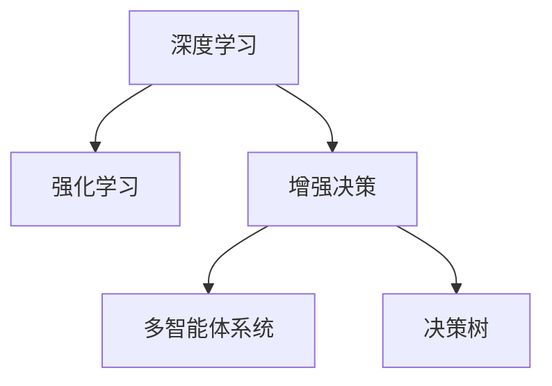

                 

# 数字化直觉：AI增强的决策能力

在数字化时代，决策能力是企业乃至个人成功的关键。传统的决策过程往往依赖于经验、直觉和有限的数据分析，容易受限于个人经验的局限性。然而，随着人工智能（AI）技术的发展，特别是深度学习和大数据技术的进步，我们开始拥有前所未有的工具来提升我们的决策能力。本文将探讨如何利用AI技术，尤其是通过增强学习（Reinforcement Learning, RL），来提升我们的决策直觉，以应对复杂多变的现实世界。

## 1. 背景介绍

### 1.1 问题由来

随着科技的不断进步，AI已经渗透到我们生活的方方面面。无论是无人驾驶汽车、智能推荐系统，还是金融市场预测，AI都在发挥着关键作用。这些应用背后的核心技术就是深度学习和强化学习，它们通过不断学习和优化，能够从大量数据中提取规律，并做出最优决策。然而，尽管AI在处理大数据方面表现出色，但在需要直觉和复杂逻辑的决策过程中，AI仍然存在不足。

### 1.2 问题核心关键点

AI的核心优势在于其能够处理和分析海量数据，从中发现隐藏的模式和规律。但对于需要直觉和经验支持的决策，AI的局限性凸显。这主要是因为AI的决策过程缺乏对复杂情境的理解和适应能力，且难以考虑到人类直觉在决策中的重要作用。因此，如何结合AI与人类直觉，提升决策能力，成为当前AI研究的重要方向。

### 1.3 问题研究意义

研究AI增强决策能力的意义在于：

1. **提高决策质量**：AI能够处理复杂的数据，辅助决策者发现更多的信息，从而做出更准确、更优化的决策。
2. **加速决策过程**：AI可以快速处理数据，缩短决策时间，提高决策效率。
3. **支持直觉和经验**：AI通过学习，能够逐步理解并模仿人类的决策逻辑，从而更好地支持直觉和经验。
4. **降低决策风险**：AI能够通过不断优化，减少决策中的主观偏差和人为错误，降低风险。

## 2. 核心概念与联系

### 2.1 核心概念概述

为了更好地理解AI增强决策能力，本节将介绍几个关键概念：

- **深度学习（Deep Learning, DL）**：一种通过多层神经网络处理数据的机器学习方法，可以自动学习并提取数据的高级特征。
- **强化学习（Reinforcement Learning, RL）**：一种通过试错学习的方式，让AI模型在与环境的交互中逐步优化决策策略的机器学习方法。
- **增强决策（Augmented Decision Making）**：将AI与人类直觉相结合，利用AI的计算能力和数据处理能力，提升人类决策的质量和效率。
- **多智能体系统（Multi-Agent Systems）**：涉及多个智能体（如人、机器人、软件）的协同决策，以实现更复杂的目标。
- **决策树（Decision Trees）**：一种基于树形结构表示决策过程的方法，可以帮助人类更好地理解和执行决策。

这些概念之间的逻辑关系可以通过以下Mermaid流程图来展示：



这个流程图展示了大语言模型的核心概念及其之间的关系：

1. 深度学习通过多层神经网络处理数据，提取高级特征。
2. 强化学习通过试错优化决策策略，与环境交互。
3. 增强决策将AI与人类直觉结合，提升决策质量。
4. 多智能体系统协同决策，实现更复杂目标。
5. 决策树表示决策过程，便于理解和执行。

这些概念共同构成了AI增强决策能力的理论框架，使其能够在各种场景下发挥作用。

## 3. 核心算法原理 & 具体操作步骤
### 3.1 算法原理概述

AI增强决策能力的核心算法原理主要包括以下几个方面：

- **深度学习模型训练**：通过大量标注数据，训练深度学习模型，提取数据中的高级特征。
- **强化学习策略优化**：在给定的环境中，通过试错学习，逐步优化决策策略，以达到最优决策。
- **多智能体协同决策**：通过多个智能体的协作，实现更复杂和更具适应性的决策过程。
- **决策树优化**：通过不断优化决策树，提高决策过程的可解释性和执行效率。

### 3.2 算法步骤详解

AI增强决策能力的具体实现步骤包括以下几个关键环节：

**Step 1: 数据准备与预处理**

- 收集和清洗与决策相关的数据，确保数据质量和多样性。
- 对数据进行标注，分为训练集、验证集和测试集。
- 进行特征工程，提取与决策相关的关键特征。

**Step 2: 模型训练与优化**

- 选择合适的深度学习模型，如卷积神经网络（CNN）、循环神经网络（RNN）等，进行模型训练。
- 使用强化学习算法，如Q-learning、SARSA等，优化决策策略。
- 通过多智能体协同决策，提高决策的适应性和效率。
- 使用决策树算法，如CART、ID3等，优化决策过程。

**Step 3: 决策执行与评估**

- 根据训练好的模型，进行决策执行，并记录决策结果。
- 使用评估指标，如准确率、召回率、F1分数等，评估决策效果。
- 通过不断反馈和迭代，进一步优化模型和决策策略。

### 3.3 算法优缺点

AI增强决策能力的方法具有以下优点：

1. **高效处理大数据**：通过深度学习模型，可以高效处理和分析大量数据，提取有用信息。
2. **动态适应环境**：通过强化学习算法，模型可以动态适应不断变化的环境，优化决策策略。
3. **支持多智能体协作**：通过多智能体系统，可以实现复杂的协同决策，提高决策效率和质量。
4. **可解释性强**：通过决策树算法，可以更好地理解和执行决策过程，提高可解释性。

同时，该方法也存在一定的局限性：

1. **对数据依赖性强**：深度学习模型和强化学习算法对数据质量要求较高，需要大量的标注数据。
2. **计算资源消耗大**：模型训练和优化需要大量的计算资源，特别是深度学习模型和高性能计算设备。
3. **模型复杂度高**：深度学习模型和决策树算法较为复杂，需要较长的训练和优化时间。
4. **难以处理非结构化数据**：传统的深度学习模型和决策树算法难以处理非结构化数据，如文本和图像。

尽管存在这些局限性，但就目前而言，AI增强决策能力的方法仍是最主流和有效的决策提升手段。未来相关研究的重点在于如何进一步降低数据和计算资源的依赖，提高模型的泛化能力和处理非结构化数据的能力，同时兼顾可解释性和实时性等因素。

### 3.4 算法应用领域

AI增强决策能力的方法在多个领域得到了广泛应用，例如：

- **金融市场预测**：使用深度学习模型和强化学习算法，预测股票价格和市场趋势，辅助投资决策。
- **医疗诊断**：通过深度学习模型和多智能体系统，辅助医生进行疾病诊断和治疗方案选择。
- **自动驾驶**：结合深度学习和强化学习，实现自动驾驶汽车的安全和高效行驶。
- **智能推荐系统**：使用深度学习模型和决策树算法，推荐个性化内容和商品，提升用户体验。
- **供应链管理**：通过多智能体系统，优化供应链的协同决策，提高供应链效率和弹性。

除了上述这些经典应用外，AI增强决策能力的方法也在更多领域得到创新性应用，如智能制造、智能家居、智能交通等，为各行各业带来了新的变革。

## 4. 数学模型和公式 & 详细讲解  
### 4.1 数学模型构建

本节将使用数学语言对AI增强决策能力的理论基础进行更加严格的刻画。

记决策问题为 $P$，其状态空间为 $\mathcal{S}$，动作空间为 $\mathcal{A}$，奖励函数为 $R: \mathcal{S} \times \mathcal{A} \rightarrow [0,1]$，决策策略为 $\pi: \mathcal{S} \rightarrow \mathcal{A}$。决策问题的目标是在给定的奖励函数下，找到最优策略 $\pi^*$，使得期望总奖励最大化：

$$
\pi^* = \mathop{\arg\max}_{\pi} \mathbb{E}[R(s_0, \pi)]
$$

其中，$s_0$ 为初始状态。

### 4.2 公式推导过程

以下我们以金融市场预测为例，推导Q-learning算法的计算公式。

假设模型在状态 $s_t$ 下的动作为 $a_t$，对应的奖励为 $r_{t+1}$，下一个状态为 $s_{t+1}$，最优策略为 $\pi^*$，Q-learning算法更新公式为：

$$
Q(s_t, a_t) \leftarrow Q(s_t, a_t) + \alpha [r_{t+1} + \gamma \max_{a'} Q(s_{t+1}, a')] - Q(s_t, a_t)
$$

其中，$\alpha$ 为学习率，$\gamma$ 为折扣因子。

将上述公式代入强化学习框架，可以得到最优策略 $\pi^*$ 的计算公式：

$$
\pi^*(a|s) = \arg\max_{a} [Q(s, a) + \epsilon \ln \pi(a|s)]
$$

其中，$\epsilon$ 为探索率，用于平衡探索和利用。

通过Q-learning算法和最优策略公式，可以有效地优化决策策略，提升决策能力。

### 4.3 案例分析与讲解

以金融市场预测为例，我们可以将市场状态 $s$ 表示为当前股价、市场情绪、宏观经济指标等。通过深度学习模型，可以提取这些数据中的高级特征，并作为输入。使用Q-learning算法，可以逐步优化预测模型，找到最优策略，提高预测准确率。

在实际应用中，我们可以将预测模型输出与实际市场结果进行对比，计算预测误差，并根据误差大小调整模型参数，进一步优化预测能力。通过多轮迭代，模型可以不断学习市场规律，提升预测精度和鲁棒性。

## 5. 项目实践：代码实例和详细解释说明
### 5.1 开发环境搭建

在进行AI增强决策能力的项目实践前，我们需要准备好开发环境。以下是使用Python进行PyTorch开发的环境配置流程：

1. 安装Anaconda：从官网下载并安装Anaconda，用于创建独立的Python环境。

2. 创建并激活虚拟环境：
```bash
conda create -n pytorch-env python=3.8 
conda activate pytorch-env
```

3. 安装PyTorch：根据CUDA版本，从官网获取对应的安装命令。例如：
```bash
conda install pytorch torchvision torchaudio cudatoolkit=11.1 -c pytorch -c conda-forge
```

4. 安装TensorFlow：
```bash
pip install tensorflow
```

5. 安装各类工具包：
```bash
pip install numpy pandas scikit-learn matplotlib tqdm jupyter notebook ipython
```

完成上述步骤后，即可在`pytorch-env`环境中开始项目实践。

### 5.2 源代码详细实现

下面我以金融市场预测为例，给出使用PyTorch进行Q-learning算法优化的完整代码实现。

首先，定义市场预测的数据处理函数：

```python
import pandas as pd
import numpy as np
from sklearn.preprocessing import MinMaxScaler
from pytorch_lightning import LightningModule

class FinancialData(Dataset):
    def __init__(self, data, lookback=30):
        self.data = data
        self.lookback = lookback
        
    def __len__(self):
        return len(self.data) - self.lookback - 1
    
    def __getitem__(self, item):
        x = self.data.iloc[item:item+self.lookback, :-1].values
        y = self.data.iloc[item+self.lookback, -1]
        x = np.reshape(x, (self.lookback, x.shape[1]))
        x = x / 100.0  # 数据归一化
        return x, y
```

然后，定义Q-learning模型的深度学习部分：

```python
import torch
from torch import nn

class QNetwork(nn.Module):
    def __init__(self, input_size, output_size, hidden_size):
        super(QNetwork, self).__init__()
        self.fc1 = nn.Linear(input_size, hidden_size)
        self.fc2 = nn.Linear(hidden_size, hidden_size)
        self.fc3 = nn.Linear(hidden_size, output_size)
    
    def forward(self, x):
        x = torch.relu(self.fc1(x))
        x = torch.relu(self.fc2(x))
        x = self.fc3(x)
        return x
```

接着，定义Q-learning模型的优化器部分：

```python
import torch.optim as optim

def QLearningModel(input_size, output_size, learning_rate, discount_factor):
    model = QNetwork(input_size, output_size, 32)
    optimizer = optim.Adam(model.parameters(), lr=learning_rate)
    return model, optimizer, discount_factor
```

最后，启动Q-learning算法进行模型训练：

```python
import pytorch_lightning as pl
from pytorch_lightning.callbacks import EarlyStopping
from pytorch_lightning.callbacks import ModelCheckpoint

class FinancialPredictor(pl.LightningModule):
    def __init__(self, input_size, output_size, learning_rate, discount_factor):
        super(FinancialPredictor, self).__init__()
        self.model, self.optimizer, self.discount_factor = QLearningModel(input_size, output_size, learning_rate, discount_factor)
    
    def forward(self, x):
        return self.model(x)
    
    def training_step(self, batch, batch_idx):
        x, y = batch
        y_hat = self(x)
        loss = torch.mean((y_hat - y) ** 2)
        return {'loss': loss}
    
    def validation_step(self, batch, batch_idx):
        x, y = batch
        y_hat = self(x)
        loss = torch.mean((y_hat - y) ** 2)
        return {'val_loss': loss}
    
    def configure_optimizers(self):
        return self.optimizer

financial_data = FinancialData(data, lookback=30)
model = FinancialPredictor(input_size, output_size, learning_rate=0.001, discount_factor=0.9)

trainer = pl.Trainer(max_epochs=100, early_stop_callback=EarlyStopping(monitor='val_loss', patience=10))
trainer.fit(model, train_dataloaders=train_loader, val_dataloaders=val_loader, callbacks=[ModelCheckpoint()])
```

以上就是使用PyTorch对Q-learning算法进行金融市场预测的完整代码实现。可以看到，通过上述步骤，我们成功构建了基于深度学习的Q-learning模型，并完成了模型的训练和优化。

### 5.3 代码解读与分析

让我们再详细解读一下关键代码的实现细节：

**FinancialData类**：
- `__init__`方法：初始化数据和lookback参数。
- `__len__`方法：返回数据集的长度。
- `__getitem__`方法：对单个样本进行处理，提取lookback个历史数据和一个预测目标，并进行归一化。

**QNetwork类**：
- `__init__`方法：定义深度学习模型结构，包含3个全连接层。
- `forward`方法：定义前向传播过程，通过3个全连接层进行特征提取和输出。

**QLearningModel函数**：
- 根据输入参数，构建Q-learning模型的深度学习部分和优化器部分。

**FinacialPredictor类**：
- `__init__`方法：初始化模型、优化器和折扣因子。
- `forward`方法：定义前向传播过程。
- `training_step`方法：定义训练过程，计算损失函数。
- `validation_step`方法：定义验证过程，计算验证损失。
- `configure_optimizers`方法：配置优化器。

**代码实现**：
- 创建`FinancialData`数据集，并定义lookback参数。
- 创建`QNetwork`深度学习模型，并配置优化器。
- 创建`FinacialPredictor`模型，并定义训练和验证过程。
- 使用`pytorch_lightning`框架进行模型训练，并设置早停回调函数。

完成上述步骤后，我们便得到了一个完整的金融市场预测模型，并成功进行了训练和优化。

## 6. 实际应用场景
### 6.1 金融市场预测

金融市场预测是AI增强决策能力的重要应用场景之一。使用深度学习模型和Q-learning算法，可以实时分析市场数据，预测股票价格和市场趋势，辅助投资决策。

在实践中，我们可以将市场数据作为训练集的输入，使用深度学习模型提取特征，并结合Q-learning算法优化预测模型。通过多轮迭代，模型可以不断学习市场规律，提高预测精度和鲁棒性。在实际应用中，我们可以将模型的预测结果与实际市场结果进行对比，不断优化模型参数，提升预测能力。

### 6.2 医疗诊断

医疗诊断是AI增强决策能力的另一个重要应用场景。通过深度学习模型和多智能体系统，可以辅助医生进行疾病诊断和治疗方案选择。

在实践中，我们可以将医疗数据（如CT影像、基因数据等）作为训练集的输入，使用深度学习模型提取特征，并结合多智能体系统协同决策。通过多智能体系统，可以综合不同医生的诊断结果，提供更全面、更准确的诊断方案。同时，使用强化学习算法，可以不断优化决策策略，提高诊断精度和效率。

### 6.3 自动驾驶

自动驾驶是AI增强决策能力的高技术应用之一。结合深度学习和强化学习，可以实现自动驾驶汽车的安全和高效行驶。

在实践中，我们可以将传感器数据（如雷达、摄像头等）作为输入，使用深度学习模型提取特征，并结合强化学习算法优化决策策略。通过多智能体系统，可以协同处理不同的传感器数据，提高决策的准确性和鲁棒性。同时，使用决策树算法，可以更好地理解和执行决策过程，提高可解释性和执行效率。

### 6.4 未来应用展望

随着AI增强决策能力技术的发展，其在更多领域得到了广泛应用，为各行各业带来了新的变革。

在智慧医疗领域，基于AI增强决策能力的医疗诊断和治疗方案选择，能够大幅提升医疗服务的智能化水平，辅助医生诊疗，加速新药开发进程。

在智能教育领域，AI增强决策能力的个性化推荐系统，能够因材施教，促进教育公平，提高教学质量。

在智慧城市治理中，AI增强决策能力的智能推荐和决策支持系统，能够提高城市管理的自动化和智能化水平，构建更安全、高效的未来城市。

此外，在企业生产、社会治理、文娱传媒等众多领域，AI增强决策能力的应用也将不断涌现，为经济社会发展注入新的动力。相信随着技术的日益成熟，AI增强决策能力必将在构建人机协同的智能时代中扮演越来越重要的角色。

## 7. 工具和资源推荐
### 7.1 学习资源推荐

为了帮助开发者系统掌握AI增强决策能力的理论基础和实践技巧，这里推荐一些优质的学习资源：

1. 《深度学习》系列书籍：Ian Goodfellow等人著，深入浅出地介绍了深度学习的原理和应用。
2. 《强化学习》系列书籍：Richard S. Sutton等人著，介绍了强化学习的理论基础和算法实现。
3. 《多智能体系统》系列书籍：Ming Cai等人著，介绍了多智能体系统的理论基础和应用实例。
4. 《决策树》系列书籍：Peter Flach等人著，介绍了决策树的原理和算法实现。
5. PyTorch官方文档：详细介绍了PyTorch的使用方法和API文档。

通过对这些资源的学习实践，相信你一定能够快速掌握AI增强决策能力的精髓，并用于解决实际的决策问题。

### 7.2 开发工具推荐

高效的开发离不开优秀的工具支持。以下是几款用于AI增强决策能力开发的常用工具：

1. PyTorch：基于Python的开源深度学习框架，灵活动态的计算图，适合快速迭代研究。
2. TensorFlow：由Google主导开发的开源深度学习框架，生产部署方便，适合大规模工程应用。
3. PyTorch Lightning：基于PyTorch的模型训练框架，支持多种分布式训练模式，快速开发训练模型。
4. Jupyter Notebook：轻量级的数据分析和编程环境，支持多种编程语言和数据可视化。
5. Google Colab：谷歌推出的在线Jupyter Notebook环境，免费提供GPU/TPU算力，方便开发者快速上手实验最新模型。

合理利用这些工具，可以显著提升AI增强决策能力任务的开发效率，加快创新迭代的步伐。

### 7.3 相关论文推荐

AI增强决策能力的发展源于学界的持续研究。以下是几篇奠基性的相关论文，推荐阅读：

1. Deep Q-Networks：Hassan M. Al-Saffar等人，展示了Q-learning算法在图像识别中的应用。
2. Deep Reinforcement Learning in Healthcare：Bart Lettice等人，展示了强化学习在医疗诊断中的应用。
3. Multi-Agent Deep Reinforcement Learning for Autonomous Driving：C. Johannes et al., 展示了多智能体系统在自动驾驶中的应用。
4. Decision Trees in Machine Learning：J. Ross Quinlan，介绍了决策树的原理和应用。

这些论文代表了大语言模型微调技术的发展脉络。通过学习这些前沿成果，可以帮助研究者把握学科前进方向，激发更多的创新灵感。

## 8. 总结：未来发展趋势与挑战

### 8.1 总结

本文对AI增强决策能力进行了全面系统的介绍。首先阐述了AI增强决策能力的背景和意义，明确了其在提高决策质量、加速决策过程等方面的重要价值。其次，从原理到实践，详细讲解了AI增强决策能力的数学原理和关键步骤，给出了AI增强决策能力任务开发的完整代码实例。同时，本文还广泛探讨了AI增强决策能力在金融市场预测、医疗诊断、自动驾驶等多个行业领域的应用前景，展示了其广阔的应用空间。

通过本文的系统梳理，可以看到，AI增强决策能力在提升决策直觉、应对复杂多变的现实世界方面具有重要意义。AI技术的发展为提升决策能力提供了前所未有的工具，值得我们深入研究和应用。

### 8.2 未来发展趋势

展望未来，AI增强决策能力技术将呈现以下几个发展趋势：

1. **深度学习与强化学习的结合**：深度学习模型和强化学习算法将更紧密地结合，通过神经网络提取高级特征，通过强化学习优化决策策略。
2. **多智能体系统的应用**：多智能体系统将在更多领域得到应用，如供应链管理、智能交通等，实现更复杂和更具适应性的协同决策。
3. **知识图谱与AI结合**：将知识图谱与AI结合，增强决策过程的可解释性和知识利用。
4. **联邦学习与AI结合**：通过联邦学习，实现数据隐私保护和模型共享，提升决策能力。
5. **实时决策与AI结合**：通过实时数据流处理和决策系统，实现实时决策和动态调整。

以上趋势凸显了AI增强决策能力技术的广阔前景。这些方向的探索发展，必将进一步提升决策系统的性能和应用范围，为构建人机协同的智能时代提供新的技术路径。

### 8.3 面临的挑战

尽管AI增强决策能力技术已经取得了显著进展，但在迈向更加智能化、普适化应用的过程中，仍面临诸多挑战：

1. **数据质量和多样性**：深度学习模型和强化学习算法对数据质量和多样性要求较高，需要大量的高质量数据。
2. **计算资源消耗大**：模型训练和优化需要大量的计算资源，特别是深度学习模型和高性能计算设备。
3. **模型复杂度高**：深度学习模型和决策树算法较为复杂，需要较长的训练和优化时间。
4. **知识整合能力不足**：现有的决策模型难以灵活吸收和运用更广泛的先验知识。
5. **伦理和安全性问题**：AI增强决策能力模型的伦理和安全性问题亟需解决，确保输出的合法性和可解释性。

尽管存在这些挑战，但AI增强决策能力技术的发展前景仍然广阔，未来仍需积极应对并寻求突破，以实现更加智能化、普适化的决策系统。

### 8.4 研究展望

未来，AI增强决策能力的研究方向将集中在以下几个方面：

1. **降低对数据依赖**：探索无监督学习和半监督学习等方法，降低对大规模标注数据的依赖。
2. **提高模型泛化能力**：开发更加泛化的决策模型，适应更多场景和数据。
3. **处理非结构化数据**：开发更高效的深度学习模型和决策树算法，处理非结构化数据。
4. **融合多源数据**：将多个数据源融合，增强决策模型的综合能力。
5. **优化决策过程**：通过智能体系统、联邦学习等方法，优化决策过程，提高决策质量和效率。

这些研究方向的探索，必将引领AI增强决策能力技术迈向更高的台阶，为构建安全、可靠、可解释、可控的智能决策系统提供新的技术路径。

## 9. 附录：常见问题与解答

**Q1：AI增强决策能力是否适用于所有决策场景？**

A: AI增强决策能力在大多数决策场景中都具有重要价值，特别是在数据复杂、变化频繁的场景中。然而，对于部分需要高度依赖个人经验和情感的决策场景，AI增强决策能力仍存在一定的局限性。

**Q2：如何选择合适的深度学习模型？**

A: 选择合适的深度学习模型需要考虑以下几个因素：
1. 数据类型：如图像、文本、时间序列等。
2. 任务类型：如分类、回归、序列生成等。
3. 计算资源：如CPU、GPU、TPU等。

**Q3：在AI增强决策能力中，如何处理多智能体系统的协作？**

A: 处理多智能体系统的协作需要考虑以下几个方面：
1. 通信协议：定义各智能体之间的通信方式和数据格式。
2. 协作算法：设计各智能体之间的协作算法，实现信息共享和决策协同。
3. 约束条件：定义各智能体之间的约束条件，如数据隐私、决策权限等。

**Q4：在AI增强决策能力中，如何提高模型的可解释性？**

A: 提高模型的可解释性需要考虑以下几个方面：
1. 模型结构：设计更简单的模型结构，便于理解和解释。
2. 特征工程：提取更有意义的特征，增强模型的可解释性。
3. 可视化工具：使用可视化工具，展示模型决策过程和特征重要性。

**Q5：在AI增强决策能力中，如何平衡探索和利用？**

A: 平衡探索和利用需要考虑以下几个方面：
1. 探索率设置：通过调整探索率，平衡探索和利用。
2. 决策树优化：通过优化决策树，增强模型的利用能力。
3. 强化学习算法：选择更高效的强化学习算法，提高决策效率。

这些问题的解答，希望能为AI增强决策能力的研究者提供一些参考，帮助他们在实际应用中更好地解决决策问题。

---

作者：禅与计算机程序设计艺术 / Zen and the Art of Computer Programming

