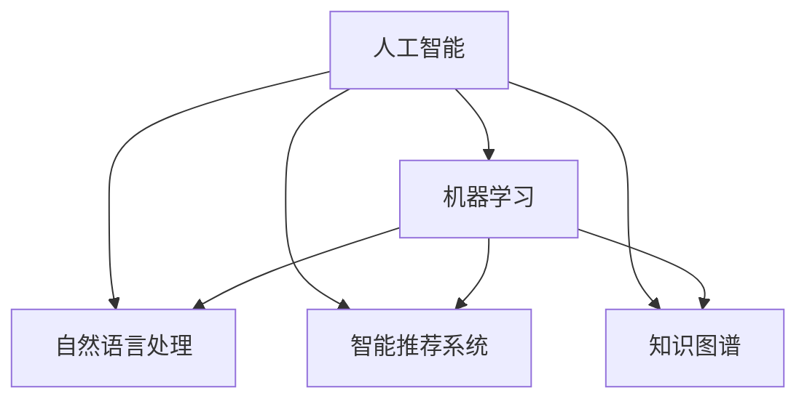

                 

# 数字化自我实现：AI辅助的个人成长

## 1. 背景介绍

在数字化时代，人工智能(AI)已经渗透到我们生活的方方面面，从智能家居、在线教育到个人健康管理，AI技术无处不在。然而，许多人可能还未充分意识到，AI不仅仅是工具，更是一种推动个人成长、实现数字化自我实现的重要助力。本文将深入探讨AI在个人成长中的角色，通过一系列具体的技术和实践案例，揭示AI如何辅助我们实现更高的自我成就。

## 2. 核心概念与联系

### 2.1 核心概念概述

为了更好地理解AI在个人成长中的作用，我们需要先明确几个关键概念：

- **人工智能(Artificial Intelligence, AI)**：指通过算法、模型等技术，使计算机系统具备类似人类智能的能力。包括机器学习、自然语言处理、计算机视觉等诸多领域。
- **机器学习(Machine Learning, ML)**：指让机器从数据中学习并改进性能的技术。常用的机器学习方法包括监督学习、无监督学习和强化学习。
- **自然语言处理(Natural Language Processing, NLP)**：指让计算机理解、生成人类语言的技术。NLP广泛应用于聊天机器人、自动翻译、文本分析等领域。
- **智能推荐系统(Recommender Systems)**：指根据用户的历史行为和偏好，推荐最符合用户需求的物品或内容。广泛应用于电商、新闻、视频等多个场景。
- **知识图谱(Knowledge Graphs)**：指以图结构存储和组织知识的网络，能够支持复杂的推理和查询操作。广泛应用于知识管理、搜索引擎等领域。

这些概念之间的逻辑关系可以通过以下Mermaid流程图来展示：



这个流程图展示了人工智能技术的基本框架，及其在机器学习、自然语言处理、智能推荐系统、知识图谱等领域的广泛应用。

## 3. 核心算法原理 & 具体操作步骤
### 3.1 算法原理概述

AI在个人成长中的应用，核心在于如何通过数据分析、模型训练等技术，帮助个人识别自身优势、弥补短板，并根据反馈不断调整成长策略。以下是几种常见的AI辅助个人成长算法：

- **推荐系统算法**：通过分析用户的历史行为和偏好，推荐个性化的学习资源、书籍、视频等，帮助用户发现新的兴趣和知识领域。
- **知识图谱算法**：构建个人知识图谱，存储和组织用户已有的知识体系，通过推理和查询操作，帮助用户掌握复杂概念和知识体系。
- **情感分析算法**：通过分析用户的文本表达和情绪状态，提供情感支持和心理辅导，帮助用户缓解压力和焦虑。
- **语音识别和合成算法**：通过语音交互技术，与用户进行更自然的交流和反馈，提升学习和工作体验。
- **时间管理算法**：通过分析用户的时间数据，提供时间管理建议，帮助用户优化日常安排，提升工作效率。

### 3.2 算法步骤详解

以下以推荐系统算法为例，详细讲解AI在个人成长中的应用步骤：

**Step 1: 数据收集与预处理**
- 收集用户的历史行为数据，如浏览记录、购买记录、学习时间等。
- 对数据进行清洗和标准化处理，去除噪声和缺失值。

**Step 2: 用户画像构建**
- 根据用户的历史行为数据，构建用户画像，即用户的基本属性和兴趣偏好。
- 使用聚类、分类等算法对用户画像进行细分，获得更精准的用户画像。

**Step 3: 物品画像构建**
- 收集物品的描述、标签、评论等信息，构建物品画像。
- 使用向量表示、文本分类等算法，将物品画像转化为机器可处理的格式。

**Step 4: 推荐模型训练**
- 选择适合的推荐算法，如协同过滤、内容推荐、混合推荐等。
- 在用户画像和物品画像的基础上，训练推荐模型，学习用户和物品之间的关系。

**Step 5: 推荐结果生成**
- 根据当前用户画像和推荐模型，生成个性化的推荐结果。
- 使用排序算法对推荐结果进行排序，提供最优的推荐内容。

**Step 6: 反馈与迭代**
- 收集用户对推荐内容的反馈，如点击率、停留时间等。
- 根据反馈不断调整推荐模型，优化推荐效果。

### 3.3 算法优缺点

AI辅助个人成长的算法具有以下优点：
1. **个性化**：根据用户的历史数据和行为，提供个性化的学习、工作和娱乐建议，满足用户的多样化需求。
2. **高效性**：通过算法自动化处理大量数据，显著提升信息检索和决策效率。
3. **可扩展性**：能够轻松扩展到多个场景和应用，具有广泛的应用前景。

然而，这些算法也存在一些局限性：
1. **隐私问题**：收集和使用用户数据可能会引发隐私和安全问题，需要严格的数据保护措施。
2. **数据质量**：算法的准确性和效果很大程度上依赖于数据的质量，数据不充分或噪声较多时，推荐效果不佳。
3. **模型复杂性**：一些高级算法如深度学习模型可能需要较长的训练时间和较高的计算资源。
4. **反馈延迟**：推荐系统的反馈机制可能存在延迟，用户需要较长时间才能看到推荐的改进效果。

尽管存在这些局限性，但AI在个人成长中的应用前景仍然十分广阔，尤其在帮助用户发现新兴趣、提升生活质量等方面具有显著优势。

### 3.4 算法应用领域

AI辅助个人成长的算法在多个领域都有广泛的应用，例如：

- **在线教育**：通过推荐系统算法，根据学生的学习历史和偏好，推荐个性化的学习资源和课程，提升学习效果。
- **职业规划**：利用情感分析算法和知识图谱，帮助用户识别职业兴趣和发展机会，制定合理的职业规划。
- **健康管理**：通过智能推荐系统和时间管理算法，提供个性化的健康建议和健身计划，提升健康水平。
- **心理辅导**：使用情感分析和聊天机器人算法，提供心理健康支持和情感辅导，帮助用户缓解压力和焦虑。
- **技能提升**：通过推荐系统和时间管理算法，推荐最有效的学习方法和资源，提升个人技能水平。

这些应用场景展示了AI技术在个人成长中的巨大潜力，未来随着技术的不断进步，将有更多创新性的应用涌现，为人类提供全方位的成长支持。

## 4. 数学模型和公式 & 详细讲解  
### 4.1 数学模型构建

以推荐系统为例，假设用户画像为 $u$，物品画像为 $i$，推荐系统通过协同过滤算法进行推荐。推荐系统构建用户-物品矩阵 $R$，其中 $R_{ui}$ 表示用户 $u$ 对物品 $i$ 的评分。根据历史评分数据，推荐系统使用以下模型进行预测：

$$
\hat{R}_{ui} = \alpha \left(\frac{\sum_{j=1}^N a_{uj}b_{ij}}{\sqrt{\sum_{j=1}^N a_{uj}^2} \sqrt{\sum_{j=1}^N b_{ij}^2}}\right) + (1-\alpha)r_{ui}
$$

其中，$\alpha$ 为调整参数，$a_{uj}$ 和 $b_{ij}$ 分别为用户画像和物品画像的特征向量，$r_{ui}$ 为实际评分。

### 4.2 公式推导过程

根据协同过滤算法，推荐系统使用用户 $u$ 的邻居 $k$ 对物品 $i$ 的评分作为参考，计算用户 $u$ 对物品 $i$ 的预测评分。将每个用户和物品表示为稀疏向量，使用余弦相似度计算用户之间的相似度。推荐系统的核心公式为：

$$
\hat{R}_{ui} = \alpha \left(\sum_{j=1}^N \frac{a_{uj}b_{ij}}{\sqrt{\sum_{j=1}^N a_{uj}^2} \sqrt{\sum_{j=1}^N b_{ij}^2}}\right) + (1-\alpha)r_{ui}
$$

其中，$a_{uj}$ 和 $b_{ij}$ 为稀疏向量表示，$k$ 为用户 $u$ 的邻居，$N$ 为邻居数目。

### 4.3 案例分析与讲解

以在线教育平台为例，平台收集用户的学习行为数据，如学习时长、观看视频数、完成练习题数等。使用协同过滤算法，为用户推荐个性化学习资源，如视频课程、练习题等。平台通过不断收集用户反馈，优化推荐模型，提升用户的学习体验。

## 5. 项目实践：代码实例和详细解释说明
### 5.1 开发环境搭建

在开发推荐系统前，需要先搭建开发环境。以下是使用Python进行PyTorch开发的环境配置流程：

1. 安装Anaconda：从官网下载并安装Anaconda，用于创建独立的Python环境。

2. 创建并激活虚拟环境：
```bash
conda create -n pytorch-env python=3.8 
conda activate pytorch-env
```

3. 安装PyTorch：根据CUDA版本，从官网获取对应的安装命令。例如：
```bash
conda install pytorch torchvision torchaudio cudatoolkit=11.1 -c pytorch -c conda-forge
```

4. 安装TensorFlow：
```bash
pip install tensorflow
```

5. 安装Pandas、NumPy、Matplotlib等辅助库：
```bash
pip install pandas numpy matplotlib scikit-learn tqdm jupyter notebook ipython
```

完成上述步骤后，即可在`pytorch-env`环境中开始推荐系统的开发。

### 5.2 源代码详细实现

下面以协同过滤算法为例，给出使用PyTorch进行推荐系统开发的代码实现：

```python
import torch
from torch import nn
from torch.nn import functional as F

class CollaborativeFiltering(nn.Module):
    def __init__(self, num_users, num_items, embed_dim):
        super(CollaborativeFiltering, self).__init__()
        self.num_users = num_users
        self.num_items = num_items
        self.embed_dim = embed_dim
        
        self.user_embed = nn.Embedding(num_users, embed_dim)
        self.item_embed = nn.Embedding(num_items, embed_dim)
        
        self.fc1 = nn.Linear(embed_dim * 2, 64)
        self.fc2 = nn.Linear(64, embed_dim)
        self.fc3 = nn.Linear(embed_dim, num_items)
        
    def forward(self, user_ids, item_ids):
        user_vec = self.user_embed(user_ids)
        item_vec = self.item_embed(item_ids)
        
        x = torch.cat([user_vec, item_vec], dim=1)
        x = F.relu(self.fc1(x))
        x = F.relu(self.fc2(x))
        x = self.fc3(x)
        
        x = x.unsqueeze(-1)
        x = F.softmax(x, dim=-1)
        
        return x
```

定义推荐系统模型后，我们可以加载数据并进行训练：

```python
from torch.utils.data import Dataset, DataLoader

class RecommendationDataset(Dataset):
    def __init__(self, user_ids, item_ids, scores):
        self.user_ids = user_ids
        self.item_ids = item_ids
        self.scores = scores
        
    def __len__(self):
        return len(self.scores)
    
    def __getitem__(self, idx):
        return torch.tensor(self.user_ids[idx]), torch.tensor(self.item_ids[idx]), torch.tensor(self.scores[idx])

# 准备数据
user_ids = [1, 2, 3, 4, 5]
item_ids = [10, 11, 12, 13, 14]
scores = [3, 4, 5, 1, 2]

dataset = RecommendationDataset(user_ids, item_ids, scores)
dataloader = DataLoader(dataset, batch_size=4)

# 初始化模型和优化器
model = CollaborativeFiltering(num_users=5, num_items=5, embed_dim=64)
optimizer = torch.optim.Adam(model.parameters(), lr=0.001)

# 训练模型
for epoch in range(100):
    for batch in dataloader:
        user_ids, item_ids, scores = batch
        
        preds = model(user_ids, item_ids)
        loss = F.mse_loss(preds, torch.tensor(scores))
        
        optimizer.zero_grad()
        loss.backward()
        optimizer.step()
        
        print(f'Epoch {epoch+1}, loss: {loss.item()}')
```

### 5.3 代码解读与分析

让我们再详细解读一下关键代码的实现细节：

**RecommendationDataset类**：
- `__init__`方法：初始化用户ID、物品ID和评分数据。
- `__len__`方法：返回数据集的样本数量。
- `__getitem__`方法：对单个样本进行处理，返回用户ID、物品ID和评分。

**模型定义**：
- `CollaborativeFiltering`类：继承自`nn.Module`，定义协同过滤模型的结构。
- `__init__`方法：初始化用户和物品的嵌入层，以及若干全连接层。
- `forward`方法：前向传播计算，将用户ID和物品ID嵌入向量拼接，经过若干层全连接层后输出评分预测。

**训练流程**：
- 使用`DataLoader`将数据集加载到批处理中。
- 定义优化器，对模型进行优化。
- 在每个epoch内，对每个batch进行前向传播、计算损失和反向传播，更新模型参数。
- 迭代训练，不断更新模型，最终得到优化的推荐模型。

## 6. 实际应用场景
### 6.1 在线教育

在线教育平台利用推荐系统算法，根据用户的学习历史和偏好，推荐个性化的学习资源，提升学习效果。例如，Khan Academy使用协同过滤算法，为学生推荐适合的课程和练习题。Coursera则使用内容推荐系统，根据学生的学习行为和反馈，动态调整课程内容和推荐顺序，提升学习体验。

### 6.2 职业规划

职业规划平台使用情感分析算法和知识图谱，帮助用户识别职业兴趣和发展机会，制定合理的职业规划。例如，LinkedIn利用自然语言处理技术，分析用户的职业经历和技能，推荐适合的工作岗位和培训课程。Monster则使用知识图谱，构建职业知识网络，提供职业发展和转型的建议和指导。

### 6.3 健康管理

健康管理应用使用智能推荐系统和时间管理算法，提供个性化的健康建议和健身计划，提升健康水平。例如，Fitbit使用推荐系统，根据用户的历史健康数据和行为，推荐个性化的运动计划和饮食建议。MyFitnessPal则使用时间管理算法，帮助用户规划每日的运动和饮食，跟踪健康指标，提升生活质量。

### 6.4 心理辅导

心理辅导应用使用情感分析和聊天机器人算法，提供心理健康支持和情感辅导，帮助用户缓解压力和焦虑。例如，Headspace利用情感分析技术，分析用户的情绪状态，提供个性化的心理健康建议。BetterHelp则使用聊天机器人，提供全天候的心理辅导和支持，帮助用户应对心理压力。

### 6.5 技能提升

技能提升平台使用推荐系统和时间管理算法，推荐最有效的学习方法和资源，提升个人技能水平。例如，Udemy使用推荐系统，根据用户的学习历史和偏好，推荐适合的课程和学习资源。Codecademy则使用时间管理算法，帮助用户规划学习时间，提升编程技能。

## 7. 工具和资源推荐
### 7.1 学习资源推荐

为了帮助开发者系统掌握AI在个人成长中的应用，这里推荐一些优质的学习资源：

1. 《Python数据科学手册》：涵盖Python基础、数据处理、机器学习等多个领域，适合新手入门。

2. 《深度学习入门》：介绍深度学习的基本概念和常用算法，适合深度学习初学者。

3. 《NLP实战指南》：涵盖自然语言处理的基本技术和实际应用，适合NLP开发者。

4. 《Recommender Systems》：系统讲解推荐系统算法，适合推荐系统开发者。

5. Coursera《机器学习》课程：斯坦福大学开设的机器学习经典课程，适合入门和进阶学习。

6. Kaggle竞赛平台：提供大量数据集和竞赛题目，帮助开发者实践和提升技能。

通过对这些资源的学习实践，相信你一定能够快速掌握AI在个人成长中的应用，并用于解决实际问题。

### 7.2 开发工具推荐

高效的开发离不开优秀的工具支持。以下是几款用于AI开发常用的工具：

1. PyTorch：基于Python的开源深度学习框架，灵活动态的计算图，适合快速迭代研究。大部分AI算法都有PyTorch版本的实现。

2. TensorFlow：由Google主导开发的开源深度学习框架，生产部署方便，适合大规模工程应用。同样有丰富的AI算法资源。

3. Jupyter Notebook：交互式Python编程环境，支持代码、文本、图像等多类型内容展示，适合研究和协作开发。

4. Weights & Biases：模型训练的实验跟踪工具，可以记录和可视化模型训练过程中的各项指标，方便对比和调优。

5. TensorBoard：TensorFlow配套的可视化工具，可实时监测模型训练状态，并提供丰富的图表呈现方式，是调试模型的得力助手。

6. Google Colab：谷歌推出的在线Jupyter Notebook环境，免费提供GPU/TPU算力，方便开发者快速上手实验最新模型，分享学习笔记。

合理利用这些工具，可以显著提升AI开发的效率，加快创新迭代的步伐。

### 7.3 相关论文推荐

AI在个人成长中的应用源于学界的持续研究。以下是几篇奠基性的相关论文，推荐阅读：

1. 《A Tutorial on Recommender Systems》：Liu et al., 2005，系统介绍推荐系统算法的基本原理和实现方法。

2. 《Knowledge-Graph-Based Recommender Systems》：Wang et al., 2017，探讨知识图谱在推荐系统中的应用。

3. 《Sentiment Analysis and Opinion Mining》：Bing et al., 2008，介绍情感分析的基本技术和应用。

4. 《Text Mining and Statistical Learning》：Zhang et al., 2016，系统讲解文本挖掘和统计学习的基本技术和应用。

5. 《Collaborative Filtering for Recommender Systems》：He et al., 2017，探讨协同过滤算法的优化和改进。

这些论文代表了大数据推荐系统的发展脉络。通过学习这些前沿成果，可以帮助研究者把握学科前进方向，激发更多的创新灵感。

## 8. 总结：未来发展趋势与挑战
### 8.1 总结

本文对AI在个人成长中的应用进行了全面系统的介绍。首先阐述了AI在个人成长中的角色，明确了推荐系统、知识图谱、情感分析、智能推荐系统等核心概念及其应用场景。其次，从原理到实践，详细讲解了AI在推荐系统、职业规划、健康管理、心理辅导、技能提升等多个领域的应用流程和具体算法。最后，我们总结了AI在个人成长中的优势和面临的挑战，提出了未来发展的方向和策略。

通过本文的系统梳理，可以看到，AI技术在个人成长中的应用前景广阔，能够显著提升用户的生产力和生活质量。未来，随着AI技术的不断进步，我们将看到更多创新性的应用涌现，为人类提供全方位的成长支持。

### 8.2 未来发展趋势

展望未来，AI在个人成长中的应用将呈现以下几个发展趋势：

1. **多模态融合**：AI将逐步从单模态扩展到多模态，融合视觉、听觉、触觉等多种感官信息，提供更加全面和沉浸的用户体验。

2. **个性化定制**：AI将进一步提升个性化推荐和定制能力，根据用户的实时反馈和动态数据，提供更加精准和高效的服务。

3. **实时互动**：AI将通过自然语言处理和智能对话技术，实现实时互动，提供更加自然和流畅的用户体验。

4. **跨平台协同**：AI将打破平台壁垒，实现跨平台协同，为用户提供无缝的跨设备和跨应用体验。

5. **伦理与安全**：AI将逐步引入伦理和隐私保护机制，确保技术应用的安全和公平，避免算法偏见和误导性输出。

这些趋势展示了AI在个人成长中的广阔前景，将引领AI技术向更加智能、普适、安全的方向发展。

### 8.3 面临的挑战

尽管AI在个人成长中的应用前景广阔，但在迈向更加智能化、普适化应用的过程中，仍面临诸多挑战：

1. **隐私保护**：收集和使用用户数据可能引发隐私和安全问题，需要严格的数据保护措施。

2. **数据质量**：算法的准确性和效果很大程度上依赖于数据的质量，数据不充分或噪声较多时，推荐效果不佳。

3. **计算资源**：AI算法通常需要较大的计算资源，如何在保持高精度的同时降低资源消耗，仍是一个重要课题。

4. **模型可解释性**：当前AI模型往往具有"黑盒"特性，难以解释其内部工作机制和决策逻辑。如何赋予AI模型更强的可解释性，将是亟待攻克的难题。

5. **算法偏见**：AI模型可能会学习到有偏见的数据信息，通过推荐和输出产生歧视性影响。如何消除模型偏见，确保公平性，也将是一个重要的研究方向。

尽管存在这些挑战，但通过学界和产业界的共同努力，相信这些难题终将一一克服，AI在个人成长中的应用必将继续深化和扩展。

### 8.4 研究展望

面对AI在个人成长中面临的挑战，未来的研究需要在以下几个方面寻求新的突破：

1. **数据隐私保护**：开发更加高效和安全的隐私保护技术，确保用户数据在收集和使用过程中的安全。

2. **数据质量提升**：采用更加高效的数据清洗和增强技术，提高数据的质量和多样性，确保算法的准确性和效果。

3. **计算资源优化**：研究更加高效和可扩展的算法实现，降低计算资源消耗，提升AI算法的实用性。

4. **模型可解释性增强**：开发更加透明和可解释的AI模型，增强模型内部工作机制的可理解性，提升用户信任度。

5. **算法公平性保障**：引入公平性约束和监督机制，确保AI算法在应用过程中不会产生偏见，保障社会公平。

这些研究方向将为AI在个人成长中的应用提供新的突破点，推动AI技术向更加智能、普适、安全的方向发展。相信随着技术的不断进步，AI将更好地服务于人类的成长和发展，实现数字化自我实现的目标。

## 9. 附录：常见问题与解答

**Q1：AI在个人成长中的应用主要有哪些？**

A: AI在个人成长中的应用广泛，主要包括推荐系统、情感分析、知识图谱、智能对话、时间管理等多个方面。通过这些技术，AI可以提供个性化的学习、工作和健康支持，帮助用户发现新兴趣、提升生活质量。

**Q2：AI推荐系统如何处理数据不充分和噪声较多的问题？**

A: 数据不充分和噪声较多是推荐系统面临的常见问题。为应对这些问题，通常会采用以下方法：
1. 数据增强：通过回译、近义替换等方式扩充训练集，增加数据量。
2. 模型选择：选择适合稀疏数据和噪声数据的模型，如协同过滤算法、深度学习算法等。
3. 异常处理：采用异常检测技术，对异常数据进行处理或过滤。
4. 用户画像优化：通过聚类和分类等算法，对用户画像进行细化和优化，提高推荐效果。

**Q3：AI在个人成长中的应用有哪些潜在风险？**

A: AI在个人成长中的应用虽然带来了诸多便利，但也存在一些潜在风险：
1. 隐私泄露：收集和使用用户数据可能引发隐私和安全问题，需要严格的数据保护措施。
2. 数据偏见：AI模型可能会学习到有偏见的数据信息，通过推荐和输出产生歧视性影响。
3. 模型误导：AI模型的输出可能存在误导性，特别是在情感分析和智能对话等应用中。
4. 技术依赖：过度依赖AI技术可能削弱个人的主动性和创造力，需要合理使用AI辅助工具。

尽管存在这些风险，但通过合理的技术设计和伦理规范，可以最大限度地减少AI在个人成长中的负面影响，确保其应用的安全和公平。

**Q4：AI在个人成长中的应用前景如何？**

A: AI在个人成长中的应用前景广阔，具有以下几个方面的优势：
1. 个性化推荐：AI可以提供个性化的学习、工作和健康建议，帮助用户发现新兴趣和提升生活质量。
2. 高效信息检索：通过智能推荐系统和时间管理算法，提升信息检索和决策效率，节省时间成本。
3. 辅助决策：通过情感分析、知识图谱等技术，提供科学的决策支持，帮助用户做出更合理的决策。
4. 实时互动：通过自然语言处理和智能对话技术，实现实时互动，提升用户体验。
5. 多模态融合：融合视觉、听觉、触觉等多种感官信息，提供更加全面和沉浸的用户体验。

这些优势使得AI在个人成长中的应用具有广阔前景，未来将逐步普及到各个领域，为人类带来更美好的生活体验。

---

作者：禅与计算机程序设计艺术 / Zen and the Art of Computer Programming

