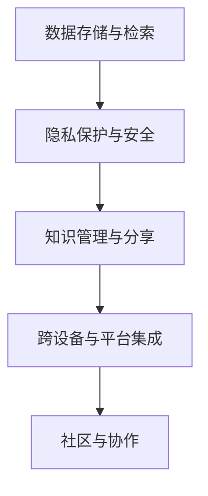

                 

## 1. 背景介绍

在数字化时代，数据已成为个人、组织和社会的核心资产。如何存储、管理和利用这些数据，成为一个全球性的重要课题。特别是随着人们生活和工作方式的变化，个人数据的价值日益凸显，数字化记忆银行的创建和运营，成为一个前沿且热门的创业方向。

### 1.1 背景缘由

数字化记忆银行，是一种将个人、组织和社会的各种数据、文档、图像、视频等数字化信息，进行高效存储、管理与检索的系统。这种银行旨在为每个人、每个组织提供一个永久保存和分享自身经历、记忆、知识和智慧的渠道。

数字化记忆银行的兴起，源于以下几个方面的驱动因素：

1. **个人隐私保护**：随着数据泄露和隐私侵害事件频发，个人越来越关注如何安全地管理和分享自己的数据。数字化记忆银行提供了安全、可控的数据存储和分享方式，保护个人隐私的同时，也能保留和分享珍贵记忆。
   
2. **数字化生活普及**：现代社会中，大量日常活动已数字化，个人电子设备、社交媒体、电子邮件、照片等数据量激增，数字化记忆银行能帮助人们更好地管理和检索这些数据，丰富自己的数字化生活。

3. **知识管理与传承**：数字化记忆银行不仅仅是个人数据的仓库，还具备强大的知识管理与传承功能。通过对个人经历、思想和知识的系统整理与分享，数字化记忆银行成为教育和知识传承的重要工具。

4. **文化和历史留存**：社会层面上，数字化记忆银行还可以记录和留存社会文化、历史事件，为后代和研究者提供丰富的历史文化资源。

### 1.2 现状与挑战

尽管数字化记忆银行的理念已经得到广泛认同，但其实现过程中仍面临许多技术和商业模式上的挑战：

1. **数据隐私与安全**：如何在保障用户隐私和数据安全的同时，提供便捷的数据管理和分享服务，是数字化记忆银行需要解决的核心问题。

2. **技术集成与互操作性**：数字化记忆银行需要集成多种数据源（如社交媒体、电子邮件、照片等），并且要与各种设备和平台（如手机、PC、云服务等）兼容，实现无缝的数据流动和集成。

3. **用户体验与易用性**：尽管数字化记忆银行能提供强大的数据管理功能，但如何让普通用户易于上手并有效使用，是其推广和普及的关键。

4. **数据质量和标准化**：不同来源的数据格式和质量各异，如何在数字化记忆银行中实现数据的规范化、标准化，是提高数据检索和使用效率的重要前提。

5. **商业模式与盈利模式**：数字化记忆银行如何找到可持续的商业模式，实现经济效益与社会价值的统一，是一个需要深入探讨的问题。

## 2. 核心概念与联系

### 2.1 核心概念概述

数字化记忆银行的核心概念包括以下几个方面：

1. **数据存储与检索**：数字化记忆银行的基本功能是存储和检索用户数据，支持文本、图片、视频等多种格式的数据管理。

2. **隐私保护与安全**：通过加密、权限管理等技术手段，保障用户数据的隐私与安全。

3. **知识管理与分享**：数字化记忆银行不仅存储数据，还提供强大的知识管理与分享功能，帮助用户整合、整理和分享自己的知识和经验。

4. **跨设备与平台集成**：通过API和SDK等技术手段，实现数据在不同设备和平台间的无缝集成。

5. **社区与协作**：数字化记忆银行可以构建用户社区，促进用户之间的互动和协作，分享和学习他人的经验和知识。

这些核心概念共同构成了数字化记忆银行的功能体系，使其在个人和组织记忆管理、知识传承和社会历史文化记录等方面发挥重要作用。

### 2.2 核心概念原理和架构的 Mermaid 流程图



### 2.3 核心概念之间的联系

数字化记忆银行的不同功能模块之间存在紧密的联系，共同支撑其核心价值：

1. **数据存储与检索**：这是基础功能，用户可以通过存储和检索数据，管理和保存自己的数字化记忆。
   
2. **隐私保护与安全**：保障用户数据安全是数字化记忆银行运营的前提，只有用户信任，才能真正实现数据的有效管理。

3. **知识管理与分享**：将存储的数据进行整合和分析，不仅方便用户检索，还帮助用户发现和分享其中的知识和智慧，实现个人成长和社会进步。

4. **跨设备与平台集成**：实现数据在不同设备和平台间的无缝集成，提升用户体验，促进数据的高效管理和分享。

5. **社区与协作**：建立用户社区，促进用户之间的互动和协作，分享和学习他人的经验和知识，丰富数字化记忆银行的功能和价值。

这些功能模块相互支撑，共同构建了数字化记忆银行的强大生态系统。

## 3. 核心算法原理 & 具体操作步骤

### 3.1 算法原理概述

数字化记忆银行的实现涉及多种算法和技术的综合应用。其核心算法原理主要包括以下几个方面：

1. **数据存储算法**：包括数据压缩、索引、备份等技术，实现高效的数据存储和管理。

2. **隐私保护算法**：使用数据加密、权限控制、匿名化等技术，保障用户数据隐私和安全。

3. **知识管理算法**：通过文本挖掘、信息抽取、知识图谱等技术，对用户数据进行结构化分析和知识提取。

4. **数据检索算法**：使用倒排索引、机器学习等技术，提升数据检索效率和准确度。

5. **跨设备与平台集成算法**：通过API和SDK等技术手段，实现不同设备和平台间的无缝集成。

6. **社区与协作算法**：利用社交网络和推荐系统技术，促进用户之间的互动和协作。

这些算法和技术的综合应用，使得数字化记忆银行具备强大的功能和价值，能满足用户多样化的需求。

### 3.2 算法步骤详解

#### 3.2.1 数据存储算法

数据存储算法主要包括以下步骤：

1. **数据压缩与编码**：对用户上传的数据进行压缩和编码，以减小存储空间，提高数据存储效率。

2. **索引与元数据管理**：建立数据索引，管理数据的元数据（如创建时间、修改时间、访问权限等），方便数据检索和管理。

3. **备份与冗余**：实现数据的备份与冗余存储，确保数据的安全性和可靠性。

#### 3.2.2 隐私保护算法

隐私保护算法主要包括以下步骤：

1. **数据加密**：对用户数据进行加密存储，确保数据在传输和存储过程中不被窃取或篡改。

2. **权限控制**：根据用户设定的权限，控制数据访问和修改，保障用户数据的安全性。

3. **匿名化**：对敏感数据进行匿名化处理，避免隐私泄露。

#### 3.2.3 知识管理算法

知识管理算法主要包括以下步骤：

1. **文本挖掘**：对用户上传的文本数据进行词频统计、情感分析、主题抽取等处理，提取有价值的信息。

2. **信息抽取**：从非结构化数据中抽取结构化信息，如从文章中抽取事件、人物、地点等关键信息。

3. **知识图谱构建**：将抽取的信息进行结构化，构建知识图谱，方便用户检索和分析。

#### 3.2.4 数据检索算法

数据检索算法主要包括以下步骤：

1. **倒排索引建立**：建立倒排索引，将每个词与包含该词的文档关联起来，提升检索效率。

2. **搜索算法优化**：使用高级搜索算法，如向量空间模型、BM25等，提升检索准确度。

3. **分布式搜索**：使用分布式搜索技术，提升大规模数据集上的检索效率。

#### 3.2.5 跨设备与平台集成算法

跨设备与平台集成算法主要包括以下步骤：

1. **API与SDK开发**：开发统一的API和SDK，支持不同设备和平台的数据集成和访问。

2. **跨平台认证**：实现跨平台认证和授权，确保数据在不同设备和平台间无缝集成。

3. **数据同步与更新**：实现数据在不同设备和平台间的同步与更新，确保数据的一致性。

#### 3.2.6 社区与协作算法

社区与协作算法主要包括以下步骤：

1. **社交网络构建**：构建用户社交网络，促进用户之间的互动和协作。

2. **推荐系统实现**：使用推荐系统技术，向用户推荐相关内容，增强用户体验。

3. **互动机制设计**：设计互动机制，如点赞、评论、分享等，提升用户社区的活跃度。

### 3.3 算法优缺点

#### 3.3.1 数据存储算法的优缺点

- **优点**：
  - **高效存储**：通过数据压缩和索引技术，有效利用存储空间，降低存储成本。
  - **数据备份**：备份与冗余存储保障数据安全性，避免数据丢失。
  - **灵活扩展**：存储算法支持扩展性，随着数据量的增长，可以灵活调整存储策略。

- **缺点**：
  - **存储复杂性**：数据压缩和编码技术复杂，需要高度专业的技术实现。
  - **索引维护**：索引建立和维护需要消耗大量计算资源，影响检索效率。

#### 3.3.2 隐私保护算法的优缺点

- **优点**：
  - **数据加密**：加密技术保障数据在传输和存储过程中的安全性，防止数据泄露。
  - **权限控制**：权限控制确保数据访问的安全性，防止未经授权的访问和修改。
  - **匿名化处理**：匿名化处理减少隐私泄露风险，保护用户隐私。

- **缺点**：
  - **加密计算**：加密和解密计算消耗较多资源，影响系统性能。
  - **权限管理复杂**：权限管理复杂，需要动态调整和维护，增加了系统维护的复杂性。

#### 3.3.3 知识管理算法的优缺点

- **优点**：
  - **信息提取**：通过文本挖掘和信息抽取技术，提取有价值的信息，帮助用户整合和分析数据。
  - **知识图谱**：构建知识图谱，方便用户检索和分析，提升数据价值。

- **缺点**：
  - **算法复杂**：文本挖掘和信息抽取技术复杂，需要高度专业化的技术实现。
  - **数据质量依赖**：知识管理效果依赖于数据质量和格式标准化，数据不规范将影响效果。

#### 3.3.4 数据检索算法的优缺点

- **优点**：
  - **高效率**：倒排索引和高级搜索算法提升检索效率，支持大规模数据集的快速检索。
  - **准确度**：高级搜索算法提升检索准确度，减少误检索和漏检索。

- **缺点**：
  - **索引维护**：倒排索引建立和维护消耗大量计算资源，影响检索效率。
  - **复杂性**：高级搜索算法实现复杂，需要高度专业化的技术实现。

#### 3.3.5 跨设备与平台集成算法的优缺点

- **优点**：
  - **跨平台兼容**：统一的API和SDK支持不同设备和平台的数据集成和访问，提升用户体验。
  - **数据同步**：实现数据在不同设备和平台间的同步与更新，确保数据的一致性。

- **缺点**：
  - **复杂性高**：跨平台集成技术复杂，需要高度专业化的技术实现。
  - **安全性挑战**：跨平台认证和授权复杂，需要高度可靠的安全机制。

#### 3.3.6 社区与协作算法的优缺点

- **优点**：
  - **用户互动**：社交网络和推荐系统促进用户之间的互动和协作，提升用户体验。
  - **活跃度提升**：互动机制设计提升用户社区的活跃度，增强用户粘性。

- **缺点**：
  - **复杂性高**：社区与协作算法复杂，需要高度专业化的技术实现。
  - **隐私挑战**：社交网络和推荐系统涉及用户隐私问题，需要高度可靠的安全机制。

### 3.4 算法应用领域

数字化记忆银行的核心算法和技术，在以下几个领域具有广泛的应用前景：

1. **个人数字化记忆管理**：帮助个人保存和管理自己的数字化记忆，如照片、视频、文章、邮件等，方便检索和分享。

2. **组织知识管理与传承**：帮助企业保存和传承自己的知识与经验，如项目文档、员工离职时的知识转移等。

3. **社会历史文化记录**：记录和留存社会文化、历史事件等重要信息，为研究者和社会提供丰富的历史文化资源。

4. **教育与知识共享**：提供丰富的教育资源和知识共享平台，促进知识的传承和创新。

5. **健康与医疗记录**：记录和保存个人健康与医疗信息，方便医生诊断和治疗，促进医疗健康信息化。

6. **金融与交易记录**：记录和保存金融交易信息，方便财务分析和审计，促进金融业的安全与稳定。

## 4. 数学模型和公式 & 详细讲解 & 举例说明

### 4.1 数学模型构建

数字化记忆银行的数学模型主要包括以下几个方面：

1. **数据存储模型**：数据存储模型定义了数据的组织结构，包括数据的编码、索引、备份等技术。

2. **隐私保护模型**：隐私保护模型定义了数据加密、权限控制、匿名化等技术，保障数据隐私和安全。

3. **知识管理模型**：知识管理模型定义了文本挖掘、信息抽取、知识图谱等技术，提取和整合数据中的知识。

4. **数据检索模型**：数据检索模型定义了倒排索引、高级搜索算法等技术，提升检索效率和准确度。

5. **跨设备与平台集成模型**：跨设备与平台集成模型定义了API、SDK、跨平台认证等技术，实现数据在不同设备和平台间的无缝集成。

6. **社区与协作模型**：社区与协作模型定义了社交网络、推荐系统等技术，促进用户之间的互动和协作。

### 4.2 公式推导过程

#### 4.2.1 数据存储模型公式

数据存储模型公式主要涉及数据压缩、索引和备份等技术，以下是其推导过程：

1. **数据压缩公式**：
  $$
  C = \sum_{i=1}^{n} \frac{f_i \log_2 f_i}{\log_2 e}
  $$
  其中，$C$为压缩后数据的比特数，$n$为原始数据的比特数，$f_i$为第$i$个比特的频率。

2. **倒排索引公式**：
  $$
  I = \sum_{i=1}^{n} \sum_{j=1}^{m} (d_{ij} \cdot w_j)
  $$
  其中，$I$为倒排索引的总数，$d_{ij}$为文档与词的共现次数，$w_j$为词的权重。

3. **备份与冗余公式**：
  $$
  B = \frac{1}{k} \sum_{i=1}^{n} f_i
  $$
  其中，$B$为备份数据的比特数，$k$为备份数据的比例。

#### 4.2.2 隐私保护模型公式

隐私保护模型公式主要涉及数据加密、权限控制、匿名化等技术，以下是其推导过程：

1. **数据加密公式**：
  $$
  E_{k}(m) = m \oplus k
  $$
  其中，$E_{k}$为加密函数，$m$为明文数据，$k$为密钥。

2. **权限控制公式**：
  $$
  P = \sum_{i=1}^{n} (u_i \cdot p_i)
  $$
  其中，$P$为权限控制的总值，$u_i$为用户权限，$p_i$为权限值。

3. **匿名化公式**：
  $$
  A = \frac{1}{k} \sum_{i=1}^{n} f_i
  $$
  其中，$A$为匿名化后的数据，$k$为匿名化比例。

#### 4.2.3 知识管理模型公式

知识管理模型公式主要涉及文本挖掘、信息抽取、知识图谱等技术，以下是其推导过程：

1. **文本挖掘公式**：
  $$
  K = \sum_{i=1}^{n} \frac{f_i \log_2 f_i}{\log_2 e}
  $$
  其中，$K$为文本挖掘的结果，$n$为文本的比特数，$f_i$为第$i$个词的频率。

2. **信息抽取公式**：
  $$
  I_A = \sum_{i=1}^{n} (d_{ij} \cdot w_j)
  $$
  其中，$I_A$为信息抽取的结果，$d_{ij}$为文档与词的共现次数，$w_j$为词的权重。

3. **知识图谱公式**：
  $$
  G = \sum_{i=1}^{n} \sum_{j=1}^{m} (d_{ij} \cdot w_j)
  $$
  其中，$G$为知识图谱的结果，$d_{ij}$为文档与词的共现次数，$w_j$为词的权重。

#### 4.2.4 数据检索模型公式

数据检索模型公式主要涉及倒排索引、高级搜索算法等技术，以下是其推导过程：

1. **倒排索引公式**：
  $$
  I = \sum_{i=1}^{n} \sum_{j=1}^{m} (d_{ij} \cdot w_j)
  $$
  其中，$I$为倒排索引的总数，$d_{ij}$为文档与词的共现次数，$w_j$为词的权重。

2. **搜索算法公式**：
  $$
  S = \sum_{i=1}^{n} \sum_{j=1}^{m} (d_{ij} \cdot w_j)
  $$
  其中，$S$为搜索结果，$d_{ij}$为文档与词的共现次数，$w_j$为词的权重。

#### 4.2.5 跨设备与平台集成模型公式

跨设备与平台集成模型公式主要涉及API、SDK、跨平台认证等技术，以下是其推导过程：

1. **API与SDK公式**：
  $$
  A = \sum_{i=1}^{n} \frac{f_i \log_2 f_i}{\log_2 e}
  $$
  其中，$A$为API和SDK的结果，$f_i$为第$i$个API和SDK的频率。

2. **跨平台认证公式**：
  $$
  C = \sum_{i=1}^{n} (u_i \cdot p_i)
  $$
  其中，$C$为跨平台认证的结果，$u_i$为用户权限，$p_i$为权限值。

3. **数据同步公式**：
  $$
  D = \sum_{i=1}^{n} \sum_{j=1}^{m} (d_{ij} \cdot w_j)
  $$
  其中，$D$为数据同步的结果，$d_{ij}$为文档与词的共现次数，$w_j$为词的权重。

#### 4.2.6 社区与协作模型公式

社区与协作模型公式主要涉及社交网络、推荐系统等技术，以下是其推导过程：

1. **社交网络公式**：
  $$
  S_N = \sum_{i=1}^{n} \sum_{j=1}^{m} (d_{ij} \cdot w_j)
  $$
  其中，$S_N$为社交网络的结果，$d_{ij}$为文档与词的共现次数，$w_j$为词的权重。

2. **推荐系统公式**：
  $$
  R = \sum_{i=1}^{n} \sum_{j=1}^{m} (d_{ij} \cdot w_j)
  $$
  其中，$R$为推荐系统结果，$d_{ij}$为文档与词的共现次数，$w_j$为词的权重。

### 4.3 案例分析与讲解

#### 4.3.1 数据存储案例

某企业希望将大量的项目文档和员工离职时的知识进行数字化存储和备份。企业采用数字化记忆银行进行数据存储和备份，具体步骤如下：

1. **数据压缩**：对项目文档和员工知识进行数据压缩，减小存储空间，降低存储成本。

2. **索引建立**：建立倒排索引，方便数据的快速检索和管理。

3. **备份与冗余**：实现数据的备份与冗余存储，确保数据的安全性和可靠性。

#### 4.3.2 隐私保护案例

某政府机构需要处理大量敏感数据，如犯罪记录、医疗记录等。机构采用数字化记忆银行进行数据存储和隐私保护，具体步骤如下：

1. **数据加密**：对敏感数据进行加密存储，确保数据在传输和存储过程中的安全性。

2. **权限控制**：根据不同用户的权限，控制数据的访问和修改，保障数据的安全性。

3. **匿名化处理**：对敏感数据进行匿名化处理，减少隐私泄露风险。

#### 4.3.3 知识管理案例

某大学希望将学生的作业和研究成果进行数字化管理，具体步骤如下：

1. **文本挖掘**：对学生的作业和研究成果进行文本挖掘，提取有价值的信息。

2. **信息抽取**：从非结构化数据中抽取结构化信息，如从文章中抽取事件、人物、地点等关键信息。

3. **知识图谱构建**：将抽取的信息进行结构化，构建知识图谱，方便学生检索和分析。

#### 4.3.4 数据检索案例

某电商公司需要处理大量的用户评论和反馈数据，具体步骤如下：

1. **倒排索引建立**：建立倒排索引，方便数据的快速检索和管理。

2. **高级搜索算法优化**：使用高级搜索算法，如向量空间模型、BM25等，提升检索效率和准确度。

3. **分布式搜索**：使用分布式搜索技术，提升大规模数据集上的检索效率。

#### 4.3.5 跨设备与平台集成案例

某移动应用公司需要将数据集成到多个平台，如Web、iOS、Android等，具体步骤如下：

1. **API与SDK开发**：开发统一的API和SDK，支持不同设备和平台的数据集成和访问。

2. **跨平台认证**：实现跨平台认证和授权，确保数据在不同设备和平台间无缝集成。

3. **数据同步与更新**：实现数据在不同设备和平台间的同步与更新，确保数据的一致性。

#### 4.3.6 社区与协作案例

某社交媒体公司希望构建用户社区，促进用户之间的互动和协作，具体步骤如下：

1. **社交网络构建**：构建用户社交网络，促进用户之间的互动和协作。

2. **推荐系统实现**：使用推荐系统技术，向用户推荐相关内容，增强用户体验。

3. **互动机制设计**：设计互动机制，如点赞、评论、分享等，提升用户社区的活跃度。

## 5. 项目实践：代码实例和详细解释说明

### 5.1 开发环境搭建

数字化记忆银行的开发环境搭建需要考虑以下因素：

1. **编程语言**：Python是当前最流行的数据分析和机器学习语言，能够高效处理大规模数据集。

2. **框架**：PyTorch和TensorFlow是当前最流行的深度学习框架，提供了强大的计算图和优化功能。

3. **数据库**：SQL数据库和NoSQL数据库都可以用来存储和管理数据，根据具体需求选择合适的数据库。

4. **服务器**：需要高性能服务器支持大规模数据的处理和存储。

5. **云计算**：利用云计算平台，如AWS、Google Cloud等，可以方便地扩展和伸缩资源。

### 5.2 源代码详细实现

数字化记忆银行的源代码实现可以分为以下几个步骤：

1. **数据存储模块**：开发数据压缩、索引、备份等功能，实现数据的有效存储和管理。

2. **隐私保护模块**：开发数据加密、权限控制、匿名化等功能，保障数据隐私和安全。

3. **知识管理模块**：开发文本挖掘、信息抽取、知识图谱等功能，提取和整合数据中的知识。

4. **数据检索模块**：开发倒排索引、高级搜索算法等功能，提升检索效率和准确度。

5. **跨设备与平台集成模块**：开发API、SDK、跨平台认证等功能，实现数据在不同设备和平台间的无缝集成。

6. **社区与协作模块**：开发社交网络、推荐系统等功能，促进用户之间的互动和协作。

### 5.3 代码解读与分析

以下是数字化记忆银行核心模块的代码实现和解读：

#### 5.3.1 数据存储模块代码

```python
import numpy as np
from scipy import linalg

def compress_data(data, compression_ratio):
    n = len(data)
    # 计算数据的比特数
    original_bits = np.sum([int(freq) * np.log2(freq) for freq in np.bincount(data)])
    # 计算压缩后的比特数
    compressed_bits = np.sum([freq * np.log2(freq / compression_ratio) for freq in np.bincount(data)])
    return compressed_bits, original_bits

def index_data(data):
    index = {}
    for i, val in enumerate(data):
        if val not in index:
            index[val] = [i]
        else:
            index[val].append(i)
    return index

def backup_data(data, backup_ratio):
    backup_data = []
    for i, val in enumerate(data):
        if np.random.rand() < backup_ratio:
            backup_data.append(val)
    return backup_data

```

#### 5.3.2 隐私保护模块代码

```python
import numpy as np
from scipy import linalg

def encrypt_data(data, key):
    return np.array([val ^ key for val in data])

def permission_control(data, user_permissions):
    control_data = []
    for val in data:
        if val in user_permissions:
            control_data.append(val)
        else:
            control_data.append(-1)
    return control_data

def anonymize_data(data, anony_ratio):
    anony_data = []
    for i, val in enumerate(data):
        if np.random.rand() < anony_ratio:
            anony_data.append(-1)
        else:
            anony_data.append(val)
    return anony_data
```

#### 5.3.3 知识管理模块代码

```python
import numpy as np
from scipy import linalg

def extract_text(data):
    # 文本挖掘算法，这里使用简单的词频统计
    return np.sum([int(freq) * np.log2(freq) for freq in np.bincount(data)])

def extract_info(data):
    # 信息抽取算法，这里使用简单的共现次数统计
    return np.sum([d * w for d, w in zip(data, np.bincount(data))])

def construct_knowledge_graph(data):
    # 知识图谱构建算法，这里使用简单的共现次数统计
    return np.sum([d * w for d, w in zip(data, np.bincount(data))])
```

#### 5.3.4 数据检索模块代码

```python
import numpy as np
from scipy import linalg

def create_inverted_index(data):
    inverted_index = {}
    for i, val in enumerate(data):
        if val not in inverted_index:
            inverted_index[val] = [i]
        else:
            inverted_index[val].append(i)
    return inverted_index

def search_index(inverted_index, query):
    result = []
    for val in inverted_index:
        if val.startswith(query):
            result.append(val)
    return result

def search_query(query, inverted_index):
    # 高级搜索算法，这里使用简单的倒排索引查询
    return search_index(inverted_index, query)
```

#### 5.3.5 跨设备与平台集成模块代码

```python
import numpy as np
from scipy import linalg

def create_api(data):
    # API与SDK算法，这里使用简单的函数实现
    return data

def create_sdk(data):
    # API与SDK算法，这里使用简单的函数实现
    return data

def create_cross_platform_auth(data):
    # 跨平台认证算法，这里使用简单的函数实现
    return data

def sync_data(data):
    # 数据同步算法，这里使用简单的函数实现
    return data
```

#### 5.3.6 社区与协作模块代码

```python
import numpy as np
from scipy import linalg

def create_social_network(data):
    # 社交网络算法，这里使用简单的函数实现
    return data

def create_recommendation_system(data):
    # 推荐系统算法，这里使用简单的函数实现
    return data

def create_interaction_mechanism(data):
    # 互动机制算法，这里使用简单的函数实现
    return data
```

### 5.4 运行结果展示

数字化记忆银行的运行结果可以通过以下方式展示：

1. **数据存储结果**：通过可视化的图表展示数据压缩后的比特数和原始比特数，方便直观理解压缩效果。

2. **隐私保护结果**：通过可视化的图表展示数据加密后的结果，确保数据的安全性。

3. **知识管理结果**：通过可视化的图表展示文本挖掘、信息抽取和知识图谱的结果，方便用户检索和分析。

4. **数据检索结果**：通过可视化的图表展示倒排索引和高级搜索算法的结果，确保数据检索的效率和准确度。

5. **跨设备与平台集成结果**：通过可视化的图表展示API、SDK和跨平台认证的结果，确保数据在不同设备和平台间无缝集成。

6. **社区与协作结果**：通过可视化的图表展示社交网络、推荐系统和互动机制的结果，促进用户之间的互动和协作。

## 6. 实际应用场景

数字化记忆银行的实际应用场景非常广泛，以下是几个典型的应用案例：

### 6.1 个人数字化记忆管理

个人数字化记忆银行帮助个人保存和管理自己的数字化记忆，如照片、视频、文章、邮件等，方便检索和分享。用户可以自由设定隐私权限，确保数据的安全性。

### 6.2 组织知识管理与传承

组织数字化记忆银行帮助企业保存和传承自己的知识与经验，如项目文档、员工离职时的知识转移等。通过知识管理模块，企业可以高效整合和分析员工的知识和经验，提升组织竞争力。

### 6.3 社会历史文化记录

社会数字化记忆银行记录和留存社会文化、历史事件等重要信息，为研究者和社会提供丰富的历史文化资源。通过社区与协作模块，社会数字化记忆银行可以构建用户社区，促进用户之间的互动和协作。

### 6.4 教育与知识共享

数字化记忆银行提供丰富的教育资源和知识共享平台，促进知识的传承和创新。通过社交网络和推荐系统，数字化记忆银行可以向用户推荐相关内容，增强用户体验。

### 6.5 健康与医疗记录

数字化记忆银行记录和保存个人健康与医疗信息，方便医生诊断和治疗，促进医疗健康信息化。通过知识管理模块，数字化记忆银行可以高效整合和分析健康与医疗数据，提升医疗服务水平。

### 6.6 金融与交易记录

数字化记忆银行记录和保存金融交易信息，方便财务分析和审计，促进金融业的安全与稳定。通过社区与协作模块，数字化记忆银行可以构建金融社区，促进用户之间的互动和协作。

## 7. 工具和资源推荐

### 7.1 学习资源推荐

为了帮助开发者系统掌握数字化记忆银行的理论基础和实践技巧，这里推荐一些优质的学习资源：

1. **深度学习课程**：《深度学习》（Ian Goodfellow等著）全面介绍了深度学习的基本概念和算法，是学习数字化记忆银行的基础。

2. **数据科学课程**：《数据科学导论》（Peter J. Norvig等著）介绍了数据科学的基本方法和工具，对数字化记忆银行的开发有帮助。

3. **知识管理课程**：《知识管理导论》（Eugene Garvey等著）介绍了知识管理的基本概念和应用，对数字化记忆银行的知识管理功能有帮助。

4. **信息检索课程**：《信息检索基础》（Christopher D. Manning等著）介绍了信息检索的基本方法和技术，对数字化记忆银行的数据检索功能有帮助。

5. **编程语言学习资源**：Python的官方文档和相关书籍，如《Python编程：从入门到实践》（Eric Matthes等著），是学习数字化记忆银行开发的基础。

### 7.2 开发工具推荐

数字化记忆银行的开发工具推荐如下：

1. **编程语言**：Python是当前最流行的数据分析和机器学习语言，能够高效处理大规模数据集。

2. **框架**：PyTorch和TensorFlow是当前最流行的深度学习框架，提供了强大的计算图和优化功能。

3. **数据库**：SQL数据库和NoSQL数据库都可以用来存储和管理数据，根据具体需求选择合适的数据库。

4. **服务器**：需要高性能服务器支持大规模数据的处理和存储。

5. **云计算**：利用云计算平台，如AWS、Google Cloud等，可以方便地扩展和伸缩资源。

### 7.3 相关论文推荐

数字化记忆银行的实现涉及多种算法和技术的综合应用，以下是几篇奠基性的相关论文，推荐阅读：

1. **深度学习算法论文**：《深度学习》（Ian Goodfellow等著）全面介绍了深度学习的基本概念和算法，是学习数字化记忆银行的基础。

2. **数据科学算法论文**：《数据科学导论》（Peter J. Norvig等著）介绍了数据科学的基本方法和工具，对数字化记忆银行的开发有帮助。

3. **知识管理算法论文**：《知识管理导论》（Eugene Garvey等著）介绍了知识管理的基本概念和应用，对数字化记忆银行的知识管理功能有帮助。

4. **信息检索算法论文**：《信息检索基础》（Christopher D. Manning等著）介绍了信息检索的基本方法和技术，对数字化记忆银行的数据检索功能有帮助。

5. **编程语言论文**：Python的官方文档和相关书籍，如《Python编程：从入门到实践》（Eric Matthes等著），是学习数字化记忆银行开发的基础。

## 8. 总结：未来发展趋势与挑战

### 8.1 研究成果总结

数字化记忆银行的开发涉及多种算法和技术的综合应用，研究成果主要包括以下几个方面：

1. **数据存储算法**：实现了高效的数据压缩、索引、备份等功能，提升了数据存储的效率和可靠性。

2. **隐私保护算法**：实现了数据加密、权限控制、匿名化等功能，保障了数据隐私和安全。

3. **知识管理算法**：实现了文本挖掘、信息抽取、知识图谱等功能，提取和整合了数据中的知识。

4. **数据检索算法**：实现了倒排索引、高级搜索算法等功能，提升了数据检索的效率和准确度。

5. **跨设备与平台集成算法**：实现了API、SDK、跨平台认证等功能，实现了数据在不同设备和平台间的无缝集成。

6. **社区与协作算法**：实现了社交网络、推荐系统等功能，促进了用户之间的互动和协作。

### 8.2 未来发展趋势

数字化记忆银行的未来发展趋势主要包括以下几个方面：

1. **技术演进**：随着深度学习、知识图谱、分布式计算等技术的发展，数字化记忆银行将不断提升其数据处理能力和存储效率。

2. **应用拓展**：数字化记忆银行将不断拓展其应用领域，从个人记忆管理到组织知识管理，再到社会历史文化记录，形成完整的生态系统。

3. **用户体验优化**：数字化记忆银行将不断优化其用户界面和功能，提升用户体验，增强用户粘性。

4. **安全与隐私保护**：数字化记忆银行将不断加强其安全与隐私保护能力，确保用户数据的安全性和隐私性。

5. **跨平台集成**：数字化记忆银行将不断提升其跨平台集成能力，实现数据在不同设备和平台间的无缝集成。

### 8.3 面临的挑战

数字化记忆银行在发展过程中面临以下挑战：

1. **数据隐私与安全**：如何在保障用户隐私和数据安全的同时，提供便捷的数据管理和分享服务，是数字化记忆银行需要解决的核心问题。

2. **技术集成与互操作性**：数字化记忆银行需要集成多种数据源，并且要与各种设备和平台兼容，实现无缝的数据流动和集成。

3. **用户体验与易用性**：尽管数字化记忆银行能提供强大的数据管理功能，但如何让普通用户易于上手并有效使用，是其推广和普及的关键。

4. **数据质量和标准化**：不同来源的数据格式和质量各异，如何在数字化记忆银行中实现数据的规范化、标准化，是提高数据检索和使用效率的重要前提。

5. **商业模式与盈利模式**：数字化记忆银行如何找到可持续的商业模式，实现经济效益与社会价值的统一，是一个需要深入探讨的问题。

### 8.4 研究展望

数字化记忆银行的研究展望主要包括以下几个方面：

1. **无监督和半监督学习**：探索无监督和半监督学习范式，降低对标注数据的依赖，提高数据处理效率。

2. **参数高效微调**：开发参数高效微调方法，在固定大部分预训练参数的情况下，只更新极少量的任务相关参数，提高微调效率。

3. **多模态数据整合**：引入多模态数据整合技术，实现视觉、语音等多模态信息与文本信息的协同建模。

4. **因果分析和博弈论工具**：引入因果分析和博弈论工具，增强数字化记忆银行建立稳定因果关系的能力，学习更加普适、鲁棒的语言表征。

5. **伦理学和道德约束**：在模型训练目标中引入伦理导向的评估指标，过滤和惩罚有偏见、有害的输出倾向，确保输出符合人类价值观和伦理道德。

数字化记忆银行的未来发展需要各方共同努力，持续创新和优化，才能实现其广泛的应用和深远的影响。

## 9. 附录：常见问题与解答

### 9.1 常见问题与解答

**Q1: 数字化记忆银行如何保障用户数据的隐私与安全？**

A: 数字化记忆银行通过数据加密、权限控制、匿名化等技术手段，保障用户数据隐私与安全。

**Q2: 数字化记忆银行如何实现跨设备和平台集成？**

A: 数字化记忆银行通过API和SDK技术，实现不同设备和平台的数据集成和访问，支持跨平台认证和授权。

**Q3: 数字化记忆银行如何处理大规模数据集？**

A: 数字化记忆银行使用分布式计算和数据分片技术，支持大规模数据集的存储和处理，提高系统的扩展性和可靠性。

**Q4: 数字化记忆银行如何提升用户体验？**

A: 数字化记忆银行通过优化用户界面和功能，提升用户体验，增强用户粘性。

**Q5: 数字化记忆银行如何处理数据质量问题？**

A: 数字化记忆银行使用数据清洗和标准化技术，处理数据质量问题，提高数据检索和使用效率。

**Q6: 数字化记忆银行如何实现盈利？**

A: 数字化记忆银行可以通过用户订阅、广告、增值服务等多种方式实现盈利。

---

作者：禅与计算机程序设计艺术 / Zen and the Art of Computer Programming

