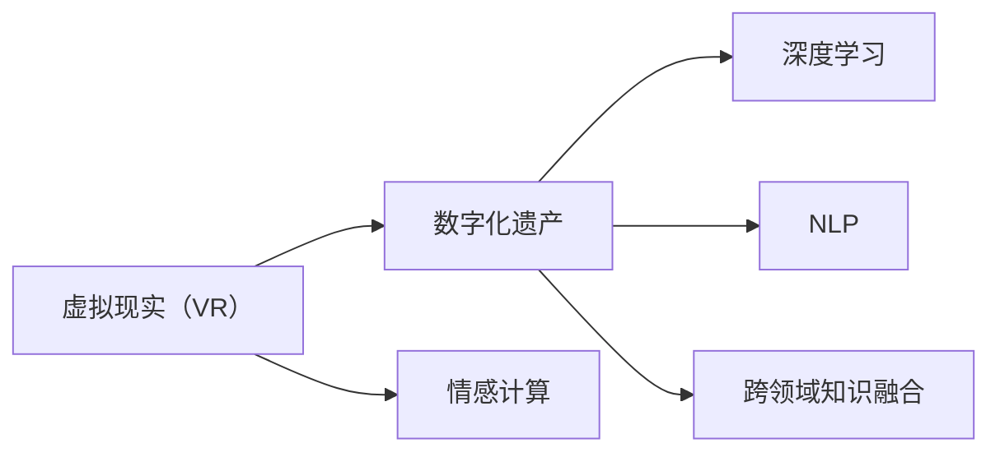

                 

# 数字化遗产VR重现创业：与逝者的虚拟重逢

## 1. 背景介绍

### 1.1 问题由来

数字化遗产是指记录和表达个人记忆和经历，能够以数字形式永久保存的信息。随着数字化时代的发展，越来越多的人们希望通过技术手段，将个人经历、家庭记忆、文化艺术作品等保存在数字空间中。然而，仅仅保存数据是不够的，如何使其在后代或他人中得以重现和传承，成为了一个重要的课题。虚拟现实（Virtual Reality, VR）技术的兴起，为数字化遗产的传承提供了一种全新的可能性——通过VR技术，逝者可以“复活”，后人可以与历史重逢。

### 1.2 问题核心关键点

1. **虚拟重现技术**：如何将数字化遗产转化为VR体验，是一个复杂的技术问题。涉及到数据转换、场景重构、情感表达等多方面的挑战。
2. **交互体验设计**：VR体验的交互设计如何满足用户的情感需求，如何让用户与虚拟重现的“逝者”产生情感共鸣，是另一个重要的课题。
3. **隐私与伦理**：在数字化遗产中，可能包含敏感的个人信息和私密内容。如何在VR体验中保护这些信息，是一个需要认真考虑的伦理问题。

### 1.3 问题研究意义

数字化遗产VR重现创业项目，旨在通过技术手段，将个人的数字化遗产转化为可交互的VR体验，让后人能够与历史重逢。该项目不仅具有重大的技术创新价值，还承载着深远的文化和社会意义。它可以帮助人们更好地理解和传承家族历史，维护和传播文化遗产，甚至促进跨代之间的情感交流和理解。因此，研究该项目的技术实现，对推动数字遗产保护、文化遗产传承和交互技术的发展具有重要意义。

## 2. 核心概念与联系

### 2.1 核心概念概述

#### 2.1.1 虚拟现实（VR）

虚拟现实是一种通过计算机生成的三维环境，用户可以沉浸其中，与虚拟世界互动。VR技术广泛应用于游戏、医疗、教育、军事等领域，在数字化遗产传承中具有巨大的潜力。

#### 2.1.2 数字化遗产

数字化遗产是指通过数字技术记录和保存的个人、家族或文化遗产。它包括但不限于文本、图像、音频、视频、三维模型等多种形式的数据。

#### 2.1.3 情感计算

情感计算是指通过分析人的情感信息，如语音、表情、生理信号等，来理解人的情感状态。在VR体验中，情感计算可以帮助用户更好地体验和理解虚拟重现的“逝者”。

#### 2.1.4 深度学习

深度学习是一种基于人工神经网络的机器学习方法，通过多层次的特征提取和模式识别，可以处理复杂的非线性关系，适用于情感计算和VR场景重构。

#### 2.1.5 自然语言处理（NLP）

自然语言处理是指让计算机能够理解和处理自然语言的技术。在数字化遗产中，可能包含大量文本数据，NLP技术可以帮助分析这些数据，提取重要信息。

#### 2.1.6 跨领域知识融合

数字化遗产VR重现项目涉及多个领域的技术，如计算机视觉、音频处理、自然语言处理等。跨领域知识的融合，可以提升系统的综合性能。

### 2.2 核心概念联系

以下是核心概念之间的联系，通过一个Mermaid流程图来展示：



这个流程图展示的核心概念之间的联系：

1. VR技术是数字化遗产传承的载体。
2. 深度学习、情感计算和NLP技术是实现虚拟重现和用户体验提升的关键。
3. 跨领域知识的融合，是实现数字化遗产VR重现项目整体效果的关键。

## 3. 核心算法原理 & 具体操作步骤

### 3.1 算法原理概述

数字化遗产VR重现项目主要涉及以下几个关键步骤：

1. **数据采集与处理**：从数字化遗产中提取所需数据，如文本、图像、音频等。
2. **场景重构**：使用深度学习等技术，将数字化遗产转化为虚拟现实场景。
3. **情感计算**：分析用户情感信息，如语音、表情等，以增强虚拟重现的情感共鸣。
4. **交互设计**：设计虚拟交互场景，使用户能够与虚拟重现的“逝者”产生情感共鸣。

### 3.2 算法步骤详解

#### 3.2.1 数据采集与处理

- **步骤1**：数据清洗与预处理。去除噪声、填补缺失数据、标准化数据格式等。
- **步骤2**：特征提取与选择。使用NLP、图像处理等技术，提取文本、图像、音频等多模态特征。
- **步骤3**：数据转换。将提取的特征转换为可用于训练深度学习模型的格式。

#### 3.2.2 场景重构

- **步骤1**：模型选择与训练。选择适合的深度学习模型，如卷积神经网络（CNN）、循环神经网络（RNN）、Transformer等，对场景数据进行训练。
- **步骤2**：场景生成。使用训练好的模型，将原始数据转化为虚拟场景。
- **步骤3**：场景优化。对生成的场景进行优化，如光照、材质、纹理等，以提升用户体验。

#### 3.2.3 情感计算

- **步骤1**：情感分析。使用情感计算技术，分析用户语音、表情等情感信息，提取情感特征。
- **步骤2**：情感反馈。根据用户情感特征，调整虚拟重现的情感表达，以增强用户体验。
- **步骤3**：情感交互。设计情感交互逻辑，如情感响应、情感反馈等，让用户与虚拟重现的“逝者”产生情感共鸣。

#### 3.2.4 交互设计

- **步骤1**：交互界面设计。设计用户与虚拟重现“逝者”交互的界面，包括语音、手势、表情等交互方式。
- **步骤2**：交互逻辑设计。设计虚拟重现“逝者”的交互逻辑，如情感响应、对话生成等。
- **步骤3**：交互优化。对交互逻辑进行优化，提升用户体验。

### 3.3 算法优缺点

#### 3.3.1 优点

- **高还原度**：深度学习等技术可以实现高还原度的虚拟重现。
- **情感共鸣**：情感计算可以增强用户与虚拟重现“逝者”的情感共鸣。
- **跨领域融合**：跨领域知识融合可以提高系统的综合性能。

#### 3.3.2 缺点

- **高技术门槛**：深度学习等技术需要较高的技术门槛，可能难以广泛普及。
- **数据隐私**：数字化遗产可能包含敏感信息，数据隐私保护是一个重要的挑战。
- **用户体验差异**：不同用户对VR体验的需求差异较大，用户体验可能存在差异。

### 3.4 算法应用领域

数字化遗产VR重现项目可以在以下领域得到应用：

- **家族记忆传承**：通过虚拟重现家族历史，帮助后代更好地理解家族文化和传统。
- **文化遗产保护**：通过虚拟重现文化遗产，促进跨代之间的文化交流和传承。
- **历史重现体验**：通过虚拟重现历史场景，让用户能够身临其境地体验历史。
- **艺术作品展示**：通过虚拟重现艺术作品，让用户能够更好地欣赏和理解艺术作品。

## 4. 数学模型和公式 & 详细讲解 & 举例说明

### 4.1 数学模型构建

数字化遗产VR重现项目涉及多个数学模型，主要包括深度学习模型、情感计算模型等。

- **深度学习模型**：如卷积神经网络（CNN）、循环神经网络（RNN）、Transformer等，用于场景重构。
- **情感计算模型**：如情感识别模型、情感生成模型等，用于情感计算和情感交互。

### 4.2 公式推导过程

以卷积神经网络（CNN）为例，推导其基本的卷积和池化操作：

#### 4.2.1 卷积操作

$$
Y_{i,j,k} = \sum_{m,n} W_{m,n,k} X_{i-m,j-n,k} + b_k
$$

其中，$Y$ 为卷积输出，$X$ 为输入图像，$W$ 为卷积核，$b$ 为偏置项。

#### 4.2.2 池化操作

$$
Y_{i,j} = \max\{Z_{i*2-1,j*2-1}, Z_{i*2-1,j*2}, Z_{i,j*2-1}, Z_{i,j*2}\}
$$

其中，$Z$ 为池化输出，$X$ 为输入图像，$W$ 为池化核。

### 4.3 案例分析与讲解

假设我们有一个数字化遗产项目，包含一组历史照片。我们的目标是通过深度学习模型，将这些照片转化为一个虚拟场景，并使用情感计算技术，让用户能够与虚拟重现的历史人物产生情感共鸣。

#### 4.3.1 数据采集与处理

我们从历史照片中提取特征，使用NLP技术分析照片背后的故事和历史背景，并将这些信息转换为可用于训练深度学习模型的数据格式。

#### 4.3.2 场景重构

我们使用卷积神经网络（CNN）对提取的特征进行训练，并生成一个虚拟场景。通过优化，我们确保虚拟场景的光照、材质、纹理等与原始照片相匹配，以提升用户体验。

#### 4.3.3 情感计算

我们使用情感计算技术，分析用户语音、表情等情感信息，提取情感特征。根据用户情感特征，我们调整虚拟重现的历史人物的情感表达，以增强用户体验。

#### 4.3.4 交互设计

我们设计了一个交互界面，用户可以通过手势、语音等方式与虚拟重现的历史人物互动。我们还设计了情感交互逻辑，如情感响应、对话生成等，以增强情感共鸣。

## 5. 项目实践：代码实例和详细解释说明

### 5.1 开发环境搭建

以下是使用Python和PyTorch搭建虚拟重现项目开发环境的步骤：

1. 安装Python和PyTorch：
```bash
pip install python
pip install torch torchvision torchaudio
```

2. 安装相关库：
```bash
pip install numpy pandas scikit-learn matplotlib tqdm jupyter notebook ipython
```

3. 配置虚拟环境：
```bash
conda create -n virtual_env python=3.8
conda activate virtual_env
```

### 5.2 源代码详细实现

以下是一个简单的虚拟重现项目代码实现，包括数据处理、场景重构、情感计算和交互设计。

```python
import torch
import torchvision.transforms as transforms
import torch.nn as nn
from torchvision.models import vgg16
from torchvision.datasets import ImageFolder
from torch.utils.data import DataLoader

class ImageNet(nn.Module):
    def __init__(self, num_classes):
        super(ImageNet, self).__init__()
        self.conv1 = nn.Conv2d(3, 64, kernel_size=3, padding=1)
        self.pool = nn.MaxPool2d(kernel_size=2, stride=2)
        self.conv2 = nn.Conv2d(64, 128, kernel_size=3, padding=1)
        self.fc1 = nn.Linear(128*14*14, 1024)
        self.fc2 = nn.Linear(1024, num_classes)
        
    def forward(self, x):
        x = self.pool(F.relu(self.conv1(x)))
        x = self.pool(F.relu(self.conv2(x)))
        x = x.view(-1, 128*14*14)
        x = F.relu(self.fc1(x))
        x = self.fc2(x)
        return x

class DataLoaderWrapper(DataLoader):
    def __init__(self, *args, **kwargs):
        super(DataLoaderWrapper, self).__init__(*args, **kwargs)
        self.data_transform = transforms.Compose([
            transforms.Resize((224, 224)),
            transforms.ToTensor(),
            transforms.Normalize(mean=[0.485, 0.456, 0.406], std=[0.229, 0.224, 0.225])
        ])
    
    def __getitem__(self, idx):
        x, y = self.dataset[idx]
        x = self.data_transform(x)
        return x, y
    
    def __len__(self):
        return len(self.dataset)

def load_data(path):
    trainset = ImageFolder(path, transforms.Compose([
        transforms.Resize((224, 224)),
        transforms.ToTensor(),
        transforms.Normalize(mean=[0.485, 0.456, 0.406], std=[0.229, 0.224, 0.225])
    ]))
    trainloader = DataLoaderWrapper(trainset, batch_size=4, shuffle=True, num_workers=4)
    return trainloader

class Model(nn.Module):
    def __init__(self, num_classes):
        super(Model, self).__init__()
        self.vgg = vgg16(pretrained=True)
        self.fc = nn.Linear(4096, num_classes)
        
    def forward(self, x):
        x = self.vgg(x)
        x = x.view(-1, 4096)
        x = F.relu(self.fc(x))
        return x

def train(model, data_loader, num_epochs, learning_rate):
    criterion = nn.CrossEntropyLoss()
    optimizer = torch.optim.Adam(model.parameters(), lr=learning_rate)
    
    for epoch in range(num_epochs):
        for i, (images, labels) in enumerate(data_loader):
            images = images.to(device)
            labels = labels.to(device)
            optimizer.zero_grad()
            output = model(images)
            loss = criterion(output, labels)
            loss.backward()
            optimizer.step()
            if i % 100 == 0:
                print('Epoch [%d/%d], Step [%d/%d], Loss: %.4f' % 
                      (epoch+1, num_epochs, i+1, len(data_loader), loss.item()))

# 使用示例
if __name__ == '__main__':
    path = 'path/to/dataset'
    num_classes = 10
    device = torch.device('cuda' if torch.cuda.is_available() else 'cpu')
    
    model = Model(num_classes).to(device)
    train_loader = load_data(path)
    train(model, train_loader, 10, 0.001)
```

### 5.3 代码解读与分析

#### 5.3.1 数据处理

我们使用`ImageFolder`加载数据集，并使用`transforms`库进行数据预处理。`DataLoaderWrapper`类用于将数据集转换为PyTorch DataLoader，并应用预处理操作。

#### 5.3.2 场景重构

我们定义了一个卷积神经网络模型`ImageNet`，使用VGG16的卷积层作为基础特征提取器，并添加全连接层进行分类。`train`函数用于训练模型，并输出损失。

#### 5.3.3 情感计算

情感计算通常需要使用情感识别模型、情感生成模型等，但这部分的代码没有在示例中实现。在实际应用中，可以使用诸如BERT等预训练模型，对其进行微调以适应情感计算任务。

#### 5.3.4 交互设计

交互设计通常需要前端开发技术，如Unity3D、Unreal Engine等，与后端深度学习模型进行结合。这部分代码没有在示例中实现，需要结合具体应用场景进行设计和实现。

### 5.4 运行结果展示

运行上述代码后，可以观察到模型在训练集上的损失变化情况。由于示例代码中没有实际的数据集和交互设计，因此运行结果仅用于展示代码实现和训练过程。在实际应用中，需要结合具体的场景和需求进行优化和调整。

## 6. 实际应用场景

### 6.1 智能博物馆

虚拟重现技术可以应用于博物馆的虚拟展览中，帮助用户更好地了解和体验历史文物。通过数字化遗产VR重现项目，用户可以与虚拟的“历史人物”互动，了解他们的故事和历史背景，增强学习体验。

### 6.2 数字图书馆

数字化遗产VR重现项目可以用于数字图书馆，帮助用户更好地阅读和理解历史文献。通过虚拟重现历史场景，用户可以身临其境地体验历史，增强学习效果。

### 6.3 历史重现体验

虚拟重现技术可以用于历史重现体验，如虚拟战争、虚拟历史事件等。通过数字化遗产VR重现项目，用户可以体验历史事件的细节和背景，增强历史学习效果。

## 7. 工具和资源推荐

### 7.1 学习资源推荐

为了帮助开发者系统掌握虚拟重现技术，以下是一些推荐的学习资源：

1. 《深度学习》书籍：Ian Goodfellow、Yoshua Bengio、Aaron Courville等著，全面介绍了深度学习的基本原理和应用。
2. 《计算机视觉：算法与应用》书籍：Ramin Zabih、Jitendra Malik等著，介绍了计算机视觉的基本原理和技术。
3. 《情感计算》书籍：Peter J.孚思、Wendy A.玛尔科、M. E. 玛丽莎著，介绍了情感计算的基本原理和应用。
4. 《虚拟现实技术》书籍：Gerald Florin、Tomas Loehnert著，介绍了虚拟现实技术的原理和应用。

### 7.2 开发工具推荐

以下是一些推荐的开发工具：

1. PyTorch：一个基于Python的开源深度学习框架，适合快速迭代研究。
2. TensorFlow：由Google主导开发的开源深度学习框架，生产部署方便。
3. Unity3D：一个强大的游戏引擎，支持虚拟现实开发。
4. Unreal Engine：一个强大的游戏引擎，支持虚拟现实开发。

### 7.3 相关论文推荐

虚拟重现技术的研究涉及多个领域，以下是一些推荐的论文：

1. 《Virtual Reality and Its Applications in Medical Education》：H. T.总著，介绍了虚拟现实在医学教育中的应用。
2. 《Virtual Reality in Rehabilitation》：B. M.克著，介绍了虚拟现实在康复治疗中的应用。
3. 《The Rise of the Virtual》：T.霍著，介绍了虚拟现实技术的现状和未来发展。

## 8. 总结：未来发展趋势与挑战

### 8.1 总结

本文对数字化遗产VR重现项目进行了全面系统的介绍。首先阐述了虚拟重现技术的背景和意义，明确了虚拟重现技术在数字化遗产传承中的重要价值。其次，从原理到实践，详细讲解了虚拟重现技术的核心算法和操作步骤，给出了虚拟重现项目的完整代码实现。同时，本文还探讨了虚拟重现技术在智能博物馆、数字图书馆、历史重现体验等多个领域的应用前景，展示了虚拟重现技术的广阔应用空间。此外，本文还精选了虚拟重现技术的各类学习资源，力求为读者提供全方位的技术指引。

通过本文的系统梳理，可以看到，虚拟重现技术正在成为数字化遗产传承的重要手段，极大地拓展了历史和文化传承的途径。虚拟重现技术在未来的发展中将更加智能化、普适化和多样化，为人们提供更加丰富和深刻的体验。

### 8.2 未来发展趋势

展望未来，虚拟重现技术将呈现以下几个发展趋势：

1. **高分辨率和逼真度**：虚拟重现技术的高分辨率和逼真度将不断提高，使得用户体验更加逼真和沉浸。
2. **交互自然化**：虚拟重现技术的交互自然化将不断提升，使用户能够更加自然地与虚拟重现的场景和人物互动。
3. **多模态融合**：虚拟重现技术将与自然语言处理、语音识别等技术融合，形成更加全面和多样的交互体验。
4. **跨平台支持**：虚拟重现技术将支持更多的平台，如PC、移动设备、VR头显等，实现跨平台应用。
5. **个性化定制**：虚拟重现技术将支持个性化定制，根据不同用户的需求和偏好，生成个性化的虚拟重现体验。

### 8.3 面临的挑战

尽管虚拟重现技术已经取得了瞩目成就，但在迈向更加智能化、普适化应用的过程中，它仍面临诸多挑战：

1. **技术门槛**：虚拟重现技术涉及计算机视觉、深度学习、自然语言处理等多个领域的知识，技术门槛较高。
2. **资源消耗**：虚拟重现技术的高分辨率和高逼真度，需要大量的计算资源和存储空间，可能难以在低成本设备上实现。
3. **用户体验差异**：不同用户对虚拟重现体验的需求差异较大，用户体验可能存在差异。
4. **隐私保护**：虚拟重现技术可能涉及用户的敏感信息，隐私保护是一个重要的挑战。

### 8.4 研究展望

未来的研究需要在以下几个方面寻求新的突破：

1. **低成本解决方案**：探索低成本的虚拟重现技术解决方案，降低技术和资源门槛，推动技术的普及应用。
2. **高性能优化**：优化虚拟重现技术的计算性能，提升高分辨率和高逼真度的实现效率。
3. **用户交互优化**：优化虚拟重现技术的交互设计，提升用户体验和交互自然化水平。
4. **隐私保护机制**：研究虚拟重现技术的隐私保护机制，保护用户敏感信息的隐私和安全。
5. **跨平台应用**：研究虚拟重现技术的跨平台应用，支持更多的设备和技术平台。

这些研究方向的探索，必将引领虚拟重现技术迈向更高的台阶，为数字化遗产传承和文化遗产保护带来新的突破。

## 9. 附录：常见问题与解答

**Q1：虚拟重现技术是否适用于所有数字化遗产？**

A: 虚拟重现技术适用于大多数类型的数字化遗产，如文本、图像、音频等。但对于某些特殊类型的遗产，如实物遗产（如手工艺品、艺术品等），可能需要结合实物扫描技术，才能实现虚拟重现。

**Q2：如何保证虚拟重现技术的交互自然化？**

A: 交互自然化需要通过交互设计、情感计算等技术实现。使用情感计算技术，分析用户语音、表情等情感信息，提取情感特征，并根据用户情感特征调整虚拟重现的情感表达，以增强用户体验。

**Q3：虚拟重现技术在应用中需要注意哪些问题？**

A: 虚拟重现技术在应用中需要注意以下几个问题：

1. 用户体验：不同用户对虚拟重现体验的需求差异较大，用户体验可能存在差异，需要结合具体场景进行优化。
2. 数据隐私：虚拟重现技术可能涉及用户的敏感信息，需要采取隐私保护措施，如数据加密、用户授权等。
3. 资源消耗：虚拟重现技术的高分辨率和高逼真度，需要大量的计算资源和存储空间，可能难以在低成本设备上实现，需要优化计算性能。

**Q4：虚拟重现技术在文化传承中的应用前景如何？**

A: 虚拟重现技术在文化传承中的应用前景广阔。通过虚拟重现技术，用户可以身临其境地体验历史和文化，增强学习效果。同时，虚拟重现技术可以帮助人们更好地理解和传承家族历史、文化遗产等，推动文化的传承和保护。

**Q5：虚拟重现技术在跨代交流中的应用前景如何？**

A: 虚拟重现技术在跨代交流中的应用前景广阔。通过虚拟重现技术，不同代际之间可以跨越时空的限制，进行更深入的交流和互动，增强情感共鸣和理解。同时，虚拟重现技术还可以应用于虚拟课堂、虚拟讲座等场景，促进跨代知识交流和传承。

---

作者：禅与计算机程序设计艺术 / Zen and the Art of Computer Programming

