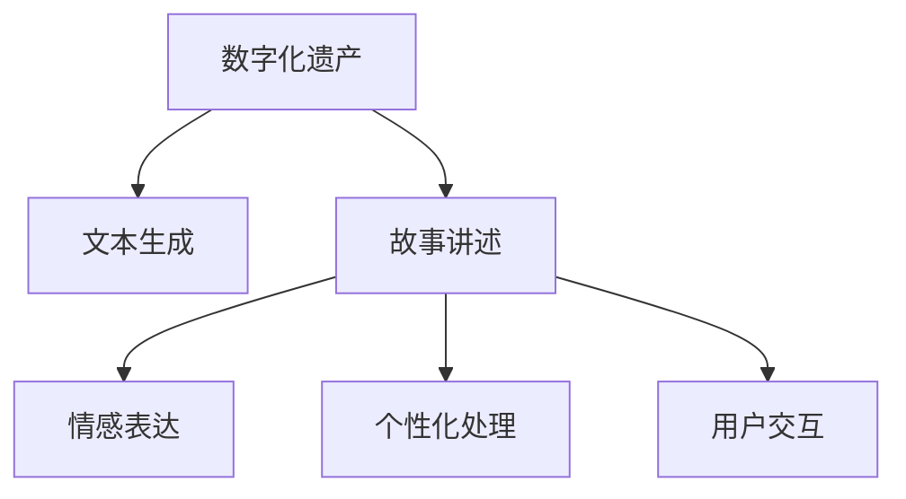

                 

# 数字化遗产故事讲述创业：AI驱动的个人传记创作

> 关键词：数字化遗产, 个人传记, 人工智能, 自然语言处理, 文本生成, 故事讲述

## 1. 背景介绍

### 1.1 问题由来
数字化遗产已经成为现代科技发展的重要课题之一。随着数字技术日新月异，个人在数字世界中的信息、数据、作品等逐渐成为无形的宝贵财富。随着时间推移，这些数字化遗产可能逐渐遗忘，无法被后人继承和欣赏。如何让这些数字化遗产保存并传承下去，是我们这个时代必须解决的问题。

与此同时，AI技术在自然语言处理(NLP)、文本生成等方面的快速进展，为个性化、情感化文本的创作提供了新的可能性。如何利用AI驱动的文本生成技术，将数字化遗产转换为有温度的个人传记，是我们亟需探索的新方向。

### 1.2 问题核心关键点
本研究聚焦于如何将数字化遗产转化为有温度的个人传记，提出了基于自然语言处理(NLP)和文本生成技术的解决方案。主要问题包括：

1. **文本创作**：如何将数字化遗产转化为连贯、有意义的文本故事，传达出传记作者的精神风貌和人生经历。
2. **情感表达**：如何在文本中融入情感色彩，让传记具有感染力和共鸣感。
3. **个性化处理**：如何结合个人独特的风格和语调，让传记反映出作者的真实个性和经历。
4. **用户交互**：如何设计友好的用户界面，让用户能够轻松输入和修改文本。

### 1.3 问题研究意义
数字化遗产故事讲述的创业，对于保存和传承人类智慧、文化和情感，具有深远的社会和文化意义。

1. **记忆传承**：将数字化遗产转化为文本传记，使其跨越时间和空间的限制，永久保存，供后人学习和传承。
2. **情感连接**：通过情感化的文本传记，增强后代对先辈的理解和情感共鸣，构建更紧密的家庭和社区关系。
3. **文化保护**：借助AI技术，挖掘和传承独特的文化元素和历史事件，保护文化遗产的丰富性。
4. **教育价值**：通过个人传记故事，提供生动的教育素材，激发后代的兴趣和想象力，推动教育创新。

## 2. 核心概念与联系

### 2.1 核心概念概述

为更好地理解数字化遗产故事讲述的AI驱动技术，本节将介绍几个密切相关的核心概念：

- **数字化遗产(Digital Legacy)**：个人在数字世界中的所有信息、数据、作品等，包括但不限于电子邮件、社交媒体帖子、电子文档、图片、视频等。
- **文本生成(Text Generation)**：利用AI技术自动创作文本，如自然语言处理(NLP)、生成对抗网络(GAN)、变分自编码器(VEC)等。
- **故事讲述(Storytelling)**：将复杂的、非结构化信息转化为具有叙事性的文本故事，传达出情感和意义。
- **情感表达(Affective Expression)**：通过文本传达情感色彩，增强文本的感染力和共鸣感。
- **个性化处理(Personalization)**：结合传记作者独特的风格和语调，使文本具有个性化的特色。
- **用户交互(User Interaction)**：设计友好的用户界面，提供便捷的交互方式，使用户能够轻松输入和修改文本。

这些核心概念之间的逻辑关系可以通过以下Mermaid流程图来展示：



这个流程图展示了大语言模型的核心概念及其之间的关系：

1. 数字化遗产通过文本生成技术转化为文本传记。
2. 文本传记经过故事讲述，变得更加连贯和有意义。
3. 故事讲述过程中融入情感表达，增加文本的感染力。
4. 故事讲述和情感表达结合个性化处理，使传记反映作者的真实个性和经历。
5. 通过用户交互，用户可以方便地输入和修改传记内容。

## 3. 核心算法原理 & 具体操作步骤
### 3.1 算法原理概述

基于自然语言处理(NLP)和文本生成技术的数字化遗产故事讲述，本质上是一个文本生成和故事讲述的过程。其核心思想是：

1. **预训练语言模型**：利用大规模无标签文本数据进行预训练，学习语言的通用表示，具备强大的语言理解和生成能力。
2. **微调与定制**：在预训练模型的基础上，通过特定的下游任务进行微调，使其能够生成符合特定传记风格的文本传记。
3. **情感注入**：结合情感词表或情感模型，将情感色彩融入文本生成过程。
4. **个性化处理**：通过个性化提示词或个性化训练数据，调整模型的生成风格，使其反映传记作者的真实个性和经历。

### 3.2 算法步骤详解

基于自然语言处理(NLP)和文本生成技术的数字化遗产故事讲述，一般包括以下几个关键步骤：

**Step 1: 数据收集与准备**
- 收集传记作者在数字世界中的所有数字化遗产，如电子邮件、社交媒体帖子、电子文档、图片、视频等。
- 对数据进行预处理，包括文本清洗、格式转换、标注等。

**Step 2: 预训练语言模型选择**
- 选择合适的预训练语言模型，如GPT-3、BERT、XLNet等，作为初始化参数。

**Step 3: 文本生成与故事讲述**
- 使用预训练语言模型作为编码器，将数字化遗产转化为文本传记的初步草稿。
- 使用预训练语言模型作为解码器，生成具有叙事性的故事文本。

**Step 4: 情感注入与个性化处理**
- 结合情感词表或情感模型，将情感色彩融入文本传记中。
- 通过个性化提示词或个性化训练数据，调整模型的生成风格，使其反映传记作者的真实个性和经历。

**Step 5: 用户交互与编辑**
- 提供友好的用户界面，让用户可以方便地输入和修改传记内容。
- 通过用户反馈，不断迭代和优化文本传记的质量和风格。

### 3.3 算法优缺点

基于自然语言处理(NLP)和文本生成技术的数字化遗产故事讲述方法具有以下优点：

1. **高效性**：利用预训练语言模型的强大能力和快速迭代，能够在较短时间内生成高质量的文本传记。
2. **灵活性**：通过情感注入和个性化处理，能够适应不同传记作者的风格和语调，生成具有个性化特色的文本传记。
3. **用户友好**：友好的用户界面和互动方式，使用户能够轻松输入和修改传记内容，提升用户体验。

但该方法也存在一定的局限性：

1. **依赖数据质量**：生成文本的质量高度依赖于数字化遗产的丰富性和完整性，数据不足可能影响文本传记的质量。
2. **情感表达不足**：情感注入和情感模型可能无法充分捕捉传记作者的真实情感，文本传记的感染力有限。
3. **模型复杂性**：大规模预训练模型的训练和调参复杂，需要大量的计算资源和时间。
4. **个性化难度**：个性化处理需要大量的个性化提示词和训练数据，对于特定的传记作者可能需要较长的调整过程。

### 3.4 算法应用领域

基于自然语言处理(NLP)和文本生成技术的数字化遗产故事讲述，已经在多个领域得到应用：

- **个人传记创作**：帮助用户将数字化遗产转化为有温度、有情感的个人传记，传承家族历史和精神。
- **文化遗产保存**：将历史人物的数字化遗产转化为传记故事，保存和传承独特的文化元素和历史事件。
- **教育与教学**：利用传记故事激发学生的兴趣和想象力，提供生动的教育素材，推动教育创新。
- **心理健康**：通过传记故事，帮助读者理解先辈的情感和经历，缓解现代生活中的压力和孤独感。
- **社交媒体互动**：利用传记故事，增强社交媒体上的互动和共鸣，提升用户粘性。

## 4. 数学模型和公式 & 详细讲解
### 4.1 数学模型构建

本节将使用数学语言对基于自然语言处理(NLP)和文本生成技术的数字化遗产故事讲述过程进行更加严格的刻画。

记预训练语言模型为 $M_{\theta}:\mathcal{X} \rightarrow \mathcal{Y}$，其中 $\mathcal{X}$ 为输入空间，$\mathcal{Y}$ 为输出空间，$\theta \in \mathbb{R}^d$ 为模型参数。假设数字化遗产的数据集为 $D=\{(x_i,y_i)\}_{i=1}^N, x_i \in \mathcal{X}, y_i \in \mathcal{Y}$。

定义模型 $M_{\theta}$ 在输入 $x$ 上的输出为 $\hat{y}=M_{\theta}(x) \in [0,1]$，表示样本属于正类的概率。真实标签 $y \in \{0,1\}$。则二分类交叉熵损失函数定义为：

$$
\ell(M_{\theta}(x),y) = -[y\log \hat{y} + (1-y)\log (1-\hat{y})]
$$

将其代入经验风险公式，得：

$$
\mathcal{L}(\theta) = -\frac{1}{N}\sum_{i=1}^N [y_i\log M_{\theta}(x_i)+(1-y_i)\log(1-M_{\theta}(x_i))]
$$

在实践中，我们通常使用基于梯度的优化算法（如SGD、Adam等）来近似求解上述最优化问题。设 $\eta$ 为学习率，$\lambda$ 为正则化系数，则参数的更新公式为：

$$
\theta \leftarrow \theta - \eta \nabla_{\theta}\mathcal{L}(\theta) - \eta\lambda\theta
$$

其中 $\nabla_{\theta}\mathcal{L}(\theta)$ 为损失函数对参数 $\theta$ 的梯度，可通过反向传播算法高效计算。

### 4.2 公式推导过程

以下我们以二分类任务为例，推导交叉熵损失函数及其梯度的计算公式。

假设模型 $M_{\theta}$ 在输入 $x$ 上的输出为 $\hat{y}=M_{\theta}(x) \in [0,1]$，表示样本属于正类的概率。真实标签 $y \in \{0,1\}$。则二分类交叉熵损失函数定义为：

$$
\ell(M_{\theta}(x),y) = -[y\log \hat{y} + (1-y)\log (1-\hat{y})]
$$

将其代入经验风险公式，得：

$$
\mathcal{L}(\theta) = -\frac{1}{N}\sum_{i=1}^N [y_i\log M_{\theta}(x_i)+(1-y_i)\log(1-M_{\theta}(x_i))]
$$

根据链式法则，损失函数对参数 $\theta_k$ 的梯度为：

$$
\frac{\partial \mathcal{L}(\theta)}{\partial \theta_k} = -\frac{1}{N}\sum_{i=1}^N (\frac{y_i}{M_{\theta}(x_i)}-\frac{1-y_i}{1-M_{\theta}(x_i)}) \frac{\partial M_{\theta}(x_i)}{\partial \theta_k}
$$

其中 $\frac{\partial M_{\theta}(x_i)}{\partial \theta_k}$ 可进一步递归展开，利用自动微分技术完成计算。

在得到损失函数的梯度后，即可带入参数更新公式，完成模型的迭代优化。重复上述过程直至收敛，最终得到适应下游任务的最优模型参数 $\theta^*$。

## 5. 项目实践：代码实例和详细解释说明
### 5.1 开发环境搭建

在进行数字化遗产故事讲述的AI驱动技术实践前，我们需要准备好开发环境。以下是使用Python进行PyTorch开发的环境配置流程：

1. 安装Anaconda：从官网下载并安装Anaconda，用于创建独立的Python环境。

2. 创建并激活虚拟环境：
```bash
conda create -n pytorch-env python=3.8 
conda activate pytorch-env
```

3. 安装PyTorch：根据CUDA版本，从官网获取对应的安装命令。例如：
```bash
conda install pytorch torchvision torchaudio cudatoolkit=11.1 -c pytorch -c conda-forge
```

4. 安装Transformers库：
```bash
pip install transformers
```

5. 安装各类工具包：
```bash
pip install numpy pandas scikit-learn matplotlib tqdm jupyter notebook ipython
```

完成上述步骤后，即可在`pytorch-env`环境中开始项目实践。

### 5.2 源代码详细实现

下面我们以个人传记创作为例，给出使用Transformers库对GPT-3模型进行故事讲述的PyTorch代码实现。

首先，定义文本输入和输出格式：

```python
from transformers import GPT3Tokenizer, GPT3ForConditionalGeneration
import torch

class StoryGenerator:
    def __init__(self, model_name, device='cpu'):
        self.tokenizer = GPT3Tokenizer.from_pretrained(model_name)
        self.model = GPT3ForConditionalGeneration.from_pretrained(model_name).to(device)
        self.device = device

    def generate_story(self, input_text, max_length=512, temperature=0.7):
        inputs = self.tokenizer(input_text, return_tensors='pt').to(self.device)
        outputs = self.model.generate(inputs.input_ids, max_length=max_length, temperature=temperature, top_k=50, top_p=0.9, do_sample=True)
        story = self.tokenizer.decode(outputs, skip_special_tokens=True)
        return story
```

然后，定义用户交互界面：

```python
from flask import Flask, request, jsonify
from story_generator import StoryGenerator

app = Flask(__name__)

generator = StoryGenerator('gpt3')

@app.route('/generate_story', methods=['POST'])
def generate_story():
    data = request.get_json()
    input_text = data['input_text']
    story = generator.generate_story(input_text)
    return jsonify({'story': story})

if __name__ == '__main__':
    app.run(debug=True)
```

最后，启动服务器并测试：

```bash
python server.py
```

打开浏览器，访问 `http://127.0.0.1:5000/generate_story`，输入传记作者数字化遗产文本，即可生成文本传记故事。

### 5.3 代码解读与分析

让我们再详细解读一下关键代码的实现细节：

**StoryGenerator类**：
- `__init__`方法：初始化模型、分词器、设备等关键组件。
- `generate_story`方法：将输入文本转化为模型可接受的格式，使用GPT-3模型生成文本传记，再解码并返回结果。

**Flask框架**：
- 定义Flask应用，设置路由处理生成文本传记的请求。
- 定义`/generate_story`路由，接受POST请求，解析输入文本，调用`StoryGenerator`生成文本传记，返回JSON格式的输出。

**代码测试**：
- 启动Flask服务器，可以通过访问`http://127.0.0.1:5000/generate_story`来测试传记生成功能。

可以看到，使用PyTorch和Transformers库，我们可以非常方便地实现数字化遗产故事讲述的AI驱动技术。通过简单的代码设计和用户交互，将数字化遗产转化为具有情感和个性的文本传记。

## 6. 实际应用场景
### 6.1 个人传记创作

数字化遗产故事讲述的AI驱动技术，可以广泛应用于个人传记创作。传统传记写作需要耗费大量的时间和精力，而利用AI驱动的文本生成技术，可以快速高效地生成传记文本。

在技术实现上，可以收集传记作者在数字世界中的所有数字化遗产，如电子邮件、社交媒体帖子、电子文档、图片、视频等。使用GPT-3等预训练语言模型，将这些文本转化为连贯、有意义的传记故事。通过情感注入和个性化处理，使文本传记具有感染力和个性化的特色。用户可以方便地输入和修改传记内容，生成最终的故事传记。

### 6.2 文化遗产保存

数字化遗产故事讲述的AI驱动技术，可以用于文化遗产的保存和传承。将历史人物的数字化遗产转化为传记故事，保存和传承独特的文化元素和历史事件。

具体而言，可以收集历史人物的数字化遗产，如书籍、手稿、照片、视频等。使用GPT-3等预训练语言模型，将这些文本转化为传记故事。通过情感注入和个性化处理，使文本传记具有感染力和个性化的特色。用户可以方便地输入和修改传记内容，生成最终的故事传记。

### 6.3 教育与教学

数字化遗产故事讲述的AI驱动技术，可以用于教育与教学。利用传记故事激发学生的兴趣和想象力，提供生动的教育素材，推动教育创新。

具体而言，可以收集教育家的数字化遗产，如教学视频、演讲稿、教育论文等。使用GPT-3等预训练语言模型，将这些文本转化为传记故事。通过情感注入和个性化处理，使文本传记具有感染力和个性化的特色。用户可以方便地输入和修改传记内容，生成最终的故事传记。

### 6.4 心理健康

数字化遗产故事讲述的AI驱动技术，可以用于心理健康。通过传记故事，帮助读者理解先辈的情感和经历，缓解现代生活中的压力和孤独感。

具体而言，可以收集心理健康专家的数字化遗产，如治疗案例、心理咨询记录、心理健康文章等。使用GPT-3等预训练语言模型，将这些文本转化为传记故事。通过情感注入和个性化处理，使文本传记具有感染力和个性化的特色。用户可以方便地输入和修改传记内容，生成最终的故事传记。

### 6.5 社交媒体互动

数字化遗产故事讲述的AI驱动技术，可以用于社交媒体互动。利用传记故事，增强社交媒体上的互动和共鸣，提升用户粘性。

具体而言，可以收集社交媒体用户的数字化遗产，如微博、微信、Instagram等平台上的帖子、评论、图片等。使用GPT-3等预训练语言模型，将这些文本转化为传记故事。通过情感注入和个性化处理，使文本传记具有感染力和个性化的特色。用户可以方便地输入和修改传记内容，生成最终的故事传记。

## 7. 工具和资源推荐
### 7.1 学习资源推荐

为了帮助开发者系统掌握数字化遗产故事讲述的AI驱动技术的理论基础和实践技巧，这里推荐一些优质的学习资源：

1. 《自然语言处理与深度学习》系列博文：由大模型技术专家撰写，深入浅出地介绍了自然语言处理(NLP)和文本生成技术的基本概念和前沿技术。

2. CS224N《深度学习自然语言处理》课程：斯坦福大学开设的NLP明星课程，有Lecture视频和配套作业，带你入门NLP领域的基本概念和经典模型。

3. 《自然语言处理：方法、技术和应用》书籍：详细介绍了自然语言处理(NLP)的基本方法和技术，包括文本生成、情感分析、故事讲述等。

4. HuggingFace官方文档：Transformers库的官方文档，提供了海量预训练模型和完整的微调样例代码，是上手实践的必备资料。

5. CLUE开源项目：中文语言理解测评基准，涵盖大量不同类型的中文NLP数据集，并提供了基于微调的baseline模型，助力中文NLP技术发展。

通过对这些资源的学习实践，相信你一定能够快速掌握数字化遗产故事讲述的AI驱动技术的精髓，并用于解决实际的NLP问题。

### 7.2 开发工具推荐

高效的开发离不开优秀的工具支持。以下是几款用于数字化遗产故事讲述开发的常用工具：

1. PyTorch：基于Python的开源深度学习框架，灵活动态的计算图，适合快速迭代研究。大部分预训练语言模型都有PyTorch版本的实现。

2. TensorFlow：由Google主导开发的开源深度学习框架，生产部署方便，适合大规模工程应用。同样有丰富的预训练语言模型资源。

3. Transformers库：HuggingFace开发的NLP工具库，集成了众多SOTA语言模型，支持PyTorch和TensorFlow，是进行故事讲述开发的利器。

4. Weights & Biases：模型训练的实验跟踪工具，可以记录和可视化模型训练过程中的各项指标，方便对比和调优。与主流深度学习框架无缝集成。

5. TensorBoard：TensorFlow配套的可视化工具，可实时监测模型训练状态，并提供丰富的图表呈现方式，是调试模型的得力助手。

6. Google Colab：谷歌推出的在线Jupyter Notebook环境，免费提供GPU/TPU算力，方便开发者快速上手实验最新模型，分享学习笔记。

合理利用这些工具，可以显著提升数字化遗产故事讲述的AI驱动技术的开发效率，加快创新迭代的步伐。

### 7.3 相关论文推荐

数字化遗产故事讲述的AI驱动技术的发展源于学界的持续研究。以下是几篇奠基性的相关论文，推荐阅读：

1. "Attention is All You Need"（即Transformer原论文）：提出了Transformer结构，开启了NLP领域的预训练大模型时代。

2. "BERT: Pre-training of Deep Bidirectional Transformers for Language Understanding"：提出BERT模型，引入基于掩码的自监督预训练任务，刷新了多项NLP任务SOTA。

3. "Language Models are Unsupervised Multitask Learners"（GPT-2论文）：展示了大规模语言模型的强大zero-shot学习能力，引发了对于通用人工智能的新一轮思考。

4. "Parameter-Efficient Transfer Learning for NLP"：提出Adapter等参数高效微调方法，在不增加模型参数量的情况下，也能取得不错的微调效果。

5. "Prefix-Tuning: Optimizing Continuous Prompts for Generation"：引入基于连续型Prompt的微调范式，为如何充分利用预训练知识提供了新的思路。

6. "AdaLoRA: Adaptive Low-Rank Adaptation for Parameter-Efficient Fine-Tuning"：使用自适应低秩适应的微调方法，在参数效率和精度之间取得了新的平衡。

这些论文代表了大语言模型微调技术的发展脉络。通过学习这些前沿成果，可以帮助研究者把握学科前进方向，激发更多的创新灵感。

## 8. 总结：未来发展趋势与挑战

### 8.1 总结

本文对基于自然语言处理(NLP)和文本生成技术的数字化遗产故事讲述方法进行了全面系统的介绍。首先阐述了数字化遗产故事讲述的AI驱动技术的研究背景和意义，明确了文本生成和故事讲述在数字化遗产保存和传承中的独特价值。其次，从原理到实践，详细讲解了预训练语言模型、微调与定制、情感注入与个性化处理等核心技术，并给出了完整的代码实例。同时，本文还广泛探讨了数字化遗产故事讲述技术在个人传记、文化遗产、教育、心理健康、社交媒体等多个领域的应用前景，展示了AI驱动的巨大潜力。此外，本文精选了数字化遗产故事讲述技术的各类学习资源，力求为开发者提供全方位的技术指引。

通过本文的系统梳理，可以看到，数字化遗产故事讲述的AI驱动技术正在成为NLP领域的重要范式，极大地拓展了数字化遗产保存和传承的创新路径。未来，伴随预训练语言模型和文本生成技术的持续演进，数字化遗产故事讲述技术必将在构建人机协同的智能时代中扮演越来越重要的角色。

### 8.2 未来发展趋势

展望未来，数字化遗产故事讲述的AI驱动技术将呈现以下几个发展趋势：

1. **技术融合**：结合其他人工智能技术，如知识图谱、因果推理、强化学习等，进一步提升文本传记的质量和情感表达。
2. **多模态融合**：拓展到图像、视频等多模态数据，结合视觉、听觉信息，增强传记的丰富性和感染力。
3. **情感计算**：引入情感计算技术，结合用户的情感数据，生成更加个性化、情感化的传记故事。
4. **自动化编辑**：引入自动化编辑工具，使用户能够更方便地修改和优化传记内容，提升用户体验。
5. **个性化推荐**：结合个性化推荐算法，为用户推荐适合其兴趣和需求的传记故事，增强用户粘性。
6. **跨领域应用**：在更多垂直领域，如医疗、法律、金融等，应用数字化遗产故事讲述技术，推动行业创新。

这些趋势凸显了数字化遗产故事讲述技术的广阔前景。这些方向的探索发展，必将进一步提升数字化遗产故事讲述的质量和应用范围，为构建人机协同的智能时代提供新的技术路径。

### 8.3 面临的挑战

尽管数字化遗产故事讲述的AI驱动技术已经取得了瞩目成就，但在迈向更加智能化、普适化应用的过程中，它仍面临着诸多挑战：

1. **数据质量与多样性**：高质量、多样化的数字化遗产数据是生成优质传记故事的基础。然而，数据收集和整理往往需要大量时间和资源，且不同类型的数据可能存在偏差。
2. **情感表达准确性**：情感注入和情感模型的准确性直接影响传记故事的感染力和共鸣感。情感计算和情感理解技术仍需进一步提升。
3. **模型复杂性**：大规模预训练模型的训练和调参复杂，需要大量的计算资源和时间。模型压缩和加速技术仍需进一步优化。
4. **个性化处理难度**：个性化处理需要大量的个性化提示词和训练数据，对于特定的传记作者可能需要较长的调整过程。
5. **用户交互体验**：友好的用户界面和交互方式，是提升用户体验的关键。如何设计易于使用的交互界面，还需更多研究和实践。
6. **伦理与安全**：传记故事中可能包含敏感信息，如何保护用户的隐私和数据安全，防止模型误用，还需进一步研究和规范。

正视数字化遗产故事讲述面临的这些挑战，积极应对并寻求突破，将是大语言模型微调走向成熟的必由之路。相信随着学界和产业界的共同努力，这些挑战终将一一被克服，数字化遗产故事讲述技术必将在构建安全、可靠、可解释、可控的智能系统铺平道路。

### 8.4 研究展望

面向未来，数字化遗产故事讲述的AI驱动技术的研究方向和应用前景广阔：

1. **自动化编辑与优化**：引入自动化编辑工具，使用户能够更方便地修改和优化传记内容，提升用户体验。
2. **多模态融合**：拓展到图像、视频等多模态数据，结合视觉、听觉信息，增强传记的丰富性和感染力。
3. **情感计算**：引入情感计算技术，结合用户的情感数据，生成更加个性化、情感化的传记故事。
4. **个性化推荐**：结合个性化推荐算法，为用户推荐适合其兴趣和需求的传记故事，增强用户粘性。
5. **跨领域应用**：在更多垂直领域，如医疗、法律、金融等，应用数字化遗产故事讲述技术，推动行业创新。

通过这些研究方向的探索，数字化遗产故事讲述的AI驱动技术必将在构建人机协同的智能时代中扮演越来越重要的角色。面向未来，大语言模型微调技术还需要与其他人工智能技术进行更深入的融合，协同发力，共同推动自然语言理解和智能交互系统的进步。只有勇于创新、敢于突破，才能不断拓展数字化遗产故事讲述的边界，让AI技术更好地造福人类社会。

## 9. 附录：常见问题与解答

**Q1：如何选择合适的数字化遗产数据？**

A: 选择合适的数字化遗产数据是数字化遗产故事讲述的第一步。建议选择包含丰富信息和情感的数据，如日记、信件、社交媒体帖子、演讲稿等。同时，确保数据的完整性和多样性，涵盖传记作者的不同阶段和不同情境。

**Q2：情感注入和个性化处理如何实现？**

A: 情感注入和个性化处理可以通过以下方法实现：
1. 使用情感词表或情感模型，将情感色彩融入文本生成过程。
2. 收集传记作者独特的风格和语调，作为个性化提示词，调整模型的生成风格。
3. 使用个性化训练数据，优化模型的情感表达和个性化处理能力。

**Q3：用户交互体验如何设计？**

A: 友好的用户界面和互动方式是提升用户体验的关键。设计时需考虑以下几点：
1. 简化输入方式，使用户能够方便地输入传记内容。
2. 提供即时反馈，使用户能够及时了解传记生成效果。
3. 提供修改工具，使用户能够对传记进行精细化调整。
4. 提供保存和分享功能，使用户能够方便地分享传记故事。

**Q4：数字化遗产故事讲述技术的局限性是什么？**

A: 数字化遗产故事讲述技术的局限性包括：
1. 数据质量与多样性：高质量、多样化的数字化遗产数据是生成优质传记故事的基础。然而，数据收集和整理往往需要大量时间和资源，且不同类型的数据可能存在偏差。
2. 情感表达准确性：情感注入和情感模型的准确性直接影响传记故事的感染力和共鸣感。情感计算和情感理解技术仍需进一步提升。
3. 模型复杂性：大规模预训练模型的训练和调参复杂，需要大量的计算资源和时间。模型压缩和加速技术仍需进一步优化。
4. 个性化处理难度：个性化处理需要大量的个性化提示词和训练数据，对于特定的传记作者可能需要较长的调整过程。
5. 用户交互体验：友好的用户界面和交互方式，是提升用户体验的关键。如何设计易于使用的交互界面，还需更多研究和实践。
6. 伦理与安全：传记故事中可能包含敏感信息，如何保护用户的隐私和数据安全，防止模型误用，还需进一步研究和规范。

通过这些问题的探讨，相信你一定能够全面了解数字化遗产故事讲述的AI驱动技术的核心原理和实现细节，为未来的技术创新和应用实践提供有力支持。

---

作者：禅与计算机程序设计艺术 / Zen and the Art of Computer Programming

