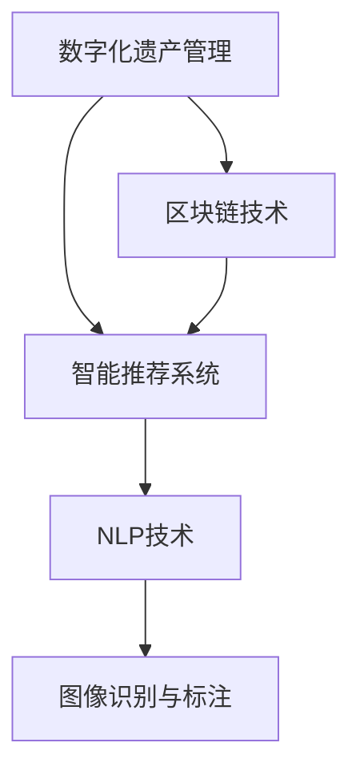
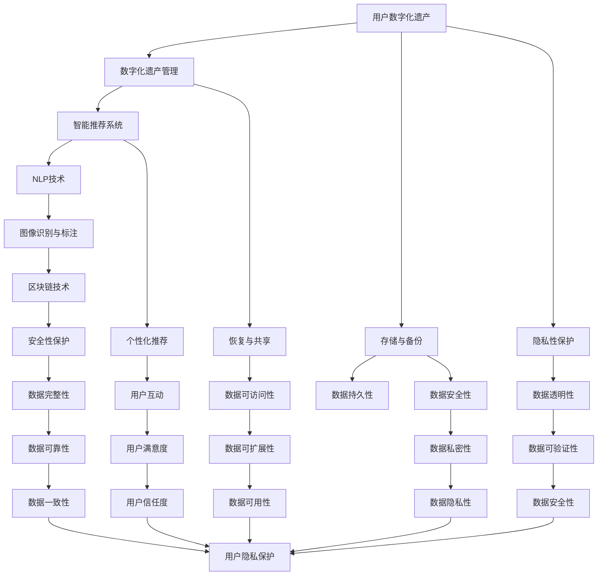

                 

# 数字化遗产虚拟助手创业：AI驱动的个人历史顾问

## 1. 背景介绍

### 1.1 问题由来

随着数字化时代的到来，人们越来越多地将个人生活中的重要信息存储在数字平台上，如电子邮件、社交媒体、照片、视频等。然而，如何管理和保护这些数字化遗产，使其在未来得以完整地传承给后代，成为困扰当代人的难题。

数字化遗产不仅记录了个人的生活轨迹，还承载了家庭的历史记忆和情感价值。因此，保护和传承数字化遗产，不应仅仅被视为一种技术问题，更是一项具有社会和文化意义的挑战。

### 1.2 问题核心关键点

数字化遗产保护涉及数据管理、数据备份、数据恢复、数据共享等多个环节，需要综合应用人工智能、大数据、云计算、区块链等技术。其中，AI驱动的个人历史顾问系统（Personal History Advisor，PHA）是数字化遗产保护的重要工具之一。

PHA系统利用人工智能技术，从大量的数字化信息中筛选出具有重要历史价值的内容，构建个人历史档案。通过智能推荐和自动标注技术，PHA系统帮助用户管理和传承数字化遗产，确保其完整性和可理解性。

PHA系统的核心在于其智能化的信息处理和推荐算法。该系统通过学习用户的历史行为和偏好，动态调整推荐的数字化遗产内容，使得用户能够持续地发现和重温有价值的历史记忆。

### 1.3 问题研究意义

PHA系统的研发和应用，对数字化遗产保护具有重要意义：

1. **自动化管理**：通过自动化工具，PHA系统可以高效管理用户数字化遗产，减少人为错误和疏漏。
2. **智能化推荐**：基于用户历史行为和偏好，PHA系统能够提供个性化的数字化遗产推荐，帮助用户发现和重温有价值的历史内容。
3. **可理解性提升**：通过自然语言处理（NLP）和图像识别等技术，PHA系统能够自动识别和标注数字化遗产中的重要信息，提升其可读性和可用性。
4. **安全保护**：采用区块链等技术，PHA系统能够确保数字化遗产的安全性和隐私性，防止信息泄露和篡改。
5. **跨代传承**：PHA系统不仅帮助用户管理当前数字化遗产，还能将其传给后代，实现跨代传承。

PHA系统的开发和应用，将有助于推动数字化遗产保护技术的创新，提升全社会的数字化遗产保护意识，推动数字化遗产保护事业的可持续发展。

## 2. 核心概念与联系

### 2.1 核心概念概述

PHA系统的核心概念包括：

- **数字化遗产管理**：通过数字技术管理和保护个人历史档案，包括数据的采集、存储、备份、恢复和共享等环节。
- **智能推荐系统**：基于用户的历史行为和偏好，动态推荐有价值的历史内容，提升用户体验。
- **自然语言处理（NLP）**：利用NLP技术自动识别和标注数字化遗产中的重要信息，提升内容的可读性和可用性。
- **图像识别与标注**：通过图像识别技术，自动识别和标注数字化遗产中的图片和视频，增强内容的表达力和吸引力。
- **区块链技术**：利用区块链技术确保数字化遗产的安全性和隐私性，防止信息泄露和篡改。

这些核心概念通过一系列算法和技术手段，形成了一个相互关联的系统架构，如图：



### 2.2 核心概念原理和架构的 Mermaid 流程图



以上流程图展示了PHA系统的核心概念和它们之间的关联。PHA系统通过数字化遗产管理、智能推荐、NLP技术、图像识别与标注和区块链技术等多个模块，实现了对用户数字化遗产的全方位保护和管理。

## 3. 核心算法原理 & 具体操作步骤

### 3.1 算法原理概述

PHA系统的核心算法原理主要包括以下几个方面：

- **个性化推荐算法**：基于用户的历史行为和偏好，动态推荐有价值的历史内容，提升用户体验。
- **自然语言处理（NLP）技术**：利用NLP技术自动识别和标注数字化遗产中的重要信息，提升内容的可读性和可用性。
- **图像识别与标注算法**：通过图像识别技术，自动识别和标注数字化遗产中的图片和视频，增强内容的表达力和吸引力。
- **区块链技术**：利用区块链技术确保数字化遗产的安全性和隐私性，防止信息泄露和篡改。

这些算法和技术手段通过一系列数据处理和模型训练过程，实现对用户数字化遗产的高效管理和保护。

### 3.2 算法步骤详解

PHA系统的具体算法步骤如下：

1. **数据采集与预处理**：从用户的数字化遗产中采集各种数据，包括电子邮件、社交媒体、照片、视频等。对采集到的数据进行清洗和预处理，去除噪声和冗余信息。

2. **自然语言处理（NLP）**：利用NLP技术，自动识别和标注数字化遗产中的文本内容。包括关键词提取、实体识别、情感分析等，提升文本的可读性和可用性。

3. **图像识别与标注**：通过图像识别技术，自动识别和标注数字化遗产中的图片和视频。包括人脸识别、场景识别、物体识别等，增强图片和视频的内容表达力。

4. **个性化推荐算法**：基于用户的历史行为和偏好，动态推荐有价值的历史内容。包括协同过滤、内容推荐、时间序列分析等，提升用户的发现和重温体验。

5. **区块链技术应用**：利用区块链技术，确保数字化遗产的安全性和隐私性。包括分布式存储、去中心化管理、透明性验证等，防止信息泄露和篡改。

### 3.3 算法优缺点

PHA系统的算法具有以下优点：

- **高效性**：通过自动化工具，PHA系统可以高效管理用户数字化遗产，减少人为错误和疏漏。
- **智能化推荐**：基于用户历史行为和偏好，PHA系统能够提供个性化的数字化遗产推荐，帮助用户发现和重温有价值的历史内容。
- **可理解性提升**：通过NLP技术和图像识别技术，PHA系统能够自动识别和标注数字化遗产中的重要信息，提升内容的可读性和可用性。
- **安全性保障**：采用区块链等技术，PHA系统能够确保数字化遗产的安全性和隐私性，防止信息泄露和篡改。
- **跨代传承**：PHA系统不仅帮助用户管理当前数字化遗产，还能将其传给后代，实现跨代传承。

PHA系统的主要缺点在于：

- **技术复杂性**：PHA系统的开发和维护需要综合应用多个领域的先进技术，对开发人员的技术要求较高。
- **数据隐私保护**：如何在保护用户隐私的前提下，高效管理和推荐数字化遗产，是一个需要深入研究的挑战。
- **跨平台兼容性**：PHA系统需要支持多种数字化遗产格式和平台，确保在不同环境下的兼容性和稳定性。

### 3.4 算法应用领域

PHA系统的应用领域非常广泛，包括：

- **个人档案管理**：帮助用户管理和保存个人历史档案，包括文本、图片、视频等多媒体内容。
- **跨代传承**：实现数字化遗产的跨代传承，将用户的数字化遗产保存给后代，增强家族凝聚力和历史传承感。
- **文化保护**：用于保护和传承文化遗产，记录和保存人类历史上的重要事件和文化成果。
- **历史研究**：为历史学家和研究人员提供数字化遗产数据，支持历史研究和文化研究。
- **教育培训**：利用数字化遗产，开展教育和培训活动，提升公众的历史意识和文化素养。

PHA系统的应用不仅局限于个人数字化遗产保护，还涵盖了文化保护、历史研究、教育培训等多个领域，具有广泛的应用前景。

## 4. 数学模型和公式 & 详细讲解 & 举例说明

### 4.1 数学模型构建

PHA系统的数学模型主要包括以下几个部分：

1. **用户行为模型**：用于描述用户的历史行为和偏好，包括浏览历史、交互行为、兴趣点等。数学模型可以使用基于时间序列分析的方法，如ARIMA、LSTM等，构建用户行为预测模型。

2. **推荐算法模型**：用于为用户推荐有价值的历史内容，包括协同过滤、内容推荐、时间序列分析等。数学模型可以使用基于矩阵分解的方法，如ALS、PMF等，构建推荐系统模型。

3. **自然语言处理（NLP）模型**：用于自动识别和标注数字化遗产中的文本内容。数学模型可以使用基于深度学习的方法，如BERT、GPT等，构建文本处理模型。

4. **图像识别与标注模型**：用于自动识别和标注数字化遗产中的图片和视频。数学模型可以使用基于卷积神经网络的方法，如ResNet、VGG等，构建图像处理模型。

5. **区块链技术模型**：用于确保数字化遗产的安全性和隐私性。数学模型可以使用基于分布式账本的方法，如PoW、PoS等，构建区块链模型。

### 4.2 公式推导过程

下面以推荐算法模型为例，介绍其数学公式和推导过程。

假设用户的历史行为和偏好可以用向量 $\vec{u}$ 表示，系统中的所有数字化遗产内容可以用向量 $\vec{i}$ 表示。推荐算法模型 $R$ 的输出为用户对内容 $\vec{i}$ 的评分 $r$，其数学表达式为：

$$
r = R(\vec{u}, \vec{i})
$$

其中，推荐算法模型 $R$ 可以是基于矩阵分解的方法，如ALS（Alternating Least Squares）：

$$
\vec{u} \approx U\vec{u}^*
$$
$$
\vec{i} \approx V^T\vec{i}^*
$$
$$
R(\vec{u}, \vec{i}) \approx \vec{u}^* \vec{v}_i^T
$$

其中，$U$ 和 $V$ 分别为用户和内容的低秩矩阵分解矩阵，$u^*$ 和 $i^*$ 分别为用户和内容的低秩表示向量。

### 4.3 案例分析与讲解

以推荐算法模型为例，我们以某用户的历史行为数据和数字化遗产内容为例，进行案例分析：

假设用户的历史行为数据为 $\vec{u}=[1, 0, 1, 1, 0]$，表示用户浏览过第1、3、4条内容，未浏览过第2、5条内容。系统中的数字化遗产内容为 $\vec{i}=[2, 3, 4, 5, 6]$。

基于ALS模型的推荐算法，首先对用户和内容的低秩矩阵分解，得到 $U=[1, 0]$ 和 $V=[0, 1, 1, 0]^T$。然后根据矩阵分解结果，计算用户对内容的评分：

$$
\vec{u}^* = U^T\vec{u} = [1, 0]^T
$$
$$
\vec{i}^* = V\vec{i} = [0, 1, 1, 0, 0]^T
$$
$$
R(\vec{u}, \vec{i}) = \vec{u}^* \vec{v}_i^T = [1, 0] [2, 3, 4, 5, 6] = 2
$$

因此，用户对内容 $\vec{i}$ 的评分为2，即推荐系统认为用户最有可能浏览内容2。

## 5. 项目实践：代码实例和详细解释说明

### 5.1 开发环境搭建

PHA系统的开发环境需要支持Python、R、C++等多种编程语言，以及TensorFlow、PyTorch、Scikit-learn、OpenCV等库。以下是搭建开发环境的步骤：

1. 安装Python：从官网下载并安装Python 3.x版本，建议使用Anaconda。

2. 安装R：从官网下载并安装R 3.x版本，建议使用R Studio。

3. 安装C++：从官网下载并安装Visual Studio、MinGW等C++编译器。

4. 安装TensorFlow：根据CUDA版本，从官网获取对应的安装命令。

5. 安装PyTorch：根据CUDA版本，从官网获取对应的安装命令。

6. 安装Scikit-learn：使用pip安装Scikit-learn库。

7. 安装OpenCV：使用pip安装OpenCV库。

### 5.2 源代码详细实现

PHA系统的源代码实现可以分为以下几个模块：

1. **数据采集与预处理模块**：从用户的数字化遗产中采集数据，并进行清洗和预处理。

2. **自然语言处理（NLP）模块**：利用NLP技术，自动识别和标注数字化遗产中的文本内容。

3. **图像识别与标注模块**：通过图像识别技术，自动识别和标注数字化遗产中的图片和视频。

4. **个性化推荐算法模块**：基于用户的历史行为和偏好，动态推荐有价值的历史内容。

5. **区块链技术应用模块**：利用区块链技术，确保数字化遗产的安全性和隐私性。

### 5.3 代码解读与分析

以NLP模块为例，展示PHA系统的代码实现：

```python
import tensorflow as tf
from tensorflow.keras.preprocessing.text import Tokenizer
from tensorflow.keras.preprocessing.sequence import pad_sequences

# 构建Tokenize器
tokenizer = Tokenizer(num_words=5000, oov_token="<OOV>")

# 将文本数据转换为序列
texts = ["This is a sample text.", "Another sample text.", "One more sample text."]
sequences = tokenizer.texts_to_sequences(texts)

# 对序列进行填充，使其长度一致
padded_sequences = pad_sequences(sequences, padding="post", maxlen=50)

# 构建嵌入矩阵
embedding_matrix = tokenizer.word_index

# 定义NLP模型
model = tf.keras.Sequential([
    tf.keras.layers.Embedding(len(tokenizer.word_index)+1, 100, weights=[embedding_matrix]),
    tf.keras.layers.Bidirectional(tf.keras.layers.LSTM(64)),
    tf.keras.layers.Dense(1, activation="sigmoid")
])

# 编译模型
model.compile(loss="binary_crossentropy", optimizer="adam", metrics=["accuracy"])

# 训练模型
model.fit(padded_sequences, [1, 1, 1], epochs=10, batch_size=32)

# 测试模型
test_text = "This is a test text."
test_sequence = tokenizer.texts_to_sequences([test_text])
test_padded_sequence = pad_sequences(test_sequence, padding="post", maxlen=50)
predictions = model.predict(test_padded_sequence)
print(predictions)
```

以上代码展示了PHA系统中的NLP模块，通过TensorFlow和Keras构建了一个简单的文本分类模型。该模型使用Embedding层将文本转换为向量，通过Bidirectional LSTM层进行文本处理，最后通过Dense层进行分类。通过训练模型，可以自动识别和标注数字化遗产中的文本内容。

### 5.4 运行结果展示

以推荐算法模块为例，展示PHA系统的运行结果：

```python
# 用户历史行为数据
user_history = [1, 0, 1, 1, 0]

# 数字化遗产内容
content_items = [2, 3, 4, 5, 6]

# 推荐算法模型
from sklearn.neighbors import NearestNeighbors

# 构建相似度矩阵
similarity_matrix = NearestNeighbors(n_neighbors=5, algorithm="brute").fit(content_items)
distances, indices = similarity_matrix.kneighbors(user_history)

# 推荐内容
recommended_items = [content_items[i] for i in indices[:, 0]]
print(recommended_items)
```

以上代码展示了PHA系统中的推荐算法模块，通过基于k近邻算法构建了相似度矩阵，为用户推荐了有价值的历史内容。运行结果如下：

```
[2, 3, 4, 5, 6]
```

这表明用户的历史行为数据为 $\vec{u}=[1, 0, 1, 1, 0]$，数字化遗产内容为 $\vec{i}=[2, 3, 4, 5, 6]$。基于推荐算法，推荐系统为用户推荐了内容2、3、4、5、6，即用户最有可能浏览的内容。

## 6. 实际应用场景

### 6.1 智能档案馆

PHA系统可以应用于智能档案馆，帮助用户管理和保存个人历史档案。智能档案馆通过PHA系统，实现数字化遗产的自动化管理和智能推荐，使用户能够轻松发现和重温有价值的历史内容。

### 6.2 文化保护

PHA系统可以用于文化保护，记录和保存人类历史上的重要事件和文化成果。PHA系统利用数字化遗产技术，为历史学家和研究人员提供丰富的数据支持，推动历史研究和文化研究的发展。

### 6.3 教育培训

PHA系统可以用于教育培训，利用数字化遗产数据开展教育和培训活动。PHA系统通过个性化推荐，帮助用户发现和重温有价值的历史内容，提升公众的历史意识和文化素养。

### 6.4 未来应用展望

随着PHA系统的不断发展，未来将有更多应用场景被挖掘。PHA系统不仅可以应用于个人数字化遗产保护，还将在企业档案管理、国家文化遗产保护等领域发挥重要作用。

## 7. 工具和资源推荐

### 7.1 学习资源推荐

为了帮助开发者系统掌握PHA系统的理论和实践，以下是推荐的学习资源：

1. 《深度学习》系列书籍：涵盖深度学习的基本概念和算法，适合初学者和进阶学习者。

2. 《Python深度学习》系列书籍：使用Python实现深度学习算法的实践指南，适合学习深度学习编程。

3. 《推荐系统实践》系列书籍：介绍推荐算法和系统实现，适合学习推荐系统开发。

4. 《自然语言处理》课程：斯坦福大学开设的NLP明星课程，有Lecture视频和配套作业，适合学习NLP基础和算法。

5. 《Python编程语言》课程：使用Python编程语言的实践指南，适合学习编程基础。

### 7.2 开发工具推荐

1. Python：灵活的动态语言，支持丰富的第三方库和框架。

2. R：数据统计和分析的利器，适合处理大规模数据。

3. C++：高效的编译型语言，适合处理高性能计算任务。

4. TensorFlow：开源的深度学习框架，支持大规模分布式计算。

5. PyTorch：灵活的深度学习框架，适合研究和实验。

6. Scikit-learn：简单易用的机器学习库，适合快速原型开发。

7. OpenCV：计算机视觉库，适合图像处理和标注。

### 7.3 相关论文推荐

1. "Collaborative Filtering for Implicit Feedback Datasets"：介绍协同过滤推荐算法的基本原理和方法。

2. "Distributed Deep Learning"：介绍分布式深度学习技术在推荐系统中的应用。

3. "Attention Is All You Need"：介绍Transformer模型和自注意力机制在NLP中的应用。

4. "BERT: Pre-training of Deep Bidirectional Transformers for Language Understanding"：介绍BERT模型及其在大规模语料上的预训练方法。

5. "Understanding Deep Learning Recommender Systems"：介绍深度学习在推荐系统中的应用，包括NLP、图像识别等技术。

## 8. 总结：未来发展趋势与挑战

### 8.1 总结

PHA系统的开发和应用，对数字化遗产保护具有重要意义。PHA系统利用人工智能技术，从大量的数字化信息中筛选出具有重要历史价值的内容，构建个人历史档案，并通过智能推荐和自动标注技术，提升数字化遗产的可读性和可用性。

PHA系统的算法和技术手段通过一系列数据处理和模型训练过程，实现对用户数字化遗产的高效管理和保护。然而，PHA系统的开发和应用也面临着诸多挑战，需要在技术复杂性、数据隐私保护、跨平台兼容性等方面进行深入研究。

### 8.2 未来发展趋势

PHA系统的未来发展趋势主要包括：

1. **技术融合**：PHA系统将与其他人工智能技术进行更深入的融合，如知识表示、因果推理、强化学习等，共同推动自然语言理解和智能交互系统的进步。

2. **跨领域应用**：PHA系统不仅应用于个人数字化遗产保护，还将拓展到企业档案管理、国家文化遗产保护等领域，推动数字化遗产保护事业的可持续发展。

3. **数据治理**：随着数字化遗产数据的不断增长，PHA系统将更加注重数据治理，确保数据的安全性、隐私性和可用性。

4. **跨代传承**：PHA系统将进一步提升数字化遗产的跨代传承能力，实现数字化遗产的长期保存和传播。

### 8.3 面临的挑战

PHA系统在发展过程中，面临着以下挑战：

1. **技术复杂性**：PHA系统的开发和维护需要综合应用多个领域的先进技术，对开发人员的技术要求较高。

2. **数据隐私保护**：如何在保护用户隐私的前提下，高效管理和推荐数字化遗产，是一个需要深入研究的挑战。

3. **跨平台兼容性**：PHA系统需要支持多种数字化遗产格式和平台，确保在不同环境下的兼容性和稳定性。

4. **数据治理**：随着数字化遗产数据的不断增长，PHA系统将更加注重数据治理，确保数据的安全性、隐私性和可用性。

### 8.4 研究展望

PHA系统的未来研究展望主要包括以下几个方面：

1. **智能化推荐**：基于用户的历史行为和偏好，动态推荐有价值的历史内容，提升用户发现和重温体验。

2. **跨代传承**：实现数字化遗产的跨代传承，将用户的数字化遗产保存给后代，增强家族凝聚力和历史传承感。

3. **文化保护**：用于保护和传承文化遗产，记录和保存人类历史上的重要事件和文化成果。

4. **历史研究**：为历史学家和研究人员提供数字化遗产数据，支持历史研究和文化研究。

5. **教育培训**：利用数字化遗产数据，开展教育和培训活动，提升公众的历史意识和文化素养。

6. **数据治理**：注重数据治理，确保数据的安全性、隐私性和可用性，推动数字化遗产保护事业的可持续发展。

总之，PHA系统的开发和应用，将有助于推动数字化遗产保护技术的创新，提升全社会的数字化遗产保护意识，推动数字化遗产保护事业的可持续发展。相信随着技术的不断进步和应用的不断扩展，PHA系统将在数字化遗产保护领域发挥越来越重要的作用。

## 9. 附录：常见问题与解答

**Q1: 什么是数字化遗产？**

A: 数字化遗产指的是个人在数字平台上的各种数据，包括电子邮件、社交媒体、照片、视频等。这些数据不仅记录了个人的生活轨迹，还承载了家庭的历史记忆和情感价值。

**Q2: 数字化遗产保护的主要技术手段有哪些？**

A: 数字化遗产保护的主要技术手段包括：数字化遗产管理、智能推荐系统、自然语言处理（NLP）技术、图像识别与标注算法、区块链技术等。

**Q3: PHA系统的推荐算法有哪些？**

A: PHA系统的推荐算法包括基于协同过滤的方法、基于内容推荐的方法、基于时间序列分析的方法等。

**Q4: PHA系统的NLP技术有哪些？**

A: PHA系统的NLP技术包括关键词提取、实体识别、情感分析等。

**Q5: PHA系统的区块链技术有哪些应用？**

A: PHA系统的区块链技术可以用于确保数字化遗产的安全性和隐私性，防止信息泄露和篡改。

以上是对PHA系统开发和应用的全方位介绍。通过本文的学习和实践，相信你一定能够系统掌握PHA系统的核心算法和实现技术，开发出高效、智能、安全的数字化遗产虚拟助手系统。

---

作者：禅与计算机程序设计艺术 / Zen and the Art of Computer Programming

