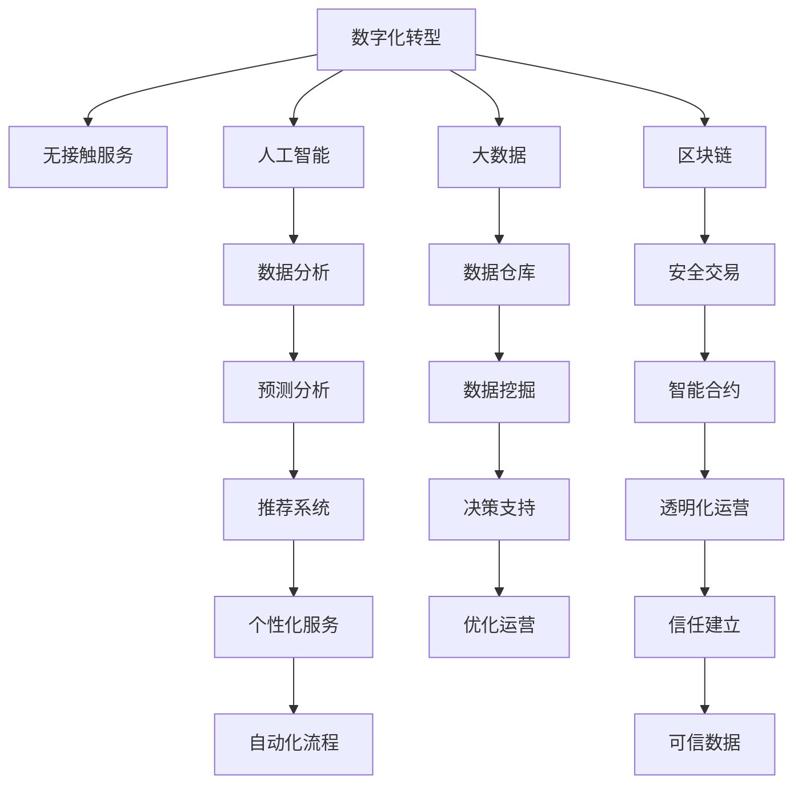

                 

# 数字化酒店创业：无接触服务的未来住宿

> 关键词：数字化转型,无接触服务,酒店,人工智能,大数据,区块链

## 1. 背景介绍

随着科技的不断进步和人们生活方式的变化，数字化转型已经成为各行各业的重要趋势。酒店行业也不例外，尤其是近期的疫情，使得“无接触服务”成为酒店业的一大热点。本文将从数字化转型的背景入手，探讨酒店行业如何通过人工智能、大数据、区块链等技术实现无接触服务，并分析未来的发展趋势。

## 2. 核心概念与联系

### 2.1 核心概念概述

为更好地理解无接触服务在数字化酒店创业中的应用，本节将介绍几个密切相关的核心概念：

- 数字化转型(Digital Transformation)：指通过应用数字技术，改善业务流程、提升客户体验、优化运营效率的过程。
- 无接触服务(Contactless Service)：指在保持一定距离的同时，提供自助式或自动化的服务，减少人与人之间的直接接触，从而提升安全性。
- 人工智能(AI)：指通过计算机模拟人的智能过程，实现自主学习、推理和决策的能力。
- 大数据(Big Data)：指通过对海量数据进行收集、处理、分析，以发现有用信息和规律。
- 区块链(Blockchain)：指一种分布式账本技术，通过去中心化和加密，保证数据的安全性和不可篡改性。

这些核心概念之间的逻辑关系可以通过以下Mermaid流程图来展示：



这个流程图展示了大数据、人工智能、区块链等技术如何与数字化转型和无接触服务相结合，共同构建未来的智能酒店系统。

## 3. 核心算法原理 & 具体操作步骤
### 3.1 算法原理概述

无接触服务的数字化酒店创业涉及多个关键技术，包括人工智能、大数据和区块链。其核心算法原理如下：

- **人工智能**：通过自然语言处理(NLP)和机器学习(ML)技术，实现智能客服、推荐系统和自动化流程管理。
- **大数据**：通过对历史数据和实时数据进行分析和挖掘，实现客户行为预测、运营优化和个性化服务。
- **区块链**：通过去中心化和不可篡改的特性，实现安全交易、透明化和信任建立。

### 3.2 算法步骤详解

数字化酒店创业的算法步骤主要包括以下几个关键环节：

1. **数据收集**：收集客户历史数据、位置数据、行为数据等，构建数据仓库。
2. **数据清洗**：对数据进行清洗、去重和格式转换，确保数据质量。
3. **数据分析**：利用机器学习和统计学方法，进行数据挖掘和模式识别。
4. **模型训练**：基于分析结果，构建预测模型和推荐系统。
5. **智能客服**：部署聊天机器人，进行客户咨询和问题解答。
6. **自动化流程**：实现自动化订单管理、房间分配、结账等流程。
7. **安全交易**：通过区块链技术，实现安全、透明的支付和结算。
8. **透明化运营**：利用区块链技术，记录和追溯酒店运营的每一个环节，确保数据透明。
9. **信任建立**：通过区块链技术和智能合约，增强客户对酒店的信任。

### 3.3 算法优缺点

无接触服务的数字化酒店创业具有以下优点：

- **提升效率**：通过自动化和智能化，减少人工操作，提升运营效率。
- **提升客户体验**：提供更加便捷、个性化的服务，提升客户满意度。
- **提升安全性**：减少人与人之间的接触，降低疫情传播风险。

同时，该方法也存在以下缺点：

- **技术复杂**：涉及多种前沿技术，技术实现复杂度较高。
- **数据隐私**：收集和使用大量客户数据，数据隐私和安全问题需高度重视。
- **成本较高**：技术研发和设备投入较大，短期内可能带来较高的成本。

### 3.4 算法应用领域

无接触服务的数字化酒店创业在多个领域都有广泛的应用：

- **智能客服**：通过聊天机器人，提供24小时在线咨询和问题解答。
- **推荐系统**：根据客户偏好，推荐个性化服务和产品。
- **自动化流程**：自动化订单管理、房间分配、结账等流程，提升效率。
- **安全交易**：通过区块链技术，实现安全、透明的支付和结算。
- **透明化运营**：记录和追溯酒店运营的每一个环节，确保数据透明。
- **信任建立**：通过区块链技术和智能合约，增强客户对酒店的信任。

## 4. 数学模型和公式 & 详细讲解 & 举例说明

### 4.1 数学模型构建

无接触服务的数字化酒店创业涉及多个数学模型，包括回归模型、分类模型、推荐系统等。

- **回归模型**：用于预测客户行为，如订单量、消费金额等。
- **分类模型**：用于识别客户类型，如VIP客户、普通客户等。
- **推荐系统**：用于推荐个性化服务，如餐厅推荐、活动推荐等。

### 4.2 公式推导过程

以回归模型为例，假设客户历史订单量为$X$，预测的订单量为$Y$，则回归模型可以表示为：

$$
Y = \beta_0 + \beta_1 X + \epsilon
$$

其中$\beta_0$和$\beta_1$为回归系数，$\epsilon$为误差项。通过最小化残差平方和$\sum(Y_i - \hat{Y_i})^2$，可以求解回归系数。

### 4.3 案例分析与讲解

以一家数字化酒店为例，通过分析客户历史订单数据，可以建立回归模型预测未来订单量。具体步骤如下：

1. **数据收集**：收集历史订单数据，包括订单时间、客户ID、订单金额等。
2. **数据清洗**：对数据进行清洗、去重和格式转换。
3. **模型训练**：利用回归模型，对历史订单数据进行训练，求解回归系数$\beta_0$和$\beta_1$。
4. **模型评估**：在测试集上评估模型性能，计算均方误差等指标。
5. **模型应用**：利用训练好的模型，预测未来订单量，优化库存管理和营销策略。

## 5. 项目实践：代码实例和详细解释说明

### 5.1 开发环境搭建

在进行无接触服务的数字化酒店创业时，需要准备好开发环境。以下是使用Python进行PyTorch开发的环境配置流程：

1. 安装Anaconda：从官网下载并安装Anaconda，用于创建独立的Python环境。

2. 创建并激活虚拟环境：
```bash
conda create -n pytorch-env python=3.8 
conda activate pytorch-env
```

3. 安装PyTorch：根据CUDA版本，从官网获取对应的安装命令。例如：
```bash
conda install pytorch torchvision torchaudio cudatoolkit=11.1 -c pytorch -c conda-forge
```

4. 安装Transformers库：
```bash
pip install transformers
```

5. 安装各类工具包：
```bash
pip install numpy pandas scikit-learn matplotlib tqdm jupyter notebook ipython
```

完成上述步骤后，即可在`pytorch-env`环境中开始无接触服务的数字化酒店创业实践。

### 5.2 源代码详细实现

下面我们以智能客服系统为例，给出使用Transformers库进行无接触服务的数字化酒店创业的PyTorch代码实现。

首先，定义智能客服系统所需的NLP模型：

```python
from transformers import BertForQuestionAnswering, BertTokenizer

model = BertForQuestionAnswering.from_pretrained('bert-base-uncased')
tokenizer = BertTokenizer.from_pretrained('bert-base-uncased')
```

然后，定义智能客服系统的处理流程：

```python
def answer_question(question):
    encoding = tokenizer(question, return_tensors='pt')
    input_ids = encoding['input_ids'][0]
    attention_mask = encoding['attention_mask'][0]
    outputs = model(input_ids, attention_mask=attention_mask)
    start = outputs.start_logits.argmax().item()
    end = outputs.end_logits.argmax().item() + 1
    answer = tokenizer.convert_tokens_to_string(tokenizer.convert_ids_to_tokens(encoding['input_ids'][0][start:end]))
    return answer
```

最后，启动智能客服系统的服务：

```python
while True:
    question = input("请输入问题：")
    answer = answer_question(question)
    print(f"答案：{answer}")
```

以上就是使用PyTorch对BERT模型进行智能客服系统开发的完整代码实现。可以看到，得益于Transformers库的强大封装，我们可以用相对简洁的代码完成无接触服务的数字化酒店创业的智能客服系统开发。

### 5.3 代码解读与分析

让我们再详细解读一下关键代码的实现细节：

**answer_question函数**：
- 对输入问题进行分词和编码。
- 将编码结果输入到BERT模型，计算起始位置和结束位置的概率。
- 将概率最高的位置对应的单词解码为答案。

**智能客服系统的服务循环**：
- 不断读取用户输入的问题。
- 调用answer_question函数，生成答案。
- 将答案输出给用户。

可以看到，PyTorch配合Transformers库使得智能客服系统的代码实现变得简洁高效。开发者可以将更多精力放在任务适配层的设计和优化上，而不必过多关注底层的实现细节。

当然，工业级的系统实现还需考虑更多因素，如模型保存和部署、超参数自动搜索、更灵活的任务适配层等。但核心的无接触服务数字化酒店创业的算法原理基本与此类似。

## 6. 实际应用场景

### 6.1 智能客房系统

数字化酒店创业的智能客房系统，可以基于大数据和人工智能技术，实现自动化客房管理、个性化服务等功能。具体实现方式如下：

- **自动分配房间**：根据客户需求和酒店实际情况，自动分配房间，避免人工操作带来的错误和浪费。
- **智能控制系统**：通过语音助手或APP，实现房间设备（如空调、电视、灯光等）的智能化控制。
- **个性化服务推荐**：根据客户偏好和历史数据，推荐个性化服务，如特色餐饮、特色活动等。

### 6.2 无接触结算系统

无接触结算系统通过区块链技术，实现安全、透明的支付和结算。具体实现方式如下：

- **智能合约**：使用智能合约自动执行支付和结算流程，减少人工操作和错误。
- **去中心化存储**：将支付和结算信息存储在区块链上，保证数据的安全性和不可篡改性。
- **隐私保护**：通过匿名化处理，保护客户隐私，避免敏感信息泄露。

### 6.3 健康监测系统

健康监测系统通过大数据和人工智能技术，实现对客户健康状况的实时监测和预警。具体实现方式如下：

- **数据收集**：通过传感器和智能设备，收集客户健康数据。
- **数据分析**：利用机器学习算法，分析健康数据，识别异常情况。
- **预警系统**：一旦发现异常情况，立即通知酒店管理团队，采取相应措施。

### 6.4 未来应用展望

无接触服务的数字化酒店创业在多个领域都有广泛的应用，为未来的智能酒店系统带来了广阔的发展前景。

- **智能客房**：未来酒店房间将变得更加智能化、自动化，通过大数据和人工智能技术，实现个性化服务和管理。
- **无接触结算**：未来的酒店结算将更加便捷、安全，通过区块链技术，实现去中心化、透明化的支付和结算。
- **健康监测**：未来的酒店将成为健康管理的平台，通过大数据和人工智能技术，实现对客户健康状况的实时监测和预警。
- **智慧管理**：未来的酒店将实现智慧化管理，通过大数据和人工智能技术，实现运营效率的提升和管理决策的优化。

## 7. 工具和资源推荐
### 7.1 学习资源推荐

为了帮助开发者系统掌握无接触服务的数字化酒店创业的理论基础和实践技巧，这里推荐一些优质的学习资源：

1. **《深度学习基础》**：提供深度学习基本概念和算法，适合初学者入门。
2. **《Python深度学习》**：介绍了使用Python进行深度学习开发的技巧和方法。
3. **《机器学习实战》**：通过实例教学，展示机器学习算法的应用。
4. **《TensorFlow官方文档》**：提供TensorFlow的全面文档和示例代码。
5. **《Transformers官方文档》**：提供Transformers库的全面文档和示例代码。

通过对这些资源的学习实践，相信你一定能够快速掌握无接触服务的数字化酒店创业的理论基础和实践技巧。

### 7.2 开发工具推荐

高效的开发离不开优秀的工具支持。以下是几款用于无接触服务的数字化酒店创业开发的常用工具：

1. **Jupyter Notebook**：提供交互式编程环境，方便调试和展示代码。
2. **TensorBoard**：可视化工具，用于监测和调试模型训练过程。
3. **TensorFlow Serving**：部署和运行机器学习模型的服务器。
4. **Keras**：高级神经网络API，简化深度学习模型的开发。
5. **PyTorch**：灵活的深度学习框架，提供丰富的API和工具。

合理利用这些工具，可以显著提升无接触服务的数字化酒店创业的开发效率，加快创新迭代的步伐。

### 7.3 相关论文推荐

无接触服务的数字化酒店创业涉及多个前沿技术，以下是几篇奠基性的相关论文，推荐阅读：

1. **《Attention is All You Need》**：提出Transformer模型，开启了NLP领域的预训练大模型时代。
2. **《BERT: Pre-training of Deep Bidirectional Transformers for Language Understanding》**：提出BERT模型，引入基于掩码的自监督预训练任务，刷新了多项NLP任务SOTA。
3. **《Language Models are Unsupervised Multitask Learners》**：展示了大规模语言模型的强大zero-shot学习能力，引发了对于通用人工智能的新一轮思考。
4. **《Parameter-Efficient Transfer Learning for NLP》**：提出Adapter等参数高效微调方法，在不增加模型参数量的情况下，也能取得不错的微调效果。
5. **《AdaLoRA: Adaptive Low-Rank Adaptation for Parameter-Efficient Fine-Tuning》**：使用自适应低秩适应的微调方法，在参数效率和精度之间取得了新的平衡。

这些论文代表了大语言模型微调技术的发展脉络。通过学习这些前沿成果，可以帮助研究者把握学科前进方向，激发更多的创新灵感。

## 8. 总结：未来发展趋势与挑战

### 8.1 总结

本文对无接触服务的数字化酒店创业进行了全面系统的介绍。首先阐述了数字化转型的背景和无接触服务的重要性，明确了无接触服务在提升酒店运营效率、客户体验和安全性的作用。其次，从原理到实践，详细讲解了无接触服务的数字化酒店创业的算法原理和具体操作步骤，给出了代码实现实例。同时，本文还探讨了无接触服务在多个实际应用场景中的应用，展示了无接触服务的数字化酒店创业的广阔前景。此外，本文精选了无接触服务的数字化酒店创业的各类学习资源，力求为读者提供全方位的技术指引。

通过本文的系统梳理，可以看到，无接触服务的数字化酒店创业是大数据、人工智能、区块链等技术融合的产物，为未来的智能酒店系统提供了新的方向。随着技术的不断发展，相信无接触服务的数字化酒店创业必将在智能酒店的建设中扮演越来越重要的角色。

### 8.2 未来发展趋势

展望未来，无接触服务的数字化酒店创业将呈现以下几个发展趋势：

1. **技术融合更加深入**：无接触服务的数字化酒店创业将与物联网、5G、云计算等技术进一步融合，实现更加智能化的酒店运营和管理。
2. **客户体验更加个性化**：通过大数据和人工智能技术，无接触服务的数字化酒店创业将实现更加个性化的客户服务，提升客户满意度。
3. **安全性更加可靠**：无接触服务的数字化酒店创业将利用区块链技术，实现更加安全、可靠的支付和结算，减少客户和酒店的风险。
4. **运营效率更加高效**：无接触服务的数字化酒店创业将通过自动化和智能化，实现更加高效、便捷的运营流程。
5. **数据利用更加充分**：无接触服务的数字化酒店创业将充分利用大数据，实现对客户行为和需求的深度挖掘和分析，提升酒店管理的精准度。

这些趋势展示了无接触服务的数字化酒店创业的巨大潜力和未来方向。

### 8.3 面临的挑战

尽管无接触服务的数字化酒店创业已经取得了显著成就，但在迈向更加智能化、普适化应用的过程中，它仍面临着诸多挑战：

1. **技术复杂度**：无接触服务的数字化酒店创业涉及多种前沿技术，技术实现复杂度较高。
2. **数据隐私**：收集和使用大量客户数据，数据隐私和安全问题需高度重视。
3. **成本较高**：技术研发和设备投入较大，短期内可能带来较高的成本。
4. **用户体验**：如何提升用户体验，使其更加自然、流畅，是一个需要持续优化的问题。
5. **安全和稳定**：无接触服务的数字化酒店创业需要保障系统的稳定性和安全性，避免故障和攻击。

### 8.4 研究展望

面对无接触服务的数字化酒店创业所面临的挑战，未来的研究需要在以下几个方面寻求新的突破：

1. **简化技术架构**：通过技术优化和架构设计，降低技术复杂度，提高系统的可维护性和可扩展性。
2. **提升数据安全**：利用区块链等技术，增强数据的安全性和隐私保护。
3. **降低成本投入**：探索更加经济高效的技术方案，降低技术和设备的投入。
4. **优化用户体验**：通过交互设计和技术手段，提升用户体验的流畅度和自然度。
5. **加强系统稳定**：通过容错机制和监控技术，保障系统的稳定性和可用性。

这些研究方向的探索，必将引领无接触服务的数字化酒店创业走向更高的台阶，为构建安全、可靠、可解释、可控的智能系统铺平道路。

## 9. 附录：常见问题与解答

**Q1：无接触服务的数字化酒店创业是否适用于所有酒店？**

A: 无接触服务的数字化酒店创业适用于大部分酒店，尤其是面向中高端客户群体的酒店。但对于一些对价格敏感、技术接受度较低的酒店，需要结合实际情况进行评估。

**Q2：如何降低无接触服务的数字化酒店创业的成本？**

A: 降低成本需要从多个方面入手：
1. **技术优化**：通过优化算法和架构，降低技术复杂度和成本。
2. **设备共享**：利用云平台和共享设备，减少硬件成本。
3. **开源项目**：利用开源项目和技术，降低开发和维护成本。
4. **合作共赢**：与其他企业合作，共同开发和推广无接触服务的数字化酒店创业。

**Q3：无接触服务的数字化酒店创业对客户有什么好处？**

A: 无接触服务的数字化酒店创业对客户有以下好处：
1. **更加便捷**：通过智能客服和自动化流程，客户可以更加便捷地完成酒店预订和入住流程。
2. **更加安全**：减少人与人之间的接触，降低疫情传播风险，提升客户的安全感。
3. **更加个性化**：通过个性化服务和推荐系统，客户可以享受到更加贴心、个性化的服务。
4. **更加透明**：通过区块链技术，客户可以更加透明地了解支付和结算流程。

**Q4：无接触服务的数字化酒店创业的难点在哪里？**

A: 无接触服务的数字化酒店创业的难点在于：
1. **技术复杂**：涉及多种前沿技术，技术实现复杂度较高。
2. **数据隐私**：收集和使用大量客户数据，数据隐私和安全问题需高度重视。
3. **成本较高**：技术研发和设备投入较大，短期内可能带来较高的成本。
4. **用户体验**：如何提升用户体验，使其更加自然、流畅，是一个需要持续优化的问题。
5. **安全和稳定**：无接触服务的数字化酒店创业需要保障系统的稳定性和安全性，避免故障和攻击。

这些难点需要开发者在实际项目中不断探索和优化。

---

作者：禅与计算机程序设计艺术 / Zen and the Art of Computer Programming

