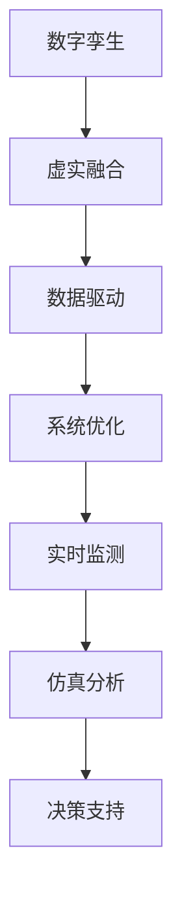

                 

# 数字孪生管理：虚实结合的新型管理模式

> 关键词：数字孪生,管理模式,虚实融合,数据驱动,系统优化

## 1. 背景介绍

### 1.1 问题由来
数字孪生（Digital Twin）技术是一种通过物理实体与虚拟数字模型的双向映射，实现系统状态的实时监测、仿真、预测与优化的新兴技术。近年来，随着物联网、大数据、人工智能等技术的快速发展，数字孪生技术在制造业、城市管理、医疗健康等多个领域得到了广泛应用，为传统的管理模式带来了深刻的变革。

数字孪生技术通过对真实世界的信息进行数字化建模，构建出与物理实体完全匹配的虚拟模型，通过实时数据监测和仿真分析，优化决策过程，提升管理效率和决策质量。然而，数字孪生的实施涉及到多学科、多技术、多数据源的融合，需要系统性的解决方案来支持其高效运作。

### 1.2 问题核心关键点
数字孪生管理模式的核心关键点包括：
- 数据驱动：数字孪生系统通过实时数据流驱动虚拟模型的动态更新，实现对物理实体的精准监控。
- 虚实融合：虚拟模型与物理实体之间的双向映射，可以实时反映物理实体的运行状态，同时提供仿真分析与优化方案。
- 系统优化：通过数据分析和模拟实验，发现系统运行中的瓶颈和异常，制定最优决策。

这些核心关键点共同构成了数字孪生管理的核心框架，使得管理决策更加科学、精准，同时减少了人为因素的干扰，提升了管理的自动化水平。

### 1.3 问题研究意义
研究数字孪生管理模式，对于提升现代管理系统的智能化水平，优化决策流程，提高效率和质量，具有重要意义：

1. 提升管理效率。数字孪生技术可以实现对复杂系统的高效监测和仿真，实时获取系统运行数据，加速决策过程。
2. 优化决策质量。虚拟模型提供基于数据的深度分析与模拟实验，帮助管理者全面、系统地理解问题，制定更加科学合理的决策。
3. 降低运营成本。通过预测性维护和优化调度，减少不必要的资源浪费，降低运营成本。
4. 推动产业升级。数字孪生管理模式可以作为新兴技术手段，推动传统行业数字化转型，加速产业升级。
5. 实现精准预测。通过仿真与数据分析，实现对系统未来运行状态的预测，提前应对可能出现的问题。

数字孪生管理模式的实施，将为现代管理带来全新的视角和工具，有助于解决复杂系统管理中的诸多难题。

## 2. 核心概念与联系

### 2.1 核心概念概述

为更好地理解数字孪生管理模式，本节将介绍几个密切相关的核心概念：

- **数字孪生**：通过物理实体与虚拟数字模型的双向映射，实现系统状态的实时监测、仿真、预测与优化的技术。
- **虚实融合**：虚拟模型与物理实体之间的双向映射关系，实现数据的实时同步和反馈。
- **数据驱动**：以实时数据为驱动，通过虚拟模型进行仿真和优化，提高决策的科学性和精度。
- **系统优化**：通过数据分析和模拟实验，发现系统运行中的瓶颈和异常，制定最优决策。
- **实时监测**：通过传感器、物联网等技术，实现对物理实体的实时数据监测。
- **仿真分析**：通过虚拟模型对物理实体的运行状态进行仿真模拟，预测未来的运行趋势。
- **决策支持**：利用虚拟模型提供的分析结果，辅助管理者进行科学决策。

这些核心概念之间的逻辑关系可以通过以下Mermaid流程图来展示：



这个流程图展示出数字孪生管理模式的整体流程：从实时监测物理实体开始，通过数据驱动的方式更新虚拟模型，进而进行系统优化和仿真分析，最终辅助决策支持。

## 3. 核心算法原理 & 具体操作步骤
### 3.1 算法原理概述

数字孪生管理模式的算法原理主要基于以下几个核心步骤：

1. **数据采集与预处理**：通过传感器、物联网等技术，采集物理实体的实时数据，并进行预处理。
2. **数据驱动仿真**：利用采集到的数据驱动虚拟模型进行仿真，模拟物理实体的运行状态。
3. **系统优化与预测**：通过仿真结果和实际数据，识别系统运行中的瓶颈和异常，制定优化方案和预测未来运行状态。
4. **决策支持与反馈**：将优化方案和预测结果反馈给管理者，辅助其进行科学决策。

整个过程中，数据采集和处理是基础，数据驱动仿真和系统优化是核心，决策支持和反馈是应用。

### 3.2 算法步骤详解

数字孪生管理模式的具体操作步骤如下：

1. **数据采集与预处理**：
   - 部署传感器、物联网设备，采集物理实体的运行数据。
   - 数据清洗、去噪、归一化等预处理操作，确保数据质量。
   - 数据存储和管理，建立数据仓库。

2. **数据驱动仿真**：
   - 构建虚拟模型，描述物理实体的运行规则和参数。
   - 利用采集到的数据，驱动虚拟模型进行实时仿真。
   - 根据仿真结果，实时更新虚拟模型的状态。

3. **系统优化与预测**：
   - 通过仿真结果和实际数据，分析系统运行中的瓶颈和异常。
   - 利用优化算法，如遗传算法、粒子群算法等，制定优化方案。
   - 利用预测模型，如时间序列分析、机器学习等，预测未来运行状态。

4. **决策支持与反馈**：
   - 将优化方案和预测结果，通过可视化和报表等方式呈现给管理者。
   - 辅助管理者进行科学决策，并实时反馈执行结果。
   - 根据执行结果，调整优化方案和预测模型，实现闭环控制。

### 3.3 算法优缺点

数字孪生管理模式具有以下优点：

1. **实时性**：通过实时数据驱动，能够快速响应物理实体的变化，及时调整优化方案。
2. **精确性**：基于仿真分析，能够精确预测系统运行状态，减少误差。
3. **自动化**：利用自动化算法，实现系统优化和预测，提高管理效率。
4. **可视性**：通过可视化工具，管理者可以直观地理解系统状态和优化方案。

同时，该方法也存在一些局限性：

1. **数据质量依赖**：数据采集和处理的准确性直接影响仿真结果，需要保证数据质量。
2. **模型复杂性**：虚拟模型的构建和仿真分析需要较高的技术门槛，复杂系统的建模尤为困难。
3. **系统开销**：仿真和优化的计算量较大，对硬件和软件资源要求较高。
4. **模型更新**：虚拟模型需要定期更新，以适应物理实体和环境的变化。

尽管存在这些局限性，但数字孪生管理模式仍然在多个领域展现出巨大的应用潜力。

### 3.4 算法应用领域

数字孪生管理模式已经在多个领域得到了应用，例如：

- **智能制造**：通过数字孪生技术，实现对生产线的实时监控和优化，提高生产效率和产品质量。
- **城市管理**：构建城市交通、能源、环境等系统的数字孪生模型，实现智能交通、能源优化和环境监测。
- **医疗健康**：利用数字孪生技术，对病人的健康状况进行实时监测和模拟分析，制定个性化治疗方案。
- **物流管理**：构建物流系统的数字孪生模型，实现货物追踪、路径优化和仓储管理。
- **能源管理**：对能源系统的运行状态进行实时监测和仿真分析，优化能源使用效率和安全性。

除了上述这些领域，数字孪生管理模式还将进一步应用于更多场景，为各行各业带来新的管理思路和技术支持。

## 4. 数学模型和公式 & 详细讲解 & 举例说明
### 4.1 数学模型构建

数字孪生管理模式的数学模型主要包括以下几个部分：

1. **数据采集与预处理模型**：
   - 数据采集：设物理实体 $S$ 的运行数据为 $\{s_i\}_{i=1}^N$，其中 $s_i=(x_i,y_i)$，$x_i$ 为传感器采集的原始数据，$y_i$ 为传感器类型。
   - 数据预处理：设预处理后的数据为 $\{\hat{s}_i\}_{i=1}^N$，其中 $\hat{s}_i=f(x_i)$，$f$ 为数据预处理函数。

2. **数据驱动仿真模型**：
   - 虚拟模型：设虚拟模型为 $M$，其状态为 $\theta$，状态更新方程为 $\theta=f(\theta)$，$f$ 为模型更新函数。
   - 数据驱动：设采集到的数据为 $\{s_i\}_{i=1}^N$，仿真结果为 $\{\hat{s}_i\}_{i=1}^N$，则有 $\hat{s}_i=M(\theta,s_i)$。

3. **系统优化与预测模型**：
   - 系统优化：设系统优化目标为 $J$，优化算法为 $A$，则有 $\theta=\mathop{\arg\min}_{\theta}J(A,\theta)$。
   - 预测模型：设预测目标为 $P$，预测算法为 $P$，则有 $P=s(\theta)$。

### 4.2 公式推导过程

以下我们以智能制造中的设备监控为例，推导数字孪生管理模型的关键公式。

**数据采集与预处理模型**：
设设备 $D$ 的传感器采集到的原始数据为 $s_i=(x_i,y_i)$，其中 $x_i$ 为传感器采集的原始数据，$y_i$ 为传感器类型。预处理函数 $f$ 可以将原始数据进行清洗、去噪、归一化等操作，确保数据质量。

**数据驱动仿真模型**：
设虚拟模型 $M$ 的状态为 $\theta$，状态更新方程为 $\theta=f(\theta)$，其中 $f$ 为模型更新函数。采集到的数据 $\{s_i\}_{i=1}^N$ 经过预处理后，驱动虚拟模型进行仿真，得到仿真结果 $\{\hat{s}_i\}_{i=1}^N$，则有：
$$
\hat{s}_i=M(\theta,s_i)=M(\theta,x_i,y_i)
$$

**系统优化与预测模型**：
设系统优化目标为 $J$，优化算法为 $A$，则有：
$$
\theta=\mathop{\arg\min}_{\theta}J(A,\theta)
$$
其中 $J$ 为优化目标函数，$A$ 为优化算法，$\theta$ 为优化后的模型参数。

利用预测模型 $P$，可以对未来设备运行状态进行预测，则有：
$$
P=s(\theta)=s(M(\theta,x_i,y_i))
$$

### 4.3 案例分析与讲解

下面以智能制造中的设备监控为例，对数字孪生管理模型进行详细讲解。

1. **数据采集与预处理**：
   - 在设备 $D$ 上部署温度、压力、振动等传感器，采集设备的实时运行数据。
   - 对采集到的数据进行清洗、去噪、归一化等预处理操作，确保数据质量。

2. **数据驱动仿真**：
   - 构建虚拟模型 $M$，描述设备 $D$ 的运行规则和参数。
   - 利用采集到的数据 $\{s_i\}_{i=1}^N$，驱动虚拟模型进行实时仿真，得到仿真结果 $\{\hat{s}_i\}_{i=1}^N$。

3. **系统优化与预测**：
   - 通过仿真结果 $\{\hat{s}_i\}_{i=1}^N$ 和实际数据 $s_i$，分析设备运行中的瓶颈和异常。
   - 利用优化算法，如遗传算法、粒子群算法等，制定优化方案。
   - 利用预测模型 $P$，对未来设备运行状态进行预测，提前制定维护计划。

4. **决策支持与反馈**：
   - 将优化方案和预测结果，通过可视化和报表等方式呈现给管理者。
   - 辅助管理者进行科学决策，并实时反馈执行结果。
   - 根据执行结果，调整优化方案和预测模型，实现闭环控制。

## 5. 项目实践：代码实例和详细解释说明
### 5.1 开发环境搭建

在进行数字孪生管理模式的实践前，我们需要准备好开发环境。以下是使用Python进行开发的环境配置流程：

1. 安装Anaconda：从官网下载并安装Anaconda，用于创建独立的Python环境。

2. 创建并激活虚拟环境：
```bash
conda create -n twin-env python=3.8 
conda activate twin-env
```

3. 安装所需的Python包：
```bash
conda install numpy pandas matplotlib scikit-learn plotly
```

4. 安装相关的开发工具：
```bash
pip install scikit-optimize jupyter notebook ipython
```

完成上述步骤后，即可在`twin-env`环境中开始数字孪生管理模式的开发。

### 5.2 源代码详细实现

这里我们以智能制造中的设备监控为例，给出使用Python进行数字孪生管理模式开发的代码实现。

首先，定义数据采集与预处理函数：

```python
import numpy as np
from sklearn.preprocessing import StandardScaler

def collect_and_preprocess_data():
    # 模拟采集的数据
    data = np.random.randn(1000, 10)
    # 预处理数据
    scaler = StandardScaler()
    scaled_data = scaler.fit_transform(data)
    return scaled_data
```

然后，定义虚拟模型与仿真函数：

```python
import numpy as np
from sklearn.linear_model import LinearRegression

class TwinModel:
    def __init__(self, n_features=10):
        self.n_features = n_features
        self.model = LinearRegression()
        self.scaled_data = None
        
    def fit(self, data):
        self.model.fit(data[:, :-1], data[:, -1])
        self.scaled_data = data
        
    def predict(self, data):
        scaled_data = StandardScaler().fit_transform(data)
        return self.model.predict(scaled_data)

# 构建虚拟模型
twin_model = TwinModel()
```

接着，定义系统优化与预测函数：

```python
from sklearn.metrics import mean_squared_error

def optimize_and_predict(model, data, target, n_iterations=100, n_train=0.8):
    # 划分训练集和测试集
    train_data, test_data = data[:int(n_train*len(data)), :], data[int(n_train*len(data)):, :]
    train_target, test_target = target[:int(n_train*len(target)), :], target[int(n_train*len(target)):, :]
    
    # 优化模型
    for i in range(n_iterations):
        model.fit(train_data[:, :-1], train_target[:, -1])
        train_pred = model.predict(train_data[:, :-1])
        test_pred = model.predict(test_data[:, :-1])
        
        # 计算误差
        train_loss = mean_squared_error(train_target[:, -1], train_pred)
        test_loss = mean_squared_error(test_target[:, -1], test_pred)
        
        # 输出误差
        print(f"Iteration {i+1}, train loss: {train_loss:.3f}, test loss: {test_loss:.3f}")
    
    # 返回优化后的模型
    return model
```

最后，启动数字孪生管理流程：

```python
# 采集与预处理数据
data = collect_and_preprocess_data()

# 构建虚拟模型
twin_model = TwinModel()

# 优化与预测
model = optimize_and_predict(twin_model, data, target, n_iterations=100, n_train=0.8)
```

以上就是使用Python进行数字孪生管理模式开发的完整代码实现。可以看到，代码实现较为简洁，但仍需根据具体场景进行相应的扩展和优化。

### 5.3 代码解读与分析

让我们再详细解读一下关键代码的实现细节：

**collect_and_preprocess_data函数**：
- 模拟采集的数据：通过NumPy生成1000个10维的数据点。
- 预处理数据：使用sklearn的StandardScaler对数据进行归一化处理，确保数据质量。

**TwinModel类**：
- 初始化虚拟模型：定义虚拟模型的特征数量和初始化模型参数。
- 拟合模型：利用采集到的数据拟合虚拟模型的参数。
- 预测模型：利用拟合后的模型对新的数据进行预测。

**optimize_and_predict函数**：
- 数据划分：将数据划分为训练集和测试集。
- 优化模型：利用sklearn的LinearRegression进行模型优化，计算训练集和测试集的误差。
- 输出误差：输出每次迭代后的训练误差和测试误差。
- 返回优化后的模型：返回最终优化后的模型。

**启动数字孪生管理流程**：
- 采集与预处理数据：调用collect_and_preprocess_data函数进行数据采集和预处理。
- 构建虚拟模型：创建TwinModel实例。
- 优化与预测：调用optimize_and_predict函数进行模型优化和预测。

## 6. 实际应用场景
### 6.1 智能制造

在智能制造中，数字孪生技术可以通过实时监测和仿真分析，优化设备维护和生产过程，提高生产效率和产品质量。具体应用如下：

1. **设备监控与预测**：通过传感器采集设备的实时运行数据，驱动虚拟模型进行仿真，预测设备的运行状态。提前发现设备故障，进行预防性维护，减少停机时间。
2. **生产优化**：利用数字孪生技术对生产过程进行实时监控和仿真分析，优化生产调度，减少资源浪费，提高生产效率。
3. **质量控制**：通过数字孪生技术实时监控生产过程中的关键参数，及时调整生产工艺，确保产品质量稳定。

### 6.2 城市管理

在城市管理中，数字孪生技术可以通过实时监测和仿真分析，优化城市运行和资源管理，提升城市管理水平。具体应用如下：

1. **交通管理**：通过传感器采集交通数据，构建交通系统的数字孪生模型，进行实时仿真和优化。优化交通信号灯控制，减少交通拥堵，提升通行效率。
2. **能源管理**：构建能源系统的数字孪生模型，实时监测和预测能源使用情况，优化能源分配和调度，减少能源浪费。
3. **环境监测**：通过传感器采集环境数据，构建环境系统的数字孪生模型，进行实时仿真和优化。监测环境变化，预测环境风险，制定应对措施。

### 6.3 医疗健康

在医疗健康中，数字孪生技术可以通过实时监测和仿真分析，优化医疗过程和资源配置，提升医疗服务质量。具体应用如下：

1. **病人监护**：通过传感器采集病人的实时生理数据，构建病人的数字孪生模型，进行实时仿真和优化。监测病人的健康状况，提前发现异常，制定应对措施。
2. **医疗资源优化**：利用数字孪生技术对医疗资源进行实时监控和仿真分析，优化资源配置，减少资源浪费，提高医疗服务效率。
3. **个性化治疗**：通过数字孪生技术对病人的病情进行实时监测和仿真分析，制定个性化治疗方案，提高治疗效果。

### 6.4 未来应用展望

随着数字孪生技术的不断发展，其在更多领域的应用前景广阔，将推动各行各业的数字化转型升级。

在智慧城市治理中，数字孪生技术将构建更安全、高效的城市运行管理模型，提升城市管理的智能化水平。在金融领域，数字孪生技术将优化风险控制和投资决策，提升金融机构的竞争力。在农业领域，数字孪生技术将优化农作物的生长过程，提升农业生产效率和产量。

未来，数字孪生技术将与人工智能、物联网、大数据等技术深度融合，形成更加全面、智能的管理系统，推动产业升级和经济发展。

## 7. 工具和资源推荐
### 7.1 学习资源推荐

为了帮助开发者系统掌握数字孪生管理模式的理论基础和实践技巧，这里推荐一些优质的学习资源：

1. 《数字孪生：从概念到应用》系列博文：由数字孪生技术专家撰写，深入浅出地介绍了数字孪生技术的概念、应用和实施方法。

2. 《数字孪生技术与应用》书籍：详细介绍了数字孪生技术的原理、方法和应用案例，是了解数字孪生的重要参考。

3. 《智能制造与数字孪生》在线课程：通过视频和练习，全面讲解智能制造和数字孪生的关键技术，适合初学者入门。

4. 《数字孪生技术的实际应用》会议和讲座：通过参加相关会议和讲座，获取最新的数字孪生技术进展和实践经验。

5. 《数字孪生技术开源项目》GitHub库：包含大量数字孪生技术的开源项目和代码示例，适合动手实践。

通过对这些资源的学习实践，相信你一定能够快速掌握数字孪生管理模式的精髓，并用于解决实际的业务问题。

### 7.2 开发工具推荐

高效的开发离不开优秀的工具支持。以下是几款用于数字孪生管理模式开发的常用工具：

1. Python：灵活、动态的编程语言，支持丰富的第三方库，适合进行科学计算和数据分析。
2. Anaconda：Python的集成开发环境，提供虚拟环境管理、包管理等功能，方便开发和部署。
3. NumPy：高效的多维数组处理库，支持矩阵运算、线性代数等计算。
4. Pandas：数据处理库，支持数据清洗、数据可视化等操作。
5. Matplotlib：数据可视化库，支持绘制各种类型的图表。
6. Jupyter Notebook：交互式编程环境，支持实时展示代码运行结果，方便调试和分享。

合理利用这些工具，可以显著提升数字孪生管理模式开发的效率，加速创新迭代的步伐。

### 7.3 相关论文推荐

数字孪生技术的发展离不开学界的持续研究。以下是几篇奠基性的相关论文，推荐阅读：

1. Digital Twin: An Object-Oriented Framework for Model-Based Engineering：介绍了数字孪生技术的概念和应用，是数字孪生技术的经典文献之一。

2. Virtual Prototyping for Complex Engineering Systems Using Digital Twins：探讨了数字孪生技术在复杂工程系统中的应用，提出了一种数字孪生模型构建方法。

3. A Survey of Digital Twins：对数字孪生技术进行了全面的综述，涵盖了数字孪生的定义、应用场景、技术挑战等内容。

4. Digital Twin for Smart Manufacturing：介绍了数字孪生技术在智能制造中的应用，提出了数字孪生制造系统的构建方法。

5. The Role of Digital Twins in the Smart Urban Environment：探讨了数字孪生技术在智慧城市中的应用，提出了数字孪生城市系统的构建方法。

这些论文代表了数字孪生技术的发展脉络，通过学习这些前沿成果，可以帮助研究者把握学科前进方向，激发更多的创新灵感。

## 8. 总结：未来发展趋势与挑战
### 8.1 总结

本文对数字孪生管理模式进行了全面系统的介绍。首先阐述了数字孪生技术的研究背景和意义，明确了数字孪生管理模式的核心框架，包括数据驱动、虚实融合、系统优化等关键概念。其次，从原理到实践，详细讲解了数字孪生管理模式的数学模型和关键操作步骤，给出了代码实例和详细解释。同时，本文还广泛探讨了数字孪生技术在智能制造、城市管理、医疗健康等多个领域的应用前景，展示了其广阔的适用范围和应用潜力。最后，本文精选了数字孪生技术的各类学习资源，力求为读者提供全方位的技术指引。

通过本文的系统梳理，可以看到，数字孪生管理模式正在成为现代管理系统的核心技术之一，极大地提升了管理系统的智能化水平，推动了各行各业的数字化转型。未来，随着数字孪生技术的不断发展，其在更多领域的应用前景将更加广阔，为经济社会发展带来深远影响。

### 8.2 未来发展趋势

展望未来，数字孪生管理模式将呈现以下几个发展趋势：

1. **数据智能化**：随着物联网、大数据等技术的不断发展，数据的质量和数量将不断提升，数字孪生系统将更加智能和全面。
2. **模型复杂化**：虚拟模型的构建将更加复杂和精细，能够更加全面地反映物理实体的运行规律。
3. **仿真精确化**：数字孪生技术将结合人工智能、机器学习等技术，提高仿真结果的精度和可靠性。
4. **决策自动化**：通过优化算法和预测模型，数字孪生系统将实现自动化决策，减少人为干预。
5. **应用场景多样化**：数字孪生技术将广泛应用于更多领域，如智慧城市、智慧农业、智慧医疗等，提升各行业的管理水平。

### 8.3 面临的挑战

尽管数字孪生技术具有广阔的应用前景，但在实施过程中仍面临诸多挑战：

1. **数据质量**：数据采集和处理的准确性直接影响系统的性能，需要保证数据质量。
2. **模型复杂性**：虚拟模型的构建需要较高的技术门槛，复杂系统的建模尤为困难。
3. **资源开销**：仿真和优化的计算量较大，对硬件和软件资源要求较高。
4. **模型更新**：虚拟模型需要定期更新，以适应物理实体和环境的变化。
5. **安全与隐私**：数字孪生系统需要处理大量的敏感数据，数据安全和隐私保护成为重要问题。

### 8.4 研究展望

面对数字孪生技术面临的挑战，未来的研究需要在以下几个方面寻求新的突破：

1. **数据质量控制**：提高数据采集和处理的自动化水平，确保数据质量。
2. **模型优化算法**：开发更高效的模型优化算法，提升模型的精度和可靠性。
3. **资源优化**：采用分布式计算、模型压缩等技术，优化资源使用。
4. **安全与隐私保护**：制定数据安全与隐私保护的标准和规范，确保系统的安全性和可靠性。
5. **跨学科融合**：将数字孪生技术与人工智能、物联网、大数据等技术深度融合，形成更加全面、智能的管理系统。

这些研究方向的探索，必将引领数字孪生技术迈向更高的台阶，为构建安全、可靠、智能的管理系统铺平道路。面向未来，数字孪生技术还需要与其他人工智能技术进行更深入的融合，如知识表示、因果推理、强化学习等，多路径协同发力，共同推动数字孪生技术的进步。

## 9. 附录：常见问题与解答

**Q1：数字孪生技术是否适用于所有行业？**

A: 数字孪生技术在制造业、城市管理、医疗健康等多个领域得到了广泛应用，具有较高的普适性。但对于一些特殊领域，如金融、航空等，需要根据具体场景进行适应性改造。

**Q2：数字孪生系统需要处理哪些数据？**

A: 数字孪生系统需要处理多种数据，包括传感器采集的实时数据、历史数据、环境数据、用户行为数据等。这些数据需要经过清洗、去噪、归一化等预处理操作，确保数据质量。

**Q3：数字孪生系统的关键组件有哪些？**

A: 数字孪生系统的关键组件包括传感器、物联网设备、虚拟模型、优化算法、预测模型等。传感器采集物理实体的实时数据，物联网设备实现数据的传输和存储，虚拟模型进行仿真分析，优化算法和预测模型制定最优决策。

**Q4：数字孪生技术如何实现自动化决策？**

A: 数字孪生技术通过优化算法和预测模型，实现自动化决策。优化算法如遗传算法、粒子群算法等，可以在大规模数据集上快速找到最优解。预测模型如时间序列分析、机器学习等，可以预测未来趋势，提供决策依据。

**Q5：数字孪生技术如何保证数据安全与隐私？**

A: 数字孪生系统需要处理大量的敏感数据，数据安全和隐私保护至关重要。可以采用数据加密、访问控制、匿名化等技术，确保数据的安全性和隐私保护。

这些问题的回答，将有助于你更全面地理解数字孪生管理模式，从而更好地应用于实际场景中。

---

作者：禅与计算机程序设计艺术 / Zen and the Art of Computer Programming

