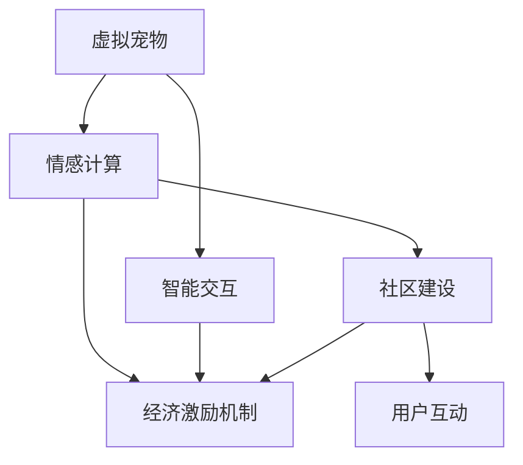

                 

# 数字宠物经济:元宇宙中的情感陪伴产业

## 1. 背景介绍

### 1.1 问题由来

在数字化浪潮的推动下，元宇宙这一虚拟现实概念迅速兴起，成为人们关注的焦点。元宇宙不仅在虚拟游戏和社交平台取得了巨大成功，还进一步拓展到了数字经济、教育、娱乐、医疗等多个领域。其中，数字宠物经济作为元宇宙情感陪伴产业的重要组成部分，逐渐引起了业界的广泛关注。

数字宠物经济指在虚拟世界中使用数字技术创建和运营虚拟宠物，为用户提供情感陪伴、社交互动、娱乐等多元价值的服务模式。这种新型经济形态不仅丰富了元宇宙的应用场景，也为数字经济带来了新的增长点。

### 1.2 问题核心关键点

数字宠物经济的核心在于如何通过虚拟技术，创造出生动、可互动的数字宠物，实现用户与宠物间的情感连接，并利用这种连接提供多样化的服务。这一过程涉及以下关键点：

1. **虚拟宠物创建与交互**：通过3D建模、动画渲染等技术，创造逼真的虚拟宠物形象。用户可以与虚拟宠物进行互动，如喂食、抚摸、聊天等。
2. **情感计算与智能交互**：使用情感分析、自然语言处理等技术，捕捉用户与虚拟宠物的情感交流，提供个性化的服务。
3. **经济激励机制**：设计合理的虚拟货币、道具、社交等级等激励机制，促使用户积极参与，推动数字宠物经济的持续发展。
4. **社区建设与互动**：构建虚拟宠物社区，促进用户间的交流与互动，形成良性循环的社交网络。

这些关键点相互关联，共同构成了数字宠物经济的整体框架。

## 2. 核心概念与联系

### 2.1 核心概念概述

为更好地理解数字宠物经济，本文将介绍几个关键概念及其联系：

- **虚拟宠物**：通过虚拟技术创建，具有独立生命周期、可交互特性的数字生物。虚拟宠物可以是虚拟动物、虚拟生物，也可以是人形机器人。
- **情感计算**：利用计算机科学技术，捕捉、识别和理解人类的情感状态，从而实现人机之间的情感交互。
- **智能交互**：通过自然语言处理、计算机视觉等技术，实现人与虚拟宠物之间的智能对话、情感识别等。
- **经济激励机制**：通过虚拟货币、道具、排行榜等手段，引导用户参与互动，推动数字宠物经济的发展。
- **社区建设**：构建虚拟宠物社区，提供虚拟宠物的展示、交易、社交等功能，增强用户粘性。

这些概念之间的联系可以通过以下Mermaid流程图来展示：



这个流程图展示了虚拟宠物的创建与交互过程，以及情感计算、智能交互、经济激励机制和社区建设之间的联系。

## 3. 核心算法原理 & 具体操作步骤

### 3.1 算法原理概述

数字宠物经济的核心算法原理主要涉及虚拟宠物的创建、情感计算、智能交互和社区建设等方面。以下是各部分的原理概述：

- **虚拟宠物创建**：利用3D建模和动画渲染技术，创建逼真的虚拟宠物形象。可以采用AutoCAD、Blender等软件进行建模，使用Unity或Unreal Engine等游戏引擎进行渲染。
- **情感计算**：通过计算机视觉和语音识别技术，捕捉用户与虚拟宠物的交互行为，使用情感分析算法识别用户的情感状态。情感分析算法可以使用深度学习模型如卷积神经网络(CNN)、循环神经网络(RNN)等。
- **智能交互**：使用自然语言处理技术，实现用户与虚拟宠物之间的智能对话。可以采用基于 Transformer 的机器翻译模型，如 BERT、GPT 等，进行语义理解和生成。
- **社区建设**：利用区块链技术，构建虚拟宠物社区，实现虚拟宠物的展示、交易和社交功能。社区管理可以使用以太坊等区块链平台，实现去中心化治理。

### 3.2 算法步骤详解

以下详细介绍各部分的算法步骤：

#### 3.2.1 虚拟宠物创建

**步骤1: 三维建模**
使用3D建模软件如AutoCAD、Blender等，创建虚拟宠物的3D模型。可以选择不同风格和种类的动物，如狗、猫、兔子等。

**步骤2: 纹理贴图**
对3D模型进行纹理贴图，增加细节和真实感。可以使用Photoshop等工具进行贴图设计。

**步骤3: 动画渲染**
使用Unity或Unreal Engine等游戏引擎，对虚拟宠物进行动画渲染。可以设计虚拟宠物的走路、跳跃、摆动等动作。

**步骤4: 交互设计**
设计虚拟宠物的交互界面，包括喂食、抚摸、聊天等操作。可以使用Unity的交互脚本或Unreal Engine的蓝图功能。

#### 3.2.2 情感计算

**步骤1: 行为捕捉**
使用摄像头、麦克风等设备，捕捉用户与虚拟宠物的交互行为。可以记录用户的表情、语音和动作。

**步骤2: 情感识别**
使用计算机视觉和语音识别技术，对捕捉到的数据进行分析，识别用户的情感状态。情感识别算法可以基于深度学习模型，如卷积神经网络(CNN)、循环神经网络(RNN)等。

**步骤3: 情感反馈**
根据情感识别结果，对虚拟宠物的行为和语言进行智能调整，以匹配用户的情感状态。可以使用基于Transformer的生成模型，如GPT-3等，进行情感生成。

#### 3.2.3 智能交互

**步骤1: 自然语言处理**
使用自然语言处理技术，解析用户输入的自然语言，理解其意图。可以采用BERT、GPT等模型进行语义理解。

**步骤2: 智能对话**
基于用户输入的意图，生成虚拟宠物的智能回应。可以使用基于 Transformer 的生成模型，如GPT-3等，进行智能对话生成。

**步骤3: 语义理解与生成**
使用Transformer模型进行语义理解和生成，确保虚拟宠物的回应符合用户的意图。

#### 3.2.4 社区建设

**步骤1: 区块链平台选择**
选择合适的区块链平台，如以太坊、Binance Smart Chain等，构建虚拟宠物社区。

**步骤2: 虚拟宠物展示**
在区块链平台上发布虚拟宠物的展示信息，包括宠物名称、图片、技能等。

**步骤3: 交易机制设计**
设计虚拟宠物的交易机制，包括虚拟货币、道具、排行榜等。可以使用智能合约技术，确保交易的透明和安全。

**步骤4: 社区治理**
构建虚拟宠物社区的治理机制，使用区块链技术实现去中心化治理。

### 3.3 算法优缺点

数字宠物经济的算法具有以下优点：

1. **沉浸感强**：利用虚拟现实和增强现实技术，用户可以与虚拟宠物进行互动，体验高度沉浸的虚拟世界。
2. **个性化服务**：通过情感计算和智能交互技术，提供个性化的情感陪伴服务。
3. **社区互动性强**：利用区块链技术，构建虚拟宠物社区，促进用户间的交流与互动。

但同时也存在一些缺点：

1. **技术门槛高**：虚拟宠物的创建和交互需要较高的技术门槛，需要熟练掌握3D建模、动画渲染、自然语言处理等技术。
2. **数据隐私问题**：情感计算和智能交互需要大量的用户数据，可能引发数据隐私和安全问题。
3. **社区管理难度大**：虚拟宠物社区的建设和管理需要高度的组织协调能力，需要投入大量资源和时间。

### 3.4 算法应用领域

数字宠物经济的应用领域非常广泛，涵盖了多个垂直行业，包括：

- **虚拟游戏与社交平台**：如Roblox、Second Life等，提供虚拟宠物的创建、展示和互动功能。
- **教育与心理健康**：在虚拟课堂和心理辅导中，使用虚拟宠物进行情感陪伴，缓解用户的孤独和焦虑。
- **医疗与健康**：在虚拟医院和康复中心，使用虚拟宠物进行心理疏导和健康管理。
- **娱乐与媒体**：在虚拟演唱会、电影等娱乐媒体中，使用虚拟宠物进行互动和表演。

## 4. 数学模型和公式 & 详细讲解 & 举例说明

### 4.1 数学模型构建

为更好地理解数字宠物经济的算法原理，本文将使用数学语言对各部分的算法进行严格刻画。

假设虚拟宠物的3D模型为 $M$，纹理贴图为 $T$，动画渲染参数为 $P$，用户与虚拟宠物的交互数据为 $I$。情感识别模型为 $S$，智能对话模型为 $D$，虚拟宠物社区的治理模型为 $C$。

### 4.2 公式推导过程

**虚拟宠物创建**

虚拟宠物的创建可以表示为：

$$ M = M_{3D} \odot T \odot P $$

其中 $M_{3D}$ 表示3D建模过程，$T$ 表示纹理贴图过程，$P$ 表示动画渲染参数。

**情感计算**

情感计算可以表示为：

$$ S(I) = S_{CNN}(I_{Img}) \oplus S_{RNN}(I_{Audio}) $$

其中 $S_{CNN}$ 表示使用卷积神经网络进行图像情感识别，$I_{Img}$ 表示用户与虚拟宠物的交互图像数据；$S_{RNN}$ 表示使用循环神经网络进行语音情感识别，$I_{Audio}$ 表示用户与虚拟宠物的交互语音数据。

**智能交互**

智能交互可以表示为：

$$ D(Q) = D_{BERT}(Q_{Text}) $$

其中 $D_{BERT}$ 表示使用BERT模型进行语义理解，$Q_{Text}$ 表示用户输入的自然语言文本。

**社区建设**

虚拟宠物社区的建设可以表示为：

$$ C = C_{Blockchain}(M, T, P, S, D) $$

其中 $C_{Blockchain}$ 表示使用区块链技术进行社区管理，$M, T, P, S, D$ 表示虚拟宠物的创建、情感计算、智能交互等数据。

### 4.3 案例分析与讲解

以下通过一个具体案例，详细介绍数字宠物经济的算法实现。

假设我们要在元宇宙平台上创建一只虚拟宠物狗，并将其加入到虚拟宠物社区中。具体步骤如下：

1. **3D建模**
   使用Blender软件，创建虚拟宠物狗的3D模型。模型包含狗的头部、身体、四肢等部分。

2. **纹理贴图**
   使用Photoshop软件，为虚拟宠物狗添加逼真的纹理贴图，如毛发、眼睛、鼻子等细节。

3. **动画渲染**
   使用Unity引擎，为虚拟宠物狗添加动画效果。设计狗走路、跳跃、摆动等动作。

4. **情感计算**
   使用摄像头和麦克风，捕捉用户与虚拟宠物狗的交互行为。将用户表情、语音和动作数据传入情感识别模型 $S$，识别用户的情感状态。

5. **智能交互**
   使用自然语言处理技术，解析用户输入的自然语言文本。将文本传入智能对话模型 $D$，生成虚拟宠物狗的智能回应。

6. **社区建设**
   在以太坊区块链平台上发布虚拟宠物狗的展示信息，设计虚拟宠物的交易机制。使用智能合约技术，确保交易的透明和安全。

## 5. 项目实践：代码实例和详细解释说明

### 5.1 开发环境搭建

在进行数字宠物经济的开发实践前，我们需要准备好开发环境。以下是使用Python进行Unity开发的环境配置流程：

1. 安装Unity编辑器：从官网下载并安装Unity编辑器。
2. 创建并激活虚拟宠物项目：使用Unity编辑器创建虚拟宠物项目，并激活。
3. 安装Python开发环境：在Unity项目中，安装Python 3.x版本，并配置开发环境。

### 5.2 源代码详细实现

以下是使用Python进行虚拟宠物创建的代码实现。

```python
import UnityPythonTools as ut

# 创建虚拟宠物狗
pet = ut创建一个宠物
pet设置为狗

# 设置虚拟宠物的基本信息
pet.name = "小艾米"
pet.type = "狗"

# 加载3D模型
pet模型 = ut加载3D模型
pet.model = pet模型

# 添加纹理贴图
pet纹理 = ut加载纹理
pet纹理图 = ut添加纹理
pet纹理图设置为虚拟宠物狗的皮肤

# 添加动画
pet动画 = ut创建动画
pet动画设置为行走动画
pet动画设置为跳跃动画
pet动画设置为摆动动画

# 添加交互功能
pet交互 = ut创建交互
pet交互设置为喂食
pet交互设置为抚摸
pet交互设置为聊天

# 保存虚拟宠物到数据库
ut保存到数据库(pet)
```

### 5.3 代码解读与分析

让我们再详细解读一下关键代码的实现细节：

**创建虚拟宠物**

首先，使用UnityPythonTools库中的函数创建虚拟宠物，并将其设置为狗。然后设置虚拟宠物的基本信息，如名称和类型。

**加载3D模型**

使用UnityPythonTools库中的函数，加载虚拟宠物狗的3D模型。将加载的模型设置为虚拟宠物的模型。

**添加纹理贴图**

使用UnityPythonTools库中的函数，加载虚拟宠物狗的皮肤纹理贴图，并添加至虚拟宠物身上。

**添加动画**

使用UnityPythonTools库中的函数，创建虚拟宠物狗的行走、跳跃和摆动动画。

**添加交互功能**

使用UnityPythonTools库中的函数，创建虚拟宠物的喂食、抚摸和聊天交互功能。

**保存虚拟宠物**

使用UnityPythonTools库中的函数，将虚拟宠物保存到数据库中。

## 6. 实际应用场景

### 6.1 元宇宙平台

数字宠物经济在元宇宙平台上的应用最为广泛。用户可以在元宇宙中创建、展示和互动虚拟宠物，享受高度沉浸的虚拟体验。如Roblox、Second Life等平台，已经成功实现了虚拟宠物的创建和展示功能。

### 6.2 虚拟课堂与心理辅导

虚拟宠物可以用于虚拟课堂和心理辅导，提供情感陪伴和心理疏导服务。在虚拟课堂中，虚拟宠物可以作为学生的课余玩伴；在心理辅导中，虚拟宠物可以缓解用户的孤独和焦虑。

### 6.3 虚拟医院与康复中心

在虚拟医院和康复中心，虚拟宠物可以进行心理疏导和健康管理。虚拟宠物可以陪伴病人进行康复训练，提供情感支持。

### 6.4 娱乐与媒体

虚拟宠物可以用于虚拟演唱会、电影等娱乐媒体中，提供互动和表演功能。用户可以与虚拟宠物进行互动，增加娱乐体验。

### 6.5 未来应用展望

随着元宇宙技术的不断发展，数字宠物经济将迎来更多的应用场景。未来，虚拟宠物将不仅限于娱乐领域，还将拓展到教育、医疗、社交等多个领域，为人们提供更加多样化和个性化的情感陪伴服务。

## 7. 工具和资源推荐

### 7.1 学习资源推荐

为了帮助开发者系统掌握数字宠物经济的理论基础和实践技巧，这里推荐一些优质的学习资源：

1. Unity官方文档：Unity编程语言的官方文档，详细介绍了Unity编辑器的使用和开发技巧。
2. Blender官方教程：Blender软件的官方教程，帮助开发者熟悉3D建模和动画渲染。
3. TensorFlow教程：Google推出的深度学习框架，提供丰富的自然语言处理和计算机视觉教程。
4. PyTorch教程：Facebook推出的深度学习框架，提供丰富的情感计算和智能交互教程。
5. Coursera《数字经济》课程：介绍数字经济的发展趋势和应用案例，涵盖虚拟宠物经济等内容。

通过对这些资源的学习实践，相信你一定能够快速掌握数字宠物经济的精髓，并用于解决实际的NLP问题。

### 7.2 开发工具推荐

高效的开发离不开优秀的工具支持。以下是几款用于数字宠物经济开发的常用工具：

1. Unity编辑器：用于创建和开发虚拟宠物的3D游戏和应用。
2. Blender软件：用于创建逼真的虚拟宠物3D模型和动画。
3. TensorFlow和PyTorch：用于开发情感计算和智能交互模块。
4. Ethereum和Binance Smart Chain：用于构建虚拟宠物社区，实现去中心化治理。

合理利用这些工具，可以显著提升数字宠物经济开发的效率，加快创新迭代的步伐。

### 7.3 相关论文推荐

数字宠物经济的发展源于学界的持续研究。以下是几篇奠基性的相关论文，推荐阅读：

1. "Emotion Analysis in Virtual Reality"：探讨虚拟现实环境中的情感识别技术。
2. "Natural Language Processing with Transformers"：介绍基于Transformer的机器翻译和语义理解技术。
3. "Blockchain-based Virtual Pet Economy"：研究区块链技术在虚拟宠物经济中的应用。

这些论文代表了大语言模型微调技术的发展脉络。通过学习这些前沿成果，可以帮助研究者把握学科前进方向，激发更多的创新灵感。

## 8. 总结：未来发展趋势与挑战

### 8.1 研究成果总结

本文对数字宠物经济的算法原理进行了详细讲解，并结合具体代码实例进行了演示。从虚拟宠物创建、情感计算、智能交互到社区建设，全面介绍了数字宠物经济的核心算法和实现过程。

### 8.2 未来发展趋势

展望未来，数字宠物经济将呈现以下几个发展趋势：

1. **技术不断进步**：随着3D建模、动画渲染、自然语言处理等技术的不断发展，虚拟宠物的创建和互动将更加逼真和智能。
2. **应用场景多样化**：数字宠物经济将拓展到更多的应用场景，如教育、医疗、娱乐等，提供更加多样化的情感陪伴服务。
3. **去中心化治理**：区块链技术的应用将推动虚拟宠物社区的治理方式向去中心化方向发展，提升社区的透明度和安全性。
4. **情感计算深度应用**：情感计算技术将不断深化，实现更加精准的情感识别和智能回应。

### 8.3 面临的挑战

尽管数字宠物经济的发展前景广阔，但也面临一些挑战：

1. **技术门槛高**：虚拟宠物的创建和交互需要较高的技术门槛，需要熟练掌握3D建模、动画渲染、自然语言处理等技术。
2. **数据隐私问题**：情感计算和智能交互需要大量的用户数据，可能引发数据隐私和安全问题。
3. **社区管理难度大**：虚拟宠物社区的建设和管理需要高度的组织协调能力，需要投入大量资源和时间。

### 8.4 研究展望

面对数字宠物经济所面临的挑战，未来的研究需要在以下几个方面寻求新的突破：

1. **降低技术门槛**：通过技术迭代和优化，降低虚拟宠物创建和交互的技术门槛，使其更易于上手。
2. **保护数据隐私**：加强数据隐私保护，采用差分隐私、联邦学习等技术，确保用户数据的安全和隐私。
3. **优化社区治理**：设计更加灵活和高效的社区治理机制，提升社区管理效率。
4. **拓展应用场景**：拓展数字宠物经济的应用场景，探索更多垂直领域的潜在机会。

这些研究方向的探索，必将引领数字宠物经济技术迈向更高的台阶，为构建更加智能、安全的情感陪伴平台奠定基础。

## 9. 附录：常见问题与解答

**Q1：数字宠物经济与传统宠物经济有何不同？**

A: 数字宠物经济与传统宠物经济的主要区别在于其虚拟性质。数字宠物通过虚拟技术创造，可以随时随地进行互动，不受地域和时间的限制。而传统宠物经济则需要实体宠物的饲养和照顾，需要较多的时间和资源。

**Q2：如何设计合理的虚拟宠物社区治理机制？**

A: 虚拟宠物社区的治理机制需要充分考虑社区成员的权益和激励机制。可以采用区块链技术，构建去中心化的社区治理模型，确保社区的透明度和安全性。同时，设计合理的虚拟货币、道具、排行榜等激励机制，引导用户积极参与互动。

**Q3：情感计算技术在数字宠物经济中的应用前景如何？**

A: 情感计算技术在数字宠物经济中具有广泛的应用前景。通过情感计算，虚拟宠物可以更好地理解和回应用户情感，提供更加个性化的服务。情感计算技术还可以应用于用户情感分析，提升用户体验。

**Q4：数字宠物经济的未来发展方向有哪些？**

A: 数字宠物经济的未来发展方向包括技术进步、应用场景多样化、去中心化治理、情感计算深度应用等。未来，数字宠物经济将更加智能、安全，为人们提供更加多样化和个性化的情感陪伴服务。

**Q5：数字宠物经济在元宇宙中的应用前景如何？**

A: 数字宠物经济在元宇宙中的应用前景非常广阔。元宇宙平台提供了高度沉浸的虚拟体验，用户可以创建、展示和互动虚拟宠物，享受丰富的虚拟生活。数字宠物经济将成为元宇宙生态系统的重要组成部分，推动元宇宙经济的发展。

---

作者：禅与计算机程序设计艺术 / Zen and the Art of Computer Programming

