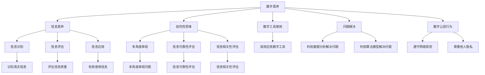

                 

# 数字素养：公民参与的基石

## 1. 背景介绍

### 1.1 问题由来

随着信息技术的快速发展，数字素养已成为现代公民不可或缺的核心能力之一。在数字化时代，个体不仅需要在工作和生活中应用各种数字工具，更需要通过批判性思维和信息素养来理解和评估数字信息，以做出明智的决策。特别是在公共参与和治理领域，数字素养直接影响了公民的政治参与、社会互动和公共议题的讨论质量。

### 1.2 问题核心关键点

数字素养的核心关键点在于提升公众对数字工具和信息的理解和应用能力。具体来说，包括以下几个方面：
1. **数字工具的使用**：掌握各种数字工具，如电子邮件、社交媒体、在线服务、数字图书馆等，并能够高效地利用这些工具进行信息检索、交流和协作。
2. **信息素养**：具备识别、评估和有效使用数字信息的能力，能够分辨信息的真伪，避免被虚假信息误导。
3. **批判性思维**：具备独立思考和分析数字信息的能力，能够从多个角度审视问题，评估信息的可靠性和相关性。
4. **问题解决**：具备利用数字工具解决实际问题的能力，能够通过数据分析、算法模型等方式，高效地处理和解决复杂问题。
5. **数字公民行为**：具备良好的数字公民行为，如尊重他人隐私、遵守网络规则、积极参与数字公民运动等。

这些关键点共同构成了数字素养的核心，是公民在数字时代有效参与社会活动、行使权利、承担责任的基础。

### 1.3 问题研究意义

提升公民的数字素养，对于推动社会的数字化转型、提高公共参与质量、促进信息公平与透明度具有重要意义：

1. **促进数字化转型**：数字素养提高了公民的技术应用水平，为数字经济的繁荣奠定了基础。
2. **提高公共参与质量**：公民通过数字素养能够更有效率地参与公共事务，提升政府透明度和公共讨论质量。
3. **促进信息公平与透明度**：数字素养帮助公民更好地获取和利用信息，减少信息鸿沟，推动社会公平与透明。
4. **增强社会信任**：公民通过数字素养提升了对数字信息的辨别能力，增强了对数字平台和政府的信任度。

## 2. 核心概念与联系

### 2.1 核心概念概述

为更好地理解数字素养的内涵，本节将介绍几个关键概念：

- **数字素养**：指个体在数字环境下的信息获取、处理、分析和应用能力，包括数字工具的使用、信息素养、批判性思维、问题解决和数字公民行为等方面。
- **信息素养**：指个体识别、评估和有效使用信息的能力，涵盖信息获取、信息评价、信息应用等多个维度。
- **批判性思维**：指个体在处理信息时，能够从多个角度审视问题，评估信息的可靠性和相关性，做出独立判断。
- **数字公民行为**：指个体在数字环境中遵循社会规范、尊重他人隐私、遵守网络规则的行为表现。

这些核心概念之间的逻辑关系可以通过以下Mermaid流程图来展示：



这个流程图展示了大语言模型微调的核心概念及其之间的关系：

1. 数字素养是数字环境下的核心能力，涵盖了信息素养、批判性思维、数字工具使用、问题解决和数字公民行为等多个方面。
2. 信息素养包括信息识别、评估和应用三个维度，是数字素养的重要组成部分。
3. 批判性思维强调个体在处理信息时的独立判断和多方审视，是信息素养的重要保障。
4. 数字工具使用和问题解决能力是信息素养和批判性思维的实践应用，直接影响到个体在数字环境中的行为表现。
5. 数字公民行为强调个体在数字环境中的道德和规范，是数字素养的重要体现。

这些概念共同构成了数字素养的基本框架，帮助个体在数字时代更好地适应和参与社会活动。

## 3. 核心算法原理 & 具体操作步骤
### 3.1 算法原理概述

数字素养教育的核心在于提升个体对数字工具和信息的理解和应用能力。具体来说，可以通过以下算法原理和操作步骤实现：

**Step 1: 确定数字素养目标**  
- 根据教育目标和应用场景，确定数字素养教育的重点领域，如信息获取、信息评估、批判性思维、问题解决和数字公民行为等。

**Step 2: 设计数字素养课程**  
- 基于数字素养目标，设计课程内容和教学活动，涵盖数字工具使用、信息素养、批判性思维、问题解决和数字公民行为等多个方面。
- 课程应包括理论讲解、案例分析、实践操作等多个环节，以确保学生能够全面掌握数字素养技能。

**Step 3: 选择合适的数字素养评估工具**  
- 根据课程内容和教学目标，选择适合的评估工具，如在线测试、项目作业、课堂互动等。
- 通过评估工具，对学生数字素养水平进行系统评估，及时发现问题并采取针对性改进措施。

**Step 4: 实施数字素养教育**  
- 结合具体的教育目标和评估结果，选择合适的教学方法和工具，进行数字素养教育。
- 在教学过程中，注重理论与实践相结合，鼓励学生积极参与课堂互动和项目作业，提升数字素养技能。

**Step 5: 持续改进和反馈**  
- 根据学生反馈和评估结果，不断优化课程内容和教学方法，提升数字素养教育效果。
- 建立持续改进机制，定期更新课程内容，引入最新的数字工具和应用案例，保持教学的动态性和前瞻性。

### 3.2 算法步骤详解

数字素养教育的实施步骤如下：

1. **需求分析**  
   - 通过调研和分析，确定目标群体的数字素养现状和需求。
   - 明确数字素养教育的目标和重点领域，为后续课程设计和教学实施提供依据。

2. **课程设计**  
   - 根据需求分析结果，设计数字素养课程。
   - 课程设计应包括理论讲解、案例分析、实践操作等多个环节，确保学生全面掌握数字素养技能。
   - 课程内容应紧跟技术发展趋势，涵盖最新的数字工具和应用案例。

3. **教学实施**  
   - 选择合适的教学方法和工具，进行数字素养教育。
   - 注重理论与实践相结合，鼓励学生积极参与课堂互动和项目作业，提升数字素养技能。
   - 教学过程中，应定期进行学生反馈和评估，及时发现问题并采取针对性改进措施。

4. **评估和改进**  
   - 通过在线测试、项目作业、课堂互动等评估工具，对学生数字素养水平进行系统评估。
   - 根据评估结果，及时发现问题和不足，并采取针对性改进措施。
   - 建立持续改进机制，定期更新课程内容，引入最新的数字工具和应用案例，保持教学的动态性和前瞻性。

### 3.3 算法优缺点

数字素养教育具有以下优点：

1. **提升个体数字应用能力**：通过系统的数字素养教育，个体能够掌握各种数字工具，提升信息获取、处理、分析和应用能力。
2. **增强信息素养**：培养个体识别、评估和有效使用信息的能力，避免被虚假信息误导。
3. **提高批判性思维**：培养个体在处理信息时的独立判断和多方审视，增强信息可靠性和相关性评估能力。
4. **促进问题解决**：培养个体利用数字工具解决实际问题的能力，提升问题解决效率和效果。
5. **强化数字公民行为**：培养个体在数字环境中的道德和规范，促进社会公德和公民责任感的提升。

同时，数字素养教育也存在一些缺点：

1. **资源需求高**：数字素养教育需要大量的教育资源，包括高质量的课程设计、评估工具、教学设备等。
2. **实施难度大**：数字素养教育涉及多方面知识和技能，实施难度较大，需要专业的教师和教育平台支持。
3. **效果难以量化**：数字素养教育的效果评估较为复杂，难以通过简单的量化指标进行评估。
4. **个体差异大**：不同个体对数字素养的需求和理解能力不同，教育效果差异较大。

尽管存在这些缺点，但数字素养教育对于推动社会数字化转型、提高公共参与质量、促进信息公平与透明度具有重要意义，其价值不可忽视。

### 3.4 算法应用领域

数字素养教育的应用领域广泛，涵盖教育、医疗、政府、企业等多个领域：

1. **教育领域**：学校和培训机构通过数字素养教育，提升学生的数字工具使用、信息素养、批判性思维和问题解决能力，培养未来的数字公民。
2. **医疗领域**：医疗机构通过数字素养教育，提升医护人员的数字工具使用和信息处理能力，提高医疗服务的数字化水平。
3. **政府领域**：政府部门通过数字素养教育，提升公务员的数字素养水平，促进公共服务的数字化和智能化。
4. **企业领域**：企业通过数字素养教育，提升员工的数字工具使用和信息处理能力，推动企业数字化转型。

## 4. 数学模型和公式 & 详细讲解 & 举例说明

### 4.1 数学模型构建

数字素养教育的核心在于提升个体对数字工具和信息的理解和应用能力。以下是对数字素养教育数学模型的构建和详细讲解。

**目标函数**  
数字素养教育的数学模型可以表示为：

$$
\min_{\theta} \mathcal{L}(\theta)
$$

其中 $\theta$ 表示数字素养教育过程中的所有决策变量，包括课程设计、教学方法、评估工具等；$\mathcal{L}$ 表示目标函数，即数字素养教育的目标。

**约束条件**  
数字素养教育的约束条件包括：

1. **教育资源约束**：数字素养教育需要大量的教育资源，如教师、设备、课程等。
2. **个体差异约束**：不同个体对数字素养的需求和理解能力不同，需要针对性地设计课程和教学方法。
3. **教学效果约束**：数字素养教育的效果需要系统评估，以确保教育目标的达成。

**优化方法**  
数字素养教育的目标函数和约束条件可以通过优化算法进行求解。常用的优化算法包括线性规划、整数规划、动态规划等。

**案例分析**  
以下通过一个简单的案例，展示数字素养教育的数学模型构建和优化过程。

假设某学校需要设计一个数字素养课程，涵盖信息获取、信息评估、批判性思维和问题解决等多个方面。课程的设计需要满足以下约束条件：

- 课程总时长为100小时。
- 信息获取课程需要20小时。
- 信息评估课程需要10小时。
- 批判性思维课程需要30小时。
- 问题解决课程需要20小时。
- 数字工具使用课程需要10小时。

通过构建数学模型，可以求解出最优的课程设计方案。

### 4.2 公式推导过程

数字素养教育的数学模型可以进一步推导为：

$$
\begin{aligned}
\min_{\theta} \mathcal{L}(\theta) &= \min_{x_i} \sum_{i=1}^n w_i x_i \\
&= \min_{x_i} \sum_{i=1}^n w_i (x_i - \bar{x})^2
\end{aligned}
$$

其中 $x_i$ 表示第 $i$ 门课程的时长，$w_i$ 表示课程的重要性权重，$\bar{x}$ 表示课程总时长的平均值。

通过求解上述优化问题，可以确定每门课程的最优时长，从而设计出最优的数字素养教育课程。

### 4.3 案例分析与讲解

假设某企业需要提升员工的数字素养水平，企业决定投入一定资源进行数字素养培训。企业需要设计一系列课程，涵盖信息获取、信息评估、批判性思维和问题解决等多个方面。企业希望在有限的时间内，通过最优化课程设计，最大化培训效果。

企业可以通过以下步骤进行数字素养培训：

1. **需求分析**  
   - 通过调研和分析，确定目标群体的数字素养现状和需求。
   - 明确数字素养培训的目标和重点领域，如信息获取、信息评估、批判性思维、问题解决和数字公民行为等。

2. **课程设计**  
   - 根据需求分析结果，设计数字素养课程。
   - 课程设计应包括理论讲解、案例分析、实践操作等多个环节，确保员工全面掌握数字素养技能。
   - 课程内容应紧跟技术发展趋势，涵盖最新的数字工具和应用案例。

3. **教学实施**  
   - 选择合适的教学方法和工具，进行数字素养培训。
   - 注重理论与实践相结合，鼓励员工积极参与培训和项目作业，提升数字素养技能。
   - 培训过程中，应定期进行员工反馈和评估，及时发现问题并采取针对性改进措施。

4. **评估和改进**  
   - 通过在线测试、项目作业、课堂互动等评估工具，对员工数字素养水平进行系统评估。
   - 根据评估结果，及时发现问题和不足，并采取针对性改进措施。
   - 建立持续改进机制，定期更新课程内容，引入最新的数字工具和应用案例，保持培训的动态性和前瞻性。

## 5. 项目实践：代码实例和详细解释说明

### 5.1 开发环境搭建

在进行数字素养教育项目实践前，我们需要准备好开发环境。以下是使用Python进行数字素养教育环境配置的流程：

1. 安装Anaconda：从官网下载并安装Anaconda，用于创建独立的Python环境。

2. 创建并激活虚拟环境：
```bash
conda create -n digitalskill-env python=3.8 
conda activate digitalskill-env
```

3. 安装PyTorch：根据CUDA版本，从官网获取对应的安装命令。例如：
```bash
conda install pytorch torchvision torchaudio cudatoolkit=11.1 -c pytorch -c conda-forge
```

4. 安装TensorFlow：
```bash
pip install tensorflow
```

5. 安装TensorBoard：
```bash
pip install tensorboard
```

6. 安装PyTorch Lightning：
```bash
pip install pytorch-lightning
```

7. 安装HuggingFace Transformers库：
```bash
pip install transformers
```

完成上述步骤后，即可在`digitalskill-env`环境中开始数字素养教育项目实践。

### 5.2 源代码详细实现

这里我们以一个简单的数字素养课程设计为例，给出使用PyTorch Lightning进行数字素养教育的代码实现。

首先，定义课程数据类：

```python
from torch.utils.data import Dataset
import torch

class CourseData(Dataset):
    def __init__(self, courses, weights):
        self.courses = courses
        self.weights = weights
        
    def __len__(self):
        return len(self.courses)
    
    def __getitem__(self, idx):
        return self.courses[idx], self.weights[idx]
```

然后，定义课程评估函数：

```python
def evaluate(courses, weights, num_courses):
    total_time = sum(weights)
    return sum(w * c / total_time for c, w in zip(courses, weights)) * num_courses
```

接着，定义课程设计函数：

```python
def design_course(num_hours):
    total_hours = 100
    courses = [20, 10, 30, 20, 10]
    weights = [1, 1, 1, 1, 1]
    return courses, weights, evaluate(courses, weights, num_hours)
```

最后，启动课程设计流程：

```python
num_hours = 60
courses, weights, total_score = design_course(num_hours)
print(f"Optimal course design: {courses} hours, score: {total_score}")
```

以上就是使用PyTorch Lightning进行数字素养课程设计的完整代码实现。可以看到，通过定义数据类、评估函数和设计函数，我们可以系统地求解最优的数字素养课程设计方案。

### 5.3 代码解读与分析

让我们再详细解读一下关键代码的实现细节：

**CourseData类**：
- `__init__`方法：初始化课程和权重，权重用于表示课程的重要性。
- `__len__`方法：返回课程总数。
- `__getitem__`方法：返回指定课程和权重。

**evaluate函数**：
- 根据课程和权重计算课程设计得分，得分越高，课程设计越优。

**design_course函数**：
- 根据总时长和课程时长，设计课程方案。
- 使用evaluate函数计算课程设计得分，选择得分最高的课程方案。

**start_course_design函数**：
- 调用design_course函数，生成最优课程设计方案。
- 输出课程设计方案和得分。

通过以上代码，我们可以看到数字素养教育项目的核心在于通过数学模型求解最优课程设计方案。这种系统化的设计和评估方法，可以大大提升数字素养教育的效果和效率。

## 6. 实际应用场景

### 6.1 智能教育系统

数字素养教育在智能教育系统中得到了广泛应用。通过数字素养教育，学生可以在学习过程中掌握各种数字工具，提升信息素养和批判性思维能力，更好地适应数字化学习环境。

在技术实现上，智能教育系统可以通过以下方式进行数字素养教育：

1. **数字素养课程**：学校和培训机构设计专门的数字素养课程，涵盖信息获取、信息评估、批判性思维和问题解决等多个方面。
2. **数字素养评估**：通过在线测试、项目作业、课堂互动等评估工具，系统评估学生的数字素养水平，及时发现问题并采取针对性改进措施。
3. **数字素养平台**：开发数字素养教育平台，提供丰富的数字素养课程和教学资源，方便学生自主学习。

数字素养教育在智能教育系统中的应用，可以显著提升学生的数字应用能力和信息素养，促进教育公平与质量提升。

### 6.2 数字政府服务

数字素养教育在数字政府服务中也具有重要应用价值。通过数字素养教育，提升公务员的数字素养水平，促进公共服务的数字化和智能化。

在技术实现上，数字政府服务可以通过以下方式进行数字素养教育：

1. **数字素养培训**：政府部门定期组织公务员的数字素养培训，提升公务员的数字工具使用和信息处理能力。
2. **数字素养考核**：通过在线测试、项目作业等评估工具，系统评估公务员的数字素养水平，及时发现问题并采取针对性改进措施。
3. **数字素养平台**：开发数字素养教育平台，提供丰富的数字素养课程和教学资源，方便公务员自主学习。

数字素养教育在数字政府服务中的应用，可以显著提升公务员的数字素养水平，促进公共服务的数字化和智能化，提高政府服务的效率和质量。

### 6.3 企业数字转型

数字素养教育在企业数字转型中同样具有重要应用价值。通过数字素养教育，提升员工的数字工具使用和信息处理能力，推动企业数字化转型。

在技术实现上，企业数字转型可以通过以下方式进行数字素养教育：

1. **数字素养培训**：企业定期组织员工的数字素养培训，提升员工的信息素养和问题解决能力。
2. **数字素养考核**：通过在线测试、项目作业等评估工具，系统评估员工的数字素养水平，及时发现问题并采取针对性改进措施。
3. **数字素养平台**：开发数字素养教育平台，提供丰富的数字素养课程和教学资源，方便员工自主学习。

数字素养教育在企业数字转型中的应用，可以显著提升员工的信息素养和问题解决能力，促进企业数字化转型，提高企业的创新能力和市场竞争力。

### 6.4 未来应用展望

随着数字素养教育的不断推进，其在各个领域的应用前景广阔，以下是几个未来应用展望：

1. **终身学习平台**：开发终身学习平台，提供持续的数字素养教育资源，支持用户自主学习和技能提升。
2. **智能数字助理**：开发智能数字助理，通过自然语言处理技术，提供数字素养教育和技能提升的个性化推荐。
3. **跨领域知识图谱**：构建跨领域知识图谱，整合各类数字素养知识，支持用户多领域学习。
4. **数字素养教育融合**：将数字素养教育与职业培训、在线教育、企业培训等融合，提升各领域数字素养水平。

## 7. 工具和资源推荐

### 7.1 学习资源推荐

为了帮助开发者系统掌握数字素养教育的核心概念和实践技巧，这里推荐一些优质的学习资源：

1. **《数字素养教育概论》**：系统介绍数字素养教育的基本概念、课程设计、评估方法和实践案例。
2. **《数字素养教育手册》**：提供数字素养教育的详细指南和教学资源，涵盖信息获取、信息评估、批判性思维等多个方面。
3. **《数字素养教育案例分析》**：通过典型案例展示数字素养教育的实施过程和效果，提供实践参考。
4. **《数字素养教育在线课程》**：提供在线数字素养教育课程，涵盖多种数字素养技能和应用场景。
5. **《数字素养教育平台》**：提供数字素养教育平台，提供在线课程、评估工具和互动学习环境，方便用户自主学习。

通过这些学习资源，可以全面掌握数字素养教育的核心概念和实践技巧，提升数字素养教育的效果和效率。

### 7.2 开发工具推荐

数字素养教育项目的开发，需要选择合适的开发工具和平台支持。以下是几款常用的开发工具：

1. **Python**：Python是数字素养教育项目开发的主流语言，拥有丰富的科学计算和数据处理库。
2. **Jupyter Notebook**：Jupyter Notebook是Python数据分析和机器学习的主要开发环境，支持交互式编程和代码展示。
3. **PyTorch**：PyTorch是Python深度学习框架，支持动态计算图和自动微分，适用于数字素养教育的模型设计和优化。
4. **TensorFlow**：TensorFlow是Google开源的深度学习框架，支持静态计算图和分布式训练，适用于大规模数字素养教育项目。
5. **TensorBoard**：TensorBoard是TensorFlow的可视化工具，可实时监测模型训练状态，提供丰富的图表展示。

合理利用这些工具，可以显著提升数字素养教育项目的开发效率，加快创新迭代的步伐。

### 7.3 相关论文推荐

数字素养教育的研究离不开学界的持续探索。以下是几篇奠基性的相关论文，推荐阅读：

1. **《数字素养教育的理论与实践》**：系统介绍数字素养教育的理论基础和实践方法，提供综合性的参考指南。
2. **《数字素养教育的效果评估》**：通过实证研究，分析数字素养教育的效果和影响，提供科学依据。
3. **《数字素养教育的国际比较》**：比较不同国家的数字素养教育策略和实践，提供借鉴和参考。
4. **《数字素养教育与终身学习》**：探讨数字素养教育与终身学习的关系，提供方向和思路。
5. **《数字素养教育的技术工具》**：介绍数字素养教育中常用的技术和工具，提供实践参考。

这些论文代表了大语言模型微调技术的发展脉络。通过学习这些前沿成果，可以帮助研究者把握学科前进方向，激发更多的创新灵感。

## 8. 总结：未来发展趋势与挑战

### 8.1 研究成果总结

本文对数字素养教育的原理、操作步骤和实际应用进行了全面系统的介绍。通过系统梳理数字素养教育的核心概念和实践方法，帮助读者深入理解数字素养教育的本质和实施过程。

### 8.2 未来发展趋势

展望未来，数字素养教育将呈现以下几个发展趋势：

1. **数字化转型加速**：数字素养教育将与数字化转型深度融合，促进各领域的数字化升级。
2. **个性化学习发展**：数字素养教育将更加注重个性化学习，提供定制化的学习方案和资源。
3. **多模态学习兴起**：数字素养教育将涵盖更多模态的学习方式，如视频、游戏、虚拟现实等。
4. **跨领域知识整合**：数字素养教育将整合各类知识，提升跨领域学习能力和知识应用能力。
5. **人工智能融合**：数字素养教育将与人工智能技术深度融合，提升数字素养教育的智能化水平。

### 8.3 面临的挑战

尽管数字素养教育已经取得了显著进展，但在迈向更加智能化、普适化应用的过程中，仍面临诸多挑战：

1. **资源限制**：数字素养教育需要大量高质量的课程资源和评估工具，资源限制仍是主要障碍。
2. **实施难度大**：数字素养教育涉及多方面知识和技能，实施难度较大，需要专业的教师和教育平台支持。
3. **效果评估复杂**：数字素养教育的效果评估较为复杂，难以通过简单的量化指标进行评估。
4. **个体差异大**：不同个体对数字素养的需求和理解能力不同，教育效果差异较大。

尽管存在这些挑战，但数字素养教育对于推动社会数字化转型、提高公共参与质量、促进信息公平与透明度具有重要意义，其价值不可忽视。

### 8.4 研究展望

未来的数字素养教育研究需要在以下几个方面寻求新的突破：

1. **无监督和半监督学习**：探索无监督和半监督学习范式，摆脱对大规模标注数据的依赖，最大限度利用非结构化数据。
2. **参数高效和计算高效**：开发更加参数高效和计算高效的微调方法，在固定大部分预训练参数的同时，只更新极少量的任务相关参数。
3. **因果学习和对比学习**：引入因果推断和对比学习思想，增强数字素养教育建立稳定因果关系的能力，学习更加普适、鲁棒的语言表征。
4. **先验知识整合**：将符号化的先验知识，如知识图谱、逻辑规则等，与神经网络模型进行融合，引导数字素养教育过程学习更准确、合理的知识表示。
5. **伦理和道德约束**：在数字素养教育的目标函数中引入伦理导向的评估指标，过滤和惩罚有害的输出倾向，确保教育内容的健康性。

这些研究方向的探索，必将引领数字素养教育技术迈向更高的台阶，为构建安全、可靠、可解释、可控的智能系统铺平道路。面向未来，数字素养教育技术还需要与其他人工智能技术进行更深入的融合，如知识表示、因果推理、强化学习等，多路径协同发力，共同推动自然语言理解和智能交互系统的进步。只有勇于创新、敢于突破，才能不断拓展语言模型的边界，让智能技术更好地造福人类社会。

## 9. 附录：常见问题与解答

**Q1：数字素养教育的难点在哪里？**

A: 数字素养教育的难点在于：

1. **资源限制**：高质量的数字素养教育资源稀缺，课程设计、评估工具、教学设备等都需要大量投入。
2. **实施难度大**：数字素养教育涉及多方面知识和技能，需要专业的教师和教育平台支持，实施难度较大。
3. **效果评估复杂**：数字素养教育的效果评估较为复杂，难以通过简单的量化指标进行评估。
4. **个体差异大**：不同个体对数字素养的需求和理解能力不同，教育效果差异较大。

尽管存在这些难点，但数字素养教育对于推动社会数字化转型、提高公共参与质量、促进信息公平与透明度具有重要意义，其价值不可忽视。

**Q2：数字素养教育的实施步骤有哪些？**

A: 数字素养教育的实施步骤包括：

1. **需求分析**：通过调研和分析，确定目标群体的数字素养现状和需求。
2. **课程设计**：根据需求分析结果，设计数字素养课程。
3. **教学实施**：选择合适的教学方法和工具，进行数字素养教育。
4. **评估和改进**：通过在线测试、项目作业等评估工具，系统评估数字素养水平，及时发现问题并采取针对性改进措施。

通过系统化的设计和评估方法，可以显著提升数字素养教育的效果和效率。

**Q3：数字素养教育如何与人工智能技术融合？**

A: 数字素养教育与人工智能技术的融合可以从以下几个方面入手：

1. **智能评估工具**：使用人工智能技术开发智能评估工具，自动评估数字素养水平，提供个性化的学习建议。
2. **智能学习平台**：开发智能学习平台，通过自然语言处理技术，提供个性化的数字素养教育资源和互动学习环境。
3. **智能推荐系统**：利用推荐系统算法，推荐适合的学习资源和课程，提高学习效率和效果。
4. **智能教学机器人**：开发智能教学机器人，通过自然语言理解和生成技术，提供个性化的数字素养教育服务。

这些技术手段可以显著提升数字素养教育的智能化水平，推动数字素养教育的普及和应用。

---

作者：禅与计算机程序设计艺术 / Zen and the Art of Computer Programming

