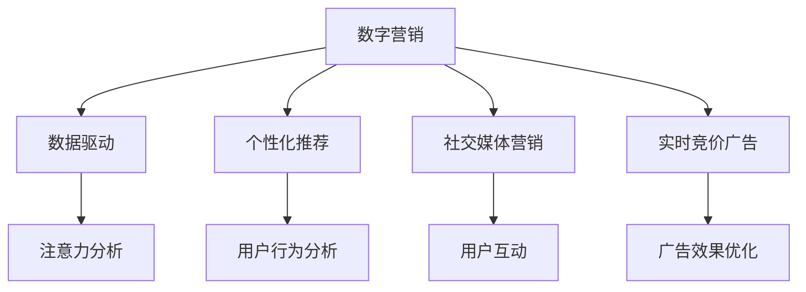

                 

# 数字营销在注意力经济中的演变

> 关键词：数字营销, 注意力经济, 用户行为, 数据驱动, 个性化推荐, 社交媒体, 内容营销, 大数据

## 1. 背景介绍

### 1.1 问题由来

在数字时代，信息量爆炸式增长，用户注意力成为稀缺资源。如何在海量信息中吸引并保持用户的注意力，成为数字营销的核心难题。随着技术的发展，数字营销的策略和手段不断演进，从传统的搜索优化(Search Engine Optimization, SEO)、内容营销(Content Marketing)，到如今的数据驱动、个性化推荐，逐步向基于注意力经济的新范式转变。

### 1.2 问题核心关键点

注意力经济的核心在于通过优化用户注意力获取和使用，最大化商业价值。具体体现在以下几个方面：
- 数据驱动：利用大数据和机器学习技术，精准分析用户行为和兴趣。
- 个性化推荐：根据用户历史行为和偏好，推荐个性化内容和服务。
- 内容营销：通过高价值内容吸引用户，形成品牌忠诚度。
- 社交媒体：借助社交网络，提升品牌曝光和用户参与度。
- 实时竞价广告：在用户注意力最集中时刻投放广告，提升广告效果。

这些策略共同构成了数字营销的注意力导向范式，成为数字经济时代企业获取竞争优势的关键。

### 1.3 问题研究意义

研究数字营销在注意力经济中的演变，对于理解数字营销的发展脉络和趋势，指导企业营销策略的优化，具有重要意义：

1. 掌握数字营销的最新技术动态，及时跟进行业前沿，保持竞争优势。
2. 提升广告投放和内容推荐的精准度，提高投资回报率，最大化商业价值。
3. 增强品牌在用户心中的影响力，提升用户粘性，构建长期用户关系。
4. 利用大数据分析，优化用户细分和市场定位，制定更加有效的营销策略。
5. 整合社交媒体资源，提升品牌曝光和用户参与度，扩展品牌影响力。

## 2. 核心概念与联系

### 2.1 核心概念概述

为更好地理解数字营销在注意力经济中的演变，本节将介绍几个关键概念：

- **数字营销**：通过互联网和移动设备，使用各种数字技术和渠道，将品牌、产品或服务信息传递给目标用户，以实现营销目标的策略和手段。
- **注意力经济**：一种经济形态，以用户注意力为核心资源，通过精准获取和高效利用注意力，创造商业价值。
- **数据驱动**：利用数据分析和机器学习技术，对用户行为进行分析和预测，指导营销决策。
- **个性化推荐**：根据用户历史行为和兴趣，推荐个性化的内容和服务，提升用户体验和转化率。
- **社交媒体营销**：利用社交网络平台，与用户进行互动，提升品牌曝光和用户参与度。
- **实时竞价广告**：在用户注意力最集中的时刻投放广告，最大化广告效果和转化率。

这些核心概念之间的联系可以通过以下Mermaid流程图来展示：



这个流程图展示了数字营销的核心概念及其之间的关系：

1. 数字营销依托数据驱动，利用用户行为分析，精准定位用户。
2. 个性化推荐和社交媒体营销进一步提升用户粘性和参与度。
3. 实时竞价广告利用用户注意力最集中时刻，最大化广告效果。
4. 注意力分析是数据驱动的基础，对用户注意力进行精细刻画。

这些概念共同构成了数字营销在注意力经济中的核心框架，使得营销活动能够更加精准和高效。

## 3. 核心算法原理 & 具体操作步骤
### 3.1 算法原理概述

数字营销中的注意力经济，主要依赖于以下几个关键算法：

- **用户行为分析算法**：通过分析用户的历史行为和互动数据，识别用户兴趣和偏好。
- **个性化推荐算法**：利用协同过滤、深度学习等技术，根据用户历史行为推荐个性化内容。
- **注意力模型算法**：建立用户注意力分布模型，预测用户在不同时间、不同场景下的注意力状态。
- **实时竞价广告算法**：根据用户注意力分布模型，在用户注意力最集中的时刻，投放广告。

这些算法共同作用，使得数字营销能够更好地吸引和保持用户的注意力，提升广告投放效果和用户体验。

### 3.2 算法步骤详解

基于注意力经济的数字营销，主要包括以下几个关键步骤：

**Step 1: 数据采集与预处理**
- 收集用户行为数据，如浏览记录、搜索记录、购买记录等。
- 数据清洗和去重，去除噪音和异常数据。
- 数据格式化，转化为模型所需的格式。

**Step 2: 用户行为分析**
- 利用统计分析和机器学习算法，对用户行为进行建模。
- 识别用户兴趣和偏好，生成用户画像。
- 利用聚类和分类算法，将用户分为不同群体。

**Step 3: 个性化推荐**
- 根据用户历史行为和兴趣，推荐个性化的内容和服务。
- 使用协同过滤、深度学习等算法，预测用户未来行为。
- 实时更新推荐系统，根据用户最新行为进行优化。

**Step 4: 注意力模型建立**
- 分析用户在不同时间、不同场景下的注意力分布。
- 建立注意力模型，预测用户注意力状态。
- 利用注意力模型，优化广告投放时间和频率。

**Step 5: 实时竞价广告**
- 实时监测用户注意力分布，识别广告投放时机。
- 根据用户注意力状态，动态调整广告预算。
- 利用实时竞价技术，在用户注意力最集中的时刻投放广告。

以上是基于注意力经济的数字营销的一般流程。在实际应用中，还需要针对具体任务和平台，对各环节进行优化设计，如改进数据采集工具、选择更合适的推荐算法、优化注意力模型参数等，以进一步提升营销效果。

### 3.3 算法优缺点

基于注意力经济的数字营销，具有以下优点：
1. 精准定位：通过数据分析和机器学习，精准获取和分析用户行为，提升投放精准度。
2. 个性化推荐：利用个性化推荐算法，提高用户满意度和转化率。
3. 高效广告投放：利用实时竞价广告技术，在用户注意力最集中的时刻投放广告，提升广告效果。
4. 动态优化：通过实时监测和优化，不断调整营销策略，最大化商业价值。

同时，该方法也存在一定的局限性：
1. 数据依赖：依赖高质量、大规模的用户行为数据，数据获取成本高。
2. 模型复杂：多算法结合增加了模型复杂度，优化难度较大。
3. 隐私问题：用户数据隐私保护问题，如数据泄露、隐私滥用等。
4. 算法偏见：模型可能存在算法偏见，导致不公平的推荐和投放。
5. 实时性要求高：实时竞价广告对系统实时性要求较高，系统设计复杂。

尽管存在这些局限性，但就目前而言，基于注意力经济的数字营销仍是最主流和有效的营销策略之一。未来相关研究的重点在于如何进一步降低数据依赖，提高模型的可解释性和公平性，同时兼顾广告投放的实时性和效率。

### 3.4 算法应用领域

基于注意力经济的数字营销方法，已经在多个领域得到了广泛应用，包括：

- 电子商务：通过个性化推荐和实时竞价广告，提升产品转化率，增加销售额。
- 社交媒体：利用社交网络数据分析，提升品牌曝光和用户参与度。
- 内容平台：根据用户行为推荐相关内容，提升用户粘性和留存率。
- 移动应用：通过数据分析优化用户界面和内容推荐，提高用户体验和留存率。
- 广告行业：利用实时竞价广告技术，提高广告效果和投资回报率。

除了上述这些经典应用外，基于注意力经济的数字营销还被创新性地应用到更多场景中，如精准营销、智能客服、个性化营销等，为数字经济带来全新的突破。随着技术的发展和市场的变化，相信基于注意力经济的数字营销将继续拓展其应用边界，为数字经济的发展注入新的动力。

## 4. 数学模型和公式 & 详细讲解 & 举例说明
### 4.1 数学模型构建

为更好地理解基于注意力经济的数字营销模型，本节将介绍几个关键数学模型：

- **用户行为模型**：利用概率模型，对用户行为进行建模和预测。
- **推荐系统模型**：利用协同过滤、深度学习等算法，推荐个性化内容。
- **注意力模型**：利用神经网络模型，预测用户注意力状态。
- **实时竞价模型**：利用优化算法，在用户注意力最集中时刻投放广告。

假设用户行为数据为 $\mathcal{D}=\{(x_i, y_i)\}_{i=1}^N, x_i \in \mathcal{X}, y_i \in \mathcal{Y}$，其中 $\mathcal{X}$ 为用户行为特征空间，$\mathcal{Y}$ 为行为标签空间。则用户行为模型可以表示为：

$$
P(Y|X; \theta) = \frac{e^{V(X; \theta)^Ty}}{\sum_{y' \in \mathcal{Y}}e^{V(X; \theta)^{y'}}}
$$

其中 $V(X; \theta)$ 为特征向量表示，$\theta$ 为模型参数。

个性化推荐系统可以表示为：

$$
R(X; \theta) = \max_{y \in \mathcal{Y}}P(y|X; \theta)
$$

其中 $R(X; \theta)$ 为用户推荐的内容。

注意力模型可以表示为：

$$
A(t|X, T; \theta) = \frac{e^{Q(t|X; \theta)}}{\sum_{t' \in \mathcal{T}}e^{Q(t'|X; \theta)}}
$$

其中 $A(t|X, T; \theta)$ 为时间 $t$ 用户对内容 $T$ 的注意力，$Q(t|X; \theta)$ 为注意力模型。

实时竞价模型可以表示为：

$$
C(t; \theta) = \arg\min_{x \in \mathcal{X}}\{C(t; x, \theta) + \lambda P(X|C; \theta)\}
$$

其中 $C(t; x, \theta)$ 为广告费用，$P(X|C; \theta)$ 为广告效果，$\lambda$ 为广告效果权重。

### 4.2 公式推导过程

以下我们以个性化推荐系统为例，推导推荐算法及其优化目标。

假设用户行为数据为 $\mathcal{D}=\{(x_i, y_i)\}_{i=1}^N$，其中 $x_i$ 为用户行为特征向量，$y_i$ 为行为标签。个性化推荐系统可以表示为：

$$
R(X; \theta) = \max_{y \in \mathcal{Y}}P(y|X; \theta)
$$

利用最大化似然估计，得到推荐算法目标函数：

$$
\max_{\theta} \frac{1}{N} \sum_{i=1}^N \log P(y_i|x_i; \theta)
$$

在实践中，通常使用基于梯度的优化算法（如Adam、SGD等）来求解上述目标函数。设 $\eta$ 为学习率，则参数更新公式为：

$$
\theta \leftarrow \theta - \eta \nabla_{\theta}L(\theta)
$$

其中 $\nabla_{\theta}L(\theta)$ 为损失函数对参数 $\theta$ 的梯度，可通过反向传播算法高效计算。

在得到推荐算法目标函数后，即可带入参数更新公式，完成模型的迭代优化。重复上述过程直至收敛，最终得到最优推荐参数 $\theta^*$。

## 5. 项目实践：代码实例和详细解释说明
### 5.1 开发环境搭建

在进行数字营销项目的开发前，我们需要准备好开发环境。以下是使用Python进行PyTorch开发的环境配置流程：

1. 安装Anaconda：从官网下载并安装Anaconda，用于创建独立的Python环境。

2. 创建并激活虚拟环境：
```bash
conda create -n pytorch-env python=3.8 
conda activate pytorch-env
```

3. 安装PyTorch：根据CUDA版本，从官网获取对应的安装命令。例如：
```bash
conda install pytorch torchvision torchaudio cudatoolkit=11.1 -c pytorch -c conda-forge
```

4. 安装Transformers库：
```bash
pip install transformers
```

5. 安装各类工具包：
```bash
pip install numpy pandas scikit-learn matplotlib tqdm jupyter notebook ipython
```

完成上述步骤后，即可在`pytorch-env`环境中开始项目实践。

### 5.2 源代码详细实现

这里我们以个性化推荐系统为例，给出使用Transformers库进行推荐模型微调的PyTorch代码实现。

首先，定义推荐模型的特征处理函数：

```python
from transformers import BertTokenizer
from torch.utils.data import Dataset
import torch

class RecommendationDataset(Dataset):
    def __init__(self, features, labels, tokenizer, max_len=128):
        self.features = features
        self.labels = labels
        self.tokenizer = tokenizer
        self.max_len = max_len
        
    def __len__(self):
        return len(self.features)
    
    def __getitem__(self, item):
        feature = self.features[item]
        label = self.labels[item]
        
        encoding = self.tokenizer(feature, return_tensors='pt', max_length=self.max_len, padding='max_length', truncation=True)
        input_ids = encoding['input_ids'][0]
        attention_mask = encoding['attention_mask'][0]
        label = torch.tensor(label, dtype=torch.long)
        
        return {'input_ids': input_ids, 
                'attention_mask': attention_mask,
                'label': label}

# 使用BertTokenizer分词，特征长度限定为128
tokenizer = BertTokenizer.from_pretrained('bert-base-cased')

# 假设已有训练集数据 features 和 labels
train_dataset = RecommendationDataset(features, labels, tokenizer)
```

然后，定义推荐模型和优化器：

```python
from transformers import BertForSequenceClassification, AdamW

model = BertForSequenceClassification.from_pretrained('bert-base-cased', num_labels=2)

optimizer = AdamW(model.parameters(), lr=2e-5)
```

接着，定义训练和评估函数：

```python
from torch.utils.data import DataLoader
from tqdm import tqdm
from sklearn.metrics import accuracy_score

device = torch.device('cuda') if torch.cuda.is_available() else torch.device('cpu')
model.to(device)

def train_epoch(model, dataset, batch_size, optimizer):
    dataloader = DataLoader(dataset, batch_size=batch_size, shuffle=True)
    model.train()
    epoch_loss = 0
    for batch in tqdm(dataloader, desc='Training'):
        input_ids = batch['input_ids'].to(device)
        attention_mask = batch['attention_mask'].to(device)
        labels = batch['label'].to(device)
        model.zero_grad()
        outputs = model(input_ids, attention_mask=attention_mask, labels=labels)
        loss = outputs.loss
        epoch_loss += loss.item()
        loss.backward()
        optimizer.step()
    return epoch_loss / len(dataloader)

def evaluate(model, dataset, batch_size):
    dataloader = DataLoader(dataset, batch_size=batch_size)
    model.eval()
    preds, labels = [], []
    with torch.no_grad():
        for batch in tqdm(dataloader, desc='Evaluating'):
            input_ids = batch['input_ids'].to(device)
            attention_mask = batch['attention_mask'].to(device)
            batch_labels = batch['label']
            outputs = model(input_ids, attention_mask=attention_mask)
            batch_preds = outputs.logits.argmax(dim=2).to('cpu').tolist()
            batch_labels = batch_labels.to('cpu').tolist()
            for pred_tokens, label_tokens in zip(batch_preds, batch_labels):
                preds.append(pred_tokens)
                labels.append(label_tokens)
                
    print(f"Accuracy: {accuracy_score(labels, preds)}")
```

最后，启动训练流程并在测试集上评估：

```python
epochs = 5
batch_size = 16

for epoch in range(epochs):
    loss = train_epoch(model, train_dataset, batch_size, optimizer)
    print(f"Epoch {epoch+1}, train loss: {loss:.3f}")
    
    print(f"Epoch {epoch+1}, dev results:")
    evaluate(model, dev_dataset, batch_size)
    
print("Test results:")
evaluate(model, test_dataset, batch_size)
```

以上就是使用PyTorch对BERT进行推荐系统微调的完整代码实现。可以看到，得益于Transformers库的强大封装，我们可以用相对简洁的代码完成BERT模型的加载和微调。

### 5.3 代码解读与分析

让我们再详细解读一下关键代码的实现细节：

**RecommendationDataset类**：
- `__init__`方法：初始化特征、标签、分词器等关键组件。
- `__len__`方法：返回数据集的样本数量。
- `__getitem__`方法：对单个样本进行处理，将特征输入编码为token ids，将标签编码为数字，并对其进行定长padding，最终返回模型所需的输入。

**tokenizer**：
- 使用BertTokenizer对特征进行分词，限定特征长度为128。

**训练和评估函数**：
- 使用PyTorch的DataLoader对数据集进行批次化加载，供模型训练和推理使用。
- 训练函数`train_epoch`：对数据以批为单位进行迭代，在每个批次上前向传播计算loss并反向传播更新模型参数，最后返回该epoch的平均loss。
- 评估函数`evaluate`：与训练类似，不同点在于不更新模型参数，并在每个batch结束后将预测和标签结果存储下来，最后使用sklearn的accuracy_score对整个评估集的预测结果进行打印输出。

**训练流程**：
- 定义总的epoch数和batch size，开始循环迭代
- 每个epoch内，先在训练集上训练，输出平均loss
- 在验证集上评估，输出精度指标
- 所有epoch结束后，在测试集上评估，给出最终测试结果

可以看到，PyTorch配合Transformers库使得BERT微调的代码实现变得简洁高效。开发者可以将更多精力放在数据处理、模型改进等高层逻辑上，而不必过多关注底层的实现细节。

当然，工业级的系统实现还需考虑更多因素，如模型的保存和部署、超参数的自动搜索、更灵活的任务适配层等。但核心的微调范式基本与此类似。

## 6. 实际应用场景
### 6.1 智能推荐系统

基于数据驱动的数字营销，广泛应用于智能推荐系统的构建。传统推荐系统往往只依赖用户历史行为数据进行推荐，难以捕捉用户的隐式需求和偏好。通过分析用户的搜索历史、浏览记录等隐式行为，利用注意力模型和推荐算法，智能推荐系统可以更加精准地推荐个性化内容，提升用户满意度。

在技术实现上，可以收集用户的搜索、浏览、购买等行为数据，构建基于Attention的推荐模型，实时预测用户兴趣并推荐相关商品。例如，电商平台可以根据用户浏览历史，推荐可能感兴趣的商品，提升用户的购买转化率。

### 6.2 内容管理系统

内容管理系统利用数据驱动的推荐算法，提升用户粘性和留存率。对于新闻、博客、视频等平台，通过分析用户行为和偏好，推荐个性化的内容，使内容能够更精准地触达用户，提升用户互动和留存率。

例如，新闻平台可以根据用户历史阅读记录和点赞行为，推荐用户可能感兴趣的新闻和文章。视频平台可以通过分析用户观看历史和互动数据，推荐相关视频内容，提升用户的观看时长和满意度。

### 6.3 实时广告投放

实时竞价广告通过分析用户注意力分布，在用户最关注的时间段投放广告，最大化广告效果和投资回报率。广告主可以通过实时竞价系统，动态调整广告预算和投放策略，使广告在最佳时机触达用户。

例如，电商平台可以在用户浏览高峰期投放广告，提升广告点击率和转化率。社交媒体可以在用户活跃时间段推送广告，提高用户互动和品牌曝光。

### 6.4 未来应用展望

随着数字营销技术的不断发展，基于注意力经济的数字营销将呈现以下几个发展趋势：

1. 数据驱动的智能推荐系统将更加普及，利用用户行为数据和注意力模型，提升推荐精度和用户体验。
2. 实时竞价广告技术将进一步完善，提升广告投放的精准度和效果。
3. 跨平台、跨设备的用户行为分析将更加重要，帮助企业更好地理解用户需求。
4. 个性化推荐算法将更加复杂多样，如基于深度学习的推荐模型、基于图神经网络的推荐算法等，提升推荐效果。
5. 用户隐私保护和数据安全将更加重视，提升用户信任度和品牌形象。
6. 内容创作和分发将更加智能化，利用AI生成高质量内容，提升内容质量和用户满意度。

以上趋势凸显了数字营销技术的广阔前景。这些方向的探索发展，将进一步提升数字营销的效果和效率，为企业提供更精准的营销策略和更高的投资回报。

## 7. 工具和资源推荐
### 7.1 学习资源推荐

为了帮助开发者系统掌握数字营销在注意力经济中的演变，这里推荐一些优质的学习资源：

1. 《深度学习基础》课程：斯坦福大学提供的免费在线课程，介绍了深度学习的基本概念和实现方法。
2. 《自然语言处理》课程：清华大学开设的NLP课程，系统讲解了NLP的基本理论和应用。
3. 《推荐系统实践》书籍：一本关于推荐系统理论和技术实践的权威书籍，涵盖推荐系统的各个方面。
4. 《深度学习与数据挖掘》书籍：一本介绍深度学习和数据挖掘的综合性书籍，涉及深度学习算法和数据处理技术。
5. Kaggle平台：提供丰富的数据集和竞赛，可以锻炼数据处理和模型优化能力。

通过对这些资源的学习实践，相信你一定能够快速掌握数字营销在注意力经济中的演变精髓，并用于解决实际的数字营销问题。
###  7.2 开发工具推荐

高效的开发离不开优秀的工具支持。以下是几款用于数字营销开发的常用工具：

1. PyTorch：基于Python的开源深度学习框架，灵活动态的计算图，适合快速迭代研究。大部分预训练语言模型都有PyTorch版本的实现。

2. TensorFlow：由Google主导开发的开源深度学习框架，生产部署方便，适合大规模工程应用。同样有丰富的预训练语言模型资源。

3. Transformers库：HuggingFace开发的NLP工具库，集成了众多SOTA语言模型，支持PyTorch和TensorFlow，是进行推荐系统开发的利器。

4. Weights & Biases：模型训练的实验跟踪工具，可以记录和可视化模型训练过程中的各项指标，方便对比和调优。与主流深度学习框架无缝集成。

5. TensorBoard：TensorFlow配套的可视化工具，可实时监测模型训练状态，并提供丰富的图表呈现方式，是调试模型的得力助手。

6. Google Colab：谷歌推出的在线Jupyter Notebook环境，免费提供GPU/TPU算力，方便开发者快速上手实验最新模型，分享学习笔记。

合理利用这些工具，可以显著提升数字营销项目的开发效率，加快创新迭代的步伐。

### 7.3 相关论文推荐

数字营销技术的发展源于学界的持续研究。以下是几篇奠基性的相关论文，推荐阅读：

1. Recommender Systems Handbook：系统总结了推荐系统的发展历程和经典算法，是推荐系统领域的权威书籍。

2. Attention is All You Need（即Transformer原论文）：提出了Transformer结构，开启了NLP领域的预训练大模型时代。

3. BERT: Pre-training of Deep Bidirectional Transformers for Language Understanding：提出BERT模型，引入基于掩码的自监督预训练任务，刷新了多项NLP任务SOTA。

4. Attention Mechanism in Recommender Systems：系统介绍了注意力机制在推荐系统中的应用，提供了多种注意力模型的实现和优化方法。

5. Deep Graph Neural Networks for Recommendation Systems：提出基于图神经网络的推荐算法，提升了推荐效果和可解释性。

这些论文代表了大语言模型微调技术的发展脉络。通过学习这些前沿成果，可以帮助研究者把握学科前进方向，激发更多的创新灵感。

## 8. 总结：未来发展趋势与挑战
### 8.1 总结

本文对数字营销在注意力经济中的演变进行了全面系统的介绍。首先阐述了数字营销的发展背景和趋势，明确了数据驱动、个性化推荐、内容营销等关键策略的重要性。其次，从原理到实践，详细讲解了数字营销的核心算法和操作步骤，给出了推荐系统微调的完整代码实例。同时，本文还探讨了数字营销在多个领域的应用前景，展示了其广阔的想象空间。

通过本文的系统梳理，可以看到，数字营销在注意力经济中的演变，正在向数据驱动、个性化推荐、实时竞价等新范式迈进，成为企业获取竞争优势的关键。未来，伴随数字营销技术的不断进步，企业将能够更好地吸引和保持用户注意力，提升营销效果和商业价值。

### 8.2 未来发展趋势

展望未来，数字营销在注意力经济中的演变，将呈现以下几个发展趋势：

1. 数据驱动的智能推荐系统将更加普及，利用用户行为数据和注意力模型，提升推荐精度和用户体验。
2. 实时竞价广告技术将进一步完善，提升广告投放的精准度和效果。
3. 跨平台、跨设备的用户行为分析将更加重要，帮助企业更好地理解用户需求。
4. 个性化推荐算法将更加复杂多样，如基于深度学习的推荐模型、基于图神经网络的推荐算法等，提升推荐效果。
5. 用户隐私保护和数据安全将更加重视，提升用户信任度和品牌形象。
6. 内容创作和分发将更加智能化，利用AI生成高质量内容，提升内容质量和用户满意度。

以上趋势凸显了数字营销技术的广阔前景。这些方向的探索发展，将进一步提升数字营销的效果和效率，为企业提供更精准的营销策略和更高的投资回报。

### 8.3 面临的挑战

尽管数字营销技术已经取得了瞩目成就，但在迈向更加智能化、普适化应用的过程中，它仍面临着诸多挑战：

1. 数据依赖。高质量、大规模的用户行为数据获取成本高，如何降低数据获取门槛，是未来的重要研究方向。
2. 模型复杂度。多算法结合增加了模型复杂度，优化难度较大，如何提升模型的可解释性和鲁棒性，是未来的关键挑战。
3. 实时性要求。实时竞价广告对系统实时性要求较高，系统设计复杂，如何优化系统架构，提升实时性，是未来的重要课题。
4. 用户隐私保护。用户数据隐私保护问题，如数据泄露、隐私滥用等，将带来更多的伦理和法律挑战。
5. 内容质量和多样性。高质量内容的生成和多样性推荐，是提升用户满意度和留存率的关键，如何利用AI技术生成高质量内容，是未来的重要方向。

尽管存在这些挑战，但随着学界和产业界的共同努力，未来的数字营销必将在数据驱动、个性化推荐、实时竞价等方面取得更大的突破，为数字经济的发展注入新的动力。

### 8.4 研究展望

面向未来，数字营销在注意力经济中的演变，需要在以下几个方向进行突破：

1. 探索无监督和半监督推荐方法。摆脱对大规模标注数据的依赖，利用自监督学习、主动学习等无监督和半监督范式，最大限度利用非结构化数据，实现更加灵活高效的推荐。
2. 研究参数高效和计算高效的推荐范式。开发更加参数高效的推荐方法，在固定大部分预训练参数的同时，只更新极少量的任务相关参数。同时优化推荐模型的计算图，减少前向传播和反向传播的资源消耗，实现更加轻量级、实时性的部署。
3. 融合因果分析和博弈论工具。将因果分析方法引入推荐模型，识别出模型决策的关键特征，增强推荐系统的可解释性和公平性。借助博弈论工具刻画人机交互过程，主动探索并规避推荐系统的脆弱点，提高系统稳定性。
4. 纳入伦理道德约束。在推荐系统设计中引入伦理导向的评估指标，过滤和惩罚有偏见、有害的推荐结果。加强人工干预和审核，建立推荐系统的监管机制，确保推荐结果符合人类价值观和伦理道德。

这些研究方向的探索，必将引领数字营销技术迈向更高的台阶，为构建安全、可靠、可解释、可控的推荐系统铺平道路。面向未来，数字营销需要与其他人工智能技术进行更深入的融合，如知识表示、因果推理、强化学习等，多路径协同发力，共同推动推荐系统的发展。只有勇于创新、敢于突破，才能不断拓展数字营销的边界，让智能技术更好地服务于人类社会。

## 9. 附录：常见问题与解答

**Q1：数字营销中的数据驱动策略有哪些优缺点？**

A: 数字营销中的数据驱动策略具有以下优点：
1. 精准定位：利用大数据和机器学习技术，精准分析用户行为和兴趣，提升投放精准度。
2. 个性化推荐：利用个性化推荐算法，提高用户满意度和转化率。
3. 高效广告投放：利用实时竞价广告技术，在用户注意力最集中的时刻投放广告，提升广告效果。

同时，数据驱动策略也存在一些缺点：
1. 数据依赖：依赖高质量、大规模的用户行为数据，数据获取成本高。
2. 隐私问题：用户数据隐私保护问题，如数据泄露、隐私滥用等。
3. 算法偏见：模型可能存在算法偏见，导致不公平的推荐和投放。
4. 实时性要求高：实时竞价广告对系统实时性要求较高，系统设计复杂。

尽管存在这些缺点，但就目前而言，数据驱动策略仍然是数字营销中最有效的方法之一。未来相关研究的重点在于如何降低数据依赖，提高模型的可解释性和公平性，同时兼顾广告投放的实时性和效率。

**Q2：如何在数字营销中实现跨平台、跨设备的用户行为分析？**

A: 实现跨平台、跨设备的用户行为分析，主要需要解决以下几个问题：
1. 数据整合：将不同平台和设备的用户数据进行整合，形成统一的数据池。
2. 数据格式标准化：对不同平台和设备的数据进行格式标准化，使其能够兼容并用于统一分析。
3. 数据同步：实现不同平台和设备间的数据同步，确保用户行为数据的时效性和完整性。
4. 用户唯一性识别：通过设备标识、账号绑定等方式，确保不同平台和设备上的用户身份识别唯一性。
5. 数据安全和隐私保护：确保跨平台、跨设备的用户行为数据安全，避免数据泄露和滥用。

通过解决上述问题，可以实现跨平台、跨设备的用户行为分析，帮助企业更好地理解用户需求，提升营销效果。

**Q3：在实时竞价广告中，如何选择最佳的投放时间和预算？**

A: 在实时竞价广告中，选择最佳的投放时间和预算，主要需要考虑以下几个因素：
1. 用户注意力分布：利用用户注意力模型，分析用户在不同时间段的注意力分布，选择注意力最集中的时间段进行投放。
2. 广告效果预测：利用机器学习模型，预测不同时间和预算的广告效果，选择最优的时间和预算组合。
3. 广告预算分配：根据广告效果预测，动态调整广告预算的分配，最大化广告效果和投资回报率。
4. 用户行为分析：分析用户的互动数据，评估不同时间和预算对用户行为的影响，优化投放策略。
5. 实时监测和优化：利用实时竞价系统，实时监测广告效果，根据用户行为动态调整投放策略和预算。

通过综合考虑这些因素，可以科学选择最佳的投放时间和预算，提升广告投放效果和投资回报率。

**Q4：数字营销中的个性化推荐系统如何避免推荐冷启动问题？**

A: 个性化推荐系统在初期面对新用户时，存在推荐冷启动问题，即缺乏足够的历史数据进行推荐。为解决这一问题，可以考虑以下几种策略：
1. 利用全局用户画像：通过分析全局用户的行为数据，为新用户提供基于用户兴趣的个性化推荐。
2. 利用相似用户推荐：通过分析相似用户的兴趣和行为，为新用户提供相似用户的推荐。
3. 利用召回机制：将全局用户中与新用户兴趣相似的物品，作为新用户的推荐候选项。
4. 利用协同过滤：在新用户没有足够历史行为的情况下，利用用户之间的相似性进行推荐。
5. 利用内容标签：将物品的标签和用户的历史行为结合起来，进行个性化推荐。

通过以上策略，可以有效地避免个性化推荐系统中的冷启动问题，提升新用户的推荐效果和满意度。

**Q5：数字营销中的数据安全和隐私保护有哪些重要措施？**

A: 数字营销中的数据安全和隐私保护至关重要，以下列举几个重要措施：
1. 数据匿名化：对用户数据进行匿名化处理，避免数据泄露和滥用。
2. 数据加密：对用户数据进行加密存储和传输，防止数据被非法获取和篡改。
3. 数据访问控制：对用户数据进行严格的访问控制，确保只有授权人员可以访问和使用数据。
4. 数据审计和监控：建立数据使用审计和监控机制，实时监测数据使用情况，防止数据滥用。
5. 法律合规：遵守相关法律法规，确保数据处理和使用的合法性和合规性。

通过以上措施，可以保障用户数据的安全和隐私，提升用户信任度和品牌形象。

---

作者：禅与计算机程序设计艺术 / Zen and the Art of Computer Programming

