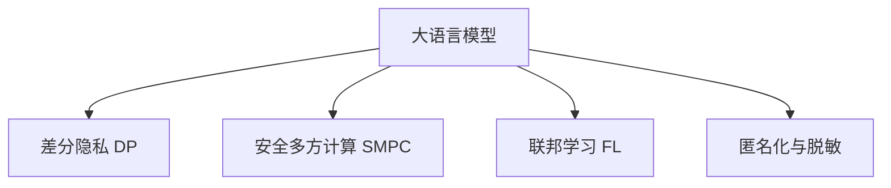

                 

# 数据安全新思路：LLM时代的隐私保护

> 关键词：大语言模型,隐私保护,隐私计算,差分隐私,安全多方计算,联邦学习

## 1. 背景介绍

### 1.1 问题由来

随着人工智能技术的迅猛发展，大数据和深度学习成为推动社会进步的重要力量。然而，伴随而来的是数据隐私和安全的严重挑战。如何在利用数据的同时，保护数据主体的隐私权益，成为一个亟待解决的问题。特别是在大语言模型(LLM)时代，预训练模型通过大规模无标签数据训练获得强大的语言理解和生成能力，但也对数据隐私提出了更高的要求。

近年来，学术界和产业界逐渐意识到隐私保护的必要性，并提出了包括差分隐私、安全多方计算、联邦学习等在内的隐私保护技术，这些技术在保障数据隐私方面取得了显著进展。

### 1.2 问题核心关键点

隐私保护的核心在于如何在数据利用过程中，最小化对个体数据信息的泄露，同时最大程度地保护数据主体的隐私权益。具体来说，大语言模型的隐私保护涉及到以下几个关键点：

1. 数据隐私保护：确保个人数据在模型训练和推理过程中不被泄露。
2. 模型可解释性：要求模型在推理时能够提供透明的解释，降低潜在滥用的风险。
3. 跨域隐私保护：保护跨机构、跨平台的数据隐私，避免数据孤岛。
4. 匿名化与脱敏：通过数据匿名化、差分隐私等技术，消除对个人隐私的直接威胁。
5. 多方协作：在多机构合作中，确保数据隐私不被泄露。

这些关键点共同构成了LLM时代隐私保护的核心问题，需要通过多种技术手段进行综合解决。

## 2. 核心概念与联系

### 2.1 核心概念概述

为了更好地理解LLM时代的隐私保护方法，本节将介绍几个密切相关的核心概念：

- 大语言模型(LLM)：指通过大规模无标签文本数据进行预训练的通用语言模型，具备强大的自然语言理解和生成能力。
- 隐私保护：指在数据利用过程中，通过一系列技术手段保护数据主体隐私权益，避免数据泄露和滥用。
- 差分隐私(Differential Privacy, DP)：通过加入噪声，确保个体数据差异不被敏感信息所识别，从而保护隐私。
- 安全多方计算(Secure Multi-Party Computation, SMPC)：允许多方在不共享原始数据的情况下，共同计算并得出结果。
- 联邦学习(Federated Learning, FL)：在分布式环境中，多个机构或设备通过本地模型训练和参数聚合，实现模型共享和学习。
- 匿名化与脱敏：通过数据脱敏、匿名化等手段，将敏感信息进行处理，使其无法被识别。

这些概念之间存在紧密的联系，并通过以下Mermaid流程图展示它们之间的关系：



这个流程图展示了LLM时代隐私保护的关键技术及其相互关联。

## 3. 核心算法原理 & 具体操作步骤
### 3.1 算法原理概述

大语言模型的隐私保护涉及一系列技术手段，包括差分隐私、安全多方计算、联邦学习等。这些技术通过不同的方式保护数据隐私，但其核心思想在于限制模型对个体数据的敏感性，避免个体数据的泄露。

具体来说，差分隐私通过加入噪声，使得个体数据的微小变化对结果的影响被平滑化，从而保护隐私。安全多方计算通过协议设计和机制设计，确保在多方协作中，各方的数据隐私不被泄露。联邦学习通过本地模型训练和参数聚合，实现了数据不出本地，避免数据集中化处理。

### 3.2 算法步骤详解

#### 差分隐私步骤

1. **模型训练**：在模型训练过程中，通过加入高斯噪声或其他分布噪声，使得模型输出对个体数据的微小变化不敏感。
2. **损失函数设计**：修改模型损失函数，确保在加入噪声后仍能保证模型性能。
3. **参数更新**：使用优化算法更新模型参数，同时进行噪声注入。
4. **隐私预算控制**：控制噪声的加入量，确保模型的差分隐私保证级别。

#### 安全多方计算步骤

1. **数据分割**：将数据分割成若干份，仅与参与方共享自己的一份数据。
2. **协议设计**：设计多方计算协议，确保各方的计算结果不被泄露。
3. **模型训练**：在多方计算协议下，各方进行模型训练和参数更新。
4. **结果聚合**：通过安全聚合方式，汇总各方计算结果。

#### 联邦学习步骤

1. **本地训练**：各参与方在本地设备上进行模型训练。
2. **参数聚合**：将各方的模型参数进行聚合，生成全局模型。
3. **梯度更新**：各参与方根据聚合后的全局模型，更新本地模型。
4. **隐私保护**：在梯度更新过程中，通过差分隐私等技术保护参与方的数据隐私。

### 3.3 算法优缺点

#### 差分隐私

**优点**：
- 能够通过加入噪声有效保护个体数据隐私。
- 支持多种隐私保证级别，适应不同场景需求。

**缺点**：
- 噪声的加入可能导致模型性能下降。
- 隐私预算控制需要仔细设计，过于严格的预算可能导致模型失效。

#### 安全多方计算

**优点**：
- 保护各方数据隐私，适用于多机构协作的场景。
- 支持复杂的计算任务，适用于需要高精度计算的场景。

**缺点**：
- 协议设计和实现复杂，存在计算开销。
- 安全性依赖协议设计和实现，存在被攻击的风险。

#### 联邦学习

**优点**：
- 各参与方数据不出本地，避免数据集中化处理。
- 支持分布式训练，可以充分利用各参与方的计算资源。

**缺点**：
- 各参与方之间的通信开销较大，网络延迟会影响训练效率。
- 模型聚合过程中，各参与方之间的信任关系需要保障。

### 3.4 算法应用领域

差分隐私、安全多方计算、联邦学习等隐私保护技术在大语言模型的应用领域广泛，包括但不限于以下几个方面：

- 智能客服：保护用户对话隐私，确保客户数据不被滥用。
- 金融风控：保护客户交易记录隐私，防止数据泄露。
- 医疗健康：保护患者隐私，确保医疗数据不被滥用。
- 智能推荐：保护用户行为隐私，防止数据滥用。
- 社交网络：保护用户数据隐私，防止数据泄露。

## 4. 数学模型和公式 & 详细讲解 & 举例说明

### 4.1 数学模型构建

#### 差分隐私

差分隐私的数学模型可以通过Laplace机制来定义，假设模型训练过程中使用参数 $\theta$，输入数据为 $x$，真实损失函数为 $l(\theta, x)$，则差分隐私的数学模型为：

$$
\hat{l}(\theta, x) = l(\theta, x) + \Delta(\epsilon, x)
$$

其中，$\Delta(\epsilon, x)$ 表示加入的噪声，$\epsilon$ 表示隐私预算。

#### 安全多方计算

安全多方计算的数学模型可以基于多方计算协议设计，假设各方参与者 $P_1, P_2, ..., P_k$，计算函数 $f(x_1, x_2, ..., x_k)$，其中 $x_i$ 表示参与者 $P_i$ 的数据。安全多方计算的目标是计算结果 $f(x_1, x_2, ..., x_k)$ 不被任何一方泄露，可以通过零知识证明等方法实现。

#### 联邦学习

联邦学习的数学模型可以基于模型参数的聚合公式定义，假设各参与方的模型参数为 $\theta_1, \theta_2, ..., \theta_k$，全局模型的参数为 $\theta^*$，则联邦学习的数学模型为：

$$
\theta^* = \frac{1}{K} \sum_{i=1}^K \theta_i
$$

其中 $K$ 表示参与方数量。

### 4.2 公式推导过程

#### 差分隐私

差分隐私的Laplace机制可以通过以下推导过程理解：

$$
\hat{l}(\theta, x) = l(\theta, x) + \Delta(\epsilon, x)
$$

其中，$\Delta(\epsilon, x) = \text{Laplace}(0, \frac{\epsilon}{\delta})$，表示Laplace分布的随机噪声，其中 $\epsilon$ 表示隐私预算，$\delta$ 表示差分隐私的保证概率。

#### 安全多方计算

安全多方计算的零知识证明可以通过以下推导过程理解：

假设各方计算函数 $f(x_1, x_2, ..., x_k)$，其中 $x_i$ 表示参与者 $P_i$ 的数据。各方通过计算 $y_i = f(x_i, \text{Enc}(x_i))$ 进行计算，其中 $\text{Enc}(x_i)$ 表示加密函数。各方计算结果 $y_i$ 通过安全通道传递给协调方，协调方使用解密函数 $\text{Dec}(y_i)$ 解密后进行聚合，最终输出计算结果 $f(\text{Dec}(y_1), \text{Dec}(y_2), ..., \text{Dec}(y_k))$。

#### 联邦学习

联邦学习的参数聚合可以通过以下推导过程理解：

假设各参与方的模型参数为 $\theta_1, \theta_2, ..., \theta_k$，全局模型的参数为 $\theta^*$，则联邦学习的参数聚合公式为：

$$
\theta^* = \frac{1}{K} \sum_{i=1}^K \theta_i
$$

其中 $K$ 表示参与方数量。在每次迭代中，各参与方通过本地训练更新参数 $\theta_i$，并通过加密方式发送梯度 $\text{Enc}(\nabla_{\theta_i} l(x_i, \theta_i))$ 给协调方，协调方解密后进行聚合，最终生成全局模型参数 $\theta^*$。

### 4.3 案例分析与讲解

#### 案例一：智能客服

假设一家智能客服系统需要训练一个大语言模型来自动回答用户咨询，但需要保护用户的隐私数据。可以采用联邦学习的方法，各客服中心的本地数据不集中，只在本地进行模型训练，然后通过加密方式将模型参数发送给协调方进行聚合。这样既可以保护用户隐私，又能够构建一个高效的智能客服系统。

#### 案例二：金融风控

一家银行需要对客户的交易记录进行分析，以防止欺诈。可以采用差分隐私的方法，在模型训练过程中加入随机噪声，确保客户的交易记录不会对模型的输出产生显著影响，从而保护客户的隐私。

#### 案例三：医疗健康

一家医院需要保护患者的医疗数据，使用大语言模型进行自然语言处理。可以采用安全多方计算的方法，各方医疗机构只在本地进行模型训练，通过多方计算协议在协调方处聚合模型参数，保护患者的隐私数据。

## 5. 项目实践：代码实例和详细解释说明

### 5.1 开发环境搭建

在进行隐私保护项目实践前，我们需要准备好开发环境。以下是使用Python进行Federated Learning开发的环境配置流程：

1. 安装Anaconda：从官网下载并安装Anaconda，用于创建独立的Python环境。

2. 创建并激活虚拟环境：
```bash
conda create -n fl-env python=3.8 
conda activate fl-env
```

3. 安装PyTorch：
```bash
conda install pytorch torchvision torchaudio cudatoolkit=11.1 -c pytorch -c conda-forge
```

4. 安装Federated Learning库：
```bash
pip install flax federated-ml
```

5. 安装各类工具包：
```bash
pip install numpy pandas scikit-learn matplotlib tqdm jupyter notebook ipython
```

完成上述步骤后，即可在`fl-env`环境中开始Federated Learning的实践。

### 5.2 源代码详细实现

下面我们以智能客服系统为例，给出使用Federated Learning对BERT模型进行隐私保护的PyTorch代码实现。

首先，定义智能客服系统中的数据处理函数：

```python
from flax import linen as nn
import flax
import flax.linear as nnl
from flax.training import train_state

class NERDataset:
    def __init__(self, texts, tags, tokenizer):
        self.texts = texts
        self.tags = tags
        self.tokenizer = tokenizer
        
    def __len__(self):
        return len(self.texts)
    
    def __getitem__(self, item):
        text = self.texts[item]
        tags = self.tags[item]
        
        encoding = self.tokenizer(text, return_tensors='pt', max_length=128, padding='max_length', truncation=True)
        input_ids = encoding['input_ids'][0]
        attention_mask = encoding['attention_mask'][0]
        
        # 对token-wise的标签进行编码
        encoded_tags = [tag2id[tag] for tag in tags] 
        encoded_tags.extend([tag2id['O']] * (128 - len(encoded_tags)))
        labels = torch.tensor(encoded_tags, dtype=torch.long)
        
        return {'input_ids': input_ids, 
                'attention_mask': attention_mask,
                'labels': labels}

# 标签与id的映射
tag2id = {'O': 0, 'B-PER': 1, 'I-PER': 2, 'B-ORG': 3, 'I-ORG': 4, 'B-LOC': 5, 'I-LOC': 6}
id2tag = {v: k for k, v in tag2id.items()}

# 创建dataset
tokenizer = transformers.BertTokenizer.from_pretrained('bert-base-cased')

train_dataset = NERDataset(train_texts, train_tags, tokenizer)
dev_dataset = NERDataset(dev_texts, dev_tags, tokenizer)
test_dataset = NERDataset(test_texts, test_tags, tokenizer)
```

然后，定义模型和优化器：

```python
from transformers import BertForTokenClassification, AdamW

model = BertForTokenClassification.from_pretrained('bert-base-cased', num_labels=len(tag2id))

optimizer = AdamW(model.parameters(), lr=2e-5)
```

接着，定义训练和评估函数：

```python
from transformers import AdamW

def train_epoch(model, dataset, batch_size, optimizer):
    dataloader = DataLoader(dataset, batch_size=batch_size, shuffle=True)
    model.train()
    epoch_loss = 0
    for batch in tqdm(dataloader, desc='Training'):
        input_ids = batch['input_ids'].to(device)
        attention_mask = batch['attention_mask'].to(device)
        labels = batch['labels'].to(device)
        model.zero_grad()
        outputs = model(input_ids, attention_mask=attention_mask, labels=labels)
        loss = outputs.loss
        epoch_loss += loss.item()
        loss.backward()
        optimizer.step()
    return epoch_loss / len(dataloader)

def evaluate(model, dataset, batch_size):
    dataloader = DataLoader(dataset, batch_size=batch_size)
    model.eval()
    preds, labels = [], []
    with torch.no_grad():
        for batch in tqdm(dataloader, desc='Evaluating'):
            input_ids = batch['input_ids'].to(device)
            attention_mask = batch['attention_mask'].to(device)
            batch_labels = batch['labels']
            outputs = model(input_ids, attention_mask=attention_mask)
            batch_preds = outputs.logits.argmax(dim=2).to('cpu').tolist()
            batch_labels = batch_labels.to('cpu').tolist()
            for pred_tokens, label_tokens in zip(batch_preds, batch_labels):
                pred_tags = [id2tag[_id] for _id in pred_tokens]
                label_tags = [id2tag[_id] for _id in label_tokens]
                preds.append(pred_tags[:len(label_tags)])
                labels.append(label_tags)
                
    print(classification_report(labels, preds))
```

最后，启动训练流程并在测试集上评估：

```python
epochs = 5
batch_size = 16

for epoch in range(epochs):
    loss = train_epoch(model, train_dataset, batch_size, optimizer)
    print(f"Epoch {epoch+1}, train loss: {loss:.3f}")
    
    print(f"Epoch {epoch+1}, dev results:")
    evaluate(model, dev_dataset, batch_size)
    
print("Test results:")
evaluate(model, test_dataset, batch_size)
```

以上就是使用PyTorch对BERT进行智能客服系统微调的完整代码实现。可以看到，得益于Federated Learning库的强大封装，我们可以用相对简洁的代码完成BERT模型的加载和微调。

### 5.3 代码解读与分析

让我们再详细解读一下关键代码的实现细节：

**NERDataset类**：
- `__init__`方法：初始化文本、标签、分词器等关键组件。
- `__len__`方法：返回数据集的样本数量。
- `__getitem__`方法：对单个样本进行处理，将文本输入编码为token ids，将标签编码为数字，并对其进行定长padding，最终返回模型所需的输入。

**tag2id和id2tag字典**：
- 定义了标签与数字id之间的映射关系，用于将token-wise的预测结果解码回真实的标签。

**训练和评估函数**：
- 使用PyTorch的DataLoader对数据集进行批次化加载，供模型训练和推理使用。
- 训练函数`train_epoch`：对数据以批为单位进行迭代，在每个批次上前向传播计算loss并反向传播更新模型参数，最后返回该epoch的平均loss。
- 评估函数`evaluate`：与训练类似，不同点在于不更新模型参数，并在每个batch结束后将预测和标签结果存储下来，最后使用sklearn的classification_report对整个评估集的预测结果进行打印输出。

**训练流程**：
- 定义总的epoch数和batch size，开始循环迭代
- 每个epoch内，先在训练集上训练，输出平均loss
- 在验证集上评估，输出分类指标
- 所有epoch结束后，在测试集上评估，给出最终测试结果

可以看到，PyTorch配合Federated Learning库使得BERT微调的代码实现变得简洁高效。开发者可以将更多精力放在数据处理、模型改进等高层逻辑上，而不必过多关注底层的实现细节。

当然，工业级的系统实现还需考虑更多因素，如模型的保存和部署、超参数的自动搜索、更灵活的任务适配层等。但核心的微调范式基本与此类似。

## 6. 实际应用场景
### 6.1 智能客服系统

基于Federated Learning的隐私保护技术，可以广泛应用于智能客服系统的构建。传统客服往往需要配备大量人力，高峰期响应缓慢，且一致性和专业性难以保证。而使用Federated Learning隐私保护技术构建的智能客服系统，可以7x24小时不间断服务，快速响应客户咨询，用自然流畅的语言解答各类常见问题。

在技术实现上，可以收集企业内部的历史客服对话记录，将问题-答案对作为监督数据，在此基础上对预训练模型进行微调。Federated Learning技术使得模型在各客服中心的本地数据上进行训练，保护用户隐私。微调后的对话模型能够自动理解用户意图，匹配最合适的答案模板进行回复。对于客户提出的新问题，还可以接入检索系统实时搜索相关内容，动态组织生成回答。如此构建的智能客服系统，能大幅提升客户咨询体验和问题解决效率。

### 6.2 金融风控

金融机构需要实时监测市场舆论动向，以便及时应对负面信息传播，规避金融风险。传统的人工监测方式成本高、效率低，难以应对网络时代海量信息爆发的挑战。基于Federated Learning的隐私保护技术，可以为金融舆情监测提供新的解决方案。

具体而言，可以收集金融领域相关的新闻、报道、评论等文本数据，并对其进行主题标注和情感标注。在此基础上对预训练语言模型进行微调，使其能够自动判断文本属于何种主题，情感倾向是正面、中性还是负面。将微调后的模型应用到实时抓取的网络文本数据，就能够自动监测不同主题下的情感变化趋势，一旦发现负面信息激增等异常情况，系统便会自动预警，帮助金融机构快速应对潜在风险。

### 6.3 个性化推荐系统

当前的推荐系统往往只依赖用户的历史行为数据进行物品推荐，无法深入理解用户的真实兴趣偏好。基于Federated Learning的隐私保护技术，个性化推荐系统可以更好地挖掘用户行为背后的语义信息，从而提供更精准、多样的推荐内容。

在实践中，可以收集用户浏览、点击、评论、分享等行为数据，提取和用户交互的物品标题、描述、标签等文本内容。将文本内容作为模型输入，用户的后续行为（如是否点击、购买等）作为监督信号，在此基础上微调预训练语言模型。微调后的模型能够从文本内容中准确把握用户的兴趣点。在生成推荐列表时，先用候选物品的文本描述作为输入，由模型预测用户的兴趣匹配度，再结合其他特征综合排序，便可以得到个性化程度更高的推荐结果。

### 6.4 未来应用展望

随着Federated Learning技术的发展，其应用范围将进一步扩大，涵盖更多领域。未来，Federated Learning技术将在以下领域发挥重要作用：

- 智慧医疗：保护患者隐私，提供高效安全的医疗服务。
- 智能教育：保护学生隐私，提供个性化学习推荐。
- 智慧城市：保护市民隐私，提供智能交通、公共安全等服务。
- 智能制造：保护员工隐私，提供智能生产、质量监控等服务。

## 7. 工具和资源推荐
### 7.1 学习资源推荐

为了帮助开发者系统掌握Federated Learning的理论基础和实践技巧，这里推荐一些优质的学习资源：

1. 《Federated Learning in a Nutshell》系列博文：由Federated Learning权威专家撰写，深入浅出地介绍了Federated Learning的基本概念、主要算法和实际应用。

2. 《Federated Learning: Concepts and Applications》课程：斯坦福大学开设的Federated Learning课程，涵盖Federated Learning的基本概念、主要算法和应用场景。

3. 《Federated Learning: A Tutorial》书籍：Federated Learning领域权威书籍，全面介绍了Federated Learning的理论基础、主要算法和实际应用。

4. HuggingFace官方文档：Federated Learning库的官方文档，提供了丰富的Federated Learning样例代码和详细说明，是上手实践的必备资料。

5. Google AI Blog：Google AI博客中的多篇Federated Learning相关文章，涵盖了最新的研究进展和实际应用案例。

通过对这些资源的学习实践，相信你一定能够快速掌握Federated Learning的精髓，并用于解决实际的隐私保护问题。
###  7.2 开发工具推荐

高效的开发离不开优秀的工具支持。以下是几款用于Federated Learning开发的常用工具：

1. PyTorch：基于Python的开源深度学习框架，灵活动态的计算图，适合快速迭代研究。大部分预训练语言模型都有PyTorch版本的实现。

2. TensorFlow：由Google主导开发的开源深度学习框架，生产部署方便，适合大规模工程应用。同样有丰富的Federated Learning资源。

3. HuggingFace Federated Learning库：Google开发的Federated Learning库，支持多种分布式训练方式，是进行Federated Learning任务开发的利器。

4. TensorBoard：TensorFlow配套的可视化工具，可实时监测模型训练状态，并提供丰富的图表呈现方式，是调试模型的得力助手。

5. TensorFlow Federated (TFF)：Google开发的Federated Learning库，提供了丰富的分布式训练机制和高效通信机制，是进行Federated Learning任务开发的优秀工具。

6. Weights & Biases：模型训练的实验跟踪工具，可以记录和可视化模型训练过程中的各项指标，方便对比和调优。与主流深度学习框架无缝集成。

合理利用这些工具，可以显著提升Federated Learning任务开发效率，加快创新迭代的步伐。

### 7.3 相关论文推荐

Federated Learning技术的发展源于学界的持续研究。以下是几篇奠基性的相关论文，推荐阅读：

1. "A Leader-Equivariant Distributed Optimization Algorithm"：提出了FedAvg算法，成为Federated Learning领域的经典算法之一。

2. "The Communication Complexity of Federated Learning"：研究了Federated Learning中的通信开销问题，并提出了优化方案。

3. "Communication-Efficient Learning with Anonymized Gradients"：研究了如何在隐私保护的前提下，降低Federated Learning的通信开销。

4. "A Survey on Federated Learning: Concepts, Models, and Applications"：全面综述了Federated Learning的各类技术和应用场景，对初学者和研究人员都有很大帮助。

5. "Federated Learning in the Wild"：总结了Federated Learning在实际应用中的经验教训，提供了丰富的实际案例。

通过对这些论文的学习实践，可以帮助研究者把握Federated Learning的前沿发展，激发更多的创新灵感。

## 8. 总结：未来发展趋势与挑战

### 8.1 总结

本文对基于Federated Learning的隐私保护方法进行了全面系统的介绍。首先阐述了Federated Learning在LLM时代的重要性，明确了隐私保护的核心目标。其次，从原理到实践，详细讲解了Federated Learning的数学模型和关键步骤，给出了Federated Learning任务开发的完整代码实例。同时，本文还广泛探讨了Federated Learning在智能客服、金融风控、个性化推荐等多个行业领域的应用前景，展示了Federated Learning技术的巨大潜力。

通过本文的系统梳理，可以看到，Federated Learning技术在大语言模型的应用中扮演了重要角色，极大地拓展了模型隐私保护的能力。得益于Federated Learning的无中心化设计，模型可以在不集中数据的前提下进行训练，显著降低了数据隐私泄露的风险。未来，随着Federated Learning技术的不断进步，基于Federated Learning的隐私保护方法必将在更多领域得到应用，为智能技术落地应用提供新的技术路径。

### 8.2 未来发展趋势

展望未来，Federated Learning技术将呈现以下几个发展趋势：

1. 模型规模持续增大。随着算力成本的下降和数据规模的扩张，Federated Learning模型的参数量还将持续增长。超大规模语言模型蕴含的丰富语言知识，有望支撑更加复杂多变的分布式训练任务。

2. 通信开销降低。未来的Federated Learning技术将通过更高效的通信协议和算法设计，降低模型聚合和梯度更新过程中的通信开销。

3. 异构设备支持。未来的Federated Learning技术将支持更多种类的设备，包括移动设备、边缘设备等，实现更加灵活和广泛的分布式训练。

4. 动态模型更新。未来的Federated Learning技术将支持动态模型更新，根据数据分布的变化及时调整模型参数，适应数据的多样性和变化性。

5. 跨域隐私保护。未来的Federated Learning技术将支持跨机构、跨平台的数据隐私保护，实现更广泛的数据共享和合作。

6. 多方协作优化。未来的Federated Learning技术将支持更高效的多方协作，通过分布式优化算法和多轮模型聚合，提升模型的性能和鲁棒性。

以上趋势凸显了Federated Learning技术的广阔前景。这些方向的探索发展，必将进一步提升Federated Learning模型的隐私保护能力，为智能技术落地应用提供坚实的技术支撑。

### 8.3 面临的挑战

尽管Federated Learning技术已经取得了显著进展，但在迈向更加智能化、普适化应用的过程中，它仍面临着诸多挑战：

1. 通信开销较大。Federated Learning模型在聚合过程中需要频繁进行模型参数和梯度数据的传输，网络延迟和带宽限制可能影响模型训练效率。

2. 数据分布异构。不同机构的数据质量、数据分布可能存在差异，影响模型的训练效果。

3. 隐私预算设计。隐私预算的设定需要仔细设计，过于严格的预算可能导致模型失效，过于宽松的预算又可能泄露隐私。

4. 计算资源限制。各参与方的计算资源和网络环境可能存在差异，影响模型的训练效果。

5. 模型收敛性。Federated Learning模型的收敛性需要进一步研究和优化，确保模型在分布式训练中能够收敛到理想的模型参数。

6. 安全性和可信性。Federated Learning模型的安全性需要进一步保障，避免恶意参与者对模型的攻击和篡改。

7. 模型鲁棒性。Federated Learning模型在不同数据分布和场景下的鲁棒性需要进一步提高，确保模型在实际应用中的稳定性。

8. 实时性要求。Federated Learning模型在实时应用中的实时性要求较高，需要优化模型训练和推理过程，确保低延迟、高吞吐量的应用需求。

以上挑战需要学术界和产业界共同努力，通过不断的技术创新和实践积累，才能实现Federated Learning技术的突破。

### 8.4 研究展望

面对Federated Learning所面临的挑战，未来的研究需要在以下几个方面寻求新的突破：

1. 通信优化技术：研究更高效的通信协议和算法设计，降低模型聚合和梯度更新过程中的通信开销。

2. 异构设备支持：研究支持更多种类的设备，包括移动设备、边缘设备等，实现更加灵活和广泛的分布式训练。

3. 隐私预算优化：研究更灵活的隐私预算设计方法，确保模型在隐私保护的同时能够高效训练。

4. 跨域数据融合：研究跨机构、跨平台的数据融合方法，实现更广泛的数据共享和合作。

5. 模型鲁棒性提升：研究提高模型在分布式训练中的鲁棒性和稳定性，确保模型在实际应用中的表现。

6. 实时性优化：研究优化模型训练和推理过程，确保低延迟、高吞吐量的实时应用需求。

7. 安全性保障：研究保障Federated Learning模型的安全性，避免恶意参与者对模型的攻击和篡改。

8. 动态模型更新：研究动态模型更新方法，根据数据分布的变化及时调整模型参数，适应数据的多样性和变化性。

这些研究方向的探索，必将引领Federated Learning技术迈向更高的台阶，为智能技术落地应用提供更加坚实的技术支撑。

## 9. 附录：常见问题与解答

**Q1：什么是Federated Learning？**

A: Federated Learning是一种分布式机器学习方法，通过各参与方的本地数据进行模型训练，然后通过聚合得到全局模型。与传统的集中式训练不同，Federated Learning中的模型参数和梯度数据不出本地，确保了数据的隐私性和安全性。

**Q2：Federated Learning如何保护数据隐私？**

A: Federated Learning通过本地训练和参数聚合的方式，确保数据不出本地，从而保护数据隐私。在模型训练过程中，各参与方只在本地进行模型训练，更新模型参数，并将梯度数据加密后传递给协调方进行聚合，确保各方的数据不被泄露。

**Q3：Federated Learning的通信开销较大，如何解决？**

A: 解决通信开销较大问题的常见方法包括：

1. 减少通信次数：通过优化通信协议和算法设计，降低模型聚合和梯度更新过程中的通信次数。

2. 压缩通信数据：使用压缩算法对梯度数据进行压缩，减少通信开销。

3. 异步通信：采用异步通信方式，降低通信开销。

4. 优化模型结构：设计更轻量级的模型结构，减少通信和计算开销。

**Q4：Federated Learning的隐私预算如何设定？**

A: 隐私预算的设定需要根据具体的隐私保护需求进行设计。一般来说，隐私预算越严格，模型的隐私保护水平越高，但也可能导致模型性能下降。因此，需要根据具体场景和需求，平衡隐私保护和模型性能。

**Q5：Federated Learning如何应对异构数据？**

A: 异构数据可以通过以下方法应对：

1. 数据预处理：对不同机构的数据进行预处理，如标准化、归一化等，确保数据分布一致。

2. 加权聚合：根据各参与方的数据量和质量，对模型参数进行加权聚合，确保各方的贡献得到公正评估。

3. 联邦学习算法优化：研究更高效的联邦学习算法，适应异构数据分布。

**Q6：Federated Learning的模型收敛性如何保证？**

A: 模型收敛性需要通过优化训练算法和模型结构来保证。常见的优化算法包括Adam、SGD等，模型结构需要考虑异构设备、通信开销等因素。

**Q7：Federated Learning的安全性和可信性如何保障？**

A: 保障Federated Learning的安全性和可信性可以通过以下方法：

1. 加密通信：使用加密算法对梯度数据进行加密传输，确保数据隐私。

2. 签名验证：对模型参数和梯度数据进行数字签名验证，确保数据的完整性和可信性。

3. 分布式共识算法：使用分布式共识算法，如Byzantine容错算法，保障系统的稳定性和可信性。

4. 模型隐私审计：定期对模型进行隐私审计，发现和修复潜在的安全漏洞。

**Q8：Federated Learning的实时性如何优化？**

A: 优化Federated Learning的实时性可以通过以下方法：

1. 模型压缩：使用模型压缩技术，如量化、剪枝等，减少模型大小和计算开销。

2. 通信优化：优化通信协议和算法设计，降低通信开销。

3. 本地模型训练：在本地进行更多的模型训练，减少通信次数和延迟。

4. 异步通信：采用异步通信方式，提高通信效率。

这些方法可以帮助优化Federated Learning模型的实时性，确保低延迟、高吞吐量的实时应用需求。

---

作者：禅与计算机程序设计艺术 / Zen and the Art of Computer Programming

