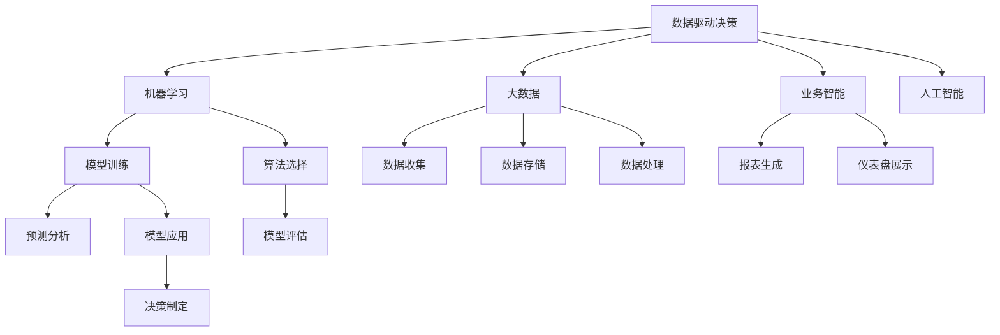

                 

# 数据驱动决策：现代管理者的必备技能

> 关键词：数据驱动, 决策制定, 人工智能, 机器学习, 大数据, 业务智能

## 1. 背景介绍

### 1.1 问题由来
在当今快速变化的市场环境中，数据成为了企业决策制定的重要依据。然而，面对海量复杂的数据，如何有效提取有用信息，做出科学合理的决策，对管理者的能力提出了严峻的挑战。传统的数据驱动决策方式依赖于人工分析和经验判断，往往受到主观偏见和认知限制，难以适应动态变化的市场需求。随着人工智能和大数据技术的兴起，基于数据驱动的智能决策支持系统逐渐成为企业提升决策能力的关键。

### 1.2 问题核心关键点
现代管理者需要在数据驱动的框架下，运用先进的技术手段，整合和分析数据，为决策提供支撑。数据驱动决策的关键在于：
1. **数据的获取和处理**：确保数据的质量和完整性，去除噪声，进行特征工程。
2. **模型和算法的选择**：根据业务场景选择合适的机器学习或统计模型，确保模型的可解释性和适用性。
3. **决策的制定和执行**：将模型输出转化为可行的决策方案，并监测其执行效果。

### 1.3 问题研究意义
数据驱动决策对于提升企业竞争力、降低运营风险、优化资源配置具有重要意义。通过数据驱动决策，企业能够及时响应市场变化，快速调整策略，最大化利润和市场份额。同时，数据驱动的透明化过程有助于消除主观偏见，提高决策的公正性和科学性。

## 2. 核心概念与联系

### 2.1 核心概念概述

为更好地理解数据驱动决策，本节将介绍几个密切相关的核心概念：

- **数据驱动决策（Data-Driven Decision Making）**：基于数据的分析、模型训练和预测，辅助决策制定的过程。其核心在于利用数据来驱动决策，而不是依赖经验和直觉。

- **机器学习（Machine Learning）**：通过算法和统计模型，使计算机能够从数据中自动学习规律，从而做出预测或决策。常见的算法包括回归、分类、聚类、强化学习等。

- **大数据（Big Data）**：规模庞大、多样化的数据集，包括结构化和非结构化数据。大数据技术涉及数据的收集、存储、处理和分析等环节。

- **业务智能（Business Intelligence, BI）**：利用数据分析技术，为企业提供商业洞察，帮助管理层制定战略决策。BI工具包括数据仓库、报表分析、仪表盘等。

- **人工智能（Artificial Intelligence, AI）**：通过模拟人类智能，使机器能够进行复杂的认知任务，如图像识别、自然语言处理、推荐系统等。

这些核心概念之间的逻辑关系可以通过以下Mermaid流程图来展示：



这个流程图展示了数据驱动决策的核心组件及其之间的关系：

1. 数据驱动决策依赖于大数据、机器学习和业务智能等关键技术。
2. 大数据技术支持数据的收集、存储和处理，为分析和建模提供基础。
3. 机器学习算法和统计模型用于训练和预测，辅助决策制定。
4. 业务智能工具提供可视化报表和仪表盘，帮助管理者理解数据和模型输出。

这些概念共同构成了数据驱动决策的完整框架，使管理者能够利用先进技术手段，科学合理地做出决策。

## 3. 核心算法原理 & 具体操作步骤
### 3.1 算法原理概述

数据驱动决策的核心是构建数据模型，利用算法进行预测和分析，辅助决策制定。其一般流程如下：

1. **数据准备**：收集和清洗数据，选择合适的特征工程方法，构建数据集。
2. **模型训练**：选择合适的机器学习算法，在训练集上训练模型。
3. **模型评估**：在验证集上评估模型性能，选择合适的超参数。
4. **模型应用**：将训练好的模型应用于测试集或实时数据，做出预测或决策。
5. **决策制定**：将模型输出转化为具体的决策方案，并监测其实施效果。

### 3.2 算法步骤详解

以下是数据驱动决策的详细步骤：

**Step 1: 数据准备**
- 收集与业务相关的数据，包括客户信息、销售记录、市场调查等。
- 清洗数据，去除缺失值、异常值，进行特征选择和编码。
- 将数据划分为训练集、验证集和测试集，确保模型在未见过的数据上表现良好。

**Step 2: 模型选择**
- 根据业务需求，选择合适的机器学习算法。如回归、分类、聚类、神经网络等。
- 考虑算法的复杂度、可解释性、计算资源等因素，综合评估算法适用性。

**Step 3: 模型训练**
- 使用训练集训练模型，调整超参数以优化模型性能。
- 使用随机梯度下降等优化算法，最小化损失函数，更新模型参数。

**Step 4: 模型评估**
- 在验证集上评估模型性能，使用交叉验证、混淆矩阵等指标评估模型。
- 根据评估结果调整模型参数，避免过拟合或欠拟合。

**Step 5: 模型应用**
- 将训练好的模型应用于测试集或实时数据，进行预测或分类。
- 根据模型输出做出决策，如推荐产品、调整定价、优化流程等。

**Step 6: 决策制定**
- 结合业务经验，将模型输出转化为具体的决策方案。
- 监测决策效果，使用A/B测试、效果评估等手段，评估决策是否成功。

### 3.3 算法优缺点

数据驱动决策方法具有以下优点：
1. 客观公正：利用数据和算法进行决策，避免了主观偏见和认知限制。
2. 可量化：数据和模型输出可以量化分析，使决策更加科学合理。
3. 可重复性：决策过程和结果具有可重复性，便于后续优化和改进。
4. 可解释性：模型和算法具有可解释性，便于理解和解释决策依据。

但数据驱动决策也存在一定的局限性：
1. 数据质量问题：数据清洗和预处理难度较大，数据噪声可能影响模型效果。
2. 算法选择问题：模型选择不当，可能导致决策偏差或错误。
3. 模型复杂性问题：复杂模型可能过度拟合训练数据，泛化性能不佳。
4. 业务理解问题：模型输出可能与实际业务场景不符，需要人工干预和解释。

### 3.4 算法应用领域

数据驱动决策方法在各个业务领域都有广泛的应用：

- **金融行业**：使用机器学习模型进行信用评分、风险预测、交易策略优化等。
- **零售行业**：利用客户行为数据进行商品推荐、库存管理、市场分析等。
- **医疗行业**：使用预测模型进行疾病诊断、治疗方案选择、患者风险评估等。
- **制造业**：通过数据分析进行设备维护、生产调度和质量控制等。
- **互联网行业**：使用推荐系统、自然语言处理等技术进行个性化推荐、用户分析等。

## 4. 数学模型和公式 & 详细讲解  
### 4.1 数学模型构建

本节将使用数学语言对数据驱动决策过程进行更加严格的刻画。

假设我们有一个数据集 $D=\{(x_i, y_i)\}_{i=1}^N$，其中 $x_i$ 为特征向量，$y_i$ 为标签。我们希望训练一个回归模型，使得模型能够根据输入 $x$ 预测输出 $y$。回归模型可以表示为 $y=f(x;\theta)$，其中 $f(\cdot)$ 为模型函数，$\theta$ 为模型参数。我们的目标是最小化均方误差损失函数：

$$
\mathcal{L}(\theta) = \frac{1}{N} \sum_{i=1}^N (y_i - f(x_i;\theta))^2
$$

使用梯度下降等优化算法，我们可以更新模型参数 $\theta$，使得损失函数最小化。具体地，设 $\eta$ 为学习率，则参数的更新公式为：

$$
\theta \leftarrow \theta - \eta \nabla_{\theta}\mathcal{L}(\theta)
$$

其中 $\nabla_{\theta}\mathcal{L}(\theta)$ 为损失函数对参数 $\theta$ 的梯度，可通过反向传播算法高效计算。

### 4.2 公式推导过程

以下我们以线性回归模型为例，推导均方误差损失函数及其梯度的计算公式。

假设线性回归模型为 $y=\beta_0 + \sum_{j=1}^n \beta_j x_j$，其中 $\beta_0$ 为截距，$\beta_j$ 为第 $j$ 个特征的权重。则均方误差损失函数定义为：

$$
\mathcal{L}(\theta) = \frac{1}{N} \sum_{i=1}^N (y_i - (\beta_0 + \sum_{j=1}^n \beta_j x_{ij}))^2
$$

将其展开并整理，得：

$$
\mathcal{L}(\theta) = \frac{1}{N} \sum_{i=1}^N (\sum_{j=0}^n \beta_j x_{ij})^2 - 2\frac{1}{N} \sum_{i=1}^N \sum_{j=0}^n \beta_j x_{ij} y_i + \frac{1}{N} \sum_{i=1}^N y_i^2
$$

对 $\theta$ 求偏导，得：

$$
\frac{\partial \mathcal{L}(\theta)}{\partial \beta_j} = \frac{2}{N} \sum_{i=1}^N (\sum_{k=0}^n \beta_k x_{ik}) x_{ij} - \frac{2}{N} \sum_{i=1}^N y_i x_{ij}
$$

整理后得：

$$
\frac{\partial \mathcal{L}(\theta)}{\partial \beta_j} = \frac{2}{N} \sum_{i=1}^N (x_{ij} - \bar{x}_{ij}) y_i - \frac{2}{N} \sum_{i=1}^N y_i \bar{x}_{ij}
$$

其中 $\bar{x}_{ij} = \frac{1}{N} \sum_{i=1}^N x_{ij}$。

使用梯度下降更新参数 $\beta_j$，得：

$$
\beta_j \leftarrow \beta_j - \eta \frac{\partial \mathcal{L}(\theta)}{\partial \beta_j}
$$

这就是线性回归模型的梯度下降更新公式。通过迭代更新，模型能够逐步学习特征之间的关系，预测输出值。

## 5. 项目实践：代码实例和详细解释说明
### 5.1 开发环境搭建

在进行数据驱动决策实践前，我们需要准备好开发环境。以下是使用Python进行Scikit-learn开发的环境配置流程：

1. 安装Anaconda：从官网下载并安装Anaconda，用于创建独立的Python环境。

2. 创建并激活虚拟环境：
```bash
conda create -n decision-making-env python=3.8 
conda activate decision-making-env
```

3. 安装Scikit-learn：
```bash
conda install scikit-learn
```

4. 安装Pandas、NumPy、Matplotlib等常用库：
```bash
pip install pandas numpy matplotlib scikit-learn tqdm jupyter notebook ipython
```

完成上述步骤后，即可在`decision-making-env`环境中开始决策模型开发。

### 5.2 源代码详细实现

下面我们以线性回归模型为例，给出使用Scikit-learn进行数据驱动决策的完整代码实现。

首先，定义数据处理函数：

```python
import pandas as pd
from sklearn.model_selection import train_test_split
from sklearn.linear_model import LinearRegression

def load_data(file_path):
    data = pd.read_csv(file_path)
    X = data.drop('y', axis=1)
    y = data['y']
    return X, y

X, y = load_data('data.csv')
```

然后，定义模型训练和评估函数：

```python
def train_model(X, y, test_size=0.2, cv=5):
    X_train, X_test, y_train, y_test = train_test_split(X, y, test_size=test_size, random_state=42, stratify=y)
    model = LinearRegression()
    model.fit(X_train, y_train)
    score = model.score(X_test, y_test)
    return model, score

def evaluate_model(model, X_test, y_test):
    y_pred = model.predict(X_test)
    r2_score = model.score(X_test, y_test)
    print(f'R^2 score: {r2_score:.2f}')
```

最后，启动训练流程并在测试集上评估：

```python
model, score = train_model(X, y)
print(f'Train score: {score:.2f}')

evaluate_model(model, X_test, y_test)
```

以上就是使用Scikit-learn进行线性回归模型训练和评估的完整代码实现。可以看到，通过Scikit-learn，我们能够快速实现简单的线性回归模型，并进行训练和评估。

### 5.3 代码解读与分析

让我们再详细解读一下关键代码的实现细节：

**load_data函数**：
- 定义数据加载函数，从文件中读取数据，并将特征和标签分别赋值给X和y。

**train_model函数**：
- 定义训练函数，将数据划分为训练集和测试集，使用LinearRegression模型进行训练。
- 返回训练好的模型和测试集上的R^2分数。

**evaluate_model函数**：
- 定义评估函数，使用测试集对模型进行评估，计算R^2分数并打印输出。

**训练流程**：
- 调用训练函数，返回训练好的模型和分数。
- 打印训练集上的分数。
- 调用评估函数，打印测试集上的分数。

可以看到，Scikit-learn提供了简单易用的API，方便我们快速实现常见的机器学习模型。开发者可以结合具体任务和数据特点，进一步定制化开发和优化模型。

## 6. 实际应用场景
### 6.1 智能推荐系统

智能推荐系统是数据驱动决策的重要应用之一。通过分析用户的历史行为数据，预测用户对不同产品的兴趣，帮助电商企业提高销售转化率。

在技术实现上，可以使用协同过滤、内容推荐、基于规则等推荐算法，结合用户画像、商品属性等特征，构建推荐模型。微调过程中，可以考虑引入上下文信息、动态调整推荐策略，从而提升推荐效果。

### 6.2 风险管理

金融机构通过数据驱动决策，可以实时监控市场风险，及时调整投资策略。例如，使用机器学习模型预测股票价格波动，评估信用风险等级，优化资产配置。

在风险管理中，可以结合多种模型和数据源，如市场数据、财务报表、新闻事件等，进行多维度分析。通过实时监控和预测，金融机构能够及时发现和应对潜在的风险点，降低损失。

### 6.3 供应链优化

供应链优化是企业决策管理中的重要环节。通过数据驱动决策，企业能够实时监控供应链状态，优化资源分配，提高运营效率。

在供应链优化中，可以采用预测模型和优化算法，对物流、库存、生产等环节进行动态调整。通过实时监测和反馈，企业能够及时调整生产计划和库存策略，提升供应链响应速度和灵活性。

## 7. 工具和资源推荐
### 7.1 学习资源推荐

为了帮助开发者系统掌握数据驱动决策的理论基础和实践技巧，这里推荐一些优质的学习资源：

1. 《机器学习实战》：机器学习领域的经典书籍，涵盖各类机器学习算法和实际案例，适合入门学习。

2. 《Python数据科学手册》：Python在数据科学中的应用指南，涵盖数据处理、统计分析、机器学习等技术，适合Python开发人员学习。

3. Coursera的《数据科学与机器学习》课程：由斯坦福大学教授主讲，涵盖数据处理、统计分析、机器学习等课程，适合初学者和进阶者学习。

4. Kaggle平台：数据科学竞赛平台，提供海量数据集和代码示例，适合实践训练和经验积累。

5. GitHub上的数据驱动决策开源项目：如TensorFlow数据驱动决策示例、Scikit-learn推荐系统示例等，适合学习者和开发者参考。

通过对这些资源的学习实践，相信你一定能够快速掌握数据驱动决策的精髓，并用于解决实际的决策问题。

### 7.2 开发工具推荐

高效的开发离不开优秀的工具支持。以下是几款用于数据驱动决策开发的常用工具：

1. Scikit-learn：基于Python的机器学习库，提供了简单易用的API，支持各类回归、分类、聚类等算法。

2. TensorFlow：由Google主导开发的深度学习框架，支持分布式计算和高效的模型训练。

3. PyTorch：基于Python的深度学习框架，灵活的计算图支持，适合研究和实验。

4. Jupyter Notebook：交互式的编程环境，适合编写和调试机器学习代码。

5. Tableau：数据可视化工具，支持复杂的数据分析和可视化报表生成。

6. Apache Spark：大数据处理框架，支持分布式计算和高效的内存操作。

合理利用这些工具，可以显著提升数据驱动决策任务的开发效率，加快创新迭代的步伐。

### 7.3 相关论文推荐

数据驱动决策技术的发展源于学界的持续研究。以下是几篇奠基性的相关论文，推荐阅读：

1. D. J. Hand and A. Till's "The Analysis of Multivariate Observations on Limited Data"：机器学习领域的奠基性论文，介绍了最小二乘法、回归分析等基础理论。

2. I. Guyon and A. Elisseeff's "An Introduction to Variable and Feature Selection"：特征选择的经典论文，介绍了特征选择和模型评估的方法。

3. J. Friedman's "Greedy Function Approximation: A Gradient Boosting Machine"：梯度提升树的经典论文，介绍了集成学习的基础理论。

4. A. Ng's "Machine Learning Yearning"：机器学习实践指南，介绍了机器学习开发和优化的全面策略。

5. Y. Bengio等人的"Deep Learning"：深度学习领域的经典教材，介绍了深度学习的基本概念和应用。

这些论文代表了大数据驱动决策技术的发展脉络。通过学习这些前沿成果，可以帮助研究者把握学科前进方向，激发更多的创新灵感。

## 8. 总结：未来发展趋势与挑战
### 8.1 总结

本文对数据驱动决策方法进行了全面系统的介绍。首先阐述了数据驱动决策的必要性和优势，明确了其在提升决策科学性和公正性方面的价值。其次，从原理到实践，详细讲解了数据驱动决策的数学模型和算法步骤，给出了完整的数据处理和模型训练代码实例。同时，本文还广泛探讨了数据驱动决策在推荐系统、风险管理、供应链优化等多个领域的应用前景，展示了其广阔的应用空间。

通过本文的系统梳理，可以看到，数据驱动决策技术正在成为企业决策管理的重要工具，帮助管理者利用先进技术手段，科学合理地做出决策。未来，伴随大数据、人工智能等技术的发展，数据驱动决策的实现将更加高效、智能，进一步推动决策管理实践的创新和发展。

### 8.2 未来发展趋势

展望未来，数据驱动决策技术将呈现以下几个发展趋势：

1. 实时化：数据驱动决策将更加实时，能够实时监测和响应市场变化，及时调整决策方案。

2. 自适应：决策系统将具备自适应能力，能够动态调整模型参数和策略，应对数据分布的变化。

3. 多模态融合：融合多模态数据，提升决策模型的鲁棒性和准确性，如结合视觉、语音、文本等数据。

4. 隐私保护：数据驱动决策将更加注重隐私保护，使用差分隐私等技术保护用户隐私。

5. 可解释性：决策模型将具备更好的可解释性，便于管理者理解和信任模型输出。

6. 自动化：决策过程将更加自动化，能够自主学习和优化，减少人工干预。

以上趋势凸显了数据驱动决策技术的广阔前景。这些方向的探索发展，将进一步提升决策系统的性能和应用范围，为管理决策提供更强大的支持。

### 8.3 面临的挑战

尽管数据驱动决策技术已经取得了显著成就，但在实现高效、透明、公正的决策过程中，仍面临诸多挑战：

1. 数据质量问题：数据清洗和预处理难度较大，数据噪声可能影响模型效果。

2. 模型复杂性问题：模型选择不当，可能导致决策偏差或错误。

3. 业务理解问题：模型输出可能与实际业务场景不符，需要人工干预和解释。

4. 隐私保护问题：决策过程中可能涉及敏感数据，如何保护用户隐私是重要挑战。

5. 系统稳定性问题：决策系统可能受到模型漏洞、数据攻击等影响，需要建立有效的风险防范机制。

6. 成本和资源问题：实时数据驱动决策需要高计算资源和高效算法，可能带来较高的成本投入。

解决这些挑战需要从数据、算法、技术、管理等多个层面进行协同创新，探索新的方法和工具，推动数据驱动决策技术不断突破和升级。

### 8.4 研究展望

面向未来，数据驱动决策技术需要在以下几个方向进行探索和突破：

1. 智能决策引擎：开发更加智能、自适应的决策引擎，具备自主学习和优化能力。

2. 多模态决策融合：融合多模态数据，提升决策模型的鲁棒性和准确性，如结合视觉、语音、文本等数据。

3. 隐私保护技术：开发隐私保护技术，保护用户隐私和数据安全，如差分隐私、联邦学习等。

4. 决策可视化：开发决策可视化工具，便于管理者理解和解释模型输出，提升决策透明度。

5. 自动化决策系统：开发自动化决策系统，减少人工干预，提高决策效率和质量。

6. 跨领域决策应用：将数据驱动决策技术应用于更多垂直行业，推动跨领域决策管理的创新和提升。

这些研究方向的探索，必将引领数据驱动决策技术迈向更高的台阶，为管理决策提供更强大的技术支撑，推动人工智能技术在各行各业的广泛应用。

