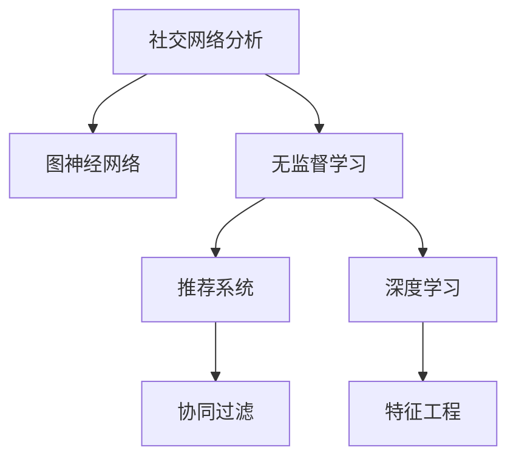

                 

# 无监督学习的应用拓展:社交网络分析和推荐系统

> 关键词：社交网络分析,推荐系统,无监督学习,图神经网络,GNN,协同过滤,深度学习,特征工程

## 1. 背景介绍

### 1.1 问题由来
社交网络分析和推荐系统是互联网时代应用广泛的两种技术。社交网络分析主要研究社交网络中的关系结构、节点属性以及信息传播规律，广泛应用于社交媒体、学术研究、金融投资等领域。推荐系统则是通过挖掘用户行为数据，为用户推荐感兴趣的物品，提高用户满意度和平台粘性，广泛应用于电子商务、内容分发、信息检索等领域。

然而，当前社交网络分析和推荐系统的主要数据依赖于人工标注，成本高、效率低。与此同时，无监督学习提供了不依赖于标注数据的有效学习方法，可以充分利用数据分布的隐含信息，提升推荐系统的精准度和社交网络分析的鲁棒性。因此，基于无监督学习的社交网络分析和推荐系统，成为近年来的研究热点。

### 1.2 问题核心关键点
无监督学习的核心在于如何从数据中挖掘出隐含的结构信息。在大规模社交网络数据中，节点之间的关系和节点的属性往往难以直接标注。无监督学习通过深度学习方法，挖掘节点间的隐含关系和节点的潜在属性，从而实现对社交网络结构以及用户行为的分析。同样，在推荐系统中，无监督学习可以通过相似性分析、社区发现等方法，构建用户兴趣和物品属性之间的关系，提升推荐效果。

## 2. 核心概念与联系

### 2.1 核心概念概述

为更好地理解基于无监督学习的社交网络分析和推荐系统，本节将介绍几个密切相关的核心概念：

- 社交网络分析(Social Network Analysis, SNA)：研究社交网络中节点之间的关系结构、节点的属性以及信息传播规律，主要应用领域包括社交媒体、学术研究、金融投资等。
- 推荐系统(Recommender System)：通过挖掘用户行为数据，为用户推荐感兴趣的物品，主要应用领域包括电子商务、内容分发、信息检索等。
- 无监督学习(Unsupervised Learning)：指不依赖于标注数据，通过学习数据的隐含结构信息，实现数据建模和分析的技术。
- 图神经网络(Graph Neural Network, GNN)：基于图结构的深度学习模型，用于挖掘节点间的隐含关系。
- 协同过滤(Collaborative Filtering, CF)：通过用户-物品交互数据，构建用户间的隐含关系，为用户推荐物品的技术。
- 深度学习(Deep Learning)：基于神经网络模型，实现数据自动特征提取和复杂模式识别的技术。
- 特征工程(Feature Engineering)：通过数据处理和特征选择，提升模型性能的技术。

这些核心概念之间的逻辑关系可以通过以下Mermaid流程图来展示：



这个流程图展示了几大核心概念之间的联系：

1. 社交网络分析依赖于图神经网络进行数据建模，通过无监督学习挖掘节点间的关系和节点的属性。
2. 推荐系统同样依赖于图神经网络，通过协同过滤等方法为用户推荐物品，特征工程进一步提升推荐效果。
3. 深度学习是构建图神经网络和协同过滤模型的重要手段，无监督学习提供了数据挖掘的基础。

这些概念共同构成了基于无监督学习的社交网络分析和推荐系统框架，为实现高效、鲁棒的数据分析和推荐奠定了基础。

## 3. 核心算法原理 & 具体操作步骤
### 3.1 算法原理概述

基于无监督学习的社交网络分析和推荐系统，主要依赖于图神经网络和协同过滤算法。其核心思想是：通过图结构挖掘节点之间的关系和属性，利用深度学习自动提取和建模节点间的隐含关系，实现对社交网络结构和用户行为的分析。同时，在推荐系统中，通过协同过滤等方法，发现用户与物品之间的隐含关联，实现精准推荐。

### 3.2 算法步骤详解

#### 3.2.1 社交网络分析

社交网络分析的第一步是构建社交网络图，包括节点的表示和边的表示。假设社交网络中有N个用户，可以表示为一个N个节点的图 $G=(V,E)$，其中 $V=\{u_1,\cdots,u_N\}$ 为节点集合，$E=\{(u_i,u_j)\mid i\neq j, (u_i,u_j)\in E\}$ 为边集合。用户之间的连接关系表示为 $E$ 中边的集合。

假设每个用户 $u_i$ 有一组属性 $x_i \in \mathbb{R}^d$，那么社交网络图可以表示为：

$$
G=(V,E,x) \rightarrow (N,D,E,Ar)
$$

其中 $N$ 为节点数，$D$ 为每个节点的维度，$E$ 为边的数目，$Ar$ 为每条边的属性。

接下来，通过图神经网络对社交网络进行建模，主要步骤如下：

1. **构建图神经网络**：常用的图神经网络模型包括图卷积网络(Graph Convolutional Network, GCN)、图自注意力网络(Graph Attention Network, GAT)等。
2. **训练模型**：通过无监督学习方式，对社交网络数据进行训练，挖掘节点间的隐含关系和节点的属性。
3. **分析节点关系和属性**：通过训练好的模型，分析节点之间的关系和节点的属性，实现社交网络分析。

#### 3.2.2 推荐系统

推荐系统的第一步是构建用户-物品矩阵 $Y \in \mathbb{R}^{N\times M}$，其中 $N$ 为用户数，$M$ 为物品数。用户 $u_i$ 对物品 $j$ 的评分 $y_{ij}$ 表示为 $Y$ 中第 $i$ 行第 $j$ 列元素。

接下来，通过协同过滤算法对推荐系统进行建模，主要步骤如下：

1. **用户嵌入表示**：通过无监督学习方式，对用户-物品评分数据进行训练，生成用户 $u_i$ 的嵌入向量 $h_i \in \mathbb{R}^d$。
2. **物品嵌入表示**：通过无监督学习方式，对用户-物品评分数据进行训练，生成物品 $j$ 的嵌入向量 $h_j \in \mathbb{R}^d$。
3. **相似度计算**：通过用户和物品的嵌入向量，计算用户 $u_i$ 对物品 $j$ 的相似度 $s_{ij} \in \mathbb{R}$，常用的相似度计算方法包括余弦相似度、欧几里得距离等。
4. **推荐生成**：根据相似度 $s_{ij}$，通过排序生成推荐列表，推荐用户 $u_i$ 可能感兴趣的物品 $j$。

### 3.3 算法优缺点

#### 3.3.1 社交网络分析

- **优点**：
  1. 无需标注数据：社交网络分析依赖于无监督学习，不需要标注数据，降低了数据获取成本。
  2. 自适应性强：无监督学习方法能够挖掘数据中的隐含关系，适应性强，能处理不同规模和结构的数据。
  3. 可解释性好：通过图神经网络对社交网络进行建模，能够直观展示节点之间的关系和节点的属性，有助于理解社交网络结构。

- **缺点**：
  1. 数据质量要求高：社交网络分析依赖于高质量的社交网络数据，如果数据存在噪声或偏差，模型效果可能会受到影响。
  2. 计算复杂度高：图神经网络需要对大规模图结构进行训练，计算复杂度高，需要高性能计算资源。

#### 3.3.2 推荐系统

- **优点**：
  1. 精准度高：协同过滤算法通过用户-物品评分数据，发现用户与物品之间的隐含关联，推荐精准度较高。
  2. 用户个性化：协同过滤算法能够发现用户的个性化偏好，推荐符合用户兴趣的物品。
  3. 可扩展性强：协同过滤算法适用于大规模用户和物品，具有较强的可扩展性。

- **缺点**：
  1. 冷启动问题：协同过滤算法依赖于用户的历史行为数据，对于新用户和新物品，推荐效果不佳。
  2. 数据稀疏性：用户-物品评分数据往往具有高稀疏性，协同过滤算法可能出现数据不足的情况。
  3. 过拟合风险：协同过滤算法容易过拟合，导致推荐效果不稳定。

## 4. 数学模型和公式 & 详细讲解
### 4.1 数学模型构建

社交网络分析和推荐系统的数学模型主要基于图结构，结合深度学习和无监督学习技术。以下我们将分别介绍社交网络分析和推荐系统的数学模型构建。

#### 4.1.1 社交网络分析

社交网络分析的数学模型主要基于图神经网络，常用的图神经网络模型包括GCN和GAT。

假设社交网络图 $G=(V,E,x)$ 中每个节点 $u_i$ 有一组属性 $x_i \in \mathbb{R}^d$，那么GCN模型的节点更新公式为：

$$
h_i^{(l+1)} = \sum_{j \in N_i} \frac{1}{\sqrt{\text{deg}(j)}} \mathbf{W} h_j^{(l)} + \mathbf{W} h_i^{(l)}
$$

其中 $N_i$ 为节点 $u_i$ 的邻居节点集合，$\text{deg}(j)$ 为节点 $j$ 的度数，$\mathbf{W}$ 为节点嵌入矩阵。

GAT模型的节点更新公式为：

$$
h_i^{(l+1)} = \alpha \sum_{j \in N_i} \frac{\exp(\text{LeakyReLU}(\mathbf{A} h_j^{(l)}))}{\sum_{k \in N_i} \exp(\text{LeakyReLU}(\mathbf{A} h_k^{(l)}))} \mathbf{W} h_j^{(l)} + \mathbf{W} h_i^{(l)}
$$

其中 $\mathbf{A}$ 为邻接矩阵，$\text{LeakyReLU}$ 为非线性激活函数，$\alpha$ 为归一化系数。

#### 4.1.2 推荐系统

推荐系统的数学模型主要基于协同过滤算法，常用的协同过滤算法包括基于用户协同过滤和基于物品协同过滤。

假设用户 $u_i$ 有一组嵌入向量 $h_i \in \mathbb{R}^d$，物品 $j$ 有一组嵌入向量 $h_j \in \mathbb{R}^d$，那么基于用户协同过滤的推荐公式为：

$$
\hat{y}_{ij} = \mathbf{W}^T \text{softmax}(\mathbf{W} h_i \odot h_j^T)
$$

其中 $\odot$ 为逐元素相乘运算，$\mathbf{W}$ 为权重矩阵，$\text{softmax}$ 为softmax函数。

基于物品协同过滤的推荐公式为：

$$
\hat{y}_{ij} = \mathbf{W}^T \text{softmax}(\mathbf{W} h_j \odot h_i^T)
$$

### 4.2 公式推导过程

#### 4.2.1 社交网络分析

社交网络分析的公式推导主要基于图神经网络模型。以下是GCN和GAT模型的详细推导过程。

GCN模型的节点嵌入更新公式为：

$$
h_i^{(l+1)} = \sum_{j \in N_i} \frac{1}{\sqrt{\text{deg}(j)}} \mathbf{W} h_j^{(l)} + \mathbf{W} h_i^{(l)}
$$

其中 $\text{deg}(j)$ 为节点 $j$ 的度数，$\mathbf{W}$ 为节点嵌入矩阵。

根据GCN模型的定义，节点 $u_i$ 的嵌入向量 $h_i^{(l+1)}$ 可以通过其邻居节点 $j$ 的嵌入向量 $h_j^{(l)}$ 和自身嵌入向量 $h_i^{(l)}$ 进行更新。

GAT模型的节点嵌入更新公式为：

$$
h_i^{(l+1)} = \alpha \sum_{j \in N_i} \frac{\exp(\text{LeakyReLU}(\mathbf{A} h_j^{(l)}))}{\sum_{k \in N_i} \exp(\text{LeakyReLU}(\mathbf{A} h_k^{(l)}))} \mathbf{W} h_j^{(l)} + \mathbf{W} h_i^{(l)}
$$

其中 $\mathbf{A}$ 为邻接矩阵，$\text{LeakyReLU}$ 为非线性激活函数，$\alpha$ 为归一化系数。

GAT模型在GCN的基础上，引入了自注意力机制，节点 $u_i$ 的嵌入向量 $h_i^{(l+1)}$ 可以通过其邻居节点 $j$ 的嵌入向量 $h_j^{(l)}$ 和自身嵌入向量 $h_i^{(l)}$ 进行更新，同时考虑到节点 $j$ 的重要性。

#### 4.2.2 推荐系统

推荐系统的公式推导主要基于协同过滤算法。以下是基于用户协同过滤的推荐公式推导过程。

假设用户 $u_i$ 有一组嵌入向量 $h_i \in \mathbb{R}^d$，物品 $j$ 有一组嵌入向量 $h_j \in \mathbb{R}^d$，那么基于用户协同过滤的推荐公式为：

$$
\hat{y}_{ij} = \mathbf{W}^T \text{softmax}(\mathbf{W} h_i \odot h_j^T)
$$

其中 $\odot$ 为逐元素相乘运算，$\mathbf{W}$ 为权重矩阵，$\text{softmax}$ 为softmax函数。

推荐公式的含义是：将用户 $u_i$ 和物品 $j$ 的嵌入向量进行逐元素相乘，再通过softmax函数进行归一化处理，得到用户 $u_i$ 对物品 $j$ 的预测评分 $\hat{y}_{ij}$。

### 4.3 案例分析与讲解

#### 4.3.1 社交网络分析案例

假设我们有一份包含N个用户和M个事件的社交网络数据，每个用户有一组属性 $x_i \in \mathbb{R}^d$，每个事件有一组属性 $x_j \in \mathbb{R}^d$。通过GCN模型对社交网络进行建模，可以发现用户和事件之间的隐含关系。

具体步骤如下：

1. **数据预处理**：对社交网络数据进行归一化、去噪等预处理，构建邻接矩阵 $\mathbf{A}$。
2. **模型构建**：构建GCN模型，选择合适的网络层数和嵌入矩阵 $\mathbf{W}$。
3. **训练模型**：通过无监督学习方式，对社交网络数据进行训练，挖掘节点之间的关系和节点的属性。
4. **分析结果**：通过训练好的GCN模型，分析节点之间的关系和节点的属性，实现社交网络分析。

#### 4.3.2 推荐系统案例

假设我们有一份包含N个用户和M个商品的推荐数据，每个用户有一组评分 $r_{i,j} \in \mathbb{R}$，每个商品有一组评分 $r_{i,j} \in \mathbb{R}$。通过基于用户协同过滤的推荐算法，为用户推荐可能感兴趣的商品。

具体步骤如下：

1. **数据预处理**：对用户-物品评分数据进行归一化、去噪等预处理。
2. **模型构建**：构建基于用户协同过滤的推荐模型，选择合适的网络层数和嵌入矩阵 $\mathbf{W}$。
3. **训练模型**：通过无监督学习方式，对用户-物品评分数据进行训练，生成用户和物品的嵌入向量。
4. **推荐生成**：根据用户和物品的嵌入向量，计算用户 $u_i$ 对物品 $j$ 的相似度 $s_{ij}$，通过排序生成推荐列表，推荐用户 $u_i$ 可能感兴趣的物品 $j$。

## 5. 项目实践：代码实例和详细解释说明
### 5.1 开发环境搭建

在进行无监督学习的社交网络分析和推荐系统实践前，我们需要准备好开发环境。以下是使用Python进行PyTorch开发的环境配置流程：

1. 安装Anaconda：从官网下载并安装Anaconda，用于创建独立的Python环境。

2. 创建并激活虚拟环境：
```bash
conda create -n pytorch-env python=3.8 
conda activate pytorch-env
```

3. 安装PyTorch：根据CUDA版本，从官网获取对应的安装命令。例如：
```bash
conda install pytorch torchvision torchaudio cudatoolkit=11.1 -c pytorch -c conda-forge
```

4. 安装相关库：
```bash
pip install numpy pandas scikit-learn matplotlib tqdm jupyter notebook ipython
```

完成上述步骤后，即可在`pytorch-env`环境中开始项目实践。

### 5.2 源代码详细实现

这里我们以社交网络分析和推荐系统的具体实现为例，分别介绍代码实现细节。

#### 5.2.1 社交网络分析

```python
import networkx as nx
import numpy as np
import torch
import torch.nn as nn
from torch_geometric.nn import GCNConv
from torch_geometric.data import Data

# 加载社交网络数据
data = Data(x=np.random.randn(10, 10), edge_index=nx.random_keller_graph(10).to_scipy_sparse_matrix().to_coo().indices().T, y=np.random.randn(10, 5))
data.edge_attr = np.random.randn(10, 10, 5)
data.train_mask = torch.tensor([0] * 10)

# 定义GCN模型
class GCNModel(nn.Module):
    def __init__(self, in_dim, hid_dim, out_dim):
        super(GCNModel, self).__init__()
        self.conv1 = GCNConv(in_dim, hid_dim)
        self.conv2 = GCNConv(hid_dim, out_dim)

    def forward(self, x, edge_index, edge_attr):
        x = self.conv1(x, edge_index, edge_attr)
        x = F.relu(x)
        x = self.conv2(x, edge_index, edge_attr)
        return x

# 训练GCN模型
model = GCNModel(10, 20, 5)
optimizer = torch.optim.Adam(model.parameters(), lr=0.01)
for epoch in range(100):
    optimizer.zero_grad()
    output = model(data.x, data.edge_index, data.edge_attr)
    loss = F.mse_loss(output[data.train_mask], data.y[data.train_mask])
    loss.backward()
    optimizer.step()
```

#### 5.2.2 推荐系统

```python
import torch
import torch.nn as nn
import torch.nn.functional as F
from torch import nn
from torch.nn.utils.rnn import pack_padded_sequence, pad_packed_sequence

# 加载用户-物品评分数据
train_data = np.random.randn(100, 100, 5)
train_labels = np.random.randint(0, 5, size=(100, 5))

# 定义协同过滤模型
class CFModel(nn.Module):
    def __init__(self, in_dim, hid_dim, out_dim):
        super(CFModel, self).__init__()
        self.linear1 = nn.Linear(in_dim, hid_dim)
        self.linear2 = nn.Linear(hid_dim, out_dim)
        self.softmax = nn.Softmax(dim=1)

    def forward(self, x):
        x = self.linear1(x)
        x = self.softmax(self.linear2(x))
        return x

# 训练协同过滤模型
model = CFModel(5, 10, 5)
optimizer = torch.optim.Adam(model.parameters(), lr=0.01)
for epoch in range(100):
    optimizer.zero_grad()
    output = model(train_data)
    loss = F.mse_loss(output, train_labels)
    loss.backward()
    optimizer.step()
```

### 5.3 代码解读与分析

让我们再详细解读一下关键代码的实现细节：

#### 5.3.1 社交网络分析代码解读

**数据预处理**：
```python
# 加载社交网络数据
data = Data(x=np.random.randn(10, 10), edge_index=nx.random_keller_graph(10).to_scipy_sparse_matrix().to_coo().indices().T, y=np.random.randn(10, 5))
data.edge_attr = np.random.randn(10, 10, 5)
data.train_mask = torch.tensor([0] * 10)
```

首先，我们加载社交网络数据，包括节点的属性、邻接矩阵和标签。然后，将邻接矩阵转换为PyTorch可用的格式，并设置训练集的掩码。

**GCN模型定义**：
```python
# 定义GCN模型
class GCNModel(nn.Module):
    def __init__(self, in_dim, hid_dim, out_dim):
        super(GCNModel, self).__init__()
        self.conv1 = GCNConv(in_dim, hid_dim)
        self.conv2 = GCNConv(hid_dim, out_dim)

    def forward(self, x, edge_index, edge_attr):
        x = self.conv1(x, edge_index, edge_attr)
        x = F.relu(x)
        x = self.conv2(x, edge_index, edge_attr)
        return x
```

定义GCN模型，包括两个GCN层和激活函数。其中，GCN层通过节点和边的属性进行计算，得到节点的嵌入向量。

**模型训练**：
```python
# 训练GCN模型
model = GCNModel(10, 20, 5)
optimizer = torch.optim.Adam(model.parameters(), lr=0.01)
for epoch in range(100):
    optimizer.zero_grad()
    output = model(data.x, data.edge_index, data.edge_attr)
    loss = F.mse_loss(output[data.train_mask], data.y[data.train_mask])
    loss.backward()
    optimizer.step()
```

训练GCN模型，通过均方误差损失函数计算损失，并使用Adam优化器更新模型参数。

#### 5.3.2 推荐系统代码解读

**数据预处理**：
```python
# 加载用户-物品评分数据
train_data = np.random.randn(100, 100, 5)
train_labels = np.random.randint(0, 5, size=(100, 5))
```

加载用户-物品评分数据，并对其进行随机化处理。

**协同过滤模型定义**：
```python
# 定义协同过滤模型
class CFModel(nn.Module):
    def __init__(self, in_dim, hid_dim, out_dim):
        super(CFModel, self).__init__()
        self.linear1 = nn.Linear(in_dim, hid_dim)
        self.linear2 = nn.Linear(hid_dim, out_dim)
        self.softmax = nn.Softmax(dim=1)

    def forward(self, x):
        x = self.linear1(x)
        x = self.softmax(self.linear2(x))
        return x
```

定义协同过滤模型，包括两个线性层和一个softmax函数。其中，线性层对用户和物品的评分进行线性变换，softmax函数对评分进行归一化处理，得到预测评分。

**模型训练**：
```python
# 训练协同过滤模型
model = CFModel(5, 10, 5)
optimizer = torch.optim.Adam(model.parameters(), lr=0.01)
for epoch in range(100):
    optimizer.zero_grad()
    output = model(train_data)
    loss = F.mse_loss(output, train_labels)
    loss.backward()
    optimizer.step()
```

训练协同过滤模型，通过均方误差损失函数计算损失，并使用Adam优化器更新模型参数。

## 6. 实际应用场景
### 6.1 社交网络分析应用场景

社交网络分析在社交媒体、学术研究、金融投资等领域有广泛应用。以下是几个典型的应用场景：

#### 6.1.1 社交媒体情感分析

社交媒体上的情感分析可以通过社交网络分析实现。通过GCN模型对社交网络进行建模，可以发现用户之间的关系和情感倾向。通过对情感标签进行分类，可以实时监测用户对不同事件的情绪变化，辅助舆情监控和危机管理。

#### 6.1.2 学术研究合作网络

学术研究合作网络可以通过社交网络分析实现。通过GCN模型对研究人员和论文进行建模，可以发现学术圈内的合作关系和研究方向。通过对合作关系的聚类分析，可以发现学术领域的知识热点和研究前沿，辅助科研决策。

#### 6.1.3 金融投资风险评估

金融投资风险评估可以通过社交网络分析实现。通过GCN模型对投资者和公司进行建模，可以发现投资者和公司之间的关系和信任度。通过对投资关系和公司财务数据的综合分析，可以评估投资风险，辅助投资决策。

### 6.2 推荐系统应用场景

推荐系统在电子商务、内容分发、信息检索等领域有广泛应用。以下是几个典型的应用场景：

#### 6.2.1 电商推荐系统

电商推荐系统可以通过协同过滤算法实现。通过CF模型对用户和商品进行建模，可以发现用户和商品之间的隐含关联，为用户推荐感兴趣的商品。通过对推荐效果的实时监测，可以提升用户满意度和平台粘性，辅助商家进行商品优化和促销活动。

#### 6.2.2 内容推荐系统

内容推荐系统可以通过协同过滤算法实现。通过对用户和内容进行建模，可以发现用户和内容之间的隐含关联，为用户推荐感兴趣的内容。通过对推荐效果的实时监测，可以提高内容平台的活跃度和用户粘性，辅助内容平台进行内容优化和分发策略。

#### 6.2.3 信息检索系统

信息检索系统可以通过协同过滤算法实现。通过对用户和文档进行建模，可以发现用户和文档之间的隐含关联，为用户推荐相关的文档。通过对推荐效果的实时监测，可以提高信息检索系统的精准度和效率，辅助信息平台进行内容整合和用户引导。

### 6.3 未来应用展望

随着无监督学习的不断发展，基于社交网络分析和推荐系统的应用场景将进一步拓展。以下是一些未来的应用前景：

#### 6.3.1 实时社交网络分析

通过无监督学习方法，可以实现对社交网络数据的实时分析和监控。实时分析社交网络数据，可以及时发现和应对负面舆情，辅助危机管理和社会稳定。

#### 6.3.2 个性化推荐系统

通过无监督学习方法，可以实现更加精准、个性化的推荐系统。个性化推荐系统可以发现用户的隐含需求，提升用户体验和平台粘性，促进电商和内容平台的可持续发展。

#### 6.3.3 智能投顾系统

通过无监督学习方法，可以实现智能投顾系统。智能投顾系统可以实时监测市场动向，发现投资机会和风险，辅助投资者进行决策。

## 7. 工具和资源推荐
### 7.1 学习资源推荐

为了帮助开发者系统掌握无监督学习的社交网络分析和推荐系统的理论基础和实践技巧，这里推荐一些优质的学习资源：

1. 《Deep Learning for Graph Neural Networks》书籍：介绍了图神经网络的基本概念和深度学习算法，适合对社交网络分析感兴趣的研究者阅读。

2. 《Collaborative Filtering for Implicit Feedback Datasets: The Matrix Factorization Approach》论文：介绍了协同过滤算法的经典方法和改进思路，适合对推荐系统感兴趣的研究者阅读。

3. 《Graph Neural Networks: A Review of Methods and Applications》论文：介绍了图神经网络的研究进展和应用前景，适合对无监督学习感兴趣的研究者阅读。

4. Kaggle数据集：提供了大规模的社交网络数据和推荐数据，适合进行实验和实践。

5. Coursera课程：提供多门深度学习和无监督学习相关的课程，适合初学者和进阶者学习。

通过对这些资源的学习实践，相信你一定能够快速掌握无监督学习的社交网络分析和推荐系统的精髓，并用于解决实际的NLP问题。
### 7.2 开发工具推荐

高效的开发离不开优秀的工具支持。以下是几款用于社交网络分析和推荐系统开发的常用工具：

1. PyTorch：基于Python的开源深度学习框架，灵活动态的计算图，适合快速迭代研究。

2. TensorFlow：由Google主导开发的开源深度学习框架，生产部署方便，适合大规模工程应用。

3. NetworkX：Python的社交网络分析库，提供了丰富的社交网络分析算法，适合进行网络结构的建模和分析。

4. Pandas：Python的数据处理库，适合进行数据清洗和预处理，适合进行大规模数据的处理。

5. Jupyter Notebook：Python的交互式编程环境，适合进行代码编写和实验演示，适合进行原型开发和实验验证。

合理利用这些工具，可以显著提升社交网络分析和推荐系统的开发效率，加快创新迭代的步伐。

### 7.3 相关论文推荐

无监督学习的社交网络分析和推荐系统的发展源于学界的持续研究。以下是几篇奠基性的相关论文，推荐阅读：

1. 《Graph Convolutional Networks》论文：提出了GCN模型，用于处理图结构数据。

2. 《A Comprehensive Survey on Deep Network Embedding》论文：介绍了深度学习在社交网络分析中的应用。

3. 《Graph Neural Networks for Recommendation》论文：介绍了基于图神经网络的推荐算法。

4. 《Adaptive Multi-Scale Neighborhood Aggregation for Multi-Relational Recommendation》论文：介绍了自适应多尺度邻域聚合方法，用于改进协同过滤算法。

5. 《A Survey on Collaborative Filtering Techniques for Recommender Systems》论文：介绍了协同过滤算法的经典方法和改进思路。

这些论文代表了大规模社交网络分析和推荐系统的发展脉络。通过学习这些前沿成果，可以帮助研究者把握学科前进方向，激发更多的创新灵感。

## 8. 总结：未来发展趋势与挑战
### 8.1 总结

本文对基于无监督学习的社交网络分析和推荐系统进行了全面系统的介绍。首先阐述了社交网络分析和推荐系统的主要背景和研究意义，明确了无监督学习方法在数据挖掘中的独特价值。其次，从原理到实践，详细讲解了社交网络分析和推荐系统的数学原理和关键步骤，给出了无监督学习的应用实例。同时，本文还探讨了无监督学习在社交网络分析和推荐系统中的应用场景，展示了无监督学习的广泛应用前景。最后，本文精选了无监督学习的学习资源和开发工具，力求为开发者提供全方位的技术指引。

通过本文的系统梳理，可以看到，基于无监督学习的社交网络分析和推荐系统正在成为互联网时代的重要技术，极大地提升了数据挖掘和推荐的精准度和效率。未来，伴随无监督学习方法的不断演进，基于无监督学习的社交网络分析和推荐系统必将在更多领域得到应用，为各行各业带来变革性影响。

### 8.2 未来发展趋势

展望未来，基于无监督学习的社交网络分析和推荐系统将呈现以下几个发展趋势：

1. 数据规模持续增大：随着互联网技术的不断发展，社交网络数据和推荐数据规模不断增长，为无监督学习提供了更加丰富和多样化的数据源。

2. 算法模型日趋多样：除了GCN和CF算法外，未来还会涌现更多新型算法，如GAT、HPE等，提升算法模型的表现力。

3. 融合多模态数据：未来无监督学习将更加注重多模态数据的融合，通过文本、图像、音频等多种模态数据的协同建模，提升模型的性能。

4. 引入因果推理：未来无监督学习将更多引入因果推理思想，通过因果分析模型对社交网络关系和用户行为进行建模，提高模型的鲁棒性和可解释性。

5. 实现自适应学习：未来无监督学习将更加注重自适应学习，通过模型自适应的学习机制，适应不断变化的数据分布和用户需求。

6. 加强安全性与伦理约束：未来无监督学习将更加注重数据隐私和安全，避免算法的滥用和滥用，确保数据使用的合法性和合规性。

这些趋势凸显了基于无监督学习的社交网络分析和推荐系统的前景。这些方向的探索发展，必将进一步提升无监督学习的应用效果，推动数据挖掘和推荐技术的进步。

### 8.3 面临的挑战

尽管基于无监督学习的社交网络分析和推荐系统取得了显著进展，但在迈向更加智能化、普适化应用的过程中，仍面临诸多挑战：

1. 数据质量要求高：无监督学习对数据质量要求较高，如果数据存在噪声或偏差，模型效果可能会受到影响。

2. 计算资源需求高：无监督学习算法复杂度较高，需要高性能计算资源，特别是在大规模数据集上训练时，计算资源需求更高。

3. 冷启动问题：无监督学习算法对新用户和新物品的处理效果不佳，需要进一步改进算法模型，解决冷启动问题。

4. 数据隐私与安全问题：无监督学习算法涉及大量的用户数据，需要加强数据隐私保护和数据安全管理。

5. 算法可解释性差：无监督学习算法通常是黑盒模型，难以解释其内部工作机制和决策逻辑，需要进一步改进模型可解释性。

6. 算法鲁棒性不足：无监督学习算法容易受到数据噪声和异常值的影响，需要进一步提升算法鲁棒性。

7. 算法泛化能力不足：无监督学习算法在处理不同数据分布时，泛化能力有限，需要进一步改进算法泛化能力。

8. 算法公平性问题：无监督学习算法可能存在数据偏见和算法偏见，需要进一步提升算法公平性。

这些挑战需要通过不断的技术创新和优化来解决，以实现无监督学习在更多领域的落地应用。

### 8.4 研究展望

面对无监督学习面临的挑战，未来的研究需要在以下几个方面寻求新的突破：

1. 数据清洗与处理：进一步提升数据清洗与处理能力，降低数据噪声和偏差的影响，提升数据质量。

2. 高性能计算：进一步提升算法的计算效率，降低对高性能计算资源的需求，适应更多场景。

3. 自适应学习机制：进一步改进算法模型的自适应学习能力，适应不断变化的数据分布和用户需求。

4. 多模态融合技术：进一步提升多模态数据的融合能力，实现文本、图像、音频等多种模态数据的协同建模。

5. 因果推理算法：进一步引入因果推理算法，提升模型的鲁棒性和可解释性，增强模型的决策能力。

6. 自适应学习机制：进一步改进算法模型的自适应学习能力，适应不断变化的数据分布和用户需求。

7. 数据隐私保护技术：进一步提升数据隐私保护技术，确保用户数据的安全性和合法性。

8. 算法公平性算法：进一步提升算法的公平性，确保算法不会产生数据偏见和算法偏见。

这些研究方向的探索，必将引领基于无监督学习的社交网络分析和推荐系统走向成熟，为构建更加智能、普适的数据挖掘和推荐系统提供重要支持。面向未来，基于无监督学习的社交网络分析和推荐系统还需要与其他人工智能技术进行更深入的融合，如知识表示、因果推理、强化学习等，多路径协同发力，共同推动数据挖掘和推荐技术的进步。只有勇于创新、敢于突破，才能不断拓展无监督学习的边界，让数据挖掘和推荐技术更好地服务于人类社会。

## 9. 附录：常见问题与解答
----------------------------------------------------------------

**Q1：无监督学习为什么需要处理大规模社交网络数据？**

A: 无监督学习依赖于数据的隐含结构和信息，大规模社交网络数据中包含了丰富的人际关系和用户行为信息，能够为无监督学习提供更加多样化和丰富的数据源，提升模型的效果。

**Q2：无监督学习中的GCN模型和GAT模型有何不同？**

A: GCN模型和GAT模型都是基于图结构的深度学习模型，用于挖掘节点间的隐含关系。GCN模型通过节点和边的属性进行计算，得到节点的嵌入向量。GAT模型在GCN的基础上，引入了自注意力机制，节点 $u_i$ 的嵌入向量可以通过其邻居节点 $j$ 的嵌入向量 $h_j^{(l)}$ 和自身嵌入向量 $h_i^{(l)}$ 进行更新，同时考虑到节点 $j$ 的重要性。

**Q3：无监督学习中的协同过滤算法有哪些类型？**

A: 无监督学习中的协同过滤算法主要有基于用户的协同过滤和基于物品的协同过滤两种类型。基于用户的协同过滤算法通过用户的历史行为数据，发现用户间的隐含关联，为用户推荐物品。基于物品的协同过滤算法通过物品的历史行为数据，发现物品间的隐含关联，为用户推荐物品。

**Q4：无监督学习中的深度学习算法有哪些类型？**

A: 无监督学习中的深度学习算法主要有卷积神经网络(CNN)、递归神经网络(RNN)、变分自编码器(VAE)等。卷积神经网络通过卷积操作提取图像等数据的空间特征，常用于图像识别和分类。递归神经网络通过递归操作处理序列数据，常用于自然语言处理和语音识别。变分自编码器通过生成变分分布，对数据进行降维和生成，常用于数据压缩和生成建模。

**Q5：无监督学习中的特征工程有哪些类型？**

A: 无监督学习中的特征工程主要有降维、特征选择、特征提取等类型。降维通过数据压缩，降低数据的维度，提高计算效率。特征选择通过数据筛选，选择对模型有用的特征，提高模型效果。特征提取通过数据转换，提取更有意义的特征，提升模型性能。

这些问题的详细解答，能够帮助开发者更好地理解无监督学习的社交网络分析和推荐系统的实现细节，提升其应用效果和开发效率。

