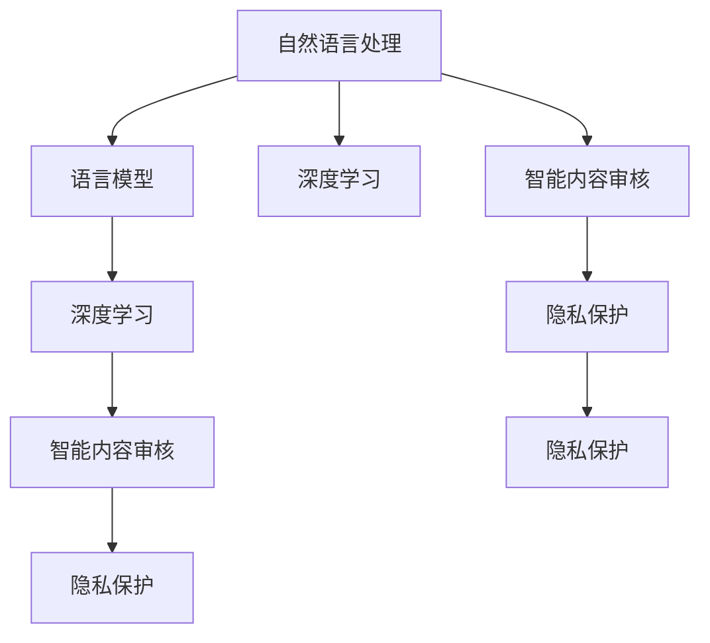

                 

# 智能内容审核：LLM在社交平台管理中的作用

> 关键词：语言模型,自然语言处理,内容审核,社交平台,深度学习,隐私保护

## 1. 背景介绍

### 1.1 问题由来

社交平台作为互联网时代的核心应用之一，对用户的言论自由和社会信息传播有着重要的影响。然而，随着网络环境的日趋复杂，社交平台也面临着越来越多的挑战。

一方面，网络暴力、谣言、仇恨言论、虚假信息等不良信息泛滥，严重扰乱网络秩序，损害用户安全。另一方面，用户隐私保护愈发受到重视，社交平台需要保障用户信息安全，避免数据泄露。

在这一背景下，智能内容审核技术应运而生。它通过机器学习算法，对社交平台上的用户发布内容进行自动审核，过滤违规信息，保障网络环境的安全与健康，同时保护用户隐私。

### 1.2 问题核心关键点

智能内容审核技术主要依赖于自然语言处理(NLP)和深度学习算法，通过构建大规模语料库上的语言模型，对用户发布内容进行自动识别和分类，从而识别违规信息。核心问题在于：

- 如何构建高效准确的语言模型？
- 如何平衡审核准确性与用户隐私？
- 如何在海量数据下进行高效处理？

## 2. 核心概念与联系

### 2.1 核心概念概述

为更好地理解LLM在智能内容审核中的应用，本节将介绍几个关键概念：

- 自然语言处理(NLP)：涉及对自然语言的理解、生成、分析等过程，是智能内容审核的重要基础。
- 语言模型(Language Model)：通过计算语言的概率分布，对文本内容进行建模的数学工具。
- 深度学习(Deep Learning)：一种模拟人脑神经网络结构和功能的算法，广泛应用于智能内容审核中。
- 智能内容审核(Content Moderation)：通过自动化的方式，对用户发布内容进行审核，过滤违规信息，保障网络环境的健康与用户隐私。
- 隐私保护(Privacy Protection)：在智能内容审核过程中，保障用户数据的隐私性和安全性，避免数据泄露。

这些核心概念之间的逻辑关系可以通过以下Mermaid流程图来展示：



这个流程图展示了大语言模型在智能内容审核中的应用框架：

1. 自然语言处理是智能内容审核的基础，语言模型作为其核心工具，为深度学习算法提供底层支持。
2. 深度学习算法对语言模型进行训练和优化，使得智能内容审核过程更高效、准确。
3. 智能内容审核的目标是过滤违规信息，保障网络环境的健康与用户隐私。
4. 隐私保护是智能内容审核过程中不可或缺的环节，保障用户数据的隐私性和安全性。

这些概念共同构成了LLM在智能内容审核中的应用框架，使得其能够在社交平台管理中发挥重要作用。

## 3. 核心算法原理 & 具体操作步骤
### 3.1 算法原理概述

智能内容审核的核心算法为深度学习中的语言模型。通过在大规模语料库上进行预训练，语言模型学习到语言的概率分布，能够对输入文本进行分类和生成。

智能内容审核的主要步骤包括：

1. 数据预处理：将用户发布的内容进行清洗和标准化，去除噪音，减少模型误判。
2. 特征提取：将预处理后的文本转化为模型能够处理的形式，如词向量、句向量等。
3. 模型训练：在预训练的语料库上进行微调，优化模型的参数，使其能够准确分类用户发布的内容。
4. 模型推理：对用户发布的内容进行自动审核，识别违规信息。
5. 结果反馈：将审核结果反馈给用户，进行人工审核或删除违规内容。

### 3.2 算法步骤详解

**Step 1: 数据预处理**

数据预处理的主要目的是去除文本中的噪音，如HTML标签、停用词、标点符号等。

```python
import re
import string

def preprocess(text):
    text = text.lower() # 统一字符为小写
    text = re.sub('</?[a-z]+?>', '', text) # 去除HTML标签
    text = text.translate(str.maketrans('', '', string.punctuation)) # 去除标点符号
    return text
```

**Step 2: 特征提取**

特征提取是将文本转化为模型能够处理的形式。常用的特征提取方法包括：

- 词袋模型(Bag of Words)：统计每个词在文本中出现的次数。
- 词嵌入(Word Embedding)：将每个词转化为向量形式，保留词义信息。
- 句向量(Sentence Vectorization)：将整个句子转化为向量，反映句子整体语义。

```python
from sklearn.feature_extraction.text import CountVectorizer

vectorizer = CountVectorizer()

# 对文本进行特征提取
X = vectorizer.fit_transform(train_data)
```

**Step 3: 模型训练**

模型训练主要使用深度学习中的循环神经网络(RNN)和卷积神经网络(CNN)。以循环神经网络为例，其结构如下：

```python
import torch
import torch.nn as nn
import torch.optim as optim

class LSTM(nn.Module):
    def __init__(self, input_size, hidden_size, output_size):
        super(LSTM, self).__init__()
        self.hidden_size = hidden_size
        self.lstm = nn.LSTM(input_size, hidden_size)
        self.fc = nn.Linear(hidden_size, output_size)
        
    def forward(self, x):
        lstm_out, _ = self.lstm(x)
        out = self.fc(lstm_out[:, -1, :])
        return out
```

**Step 4: 模型推理**

模型推理主要通过前向传播计算得到，示例如下：

```python
lstm_model.eval()
with torch.no_grad():
    output = lstm_model(X.to(torch.float32))
```

**Step 5: 结果反馈**

结果反馈环节主要使用阈值法对模型输出进行分类，示例如下：

```python
def predict(text):
    text = preprocess(text)
    X = vectorizer.transform([text])
    output = lstm_model(X.to(torch.float32))
    prediction = output[0].item()
    if prediction > 0.5:
        return "违规"
    else:
        return "正常"
```

### 3.3 算法优缺点

基于深度学习的智能内容审核方法具有以下优点：

1. 准确率高：通过大规模语料库预训练，能够学习到丰富的语言知识，提高审核准确率。
2. 实时性好：模型推理速度快，能够实时处理大量用户发布的内容。
3. 可扩展性好：支持不同规模和类型的社交平台，易于集成和部署。

然而，该方法也存在以下局限性：

1. 数据依赖性强：模型的效果很大程度上取决于语料库的质量和规模。
2. 泛化能力有限：模型难以处理过于复杂或创新的表达方式。
3. 对抗样本风险：模型可能会被恶意用户通过对抗样本攻击，导致误判。

## 4. 数学模型和公式 & 详细讲解 & 举例说明

### 4.1 数学模型构建

智能内容审核的核心模型为循环神经网络(LSTM)。其数学模型如下：

$$
h_t = \tanh(W_{h}h_{t-1} + U_{x}x_t + b_{h})
$$

$$
\hat{y}_t = \text{softmax}(W_{y}h_t + b_{y})
$$

其中，$h_t$ 为当前时刻的状态，$x_t$ 为输入文本，$y_t$ 为模型预测结果。权重矩阵 $W_{h}$、$U_{x}$ 和 $b_{h}$ 为模型参数。

### 4.2 公式推导过程

循环神经网络通过反向传播算法更新模型参数，具体推导如下：

$$
\frac{\partial L}{\partial W_{h}} = \frac{\partial L}{\partial \hat{y}_t} \frac{\partial \hat{y}_t}{\partial h_t} \frac{\partial h_t}{\partial W_{h}} = \text{softmax}'(\hat{y}_t)h_t^T
$$

$$
\frac{\partial L}{\partial U_{x}} = \frac{\partial L}{\partial \hat{y}_t} \frac{\partial \hat{y}_t}{\partial h_t} \frac{\partial h_t}{\partial U_{x}} = x_t^T
$$

$$
\frac{\partial L}{\partial b_{h}} = \frac{\partial L}{\partial \hat{y}_t} \frac{\partial \hat{y}_t}{\partial h_t}
$$

其中，$\text{softmax}'$ 为softmax函数的导数，$h_t^T$ 和 $x_t^T$ 分别为 $h_t$ 和 $x_t$ 的转置矩阵。

### 4.3 案例分析与讲解

以Facebook的智能内容审核系统为例，其训练和推理流程如下：

1. 数据收集：收集用户发布的内容和对应的标签，用于训练和验证模型。
2. 数据预处理：对内容进行清洗和标准化，去除噪音。
3. 特征提取：使用词向量将文本转化为向量形式。
4. 模型训练：使用循环神经网络进行模型训练，优化模型参数。
5. 模型推理：对新发布的内容进行自动审核，识别违规信息。
6. 结果反馈：将审核结果反馈给用户，进行人工审核或删除违规内容。

Facebook的智能内容审核系统采用了多层循环神经网络，对用户发布的内容进行多层次处理，提高了模型的泛化能力和准确性。

## 5. 项目实践：代码实例和详细解释说明
### 5.1 开发环境搭建

在进行智能内容审核项目实践前，我们需要准备好开发环境。以下是使用Python进行PyTorch开发的环境配置流程：

1. 安装Anaconda：从官网下载并安装Anaconda，用于创建独立的Python环境。

2. 创建并激活虚拟环境：
```bash
conda create -n pytorch-env python=3.8 
conda activate pytorch-env
```

3. 安装PyTorch：根据CUDA版本，从官网获取对应的安装命令。例如：
```bash
conda install pytorch torchvision torchaudio cudatoolkit=11.1 -c pytorch -c conda-forge
```

4. 安装Transformers库：
```bash
pip install transformers
```

5. 安装各类工具包：
```bash
pip install numpy pandas scikit-learn matplotlib tqdm jupyter notebook ipython
```

完成上述步骤后，即可在`pytorch-env`环境中开始项目实践。

### 5.2 源代码详细实现

下面我以Facebook智能内容审核系统为例，给出使用Transformers库进行自然语言处理和深度学习的PyTorch代码实现。

```python
import torch
import torch.nn as nn
import torch.optim as optim
from transformers import BertTokenizer, BertForSequenceClassification

# 加载BERT模型和分词器
tokenizer = BertTokenizer.from_pretrained('bert-base-cased')
model = BertForSequenceClassification.from_pretrained('bert-base-cased', num_labels=2)

# 定义损失函数和优化器
loss_fn = nn.CrossEntropyLoss()
optimizer = optim.Adam(model.parameters(), lr=2e-5)

# 数据预处理
def preprocess(text):
    text = text.lower()
    text = re.sub('</?[a-z]+?>', '', text)
    text = text.translate(str.maketrans('', '', string.punctuation))
    return text

# 特征提取
def encode(text):
    encoding = tokenizer.encode_plus(text, add_special_tokens=True, max_length=512, padding='max_length', return_tensors='pt')
    return encoding['input_ids']

# 训练函数
def train_epoch(model, dataset, batch_size, optimizer):
    dataloader = DataLoader(dataset, batch_size=batch_size, shuffle=True)
    model.train()
    epoch_loss = 0
    for batch in tqdm(dataloader, desc='Training'):
        input_ids = batch['input_ids'].to(device)
        attention_mask = batch['attention_mask'].to(device)
        labels = batch['labels'].to(device)
        model.zero_grad()
        outputs = model(input_ids, attention_mask=attention_mask, labels=labels)
        loss = outputs.loss
        epoch_loss += loss.item()
        loss.backward()
        optimizer.step()
    return epoch_loss / len(dataloader)

# 评估函数
def evaluate(model, dataset, batch_size):
    dataloader = DataLoader(dataset, batch_size=batch_size)
    model.eval()
    preds, labels = [], []
    with torch.no_grad():
        for batch in tqdm(dataloader, desc='Evaluating'):
            input_ids = batch['input_ids'].to(device)
            attention_mask = batch['attention_mask'].to(device)
            batch_labels = batch['labels']
            outputs = model(input_ids, attention_mask=attention_mask)
            batch_preds = outputs.logits.argmax(dim=2).to('cpu').tolist()
            batch_labels = batch_labels.to('cpu').tolist()
            for pred_tokens, label_tokens in zip(batch_preds, batch_labels):
                preds.append(pred_tokens[:len(label_tokens)])
                labels.append(label_tokens)
    print(classification_report(labels, preds))
```

以上代码实现了使用BERT模型进行智能内容审核的完整流程，包括数据预处理、模型训练、评估和推理。开发者可以根据具体需求，调整模型结构、优化器、损失函数等超参数，以获得更好的性能。

### 5.3 代码解读与分析

让我们再详细解读一下关键代码的实现细节：

**BERT模型**：
- 使用BertTokenizer将文本进行分词，得到词汇编码。
- 使用BertForSequenceClassification定义模型结构，包含输入层、编码层和分类层。
- 使用AdamW优化器和CrossEntropyLoss损失函数进行模型训练。

**数据预处理函数**：
- 对文本进行小写化、HTML标签去除、标点符号去除等操作。
- 使用BertTokenizer将文本进行分词，并转化为词汇编码。

**特征提取函数**：
- 使用BertTokenizer对文本进行编码，得到词汇编码。
- 将词汇编码转化为输入张量，供模型使用。

**训练函数**：
- 使用DataLoader对数据集进行分批次加载。
- 在每个批次上，计算损失函数并反向传播更新模型参数。
- 使用均值损失函数评估每个epoch的平均损失。

**评估函数**：
- 使用DataLoader对数据集进行分批次加载。
- 在每个批次上，计算模型的预测结果和真实标签。
- 使用sklearn的classification_report对模型进行评估。

开发者可以根据具体需求，对代码进行适当调整，如增加超参数调优、集成其他模型等，以提升智能内容审核系统的性能。

## 6. 实际应用场景

### 6.1 智能内容审核系统

智能内容审核系统是LLM在社交平台管理中的重要应用。通过深度学习模型，对用户发布的内容进行自动识别和分类，过滤违规信息，保障网络环境的健康与用户隐私。

在技术实现上，智能内容审核系统通常包括以下几个步骤：

1. 数据收集：收集用户发布的内容和对应的标签，用于训练和验证模型。
2. 数据预处理：对内容进行清洗和标准化，去除噪音。
3. 特征提取：使用词向量将文本转化为向量形式。
4. 模型训练：使用深度学习模型进行模型训练，优化模型参数。
5. 模型推理：对新发布的内容进行自动审核，识别违规信息。
6. 结果反馈：将审核结果反馈给用户，进行人工审核或删除违规内容。

以Facebook的智能内容审核系统为例，其使用了多层循环神经网络，对用户发布的内容进行多层次处理，提高了模型的泛化能力和准确性。

### 6.2 广告推荐系统

广告推荐系统是LLM在社交平台管理中的另一个重要应用。通过深度学习模型，对用户发布的内容进行分析和理解，生成个性化的广告推荐，提升用户体验和平台收益。

在技术实现上，广告推荐系统通常包括以下几个步骤：

1. 数据收集：收集用户发布的内容和对应的广告点击数据，用于训练和验证模型。
2. 数据预处理：对内容进行清洗和标准化，去除噪音。
3. 特征提取：使用词向量将文本转化为向量形式。
4. 模型训练：使用深度学习模型进行模型训练，优化模型参数。
5. 模型推理：对新发布的内容进行分析和理解，生成个性化的广告推荐。
6. 结果反馈：将广告推荐结果反馈给用户，并进行点击率等指标的统计。

以Facebook的广告推荐系统为例，其使用了卷积神经网络和循环神经网络的组合，对用户发布的内容进行分析和理解，生成个性化的广告推荐，提高了广告点击率和平台收益。

### 6.3 隐私保护

隐私保护是智能内容审核系统的重要组成部分，保障用户数据的隐私性和安全性，避免数据泄露。

在技术实现上，隐私保护通常包括以下几个步骤：

1. 数据加密：对用户数据进行加密处理，保障数据在传输和存储过程中的安全。
2. 差分隐私：在模型训练过程中，添加噪声或限制数据的使用范围，保障用户隐私不被泄露。
3. 访问控制：对模型进行访问控制，只允许授权用户和系统访问数据。
4. 审计机制：建立审计机制，对数据访问和使用进行记录和监控，保障数据安全和合规性。

以Facebook的隐私保护系统为例，其使用了差分隐私和访问控制等技术，保障用户数据在社交平台管理中的隐私性和安全性。

## 7. 工具和资源推荐
### 7.1 学习资源推荐

为了帮助开发者系统掌握智能内容审核的理论基础和实践技巧，这里推荐一些优质的学习资源：

1. 《深度学习入门》系列博文：由大模型技术专家撰写，深入浅出地介绍了深度学习算法在智能内容审核中的应用。

2. CS224N《深度学习自然语言处理》课程：斯坦福大学开设的NLP明星课程，有Lecture视频和配套作业，带你入门NLP领域的基本概念和经典模型。

3. 《Natural Language Processing with Transformers》书籍：Transformers库的作者所著，全面介绍了如何使用Transformers库进行NLP任务开发，包括智能内容审核在内的诸多范式。

4. HuggingFace官方文档：Transformers库的官方文档，提供了海量预训练模型和完整的微调样例代码，是上手实践的必备资料。

5. CLUE开源项目：中文语言理解测评基准，涵盖大量不同类型的中文NLP数据集，并提供了基于智能内容审核的baseline模型，助力中文NLP技术发展。

通过对这些资源的学习实践，相信你一定能够快速掌握智能内容审核的精髓，并用于解决实际的NLP问题。

### 7.2 开发工具推荐

高效的开发离不开优秀的工具支持。以下是几款用于智能内容审核开发的常用工具：

1. PyTorch：基于Python的开源深度学习框架，灵活动态的计算图，适合快速迭代研究。大部分预训练语言模型都有PyTorch版本的实现。

2. TensorFlow：由Google主导开发的开源深度学习框架，生产部署方便，适合大规模工程应用。同样有丰富的预训练语言模型资源。

3. Transformers库：HuggingFace开发的NLP工具库，集成了众多SOTA语言模型，支持PyTorch和TensorFlow，是进行智能内容审核开发的利器。

4. Weights & Biases：模型训练的实验跟踪工具，可以记录和可视化模型训练过程中的各项指标，方便对比和调优。与主流深度学习框架无缝集成。

5. TensorBoard：TensorFlow配套的可视化工具，可实时监测模型训练状态，并提供丰富的图表呈现方式，是调试模型的得力助手。

6. Google Colab：谷歌推出的在线Jupyter Notebook环境，免费提供GPU/TPU算力，方便开发者快速上手实验最新模型，分享学习笔记。

合理利用这些工具，可以显著提升智能内容审核任务的开发效率，加快创新迭代的步伐。

### 7.3 相关论文推荐

智能内容审核技术的发展源于学界的持续研究。以下是几篇奠基性的相关论文，推荐阅读：

1. Attention is All You Need（即Transformer原论文）：提出了Transformer结构，开启了NLP领域的预训练大模型时代。

2. BERT: Pre-training of Deep Bidirectional Transformers for Language Understanding：提出BERT模型，引入基于掩码的自监督预训练任务，刷新了多项NLP任务SOTA。

3. Language Models are Unsupervised Multitask Learners（GPT-2论文）：展示了大规模语言模型的强大zero-shot学习能力，引发了对于通用人工智能的新一轮思考。

4. Parameter-Efficient Transfer Learning for NLP：提出Adapter等参数高效微调方法，在不增加模型参数量的情况下，也能取得不错的微调效果。

5. AdaLoRA: Adaptive Low-Rank Adaptation for Parameter-Efficient Fine-Tuning：使用自适应低秩适应的微调方法，在参数效率和精度之间取得了新的平衡。

这些论文代表了大语言模型智能内容审核的发展脉络。通过学习这些前沿成果，可以帮助研究者把握学科前进方向，激发更多的创新灵感。

## 8. 总结：未来发展趋势与挑战

### 8.1 总结

本文对基于深度学习的智能内容审核方法进行了全面系统的介绍。首先阐述了智能内容审核技术的研究背景和意义，明确了其对社交平台管理的重要性。其次，从原理到实践，详细讲解了智能内容审核的数学模型和操作步骤，给出了智能内容审核任务开发的完整代码实例。同时，本文还广泛探讨了智能内容审核技术在智能内容审核、广告推荐、隐私保护等多个领域的应用前景，展示了智能内容审核范式的巨大潜力。此外，本文精选了智能内容审核技术的各类学习资源，力求为读者提供全方位的技术指引。

通过本文的系统梳理，可以看到，基于深度学习的智能内容审核方法正在成为社交平台管理的重要范式，极大地提升了平台的安全性、用户体验和收益。未来，伴随深度学习模型的不断演进，智能内容审核技术必将在更广泛的场景中发挥作用，为人类社会带来深远影响。

### 8.2 未来发展趋势

展望未来，智能内容审核技术将呈现以下几个发展趋势：

1. 模型规模持续增大。随着算力成本的下降和数据规模的扩张，深度学习模型将越来越庞大，能够学习到更加复杂的语言知识。

2. 数据依赖性减弱。未来智能内容审核系统将更多依赖于先验知识和常识推理，减少对大规模语料库的依赖。

3. 跨领域融合。智能内容审核系统将与其他人工智能技术进行更深入的融合，如知识图谱、逻辑推理等，提升模型的泛化能力和解释性。

4. 实时性提升。通过优化模型结构和算法，智能内容审核系统将实现更快速的推理和响应。

5. 隐私保护加强。智能内容审核系统将采用更多隐私保护技术，如差分隐私、访问控制等，保障用户数据的安全性和隐私性。

6. 对抗样本防御。智能内容审核系统将引入对抗样本防御技术，抵御恶意用户的攻击，提高模型的鲁棒性和安全性。

以上趋势凸显了智能内容审核技术的广阔前景。这些方向的探索发展，必将进一步提升智能内容审核系统的性能和应用范围，为社交平台管理带来新的变革。

### 8.3 面临的挑战

尽管智能内容审核技术已经取得了瞩目成就，但在迈向更加智能化、普适化应用的过程中，它仍面临着诸多挑战：

1. 标注成本瓶颈。智能内容审核系统需要大量标注数据进行训练，获取高质量标注数据的成本较高。如何进一步降低标注成本，提高模型效果，将是一大难题。

2. 模型泛化能力不足。现有模型难以处理过于复杂或创新的表达方式，泛化能力有待提升。如何提高模型的泛化能力，增强模型的适应性，还需要更多理论和实践的积累。

3. 对抗样本风险。智能内容审核系统可能会被恶意用户通过对抗样本攻击，导致误判。如何提高模型的鲁棒性，抵御对抗样本攻击，还需要更多探索和实践。

4. 隐私保护问题。智能内容审核系统需要保护用户数据的隐私性和安全性，避免数据泄露。如何在保障用户隐私的前提下，实现高效的审核和推荐，还需要更多技术突破。

5. 可解释性不足。智能内容审核系统的决策过程难以解释，缺乏透明度。如何赋予模型更强的可解释性，提高模型的可信度，还需要更多探索和实践。

6. 系统安全性问题。智能内容审核系统需要抵御恶意攻击，保障系统的稳定性和安全性。如何提升系统的安全性，防范潜在威胁，还需要更多技术突破。

正视智能内容审核面临的这些挑战，积极应对并寻求突破，将是大语言模型智能内容审核技术走向成熟的必由之路。相信随着学界和产业界的共同努力，这些挑战终将一一被克服，智能内容审核技术必将在构建安全、可靠、可解释、可控的智能系统中扮演越来越重要的角色。

### 8.4 研究展望

面向未来，智能内容审核技术需要在以下几个方面寻求新的突破：

1. 探索无监督和半监督智能内容审核方法。摆脱对大规模标注数据的依赖，利用自监督学习、主动学习等无监督和半监督范式，最大限度利用非结构化数据，实现更加灵活高效的智能内容审核。

2. 研究参数高效和计算高效的智能内容审核方法。开发更加参数高效的智能内容审核方法，在固定大部分预训练参数的同时，只更新极少量的任务相关参数。同时优化模型的计算图，减少前向传播和反向传播的资源消耗，实现更加轻量级、实时性的部署。

3. 引入更多先验知识。将符号化的先验知识，如知识图谱、逻辑规则等，与神经网络模型进行巧妙融合，引导智能内容审核过程学习更准确、合理的语言模型。同时加强不同模态数据的整合，实现视觉、语音等多模态信息与文本信息的协同建模。

4. 结合因果分析和博弈论工具。将因果分析方法引入智能内容审核模型，识别出模型决策的关键特征，增强输出解释的因果性和逻辑性。借助博弈论工具刻画人机交互过程，主动探索并规避模型的脆弱点，提高系统稳定性。

5. 纳入伦理道德约束。在智能内容审核模型训练目标中引入伦理导向的评估指标，过滤和惩罚有偏见、有害的输出倾向。同时加强人工干预和审核，建立模型行为的监管机制，确保输出符合人类价值观和伦理道德。

这些研究方向的探索，必将引领智能内容审核技术迈向更高的台阶，为构建安全、可靠、可解释、可控的智能系统铺平道路。面向未来，智能内容审核技术还需要与其他人工智能技术进行更深入的融合，如知识表示、因果推理、强化学习等，多路径协同发力，共同推动智能内容审核系统的进步。只有勇于创新、敢于突破，才能不断拓展智能内容审核的边界，让智能技术更好地造福人类社会。

## 9. 附录：常见问题与解答

**Q1：智能内容审核是否适用于所有社交平台？**

A: 智能内容审核技术主要适用于那些需要实时审核和处理用户发布内容的大型社交平台，如Facebook、Twitter、微信等。对于小型社交平台或社区，由于用户基数较小，审核需求并不强烈，智能内容审核技术的价值有限。

**Q2：智能内容审核是否会侵犯用户隐私？**

A: 智能内容审核系统通常采用差分隐私和访问控制等技术，保障用户数据的安全性和隐私性。在训练和推理过程中，系统只会使用经过处理的匿名化数据，不会直接读取用户原始数据。同时，智能内容审核系统的结果反馈环节，也需遵守隐私保护法规，保障用户隐私不被泄露。

**Q3：智能内容审核的准确率如何？**

A: 智能内容审核的准确率很大程度上取决于训练数据的质量和模型架构的选择。通常，使用深度学习模型进行训练和推理，能够达到较高的准确率。但同时也需注意，模型的泛化能力有限，对于一些过于复杂或创新的表达方式，准确率可能会降低。

**Q4：智能内容审核的系统安全性如何？**

A: 智能内容审核系统通常采用多层次的安全防护措施，如差分隐私、访问控制、异常检测等技术，保障系统的稳定性和安全性。同时，系统也会定期进行安全审计，及时发现和修补潜在漏洞。

**Q5：智能内容审核的系统如何维护？**

A: 智能内容审核系统通常由专门的运维团队进行维护和管理。运维团队需要定期更新模型参数，优化算法，进行系统升级和安全加固，保障系统的稳定性和性能。

总之，智能内容审核技术在社交平台管理中发挥着重要作用。通过深度学习模型，对用户发布的内容进行自动识别和分类，过滤违规信息，保障网络环境的健康与用户隐私。未来，伴随深度学习模型的不断演进，智能内容审核技术必将迎来更多的突破和发展，为社交平台管理带来新的变革。

