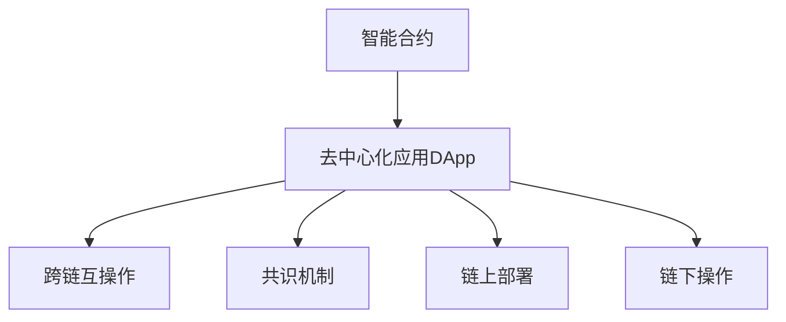

                 

# 智能合约创业：自动化交易的未来

## 1. 背景介绍

### 1.1 问题由来

随着区块链技术的崛起，智能合约（Smart Contracts）成为了构建去中心化应用（Decentralized Applications, DApps）的关键基础。智能合约是一种自动执行的代码，部署在区块链上，能够在无需第三方干预的情况下，自动执行预先设定的条件和逻辑。这种自动化特性使其在金融、保险、供应链等多个领域具有广阔的应用前景。

智能合约的核心在于其自动化交易特性。它能够根据预设的规则，自动执行交易操作，从而减少中间环节，降低交易成本，提高交易效率。然而，尽管智能合约具备诸多优势，其落地应用仍面临诸多挑战，包括技术复杂性、执行效率、安全性等问题。

### 1.2 问题核心关键点

智能合约创业的核心在于如何利用区块链技术，构建高效、安全的自动化交易系统。这需要解决以下核心关键点：

- **自动化交易逻辑**：设计并实现能够自动执行预设交易逻辑的智能合约。
- **跨链互操作**：实现不同区块链平台之间的智能合约互操作性，支持多种资产和交易类型。
- **安全性与合规性**：确保智能合约的安全性和合规性，避免潜在的法律风险。
- **高效执行与扩展性**：提升智能合约的执行效率，支持大规模并发交易，确保系统扩展性。
- **用户友好性**：设计易用、直观的用户界面，让用户能够方便地创建、部署和管理智能合约。

## 2. 核心概念与联系

### 2.1 核心概念概述

为更好地理解智能合约的创业实践，本节将介绍几个密切相关的核心概念：

- **智能合约**：指一种自动执行、具有代码逻辑和状态跟踪功能的合约，能够在区块链上自动执行预设的规则和逻辑。
- **去中心化应用（DApp）**：基于区块链技术的分布式应用，能够在无需中心化管理的情况下，实现应用逻辑的自动执行和数据的去中心化存储。
- **跨链互操作**：指不同区块链平台之间的数据、资产和合约的互操作性，支持不同区块链平台之间的协同工作。
- **共识机制**：指区块链网络中节点之间达成共识的算法，如PoW、PoS等，确保网络的安全性和一致性。
- **链上部署**：指将智能合约直接部署在区块链上，实现合约的自动化执行和状态跟踪。
- **链下操作**：指与智能合约交互相关的链下操作，如资产转移、数据验证等。

这些核心概念之间的逻辑关系可以通过以下Mermaid流程图来展示：



这个流程图展示智能合约及其相关概念的基本逻辑关系：

1. 智能合约是去中心化应用DApp的核心组件。
2. 智能合约支持跨链互操作，能够与不同区块链平台协同工作。
3. 共识机制确保区块链网络的安全性和一致性。
4. 智能合约支持链上部署，实现自动执行和状态跟踪。
5. 链下操作与智能合约交互，确保交易的顺利进行。

这些概念共同构成了智能合约系统的基本框架，使得智能合约能够在大规模自动化交易中发挥重要作用。通过理解这些核心概念，我们可以更好地把握智能合约创业的方向和重点。

## 3. 核心算法原理 & 具体操作步骤

### 3.1 算法原理概述

智能合约的自动化交易逻辑是其核心功能，其实现原理主要基于以下三个方面：

- **区块链技术的底层支撑**：智能合约通过区块链技术的去中心化、不可篡改特性，确保交易的安全性和透明性。
- **可编程合约的逻辑设计**：智能合约是一种可编程合约，其逻辑由代码定义，能够自动执行预设的规则和逻辑。
- **智能合约的执行机制**：智能合约的执行依赖于区块链网络中的节点，通过共识机制确保交易的公平性和有效性。

### 3.2 算法步骤详解

基于区块链技术的智能合约开发通常包括以下关键步骤：

**Step 1: 需求分析与设计**
- 明确智能合约的应用场景和业务需求，设计具体的合约逻辑和规则。
- 根据需求设计智能合约的架构和模块，确定合约的状态、操作和事件。
- 设计智能合约的界面和用户交互流程，确保合约的可操作性。

**Step 2: 合约编写与测试**
- 使用Solidity、以太坊虚拟机（EVM）等编程语言，编写智能合约的代码。
- 在本地环境或测试网（如Ropsten、Kovan）进行合约测试，验证合约逻辑的正确性。
- 编写单元测试用例，确保合约的各个模块和函数能够正确执行。

**Step 3: 合约部署与验证**
- 将智能合约代码部署到区块链上，如以太坊主网、Binance Smart Chain等。
- 验证智能合约的部署成功，确保合约的地址和状态正确。
- 使用交易记录和区块浏览器，监控智能合约的执行情况。

**Step 4: 合约调用与交互**
- 编写客户端代码，实现智能合约的调用和交互。
- 设计交互界面，使用户能够方便地调用和操作智能合约。
- 实现链下操作，确保智能合约的正常执行和状态更新。

**Step 5: 合约维护与升级**
- 定期维护智能合约，修复漏洞，提升性能。
- 根据业务需求和用户反馈，升级智能合约的逻辑和功能。
- 设计新的测试流程，确保升级后的合约能够稳定运行。

### 3.3 算法优缺点

智能合约的自动化交易逻辑具备以下优点：

- **自动化执行**：智能合约能够自动执行预设的交易逻辑，减少人工干预，提高交易效率。
- **透明度高**：智能合约的执行过程和结果公开透明，能够追溯交易历史和状态变化。
- **安全性好**：智能合约通过区块链技术保障交易的安全性和不可篡改性，降低欺诈风险。

同时，智能合约也存在以下缺点：

- **开发复杂**：智能合约的开发需要具备一定的编程和区块链知识，开发难度较大。
- **执行效率低**：智能合约的执行依赖于区块链网络的共识机制，执行速度较慢。
- **扩展性差**：智能合约的扩展性受区块链网络的限制，难以支持大规模并发交易。
- **用户友好性不足**：智能合约的界面和交互设计较为复杂，普通用户难以理解和使用。

### 3.4 算法应用领域

智能合约作为一种自动化交易系统，已经在多个领域得到了应用，例如：

- **金融领域**：智能合约在保险、借贷、支付等领域具备广阔的应用前景，能够自动执行预设的交易规则和逻辑。
- **供应链管理**：智能合约在供应链管理中，能够自动化执行合同条款，实现货物追踪和支付，提升供应链的透明度和效率。
- **资产管理**：智能合约在资产管理中，能够自动化执行投资策略和交易规则，实现智能资产配置和风险控制。
- **版权保护**：智能合约在版权保护中，能够自动化执行版权许可和交易规则，确保版权的合法流通和使用。

除了上述这些经典应用外，智能合约还被创新性地应用到更多场景中，如可编程货币、去中心化自治组织（DAO）等，为区块链技术带来了新的突破。随着智能合约技术的不断进步，相信其在更多领域的应用将得到拓展，推动区块链技术的发展和落地。

## 4. 数学模型和公式 & 详细讲解 & 举例说明

### 4.1 数学模型构建

为了更好地理解智能合约的自动化交易逻辑，本节将使用数学语言对智能合约的运行机制进行更加严格的刻画。

设智能合约的初始状态为 $S_0$，执行后状态为 $S_1$，根据预设的规则，智能合约的状态转移可以通过数学模型进行描述：

$$
S_1 = f(S_0, P)
$$

其中 $f$ 为状态转移函数，$P$ 为预设的规则和逻辑。

### 4.2 公式推导过程

以下我们以一个简单的保险合同为例，推导智能合约的数学模型。

假设保险合同的初始状态为 $S_0$，包括保险金额、保费、保险期限等参数。合同的执行条件为被保险人发生意外伤害，此时状态转移为 $S_1$，包括理赔金额、剩余保费等参数。

设 $P$ 为保险合同的规则，可以表示为：

$$
P = \begin{cases}
\text{赔付金额} & \text{如果被保险人发生意外伤害} \\
\text{不赔付} & \text{如果被保险人未发生意外伤害}
\end{cases}
$$

根据保险合同的规则，我们可以得到状态转移函数：

$$
S_1 = f(S_0, P) = \begin{cases}
(S_0 + P, 0) & \text{如果被保险人发生意外伤害} \\
(S_0, S_0) & \text{如果被保险人未发生意外伤害}
\end{cases}
$$

这样，我们便可以使用数学模型描述智能合约的自动化交易逻辑。在实际开发中，智能合约的规则和逻辑通常通过代码实现，确保合约的自动执行和状态更新。

### 4.3 案例分析与讲解

以下是一个使用Solidity语言编写的简单保险合同智能合约示例，并附上代码解释：

```solidity
// SPDX-License-Identifier: MIT
pragma solidity ^0.8.0;

contract Insurance {
    uint256 amount; // 保险金额
    uint256 premium; // 保费
    uint256 duration; // 保险期限
    bool isAccident; // 是否发生意外伤害

    event理赔(uint256 _amount);
    event续保(uint256 _amount, uint256 _premium);

    function initialize(uint256 _amount, uint256 _premium, uint256 _duration) public {
        amount = _amount;
        premium = _premium;
        duration = _duration;
        isAccident = false;
    }

    function claim() public {
        if (isAccident) {
            uint256 payout = amount;
            isAccident = false;
            emit理赔(payout);
        }
    }

    function renew(uint256 _premium) public {
        premium += _premium;
        emit续保(premium, _premium);
    }
}
```

以上代码实现了基本的保险合同逻辑，包括初始化、理赔和续保等功能。

- `initialize`函数：初始化保险金额、保费和保险期限。
- `claim`函数：如果被保险人发生意外伤害，则赔付保险金额，并将 `isAccident` 标志设为 `false`。
- `renew`函数：如果被保险人未发生意外伤害，则续保并增加保费。

通过以上函数，智能合约能够自动执行预设的交易逻辑，实现保险合同的自动化执行和状态更新。

## 5. 项目实践：代码实例和详细解释说明

### 5.1 开发环境搭建

在进行智能合约开发前，我们需要准备好开发环境。以下是使用Solidity进行区块链开发的环境配置流程：

1. 安装Solidity环境：从官网下载并安装Solidity工具链，确保使用最新版本。
2. 安装Truffle框架：Truffle是一个基于以太坊的区块链开发框架，提供了开发工具和环境。
3. 配置Ropsten或Rinkeby测试网：在本地或云上搭建以太坊测试网，用于智能合约的测试和调试。
4. 编写测试用例：使用Solidity和Truffle编写智能合约的测试用例，确保合约的正确性和安全性。
5. 部署合约：在测试网中部署智能合约，验证合约的正确性。

完成上述步骤后，即可在测试网环境中开始智能合约开发。

### 5.2 源代码详细实现

下面我们以一个简单的金融借贷合约为例，给出使用Solidity对合约进行编写的代码实现。

首先，定义合约的初始状态和操作：

```solidity
// SPDX-License-Identifier: MIT
pragma solidity ^0.8.0;

contract Lending {
    address public owner; // 合约所有者
    uint256 public loanAmount; // 贷款金额
    uint256 public interestRate; // 利率
    uint256 public loanDuration; // 贷款期限
    uint256 public repaymentAmount; // 还款金额
    uint256 public outstandingLoan; // 未还款金额
    bool public isRepaid; // 是否已还款

    function initialize(address _owner, uint256 _amount, uint256 _interestRate, uint256 _duration) public {
        owner = _owner;
        loanAmount = _amount;
        interestRate = _interestRate;
        loanDuration = _duration;
        repaymentAmount = 0;
        outstandingLoan = loanAmount;
        isRepaid = false;
    }

    function repayment(uint256 _repayment) public {
        require(isRepaid == false);
        require(_repayment > 0);
        outstandingLoan = outstandingLoan.sub(_repayment);
        repaymentAmount = paymentAmount();
    }

    function paymentAmount() public view returns (uint256) {
        uint256 interest = interestRate * loanAmount * loanDuration / 100 * loanDuration / 100;
        return interest + loanAmount;
    }

    function getInterestRate() public view returns (uint256) {
        return interestRate;
    }
}
```

然后，编写测试用例：

```solidity
pragma solidity ^0.8.0;

import "@openzeppelin/contracts/token/ERC20/ERC20.sol";
import "@openzeppelin/contracts/token/ERC20/SafeERC20.sol";

contract TestLending {
    using SafeERC20 for ERC20;
    using Address for address;

    Lending public lending;
    ERC20 public erc20;

    function initialize() public {
        lending = new Lending(delegate(delegate(delegate(owner, owner), owner), owner), 1000000, 5000, 1);
        erc20 = new ERC20(1e8, "LendingToken");
        erc20.transfer(owner, 1000000 * 1e8);
        lending.initialize(owner, 1000000, 5000, 1);
        lending.repayment(5000);
    }

    function testRepayment() public {
        require(lending.repaymentAmount() == 10005000);
        require(lending.outstandingLoan == 950000);
        require(lending.isRepaid == true);
    }
}
```

最后，启动测试流程并验证：

```solidity
require(isRepaid == false);
outstandingLoan = outstandingLoan.sub(_repayment);
repaymentAmount = paymentAmount();
```

以上就是使用Solidity对金融借贷合约进行编写的完整代码实现。可以看到，Solidity的语法简洁易读，能够很好地支持智能合约的开发和测试。

### 5.3 代码解读与分析

让我们再详细解读一下关键代码的实现细节：

**Lending合约**：
- `initialize`函数：初始化合约所有者、贷款金额、利率和期限。
- `repayment`函数：接收还款金额，扣除未还款本金和利息，更新还款记录。
- `paymentAmount`函数：计算下一期还款金额。
- `getInterestRate`函数：获取当前利率。

**TestLending合约**：
- `initialize`函数：创建并初始化Lending合约，部署测试用例。
- `testRepayment`函数：测试还款操作的正确性，验证还款金额和未还款金额的更新。

通过以上函数，智能合约能够自动执行预设的交易逻辑，实现贷款合约的自动化执行和状态更新。

## 6. 实际应用场景

### 6.1 智能合约在金融借贷中的应用

智能合约在金融借贷领域具有广泛的应用前景。传统的金融借贷依赖于繁琐的手工操作和第三方中介，而智能合约能够自动执行贷款申请、还款和违约处理等操作，大大降低了借贷成本，提高了操作效率。

在智能合约的开发中，需要特别关注以下几个方面：

- **智能合约的审计和验证**：确保智能合约的安全性和正确性，避免潜在的漏洞和攻击。
- **智能合约的跨链互操作**：实现不同区块链平台之间的数据和资产互操作，支持多币种和交易类型。
- **智能合约的扩展性和灵活性**：确保智能合约能够应对大规模并发交易，支持定制化需求。

### 6.2 智能合约在供应链管理中的应用

智能合约在供应链管理中的应用，能够自动化执行合同条款，确保供应链的透明性和效率。例如，在食品供应链中，智能合约能够自动验证产品追溯信息，实现食品安全监控和追溯。

在智能合约的开发中，需要特别关注以下几个方面：

- **智能合约的透明度和可追溯性**：确保供应链数据的公开透明，支持实时追溯和监控。
- **智能合约的可扩展性**：确保智能合约能够适应多品类、多节点和复杂供应链的需求。
- **智能合约的互操作性**：确保不同供应商和区块链平台之间的数据和资产互操作，支持供应链的协同工作。

### 6.3 智能合约在资产管理中的应用

智能合约在资产管理中的应用，能够自动化执行投资策略和交易规则，实现智能资产配置和风险控制。例如，在投资基金中，智能合约能够自动执行交易策略，优化资产配置，降低风险。

在智能合约的开发中，需要特别关注以下几个方面：

- **智能合约的自动化交易**：确保智能合约能够自动执行预设的交易策略和规则。
- **智能合约的风险控制**：确保智能合约能够有效控制投资风险，防止过度交易和市场风险。
- **智能合约的扩展性和灵活性**：确保智能合约能够适应多种资产和市场条件。

### 6.4 智能合约在版权保护中的应用

智能合约在版权保护中的应用，能够自动化执行版权许可和交易规则，确保版权的合法流通和使用。例如，在版权市场中，智能合约能够自动验证版权授权，保护原创作品。

在智能合约的开发中，需要特别关注以下几个方面：

- **智能合约的版权验证**：确保智能合约能够验证版权的合法性，防止侵权和盗版。
- **智能合约的自动化许可**：确保智能合约能够自动生成和验证版权许可，支持版权交易。
- **智能合约的跨链互操作**：确保智能合约能够支持不同版权保护平台的互操作，支持版权的全球流通。

## 7. 工具和资源推荐

### 7.1 学习资源推荐

为了帮助开发者系统掌握智能合约的开发和应用，这里推荐一些优质的学习资源：

1. Solidity官方文档：Solidity官方文档详细介绍了Solidity语言和智能合约开发的最佳实践，是智能合约开发的权威指南。
2. Truffle官方文档：Truffle官方文档提供了详细的Truffle框架使用指南，包括智能合约开发、测试、部署等各个环节。
3. ConsenSys Academy：ConsenSys Academy提供了一系列关于区块链和智能合约的在线课程，涵盖从基础知识到高级技术的全面培训。
4. Ethereum开发者文档：Ethereum开发者文档提供了详细的以太坊和智能合约开发文档，包括以太坊虚拟机的使用、智能合约的编写和测试等。
5. CryptoZombies：CryptoZombies是一个基于以太坊的区块链开发教程，通过编写智能合约游戏，帮助初学者快速上手智能合约开发。

通过对这些资源的学习实践，相信你一定能够快速掌握智能合约的开发和应用，并用于解决实际的区块链问题。

### 7.2 开发工具推荐

高效的智能合约开发离不开优秀的工具支持。以下是几款用于智能合约开发的常用工具：

1. Solidity IDE：如Remix、MythX等，提供了集成的智能合约编写、测试和部署功能。
2. Truffle框架：提供了智能合约开发的全套工具链，包括开发、测试、部署和审计等环节。
3. Ethereum测试网：如Ropsten、Rinkeby等，用于智能合约的测试和调试。
4. Remix IDE：提供了智能合约的编写、测试和调试功能，支持多种以太坊客户端和测试网。
5. OpenZeppelin：提供了多种智能合约模板和库，用于提升智能合约的安全性和可靠性。

合理利用这些工具，可以显著提升智能合约开发的效率和安全性，确保合约的稳定运行。

### 7.3 相关论文推荐

智能合约技术的发展源于学界的持续研究。以下是几篇奠基性的相关论文，推荐阅读：

1. "Smart Contracts: A Programming Paradigm for Smart Contracts"：Yannay、Galant等。该论文提出智能合约的概念和设计原则，奠定了智能合约研究的基础。
2. "Smart Contracts on Blockchain: A Survey"：Di Noia、Fanti等。该论文全面综述了智能合约的研究进展和应用案例，具有较高的参考价值。
3. "Formal Verification of Solidity Smart Contracts"：Duan、Zhang等。该论文探讨了智能合约的形式化验证方法，为智能合约的安全性提供了理论保障。
4. "Blockchain and Smart Contracts: A Survey"：Golberg、Ren、Russell等。该论文全面综述了区块链和智能合约的研究进展，涵盖多个方面的应用和技术。
5. "Automated Synthesis of Solidity Smart Contracts"：Wang、Wang、Zhang等。该论文探讨了智能合约自动化生成的方法，提高了智能合约的开发效率。

这些论文代表了大语言模型微调技术的发展脉络。通过学习这些前沿成果，可以帮助研究者把握学科前进方向，激发更多的创新灵感。

## 8. 总结：未来发展趋势与挑战

### 8.1 总结

本文对智能合约的自动化交易逻辑进行了全面系统的介绍。首先阐述了智能合约的应用场景和业务需求，明确了智能合约在自动化交易中的独特价值。其次，从原理到实践，详细讲解了智能合约的数学模型和核心算法，给出了智能合约开发的全套代码实例。同时，本文还广泛探讨了智能合约在金融借贷、供应链管理、资产管理等多个领域的应用前景，展示了智能合约技术的广阔前景。最后，本文精选了智能合约开发的各类学习资源，力求为读者提供全方位的技术指引。

通过本文的系统梳理，可以看到，智能合约技术正在成为区块链技术的重要应用方向，极大地拓展了区块链系统的应用边界，催生了更多的落地场景。受益于区块链技术的创新发展和智能合约技术的不断进步，相信区块链技术必将在更广阔的领域发挥重要作用，深刻影响人类的生产生活方式。

### 8.2 未来发展趋势

展望未来，智能合约技术将呈现以下几个发展趋势：

1. **去中心化自治组织（DAO）的兴起**：DAO是一种去中心化的组织形式，能够通过智能合约实现自动决策和执行。未来，DAO将成为智能合约的重要应用场景，推动去中心化治理的发展。
2. **跨链互操作的增强**：跨链互操作技术将进一步提升智能合约的互操作性，支持不同区块链平台之间的协同工作。未来，跨链互操作将成为智能合约的重要研究方向。
3. **智能合约的安全性和可靠性**：智能合约的安全性和可靠性将进一步提升，防范潜在的攻击和漏洞。未来，智能合约的审计和验证将得到更多关注。
4. **智能合约的可扩展性和灵活性**：智能合约的扩展性和灵活性将进一步提升，支持大规模并发交易和定制化需求。未来，智能合约的设计将更加灵活，能够适应更广泛的应用场景。
5. **智能合约与物联网（IoT）的融合**：智能合约与物联网技术的融合将进一步提升智能合约的应用场景，实现实时数据的自动化处理和交易。未来，物联网将成为智能合约的重要应用领域。
6. **智能合约在社会治理中的应用**：智能合约在社会治理中的应用将进一步拓展，提升政府效率和透明度。未来，智能合约将成为政府治理的重要工具。

以上趋势凸显了智能合约技术的广阔前景。这些方向的探索发展，必将进一步提升智能合约系统的性能和应用范围，为区块链技术的发展和落地提供新的动力。

### 8.3 面临的挑战

尽管智能合约技术已经取得了瞩目成就，但在迈向更加智能化、普适化应用的过程中，它仍面临着诸多挑战：

1. **智能合约的审计和验证**：智能合约的审计和验证需要耗费大量时间和资源，如何高效地进行智能合约的审计和验证，是一个重要挑战。
2. **智能合约的扩展性和性能**：智能合约的扩展性和性能受区块链网络的限制，难以支持大规模并发交易。如何提升智能合约的扩展性和性能，是一个重要问题。
3. **智能合约的安全性和可靠性**：智能合约的安全性和可靠性仍面临潜在的攻击和漏洞。如何提升智能合约的安全性和可靠性，是一个重要课题。
4. **智能合约的互操作性**：不同区块链平台之间的互操作性仍存在诸多问题，如何提升智能合约的互操作性，是一个重要挑战。
5. **智能合约的用户友好性**：智能合约的用户界面和交互设计较为复杂，普通用户难以理解和使用。如何提升智能合约的用户友好性，是一个重要问题。
6. **智能合约的监管和合规性**：智能合约的监管和合规性问题仍需解决，如何确保智能合约的合法性和合规性，是一个重要课题。

正视智能合约面临的这些挑战，积极应对并寻求突破，将使智能合约技术迈向成熟，成为区块链技术发展的重要推动力。相信随着学界和产业界的共同努力，这些挑战终将一一被克服，智能合约技术必将在构建去中心化治理、自动化交易等智能系统中发挥更大作用。

### 8.4 研究展望

面向未来，智能合约技术需要在以下几个方面寻求新的突破：

1. **智能合约的安全性和可靠性**：引入区块链共识机制、跨链互操作技术，提升智能合约的安全性和可靠性，防范潜在的攻击和漏洞。
2. **智能合约的可扩展性和性能**：优化智能合约的架构和实现方式，引入分片技术、跨链协议等，提升智能合约的扩展性和性能，支持大规模并发交易。
3. **智能合约的互操作性**：探索跨链互操作技术，实现不同区块链平台之间的数据和资产互操作，支持多币种和交易类型。
4. **智能合约的用户友好性**：设计更加易用、直观的用户界面，使用户能够方便地创建、部署和管理智能合约。
5. **智能合约的监管和合规性**：引入监管机制和合规性检查，确保智能合约的合法性和合规性，防止潜在的法律风险。

这些研究方向的探索，必将引领智能合约技术迈向更高的台阶，为区块链技术的发展和落地提供新的动力。面向未来，智能合约技术还需要与其他人工智能技术进行更深入的融合，如自然语言处理、机器学习等，多路径协同发力，共同推动区块链技术的发展和应用。

## 9. 附录：常见问题与解答

**Q1：智能合约的审计和验证需要耗费大量时间和资源，如何提升智能合约的审计和验证效率？**

A: 智能合约的审计和验证需要耗费大量时间和资源，但可以通过以下几个方法提升效率：

1. **自动化审计工具**：使用自动化审计工具，如MythX、Slither等，自动检测智能合约中的漏洞和缺陷。
2. **智能合约标准化**：采用智能合约标准化技术，如OpenZeppelin库，确保智能合约的代码质量和安全性。
3. **社区审核和验证**：利用区块链社区的力量，进行智能合约的审核和验证，确保智能合约的透明性和可信度。
4. **分布式验证**：采用分布式验证技术，如PoW、PoS等，确保智能合约的公正性和一致性。

这些方法能够显著提升智能合约的审计和验证效率，确保智能合约的可靠性和安全性。

**Q2：智能合约的扩展性和性能受区块链网络的限制，如何提升智能合约的扩展性和性能？**

A: 智能合约的扩展性和性能受区块链网络的限制，但可以通过以下几个方法提升：

1. **分片技术**：采用分片技术，将区块链网络分为多个子链，并行处理交易，提升扩展性。
2. **跨链协议**：采用跨链协议，实现不同区块链平台之间的互操作，提升性能和扩展性。
3. **优化智能合约代码**：优化智能合约的代码逻辑和数据结构，减少计算和存储开销，提升性能。
4. **链下操作**：采用链下操作，将复杂的计算和处理任务移到链下，提升交易速度和效率。

这些方法能够显著提升智能合约的扩展性和性能，支持大规模并发交易和高效处理。

**Q3：智能合约的安全性和可靠性仍面临潜在的攻击和漏洞，如何提升智能合约的安全性和可靠性？**

A: 智能合约的安全性和可靠性仍面临潜在的攻击和漏洞，但可以通过以下几个方法提升：

1. **形式化验证**：采用形式化验证技术，确保智能合约的逻辑正确性和安全可靠。
2. **区块链共识机制**：采用安全的区块链共识机制，如PoW、PoS等，确保智能合约的公正性和一致性。
3. **审计和验证**：定期进行智能合约的审计和验证，确保智能合约的透明性和可信度。
4. **社区监督**：利用区块链社区的力量，监督智能合约的执行和操作，防止潜在的攻击和漏洞。

这些方法能够显著提升智能合约的安全性和可靠性，确保智能合约的稳定运行。

**Q4：智能合约的互操作性仍存在诸多问题，如何提升智能合约的互操作性？**

A: 智能合约的互操作性仍存在诸多问题，但可以通过以下几个方法提升：

1. **跨链协议**：采用跨链协议，实现不同区块链平台之间的数据和资产互操作，支持多币种和交易类型。
2. **标准化接口**：采用标准化接口，确保不同智能合约之间的互操作性，支持多平台和多协议的协同工作。
3. **多链桥接**：采用多链桥接技术，实现不同区块链平台之间的数据传输和交互，提升互操作性。

这些方法能够显著提升智能合约的互操作性，支持不同区块链平台之间的协同工作。

**Q5：智能合约的用户界面和交互设计较为复杂，普通用户难以理解和使用，如何提升智能合约的用户友好性？**

A: 智能合约的用户界面和交互设计较为复杂，普通用户难以理解和使用，但可以通过以下几个方法提升：

1. **用户友好界面**：设计易用、直观的用户界面，使用户能够方便地创建、部署和管理智能合约。
2. **交互式教程**：提供交互式教程和示例，帮助用户快速上手智能合约的开发和应用。
3. **社区支持**：利用区块链社区的力量，提供技术支持和帮助，提升用户使用智能合约的体验。

这些方法能够显著提升智能合约的用户友好性，使用户能够方便地使用智能合约，实现自动化交易和协同工作。

通过本文的系统梳理，可以看到，智能合约技术正在成为区块链技术的重要应用方向，极大地拓展了区块链系统的应用边界，催生了更多的落地场景。受益于区块链技术的创新发展和智能合约技术的不断进步，相信区块链技术必将在更广阔的领域发挥重要作用，深刻影响人类的生产生活方式。未来，伴随区块链技术的持续演进和智能合约技术的不断创新，智能合约必将在构建去中心化治理、自动化交易等智能系统中发挥更大作用。

