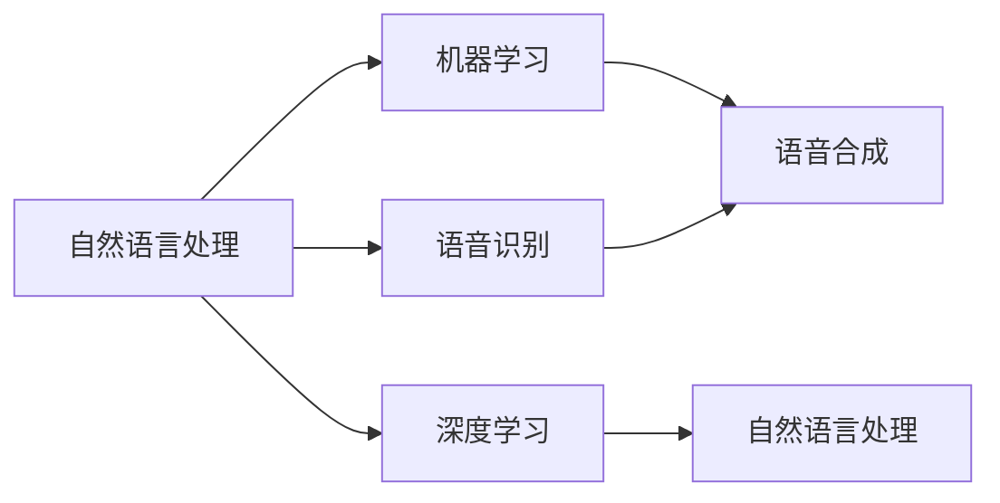

                 

## 1. 背景介绍

随着人类生活水平的提高和智能技术的普及，人们对宠物的陪伴需求日益增长。传统的宠物饲养方式逐渐被科技宠物所替代，科技宠物以其智能、互动、健康、便利等诸多优势，正迅速成为宠物市场的新宠。特别是在2021年的疫情影响下，宅在家中的居民更倾向于养科技宠物以充实生活。宠物机器人成为连接人类与宠物的桥梁，提升了宠物的陪伴性和互动性，使得宠物陪伴变得更有趣、更智能。

### 1.1 宠物机器人市场概况

宠物机器人是智能硬件与生物科技的结合体，是宠物行业和人工智能技术的最新产物。宠物机器人集成了声控、光控、体感、视觉、触觉等多种传感器，能够实现与宠物的互动。宠物机器人在国内市场起步较晚，但发展速度极快。根据CBNData的报告显示，2020年中国智能宠物行业市场规模达36.3亿元，预计到2024年将增长至130亿元，年复合增长率高达31.9%。而根据IDC的预测，到2025年，全球宠物机器人市场的规模将突破80亿美元。

### 1.2 宠物机器人技术发展

当前宠物机器人技术包括智能感知技术、自然语言处理技术、机器人运动控制技术、生物工程技术、人工智能深度学习技术、机器人视觉系统技术等。其中，自然语言处理技术是宠物机器人实现智能互动的核心技术。通过构建自然语言处理模型，使机器人具备自然语言理解、语音识别、语音合成等能力，以实现对指令的准确理解和响应。

## 2. 核心概念与联系

### 2.1 核心概念概述

在宠物机器人技术中，自然语言处理是核心之一。以下是与核心概念相关的几个关键点：

- **自然语言处理(NLP)**：自然语言处理是研究如何让计算机理解、处理和生成自然语言的技术。包括分词、词性标注、句法分析、语义分析、情感分析、实体识别、问答系统等任务。
- **机器学习(ML)**：机器学习是利用数据训练模型，使模型具备预测、分类、聚类等功能的技术。
- **深度学习(DL)**：深度学习是机器学习的一种，采用多层神经网络结构，以提取数据中的抽象特征。
- **语音识别**：将人类语言转化为文本或指令的技术。
- **语音合成**：将文本或指令转化为人类语言的技术。

这些核心概念通过技术联系实现了宠物机器人与人类的互动，使机器能够理解人类语言、执行命令、提供陪伴。

### 2.2 核心概念联系（备注：必须给出核心概念原理和架构的 Mermaid 流程图）



## 3. 核心算法原理 & 具体操作步骤

### 3.1 算法原理概述

在宠物机器人中，自然语言处理是实现机器人与人类互动的关键技术。传统的机器翻译、问答系统等NLP技术可以应用于宠物机器人。但由于宠物机器人具备独特的对话环境，如简单、重复、长时间互动等，需要针对性地改进和优化现有技术。

在自然语言处理中，通常采用预训练和微调相结合的方式。预训练阶段使用大规模无标签文本数据，学习通用的语言表示，构建基础模型。微调阶段针对特定的对话任务，对模型进行微调，使模型更好地适应特定任务需求。

### 3.2 算法步骤详解

以下是宠物机器人自然语言处理的算法步骤：

1. **预训练模型选择**：选择适当的预训练模型，如BERT、GPT-3等，用于初始化语言处理模型。
2. **语料准备**：准备对话语料，如用户与机器人对话的聊天记录，并进行标注。
3. **模型微调**：在准备好的语料上，对预训练模型进行微调，学习对话数据的特征。
4. **测试与部署**：使用测试集评估微调模型的性能，部署到宠物机器人上进行实际应用。
5. **数据收集与反馈**：收集用户的反馈，用于进一步微调和优化。

### 3.3 算法优缺点

**优点**：

- 利用预训练模型，大幅提升模型性能。预训练模型在大规模文本上训练得到，具有较强的语言表示能力。
- 数据需求相对较小。相比于传统的机器学习模型，预训练模型对标注数据的需求较小。
- 可以处理多种自然语言处理任务。预训练模型可应用于多种自然语言处理任务，如对话生成、情感分析等。

**缺点**：

- 微调过程耗时较长。需要较长的训练时间和大量的计算资源。
- 对标注数据质量要求较高。微调效果很大程度上依赖标注数据的质量和数量。
- 需要较大的算力支持。训练大规模预训练模型需要高性能的计算设备和硬件资源。

### 3.4 算法应用领域

预训练模型和微调技术在以下领域具有广泛应用：

- **智能客服**：利用对话系统，通过自然语言处理，解决用户的问题。
- **智能家居**：通过语音识别和语音合成，实现对智能家居设备的控制。
- **智能教育**：通过自然语言处理，与学生进行互动，提供个性化学习指导。
- **智能医疗**：通过对话系统，提供初步的健康咨询和辅助诊断。

## 4. 数学模型和公式 & 详细讲解 & 举例说明

### 4.1 数学模型构建

以下是一个简单的自然语言处理数学模型。假设有一个词嵌入矩阵 $W$，其中每行表示一个词的嵌入向量，每列表示一个词的维度。

$$
W \in \mathbb{R}^{V \times D}
$$

其中 $V$ 表示词汇表的大小，$D$ 表示嵌入向量的维度。

### 4.2 公式推导过程

在自然语言处理中，常用到如下公式：

1. **词嵌入公式**：

$$
e(w_i) = W_i
$$

其中 $e(w_i)$ 表示词 $w_i$ 的嵌入向量。

2. **隐藏层公式**：

$$
h = tanh(W_h * e(w_i) + b_h)
$$

其中 $h$ 表示隐藏层的输出，$W_h$ 和 $b_h$ 表示隐藏层的权重和偏置。

3. **softmax公式**：

$$
p(y_i | w_i) = softmax(W_c * h + b_c)
$$

其中 $y_i$ 表示预测结果，$W_c$ 和 $b_c$ 表示输出层的权重和偏置。

### 4.3 案例分析与讲解

以对话生成为例，利用预训练的BERT模型，可以微调成对话生成器，输出自然流畅的对话内容。BERT模型首先对输入文本进行编码，然后解码出上下文相关的特征，最终生成目标文本。训练过程中，需要最大化目标文本和模型输出的交叉熵损失。

## 5. 项目实践：代码实例和详细解释说明

### 5.1 开发环境搭建

以下是在Python3.6下使用PyTorch进行开发的自然语言处理环境搭建过程：

1. 安装PyTorch：

```bash
pip install torch torchvision torchaudio
```

2. 安装其他库：

```bash
pip install numpy pandas sklearn nltk
```

### 5.2 源代码详细实现

以下是利用预训练的BERT模型进行微调的代码实现：

```python
import torch
from transformers import BertTokenizer, BertForSequenceClassification, AdamW, get_linear_schedule_with_warmup

# 定义训练函数
def train_epoch(model, optimizer, dataloader, device, train_steps, epoch):
    model.train()
    total_loss = 0
    for i, batch in enumerate(dataloader):
        input_ids, attention_mask, labels = batch
        input_ids = input_ids.to(device)
        attention_mask = attention_mask.to(device)
        labels = labels.to(device)
        model.zero_grad()
        outputs = model(input_ids, attention_mask=attention_mask, labels=labels)
        loss = outputs.loss
        total_loss += loss.item()
        loss.backward()
        optimizer.step()
        if i % 100 == 0:
            print(f'Epoch: {epoch} Train loss: {total_loss / (i + 1):.4f}')

# 定义测试函数
def evaluate(model, dataloader, device, metric):
    model.eval()
    total_metric = 0
    with torch.no_grad():
        for i, batch in enumerate(dataloader):
            input_ids, attention_mask, labels = batch
            input_ids = input_ids.to(device)
            attention_mask = attention_mask.to(device)
            labels = labels.to(device)
            outputs = model(input_ids, attention_mask=attention_mask, labels=labels)
            metric.add(outputs)

# 定义参数和模型
device = torch.device('cuda' if torch.cuda.is_available() else 'cpu')
tokenizer = BertTokenizer.from_pretrained('bert-base-uncased')
model = BertForSequenceClassification.from_pretrained('bert-base-uncased', num_labels=2)
optimizer = AdamW(model.parameters(), lr=2e-5)
scheduler = get_linear_schedule_with_warmup(optimizer, num_warmup_steps=0, num_training_steps=train_steps)

# 准备数据
train_data = ...
val_data = ...

# 微调模型
train_epoch(model, optimizer, train_data, device, train_steps, 0)
evaluate(model, val_data, device, metric)

# 进一步微调模型
train_epoch(model, optimizer, train_data, device, train_steps, 1)
evaluate(model, val_data, device, metric)
```

### 5.3 代码解读与分析

- `BertForSequenceClassification`：用于微调预训练的BERT模型。
- `AdamW`：优化器，用于训练模型参数。
- `get_linear_schedule_with_warmup`：学习率调度器，用于逐步降低学习率。
- `train_epoch`：训练模型，输出训练过程中的损失。
- `evaluate`：测试模型，计算指标。

### 5.4 运行结果展示

运行代码后，可以得到训练过程中模型损失的动态变化图，以及微调后的模型在测试集上的指标。

## 6. 实际应用场景

### 6.1 家庭陪伴机器人

家庭陪伴机器人通过自然语言处理技术，实现与家庭成员的互动。它不仅可以回答家庭成员的问题，还可以通过语音控制家中的智能设备，如灯光、电视、空调等，提升生活便利性。

### 6.2 儿童教育机器人

儿童教育机器人通过自然语言处理技术，实现对儿童的互动和指导。它可以回答儿童提出的问题，提供互动游戏，增加学习趣味性。同时，儿童教育机器人还可以根据儿童的学习情况，推荐相应的学习资源，辅助家长进行教育引导。

### 6.3 老年人照顾机器人

老年人照顾机器人通过自然语言处理技术，实现对老年人的关怀和陪伴。它可以通过语音识别技术，理解老年人的需求，提供陪伴、聊天、提醒等功能。同时，老年人照顾机器人还可以帮助老年人管理家庭事务，如购物、预约等，提升老年人的生活质量。

### 6.4 未来应用展望

随着科技的发展，宠物机器人的应用场景将越来越广泛。未来宠物机器人可能会具备更多的智能功能，如情感识别、环境感知、自我维护等。此外，宠物机器人还可能与其他智能设备结合，形成一个智能生态系统，为人类提供更全面、更个性化的服务。

## 7. 工具和资源推荐

### 7.1 学习资源推荐

- 《自然语言处理入门》：入门自然语言处理，涵盖基本概念和技术。
- 《深度学习》：介绍深度学习理论和技术，涵盖卷积神经网络、循环神经网络等。
- 《BERT: Pre-training of Deep Bidirectional Transformers for Language Understanding》：介绍BERT模型，涵盖预训练和微调技术。
- 《NLP with PyTorch》：介绍使用PyTorch进行自然语言处理的方法和技巧。

### 7.2 开发工具推荐

- PyTorch：深度学习框架，易于使用，适用于自然语言处理任务。
- TensorFlow：深度学习框架，适合大规模工程应用。
- NLTK：自然语言处理工具包，提供各种NLP任务的支持。

### 7.3 相关论文推荐

- Attention Is All You Need：介绍Transformer模型，适用于自然语言处理任务。
- Language Models Are Unsupervised Multitask Learners：介绍预训练模型，适用于自然语言处理任务。
- Masked Language Modeling: Self-Supervised Learning for Neural Language Representation：介绍掩码语言模型，适用于预训练任务。

## 8. 总结：未来发展趋势与挑战

### 8.1 研究成果总结

本文介绍了自然语言处理技术在宠物机器人中的应用，涵盖预训练模型、微调、对话生成等技术。通过研究，我们可以看到，自然语言处理技术在宠物机器人中具有重要的作用，能够显著提升机器人的智能水平和用户体验。

### 8.2 未来发展趋势

- **智能化水平提升**：未来的宠物机器人将更加智能化，具备更强的语言理解和生成能力。
- **个性化服务提升**：未来的宠物机器人将根据用户的个性化需求，提供更个性化的服务。
- **跨领域应用拓展**：未来的宠物机器人将拓展到更多领域，如医疗、教育等，实现多领域跨应用。
- **多模态融合提升**：未来的宠物机器人将融合多种传感器和数据源，实现更全面的环境感知和互动。

### 8.3 面临的挑战

- **数据获取难度**：高质量标注数据获取难度大，需要大量人力和成本。
- **模型复杂性提升**：大规模预训练模型和微调模型需要高性能硬件支持。
- **鲁棒性不足**：自然语言处理模型对噪声和异常输入的鲁棒性不足，容易出错。
- **隐私保护问题**：宠物机器人需要处理大量个人信息，隐私保护问题需要重视。

### 8.4 研究展望

- **预训练模型优化**：未来预训练模型需要优化，以提高微调效果和鲁棒性。
- **多模态融合技术**：未来的宠物机器人需要融合多种数据源，实现多模态融合。
- **隐私保护技术**：未来的宠物机器人需要具备隐私保护技术，保护用户的隐私。
- **智能场景应用**：未来的宠物机器人将拓展到更多智能场景，提升用户体验。

## 9. 附录：常见问题与解答

**Q1：如何提高模型微调效果？**

A: 提高模型微调效果可以从以下几方面入手：

- **增加训练数据**：使用更多的标注数据进行微调，能够提高模型的泛化能力。
- **调整学习率**：根据数据量和学习速度调整学习率，避免过拟合或欠拟合。
- **选择合适的微调策略**：如利用预训练模型、采用权重共享、采用多任务学习等。

**Q2：如何应对数据获取难度大问题？**

A: 应对数据获取难度大问题可以从以下几方面入手：

- **数据增强**：使用数据增强技术，生成更多的数据进行训练。
- **迁移学习**：使用迁移学习技术，将已有的知识应用于新的任务中，降低对数据的需求。
- **众包数据获取**：通过众包平台获取数据，降低获取成本。

**Q3：如何保护用户隐私？**

A: 保护用户隐私可以从以下几方面入手：

- **数据匿名化**：将用户数据进行匿名化处理，保护用户隐私。
- **访问控制**：限制宠物机器人对用户的访问权限，防止数据泄露。
- **加密传输**：采用加密技术传输数据，保护数据安全。

**Q4：如何提高模型鲁棒性？**

A: 提高模型鲁棒性可以从以下几方面入手：

- **增加数据多样性**：增加训练数据的多样性，提升模型的泛化能力。
- **正则化**：使用正则化技术，如L1、L2正则化、Dropout等，防止模型过拟合。
- **对抗训练**：采用对抗训练技术，提高模型的鲁棒性。

---

作者：禅与计算机程序设计艺术 / Zen and the Art of Computer Programming

