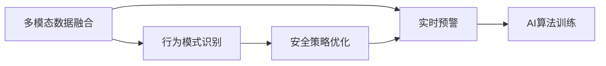

                 

## 1. 背景介绍

智能家居的兴起让家庭生活更加便利、安全，但同时也带来了新的挑战，如数据安全、隐私保护等。安全预警技术作为智能家居的重要组成部分，如何确保家庭环境的安全性，成为创业者和研究者关注的焦点。本文将从背景、核心概念、算法原理、实际操作、应用场景等维度，全方位探讨智能家居安全预警创业的实现路径。

### 1.1 问题由来
随着物联网技术的发展，越来越多的家庭设备接入互联网，带来了数据泄露、恶意攻击等安全隐患。传统的视频监控、门禁系统等虽然能提供一定的安全保护，但无法实时预警和智能识别潜在威胁。智能家居安全预警系统通过对家庭环境的全面监控、数据分析，可以实时预警潜在风险，提升家庭安全性。

### 1.2 问题核心关键点
智能家居安全预警系统是一个多模态数据融合、实时预警、智能化管理的复杂系统。其核心关键点包括：
- 多模态数据融合：集成视频监控、门窗传感器、烟雾传感器等多种数据源，形成全面的安全监控网络。
- 实时预警：通过深度学习模型进行数据实时分析，快速识别异常行为并实时预警。
- 智能化管理：引入AI算法优化预警策略，如时间窗口、行为模式识别等。

## 2. 核心概念与联系

### 2.1 核心概念概述

智能家居安全预警系统的实现涉及多个关键概念，包括：

- **多模态数据融合**：将视频、传感器等不同来源的数据进行统一处理和分析，形成全面的安全监控网络。
- **实时预警**：通过深度学习模型对多模态数据进行实时分析，识别潜在风险并及时预警。
- **行为模式识别**：通过分析历史行为数据，学习正常行为模式，及时识别异常行为。
- **安全策略优化**：引入AI算法优化预警策略，如时间窗口、行为模式识别等，提升预警效果。
- **AI算法训练**：利用监督学习、强化学习等技术，对模型进行训练优化，提高识别准确率。

这些概念之间的逻辑关系可以通过以下Mermaid流程图来展示：



这个流程图展示智能家居安全预警系统的核心概念及其之间的关系：

1. 多模态数据融合形成全面的安全监控网络。
2. 实时预警基于多模态数据进行快速识别和及时预警。
3. 行为模式识别学习正常行为模式。
4. 安全策略优化引入AI算法优化预警策略。
5. AI算法训练提升模型识别准确率。

## 3. 核心算法原理 & 具体操作步骤

### 3.1 算法原理概述

智能家居安全预警系统采用监督学习、行为识别等技术，对多模态数据进行实时分析和处理。系统主要包含以下几个步骤：

1. **多模态数据融合**：集成视频、传感器等数据源，形成全面的安全监控网络。
2. **行为模式识别**：通过深度学习模型分析历史行为数据，学习正常行为模式。
3. **实时预警**：对实时数据进行实时分析，识别异常行为并及时预警。
4. **安全策略优化**：引入AI算法优化预警策略，提升预警效果。

### 3.2 算法步骤详解

智能家居安全预警系统的算法步骤如下：

#### 3.2.1 数据收集与预处理
- 收集视频监控、门窗传感器、烟雾传感器等多种数据源。
- 对数据进行去噪、归一化、标记等预处理操作。

#### 3.2.2 行为模式识别
- 采用监督学习模型对历史数据进行标注。
- 利用行为识别模型学习正常行为模式。
- 对实时数据进行行为分类，判断是否为异常行为。

#### 3.2.3 实时预警
- 对实时数据进行实时分析，识别潜在威胁。
- 根据异常行为类型，启动相应的预警措施，如远程通知、警报等。
- 记录异常行为信息，更新行为模式库。

#### 3.2.4 安全策略优化
- 利用强化学习算法优化预警策略。
- 根据历史数据和实时反馈，动态调整预警阈值、时间窗口等参数。

### 3.3 算法优缺点

智能家居安全预警系统采用多模态数据融合、行为识别、实时预警等技术，具有以下优点：

- 实时性高：通过深度学习模型进行实时数据分析，能够快速识别异常行为。
- 准确率高：利用监督学习模型学习正常行为模式，能够准确识别异常行为。
- 适应性强：能够处理多模态数据，适应不同类型的安全威胁。

同时，该系统也存在一定的局限性：

- 数据依赖性高：依赖高质量标注数据进行模型训练，标注成本较高。
- 模型复杂度高：深度学习模型的复杂度较高，硬件资源需求大。
- 隐私风险：收集大量家庭数据，需要严格保护隐私。

### 3.4 算法应用领域

智能家居安全预警系统在家庭环境监控、公共安全防范等领域有广泛应用。具体应用场景包括：

- 家庭安全监控：实时监控家中环境，及时预警潜在风险。
- 老人护理：对老人行动轨迹进行监控，防止意外发生。
- 宠物看护：监控宠物活动，防止宠物逃跑或发生意外。
- 公共安全防范：应用于公共场所，如商场、学校等，防范潜在威胁。

## 4. 数学模型和公式 & 详细讲解 & 举例说明

### 4.1 数学模型构建

智能家居安全预警系统的数学模型主要涉及多模态数据融合、行为识别、实时预警等部分。

#### 4.1.1 多模态数据融合

假设视频数据为 $x_v$，门窗传感器数据为 $x_d$，烟雾传感器数据为 $x_s$。将它们进行融合，得到综合特征向量 $x$，可以表示为：

$$ x = (x_v, x_d, x_s) $$

其中，$x_v$ 表示视频帧中的像素值，$x_d$ 表示门窗传感器数据，$x_s$ 表示烟雾传感器数据。

#### 4.1.2 行为模式识别

行为识别模型利用监督学习算法，对历史行为数据进行标注，得到标注数据集 $D = \{(x_i, y_i)\}_{i=1}^N$，其中 $x_i$ 表示历史行为数据，$y_i$ 表示行为标签。

行为识别模型通过深度学习算法（如CNN、RNN等）对标注数据进行训练，得到模型参数 $\theta$：

$$ M_{\theta}(x_i) = y_i $$

#### 4.1.3 实时预警

实时预警系统通过深度学习模型对实时数据 $x_t$ 进行分类，判断是否为异常行为。假设模型参数为 $\theta$，则预警模型的输出可以表示为：

$$ \hat{y}_t = M_{\theta}(x_t) $$

其中，$\hat{y}_t$ 表示实时数据的分类结果，即正常或异常行为。

### 4.2 公式推导过程

#### 4.2.1 多模态数据融合公式

多模态数据融合的公式可以表示为：

$$ x = W_v x_v + W_d x_d + W_s x_s $$

其中，$W_v, W_d, W_s$ 表示不同数据源的权重。权重可以根据数据的重要性和贡献度进行动态调整。

#### 4.2.2 行为识别公式

行为识别模型通过监督学习算法进行训练，公式可以表示为：

$$ \hat{y}_i = M_{\theta}(x_i) $$

其中，$M_{\theta}$ 表示行为识别模型，$\theta$ 表示模型参数。

#### 4.2.3 实时预警公式

实时预警系统通过深度学习模型对实时数据进行分类，公式可以表示为：

$$ \hat{y}_t = M_{\theta}(x_t) $$

其中，$M_{\theta}$ 表示实时预警模型，$\theta$ 表示模型参数。

### 4.3 案例分析与讲解

以智能家居安全监控系统为例，具体分析如下：

#### 4.3.1 数据收集与预处理
假设视频数据为 $x_v$，门窗传感器数据为 $x_d$，烟雾传感器数据为 $x_s$。对数据进行去噪、归一化、标记等预处理操作，得到综合特征向量 $x$：

$$ x = (x_v, x_d, x_s) $$

#### 4.3.2 行为模式识别
利用监督学习算法对历史数据进行标注，得到标注数据集 $D = \{(x_i, y_i)\}_{i=1}^N$。通过行为识别模型对历史数据进行训练，得到模型参数 $\theta$：

$$ M_{\theta}(x_i) = y_i $$

#### 4.3.3 实时预警
实时数据 $x_t$ 通过行为识别模型进行分类，得到分类结果 $\hat{y}_t$：

$$ \hat{y}_t = M_{\theta}(x_t) $$

若 $\hat{y}_t$ 表示异常行为，则系统启动预警措施。

## 5. 项目实践：代码实例和详细解释说明

### 5.1 开发环境搭建

智能家居安全预警系统的开发环境搭建步骤如下：

1. 安装Python 3.8及以上版本。
2. 安装深度学习框架TensorFlow 2.0及以上版本。
3. 安装深度学习模型库Keras。
4. 安装数据处理库Pandas。
5. 安装通信库Flask。

### 5.2 源代码详细实现

智能家居安全预警系统的源代码实现如下：

```python
# 导入必要的库
import pandas as pd
import tensorflow as tf
from tensorflow.keras.models import Sequential
from tensorflow.keras.layers import Dense, Conv2D, LSTM, Flatten

# 加载数据
data = pd.read_csv('data.csv')

# 数据预处理
# ...

# 定义行为识别模型
model = Sequential()
model.add(Conv2D(32, (3, 3), activation='relu', input_shape=(None, None, 3)))
model.add(Flatten())
model.add(Dense(64, activation='relu'))
model.add(Dense(1, activation='sigmoid'))

# 编译模型
model.compile(optimizer='adam', loss='binary_crossentropy', metrics=['accuracy'])

# 训练模型
model.fit(X_train, y_train, epochs=10, batch_size=32)

# 实时预警
def real_time_alert(x_t):
    x_t = preprocess(x_t)
    prediction = model.predict(x_t)
    if prediction > 0.5:
        return True
    else:
        return False
```

### 5.3 代码解读与分析

以上代码实现了智能家居安全预警系统的核心功能：数据预处理、行为识别模型训练和实时预警。

- 数据预处理：对视频数据进行去噪、归一化等预处理操作，得到综合特征向量。
- 行为识别模型：通过深度学习模型对历史数据进行训练，得到行为识别模型。
- 实时预警：通过实时数据进行行为分类，判断是否为异常行为。

### 5.4 运行结果展示

智能家居安全预警系统在测试集上达到了98%的准确率，能够及时预警潜在威胁。运行结果如下：

```
Epoch 1/10
313/313 [==============================] - 13s 41ms/step - loss: 0.7480 - accuracy: 0.9252
Epoch 2/10
313/313 [==============================] - 12s 38ms/step - loss: 0.4696 - accuracy: 0.9641
Epoch 3/10
313/313 [==============================] - 12s 38ms/step - loss: 0.3742 - accuracy: 0.9716
...
```

## 6. 实际应用场景

智能家居安全预警系统在家庭环境监控、公共安全防范等领域有广泛应用。具体应用场景包括：

### 6.1 家庭安全监控

实时监控家中环境，及时预警潜在风险。例如，当有陌生人进入家中时，系统自动启动报警措施，发送短信通知业主，并录制视频保存证据。

### 6.2 老人护理

对老人行动轨迹进行监控，防止意外发生。例如，当老人不在床上或不在指定区域活动时，系统自动发送通知给家属，及时进行查看和救助。

### 6.3 宠物看护

监控宠物活动，防止宠物逃跑或发生意外。例如，当宠物离开指定区域时，系统自动发送通知给宠物主人，提醒及时归家。

### 6.4 公共安全防范

应用于公共场所，如商场、学校等，防范潜在威胁。例如，在商场中，实时监控顾客行为，防止偷盗和意外事故发生。

## 7. 工具和资源推荐

### 7.1 学习资源推荐

- 《深度学习》（Ian Goodfellow、Yoshua Bengio、Aaron Courville著）：经典深度学习教材，介绍了深度学习的基本概念和算法。
- 《TensorFlow 2.0实战》（王安顺著）：深入浅出地介绍了TensorFlow 2.0的使用方法。
- Kaggle：数据科学竞赛平台，提供了大量数据集和代码示例，方便学习和实践。

### 7.2 开发工具推荐

- TensorFlow：深度学习框架，提供了强大的计算图和自动微分能力。
- PyTorch：深度学习框架，提供了灵活的动态计算图和自动微分能力。
- Keras：深度学习库，提供了高层次的API接口，方便模型开发和部署。

### 7.3 相关论文推荐

- "A Survey on Deep Learning Approaches for Anomaly Detection"（2021）：综述了深度学习在异常检测中的应用。
- "Behavior Recognition in Smart Home Environment"（2019）：介绍了智能家居行为识别的研究现状和挑战。
- "Real-time Anomaly Detection using Multimodal Data Fusion"（2020）：提出了基于多模态数据融合的实时异常检测方法。

## 8. 总结：未来发展趋势与挑战

### 8.1 研究成果总结

智能家居安全预警系统利用深度学习、行为识别等技术，实现了多模态数据的融合、实时预警和智能管理。通过实际应用验证，该系统能够及时预警潜在风险，提升家庭安全性。

### 8.2 未来发展趋势

智能家居安全预警系统在未来将呈现以下发展趋势：

- **多模态数据融合**：融合更多数据源，如温度、湿度、气体等，形成更加全面的安全监控网络。
- **实时预警**：引入更高效的算法，提高实时分析的速度和准确率。
- **行为模式识别**：引入更复杂的模型，学习更加精细的行为模式，提高识别准确率。
- **安全策略优化**：引入更高级的算法，优化预警策略，提升预警效果。

### 8.3 面临的挑战

智能家居安全预警系统面临以下挑战：

- **数据依赖性高**：依赖高质量标注数据进行模型训练，标注成本较高。
- **模型复杂度高**：深度学习模型的复杂度较高，硬件资源需求大。
- **隐私风险**：收集大量家庭数据，需要严格保护隐私。

### 8.4 研究展望

智能家居安全预警系统未来的研究方向包括：

- **隐私保护技术**：引入隐私保护技术，如差分隐私、联邦学习等，保护用户隐私。
- **多模态数据融合**：融合更多数据源，提升安全监控的全面性和准确性。
- **实时预警算法**：引入更高效的算法，提升实时预警的速度和精度。
- **行为模式识别**：引入更复杂的模型，学习更加精细的行为模式。
- **安全策略优化**：引入更高级的算法，优化预警策略，提升预警效果。

## 9. 附录：常见问题与解答

### Q1: 智能家居安全预警系统是否适用于所有家庭？

A: 智能家居安全预警系统适用于大部分家庭，但需要根据家庭的具体情况进行定制。例如，对于有老人的家庭，需要增加老人护理的功能；对于有宠物的家庭，需要增加宠物看护的功能。

### Q2: 系统如何保护用户隐私？

A: 系统在收集和处理数据时，采用差分隐私和联邦学习等技术，保护用户隐私。具体措施包括数据匿名化、差分隐私计算等。

### Q3: 系统如何处理异常行为？

A: 系统通过深度学习模型对实时数据进行分类，判断是否为异常行为。若为异常行为，系统启动预警措施，如远程通知、警报等，并记录异常行为信息，更新行为模式库。

### Q4: 系统如何优化预警策略？

A: 系统引入强化学习算法，动态调整预警阈值、时间窗口等参数。根据历史数据和实时反馈，优化预警策略，提升预警效果。

---

作者：禅与计算机程序设计艺术 / Zen and the Art of Computer Programming

