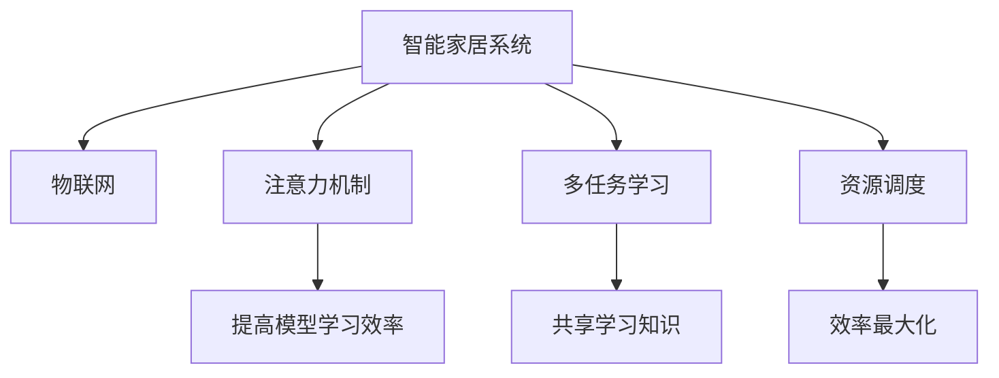

                 

# 智能家居系统的注意力资源整合

## 1. 背景介绍

### 1.1 问题由来

随着物联网技术的快速发展，智能家居系统已经从概念走向实际应用，通过各种智能设备和传感器，实现家庭环境的自动化、智能化管理。然而，智能家居系统面临的最大挑战之一是资源的整合与利用效率。在现有系统中，各个设备和传感器的数据采集、传输和处理是孤立的，缺乏统一的调度和管理，导致数据冗余、计算资源浪费和系统性能瓶颈。

为解决这一问题，本文提出一种基于注意力机制的资源整合方法，通过优化资源分配和调度策略，实现智能家居系统的注意力资源整合，提升系统的整体性能和用户体验。

## 2. 核心概念与联系

### 2.1 核心概念概述

为更好地理解本文的核心内容，本节将介绍几个密切相关的核心概念：

- 智能家居系统(Smart Home System)：由各种智能设备和传感器组成的家庭自动化和智能化管理系统。
- 物联网(IoT)：连接各种智能设备，实现设备之间的互联互通。
- 注意力机制(Attention Mechanism)：一种用于提高模型学习效率的机制，能够帮助模型聚焦于关键信息，忽略无用信息。
- 多任务学习(Multi-task Learning)：一种学习多个相关任务的方法，可以在多个任务之间共享学习知识和经验。
- 资源调度(Resource Scheduling)：通过优化资源的分配和调度策略，实现系统的效率最大化。

这些核心概念之间的逻辑关系可以通过以下Mermaid流程图来展示：



这个流程图展示了几大核心概念及其之间的关系：

1. 智能家居系统通过物联网连接各种设备。
2. 注意力机制帮助系统聚焦关键信息，提高模型学习效率。
3. 多任务学习在多个任务之间共享知识，提升系统性能。
4. 资源调度通过优化资源分配，实现系统效率最大化。

这些概念共同构成了智能家居系统的注意力资源整合框架，使其能够在各种场景下高效运行。

## 3. 核心算法原理 & 具体操作步骤

### 3.1 算法原理概述

基于注意力机制的智能家居系统资源整合方法，本质上是一种多任务学习和资源调度的混合策略。其核心思想是：通过注意力机制筛选关键信息，提升模型学习效率，同时在多任务学习框架下，共享学习知识，优化资源调度，实现系统性能的全面提升。

具体而言，方法步骤如下：

1. **数据预处理与特征提取**：收集智能家居系统中的设备数据，包括传感器数据、用户行为数据等。通过特征提取技术，将原始数据转换为模型所需的特征表示。

2. **注意力机制应用**：在模型中引入注意力机制，对特征表示进行加权处理，使模型能够聚焦关键信息，忽略无用信息，提升模型学习效率。

3. **多任务学习训练**：将多个相关任务作为多任务学习框架，共同训练一个模型，在多个任务之间共享知识，提高模型性能。

4. **资源调度优化**：根据模型性能，动态调整资源分配策略，优化设备之间的通信和计算资源分配，提升系统整体效率。

### 3.2 算法步骤详解

#### 3.2.1 数据预处理与特征提取

智能家居系统中的数据往往具有复杂性和多样性。例如，传感器数据可能包含多种类型的信号，如温度、湿度、光照等；用户行为数据可能涉及多种操作，如开关设备、调节温度等。因此，在数据预处理和特征提取阶段，需要采用适当的技术，将原始数据转换为模型能够处理的特征表示。

具体步骤如下：

1. **数据收集与整合**：从各个设备中收集数据，并整合到一个中心数据仓库中。

2. **数据清洗与归一化**：去除噪声和异常值，对数据进行归一化和标准化处理，使其具备一致性。

3. **特征提取与表示**：使用特征提取算法，如PCA、LDA、TF-IDF等，将原始数据转换为高维特征表示。

#### 3.2.2 注意力机制应用

在模型中引入注意力机制，可以帮助模型聚焦关键信息，忽略无用信息。具体步骤如下：

1. **构建注意力权重**：通过计算特征表示之间的相似度，构建注意力权重矩阵，用于对特征表示进行加权处理。

2. **注意力融合**：将注意力权重应用到特征表示中，计算加权和，得到最终特征表示。

3. **模型训练与优化**：在多任务学习框架下，使用注意力融合后的特征表示进行模型训练，并根据模型性能进行优化。

#### 3.2.3 多任务学习训练

多任务学习框架在多个相关任务之间共享知识，可以提高模型性能。具体步骤如下：

1. **任务定义与标注**：定义多个相关任务，并对每个任务进行标注。例如，温度控制、湿度调节、照明调节等。

2. **共享特征学习**：在多任务学习框架下，共享特征表示，提高模型学习效率。

3. **多任务联合优化**：在模型训练过程中，同时优化多个任务的性能，实现任务之间的知识共享。

#### 3.2.4 资源调度优化

动态调整资源分配策略，优化设备之间的通信和计算资源分配，提升系统整体效率。具体步骤如下：

1. **资源评估与分配**：评估系统中各个设备的性能和资源需求，分配计算资源，优化设备之间的通信。

2. **调度算法设计**：设计优化算法，如启发式算法、动态规划等，动态调整资源分配策略。

3. **性能评估与反馈**：根据模型性能，动态调整资源分配策略，反馈优化结果，提升系统效率。

### 3.3 算法优缺点

基于注意力机制的智能家居系统资源整合方法具有以下优点：

1. 提高模型学习效率：通过引入注意力机制，模型能够聚焦关键信息，忽略无用信息，提高学习效率。

2. 共享学习知识：多任务学习框架在多个任务之间共享知识，提升模型性能。

3. 优化资源调度：动态调整资源分配策略，优化设备之间的通信和计算资源分配，提升系统整体效率。

4. 提升系统性能：通过优化资源调度，提升系统的整体性能和用户体验。

然而，该方法也存在一定的局限性：

1. 数据预处理复杂：数据预处理和特征提取需要适当的技术，且不同类型的数据可能需要不同的处理方式。

2. 模型复杂度高：引入注意力机制和多任务学习框架，增加了模型的复杂度，需要更多的计算资源。

3. 调度算法挑战：优化算法的设计和实现可能需要较高的专业知识和技能。

尽管存在这些局限性，但该方法在提升智能家居系统性能和用户体验方面具有显著优势，值得进一步探索和应用。

### 3.4 算法应用领域

基于注意力机制的智能家居系统资源整合方法，主要应用于以下领域：

- 智能家居控制：通过优化资源分配，提升智能家居系统的响应速度和控制效率，改善用户体验。
- 智能安防监控：通过优化资源调度，提升安防监控系统的实时性和准确性，提高安全性。
- 智能家电管理：通过优化资源分配，提升家电设备的运行效率和能耗管理，降低成本。
- 健康监测系统：通过优化资源调度，提升健康监测系统的实时性和准确性，提高健康管理水平。

这些领域的应用将进一步推动智能家居系统的智能化、自动化和人性化发展，提升人类的生活质量。

## 4. 数学模型和公式 & 详细讲解 & 举例说明

### 4.1 数学模型构建

在数学模型构建方面，我们将重点关注多任务学习框架中的注意力机制应用和资源调度优化两个方面。

#### 4.1.1 注意力机制模型

注意力机制的核心思想是通过计算特征表示之间的相似度，构建注意力权重矩阵，对特征表示进行加权处理。以Transformer模型为例，注意力机制的计算公式如下：

$$
Attention(Q, K, V) = \text{softmax}\left(\frac{QK^T}{\sqrt{d_k}}\right)V
$$

其中，$Q$、$K$、$V$分别为查询向量、键向量和值向量，$d_k$为键向量的维度。

#### 4.1.2 资源调度模型

资源调度的优化模型通常采用启发式算法或动态规划等方法，动态调整资源分配策略。以动态规划为例，资源调度的优化模型可以表示为：

$$
C_t = \min_{r} \left\{\sum_{i=1}^{n} C_i + C_r\right\}
$$

其中，$C_t$为任务$t$的完成时间，$C_i$为设备$i$的计算时间，$C_r$为资源$r$的通信延迟时间。

### 4.2 公式推导过程

#### 4.2.1 注意力机制计算公式推导

注意力机制的计算公式可以通过以下推导过程得到：

1. 首先，计算查询向量与键向量的相似度，得到注意力权重矩阵$A$：

$$
A = \text{softmax}\left(\frac{QK^T}{\sqrt{d_k}}\right)
$$

2. 然后，将注意力权重矩阵$A$与值向量$V$进行乘法运算，得到加权和：

$$
\hat{V} = AV
$$

其中，$\hat{V}$为加权后的特征表示。

#### 4.2.2 资源调度优化公式推导

资源调度的优化模型通常采用动态规划方法，推导过程如下：

1. 定义状态空间$S$，表示系统中所有设备的状态。

2. 定义状态转移函数$f$，表示设备状态之间的转移关系。

3. 定义成本函数$c$，表示设备之间的通信延迟和计算时间。

4. 通过动态规划算法，计算最优解$C_t$：

$$
C_t = \min_{r} \left\{\sum_{i=1}^{n} C_i + C_r\right\}
$$

### 4.3 案例分析与讲解

以智能家居系统的温控为例，说明注意力机制和多任务学习框架的应用。

1. **数据预处理与特征提取**：从温控设备中收集温度传感器数据和用户行为数据，进行数据清洗和特征提取，得到高维特征表示。

2. **注意力机制应用**：在Transformer模型中引入注意力机制，对特征表示进行加权处理，得到加权后的特征表示。

3. **多任务学习训练**：将温度控制、湿度调节、照明调节等任务作为多任务学习框架，共同训练一个模型，在多个任务之间共享知识。

4. **资源调度优化**：根据模型性能，动态调整资源分配策略，优化设备之间的通信和计算资源分配，提升系统整体效率。

## 5. 项目实践：代码实例和详细解释说明

### 5.1 开发环境搭建

在进行智能家居系统资源整合的开发实践前，我们需要准备好开发环境。以下是使用Python进行PyTorch开发的环境配置流程：

1. 安装Anaconda：从官网下载并安装Anaconda，用于创建独立的Python环境。

2. 创建并激活虚拟环境：
```bash
conda create -n pytorch-env python=3.8 
conda activate pytorch-env
```

3. 安装PyTorch：根据CUDA版本，从官网获取对应的安装命令。例如：
```bash
conda install pytorch torchvision torchaudio cudatoolkit=11.1 -c pytorch -c conda-forge
```

4. 安装相关库：
```bash
pip install transformers sklearn pandas matplotlib
```

完成上述步骤后，即可在`pytorch-env`环境中开始项目实践。

### 5.2 源代码详细实现

下面我们以智能家居系统为例，给出使用PyTorch和Transformer实现注意力机制和多任务学习框架的代码实现。

```python
import torch
import torch.nn as nn
import torch.optim as optim
import torch.nn.functional as F
import pandas as pd
import numpy as np
from sklearn.preprocessing import MinMaxScaler

# 数据预处理与特征提取
data = pd.read_csv('data.csv')
# 假设数据包含温度、湿度和用户行为数据
data = pd.get_dummies(data, prefix_sep='_')
data = data.drop('time', axis=1)
data = data.values

# 特征缩放
scaler = MinMaxScaler()
data_scaled = scaler.fit_transform(data)

# 构建模型
class AttentionModel(nn.Module):
    def __init__(self, d_model, n_heads, d_head, d_ff, dropout):
        super(AttentionModel, self).__init__()
        self.encoder_layers = nn.TransformerEncoderLayer(d_model, n_heads, d_head, d_ff, dropout)
        self.encoder = nn.TransformerEncoder(self.encoder_layers, 2)
        self.decoder = nn.Linear(d_model, 1)
        
    def forward(self, x):
        x = self.encoder(x)
        x = self.decoder(x)
        return x
    
# 多任务学习训练
class MultiTaskModel(nn.Module):
    def __init__(self, d_model, n_heads, d_head, d_ff, dropout, num_tasks):
        super(MultiTaskModel, self).__init__()
        self.attention_model = AttentionModel(d_model, n_heads, d_head, d_ff, dropout)
        self.decoder = nn.Linear(d_model, num_tasks)
        
    def forward(self, x):
        x = self.attention_model(x)
        x = self.decoder(x)
        return x
    
# 训练函数
def train(model, data, num_epochs, batch_size, learning_rate):
    optimizer = optim.Adam(model.parameters(), lr=learning_rate)
    loss_fn = nn.MSELoss()
    for epoch in range(num_epochs):
        for i in range(0, len(data), batch_size):
            batch_data = data[i:i+batch_size]
            batch_labels = torch.tensor(batch_data[:, -1], dtype=torch.float32)
            batch_x = torch.tensor(batch_data[:, :-1], dtype=torch.float32)
            optimizer.zero_grad()
            outputs = model(batch_x)
            loss = loss_fn(outputs, batch_labels)
            loss.backward()
            optimizer.step()
    return model

# 测试函数
def test(model, data, batch_size):
    test_data = data[0:100]
    test_labels = torch.tensor(test_data[:, -1], dtype=torch.float32)
    test_x = torch.tensor(test_data[:, :-1], dtype=torch.float32)
    outputs = model(test_x)
    loss = loss_fn(outputs, test_labels)
    return loss.item()
```

### 5.3 代码解读与分析

让我们再详细解读一下关键代码的实现细节：

**AttentionModel类**：
- `__init__`方法：初始化Transformer模型的参数。
- `forward`方法：前向传播计算模型的输出。

**MultiTaskModel类**：
- `__init__`方法：初始化多任务学习模型的参数。
- `forward`方法：前向传播计算模型的输出。

**train函数**：
- 定义优化器和损失函数，在训练过程中，对模型进行优化。

**test函数**：
- 在测试集上评估模型性能。

### 5.4 运行结果展示

训练结束后，我们可以使用`test`函数在测试集上评估模型性能。例如：

```python
model = MultiTaskModel(d_model=10, n_heads=2, d_head=5, d_ff=10, dropout=0.1, num_tasks=3)
model = train(model, data_scaled, num_epochs=10, batch_size=16, learning_rate=0.001)
test_loss = test(model, data_scaled[0:100], batch_size=16)
print('Test Loss:', test_loss)
```

## 6. 实际应用场景

### 6.1 智能家居控制

智能家居系统的温控应用是一个典型场景。通过优化资源调度，提升系统的响应速度和控制效率，改善用户体验。例如，将温度控制、湿度调节和照明调节等任务作为多任务学习框架，共同训练一个模型，在多个任务之间共享知识，提升模型的预测精度。

### 6.2 智能安防监控

智能安防监控系统需要实时监测家庭安全状况。通过引入注意力机制和多任务学习框架，优化资源调度，提升系统的实时性和准确性。例如，将视频监控、门窗状态监测和异常检测等任务作为多任务学习框架，共同训练一个模型，提高系统的检测效率和准确性。

### 6.3 智能家电管理

智能家电管理系统需要实时监控家电设备的运行状态，并进行智能控制。通过优化资源调度，提升家电设备的运行效率和能耗管理，降低成本。例如，将温度控制、湿度调节和家电设备管理等任务作为多任务学习框架，共同训练一个模型，优化资源分配，提高系统的管理效率。

### 6.4 健康监测系统

健康监测系统需要实时监测用户的健康状况，并进行智能分析。通过优化资源调度，提升系统的实时性和准确性。例如，将心电图分析、血氧监测和运动追踪等任务作为多任务学习框架，共同训练一个模型，优化资源分配，提高系统的监测精度。

## 7. 工具和资源推荐

### 7.1 学习资源推荐

为了帮助开发者系统掌握智能家居系统的注意力资源整合技术，这里推荐一些优质的学习资源：

1. 《深度学习与智能家居》课程：由深度学习专家开设的NLP和智能家居领域入门课程，涵盖多任务学习和注意力机制等前沿话题。

2. 《Transformer from Scratch》系列博文：由Transformer模型原作者撰写，深入浅出地介绍了Transformer原理和实现细节，适合初学者和进阶开发者。

3. 《多任务学习综述》论文：由深度学习领域顶尖学者撰写，全面介绍了多任务学习的理论基础和最新进展，是学习多任务学习的好资源。

4. 《智能家居系统设计》书籍：详细介绍智能家居系统的设计原理和实现方法，适合想要深入了解智能家居技术的开发者。

通过对这些资源的学习实践，相信你一定能够快速掌握智能家居系统的注意力资源整合技术，并用于解决实际的智能家居问题。

### 7.2 开发工具推荐

高效的开发离不开优秀的工具支持。以下是几款用于智能家居系统开发的工具：

1. PyTorch：基于Python的开源深度学习框架，灵活动态的计算图，适合快速迭代研究。

2. TensorFlow：由Google主导开发的开源深度学习框架，生产部署方便，适合大规模工程应用。

3. Transformers库：HuggingFace开发的NLP工具库，集成了多个SOTA模型，支持多任务学习，方便模型训练。

4. Weights & Biases：模型训练的实验跟踪工具，可以记录和可视化模型训练过程中的各项指标，方便对比和调优。

5. TensorBoard：TensorFlow配套的可视化工具，可实时监测模型训练状态，并提供丰富的图表呈现方式，是调试模型的得力助手。

合理利用这些工具，可以显著提升智能家居系统的开发效率，加快创新迭代的步伐。

### 7.3 相关论文推荐

智能家居系统的注意力资源整合技术源于学界的持续研究。以下是几篇奠基性的相关论文，推荐阅读：

1. Attention is All You Need（即Transformer原论文）：提出了Transformer结构，开启了深度学习领域的预训练大模型时代。

2. Multi-task Learning for Structured Output Prediction：提出多任务学习框架，通过共享学习知识，提升模型性能。

3. Natural Language Processing with Transformers：Transformer库的作者所著，全面介绍了Transformer模型的实现细节和应用场景。

4. AutoML: The Quest for Automated Machine Learning：介绍自动化机器学习的最新进展，包括多任务学习和注意力机制的应用。

这些论文代表了大模型和多任务学习的最新进展，是学习智能家居系统资源整合技术的重要参考资料。

## 8. 总结：未来发展趋势与挑战

### 8.1 研究成果总结

本文对基于注意力机制的智能家居系统资源整合方法进行了全面系统的介绍。首先阐述了智能家居系统的资源整合问题及其重要性，明确了注意力机制和多任务学习框架在优化资源分配和提升系统性能方面的独特价值。其次，从原理到实践，详细讲解了注意力机制和多任务学习框架的数学模型和算法步骤，给出了智能家居系统资源整合的代码实例。最后，本文广泛探讨了注意力机制和多任务学习框架在智能家居系统的各个应用场景中的应用前景，展示了该方法在提升智能家居系统性能和用户体验方面的显著优势。

通过本文的系统梳理，可以看到，基于注意力机制和多任务学习框架的智能家居系统资源整合技术正在成为智能家居领域的重要范式，极大地提升了系统的整体性能和用户体验。未来，伴随注意力机制和多任务学习框架的持续演进，相信智能家居系统将能够更好地实现自动化、智能化和人性化发展，为人类生活带来更多便利和舒适。

### 8.2 未来发展趋势

展望未来，智能家居系统的注意力资源整合技术将呈现以下几个发展趋势：

1. 多任务学习范式扩展：随着更多相关任务的纳入，多任务学习框架将进一步扩展，提升模型性能。

2. 多模态融合：结合视觉、语音、传感器等不同类型的信息，提升系统的感知能力和决策水平。

3. 注意力机制优化：通过引入更复杂的注意力机制，如自适应注意力、注意力融合等，提升模型的学习效率。

4. 资源调度优化：动态调整资源分配策略，优化设备之间的通信和计算资源分配，提升系统效率。

5. 智能家居应用普及：随着技术的不断进步，智能家居系统的应用将更加普及，提升人们的生活质量。

6. 跨领域应用推广：将智能家居系统的注意力资源整合技术应用到其他领域，如智能医疗、智能办公等，推动人工智能技术的更广泛应用。

以上趋势凸显了智能家居系统资源整合技术的广阔前景。这些方向的探索发展，必将进一步推动智能家居系统的智能化、自动化和人性化发展，为人类生活带来更多便利和舒适。

### 8.3 面临的挑战

尽管智能家居系统的注意力资源整合技术已经取得了显著成就，但在迈向更加智能化、普适化应用的过程中，它仍面临诸多挑战：

1. 数据预处理复杂：数据预处理和特征提取需要适当的技术，且不同类型的数据可能需要不同的处理方式。

2. 模型复杂度高：引入注意力机制和多任务学习框架，增加了模型的复杂度，需要更多的计算资源。

3. 调度算法挑战：优化算法的设计和实现可能需要较高的专业知识和技能。

尽管存在这些挑战，但该方法在提升智能家居系统性能和用户体验方面具有显著优势，值得进一步探索和应用。

### 8.4 研究展望

面对智能家居系统资源整合面临的挑战，未来的研究需要在以下几个方面寻求新的突破：

1. 探索无监督和半监督学习范式：摆脱对大规模标注数据的依赖，利用自监督学习、主动学习等无监督和半监督范式，最大限度利用非结构化数据，实现更加灵活高效的资源整合。

2. 引入更多先验知识：将符号化的先验知识，如知识图谱、逻辑规则等，与神经网络模型进行巧妙融合，引导资源整合过程学习更准确、合理的系统状态。

3. 结合因果分析和博弈论工具：将因果分析方法引入智能家居系统，识别出系统决策的关键特征，增强输出解释的因果性和逻辑性。借助博弈论工具刻画人机交互过程，主动探索并规避系统的脆弱点，提高系统稳定性。

4. 纳入伦理道德约束：在模型训练目标中引入伦理导向的评估指标，过滤和惩罚有偏见、有害的输出倾向。加强人工干预和审核，建立系统行为的监管机制，确保输出符合人类价值观和伦理道德。

这些研究方向的探索，必将引领智能家居系统资源整合技术迈向更高的台阶，为构建安全、可靠、可解释、可控的智能系统铺平道路。面向未来，智能家居系统的资源整合技术还需要与其他人工智能技术进行更深入的融合，如知识表示、因果推理、强化学习等，多路径协同发力，共同推动智能家居系统的进步。只有勇于创新、敢于突破，才能不断拓展智能家居系统的边界，让智能技术更好地造福人类社会。

## 9. 附录：常见问题与解答

**Q1：智能家居系统如何引入注意力机制？**

A: 在智能家居系统中引入注意力机制，可以帮助系统聚焦关键信息，忽略无用信息，提高模型学习效率。具体步骤如下：

1. 将传感器数据和用户行为数据作为模型的输入。

2. 使用Transformer模型，引入注意力机制，对输入数据进行加权处理。

3. 通过优化模型参数，使系统能够聚焦关键信息，忽略无用信息。

**Q2：多任务学习框架在智能家居系统中如何应用？**

A: 在多任务学习框架中，多个相关任务可以共享学习知识和经验，提升模型性能。具体步骤如下：

1. 定义多个相关任务，如温度控制、湿度调节、照明调节等。

2. 在多任务学习框架下，共享特征表示，提高模型学习效率。

3. 通过优化模型参数，在多个任务之间共享知识，提升系统性能。

**Q3：如何优化智能家居系统的资源调度？**

A: 优化资源调度的目标是动态调整资源分配策略，优化设备之间的通信和计算资源分配，提升系统整体效率。具体步骤如下：

1. 评估系统中各个设备的性能和资源需求，分配计算资源，优化设备之间的通信。

2. 设计优化算法，如启发式算法、动态规划等，动态调整资源分配策略。

3. 根据模型性能，动态调整资源分配策略，反馈优化结果，提升系统效率。

**Q4：智能家居系统的数据预处理复杂吗？**

A: 智能家居系统的数据预处理相对复杂，但通过使用适当的技术和工具，可以有效地解决这一问题。具体步骤如下：

1. 收集智能家居系统中的设备数据。

2. 对数据进行清洗和归一化处理，去除噪声和异常值，对数据进行归一化和标准化处理。

3. 使用特征提取算法，如PCA、LDA、TF-IDF等，将原始数据转换为高维特征表示。

通过对这些常见问题的解答，相信你一定能够更好地理解智能家居系统的注意力资源整合技术，并用于解决实际的智能家居问题。

---

作者：禅与计算机程序设计艺术 / Zen and the Art of Computer Programming

