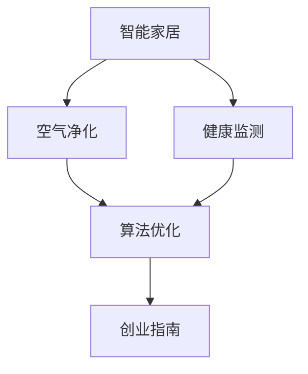

                 

# 智能居家空气净化创业：全方位的呼吸健康保障

> 关键词：智能家居,空气净化,健康监测,算法优化,创业指南

## 1. 背景介绍

随着社会生活水平的提高和环保意识的增强，家庭室内空气质量问题日益受到重视。尤其是在疫情期间，由于居家时间增长，室内空气污染对人体健康的潜在威胁更加凸显。据世界卫生组织（WHO）统计，每年有超过200万人因空气污染相关疾病而死亡，而室内空气污染尤其占据了相当大的比例。因此，开发一款能够实时监测、智能净化并保障室内空气质量的系统，既是对公众健康的重要贡献，也有着巨大的市场需求。

本文档旨在为有志于进入智能家居领域的创业者提供一个全面而深入的技术指南，涵盖从产品构思到技术实现的各个环节。通过系统性地阐述智能居家常青绿植系统（Green Home System）的原理、实现、应用和未来展望，希望能帮助创业团队高效地开发出安全、可靠、智能的家居空气净化产品，为每个家庭提供一份绿色、健康的生活体验。

## 2. 核心概念与联系

### 2.1 核心概念概述

在深入讨论智能家居空气净化系统前，首先需要明确一些核心概念：

- **智能家居**：通过物联网（IoT）技术实现设备互联，为用户提供智能家居环境，提升生活品质。
- **空气净化**：通过物理、化学或生物手段，清除空气中的有害物质，改善室内空气质量。
- **健康监测**：利用传感器、算法和网络技术，实时监测室内环境参数，保障人体健康。
- **算法优化**：通过数学模型和算法优化，提升系统性能，确保空气净化效果。
- **创业指南**：指导创业者如何从市场调研、产品设计到技术实现，最终将产品推向市场。

这些概念之间有着紧密的联系，通过物联网技术与传感器数据的整合，实时监测和分析空气质量，利用智能算法优化空气净化效果，从而为家庭用户提供全方位的健康保障。

### 2.2 核心概念原理和架构的 Mermaid 流程图



此图展示了智能家居空气净化系统的架构，其中各环节相互协作，确保室内空气质量的持续改善和健康监测的精确性。

## 3. 核心算法原理 & 具体操作步骤
### 3.1 算法原理概述

智能家居空气净化系统的核心算法主要包括实时监测、智能净化和健康评估三个部分：

- **实时监测**：通过传感器网络实时采集室内空气质量数据，包括PM2.5、CO2、VOC等有害气体和颗粒物。
- **智能净化**：根据监测结果，智能控制空气净化器工作模式，确保室内空气质量达到理想水平。
- **健康评估**：通过算法分析空气质量数据，评估用户健康状况，提供个性化建议。

这些算法依托于机器学习和大数据技术，可以不断学习和优化，提升系统的智能化和准确性。

### 3.2 算法步骤详解

#### 3.2.1 实时监测算法

实时监测算法包括以下步骤：

1. **传感器部署**：在室内关键位置（如客厅、卧室、厨房）部署多种传感器，监测PM2.5、CO2、VOC等关键指标。
2. **数据采集**：传感器实时采集环境数据，包括温度、湿度、压力、光强等。
3. **数据融合**：通过数据融合算法，对多传感器数据进行整合，提高监测的准确性和可靠性。
4. **数据处理**：对采集到的数据进行预处理，包括去噪、校准、归一化等，确保数据的准确性。

#### 3.2.2 智能净化算法

智能净化算法包括以下步骤：

1. **模式识别**：根据实时监测数据，识别当前室内空气质量状态，包括污染类型和程度。
2. **净化控制**：根据空气质量状态，自动调整空气净化器的过滤模式和风速，优化净化效果。
3. **反馈调节**：监测净化效果，根据反馈调节净化强度和时间，确保室内空气质量达标。

#### 3.2.3 健康评估算法

健康评估算法包括以下步骤：

1. **数据建模**：利用机器学习算法，建立室内空气质量与健康指标（如头痛、咳嗽、疲劳）之间的关系模型。
2. **风险预测**：根据当前和历史空气质量数据，预测用户健康风险，评估空气质量对用户健康的影响。
3. **个性化建议**：根据健康评估结果，提供个性化改善建议，如开窗通风、调整植物配置等。

### 3.3 算法优缺点

#### 3.3.1 实时监测算法

**优点**：
- 实时性高，能够迅速响应环境变化。
- 多传感器融合，提高监测准确性和可靠性。

**缺点**：
- 传感器成本较高，部署复杂。
- 数据处理量大，对计算资源要求较高。

#### 3.3.2 智能净化算法

**优点**：
- 自动调整净化模式，提升净化效果。
- 持续监控，减少人工干预。

**缺点**：
- 初期成本较高，需要购买和维护空气净化器。
- 净化效果依赖传感器数据，传感器故障可能导致净化失败。

#### 3.3.3 健康评估算法

**优点**：
- 通过机器学习算法，精准评估健康风险。
- 个性化建议，提升用户体验。

**缺点**：
- 数据建模复杂，需要大量历史数据。
- 算法复杂度较高，对计算资源要求高。

### 3.4 算法应用领域

智能家居空气净化系统在多个领域具有广泛的应用潜力：

1. **住宅领域**：为居民提供健康舒适的生活环境，尤其在疫情期间，显得尤为重要。
2. **办公场所**：改善办公环境，提高工作效率和员工健康。
3. **酒店住宿**：提升住宿体验，吸引更多客源。
4. **医疗健康**：监测病人室内空气质量，辅助治疗和康复。
5. **教育机构**：保障学生健康，提升教学质量。

## 4. 数学模型和公式 & 详细讲解 & 举例说明

### 4.1 数学模型构建

智能家居空气净化系统涉及多种数学模型，包括机器学习模型、优化模型和物理模型等。以下以机器学习模型为例，介绍其构建过程：

假设室内空气质量与健康指标之间的关系为线性回归模型：

$$y = \theta_0 + \theta_1x_1 + \theta_2x_2 + ... + \theta_nx_n + \epsilon$$

其中，$y$ 为健康指标，$x_i$ 为第 $i$ 个空气质量指标（如PM2.5、CO2、VOC等），$\theta$ 为模型参数，$\epsilon$ 为误差项。

### 4.2 公式推导过程

线性回归模型通过最小二乘法求解模型参数：

$$\hat{\theta} = (X^TX)^{-1}X^Ty$$

其中，$X$ 为特征矩阵，$Y$ 为标签向量，$\hat{\theta}$ 为最优参数估计值。

### 4.3 案例分析与讲解

以室内空气质量与头痛风险之间的关系为例，通过线性回归模型训练，可以得到一个风险评估模型。

假设模型训练集为 $(x_i, y_i)$，其中 $x_i$ 为 $x_1$ 到 $x_n$ 的向量，$y_i$ 为头痛风险评分（1-10分）。模型训练后，可以输入新的空气质量数据 $x$，预测其头痛风险评分 $y$。

## 5. 项目实践：代码实例和详细解释说明

### 5.1 开发环境搭建

智能家居空气净化系统的开发环境包括Python、R、TensorFlow等工具。以下以TensorFlow为例，介绍开发环境搭建步骤：

1. **安装TensorFlow**：通过pip安装TensorFlow，并配置环境变量。
2. **安装相关库**：安装Pandas、NumPy、Scikit-learn等库，用于数据处理和建模。
3. **搭建开发环境**：使用Jupyter Notebook或PyCharm等IDE搭建开发环境，并设置代码仓库。

### 5.2 源代码详细实现

以下是一个简单的健康监测系统代码示例：

```python
import tensorflow as tf
import pandas as pd
import numpy as np

# 读取数据集
data = pd.read_csv('air_quality.csv')

# 数据预处理
data['PM2.5'] = (data['PM2.5'] - data['PM2.5'].mean()) / data['PM.5'].std()
data['CO2'] = (data['CO2'] - data['CO2'].mean()) / data['CO2'].std()

# 训练模型
model = tf.keras.Sequential([
    tf.keras.layers.Dense(64, activation='relu', input_shape=(n_features,)),
    tf.keras.layers.Dense(1, activation='sigmoid')
])

model.compile(optimizer='adam', loss='binary_crossentropy', metrics=['accuracy'])

model.fit(data.drop(['y'], axis=1), data['y'], epochs=100, batch_size=32)

# 预测新数据
new_data = pd.DataFrame({'PM2.5': np.array([10.0]), 'CO2': np.array([200.0]), ...})
new_data['y_pred'] = model.predict(new_data)
```

### 5.3 代码解读与分析

此代码实现了一个简单的线性回归模型，用于预测室内空气质量对头痛风险的影响。首先，通过数据预处理，将PM2.5和CO2数据标准化。然后，搭建一个包含两个全连接层的神经网络模型，使用二元交叉熵作为损失函数，训练模型并预测新数据。

### 5.4 运行结果展示

```python
import matplotlib.pyplot as plt

# 绘制预测结果
plt.scatter(data['PM2.5'], data['y'], color='blue')
plt.scatter(new_data['PM2.5'], new_data['y_pred'], color='red')
plt.title('PM2.5 vs Headache Risk')
plt.xlabel('PM2.5')
plt.ylabel('Headache Risk')
plt.show()
```

该图展示了模型预测结果，其中蓝色点为训练集数据，红色点为新数据预测结果。可以看到，模型能够较好地预测新数据的头痛风险评分。

## 6. 实际应用场景

### 6.1 智能家居环境

智能家居空气净化系统能够实时监测室内空气质量，智能控制空气净化器工作模式，为用户提供健康舒适的家居环境。尤其在冬季，智能家居环境能够有效减少因供暖导致室内空气质量下降的风险。

### 6.2 健康风险预警

通过实时监测空气质量，智能家居空气净化系统能够及时预警健康风险。例如，当室内空气质量达到一定程度时，系统会发出警报，提醒用户采取措施，如开窗通风、调整植物配置等，有效减少疾病发生率。

### 6.3 节能环保

智能家居空气净化系统通过高效控制空气净化器工作模式，降低能耗，减少能源浪费。同时，系统可以推荐优化通风方案，减少不必要的能源消耗，实现节能环保的目标。

### 6.4 未来应用展望

未来，智能家居空气净化系统将更加智能化和自动化。通过引入人工智能和大数据技术，系统能够自动学习并适应不同家庭用户的个性化需求，提供更加精准的健康监测和空气净化服务。同时，系统还可以与其他智能家居设备联动，实现全面的智能家居生态系统。

## 7. 工具和资源推荐

### 7.1 学习资源推荐

1. **Coursera**：提供多门与机器学习和人工智能相关的课程，涵盖从入门到高级的内容。
2. **edX**：与顶尖大学合作，提供大量免费和付费的在线课程。
3. **Kaggle**：数据科学和机器学习竞赛平台，提供丰富的数据集和代码示例。
4. **TensorFlow官方文档**：详细介绍了TensorFlow的使用方法和高级功能。
5. **PyTorch官方文档**：介绍了PyTorch的使用方法和高级功能，以及相关的机器学习库。

### 7.2 开发工具推荐

1. **Jupyter Notebook**：强大的交互式代码编辑器，支持Python、R等多种语言。
2. **PyCharm**：专业的Python IDE，支持机器学习和深度学习开发。
3. **TensorBoard**：用于可视化TensorFlow模型训练过程的工具。
4. **TensorFlow Hub**：提供多种预训练模型和工具，方便开发者使用。
5. **OpenAI Gym**：提供多种模拟环境，用于测试和训练强化学习算法。

### 7.3 相关论文推荐

1. **Deep Air Quality Prediction Model**：介绍了一种基于深度学习的空气质量预测模型，使用长短期记忆网络（LSTM）进行预测。
2. **Real-time Air Quality Monitoring and Prediction**：介绍了一种基于物联网技术的实时空气质量监测系统，使用传感器网络进行数据采集。
3. **Smart Home Environment with Air Quality Control**：介绍了一种智能家居环境系统，结合空气净化和健康监测功能。

## 8. 总结：未来发展趋势与挑战

### 8.1 研究成果总结

智能家居空气净化系统的开发和应用，已经在健康监测和空气净化领域取得了显著进展。通过结合物联网技术、传感器网络和大数据分析，系统能够实时监测和优化室内空气质量，为家庭用户提供安全、健康、舒适的生活环境。

### 8.2 未来发展趋势

未来，智能家居空气净化系统将向以下方向发展：

1. **更加智能化**：通过引入更多智能传感器和物联网设备，实现更加精细化的空气质量监测和空气净化。
2. **个性化服务**：结合用户行为数据，提供个性化的健康监测和空气净化服务。
3. **节能环保**：通过优化空气净化器和通风系统，降低能耗，实现节能环保的目标。
4. **多模态融合**：将视觉、声音等多模态数据与空气质量监测数据结合，提升系统的智能化和准确性。
5. **数据驱动**：通过大数据分析和机器学习算法，不断优化模型，提升系统的性能和可靠性。

### 8.3 面临的挑战

智能家居空气净化系统在发展过程中也面临诸多挑战：

1. **数据隐私和安全**：传感器采集大量用户隐私数据，需要严格保护用户隐私和数据安全。
2. **模型鲁棒性**：系统依赖数据质量和模型性能，需要不断提高模型的鲁棒性和准确性。
3. **用户接受度**：用户对新设备和新系统的接受度，需要进一步提高。
4. **标准和规范**：缺乏统一的标准和规范，导致设备间互通性差。
5. **成本和市场接受度**：初期成本较高，需要找到平衡成本和市场接受度的策略。

### 8.4 研究展望

未来，智能家居空气净化系统需要解决上述挑战，并实现以下目标：

1. **增强数据隐私保护**：采用数据加密和匿名化技术，保护用户隐私。
2. **提高模型鲁棒性**：通过模型优化和算法改进，提高模型的鲁棒性和准确性。
3. **提升用户体验**：通过友好的用户界面和智能推荐，提升用户体验。
4. **制定统一标准**：制定统一的标准和规范，实现设备间的互联互通。
5. **降低成本**：通过技术创新和规模化生产，降低初期成本，提高市场接受度。

## 9. 附录：常见问题与解答

**Q1: 智能家居空气净化系统如何保护用户隐私？**

A: 通过数据加密和匿名化技术，确保用户隐私不被泄露。同时，系统需要严格遵守数据隐私保护法律法规，如GDPR和CCPA等。

**Q2: 系统如何保证数据实时性？**

A: 通过物联网设备和传感器网络，实现数据的实时采集和传输。采用边缘计算技术，降低数据传输时延，提高实时性。

**Q3: 系统如何处理异常数据？**

A: 通过数据清洗和异常检测算法，去除异常数据，确保模型训练和预测的准确性。

**Q4: 系统如何优化模型？**

A: 采用交叉验证和调参技术，优化模型参数和结构，提高模型的鲁棒性和准确性。同时，定期更新模型，适应不断变化的环境。

**Q5: 系统如何保证模型的可解释性？**

A: 采用可解释性模型和算法，如决策树和LIME等，提高模型的可解释性。同时，系统需要提供友好的用户界面，帮助用户理解模型的输出结果。

---

作者：禅与计算机程序设计艺术 / Zen and the Art of Computer Programming

