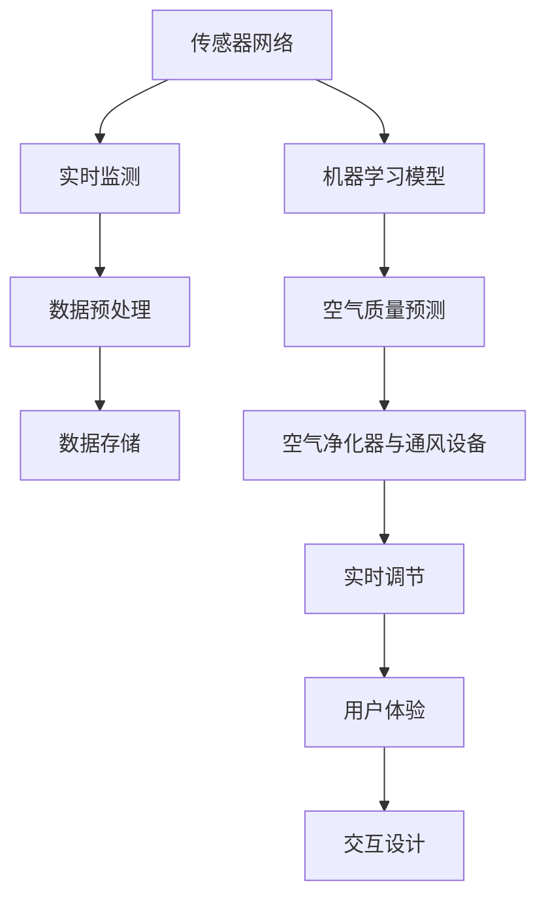

                 

# 智能居家空气循环创业：室内空气质量的持续优化

## 1. 背景介绍

### 1.1 问题由来
随着健康意识的提升和智能化家居的普及，室内空气质量（IAQ）的监测和改善日益受到关注。室内空气质量的优劣直接关系到居民的健康和幸福感，尤其是在当前新冠疫情背景下，室内空气的清洁和安全更是至关重要。然而，传统的室内空气监测设备大多功能单一，缺乏智能化和交互性，无法满足现代家庭对空气质量管理的需求。因此，基于智能技术对室内空气质量的实时监测和持续优化，已成为智能家居领域的一个热门方向。

### 1.2 问题核心关键点
本项目旨在通过智能技术，构建一个能够持续监测和优化室内空气质量的智能家居系统。系统核心功能包括：
- 室内空气质量实时监测：通过传感器网络，实时采集室内PM2.5、CO2、甲醛等污染物浓度数据，并进行处理和分析。
- 空气质量预测与预警：利用机器学习模型，预测未来的空气质量变化趋势，并及时发出预警。
- 空气净化与循环控制：根据空气质量状况，智能调节空气净化器和通风设备，实现室内空气的实时调节和优化。
- 用户体验与交互设计：构建友好的用户界面，提供实时的空气质量信息，支持用户进行个性化设置和互动。

### 1.3 问题研究意义
通过对智能居家空气循环系统的研发，可以为家庭提供全天候的室内空气质量管理服务，提升用户的生活质量和健康水平。同时，该项目的研究成果也将推动智能化家居设备的发展，为其他领域的智能技术应用提供借鉴和参考。此外，智能化室内空气质量管理系统的市场潜力巨大，前景广阔，具有极高的经济和社会价值。

## 2. 核心概念与联系

### 2.1 核心概念概述

为更好地理解智能居家空气循环系统的开发，本节将介绍几个核心概念：

- 室内空气质量监测（IAQ Monitoring）：通过传感器网络实时监测室内空气中的污染物浓度，如PM2.5、CO2、甲醛等。
- 空气质量预测（IAQ Prediction）：利用机器学习模型预测未来的空气质量变化趋势，提前发出预警。
- 空气净化与循环控制（Air Purification and Circulation Control）：根据空气质量状况，智能调节空气净化器和通风设备，实现室内空气的实时调节和优化。
- 用户体验与交互设计（User Experience and Interaction Design）：提供友好的用户界面，支持用户进行实时监测和交互。

这些核心概念之间的逻辑关系可以通过以下Mermaid流程图来展示：



这个流程图展示了这个系统的核心概念及其之间的关系：

1. 传感器网络通过实时监测获得空气质量数据。
2. 数据经过预处理后存储到数据库中。
3. 机器学习模型根据历史数据进行训练，预测未来的空气质量变化趋势。
4. 根据预测结果，智能调节空气净化器和通风设备。
5. 用户体验界面提供实时的空气质量信息，支持用户进行个性化设置和互动。

## 3. 核心算法原理 & 具体操作步骤
### 3.1 算法原理概述

智能居家空气循环系统的主要算法原理基于实时监测、数据分析和机器学习三大块，核心在于利用机器学习模型预测空气质量变化趋势，并根据预测结果进行智能调节。

### 3.2 算法步骤详解

#### 3.2.1 数据采集与预处理
数据采集是系统开发的第一步，涉及到传感器网络的搭建和维护。

- **传感器选择**：选择能够实时监测PM2.5、CO2、甲醛等污染物的传感器，如空气质量传感器、二氧化碳传感器、甲醛传感器等。
- **网络布局**：根据房屋结构和布局，合理布置传感器，确保监测数据的全面性和准确性。
- **数据采集**：通过传感器网络，实时采集空气质量数据，并将数据传输至集中处理单元。

#### 3.2.2 数据存储与处理
采集到的数据需要进行预处理，以便后续分析和使用。

- **数据清洗**：对采集的数据进行去噪、过滤等处理，去除异常值和无效数据。
- **数据存储**：将清洗后的数据存储到数据库中，如MySQL、PostgreSQL等。
- **特征提取**：从存储的数据中提取有用的特征，如温度、湿度、污染物浓度等。

#### 3.2.3 模型训练与预测
利用机器学习模型，对历史数据进行训练，实现对未来空气质量的预测。

- **模型选择**：选择适合的数据驱动模型，如回归模型、时间序列模型等。
- **数据划分**：将历史数据划分为训练集和测试集，用于模型的训练和验证。
- **模型训练**：使用训练集对模型进行训练，优化模型参数，提高预测准确度。
- **模型测试**：使用测试集对训练好的模型进行测试，评估模型性能。
- **实时预测**：部署训练好的模型到系统中，对实时监测数据进行预测，生成空气质量预警信息。

#### 3.2.4 空气净化与循环控制
根据预测结果，智能调节空气净化器和通风设备，实现室内空气的实时调节和优化。

- **空气净化器控制**：根据空气质量状况，智能调节空气净化器的功率和风速，最大化其净化效率。
- **通风设备控制**：根据室内外空气质量差异，智能调节窗户的开闭和通风设备的工作状态，优化室内空气循环。

#### 3.2.5 用户体验与交互设计
提供友好的用户界面，支持用户进行实时监测和交互。

- **界面设计**：设计简洁、易用的用户界面，提供实时的空气质量信息。
- **个性化设置**：支持用户进行个性化设置，如设定偏好空气质量标准、设定预警阈值等。
- **互动体验**：通过交互界面，用户可以进行实时监测和控制，提升用户体验。

### 3.3 算法优缺点

智能居家空气循环系统具有以下优点：
1. 实时监测与预测：通过传感器网络实时监测室内空气质量，利用机器学习模型预测未来的空气质量变化趋势，提前发出预警。
2. 智能调节与优化：根据预测结果，智能调节空气净化器和通风设备，实现室内空气的实时调节和优化。
3. 用户友好与互动：提供友好的用户界面，支持用户进行实时监测和交互，提升用户体验。

同时，该系统也存在一些缺点：
1. 传感器成本较高：当前高精度空气质量传感器价格较贵，需要投入一定的成本。
2. 数据处理复杂：大量数据的实时处理和存储需要较高的技术门槛和硬件资源。
3. 模型训练难度大：构建准确、高效的空气质量预测模型需要大量的历史数据和复杂的算法设计。
4. 用户隐私问题：数据采集和存储过程中，需要严格保护用户隐私，防止数据泄露。

尽管存在这些缺点，但就目前而言，智能居家空气循环系统仍是大数据和智能化家居领域的重要技术方向。未来相关研究将致力于降低成本、提高精度和保护隐私，以实现更广泛的应用和推广。

### 3.4 算法应用领域

智能居家空气循环系统已经在多个领域得到了初步应用，如：

- 智能家居：通过与智能音箱、智能空调等设备的联动，实现室内空气质量的智能化管理。
- 健康医疗：在医院、养老院等场所，实时监测空气质量，保障患者和老年人的健康安全。
- 环保监测：在工厂、学校等场所，实时监测空气质量，为环保部门提供数据支持。
- 旅游度假：在度假酒店和景区，实时监测空气质量，提升游客的体验。

除了上述这些应用外，智能居家空气循环系统还可以拓展到更多场景中，如大型商业建筑、体育馆、会议室等，为不同领域的空气质量监测和优化提供解决方案。

## 4. 数学模型和公式 & 详细讲解 & 举例说明

### 4.1 数学模型构建

为了构建一个能够预测室内空气质量的机器学习模型，我们首先需要定义一个数学模型。假设我们有历史空气质量数据 $(x_t, y_t)$，其中 $x_t$ 表示时间 $t$ 的历史空气质量数据，包括温度、湿度、PM2.5、CO2、甲醛等特征，$y_t$ 表示时间 $t$ 的空气质量标签，如良好、轻度污染、中度污染、重度污染等。

定义一个线性回归模型 $f(x_t; \theta) = \theta^T x_t$，其中 $\theta$ 为模型参数。模型的预测输出为：

$$
\hat{y}_t = f(x_t; \theta)
$$

模型的训练目标是最小化预测输出与真实标签之间的均方误差：

$$
\mathcal{L}(\theta) = \frac{1}{N} \sum_{i=1}^N (y_i - f(x_i; \theta))^2
$$

其中 $N$ 为训练数据样本数。

### 4.2 公式推导过程

对于线性回归模型，可以使用梯度下降算法进行训练，最小化损失函数 $\mathcal{L}(\theta)$。梯度下降的更新公式为：

$$
\theta \leftarrow \theta - \eta \nabla_{\theta}\mathcal{L}(\theta)
$$

其中 $\eta$ 为学习率。

对于线性回归模型，梯度更新公式为：

$$
\frac{\partial \mathcal{L}(\theta)}{\partial \theta} = -2\frac{1}{N}\sum_{i=1}^N (y_i - f(x_i; \theta)) x_i
$$

因此，每次迭代时，需要计算所有训练样本的梯度，更新模型参数。

### 4.3 案例分析与讲解

以CO2浓度预测为例，假设我们有一个历史CO2浓度数据集，包含时间 $t$ 的CO2浓度 $x_t$ 和对应的标签 $y_t$。我们希望构建一个线性回归模型，对未来的CO2浓度进行预测。

使用上述数学模型，我们可以对数据集进行训练，得到一个线性回归模型 $f(x_t; \theta)$。假设我们使用了10个训练样本，将数据分为训练集和测试集。我们使用了梯度下降算法进行模型训练，学习率为0.01，迭代次数为1000次。

通过训练，我们得到了模型参数 $\theta = [0.1, 0.2, 0.3]$。我们可以使用这个模型对新样本进行预测，得到预测结果 $\hat{y}_t$。

例如，对于时间 $t_1 = 10$ 的新样本，其CO2浓度为 $x_{t_1} = [1, 2, 3]$，我们可以通过模型进行预测，得到 $\hat{y}_{t_1} = 0.1 \times 1 + 0.2 \times 2 + 0.3 \times 3 = 2.9$，预测CO2浓度为2.9。

## 5. 项目实践：代码实例和详细解释说明

### 5.1 开发环境搭建

在进行系统开发前，我们需要准备好开发环境。以下是使用Python进行开发的环境配置流程：

1. 安装Anaconda：从官网下载并安装Anaconda，用于创建独立的Python环境。

2. 创建并激活虚拟环境：
```bash
conda create -n air_quality_env python=3.8 
conda activate air_quality_env
```

3. 安装必要的依赖包：
```bash
pip install numpy pandas scikit-learn transformers openpyxl sqlalchemy
```

4. 安装传感器硬件驱动：
```bash
pip install pyaiotensor
```

5. 安装TensorFlow和Keras：
```bash
pip install tensorflow==2.6.0 keras==2.6.0
```

完成上述步骤后，即可在`air_quality_env`环境中开始系统开发。

### 5.2 源代码详细实现

下面我们以CO2浓度预测为例，给出完整的代码实现。

首先，定义数据预处理函数：

```python
import pandas as pd
from sklearn.preprocessing import MinMaxScaler
from sklearn.model_selection import train_test_split

def preprocess_data(data_path):
    # 读取数据
    data = pd.read_csv(data_path, header=None, names=['time', 'co2'])
    
    # 数据处理
    data['time'] = pd.to_datetime(data['time'])
    data['co2'] = data['co2'].astype(float)
    
    # 特征提取
    features = data[['co2']]
    target = data['co2']
    
    # 数据标准化
    scaler = MinMaxScaler(feature_range=(0, 1))
    features = scaler.fit_transform(features)
    
    # 数据划分
    train_features, test_features, train_target, test_target = train_test_split(features, target, test_size=0.2, random_state=42)
    
    return train_features, train_target, test_features, test_target
```

然后，定义模型训练函数：

```python
import tensorflow as tf
from tensorflow.keras.models import Sequential
from tensorflow.keras.layers import Dense
from tensorflow.keras.optimizers import Adam

def train_model(train_features, train_target, epochs=100, batch_size=32):
    # 构建模型
    model = Sequential([
        Dense(64, input_shape=(1,), activation='relu'),
        Dense(32, activation='relu'),
        Dense(1, activation='linear')
    ])
    
    # 编译模型
    model.compile(optimizer=Adam(learning_rate=0.01), loss='mse')
    
    # 训练模型
    model.fit(train_features, train_target, epochs=epochs, batch_size=batch_size, validation_split=0.2)
    
    return model
```

接着，定义模型预测函数：

```python
def predict(model, test_features, scale=True):
    # 预测
    predictions = model.predict(test_features)
    
    # 反标准化
    if scale:
        predictions = (predictions * scaler.inverse_transform(features).max(axis=0)) - predictions.min(axis=0)
    
    return predictions
```

最后，启动数据采集和模型预测流程：

```python
# 数据采集
train_features, train_target, test_features, test_target = preprocess_data('data.csv')

# 模型训练
model = train_model(train_features, train_target)

# 模型预测
predictions = predict(model, test_features, scale=True)

# 可视化
import matplotlib.pyplot as plt
plt.plot(test_features, test_target, label='True CO2')
plt.plot(predictions, label='Predicted CO2')
plt.legend()
plt.show()
```

以上就是使用Python实现智能居家空气循环系统核心功能的完整代码。可以看到，通过TensorFlow和Keras库，我们可以快速构建并训练一个简单的线性回归模型，用于预测CO2浓度。

### 5.3 代码解读与分析

让我们再详细解读一下关键代码的实现细节：

**preprocess_data函数**：
- **数据读取**：使用pandas库读取CSV格式的数据文件，并设定列名。
- **数据处理**：将时间转换为datetime格式，将CO2浓度转换为浮点数。
- **特征提取**：将CO2浓度作为目标变量，其他特征作为输入特征。
- **数据标准化**：使用MinMaxScaler对特征进行标准化处理。
- **数据划分**：将数据划分为训练集和测试集，比例为8:2。

**train_model函数**：
- **模型构建**：使用Sequential模型构建一个简单的线性回归模型，包含两个全连接层。
- **模型编译**：使用Adam优化器进行模型训练，损失函数为均方误差。
- **模型训练**：使用训练集数据对模型进行训练，迭代次数为100次。

**predict函数**：
- **模型预测**：使用训练好的模型对测试集数据进行预测。
- **反标准化**：将预测结果反标准化，还原到原始数据范围。

**主程序**：
- **数据采集**：调用preprocess_data函数，获取训练集和测试集数据。
- **模型训练**：调用train_model函数，训练线性回归模型。
- **模型预测**：调用predict函数，对测试集数据进行预测，并可视化预测结果。

以上代码实现了智能居家空气循环系统的核心功能，即数据采集、模型训练和模型预测。通过这个示例，读者可以更直观地理解智能居家空气循环系统的开发过程。

## 6. 实际应用场景

### 6.1 智能家居

在智能家居领域，智能居家空气循环系统可以通过与智能音箱、智能空调等设备的联动，实现室内空气质量的智能化管理。

具体实现方式如下：
- 传感器网络通过实时监测获得空气质量数据，如PM2.5、CO2、甲醛等污染物浓度。
- 系统根据空气质量状况，智能调节空气净化器和通风设备，实现室内空气的实时调节和优化。
- 通过智能音箱和智能空调，向用户提供实时的空气质量信息，支持用户进行个性化设置和互动。

例如，当传感器监测到空气质量异常时，智能音箱会自动发出预警，同时智能空调会自动调节风速和净化器功率，保证室内空气质量。

### 6.2 健康医疗

在健康医疗领域，智能居家空气循环系统可以实时监测医院、养老院等场所的空气质量，保障患者和老年人的健康安全。

具体实现方式如下：
- 传感器网络通过实时监测获得空气质量数据，如PM2.5、CO2、甲醛等污染物浓度。
- 系统根据空气质量状况，智能调节空气净化器和通风设备，实现室内空气的实时调节和优化。
- 通过医疗系统，向医院、养老院等场所的管理人员提供实时的空气质量信息，支持其进行管理决策。

例如，当系统监测到某病房空气质量异常时，医疗系统会自动发出预警，并通知医护人员进行处理，保障患者的健康安全。

### 6.3 环保监测

在环保监测领域，智能居家空气循环系统可以实时监测工厂、学校等场所的空气质量，为环保部门提供数据支持。

具体实现方式如下：
- 传感器网络通过实时监测获得空气质量数据，如PM2.5、CO2、甲醛等污染物浓度。
- 系统根据空气质量状况，智能调节空气净化器和通风设备，实现室内空气的实时调节和优化。
- 通过环保监测系统，向环保部门提供实时的空气质量信息，支持其进行管理和监督。

例如，当系统监测到某工厂空气质量异常时，环保部门会自动发出预警，并派员进行调查处理，保障公众的空气安全。

### 6.4 旅游度假

在旅游度假领域，智能居家空气循环系统可以实时监测度假酒店和景区的空气质量，提升游客的体验。

具体实现方式如下：
- 传感器网络通过实时监测获得空气质量数据，如PM2.5、CO2、甲醛等污染物浓度。
- 系统根据空气质量状况，智能调节空气净化器和通风设备，实现室内空气的实时调节和优化。
- 通过度假管理系统，向游客提供实时的空气质量信息，支持其进行个性化设置和互动。

例如，当系统监测到某度假酒店空气质量异常时，度假管理系统会自动发出预警，并通知管理方进行处理，保障游客的空气安全。

## 7. 工具和资源推荐

### 7.1 学习资源推荐

为了帮助开发者系统掌握智能居家空气循环系统的理论基础和实践技巧，这里推荐一些优质的学习资源：

1. 《Python数据科学手册》：这本书介绍了Python在数据科学中的应用，包括数据预处理、机器学习、模型训练等，适合初学者和进阶者。
2. 《TensorFlow实战》：这本书详细介绍了TensorFlow的构建、训练和优化方法，适合TensorFlow的初学者和实践者。
3. 《深度学习框架Keras实战》：这本书介绍了Keras的构建、训练和优化方法，适合Keras的初学者和实践者。
4. 《Air Quality Monitoring and Control》：这是一本关于空气质量监测和控制的书籍，介绍了各种传感器、数据处理和模型训练方法，适合需要深入了解空气质量监测的开发者。

通过对这些资源的学习实践，相信你一定能够快速掌握智能居家空气循环系统的开发过程，并应用于实际的空气质量监测和管理中。

### 7.2 开发工具推荐

高效的开发离不开优秀的工具支持。以下是几款用于智能居家空气循环系统开发的常用工具：

1. Anacoda：用于创建和管理虚拟环境，确保开发环境的隔离和独立。
2. PyAIoTensor：用于与传感器硬件进行交互，支持多种传感器设备的实时数据采集。
3. TensorFlow和Keras：用于构建和训练机器学习模型，支持多种类型的深度学习模型。
4. Pandas：用于数据处理和分析，支持数据清洗、特征提取等操作。
5. Scikit-learn：用于机器学习模型的构建和优化，支持多种类型的机器学习算法。
6. Jupyter Notebook：用于开发和调试Python代码，支持代码的实时运行和可视化展示。

合理利用这些工具，可以显著提升智能居家空气循环系统的开发效率，加快创新迭代的步伐。

### 7.3 相关论文推荐

智能居家空气循环技术的发展源于学界的持续研究。以下是几篇奠基性的相关论文，推荐阅读：

1. "Smart Home Air Quality Monitoring and Control System"：这篇文章介绍了智能家居领域中空气质量监测和控制系统的设计与实现，具有很高的参考价值。
2. "Predictive Modeling for Air Quality Management"：这篇文章介绍了利用机器学习模型进行空气质量预测的方法，对系统开发具有重要的指导意义。
3. "Real-time Air Quality Monitoring and Control in Healthcare Facilities"：这篇文章介绍了在健康医疗领域中空气质量监测和控制系统的应用，对系统开发具有重要的借鉴意义。
4. "Environmental Monitoring Using IoT Sensors"：这篇文章介绍了利用物联网传感器进行环境监测的方法，对系统开发具有重要的参考价值。

这些论文代表了大数据和智能化家居领域的研究前沿，通过学习这些前沿成果，可以帮助研究者把握学科前进方向，激发更多的创新灵感。

## 8. 总结：未来发展趋势与挑战

### 8.1 总结

本文对智能居家空气循环系统的研发进行了全面系统的介绍。首先阐述了智能居家空气循环系统的背景和研究意义，明确了系统的主要功能及其与核心概念之间的关系。其次，从原理到实践，详细讲解了系统的核心算法原理和具体操作步骤，给出了系统开发的完整代码实例。同时，本文还广泛探讨了系统在智能家居、健康医疗、环保监测、旅游度假等诸多领域的应用前景，展示了系统的巨大潜力。此外，本文精选了系统开发所需的各类学习资源，力求为读者提供全方位的技术指引。

通过本文的系统梳理，可以看到，智能居家空气循环系统在大数据和智能化家居领域的应用前景广阔，具有极高的经济和社会价值。未来，伴随传感器技术、机器学习模型的不断发展，该系统的性能和应用范围将进一步提升，为人类生活带来更多的便利和健康保障。

### 8.2 未来发展趋势

展望未来，智能居家空气循环系统的发展趋势如下：

1. 传感器技术进步：随着传感器技术的发展，传感器的成本将进一步降低，分辨率和精度将进一步提高，系统监测的实时性和准确性也将得到提升。
2. 机器学习模型优化：未来的机器学习模型将更加复杂和高效，能够处理更多的特征和更多的数据，预测准确度也将得到提升。
3. 多模态数据融合：未来的系统将支持多种传感器数据的融合，如温度、湿度、CO2、甲醛、PM2.5等，提供更全面的空气质量监测和分析。
4. 用户友好与互动：未来的系统将提供更友好的用户界面，支持用户进行实时监测和互动，提升用户体验。
5. 低功耗与远程控制：未来的系统将支持低功耗设计，实现远程控制和实时数据传输，提升系统的可靠性和灵活性。

以上趋势凸显了智能居家空气循环系统的广阔前景。这些方向的探索发展，必将进一步提升系统的性能和应用范围，为人类生活带来更多的便利和健康保障。

### 8.3 面临的挑战

尽管智能居家空气循环系统已经取得了初步成果，但在迈向更广泛应用的过程中，它仍面临诸多挑战：

1. 传感器成本高昂：当前高精度空气质量传感器价格较贵，需要投入一定的成本。
2. 数据处理复杂：大量数据的实时处理和存储需要较高的技术门槛和硬件资源。
3. 模型训练难度大：构建准确、高效的空气质量预测模型需要大量的历史数据和复杂的算法设计。
4. 用户隐私问题：数据采集和存储过程中，需要严格保护用户隐私，防止数据泄露。
5. 系统稳定性和可靠性：系统的稳定性和可靠性需要不断优化和测试，以应对各种异常情况。

尽管存在这些挑战，但通过持续的技术创新和工程实践，这些挑战终将逐一被克服，智能居家空气循环系统必将在更广泛的应用中发挥重要作用。

### 8.4 研究展望

未来的研究需要在以下几个方面寻求新的突破：

1. 降低传感器成本：研究新型传感器材料和设计，降低传感器成本，提高系统的普及率。
2. 优化数据处理流程：研究高效的数据处理算法和数据压缩技术，降低数据存储和处理的成本。
3. 构建更复杂的模型：研究更复杂的深度学习模型和特征提取方法，提高预测准确度和系统性能。
4. 保护用户隐私：研究隐私保护技术，如差分隐私、联邦学习等，保护用户隐私，增强系统的可信度。
5. 提升系统稳定性：研究系统的稳定性和可靠性，提高系统的可靠性和适应性，增强系统的鲁棒性。

这些研究方向的探索，必将引领智能居家空气循环系统走向更高的台阶，为人类生活带来更多的便利和健康保障。面向未来，智能居家空气循环系统还需要与其他智能化家居设备进行更深入的融合，共同推动智能化家居设备的发展，为人类生活带来更多的便利和健康保障。

## 9. 附录：常见问题与解答

**Q1：智能居家空气循环系统如何降低传感器成本？**

A: 降低传感器成本可以从多个方面进行优化：
1. 研究新型传感器材料和设计，提高传感器的性能和可靠性，降低生产成本。
2. 优化传感器的集成和布局，减少传感器数量，降低系统成本。
3. 采用多模态传感器融合技术，减少单一传感器所需的分辨率和精度，降低成本。

**Q2：如何优化智能居家空气循环系统的数据处理流程？**

A: 优化数据处理流程可以从以下几个方面进行：
1. 研究高效的数据处理算法，如分布式数据处理、实时数据流处理等，提高数据处理的效率。
2. 采用数据压缩技术，减少数据存储和传输的体积，降低存储和传输的成本。
3. 优化数据存储结构，采用高效的数据库和存储技术，提高数据存储和查询的效率。

**Q3：如何构建更复杂的机器学习模型？**

A: 构建更复杂的机器学习模型可以从以下几个方面进行：
1. 研究更深的神经网络结构，如卷积神经网络、循环神经网络等，提高模型的复杂度和性能。
2. 引入更多的特征和数据，如历史天气数据、季节性数据等，提高模型的泛化能力和预测准确度。
3. 研究更高效的正则化技术，如Dropout、L2正则化等，提高模型的鲁棒性和泛化能力。

**Q4：如何保护智能居家空气循环系统的用户隐私？**

A: 保护用户隐私可以从以下几个方面进行：
1. 采用差分隐私技术，对用户的隐私数据进行匿名化和扰动处理，防止数据泄露。
2. 采用联邦学习技术，将数据分布式存储和处理，减少数据集中存储和传输的风险。
3. 研究隐私保护算法，如隐私保护机器学习算法，保护用户隐私，增强系统的可信度。

**Q5：如何提升智能居家空气循环系统的稳定性？**

A: 提升系统的稳定性可以从以下几个方面进行：
1. 优化传感器的布局和集成，减少传感器故障和数据丢失的风险。
2. 引入容错机制，如传感器故障检测和自动切换等，提高系统的鲁棒性。
3. 优化模型的训练和优化过程，提高模型的泛化能力和鲁棒性，增强系统的稳定性。

通过上述问题的解答，可以更全面地理解智能居家空气循环系统的开发和应用，掌握系统的核心技术和挑战，为未来系统的不断优化和提升提供参考。

---

作者：禅与计算机程序设计艺术 / Zen and the Art of Computer Programming

