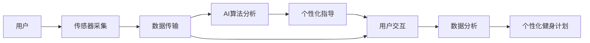

                 

# 智能瑜伽垫创业：个人健身教练的替代品

## 1. 背景介绍

在现代社会，人们越来越重视身体健康，但限于时间、成本等因素，很多人难以接触到专业的个人健身教练。因此，智能健身设备成为了一种替代解决方案，旨在通过智能硬件和数据分析技术，提供个性化的健身指导和反馈。智能瑜伽垫作为其中的一种，结合了瑜伽垫的功能和智能设备的优势，有望成为个人健身的新宠。

智能瑜伽垫不仅能够监测用户的动作、姿势、心率等生理参数，还可以通过语音交互、AI分析等技术，实时提供健身指导和建议，提升用户的健身效果。此外，智能瑜伽垫还能记录用户的训练数据，通过数据分析帮助用户制定更合理的训练计划，监测健身进展，实现长期健康管理。

本文将从智能瑜伽垫的核心概念、技术实现、应用场景及未来发展趋势等方面进行详细探讨，以期为智能瑜伽垫的创业者和开发者提供有价值的参考。

## 2. 核心概念与联系

### 2.1 核心概念概述

智能瑜伽垫创业的核心概念主要包括以下几点：

1. **智能瑜伽垫**：一种结合了传感器、AI算法和用户交互界面的智能健身设备，能够实时监测用户的状态，提供个性化健身指导和建议。

2. **传感器技术**：用于采集用户生理参数（如心率、血压、呼吸等）和动作数据的硬件组件，是智能瑜伽垫的核心功能模块。

3. **AI算法**：智能瑜伽垫通过AI算法（如深度学习、自然语言处理等）对用户数据进行分析，生成个性化健身方案和反馈。

4. **用户交互**：通过语音识别、触屏、APP等技术手段，实现与用户的高效互动，提升用户体验。

5. **数据分析**：对用户数据进行长期记录和分析，帮助用户制定个性化健身计划，监测健康进展。

### 2.2 核心概念联系

智能瑜伽垫的运作原理可以通过以下流程图表示：



其中，A代表用户，B代表传感器采集数据，C代表数据传输到智能设备，D代表AI算法对数据进行分析，E代表根据分析结果生成个性化指导，F代表用户通过交互界面获取指导，G代表对长期数据进行分析，H代表生成个性化健身计划。

## 3. 核心算法原理 & 具体操作步骤

### 3.1 算法原理概述

智能瑜伽垫的核心算法主要包括数据采集、AI分析和个性化指导三部分。其中，AI分析是核心，其原理是通过深度学习等技术，对传感器采集的数据进行分析和处理，生成个性化健身指导和反馈。

具体而言，AI分析的流程如下：

1. **数据预处理**：将传感器采集到的数据进行清洗、归一化等预处理操作，以适应后续分析需求。

2. **特征提取**：通过卷积神经网络（CNN）等技术，从数据中提取关键特征，如动作姿态、心率变化等。

3. **模型训练**：使用深度学习框架（如TensorFlow、PyTorch等）训练自定义模型，将特征映射到个性化健身指导和反馈。

4. **实时分析**：对新采集的数据进行实时分析，生成即时反馈和指导。

### 3.2 算法步骤详解

#### 3.2.1 数据采集

智能瑜伽垫的数据采集主要通过以下步骤实现：

1. **传感器选择**：选择合适的传感器，如加速度传感器、陀螺仪、心率传感器等，用于采集用户生理参数和动作数据。

2. **数据采集协议**：制定数据采集协议，规范数据的采集、传输和存储格式，保证数据的一致性和可靠性。

3. **传感器校准**：对传感器进行校准，确保采集数据的准确性。

#### 3.2.2 AI分析

AI分析的核心步骤包括：

1. **数据预处理**：使用Python、R等语言编写预处理脚本，对采集到的数据进行清洗、归一化等操作，保证数据质量。

2. **特征提取**：使用TensorFlow、Keras等框架搭建深度学习模型，从数据中提取关键特征。

3. **模型训练**：使用GPU或TPU等高性能设备进行模型训练，确保模型准确性和效率。

4. **实时分析**：将模型部署到智能设备上，对新采集的数据进行实时分析，生成即时反馈和指导。

#### 3.2.3 个性化指导

个性化指导主要通过以下步骤实现：

1. **数据可视化**：使用Tableau、Power BI等工具，将分析结果可视化展示，便于用户理解和使用。

2. **推荐系统**：使用协同过滤、内容推荐等算法，为用户推荐适合的健身计划和指导。

3. **语音交互**：集成语音识别和合成技术，实现与用户的语音交互，提升用户体验。

### 3.3 算法优缺点

#### 3.3.1 优点

1. **个性化指导**：AI算法可以根据用户数据生成个性化健身计划和指导，提高用户健身效果。

2. **实时反馈**：实时监测用户状态，及时调整训练方案，提高训练效果。

3. **低成本**：智能瑜伽垫相比个人健身教练成本更低，更容易普及。

#### 3.3.2 缺点

1. **依赖传感器**：智能瑜伽垫的性能依赖于传感器质量，传感器故障或校准不准确会影响用户体验。

2. **数据隐私**：用户生理参数和动作数据的收集、存储和使用涉及隐私保护，需要严格遵守相关法规。

3. **算法复杂**：AI算法的实现和优化较为复杂，需要较高的技术水平和资源投入。

### 3.4 算法应用领域

智能瑜伽垫的应用领域包括：

1. **家庭健身**：作为个人健身设备，智能瑜伽垫适用于家庭环境，提供个性化的健身指导和反馈。

2. **企业健康管理**：在企业中推广智能瑜伽垫，帮助员工保持健康，提高工作效率。

3. **学校体育教育**：在校园内推广智能瑜伽垫，提供科学合理的体育教育方案，促进学生身心健康。

4. **远程健身指导**：通过智能瑜伽垫和互联网结合，实现远程健身指导和交流，扩大健身教练的影响力。

## 4. 数学模型和公式 & 详细讲解 & 举例说明

### 4.1 数学模型构建

智能瑜伽垫的AI分析涉及深度学习等技术，以下是一个简单的深度学习模型框架：

```
Input Layer (Sensor Data) --> Convolutional Layer --> Max Pooling --> Fully Connected Layer --> Output Layer
```

其中，输入层为传感器采集的数据，通过卷积层和池化层进行特征提取，全连接层进行特征融合，输出层输出个性化健身指导和反馈。

### 4.2 公式推导过程

深度学习模型的核心是反向传播算法。假设模型输入为 $x$，输出为 $y$，损失函数为 $L$，模型参数为 $\theta$，则反向传播的公式为：

$$
\frac{\partial L}{\partial \theta} = \frac{\partial L}{\partial y} \cdot \frac{\partial y}{\partial z} \cdot \frac{\partial z}{\partial \theta}
$$

其中，$\frac{\partial L}{\partial y}$ 为损失函数对输出层的导数，$\frac{\partial y}{\partial z}$ 为输出层对全连接层的导数，$\frac{\partial z}{\partial \theta}$ 为全连接层对参数的导数。

### 4.3 案例分析与讲解

以心率为例，描述智能瑜伽垫中深度学习模型的应用：

假设传感器采集到用户的心率数据 $x = [60, 65, 70, 75, 80]$，将其输入到深度学习模型中进行分析，输出个性化健身指导 $y = [slow, medium, fast, slow, medium]$。则反向传播的公式为：

$$
\frac{\partial L}{\partial \theta} = \frac{\partial L}{\partial y} \cdot \frac{\partial y}{\partial z} \cdot \frac{\partial z}{\partial \theta}
$$

其中，$\frac{\partial L}{\partial y}$ 可以根据实际损失函数计算，$\frac{\partial y}{\partial z}$ 为输出层对全连接层的导数，$\frac{\partial z}{\partial \theta}$ 为全连接层对参数的导数。

## 5. 项目实践：代码实例和详细解释说明

### 5.1 开发环境搭建

智能瑜伽垫的开发环境搭建主要包括以下步骤：

1. **环境安装**：安装Python、TensorFlow、Keras等开发工具。

2. **开发平台选择**：选择适当的开发平台，如Windows、Linux、macOS等，搭建开发环境。

3. **集成开发环境**：集成IDE（如PyCharm、Visual Studio Code等），提高开发效率。

### 5.2 源代码详细实现

以下是一个简单的智能瑜伽垫AI分析的Python代码实现：

```python
import tensorflow as tf
from tensorflow.keras import layers

# 定义深度学习模型
model = tf.keras.Sequential([
    layers.Conv2D(32, (3,3), activation='relu', input_shape=(100, 100, 3)),
    layers.MaxPooling2D((2,2)),
    layers.Flatten(),
    layers.Dense(128, activation='relu'),
    layers.Dense(1, activation='sigmoid')
])

# 编译模型
model.compile(optimizer='adam', loss='binary_crossentropy', metrics=['accuracy'])

# 训练模型
model.fit(x_train, y_train, epochs=10, batch_size=32)

# 实时分析
def analyze(user_data):
    predictions = model.predict(user_data)
    if predictions > 0.5:
        return 'fast'
    else:
        return 'slow'
```

### 5.3 代码解读与分析

以上代码实现了深度学习模型在智能瑜伽垫中的应用。其中，`Conv2D`和`MaxPooling2D`用于特征提取，`Flatten`用于将数据展平，`Dense`用于特征融合，`analyze`函数用于实时分析用户数据。

## 6. 实际应用场景

智能瑜伽垫的实际应用场景包括：

### 6.1 家庭健身

智能瑜伽垫在家用场景中，可以成为家庭成员的健身伙伴，提供个性化的健身指导和反馈，帮助用户制定科学的健身计划。

### 6.2 企业健康管理

在企业中，智能瑜伽垫可以推广到员工健身区域，帮助员工进行科学的健身训练，提高工作效率，改善工作环境。

### 6.3 学校体育教育

在校园内，智能瑜伽垫可以推广到体育课或课外活动，帮助学生进行科学的体育锻炼，促进学生身心健康。

### 6.4 远程健身指导

通过智能瑜伽垫和互联网结合，可以实现远程健身指导和交流，扩大健身教练的影响力，提供更加灵活和个性化的健身服务。

## 7. 工具和资源推荐

### 7.1 学习资源推荐

1. **TensorFlow官方文档**：TensorFlow是智能瑜伽垫开发中最常用的深度学习框架，其官方文档详细介绍了深度学习模型的构建、训练和优化方法。

2. **Keras官方文档**：Keras是一个高级深度学习框架，其简洁易用的API使得模型构建更加简单，适合智能瑜伽垫的开发。

3. **PyCharm官方文档**：PyCharm是一个流行的IDE，其官方文档详细介绍了IDE的使用方法和技巧，提高开发效率。

### 7.2 开发工具推荐

1. **TensorFlow**：深度学习框架，适合智能瑜伽垫的AI分析部分。

2. **Keras**：高级深度学习框架，适合模型构建和优化。

3. **PyCharm**：流行的IDE，适合智能瑜伽垫的开发。

### 7.3 相关论文推荐

1. **《深度学习》**：Ian Goodfellow等著，详细介绍了深度学习的基本概念和算法。

2. **《TensorFlow实战Google深度学习框架》**：陈云等著，介绍了TensorFlow的使用方法和技巧。

3. **《Keras深度学习入门与实战》**：胡力等著，介绍了Keras的使用方法和案例。

## 8. 总结：未来发展趋势与挑战

### 8.1 总结

智能瑜伽垫作为一种结合了智能设备和AI分析的健身设备，具有广阔的发展前景。本文从核心概念、技术实现、应用场景及未来发展趋势等方面进行了详细探讨。智能瑜伽垫不仅能够提供个性化的健身指导和反馈，还能通过数据分析帮助用户制定科学的健身计划，监测健康进展。未来，随着技术的不断进步和应用的广泛推广，智能瑜伽垫必将成为个人健身的新宠。

### 8.2 未来发展趋势

智能瑜伽垫的未来发展趋势主要包括以下几个方面：

1. **智能化程度提升**：未来智能瑜伽垫将更加智能化，能够实时监测用户状态，提供更精确的健身指导和反馈。

2. **多模态数据融合**：未来智能瑜伽垫将融合多种传感器数据，如心率、血压、体温等，提供更全面的健康监测和指导。

3. **个性化推荐系统**：未来智能瑜伽垫将引入推荐系统，根据用户数据推荐适合的健身方案，提高用户健身效果。

4. **跨平台互通**：未来智能瑜伽垫将支持多平台互通，用户可以在多个设备上同步数据，实现无缝连接。

### 8.3 面临的挑战

智能瑜伽垫在发展过程中面临以下挑战：

1. **传感器技术瓶颈**：智能瑜伽垫的性能依赖于传感器质量，传感器故障或校准不准确会影响用户体验。

2. **数据隐私问题**：用户生理参数和动作数据的收集、存储和使用涉及隐私保护，需要严格遵守相关法规。

3. **算法复杂度高**：AI算法的实现和优化较为复杂，需要较高的技术水平和资源投入。

### 8.4 研究展望

未来智能瑜伽垫的研究方向主要包括以下几个方面：

1. **传感器技术改进**：开发更高效、可靠的传感器技术，提高智能瑜伽垫的性能。

2. **AI算法优化**：改进深度学习算法，提高模型的准确性和效率。

3. **数据隐私保护**：研究数据隐私保护技术，保障用户隐私安全。

4. **跨平台互通**：研究跨平台互通技术，实现多设备协同工作。

作者：禅与计算机程序设计艺术 / Zen and the Art of Computer Programming

