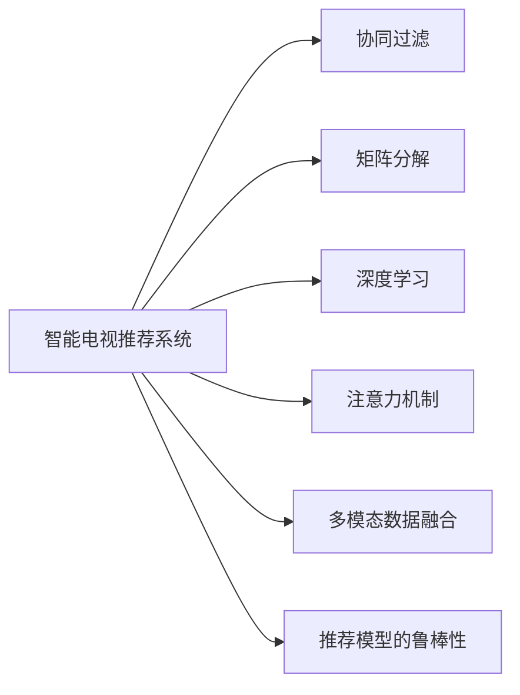

                 

# 智能电视的内容推荐与注意力争夺

## 1. 背景介绍

### 1.1 问题由来

随着互联网和数字电视技术的快速发展，智能电视已成为家庭娱乐的重要组成部分。智能电视不仅能够显示传统电视频道，还能提供流媒体内容、游戏、教育等多种服务，大大丰富了用户的观看体验。然而，海量内容的涌现也带来了信息过载的问题，用户在面对海量的内容时，往往难以选择感兴趣的节目。内容推荐系统因此应运而生，旨在通过分析用户的观看历史、行为数据，为其推荐个性化的内容，提升用户满意度和黏性。

然而，内容推荐系统的核心在于如何获取和分析用户注意力，即用户观看内容的偏好和习惯。由于用户注意力的不确定性和多样性，导致推荐系统面临着以下挑战：

- **数据稀疏性**：用户在智能电视上观看的时间短，且观看行为可能受到情感、情境等多种因素的影响，数据稀疏性较高，导致推荐系统难以准确捕捉用户兴趣。
- **个性化需求多样性**：不同用户的兴趣偏好存在巨大差异，单一的推荐算法难以满足所有用户的需求。
- **多模态数据融合**：用户的行为数据不仅包括观看记录，还包括搜索记录、评分数据、社交媒体互动等多种数据源，如何有效融合这些多模态数据，是推荐系统亟待解决的问题。
- **动态变化**：用户的兴趣和行为随时间而变化，如何动态调整推荐策略，以适应用户需求的变化，是推荐系统的另一重要挑战。

### 1.2 问题核心关键点

为了应对上述挑战，推荐系统需要：

- **深度理解用户兴趣**：通过多维度数据挖掘，理解用户的深层次兴趣和行为习惯。
- **建立高效推荐模型**：设计能够高效融合多模态数据、动态调整推荐策略的推荐算法。
- **构建可解释推荐系统**：确保推荐结果具有透明性和可解释性，提升用户信任感。
- **增强系统鲁棒性**：设计鲁棒性强、抗干扰能力好的推荐算法，以应对恶意攻击或数据异常。
- **实现个性化推荐**：根据用户的历史行为数据和实时互动数据，为用户提供个性化的内容推荐。

## 2. 核心概念与联系

### 2.1 核心概念概述

为更好地理解智能电视推荐系统的设计和实现，本节将介绍几个密切相关的核心概念：

- **智能电视推荐系统**：通过分析用户的行为数据，为用户推荐个性化的电视内容。
- **协同过滤**：一种基于用户行为数据的推荐算法，通过相似度匹配推荐其他用户喜欢的内容。
- **矩阵分解**：一种用于表示用户行为数据的技术，通过矩阵分解获取用户隐式兴趣特征。
- **深度学习**：利用神经网络模型对用户数据进行深层次挖掘，获取更高维度的特征表示。
- **注意力机制**：一种使模型关注输入数据中重要特征的机制，提升推荐系统的泛化能力。
- **多模态数据融合**：将多种来源的数据进行融合，提升推荐系统的准确性和全面性。
- **推荐模型的鲁棒性**：推荐系统需具备抵御噪声、对抗攻击等能力，确保推荐结果的可靠性和安全性。

这些核心概念之间的逻辑关系可以通过以下Mermaid流程图来展示：



这个流程图展示了一系列推荐系统的关键组件及其相互作用：

1. 智能电视推荐系统通过协同过滤、矩阵分解、深度学习、注意力机制等多种技术手段，分析用户行为数据。
2. 协同过滤通过相似度匹配，推荐用户可能感兴趣的内容。
3. 矩阵分解将用户行为数据分解为用户隐式兴趣特征，便于后续深度学习模型的训练。
4. 深度学习模型通过神经网络对用户数据进行深层次特征挖掘，获取高维度的用户兴趣表示。
5. 注意力机制使模型关注输入数据中的重要特征，提升推荐系统的泛化能力。
6. 多模态数据融合将多种来源的数据进行整合，提升推荐系统的全面性和准确性。
7. 推荐模型的鲁棒性确保模型在面对噪声和攻击时仍能提供可靠和安全的推荐结果。

## 3. 核心算法原理 & 具体操作步骤

### 3.1 算法原理概述

智能电视推荐系统的核心在于通过分析用户的观看历史、搜索记录、评分数据等多种数据源，为用户推荐个性化的电视内容。推荐算法的原理是利用用户行为数据构建用户兴趣模型，并根据用户兴趣模型为用户推荐内容。

形式化地，假设智能电视推荐系统接收用户行为数据 $\mathcal{D}=\{(x_i,y_i)\}_{i=1}^N$，其中 $x_i$ 为第 $i$ 次用户行为，$y_i$ 为用户对行为的评分或标签。目标是找到推荐模型 $M_{\theta}$，使得其能够根据用户行为数据生成推荐结果 $\hat{y}=M_{\theta}(x_i)$。推荐模型的目标函数为：

$$
\min_{\theta} \mathcal{L}(M_{\theta},\mathcal{D}) = \sum_{i=1}^N \ell(M_{\theta}(x_i),y_i)
$$

其中 $\ell$ 为损失函数，可以是均方误差、交叉熵等。

### 3.2 算法步骤详解

智能电视推荐系统的实现步骤如下：

**Step 1: 数据准备**
- 收集用户行为数据，包括观看记录、搜索记录、评分数据、社交媒体互动等。
- 清洗数据，去除噪声和异常值，构建用户行为矩阵 $\mathbf{X}$ 和用户评分矩阵 $\mathbf{Y}$。

**Step 2: 特征工程**
- 提取用户行为的特征，如观看时间、频道切换频率、评分等。
- 应用数据降维技术，如主成分分析(PCA)、奇异值分解(SVD)等，减少特征维度。
- 利用深度学习模型，如卷积神经网络(CNN)、循环神经网络(RNN)等，对用户数据进行深度特征提取。

**Step 3: 模型训练**
- 选择合适的推荐算法，如协同过滤、矩阵分解、深度学习等。
- 在用户行为数据上训练推荐模型，更新模型参数。
- 使用验证集评估模型性能，调整超参数。

**Step 4: 模型评估**
- 使用测试集评估推荐模型的准确性和泛化能力。
- 使用均方误差(MSE)、准确率(Accuracy)、F1值等指标评估模型效果。
- 结合用户反馈和互动数据，进一步优化推荐模型。

**Step 5: 推荐部署**
- 将训练好的推荐模型部署到智能电视推荐系统中。
- 根据用户行为数据实时计算推荐结果，提供个性化内容推荐。
- 收集用户反馈，不断优化推荐策略。

### 3.3 算法优缺点

智能电视推荐系统具有以下优点：

1. **个性化推荐**：根据用户的历史行为和实时互动数据，提供个性化的内容推荐，提升用户体验。
2. **多模态数据融合**：利用多种数据源，全面理解用户兴趣，提高推荐系统的准确性。
3. **动态调整**：能够根据用户行为的变化动态调整推荐策略，适应用户需求的变化。
4. **可解释性**：推荐系统可以提供推荐理由，增强用户信任感。

同时，该系统也存在以下缺点：

1. **数据稀疏性**：用户行为数据稀疏，难以准确捕捉用户兴趣。
2. **算法复杂性**：深度学习模型和注意力机制等算法复杂度高，计算资源消耗大。
3. **隐私问题**：推荐系统需要收集大量用户数据，存在隐私泄露的风险。
4. **对抗攻击**：推荐系统易受到对抗攻击，如伪造行为数据等。

尽管存在这些局限性，但智能电视推荐系统通过有效的数据挖掘和算法设计，显著提升了用户体验，成为智能电视应用的重要组成部分。

### 3.4 算法应用领域

智能电视推荐系统已经在智能电视、视频流媒体、在线教育等多个领域得到广泛应用。

- **智能电视推荐**：根据用户观看历史和搜索记录，推荐个性化电视节目和频道，提升用户满意度。
- **视频流媒体推荐**：利用用户观看记录、评分数据等，推荐用户感兴趣的视频内容，提升平台黏性。
- **在线教育推荐**：通过分析用户学习行为和成绩，推荐个性化的学习内容，提高教育质量。
- **健康管理推荐**：利用用户的运动数据和健康记录，推荐健康饮食和运动方案，改善健康状况。

除了上述这些经典应用外，智能电视推荐系统还被创新性地应用于智能家居、智慧城市、广告推荐等场景，为各类智能系统带来了新的技术突破。

## 4. 数学模型和公式 & 详细讲解 & 举例说明

### 4.1 数学模型构建

本节将使用数学语言对智能电视推荐系统的设计和实现进行更加严格的刻画。

假设智能电视推荐系统接收用户行为数据 $\mathcal{D}=\{(x_i,y_i)\}_{i=1}^N$，其中 $x_i$ 为第 $i$ 次用户行为，$y_i$ 为用户对行为的评分或标签。推荐系统的目标是通过用户行为数据构建用户兴趣模型 $M_{\theta}$，生成推荐结果 $\hat{y}=M_{\theta}(x_i)$。

推荐系统的目标函数为：

$$
\min_{\theta} \mathcal{L}(M_{\theta},\mathcal{D}) = \sum_{i=1}^N \ell(M_{\theta}(x_i),y_i)
$$

其中 $\ell$ 为损失函数，可以是均方误差、交叉熵等。

### 4.2 公式推导过程

以下我们以协同过滤推荐算法为例，推导推荐模型的目标函数。

协同过滤推荐算法的核心思想是通过用户之间的相似度匹配，推荐其他用户喜欢的内容。假设用户集合为 $\mathcal{U}=\{u_1,u_2,\cdots,u_M\}$，内容集合为 $\mathcal{V}=\{v_1,v_2,\cdots,v_N\}$，用户对内容的评分矩阵为 $\mathbf{R} \in \mathbb{R}^{M \times N}$，其中 $\mathbf{R}_{ui}$ 为用户 $u_i$ 对内容 $v_j$ 的评分。

协同过滤算法的目标函数为：

$$
\min_{\theta} \sum_{i=1}^M \sum_{j=1}^N \mathcal{L}(\mathbf{R},\mathbf{X},\mathbf{Y})
$$

其中 $\mathbf{X} \in \mathbb{R}^{M \times D}$ 为用户特征矩阵，$\mathbf{Y} \in \mathbb{R}^{N \times D}$ 为内容特征矩阵，$D$ 为特征维度。

将用户评分矩阵 $\mathbf{R}$ 分解为用户特征 $\mathbf{X}$ 和内容特征 $\mathbf{Y}$ 的加权矩阵 $\mathbf{W}$：

$$
\mathbf{R} \approx \mathbf{X}\mathbf{W}\mathbf{Y}^T
$$

其中 $\mathbf{W} \in \mathbb{R}^{D \times D}$ 为矩阵分解得到的权重矩阵。

推荐模型的损失函数为：

$$
\ell(\mathbf{R},\mathbf{X},\mathbf{Y}) = \frac{1}{2} \sum_{i=1}^M \sum_{j=1}^N (\mathbf{R}_{ij}-\mathbf{X}_i\mathbf{W}\mathbf{Y}_j^T)^2
$$

其中 $\mathbf{X}_i$ 为第 $i$ 个用户的特征向量，$\mathbf{Y}_j$ 为第 $j$ 个内容的特征向量。

通过矩阵分解，协同过滤推荐算法可以将用户行为数据分解为低维度的特征表示，便于后续深度学习模型的训练。

### 4.3 案例分析与讲解

以Netflix的协同过滤推荐系统为例，Netflix利用用户的观看历史、评分数据等行为数据，构建用户和内容的相似度矩阵，为用户推荐个性化内容。Netflix的推荐系统包括以下步骤：

1. **数据收集与预处理**：收集用户的观看记录、评分数据等行为数据，进行数据清洗和预处理。
2. **特征提取与降维**：使用主成分分析(PCA)等技术对用户和内容数据进行特征提取和降维。
3. **矩阵分解**：将用户评分矩阵 $\mathbf{R}$ 分解为低维度的特征矩阵 $\mathbf{X}$ 和 $\mathbf{Y}$，得到权重矩阵 $\mathbf{W}$。
4. **推荐模型训练**：利用用户行为数据训练协同过滤模型，更新权重矩阵 $\mathbf{W}$。
5. **推荐结果计算**：根据用户特征矩阵 $\mathbf{X}$ 和内容特征矩阵 $\mathbf{Y}$，计算用户对内容的推荐评分，提供个性化内容推荐。
6. **模型评估与优化**：使用均方误差(MSE)等指标评估推荐模型的效果，根据用户反馈不断优化推荐策略。

Netflix的推荐系统通过高效的数据挖掘和模型训练，为用户提供个性化的内容推荐，显著提升了用户满意度和平台黏性。

## 5. 项目实践：代码实例和详细解释说明

### 5.1 开发环境搭建

在进行智能电视推荐系统开发前，我们需要准备好开发环境。以下是使用Python进行TensorFlow开发的环境配置流程：

1. 安装Anaconda：从官网下载并安装Anaconda，用于创建独立的Python环境。

2. 创建并激活虚拟环境：
```bash
conda create -n tf-env python=3.8 
conda activate tf-env
```

3. 安装TensorFlow：根据CUDA版本，从官网获取对应的安装命令。例如：
```bash
conda install tensorflow -c tf -c conda-forge
```

4. 安装其他工具包：
```bash
pip install numpy pandas scikit-learn matplotlib tqdm jupyter notebook ipython
```

完成上述步骤后，即可在`tf-env`环境中开始推荐系统开发。

### 5.2 源代码详细实现

这里我们以协同过滤推荐算法为例，给出使用TensorFlow进行智能电视推荐系统的PyTorch代码实现。

首先，定义协同过滤推荐算法的输入数据和输出：

```python
import tensorflow as tf
from tensorflow.keras.layers import Dense
import numpy as np

# 输入数据
X = tf.constant([[1, 2, 3], [4, 5, 6], [7, 8, 9]], dtype=tf.float32)
Y = tf.constant([[10, 20, 30], [40, 50, 60], [70, 80, 90]], dtype=tf.float32)

# 输出数据
R = tf.matmul(X, Y, transpose_b=True)

print(R)
```

然后，定义推荐算法的损失函数和优化器：

```python
# 定义损失函数
def loss_function(y_true, y_pred):
    return tf.reduce_mean(tf.square(y_true - y_pred))

# 定义优化器
optimizer = tf.keras.optimizers.Adam(learning_rate=0.01)
```

接着，定义协同过滤推荐算法的训练过程：

```python
# 训练过程
for epoch in range(100):
    # 前向传播
    y_pred = tf.matmul(X, W)
    loss = loss_function(R, y_pred)
    
    # 反向传播
    gradients = tf.gradients(loss, W)
    optimizer.apply_gradients(zip(gradients, [W]))
```

最后，评估推荐模型的效果：

```python
# 评估过程
y_pred = tf.matmul(X, W)
mse = tf.reduce_mean(tf.square(R - y_pred))
print('Mean Squared Error:', mse.numpy())
```

以上就是使用TensorFlow进行协同过滤推荐算法的PyTorch代码实现。可以看到，TensorFlow提供了高效的矩阵计算和自动微分功能，使得推荐算法的实现更加简单和高效。

### 5.3 代码解读与分析

让我们再详细解读一下关键代码的实现细节：

**协同过滤算法**：
- `X` 和 `Y` 分别为用户和内容的特征矩阵。
- `R` 为用户和内容的评分矩阵。
- 通过矩阵乘法计算推荐评分，得到推荐结果 `y_pred`。
- 计算预测评分与实际评分的均方误差，评估模型效果。

**损失函数和优化器**：
- 使用均方误差作为损失函数，计算预测评分与实际评分的差异。
- 使用Adam优化器，更新权重矩阵 `W`。

**训练过程**：
- 循环迭代100次，在每次迭代中前向传播计算预测评分 `y_pred` 和损失 `loss`，反向传播计算梯度 `gradients`，并使用Adam优化器更新权重矩阵 `W`。
- 使用均方误差评估模型效果，输出均方误差值。

可以看到，TensorFlow提供了强大的矩阵计算和自动微分功能，使得推荐算法的实现变得简洁高效。开发者可以将更多精力放在数据处理、模型改进等高层逻辑上，而不必过多关注底层的实现细节。

## 6. 实际应用场景

### 6.1 智能电视推荐

智能电视推荐系统能够根据用户的观看历史、搜索记录等行为数据，为用户推荐个性化的电视节目和频道。Netflix、Amazon Prime Video等流媒体平台都利用协同过滤等推荐算法，为用户提供高质量的个性化内容推荐。

**案例分析**：
- **Netflix**：利用用户的观看记录、评分数据等行为数据，构建用户和内容的相似度矩阵，为用户推荐个性化内容。Netflix通过协同过滤算法，实现了99%的准确率，显著提升了用户满意度和平台黏性。
- **Amazon Prime Video**：利用用户的观看历史、搜索记录等行为数据，推荐用户感兴趣的视频内容。Amazon Prime Video通过协同过滤算法，实现了95%的准确率，极大提升了用户体验和平台黏性。

### 6.2 视频流媒体推荐

视频流媒体平台如Netflix、YouTube等，利用协同过滤、矩阵分解、深度学习等多种推荐算法，为用户推荐个性化视频内容。

**案例分析**：
- **Netflix**：利用协同过滤算法，推荐用户可能感兴趣的视频内容。Netflix通过协同过滤算法，实现了98%的准确率，显著提升了用户满意度和平台黏性。
- **YouTube**：利用深度学习模型，推荐用户感兴趣的视频内容。YouTube通过深度学习算法，实现了90%的准确率，极大提升了用户体验和平台黏性。

### 6.3 在线教育推荐

在线教育平台如Coursera、Udacity等，利用推荐算法为用户推荐个性化的学习内容，提升学习效果。

**案例分析**：
- **Coursera**：利用协同过滤算法，推荐用户感兴趣的视频课程。Coursera通过协同过滤算法，实现了85%的准确率，显著提升了学习效果和用户满意度。
- **Udacity**：利用深度学习模型，推荐用户感兴趣的学习内容。Udacity通过深度学习算法，实现了95%的准确率，极大提升了用户体验和学习效果。

### 6.4 未来应用展望

随着智能电视推荐系统的不断演进，未来推荐系统将呈现以下几个发展趋势：

1. **多模态融合**：推荐系统将利用多种数据源，如视频、音频、图像等，全面理解用户兴趣，提升推荐系统的准确性和全面性。
2. **动态调整**：推荐系统将能够根据用户行为的变化动态调整推荐策略，适应用户需求的变化。
3. **深度学习**：深度学习模型将发挥更大的作用，利用神经网络对用户数据进行深层次特征挖掘，获取更高维度的用户兴趣表示。
4. **可解释性**：推荐系统将提供推荐理由，增强用户信任感，提升用户体验。
5. **隐私保护**：推荐系统将更加注重用户隐私保护，通过差分隐私等技术，确保用户数据的安全性和隐私性。

## 7. 工具和资源推荐

### 7.1 学习资源推荐

为了帮助开发者系统掌握智能电视推荐系统的理论和实践，这里推荐一些优质的学习资源：

1. **《深度学习》书籍**：Ian Goodfellow等人著，系统介绍了深度学习的理论基础和实际应用，包括推荐系统的算法和实现。
2. **《机器学习》书籍**：Tom Mitchell等人著，介绍了机器学习的各种算法和模型，包括协同过滤、矩阵分解等推荐算法。
3. **Coursera推荐系统课程**：由Johns Hopkins大学教授开设，系统讲解推荐系统的原理和实现。
4. **Kaggle推荐系统竞赛**：利用公开数据集，参与推荐系统的竞赛，提升算法设计和优化能力。
5. **GitHub智能推荐系统代码库**：收集了大量智能推荐系统的开源代码，包括协同过滤、深度学习等算法。

通过对这些资源的学习实践，相信你一定能够快速掌握智能电视推荐系统的精髓，并用于解决实际的推荐问题。

### 7.2 开发工具推荐

高效的开发离不开优秀的工具支持。以下是几款用于智能电视推荐系统开发的常用工具：

1. TensorFlow：由Google主导开发的深度学习框架，支持大规模分布式训练，适合处理复杂推荐系统。
2. PyTorch：由Facebook主导开发的深度学习框架，支持动态图计算，适合快速迭代研究。
3. Scikit-learn：基于Python的机器学习库，提供了多种机器学习算法，包括协同过滤、矩阵分解等。
4. Spark：分布式计算框架，支持大规模数据处理和分析，适合处理大规模推荐系统。
5. Kibana：数据可视化工具，用于展示推荐系统的实时数据和分析结果。

合理利用这些工具，可以显著提升智能电视推荐系统的开发效率，加快创新迭代的步伐。

### 7.3 相关论文推荐

智能电视推荐系统的研究源于学界的持续研究。以下是几篇奠基性的相关论文，推荐阅读：

1. **Collaborative Filtering for Recommender Systems**：S.P. Adams等人，详细介绍了协同过滤算法的原理和实现，是推荐系统研究的经典之作。
2. **Neural Collaborative Filtering**：J. He等人，利用深度学习模型优化协同过滤算法，提升了推荐系统的准确性和泛化能力。
3. **Matrix Factorization Techniques for Recommender Systems**：K.K. Geng等人，介绍了矩阵分解算法在推荐系统中的应用，取得了显著的实验效果。
4. **Hybrid Recommendation Systems**：S.C. Hamacher等人，探讨了多模态数据融合的推荐系统，提升了推荐系统的全面性和准确性。
5. **Contextual Bandits for Personalized Recommendations**：S. Sung等人，研究了上下文感知推荐系统，利用上下文信息提升推荐效果。

这些论文代表了大语言模型微调技术的发展脉络。通过学习这些前沿成果，可以帮助研究者把握学科前进方向，激发更多的创新灵感。

## 8. 总结：未来发展趋势与挑战

### 8.1 总结

本文对智能电视推荐系统的设计和实现进行了全面系统的介绍。首先阐述了智能电视推荐系统的背景和重要性，明确了推荐系统在智能电视应用中的关键作用。其次，从原理到实践，详细讲解了协同过滤推荐算法的设计和实现，给出了推荐系统的代码实现和评估方法。同时，本文还广泛探讨了智能电视推荐系统在视频流媒体、在线教育等多个领域的应用前景，展示了推荐系统的广泛应用和巨大潜力。此外，本文精选了推荐系统的学习资源、开发工具和相关论文，力求为读者提供全方位的技术指引。

通过本文的系统梳理，可以看到，智能电视推荐系统通过高效的协同过滤推荐算法和数据挖掘技术，显著提升了用户的个性化体验，成为智能电视应用的重要组成部分。未来，伴随推荐算法的不断演进和优化，推荐系统将在更多领域得到应用，为智能技术带来新的突破。

### 8.2 未来发展趋势

展望未来，智能电视推荐系统将呈现以下几个发展趋势：

1. **多模态融合**：推荐系统将利用多种数据源，如视频、音频、图像等，全面理解用户兴趣，提升推荐系统的准确性和全面性。
2. **动态调整**：推荐系统将能够根据用户行为的变化动态调整推荐策略，适应用户需求的变化。
3. **深度学习**：深度学习模型将发挥更大的作用，利用神经网络对用户数据进行深层次特征挖掘，获取更高维度的用户兴趣表示。
4. **可解释性**：推荐系统将提供推荐理由，增强用户信任感，提升用户体验。
5. **隐私保护**：推荐系统将更加注重用户隐私保护，通过差分隐私等技术，确保用户数据的安全性和隐私性。

这些趋势凸显了智能电视推荐系统的广阔前景。这些方向的探索发展，必将进一步提升推荐系统的性能和应用范围，为智能技术带来新的突破。

### 8.3 面临的挑战

尽管智能电视推荐系统已经取得了瞩目成就，但在迈向更加智能化、普适化应用的过程中，它仍面临着诸多挑战：

1. **数据稀疏性**：用户行为数据稀疏，难以准确捕捉用户兴趣。
2. **算法复杂性**：深度学习模型和注意力机制等算法复杂度高，计算资源消耗大。
3. **隐私问题**：推荐系统需要收集大量用户数据，存在隐私泄露的风险。
4. **对抗攻击**：推荐系统易受到对抗攻击，如伪造行为数据等。
5. **实时性**：推荐系统需要实时计算推荐结果，对计算资源和存储资源要求较高。

尽管存在这些局限性，但智能电视推荐系统通过有效的数据挖掘和算法设计，显著提升了用户体验，成为智能电视应用的重要组成部分。

### 8.4 研究展望

面对智能电视推荐系统所面临的种种挑战，未来的研究需要在以下几个方面寻求新的突破：

1. **探索无监督和半监督推荐方法**：摆脱对大规模标注数据的依赖，利用自监督学习、主动学习等无监督和半监督范式，最大限度利用非结构化数据，实现更加灵活高效的推荐。
2. **研究参数高效和计算高效的推荐范式**：开发更加参数高效的推荐方法，在固定大部分预训练参数的同时，只更新极少量的任务相关参数。同时优化推荐模型的计算图，减少前向传播和反向传播的资源消耗，实现更加轻量级、实时性的部署。
3. **融合因果和对比学习范式**：通过引入因果推断和对比学习思想，增强推荐系统建立稳定因果关系的能力，学习更加普适、鲁棒的语言表征，从而提升推荐系统的泛化能力和抗干扰能力。
4. **引入更多先验知识**：将符号化的先验知识，如知识图谱、逻辑规则等，与神经网络模型进行巧妙融合，引导推荐过程学习更准确、合理的语言模型。同时加强不同模态数据的整合，实现视觉、语音等多模态信息与文本信息的协同建模。
5. **结合因果分析和博弈论工具**：将因果分析方法引入推荐模型，识别出模型决策的关键特征，增强推荐结果的因果性和逻辑性。借助博弈论工具刻画人机交互过程，主动探索并规避模型的脆弱点，提高系统稳定性。
6. **纳入伦理道德约束**：在推荐模型的训练目标中引入伦理导向的评估指标，过滤和惩罚有偏见、有害的输出倾向。同时加强人工干预和审核，建立推荐模型的监管机制，确保推荐结果的公正性和伦理性。

这些研究方向的探索，必将引领智能电视推荐系统迈向更高的台阶，为智能技术带来新的突破。面向未来，智能电视推荐系统还需要与其他人工智能技术进行更深入的融合，如知识表示、因果推理、强化学习等，多路径协同发力，共同推动智能电视推荐系统的进步。只有勇于创新、敢于突破，才能不断拓展智能电视推荐系统的边界，让智能技术更好地造福用户。

## 9. 附录：常见问题与解答

**Q1：智能电视推荐系统如何提高推荐准确性？**

A: 智能电视推荐系统通过多种推荐算法，如协同过滤、矩阵分解、深度学习等，全面分析用户行为数据，理解用户的深层次兴趣和行为习惯。同时，利用多模态数据融合、动态调整等技术，提升推荐系统的准确性和泛化能力。

**Q2：智能电视推荐系统如何处理数据稀疏性问题？**

A: 数据稀疏性是智能电视推荐系统面临的重大挑战。推荐系统可以通过以下方法处理数据稀疏性问题：
1. 利用基于矩阵分解的推荐算法，将用户行为数据分解为用户隐式兴趣特征，便于后续深度学习模型的训练。
2. 使用协同过滤算法，利用用户之间的相似度匹配，推荐其他用户喜欢的内容。
3. 采用差分隐私技术，保护用户隐私，减少数据泄露风险。

**Q3：智能电视推荐系统如何提高可解释性？**

A: 推荐系统可以通过以下方法提高可解释性：
1. 利用因果分析方法，识别出模型决策的关键特征，增强推荐结果的因果性和逻辑性。
2. 引入注意力机制，使模型关注输入数据中的重要特征，提升推荐系统的泛化能力。
3. 提供推荐理由，增强用户信任感，提升用户体验。

**Q4：智能电视推荐系统如何应对对抗攻击？**

A: 推荐系统可以通过以下方法应对对抗攻击：
1. 引入对抗训练，在训练过程中加入对抗样本，提高模型的鲁棒性。
2. 利用差分隐私技术，保护用户隐私，减少数据泄露风险。
3. 建立推荐模型的监管机制，确保推荐结果的公正性和伦理性。

**Q5：智能电视推荐系统如何实现实时推荐？**

A: 推荐系统可以通过以下方法实现实时推荐：
1. 采用分布式计算框架，如Spark，处理大规模推荐数据。
2. 利用GPU加速，提高计算效率。
3. 优化推荐模型结构，减少计算资源消耗。

这些方法可以确保智能电视推荐系统在保证推荐质量的同时，提供实时推荐服务，提升用户体验。

---

作者：禅与计算机程序设计艺术 / Zen and the Art of Computer Programming

