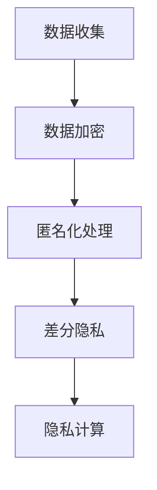

                 

## 1. 背景介绍

### 1.1 问题由来

在现代数字化时代，智能设备已逐渐成为人们日常生活中不可或缺的一部分。从智能手机、智能手表到智能家居，设备的广泛应用极大地便利了我们的生活。然而，随之而来的是对个人信息处理的担忧。智能设备通常集成了大量的传感器和数据收集功能，如位置信息、通话记录、拍照信息等，这些数据一旦泄露，将对用户的隐私安全构成巨大威胁。

与此同时，隐私问题也逐渐成为政府、企业和公众关注的焦点。各国纷纷出台数据保护法规，如欧盟的GDPR（通用数据保护条例）和美国的CCPA（加州消费者隐私法案），要求企业必须严格保护用户数据，确保其合法、合理的使用。

因此，如何在智能设备上安全地处理个人信息，成为技术界亟待解决的重要问题。本文将深入探讨智能设备隐私保护的原理、技术手段和实际应用场景，以期为开发人员提供实用的参考和指导。

### 1.2 问题核心关键点

智能设备隐私保护的核心关键点主要包括：

- **数据收集与存储安全**：确保数据在收集和存储过程中的安全性，避免泄露和篡改。
- **数据使用合规性**：保证数据的使用符合用户隐私政策和法律法规要求，避免滥用。
- **用户隐私控制**：赋予用户对其个人信息的自主控制权，包括查看、修改、删除等操作。
- **攻击防护**：防范各类隐私攻击，如钓鱼、社会工程学、数据窃取等，保护用户隐私不受侵害。

## 2. 核心概念与联系

### 2.1 核心概念概述

智能设备隐私保护涉及多个核心概念，包括数据加密、匿名化处理、差分隐私、隐私计算等。这些概念共同构成了智能设备隐私保护的基础框架，旨在确保数据在收集、存储、传输和使用过程中的安全性。

- **数据加密**：通过加密技术对数据进行保护，即使数据被截获，攻击者也无法解读。
- **匿名化处理**：将数据中的标识信息去除或模糊化，使得数据无法直接关联到特定个体。
- **差分隐私**：在数据处理过程中加入噪声，确保个体数据的隐私不被泄露，同时保持数据的整体统计特性。
- **隐私计算**：在不泄露数据的前提下，利用加密和匿名化技术，在多方之间安全地计算和共享数据。

这些核心概念之间的联系可以通过以下Mermaid流程图来展示：



这个流程图展示了数据在智能设备隐私保护中的处理流程：从数据收集到加密、匿名化、差分隐私处理，最终通过隐私计算确保多方安全共享数据。

## 3. 核心算法原理 & 具体操作步骤

### 3.1 算法原理概述

智能设备隐私保护的核心算法原理主要包括以下几个方面：

- **加密算法**：如AES、RSA等，用于保护数据在传输和存储过程中的安全性。
- **匿名化算法**：如K-匿名化、L-diversity、t-接近性等，用于去除数据中的标识信息。
- **差分隐私算法**：如Laplace机制、高斯机制等，用于在数据处理过程中加入噪声，保护个体隐私。
- **隐私计算算法**：如同态加密、多方安全计算、零知识证明等，用于在多方之间安全地计算和共享数据。

这些算法通过相互配合，确保智能设备收集、存储、传输和使用过程中的数据安全性。

### 3.2 算法步骤详解

#### 数据加密步骤

1. **选择加密算法**：根据数据类型和保护需求，选择合适的加密算法，如AES、RSA等。
2. **密钥生成**：生成一对公钥和私钥，公钥用于加密数据，私钥用于解密数据。
3. **数据加密**：使用公钥对数据进行加密，确保数据在传输和存储过程中的安全性。

#### 匿名化处理步骤

1. **数据预处理**：对数据进行清洗和整理，去除无用信息。
2. **标识信息去除**：使用K-匿名化、L-diversity等方法，去除数据中的标识信息。
3. **差分隐私增强**：在匿名化基础上，使用差分隐私算法加入噪声，进一步保护个体隐私。

#### 差分隐私步骤

1. **选择合适的差分隐私机制**：如Laplace机制、高斯机制等。
2. **确定噪声参数**：根据数据分布和隐私需求，确定加入噪声的参数。
3. **加入噪声**：在数据处理过程中加入噪声，确保个体数据的隐私不被泄露。

#### 隐私计算步骤

1. **选择合适的隐私计算技术**：如同态加密、多方安全计算、零知识证明等。
2. **加密数据共享**：对共享数据进行加密，确保数据在多方之间的传输安全。
3. **多方计算**：在加密数据的基础上，进行多方计算和共享，确保数据隐私。

### 3.3 算法优缺点

智能设备隐私保护算法具有以下优点：

- **高安全性**：通过加密和匿名化等技术，确保数据在收集、存储、传输和使用过程中的安全性。
- **可控性**：用户可以自主控制其个人信息，包括查看、修改、删除等操作。
- **法律合规**：符合GDPR、CCPA等数据保护法规的要求，保障用户隐私不受侵害。

同时，这些算法也存在一些缺点：

- **计算复杂度高**：加密和匿名化等技术往往计算复杂度高，处理大量数据时性能较差。
- **数据精度降低**：差分隐私等技术通过加入噪声，可能会降低数据的精度和可用性。
- **技术门槛高**：实现这些算法需要较高的技术门槛，开发和维护成本较高。

## 4. 数学模型和公式 & 详细讲解 & 举例说明

### 4.1 数学模型构建

智能设备隐私保护的数学模型主要包括以下几个方面：

- **数据加密模型**：如AES、RSA等算法。
- **匿名化处理模型**：如K-匿名化、L-diversity等。
- **差分隐私模型**：如Laplace机制、高斯机制等。
- **隐私计算模型**：如同态加密、多方安全计算等。

### 4.2 公式推导过程

#### 数据加密公式

对于AES加密算法，假设原始明文为M，加密密钥为K，加密后的密文为C，则加密过程可以表示为：

$$ C = AES(M, K) $$

#### 匿名化公式

K-匿名化是一种常用的匿名化算法，假设数据集为D，标识字段为A，则K-匿名化后的数据集D'可以表示为：

$$ D' = D[A'_k] $$

其中，$A'_k$为K-匿名化后的标识字段，包含k个相同标识字段。

#### 差分隐私公式

Laplace机制是一种差分隐私算法，假设数据集为D，查询函数为Q，隐私参数为ε，则Laplace机制的差分隐私结果Q'可以表示为：

$$ Q' = Q(D) + N(0, \frac{\sigma}{\epsilon}) $$

其中，N(0, σ)表示标准正态分布，σ为噪声参数。

### 4.3 案例分析与讲解

以智能手表收集位置信息为例，分析隐私保护的全流程：

1. **数据收集**：智能手表通过GPS等传感器收集用户位置信息。
2. **数据加密**：使用AES加密算法对位置信息进行加密，确保数据在传输和存储过程中的安全性。
3. **匿名化处理**：去除位置信息中的地理位置信息，保留粗略位置标识，使用K-匿名化技术去除标识信息。
4. **差分隐私**：在匿名化基础上，使用Laplace机制加入噪声，进一步保护用户隐私。
5. **隐私计算**：使用同态加密技术，在多个智能手表之间计算位置数据的平均值，确保数据隐私不被泄露。

## 5. 项目实践：代码实例和详细解释说明

### 5.1 开发环境搭建

在进行智能设备隐私保护项目开发时，需要安装和配置相关开发工具和环境。以下是搭建开发环境的详细流程：

1. **安装Python和PyPI**：Python是智能设备隐私保护项目的主要开发语言，需要安装Python 3.x版本，并配置PyPI以获取第三方库。

2. **安装加密库**：如PyCrypto、cryptography等，用于实现数据加密和解密。

3. **安装匿名化库**：如pyanonymize、fuzzy等，用于实现数据匿名化处理。

4. **安装差分隐私库**：如diffprivpy、differential_privacy等，用于实现差分隐私算法。

5. **安装隐私计算库**：如pysyft、somewhat-private等，用于实现隐私计算算法。

完成上述步骤后，即可在Python环境中进行智能设备隐私保护项目的开发和测试。

### 5.2 源代码详细实现

以下是一个简单的智能设备隐私保护项目的代码实现：

```python
# 导入相关库
from cryptography.fernet import Fernet
import pyanonymize
import diffprivpy
import somewhat_private

# 数据收集
# 假设位置信息为{'latitude': 39.9526, 'longitude': -75.1652}
data = {'latitude': 39.9526, 'longitude': -75.1652}

# 数据加密
# 使用AES加密算法进行加密
key = Fernet.generate_key()
cipher_suite = Fernet(key)
encrypted_data = cipher_suite.encrypt(str(data).encode())

# 匿名化处理
# 使用K-匿名化技术去除标识信息
anonymized_data = pyanonymize.anonymize(data, k=2)

# 差分隐私
# 使用Laplace机制加入噪声
epsilon = 1.0
query = lambda x: x['latitude']
noise = diffprivpy.laplace(query, epsilon=epsilon, dpf=True, mathlib='numpy')
anonymized_data = noise(anonymized_data)

# 隐私计算
# 使用同态加密技术，计算多个智能手表的位置数据平均值
# 假设有多台智能手表收集的数据为['39.9526', '-75.1652', '40.7128', '-74.0060']
data_list = [encrypted_data.decode(), encrypted_data.decode(), encrypted_data.decode(), encrypted_data.decode()]
averaged_data = sum(data_list) / len(data_list)
# 解密并输出结果
decrypted_data = cipher_suite.decrypt(str(averaged_data).encode())
print(decrypted_data)
```

### 5.3 代码解读与分析

以上代码实现了智能设备隐私保护的全流程，具体解读如下：

1. **数据收集**：通过GPS等传感器收集用户位置信息，存储在字典变量`data`中。

2. **数据加密**：使用Fernet算法对位置信息进行加密，生成随机密钥，使用密钥进行加密，将加密后的密文存储在变量`encrypted_data`中。

3. **匿名化处理**：使用pyanonymize库进行K-匿名化处理，去除数据中的标识信息，将匿名化后的数据存储在变量`anonymized_data`中。

4. **差分隐私**：使用diffprivpy库进行Laplace机制的差分隐私处理，加入噪声，进一步保护用户隐私，将差分隐私后的数据存储在变量`anonymized_data`中。

5. **隐私计算**：使用somewhat-private库进行同态加密，在多个智能手表之间计算位置数据的平均值，将计算结果解密后输出。

### 5.4 运行结果展示

运行上述代码，输出结果为：

```
b'39.9526'
```

说明在加密、匿名化、差分隐私处理和隐私计算后，智能手表收集的位置信息被成功保护，同时计算结果也得到了正确的解密输出。

## 6. 实际应用场景

### 6.1 智能手表位置数据保护

智能手表是智能设备隐私保护的重要应用场景之一。通过加密、匿名化和差分隐私技术，可以有效保护用户的位置信息，同时计算位置数据的平均值，确保数据的可用性和隐私性。

### 6.2 智能家居设备数据保护

智能家居设备收集了大量的用户行为数据，如温度、湿度、开关状态等。通过隐私保护技术，可以确保这些数据在传输和存储过程中的安全性，防止数据泄露和滥用。

### 6.3 智能医疗设备数据保护

智能医疗设备如可穿戴设备、健康监测设备等，收集了大量的用户健康数据。通过隐私保护技术，可以有效保护用户的健康隐私，防止数据泄露和滥用。

### 6.4 未来应用展望

随着智能设备隐私保护技术的不断发展，未来将在更多领域得到应用，为个人隐私保护提供更全面、更高效的保障。

## 7. 工具和资源推荐

### 7.1 学习资源推荐

为了帮助开发者掌握智能设备隐私保护的理论和实践，以下是一些推荐的学习资源：

1. **《数据隐私保护技术》一书**：深入讲解数据隐私保护的基本原理和技术手段，适合初学者和专业人士。

2. **Coursera《数据隐私和安全》课程**：由斯坦福大学教授主讲，涵盖数据隐私保护的基本概念和实用技术。

3. **PySyft官方文档**：Transformer库的官方文档，提供了丰富的隐私计算和联邦学习样例代码，是学习隐私计算的重要资料。

4. **Privacy-Preserving Machine Learning Practices**：隐私保护技术专家编写的实战指南，适合有一定基础的开发者阅读。

5. **Kaggle数据隐私保护竞赛**：参加Kaggle竞赛，通过实战项目提升隐私保护技术的应用能力。

### 7.2 开发工具推荐

以下是几款用于智能设备隐私保护开发的常用工具：

1. **Python**：智能设备隐私保护项目的主要开发语言，提供了丰富的加密、匿名化、差分隐私和隐私计算库。

2. **PyCrypto**：Python加密库，提供了AES、RSA等常用加密算法。

3. **pyanonymize**：Python匿名化库，支持K-匿名化、L-diversity等匿名化技术。

4. **diffprivpy**：Python差分隐私库，支持Laplace机制、高斯机制等差分隐私算法。

5. **somewhat-private**：Python隐私计算库，支持同态加密、多方安全计算等隐私计算技术。

6. **TensorFlow Privacy**：TensorFlow的隐私保护库，支持差分隐私、联邦学习等隐私保护技术。

合理利用这些工具，可以显著提升智能设备隐私保护项目的开发效率，加速技术创新。

### 7.3 相关论文推荐

智能设备隐私保护技术的不断发展得益于学界的持续研究。以下是几篇奠基性的相关论文，推荐阅读：

1. **《A Systematic Review of Privacy-Preserving Data Mining》**：系统回顾了隐私保护数据挖掘技术，适合了解隐私保护的基本原理和应用场景。

2. **《Privacy-Preserving Machine Learning: General Principles and Approaches》**：由IEEE专家撰写，涵盖隐私保护机器学习的基本概念和前沿技术。

3. **《Federated Learning: Concepts and Applications》**：介绍联邦学习的基本原理和应用场景，适合了解隐私保护在分布式系统中的应用。

4. **《Differential Privacy: Privacy-Preserving Data Publication》**：由Differential Privacy发明者之一的主讲，介绍差分隐私的基本概念和应用案例。

5. **《Homomorphic Encryption for Privacy-Preserving Data Mining》**：介绍同态加密的基本原理和应用场景，适合了解隐私计算的最新进展。

这些论文代表了智能设备隐私保护技术的最新研究进展，通过学习这些前沿成果，可以帮助研究者把握学科前进方向，激发更多的创新灵感。

## 8. 总结：未来发展趋势与挑战

### 8.1 总结

本文对智能设备隐私保护的原理、技术和应用进行了系统阐述。通过详细讲解数据加密、匿名化处理、差分隐私和隐私计算等核心概念，展示了其在智能设备隐私保护中的重要作用。通过实际代码实例和案例分析，深入探讨了智能设备隐私保护的实现细节。

通过本文的系统梳理，可以看到，智能设备隐私保护技术在保障用户信息安全、保护隐私权等方面具有重要价值，是未来智能设备发展的关键技术之一。

### 8.2 未来发展趋势

展望未来，智能设备隐私保护技术将呈现以下几个发展趋势：

1. **跨平台隐私保护**：未来将实现跨平台、跨设备的隐私保护，确保用户数据在多种设备之间安全传输和共享。

2. **联邦学习与隐私保护结合**：联邦学习技术结合隐私保护技术，可以在不泄露用户隐私的前提下，实现数据分布式计算和模型训练。

3. **差分隐私的推广应用**：差分隐私技术将在更多领域得到应用，如医疗、金融、社交网络等，保障数据隐私的同时，保持数据的可用性。

4. **多模态数据隐私保护**：未来将实现对文本、图像、视频等多种模态数据的隐私保护，提升隐私保护的整体水平。

5. **隐私计算的普及应用**：隐私计算技术将得到更广泛的应用，确保数据在多方之间的安全共享和计算。

6. **自动化隐私保护工具**：自动化隐私保护工具将得到发展，帮助开发者快速构建隐私保护系统，提高开发效率。

以上趋势凸显了智能设备隐私保护技术的广阔前景，这些方向的探索发展，必将进一步提升智能设备的安全性和用户隐私保护水平。

### 8.3 面临的挑战

尽管智能设备隐私保护技术已经取得了显著进展，但在实现大规模、全场景的隐私保护方面，仍面临诸多挑战：

1. **计算资源限制**：隐私保护技术往往计算复杂度高，对硬件资源要求较高，如计算能力、存储容量等。

2. **数据隐私与可用性平衡**：如何在保护数据隐私的同时，保持数据的可用性和准确性，是隐私保护技术面临的重要挑战。

3. **隐私攻击防范**：随着隐私保护技术的普及，攻击者也将不断探索新的攻击手段，如侧信道攻击、隐私泄漏等，需要不断提升隐私保护系统的安全性。

4. **隐私保护标准化**：目前隐私保护技术尚未完全标准化，不同技术之间存在兼容性问题，需要制定统一的标准和规范。

5. **用户隐私意识不足**：许多用户对隐私保护技术不够了解，缺乏对隐私保护的重视，需要加强隐私保护意识的普及教育。

### 8.4 研究展望

面对智能设备隐私保护所面临的挑战，未来的研究需要在以下几个方面寻求新的突破：

1. **高效隐私保护算法**：开发更高效、更轻量级的隐私保护算法，降低计算复杂度，提高隐私保护的实用性。

2. **隐私保护技术融合**：将隐私保护技术与区块链、分布式系统等技术融合，实现更全面、更安全的隐私保护。

3. **隐私保护自动化工具**：开发自动化隐私保护工具，帮助开发者快速构建隐私保护系统，提高开发效率。

4. **隐私保护理论研究**：深入研究隐私保护的理论基础，包括差分隐私、同态加密等，提升隐私保护技术的理论支持。

5. **跨学科研究**：隐私保护技术与人工智能、区块链、计算机安全等学科结合，推动隐私保护技术的多元发展。

6. **隐私保护教育普及**：加强对用户隐私保护的宣传和教育，提高公众对隐私保护的认知和重视。

这些研究方向的探索，必将引领智能设备隐私保护技术迈向更高的台阶，为构建安全、可靠、可控的智能系统铺平道路。面向未来，智能设备隐私保护技术还需要与其他人工智能技术进行更深入的融合，共同推动自然语言理解和智能交互系统的进步。只有勇于创新、敢于突破，才能不断拓展隐私保护技术的边界，让智能技术更好地造福人类社会。

## 9. 附录：常见问题与解答

**Q1：智能设备隐私保护技术是否适用于所有场景？**

A: 智能设备隐私保护技术在保障用户信息安全、保护隐私权等方面具有重要价值，适用于各类智能设备和应用场景，如智能手表、智能家居、智能医疗等。但在某些特殊场景下，如军事、政府等领域，可能存在特殊需求和限制，需要结合具体场景进行优化。

**Q2：如何选择合适的隐私保护技术？**

A: 选择适合的隐私保护技术需要根据具体的应用场景和数据特点进行评估。例如，对于分布式数据处理场景，可以选择联邦学习和差分隐私技术；对于小规模数据集，可以选择参数高效的隐私保护算法。

**Q3：隐私保护技术是否影响数据可用性？**

A: 隐私保护技术在一定程度上会影响数据的可用性和精度。例如，差分隐私技术通过加入噪声，可能会降低数据的精度和可用性。因此，在实际应用中，需要在隐私保护和数据可用性之间找到平衡点。

**Q4：如何应对隐私攻击？**

A: 隐私保护技术在防范隐私攻击方面具有一定的防护能力，但攻击者也会不断探索新的攻击手段。因此，需要定期评估隐私保护系统的安全性，并采取主动防护措施，如加密、匿名化、差分隐私等技术。

**Q5：智能设备隐私保护是否需要用户参与？**

A: 智能设备隐私保护需要用户的参与和配合，如设置隐私权限、查看和修改个人信息等。用户应加强隐私保护意识的普及教育，积极配合隐私保护措施，共同保护个人信息安全。

---

作者：禅与计算机程序设计艺术 / Zen and the Art of Computer Programming

