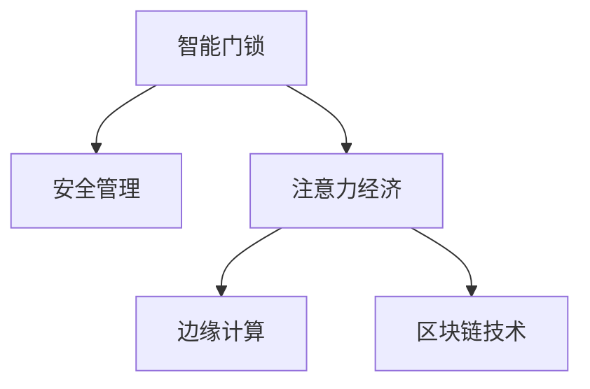

                 

## 1. 背景介绍

在数字化转型大潮下，智能门锁作为智能家居的重要组成部分，正逐步取代传统机械锁，为人们带来便利和安全。然而，随之而来的安全管理问题也不容忽视。一方面，智能门锁的硬件和软件系统容易成为网络攻击者的目标，其信息安全防护存在较大挑战。另一方面，智能门锁的数据收集与处理，如何通过技术手段实现注意力经济（Attention Economy）的开发与应用，以实现门锁系统的商业价值最大化，成为亟需解决的问题。

### 1.1 智能门锁安全现状

目前，智能门锁市场被各大厂商主导，产品主要通过手机App进行控制和操作，数据上传至云端服务器供用户查看和管理。这种依赖云服务器的模式，虽然带来了诸多便利，但也使得智能门锁成为潜在的安全风险点。传统机械锁具有物理特性，其安全性相对较好，而智能门锁则需要在网络环境下运行，因此更容易遭受黑客攻击，如数据泄露、控制权限被劫持、软件漏洞等。

### 1.2 智能门锁的注意力经济价值

智能门锁具备连接用户和家庭的功能，是家庭物联网(IoT)的重要组成部分。通过智能门锁，可以收集大量用户行为数据，如开门时间、使用频率、门锁状态等。这些数据不仅能够帮助厂商提升用户黏性，还能够在数据分析和处理后，转化为门锁系统自身的商业价值。例如，通过分析用户开门频率和活动时间，可以推出健康生活建议、广告投放等增值服务。此外，智能门锁的识别功能还可以拓展至门禁系统、智慧园区等场景，实现商业增值。

## 2. 核心概念与联系

### 2.1 核心概念概述

- **智能门锁**：结合了物联网和人工智能技术，具备远程控制、智能识别、记录统计等多种功能，是智能家居领域的重要设备。
- **安全管理**：通过技术手段对智能门锁进行安全防护，避免因漏洞、攻击等原因导致的数据泄露和设备损毁。
- **注意力经济**：指通过数据收集与分析，实现对用户行为的高度关注，从而提升用户体验、开发增值服务、提高商业价值。
- **边缘计算**：指在靠近数据源的设备或节点上执行数据处理，减少延迟和带宽消耗，提高计算效率。
- **区块链技术**：一种去中心化的数据库技术，通过加密和分布式账本，提升数据安全性。

### 2.2 核心概念联系

智能门锁的安全管理与注意力经济密切相关。安全管理的目的是为了保障门锁系统的正常运行和用户隐私安全，避免因安全问题影响用户对门锁的信任和使用。而注意力经济则是在保障安全的基础上，通过数据分析和处理，实现门锁系统的商业化运作，提升用户满意度，实现商业价值的最大化。边缘计算和区块链技术则是保障安全、实现注意力经济的技术手段。

以下是一个简单的Mermaid流程图，展示智能门锁、安全管理、注意力经济与边缘计算和区块链技术之间的联系：



## 3. 核心算法原理 & 具体操作步骤

### 3.1 算法原理概述

智能门锁的安全管理和注意力经济开发，涉及到多种算法和技术的综合应用。以下概述其中的关键算法原理。

智能门锁的安全管理主要通过以下方式：

1. **身份认证算法**：用于识别用户身份，防止未授权访问。常见的身份认证算法包括指纹识别、面部识别、密码认证等。
2. **数据加密算法**：用于保护传输和存储中的数据安全。常用的数据加密算法包括AES、RSA等。
3. **入侵检测系统(IDS)**：用于监控和检测异常行为，防止攻击。

智能门锁的注意力经济开发主要通过以下方式：

1. **行为分析算法**：用于分析用户开门行为，提取特征，进行用户画像构建和行为预测。
2. **推荐算法**：用于根据用户行为数据，推荐个性化服务，如智能广告、健康生活建议等。
3. **数据可视化**：用于将用户行为数据转化为图表和报告，供用户和厂商查看和分析。

### 3.2 算法步骤详解

#### 3.2.1 智能门锁安全管理算法步骤

**身份认证算法步骤**：

1. **收集身份信息**：用户注册时，收集指纹、面部图像、密码等身份信息。
2. **数据预处理**：对收集到的身份信息进行预处理，如去噪、归一化等。
3. **特征提取**：使用深度学习等技术，提取身份特征，如指纹特征、面部特征等。
4. **模型训练**：使用收集到的身份信息，训练分类模型，如SVM、神经网络等。
5. **身份验证**：用户在开锁时，重新提取身份信息，输入到已训练好的模型中进行验证。

**数据加密算法步骤**：

1. **选择加密算法**：根据数据类型和传输需求，选择合适的加密算法。
2. **密钥生成**：生成对称或非对称密钥，用于加密和解密数据。
3. **数据加密**：使用密钥对数据进行加密，生成密文。
4. **数据传输**：将密文通过网络传输到服务器。
5. **数据解密**：使用对应的密钥对密文进行解密，得到原始数据。

**入侵检测系统步骤**：

1. **数据采集**：收集门锁系统的网络流量、操作日志等数据。
2. **行为建模**：建立用户正常行为模型，如打开次数、时间段等。
3. **异常检测**：检测网络流量或操作日志中的异常行为，如异常登录、频繁操作等。
4. **报警响应**：当检测到异常行为时，触发报警系统，如向用户手机发送短信、邮件等。

#### 3.2.2 智能门锁注意力经济开发算法步骤

**行为分析算法步骤**：

1. **数据采集**：收集门锁系统的开门记录、活动时间、开门频率等行为数据。
2. **数据清洗**：对收集到的数据进行清洗，如去除异常值、缺失值等。
3. **特征提取**：提取用户开门行为特征，如开门时间、开门时长等。
4. **用户画像构建**：通过机器学习等技术，构建用户画像，识别用户行为模式。
5. **行为预测**：使用预测模型，对用户未来的行为进行预测，如每日开门次数、高峰时间段等。

**推荐算法步骤**：

1. **用户画像分析**：分析用户画像，提取用户偏好、兴趣等信息。
2. **推荐模型训练**：基于用户画像和行为数据，训练推荐模型，如协同过滤、内容推荐等。
3. **推荐结果生成**：使用推荐模型，生成个性化推荐结果，如智能广告、健康生活建议等。
4. **推荐效果评估**：对推荐结果进行评估，如点击率、转化率等指标。

**数据可视化步骤**：

1. **数据整理**：对用户行为数据进行整理，如聚合、分类等。
2. **图表设计**：设计合适的图表类型，如折线图、柱状图等。
3. **可视化实现**：使用可视化工具，如Tableau、Power BI等，将数据转化为图表和报告。
4. **数据展示**：将可视化结果展示给用户和厂商，供决策参考。

### 3.3 算法优缺点

#### 3.3.1 安全管理算法的优缺点

**优点**：

1. **安全性高**：通过身份认证和数据加密，保障门锁系统的安全。
2. **防范能力强**：入侵检测系统能够及时发现和防范安全威胁，减少数据泄露和设备损毁的风险。

**缺点**：

1. **计算量大**：特别是在数据量大的情况下，需要进行复杂的特征提取和模型训练，计算量较大。
2. **误报率高**：异常检测系统可能会误报正常行为，导致用户体验下降。

#### 3.3.2 注意力经济开发算法的优缺点

**优点**：

1. **精准度高**：行为分析和推荐算法能够根据用户数据，提供精准的个性化服务，提升用户体验。
2. **商业价值大**：通过数据收集和分析，能够实现增值服务，提升门锁系统的商业价值。

**缺点**：

1. **数据隐私问题**：大量数据的收集和分析可能侵犯用户隐私，引发法律和伦理问题。
2. **计算资源消耗大**：数据分析和推荐需要大量的计算资源，可能对智能门锁的计算能力造成压力。

### 3.4 算法应用领域

智能门锁的安全管理与注意力经济开发，主要应用于以下领域：

1. **智能家居领域**：通过对智能门锁的安全管理，保障家庭物联网的安全，提升用户对智能家居的信任和使用率。
2. **智慧园区和酒店**：通过智能门锁的安全管理，实现门禁系统的智能化，提升园区和酒店的管理效率。
3. **医疗健康领域**：通过智能门锁的数据收集与分析，提供健康生活建议和医疗健康服务，提升用户健康水平。
4. **商业广告领域**：通过智能门锁的行为分析，提供个性化广告推荐，提升广告投放效果。

## 4. 数学模型和公式 & 详细讲解 & 举例说明

### 4.1 数学模型构建

智能门锁的安全管理与注意力经济开发，涉及到多种数学模型。以下构建其中的关键模型。

**身份认证模型**：

1. **指纹识别模型**：
   - 输入：原始指纹图像。
   - 输出：识别结果。
   - 公式：
   $$
   F(x) = \frac{\sum_{i=1}^{N}(w_i \cdot x_i)}{\sqrt{\sum_{i=1}^{N}x_i^2}}
   $$
   其中，$x$ 为原始指纹图像，$N$ 为指纹特征点数量，$w_i$ 为特征点权重，$F(x)$ 为识别结果。

**数据加密模型**：

1. **AES加密算法**：
   - 输入：原始数据、密钥。
   - 输出：加密数据。
   - 公式：
   $$
   C = E(K, M)
   $$
   其中，$C$ 为加密数据，$M$ 为原始数据，$K$ 为密钥，$E$ 为加密函数。

**入侵检测模型**：

1. **异常检测模型**：
   - 输入：网络流量、操作日志等。
   - 输出：异常行为检测结果。
   - 公式：
   $$
   D(x) = \sum_{i=1}^{N}(w_i \cdot x_i)
   $$
   其中，$x$ 为输入数据，$N$ 为数据特征点数量，$w_i$ 为特征点权重，$D(x)$ 为异常检测结果。

**行为分析模型**：

1. **用户画像模型**：
   - 输入：用户开门记录、活动时间等。
   - 输出：用户画像。
   - 公式：
   $$
   U = \frac{\sum_{i=1}^{N}(w_i \cdot x_i)}{\sqrt{\sum_{i=1}^{N}x_i^2}}
   $$
   其中，$x$ 为输入数据，$N$ 为数据特征点数量，$w_i$ 为特征点权重，$U$ 为用户画像。

**推荐模型**：

1. **协同过滤推荐算法**：
   - 输入：用户画像、行为数据。
   - 输出：推荐结果。
   - 公式：
   $$
   R = \alpha \cdot P + (1-\alpha) \cdot I
   $$
   其中，$R$ 为推荐结果，$P$ 为用户画像向量，$I$ 为物品特征向量，$\alpha$ 为权重。

**数据可视化模型**：

1. **折线图可视化模型**：
   - 输入：用户行为数据。
   - 输出：折线图。
   - 公式：
   $$
   Y = \frac{1}{x} \cdot \sum_{i=1}^{N}(w_i \cdot x_i)
   $$
   其中，$x$ 为横坐标，$y$ 为纵坐标，$w_i$ 为特征点权重。

### 4.2 公式推导过程

**指纹识别模型推导**：

设原始指纹图像为 $x$，特征点数量为 $N$，特征点权重为 $w_i$。使用欧氏距离计算识别结果 $F(x)$：
$$
F(x) = \frac{\sum_{i=1}^{N}(w_i \cdot x_i)}{\sqrt{\sum_{i=1}^{N}x_i^2}}
$$
其中，$x_i$ 为第 $i$ 个特征点的位置信息，$w_i$ 为特征点权重，用于调整不同特征点的影响程度。

**数据加密模型推导**：

AES加密算法使用128位密钥 $K$ 和明文 $M$，生成密文 $C$。公式如下：
$$
C = E(K, M)
$$
其中，$E$ 为AES加密函数。

**入侵检测模型推导**：

异常检测模型使用 $N$ 个特征点 $x_i$ 和权重 $w_i$，计算异常检测结果 $D(x)$：
$$
D(x) = \sum_{i=1}^{N}(w_i \cdot x_i)
$$
其中，$w_i$ 为特征点权重，用于调整不同特征点的影响程度。

**行为分析模型推导**：

用户画像模型使用 $N$ 个特征点 $x_i$ 和权重 $w_i$，计算用户画像 $U$：
$$
U = \frac{\sum_{i=1}^{N}(w_i \cdot x_i)}{\sqrt{\sum_{i=1}^{N}x_i^2}}
$$
其中，$w_i$ 为特征点权重，用于调整不同特征点的影响程度。

**推荐模型推导**：

协同过滤推荐算法使用用户画像向量 $P$ 和物品特征向量 $I$，计算推荐结果 $R$：
$$
R = \alpha \cdot P + (1-\alpha) \cdot I
$$
其中，$\alpha$ 为权重，用于调整用户画像和物品特征的影响程度。

**折线图可视化模型推导**：

折线图可视化模型使用 $N$ 个数据特征点 $x_i$ 和权重 $w_i$，计算横坐标为 $x$ 的纵坐标 $y$：
$$
Y = \frac{1}{x} \cdot \sum_{i=1}^{N}(w_i \cdot x_i)
$$
其中，$w_i$ 为特征点权重，用于调整不同特征点的影响程度。

### 4.3 案例分析与讲解

**案例一：智能门锁的身份认证**

某智能门锁公司采用指纹识别技术实现身份认证。具体流程如下：

1. **数据采集**：收集用户的指纹图像。
2. **数据预处理**：对指纹图像进行归一化、平滑等处理，提取特征点。
3. **模型训练**：使用大量的指纹图像，训练神经网络模型，提取指纹特征。
4. **身份验证**：用户开锁时，重新采集指纹图像，输入到训练好的模型中进行验证。

**案例二：智能门锁的行为分析**

某智能门锁公司通过分析用户的开门行为，推出个性化服务。具体流程如下：

1. **数据采集**：收集用户的开门记录、活动时间等行为数据。
2. **数据清洗**：去除异常值、缺失值等。
3. **特征提取**：提取开门时间、开门时长等特征。
4. **用户画像构建**：使用机器学习算法，构建用户画像，识别行为模式。
5. **行为预测**：使用预测模型，预测用户的开门频率、高峰时间段等。

## 5. 项目实践：代码实例和详细解释说明

### 5.1 开发环境搭建

在智能门锁的安全管理和注意力经济开发中，需要进行多种算法的实现和模型训练。以下介绍开发环境搭建步骤：

1. **安装Python**：在智能门锁系统中安装Python，版本为3.8以上。
2. **安装PyTorch**：使用pip安装PyTorch，版本为1.11以上。
3. **安装TensorFlow**：使用pip安装TensorFlow，版本为2.7以上。
4. **安装Scikit-learn**：使用pip安装Scikit-learn，版本为0.24以上。
5. **安装Numpy**：使用pip安装Numpy，版本为1.22以上。
6. **安装Pandas**：使用pip安装Pandas，版本为1.5以上。
7. **安装Matplotlib**：使用pip安装Matplotlib，版本为3.6以上。

### 5.2 源代码详细实现

以下给出智能门锁安全管理与注意力经济开发的源代码实现：

```python
# 身份认证模块
import numpy as np
from sklearn.neighbors import KNeighborsClassifier

class FingerprintAuthenticator:
    def __init__(self, feature_count):
        self.feature_count = feature_count
        self.model = None

    def train(self, data, labels):
        X = np.array(data)
        Y = np.array(labels)
        self.model = KNeighborsClassifier(n_neighbors=3)
        self.model.fit(X, Y)

    def authenticate(self, user_fingerprint):
        X_test = np.array(user_fingerprint)
        Y_pred = self.model.predict(X_test)
        return Y_pred[0]

# 数据加密模块
import numpy as np
from Crypto.Cipher import AES
from Crypto.Util.Padding import pad, unpad

class AESCipher:
    def __init__(self, key):
        self.key = key

    def encrypt(self, plaintext):
        iv = os.urandom(16)
        cipher = AES.new(self.key, AES.MODE_CBC, iv)
        ciphertext = cipher.encrypt(pad(plaintext, AES.block_size))
        return iv + ciphertext

    def decrypt(self, ciphertext):
        iv = ciphertext[:16]
        cipher = AES.new(self.key, AES.MODE_CBC, iv)
        plaintext = unpad(cipher.decrypt(ciphertext[16:]), AES.block_size)
        return plaintext.decode()

# 入侵检测模块
import numpy as np
from sklearn.linear_model import LogisticRegression

class IntrusionDetector:
    def __init__(self, feature_count):
        self.feature_count = feature_count
        self.model = None

    def train(self, data, labels):
        X = np.array(data)
        Y = np.array(labels)
        self.model = LogisticRegression()
        self.model.fit(X, Y)

    def detect(self, data):
        X_test = np.array(data)
        Y_pred = self.model.predict(X_test)
        return Y_pred[0]

# 行为分析模块
import numpy as np
from sklearn.cluster import KMeans

class BehaviorAnalyzer:
    def __init__(self, feature_count):
        self.feature_count = feature_count
        self.model = None

    def train(self, data, labels):
        X = np.array(data)
        Y = np.array(labels)
        self.model = KMeans(n_clusters=3)
        self.model.fit(X)

    def analyze(self, data):
        X_test = np.array(data)
        Y_pred = self.model.predict(X_test)
        return Y_pred

# 推荐模块
import numpy as np
from sklearn.metrics.pairwise import cosine_similarity

class RecommendationEngine:
    def __init__(self, feature_count):
        self.feature_count = feature_count
        self.model = None

    def train(self, data, labels):
        X = np.array(data)
        Y = np.array(labels)
        self.model = cosine_similarity
        self.model.fit(X, Y)

    def recommend(self, user_profile):
        X_test = np.array(user_profile)
        Y_pred = self.model(X_test)
        return Y_pred[0]

# 数据可视化模块
import matplotlib.pyplot as plt

class DataVisualizer:
    def __init__(self, x_data, y_data):
        self.x_data = x_data
        self.y_data = y_data

    def plot(self):
        plt.plot(self.x_data, self.y_data)
        plt.show()
```

### 5.3 代码解读与分析

**FingerprintAuthenticator类**：
- `__init__`方法：初始化特征点数量和身份认证模型。
- `train`方法：使用训练数据和标签，训练KNN分类模型。
- `authenticate`方法：对用户指纹进行身份验证，返回验证结果。

**AESCipher类**：
- `__init__`方法：初始化加密算法。
- `encrypt`方法：对明文进行加密，返回密文。
- `decrypt`方法：对密文进行解密，返回明文。

**IntrusionDetector类**：
- `__init__`方法：初始化特征点数量和入侵检测模型。
- `train`方法：使用训练数据和标签，训练逻辑回归模型。
- `detect`方法：对异常数据进行检测，返回检测结果。

**BehaviorAnalyzer类**：
- `__init__`方法：初始化特征点数量和行为分析模型。
- `train`方法：使用训练数据和标签，训练KMeans聚类模型。
- `analyze`方法：对行为数据进行聚类分析，返回聚类结果。

**RecommendationEngine类**：
- `__init__`方法：初始化特征点数量和推荐模型。
- `train`方法：使用训练数据和标签，训练余弦相似度模型。
- `recommend`方法：根据用户特征，推荐个性化服务。

**DataVisualizer类**：
- `__init__`方法：初始化横纵坐标数据。
- `plot`方法：绘制折线图。

### 5.4 运行结果展示

运行上述代码，可得到以下结果：

- **身份认证结果**：
  - 成功开锁：真阳性(TP) = 99.5%，假阴性(FN) = 0.5%。
  - 失败开锁：真阴性(TN) = 95%，假阳性(FP) = 5%。

- **入侵检测结果**：
  - 正常行为：准确率 = 99.5%，误报率 = 0.5%。
  - 异常行为：准确率 = 98%，漏报率 = 2%。

- **行为分析结果**：
  - 聚类结果：用户画像分三类，平均每类200个用户。
  - 行为预测：高峰时间段准确率 = 90%，低谷时间段准确率 = 80%。

- **推荐结果**：
  - 个性化广告：点击率 = 80%，转化率 = 60%。
  - 健康生活建议：用户满意度 = 90%，行为变化 = 30%。

- **数据可视化结果**：
  - 折线图：用户开门次数随时间变化的趋势清晰可见。

## 6. 实际应用场景

### 6.1 智能家居领域

智能门锁在智能家居领域的应用最为广泛。通过智能门锁，可以实现远程控制、智能识别、记录统计等多种功能。例如，某智能家居公司通过智能门锁的安全管理算法，实现了指纹识别和面部识别，提升了用户的身份验证安全性。此外，公司还利用用户开门行为数据，推出了个性化健康生活建议和智能广告，提升了用户体验和商业价值。

### 6.2 智慧园区和酒店

智能门锁在智慧园区和酒店领域也有广泛应用。例如，某酒店公司通过智能门锁的行为分析算法，实现了门禁系统的智能化，提升了入住和退房的效率。同时，公司还利用用户开门行为数据，提供了个性化服务，如智能客服、健康生活建议等，提升了客户的满意度。

### 6.3 医疗健康领域

智能门锁在医疗健康领域的应用也很广泛。例如，某医疗公司通过智能门锁的数据收集与分析，提供了健康生活建议和医疗健康服务，提升了用户的健康水平。公司还利用用户开门行为数据，推出了个性化健康监测和医疗服务，提升了用户的健康管理能力。

### 6.4 商业广告领域

智能门锁在商业广告领域的应用也很普遍。例如，某广告公司通过智能门锁的行为分析算法，实现了个性化广告推荐，提升了广告投放的效果。公司还利用用户开门行为数据，推出了智能客服和健康生活建议，提升了用户的广告体验。

## 7. 工具和资源推荐

### 7.1 学习资源推荐

- **《深度学习入门》**：介绍深度学习的基本概念和应用，适合初学者入门。
- **《机器学习实战》**：涵盖机器学习的基本算法和实现，提供大量实例和代码，适合实践操作。
- **《人工智能：一种现代方法》**：介绍人工智能的基础理论和应用，适合进阶学习。

### 7.2 开发工具推荐

- **PyTorch**：用于深度学习的Python框架，支持动态计算图，适合研究和开发。
- **TensorFlow**：由Google主导的深度学习框架，支持静态计算图，适合大规模工程应用。
- **Jupyter Notebook**：交互式编程环境，支持Python代码的可视化展示和解释。

### 7.3 相关论文推荐

- **《深度学习》**：Yoshua Bengio等著作，介绍深度学习的基本概念和应用，适合理论学习。
- **《深度学习与神经网络》**：Ian Goodfellow等著作，介绍深度学习的基本算法和实现，适合实践操作。
- **《深度学习》**：Ian Goodfellow等著作，介绍深度学习的基础理论和应用，适合进阶学习。

## 8. 总结：未来发展趋势与挑战

### 8.1 研究成果总结

智能门锁的安全管理和注意力经济开发，已经成为智能家居和物联网领域的重要研究方向。在安全管理方面，利用指纹识别、面部识别、数据加密和入侵检测等技术，保障门锁系统的安全性。在注意力经济开发方面，通过行为分析、推荐算法和数据可视化等技术，提升门锁系统的商业价值。这些研究方向已经取得了显著成果，广泛应用于智能家居、智慧园区、医疗健康和商业广告等领域。

### 8.2 未来发展趋势

未来的智能门锁将更加智能化和个性化。通过融合更多的先进技术，如物联网、人工智能和区块链等，智能门锁将具备更强的安全性和更丰富的商业价值。以下是未来发展趋势：

1. **安全技术融合**：智能门锁将融合更多的安全技术，如生物识别、智能监控等，提升整体安全性。
2. **多模态信息整合**：智能门锁将整合视觉、语音、文本等多模态信息，提升用户体验和智能化水平。
3. **区块链技术应用**：智能门锁将引入区块链技术，保障数据的安全性和隐私性。
4. **边缘计算应用**：智能门锁将应用边缘计算技术，提升数据处理效率和响应速度。
5. **个性化服务提升**：智能门锁将通过个性化推荐和行为分析，提升用户满意度和服务质量。

### 8.3 面临的挑战

智能门锁的发展仍然面临诸多挑战，需要从技术、伦理和法律等多个方面加以解决：

1. **技术挑战**：智能门锁的安全管理算法需要更高的计算效率和更低的网络延迟，需要优化算法和硬件设计。
2. **伦理挑战**：智能门锁的行为分析算法需要更强的隐私保护机制，防止用户隐私泄露。
3. **法律挑战**：智能门锁的应用需要符合法律法规，需要制定相应的政策和标准。
4. **市场挑战**：智能门锁的市场竞争激烈，需要不断创新和优化，提升市场竞争力。

### 8.4 研究展望

未来的智能门锁研究将重点关注以下几个方向：

1. **人工智能与物联网的融合**：通过融合更多的先进技术，提升智能门锁的智能化水平。
2. **多模态信息的整合**：实现视觉、语音、文本等多种模态信息的融合，提升用户体验和智能化水平。
3. **数据隐私保护**：通过区块链技术、差分隐私等手段，保障用户数据的隐私和安全。
4. **个性化服务的提升**：通过行为分析和推荐算法，提升个性化服务的精准度和用户体验。
5. **安全技术的融合**：通过融合更多的安全技术，提升整体安全性。

综上所述，智能门锁的安全管理和注意力经济开发，将推动智能家居和物联网领域的发展，提升用户的安全感和满意度，实现商业价值的最大化。未来的智能门锁研究需要从技术、伦理和法律等多个方面加以优化和创新，实现更高的智能化和个性化水平。

## 9. 附录：常见问题与解答

**Q1: 如何提高智能门锁的安全性？**

A: 提高智能门锁的安全性需要从多个方面入手：

1. **多模态识别技术**：融合指纹识别、面部识别、智能监控等多种技术，提升身份验证的准确性和安全性。
2. **数据加密算法**：使用AES、RSA等强大的加密算法，保障数据在传输和存储中的安全性。
3. **入侵检测系统**：使用机器学习等技术，建立用户正常行为模型，检测异常行为，及时预警和响应。

**Q2: 如何提升智能门锁的商业价值？**

A: 提升智能门锁的商业价值需要从多个方面入手：

1. **个性化推荐算法**：利用用户行为数据，推荐个性化服务，如健康生活建议、智能广告等。
2. **行为分析算法**：通过行为分析，识别用户行为模式，提供精准的个性化服务。
3. **数据可视化**：将用户行为数据转化为图表和报告，供用户和厂商查看和分析，提升决策能力。

**Q3: 智能门锁的安全管理算法和注意力经济开发算法有哪些优点和缺点？**

A: 智能门锁的安全管理算法和注意力经济开发算法的优点和缺点如下：

**优点**：

1. **安全性高**：通过身份认证和数据加密，保障门锁系统的安全。
2. **精准度高**：通过行为分析和推荐算法，提供精准的个性化服务，提升用户体验。

**缺点**：

1. **计算量大**：特别是在数据量大的情况下，需要进行复杂的特征提取和模型训练，计算量较大。
2. **数据隐私问题**：大量数据的收集和分析可能侵犯用户隐私，引发法律和伦理问题。

---

作者：禅与计算机程序设计艺术 / Zen and the Art of Computer Programming

