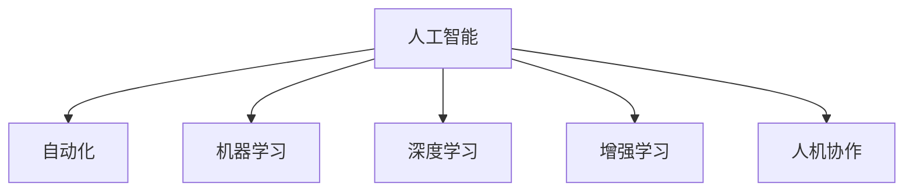

                 

## 1. 背景介绍

### 1.1 问题由来

随着人工智能技术的迅猛发展，越来越多的自动化和智能化应用开始广泛应用于各行各业。从工厂的自动化生产线到医疗的智能诊断系统，从智能客服到虚拟助理，人工智能正在以各种方式改变着人类的工作和生活。然而，这些技术的发展也引发了关于未来职业前景的广泛讨论。未来，人类如何与AI共存？职业生态将如何变化？这是当下我们需要深入思考的问题。

### 1.2 问题核心关键点

AI技术的引入，特别是在工作场景中的应用，将会带来以下核心变化：

1. **工作流程自动化**：许多重复性、低附加值的工作将被自动化系统所取代，提高效率并降低人力成本。
2. **技能要求更新**：人工智能将要求工作岗位上的员工具备更多技术知识和技能，以便与AI协作。
3. **工作模式变革**：团队协作将更多依赖AI工具，而非传统的集中办公模式。
4. **新职业的诞生**：随着新技术的发展，将涌现出许多新的职业角色，如数据科学家、AI工程师等。

### 1.3 问题研究意义

研究未来工作的人机协作模式，对于理解AI技术的潜在影响，优化职业培训计划，以及构建更和谐的人机共存环境，具有重要的理论和实践意义。通过探索人机协作的最佳实践，我们可以更好地适应AI带来的变革，推动社会经济的健康发展。

## 2. 核心概念与联系

### 2.1 核心概念概述

为更好地理解未来工作的人机协作模式，本节将介绍几个关键概念：

- **人工智能（AI）**：利用计算机技术模拟人类智能过程，包括感知、学习、推理、决策等能力的理论、开发和应用。
- **自动化**：通过技术手段，自动完成或辅助完成原本需要人工介入的工作流程，减少人力成本，提高效率。
- **人机协作（Human-AI Collaboration）**：人类与人工智能系统之间的互动合作，共同完成任务，提升工作效率和质量。
- **机器学习（Machine Learning）**：通过数据训练，使计算机系统具备自主学习和改进能力，从而实现智能决策。
- **深度学习（Deep Learning）**：利用多层次神经网络模型进行复杂数据处理和模式识别，是机器学习的重要分支。
- **增强学习（Reinforcement Learning）**：通过试错学习，使机器系统在与环境的交互中不断优化行为策略，适用于复杂的决策任务。

这些概念之间的逻辑关系可以通过以下Mermaid流程图来展示：



这个流程图展示了人工智能技术的主要分支及其相互关系，共同构成了未来工作人机协作的基础。

## 3. 核心算法原理 & 具体操作步骤
### 3.1 算法原理概述

人机协作的核心在于将人工智能技术与人类智能相结合，共同完成复杂任务。这一过程中，AI提供数据处理、决策支持等技术手段，而人类则负责情境理解、判断与决策。在人机协作中，人工智能系统通常通过以下步骤完成任务：

1. **数据收集与预处理**：收集相关数据，并进行清洗、特征提取等预处理，为机器学习模型提供高质量输入。
2. **模型训练与优化**：利用监督学习、无监督学习或增强学习等技术，训练AI模型以适应具体任务。
3. **决策支持与反馈**：AI模型根据输入数据生成预测或决策，同时接收人类反馈，不断优化模型。
4. **协作执行与迭代**：在AI系统的辅助下，人类进行任务执行，并在过程中不断迭代模型，提升协作效率和效果。

### 3.2 算法步骤详解

以下以一个典型的制造业生产调度为例，详细阐述人机协作的算法步骤：

**Step 1: 数据收集与预处理**

- 收集历史生产数据，包括生产设备状态、原材料供应、订单信息等。
- 对数据进行清洗和标准化处理，去除异常值和噪音，提取关键特征。
- 使用数据增强技术，如数据扩充、异常检测等，提高数据的多样性和质量。

**Step 2: 模型训练与优化**

- 选择合适的机器学习模型，如随机森林、神经网络等，进行训练。
- 利用历史数据训练模型，并通过交叉验证等技术优化模型参数。
- 引入监督学习、无监督学习或增强学习等方法，提高模型泛化能力。
- 在训练过程中，不断调整模型结构，提高预测精度和稳定性。

**Step 3: 决策支持与反馈**

- 将训练好的模型应用于生产调度任务中，进行实时预测和决策。
- 通过可视化的界面，展示预测结果，供生产调度人员参考。
- 收集生产人员的反馈，识别模型预测的偏差和误差。
- 根据反馈调整模型参数，进行模型迭代和优化。

**Step 4: 协作执行与迭代**

- 生产调度人员根据AI系统的预测和建议，进行生产任务分配和执行。
- 在执行过程中，AI系统持续监控生产状态，提供实时调整建议。
- 通过不断的协作与反馈，逐步提升生产调度的效率和准确性。
- 定期回顾协作过程，总结经验教训，进一步优化协作策略。

### 3.3 算法优缺点

人机协作具有以下优点：

1. **效率提升**：自动化处理大量重复性任务，提高整体工作效率。
2. **决策优化**：通过数据驱动和机器学习，提升决策的科学性和准确性。
3. **人机互补**：将人类智能与AI技术相结合，形成优势互补，共同应对复杂问题。
4. **灵活性增强**：AI系统能够灵活适应不同情境和任务，提升工作灵活性。

然而，人机协作也存在以下挑战：

1. **技术依赖**：过度依赖AI系统，可能导致人类技能退化。
2. **数据安全**：收集和处理敏感数据时，需注意数据隐私和安全问题。
3. **系统可靠**：AI系统的稳定性和可靠性直接影响协作效果。
4. **人机信任**：建立和维护人机之间的信任关系，是协作成功的关键。
5. **伦理问题**：AI决策透明性和可解释性不足，可能引发伦理和法律问题。

### 3.4 算法应用领域

人机协作技术在多个领域得到了广泛应用，例如：

- **医疗健康**：智能诊断系统、个性化治疗方案推荐、手术辅助等。
- **制造业**：生产调度、质量控制、设备维护等。
- **金融服务**：风险评估、投资建议、客户服务机器人等。
- **教育培训**：个性化学习路径规划、智能评估系统、虚拟教师等。
- **物流运输**：路线规划、货物配送、无人驾驶等。
- **市场营销**：客户行为分析、广告推荐、智能客服等。

这些领域的人机协作实践，展示了AI技术在提升效率、优化决策和增强灵活性方面的巨大潜力。

## 4. 数学模型和公式 & 详细讲解  
### 4.1 数学模型构建

在人机协作中，数学模型通常用于描述和优化任务执行过程。以下以生产调度为例，构建数学模型：

设 $X$ 为输入数据集合，$Y$ 为输出目标集合。生产调度任务的目标是找到一个最优策略 $f: X \rightarrow Y$，使得生产效率最大化。

**目标函数**：
$$
\text{Maximize } \sum_{x \in X} f(x)
$$

**约束条件**：
$$
\begin{cases}
f(x) \geq 0 \\
\sum_{x \in X} f(x) = \text{需求量}
\end{cases}
$$

通过求解上述优化问题，可以找到一个最优的生产调度策略。

### 4.2 公式推导过程

在求解上述优化问题时，通常使用动态规划、线性规划等优化技术。以下以线性规划为例，推导求解过程：

**线性规划模型**：
$$
\begin{cases}
\max \sum_{i=1}^n c_i x_i \\
\text{Subject to } A x = b \\
x_i \geq 0
\end{cases}
$$

其中 $c_i$ 为决策变量的系数，$A$ 为约束条件矩阵，$b$ 为约束条件常数。

**优化求解**：
1. 将目标函数和约束条件转化为标准形式。
2. 使用单纯形法或内点法等求解算法，求解线性规划模型。
3. 得到最优解 $x^*$，代入目标函数，计算最优值。

### 4.3 案例分析与讲解

假设一个制造业企业需要进行生产调度，数据集包括订单量、机器状态、工人数量等。

**输入数据**：
- 订单量：每天的需求量。
- 机器状态：每台机器的可用时间。
- 工人数量：每天可投入的工人数量。

**输出目标**：
- 生产计划：每天每台机器的生产任务。
- 工人分配：每天每个工人的工作任务。

**数学模型**：
- 目标函数：$\text{Maximize } \sum_{i=1}^m P_i X_i$，其中 $P_i$ 为机器 $i$ 的单位时间生产量，$X_i$ 为机器 $i$ 的生产时间。
- 约束条件：$\begin{cases} \sum_{i=1}^m X_i = D \\ 0 \leq X_i \leq T_i \end{cases}$，其中 $D$ 为总需求量，$T_i$ 为机器 $i$ 的可用时间。

**求解步骤**：
1. 将生产任务分为若干小任务，分别求解每个小任务的计划。
2. 通过线性规划求解最优解，得到每个小任务的详细计划。
3. 根据机器和工人的可用时间，调整计划，确保实际执行。
4. 实时监控生产状态，根据反馈调整计划。

通过上述模型，可以优化生产调度，提升生产效率和灵活性。

## 5. 项目实践：代码实例和详细解释说明
### 5.1 开发环境搭建

在进行项目实践前，我们需要准备好开发环境。以下是使用Python进行优化问题的开发环境配置流程：

1. 安装Anaconda：从官网下载并安装Anaconda，用于创建独立的Python环境。

2. 创建并激活虚拟环境：
```bash
conda create -n optimization-env python=3.8 
conda activate optimization-env
```

3. 安装优化库和依赖：
```bash
conda install scipy numpy matplotlib scikit-optimize
```

4. 安装可视化和调试工具：
```bash
conda install jupyterlab qtconsole
```

完成上述步骤后，即可在`optimization-env`环境中开始优化问题的开发。

### 5.2 源代码详细实现

以下是使用SciPy库进行线性规划优化的Python代码实现。

```python
import numpy as np
from scipy.optimize import linprog

# 定义决策变量
c = np.array([1, 2, 3, 4])  # 目标函数系数
A = np.array([[1, 1, 0, 0], [0, 0, 1, 1], [1, 0, -1, -1]])  # 约束条件系数矩阵
b = np.array([10, 8, 5])  # 约束条件常数向量
x0_bounds = [(0, 10), (0, 8), (0, 5), (0, 5)]  # 决策变量上下限

# 定义线性规划模型
model = linprog(c, A_ub=A, b_ub=b, bounds=x0_bounds)

# 求解线性规划模型
result = model.solve()

# 输出最优解
print("Optimal value:", result[0])
print("Optimal variables:", result.x)
```

在上述代码中，首先定义了目标函数系数、约束条件系数矩阵和常数向量等模型参数。然后，使用SciPy的linprog函数求解线性规划模型，并输出最优解。

### 5.3 代码解读与分析

以下是关键代码的实现细节：

**决策变量**：
- `c`：目标函数系数，表示每个决策变量的价值。
- `A`：约束条件系数矩阵，表示每个约束条件的系数。
- `b`：约束条件常数向量，表示每个约束条件的常数。

**线性规划模型**：
- `linprog`函数：SciPy提供的线性规划求解器，用于求解线性规划问题。
- `c`、`A_ub`、`b_ub`、`bounds`：模型参数，分别表示目标函数系数、约束条件系数矩阵、约束条件常数向量和决策变量上下限。

**求解过程**：
- `model.solve()`：求解线性规划模型，返回最优解和相关参数。
- `result[0]`：最优值，表示目标函数的最大值。
- `result.x`：最优解，表示每个决策变量的值。

在实际应用中，还需要考虑更多的因素，如模型的迭代求解、模型的收敛性等。

## 6. 实际应用场景
### 6.1 医疗健康

在医疗健康领域，人机协作可以显著提升诊疗效率和诊断准确性。例如，智能诊断系统可以利用机器学习算法分析医学影像、病历数据，提供辅助诊断和预后评估，减轻医生的工作负担。

具体而言，可以收集历史病历和影像数据，训练深度学习模型，用于疾病分类、症状识别等任务。在实际诊疗中，医生可以根据系统的推荐结果，结合自身经验进行诊断和治疗决策。通过不断的反馈和迭代，系统可以不断优化，提升诊断和治疗的效果。

### 6.2 金融服务

在金融服务领域，人机协作可以提高风险评估和投资决策的准确性。例如，智能风险评估系统可以分析客户数据、市场趋势等，提供全面的风险分析报告，辅助银行和保险公司进行决策。

具体而言，可以收集客户的交易记录、信用评分、市场数据等，训练深度学习模型，用于客户信用评估、投资组合优化等任务。在实际应用中，系统可以根据历史数据和实时数据，提供个性化的风险评估报告，供决策者参考。

### 6.3 制造业

在制造业领域，人机协作可以提高生产效率和产品质量。例如，智能生产调度系统可以优化生产计划、资源配置等，减少生产浪费，提升生产效率。

具体而言，可以收集历史生产数据、机器状态、工人数量等，训练优化模型，用于生产调度、设备维护等任务。在实际生产中，系统可以根据实时数据，调整生产计划和资源配置，确保生产任务的按时完成。

## 7. 工具和资源推荐
### 7.1 学习资源推荐

为了帮助开发者系统掌握人机协作的理论基础和实践技巧，这里推荐一些优质的学习资源：

1. 《人机协作：未来工作的新范式》系列博文：由人机协作专家撰写，深入浅出地介绍了人机协作的基本概念和前沿技术。

2. 《人工智能与人类工作》课程：由知名大学开设的公开课程，涵盖人机协作的基本原理和应用案例。

3. 《人机协作实践指南》书籍：详细介绍人机协作的实现方法和案例，适合实践操作。

4. GitHub上的人机协作项目：涵盖多种场景和技术的实践代码，适合学习和借鉴。

通过对这些资源的学习实践，相信你一定能够快速掌握人机协作的精髓，并用于解决实际的业务问题。

### 7.2 开发工具推荐

高效的开发离不开优秀的工具支持。以下是几款用于人机协作开发的常用工具：

1. Python：作为数据科学和机器学习的常用语言，Python拥有丰富的库和框架，适合人机协作的开发。

2. Scikit-learn：Python的机器学习库，提供各种机器学习算法和工具，适合数据预处理和模型训练。

3. TensorFlow：由Google主导开发的深度学习框架，支持分布式计算和模型优化，适合复杂任务的处理。

4. Jupyter Notebook：交互式编程环境，适合数据探索和模型调试，方便共享和学习。

5. Kaggle：数据科学竞赛平台，提供大量的数据集和案例，适合学习和实践。

合理利用这些工具，可以显著提升人机协作的开发效率，加快创新迭代的步伐。

### 7.3 相关论文推荐

人机协作技术的发展源于学界的持续研究。以下是几篇奠基性的相关论文，推荐阅读：

1. 《人机协作：原理与技术》：综述了人机协作的基本原理和技术进展，适合深入学习。

2. 《人机协作的伦理与法律问题》：探讨人机协作的伦理和法律问题，适合理解人机协作的社会影响。

3. 《人机协作的挑战与机遇》：分析人机协作面临的挑战和未来发展方向，适合前瞻性思考。

这些论文代表了自己领域的研究进展，通过学习这些前沿成果，可以帮助研究者把握学科前进方向，激发更多的创新灵感。

## 8. 总结：未来发展趋势与挑战
### 8.1 总结

本文对未来工作的人机协作模式进行了全面系统的介绍。首先阐述了人机协作的背景和意义，明确了AI技术引入后的职业变化趋势。其次，从原理到实践，详细讲解了人机协作的数学模型和实现步骤，给出了具体的应用案例。同时，本文还广泛探讨了人机协作在医疗、金融、制造等多个领域的应用前景，展示了人机协作技术的广泛应用。此外，本文精选了人机协作技术的各类学习资源，力求为读者提供全方位的技术指引。

通过本文的系统梳理，可以看到，人机协作技术正在成为工作中的重要工具，极大地提升了工作效率和决策质量。未来，伴随技术进步和应用场景的不断拓展，人机协作将更加普及和深入，引领工作模式的变革。

### 8.2 未来发展趋势

展望未来，人机协作技术将呈现以下几个发展趋势：

1. **智能决策辅助**：AI系统将更多地参与决策过程，提供全面的数据支持和分析报告，提升决策的科学性和效率。
2. **自动化水平提升**：更多重复性、低附加值的任务将由AI系统自动完成，人类专注于创新和复杂问题解决。
3. **协作模式多样化**：人机协作将从简单的任务执行，转向更加复杂的决策支持、协作设计等。
4. **技能要求更新**：员工需要掌握更多的技术知识和技能，以适应新的工作模式和职业要求。
5. **伦理与法律监管**：人机协作需要更加注重伦理和法律问题，确保AI决策的透明性和可解释性。
6. **社会认知提升**：社会将更加关注人机协作的影响，推动技术与人文融合，实现科技与人性的和谐共存。

以上趋势凸显了人机协作技术的广阔前景。这些方向的探索发展，必将进一步提升工作效率和质量，推动社会经济的持续发展。

### 8.3 面临的挑战

尽管人机协作技术已经取得了显著成就，但在迈向更加智能化、普适化应用的过程中，它仍面临诸多挑战：

1. **技术依赖**：过度依赖AI系统，可能导致人类技能退化，甚至产生依赖性。
2. **数据安全**：收集和处理敏感数据时，需注意数据隐私和安全问题。
3. **系统可靠性**：AI系统的稳定性和可靠性直接影响协作效果，需要持续优化和改进。
4. **人机信任**：建立和维护人机之间的信任关系，是协作成功的关键。
5. **伦理问题**：AI决策透明性和可解释性不足，可能引发伦理和法律问题。

### 8.4 研究展望

面对人机协作面临的这些挑战，未来的研究需要在以下几个方面寻求新的突破：

1. **技术与伦理结合**：在技术开发中注重伦理考量，确保AI决策的透明性和可解释性。
2. **强化学习与优化结合**：利用强化学习优化协作过程，提升决策效率和效果。
3. **跨领域知识融合**：将多领域知识与AI技术结合，提高人机协作的普适性和灵活性。
4. **人机互动界面优化**：设计更加直观、易用的交互界面，提升人机协作的用户体验。
5. **持续学习与改进**：通过不断的反馈和迭代，提升AI系统的学习能力和协作效果。

这些研究方向将有助于进一步推动人机协作技术的发展，为构建安全、可靠、高效的人机共存环境提供新的思路和方案。

## 9. 附录：常见问题与解答

**Q1：人机协作是否适用于所有工作场景？**

A: 人机协作技术适用于需要复杂决策和数据分析的工作场景，如制造业、医疗、金融等。但对于一些需要高度创造性和情感交流的工作，如艺术创作、心理咨询等，人机协作的效果可能有限。

**Q2：如何选择适合的人机协作技术？**

A: 选择人机协作技术需根据具体工作场景和需求进行评估。一般而言，需要考虑以下几个因素：
1. 任务的复杂性和数据量。
2. 对决策准确性和效率的要求。
3. 技术成熟度和可用性。
4. 成本和资源投入。

**Q3：如何提高人机协作的效果？**

A: 提高人机协作效果的方法包括：
1. 优化数据收集和预处理，提高数据质量和多样性。
2. 选择合适的算法和模型，进行模型优化和调参。
3. 建立反馈机制，持续优化协作过程。
4. 设计友好的交互界面，提升用户体验。

**Q4：如何处理人机协作中的数据隐私问题？**

A: 处理数据隐私问题的方法包括：
1. 匿名化处理，去除敏感信息。
2. 加密存储和传输，防止数据泄露。
3. 限制数据访问权限，防止滥用。
4. 透明的数据使用规则，保障用户知情权。

**Q5：如何确保人机协作中的系统可靠性？**

A: 确保系统可靠性的方法包括：
1. 定期进行系统测试和评估，发现和修复问题。
2. 使用容错和冗余设计，提高系统的鲁棒性。
3. 引入监控和预警机制，及时发现和处理异常。
4. 持续改进和优化，提升系统性能和稳定性。

---

作者：禅与计算机程序设计艺术 / Zen and the Art of Computer Programming

