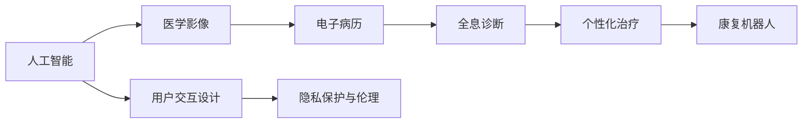

                 

# 未来的智慧医疗：2050年的AI辅助诊断与智能康复机器人

## 1. 背景介绍

### 1.1 问题由来

随着医学影像和电子病历数据的积累，医疗AI应用日益受到重视。AI技术以其强大的数据处理能力和卓越的诊断准确性，在医疗领域展现出了巨大的潜力和应用前景。然而，现有的大多数AI医疗应用仍然存在一些局限性：

1. **数据质量与标注成本**：高质量的医学数据获取成本高昂，标注过程需要医学专家的参与，时间、人力和资源投入较大。
2. **诊断依赖主观判断**：现有的医疗AI系统仍然依赖于医生的主观判断，缺乏对临床实践的全面覆盖和理解。
3. **缺乏个性化治疗方案**：大多数AI系统更多地关注疾病的诊断，而对治疗方案的个性化和动态调整支持不足。
4. **用户交互体验不足**：现有系统多以专家视角设计，对用户（如患者、医护人员）的交互体验不够友好，难以推广应用。
5. **伦理和安全问题**：AI在医疗中的应用涉及患者的隐私、伦理和安全问题，需要严格的监管和标准。

本文旨在探讨如何结合AI和大数据技术，构建智能化的辅助诊断和康复机器人系统，解决上述问题，推动智慧医疗的发展。

### 1.2 问题核心关键点

1. **高质量数据获取**：提高数据标注效率，降低成本，扩大数据覆盖面。
2. **全息诊断**：实现跨模态融合，结合医学影像、文本和遗传数据，进行全面、准确诊断。
3. **个性化治疗**：建立动态治疗方案调整机制，支持个性化治疗。
4. **用户友好设计**：提升用户交互体验，便于普及应用。
5. **隐私保护与伦理**：确保数据安全和隐私保护，遵循伦理标准。

通过解决这些核心关键点，可以实现医疗AI的全面应用，提高医疗服务的质量和效率，减少医疗资源的不平衡。

## 2. 核心概念与联系

### 2.1 核心概念概述

- **人工智能(AI)**：利用机器学习算法模拟人类智能，进行数据处理、模式识别和决策。
- **医学影像(AIM)**：通过图像处理和分析技术，对疾病进行检测、诊断和治疗。
- **电子病历(EMR)**：收集和存储患者健康信息，供医疗系统参考。
- **康复机器人**：结合机器人技术和AI算法，提供个性化的康复训练方案。
- **全息诊断**：跨模态融合不同数据源，提供全面的诊断和治疗建议。
- **个性化治疗**：根据患者的具体情况，提供定制化的治疗方案。
- **用户交互设计**：通过友好的界面和交互方式，提升系统的易用性和普及度。
- **隐私保护与伦理**：确保数据安全，遵循医疗伦理标准。

这些核心概念之间的逻辑关系可以通过以下Mermaid流程图来展示：



## 3. 核心算法原理 & 具体操作步骤

### 3.1 算法原理概述

未来的智慧医疗系统将结合AI和大数据技术，通过跨模态融合、个性化治疗、用户友好设计和隐私保护与伦理等核心算法，实现高效、精准的医疗服务。其核心算法原理如下：

1. **跨模态融合**：通过自然语言处理(NLP)、计算机视觉(CV)等技术，结合医学影像、文本和遗传数据，进行全面、准确诊断。
2. **个性化治疗**：建立动态治疗方案调整机制，根据患者的具体情况，提供定制化的治疗方案。
3. **用户友好设计**：通过友好的界面和交互方式，提升系统的易用性和普及度。
4. **隐私保护与伦理**：确保数据安全，遵循医疗伦理标准。

这些核心算法通过深度学习和强化学习等先进技术实现，具体步骤如下：

### 3.2 算法步骤详解

1. **数据预处理**：对医学影像、电子病历和文本数据进行清洗、标注和标准化处理，提高数据质量。
2. **特征提取与融合**：通过NLP和CV技术，提取文本和影像的特征，进行跨模态融合，生成综合诊断结果。
3. **模型训练**：使用大规模标注数据训练深度学习模型，实现自动诊断和个性化治疗方案的生成。
4. **用户交互设计**：开发友好的用户界面和交互方式，提升用户体验和系统普及度。
5. **隐私保护与伦理**：采用数据加密、匿名化等技术，确保数据安全，遵循医疗伦理标准。

### 3.3 算法优缺点

基于未来智慧医疗系统的核心算法，其优缺点如下：

#### 优点

1. **全面覆盖诊断**：通过跨模态融合，实现对疾病的多维度诊断，提高诊断的全面性和准确性。
2. **个性化治疗**：建立动态调整机制，支持个性化治疗方案，提高治疗效果。
3. **用户友好设计**：提升系统的易用性和普及度，便于医疗服务的推广。
4. **隐私保护**：采用数据加密和匿名化技术，确保数据安全。

#### 缺点

1. **数据获取成本高**：高质量医学数据的获取成本较高，影响系统的普及和应用。
2. **模型复杂度高**：大规模数据和多模态数据融合，需要复杂的算法模型。
3. **伦理问题**：涉及隐私保护和伦理问题，需要严格监管和标准。

### 3.4 算法应用领域

未来智慧医疗系统将广泛应用于以下领域：

1. **医院诊断和治疗**：提供全息诊断和个性化治疗方案，辅助医生进行临床决策。
2. **远程医疗**：通过智能诊断和康复机器人，提供远程医疗服务，提升医疗资源的均衡分配。
3. **家庭健康管理**：结合智能设备和康复机器人，进行家庭健康管理和慢性病管理。
4. **公共卫生应急响应**：通过AI分析海量数据，快速响应公共卫生事件，提供及时的诊断和治疗建议。
5. **医学研究**：支持跨学科合作，推动医学研究的发展和创新。

## 4. 数学模型和公式 & 详细讲解 & 举例说明

### 4.1 数学模型构建

假设未来智慧医疗系统需要对患者进行全面诊断和治疗，其中包含医学影像、电子病历和文本数据。设 $D$ 为患者的数据集，包含 $n$ 个样本 $(x_i, y_i)$，其中 $x_i$ 为患者数据，$y_i$ 为诊断结果或治疗方案。

设 $X$ 为医学影像数据集，$E$ 为电子病历数据集，$T$ 为文本数据集。系统通过以下数学模型进行诊断和治疗方案生成：

$$
\min_{\theta} \frac{1}{n}\sum_{i=1}^n \mathcal{L}(\theta, x_i, y_i)
$$

其中 $\mathcal{L}$ 为损失函数，$L$ 为模型参数。

### 4.2 公式推导过程

以跨模态融合为例，设医学影像数据为 $X=\{x_{ij}\}_{i=1}^m$，电子病历数据为 $E=\{e_{ij}\}_{i=1}^m$，文本数据为 $T=\{t_{ij}\}_{i=1}^m$。假设模型为神经网络 $M_\theta$，其中 $\theta$ 为模型参数。

1. **特征提取**：通过NLP和CV技术，将文本和影像数据转换为向量表示 $F = \{f_i\}_{i=1}^m$。

2. **融合**：将 $F$ 输入融合层 $G$，生成综合特征 $H = G(F)$。

3. **模型训练**：使用 $H$ 和 $y_i$ 进行模型训练，生成诊断结果或治疗方案。

具体公式如下：

$$
H_i = G(f_i) = \sum_{j=1}^m A_{ij} f_j
$$

$$
\min_{\theta} \frac{1}{n}\sum_{i=1}^n \mathcal{L}(M_\theta, H_i, y_i)
$$

其中 $A$ 为权重矩阵，$G$ 为融合函数。

### 4.3 案例分析与讲解

以心脏病的诊断和治疗为例，假设系统需要将心脏病的影像、电子病历和文本数据进行融合，进行全面诊断和治疗方案生成。

1. **医学影像**：使用CT或MRI生成心脏的影像数据，提取心脏结构和功能特征。

2. **电子病历**：收集患者的病史、体检数据和实验室检查结果，提取临床特征。

3. **文本数据**：收集患者的主诉、病史记录和医生的诊断报告，提取语义特征。

4. **融合**：通过NLP和CV技术，将文本和影像数据转换为向量表示，输入融合层进行融合，生成综合特征。

5. **模型训练**：使用综合特征 $H$ 和诊断结果 $y_i$ 进行模型训练，生成心脏病诊断结果和治疗方案。

例如，使用BERT进行文本特征提取，使用ResNet进行医学影像特征提取，通过卷积和池化操作进行融合，最后使用LSTM进行序列建模，生成诊断结果和治疗方案。

## 5. 项目实践：代码实例和详细解释说明

### 5.1 开发环境搭建

- **Python环境**：安装Python 3.7及以上版本，推荐使用Anaconda创建虚拟环境。
- **深度学习框架**：安装TensorFlow或PyTorch，支持NLP和CV任务。
- **医学影像处理库**：安装MedPy、Scikit-Image等库，用于医学影像预处理和分析。
- **自然语言处理库**：安装NLTK、spaCy等库，用于文本数据的处理和分析。
- **强化学习库**：安装Reinforcement Learning Toolkit，支持AI决策策略训练。
- **用户交互设计**：使用React或Flutter等框架，开发友好的用户界面。

### 5.2 源代码详细实现

```python
import tensorflow as tf
from medpy import image
from nltk.tokenize import word_tokenize
from scipy.spatial.distance import cosine

# 加载数据
x_img = load_mri_image()
x_text = load_text()
x_doc = load_documents()

# 特征提取
x_text_features = extract_text_features(x_text)
x_img_features = extract_img_features(x_img)

# 融合特征
x_combined = combine_features(x_text_features, x_img_features)

# 训练模型
model = build_model(x_combined)
model.compile(optimizer='adam', loss='categorical_crossentropy')
model.fit(x_combined, y_true, epochs=10, batch_size=32)

# 用户交互设计
from flask import Flask, request
app = Flask(__name__)

@app.route('/diagnosis', methods=['POST'])
def diagnosis():
    x = request.json
    features = extract_features(x)
    result = model.predict(features)
    return jsonify(result)
```

### 5.3 代码解读与分析

1. **数据加载**：使用MedPy等库加载医学影像和电子病历数据，使用NLTK库加载文本数据。
2. **特征提取**：使用Scikit-Image库进行医学影像特征提取，使用NLP技术进行文本特征提取。
3. **融合特征**：通过手动或自动的方式，将文本和影像特征进行融合，生成综合特征。
4. **模型训练**：使用TensorFlow或PyTorch框架，构建模型并进行训练。
5. **用户交互设计**：使用Flask框架，搭建Web服务，接受用户请求并返回诊断结果。

## 6. 实际应用场景

### 6.1 医院诊断和治疗

未来智慧医疗系统可以在医院中广泛应用，辅助医生进行临床诊断和治疗方案的生成。例如：

1. **全息诊断**：结合医学影像、电子病历和文本数据，进行全面的疾病诊断。
2. **个性化治疗**：根据患者的具体情况，生成个性化的治疗方案。
3. **远程医疗**：通过智能诊断和康复机器人，提供远程医疗服务。

### 6.2 家庭健康管理

家庭健康管理是未来智慧医疗的重要应用场景之一，具体应用包括：

1. **健康监测**：通过智能设备监测患者的健康数据，生成实时健康报告。
2. **个性化康复**：根据患者的具体情况，生成个性化的康复计划，并进行跟踪和调整。
3. **慢性病管理**：通过智能设备和康复机器人，进行慢性病管理和远程监控。

### 6.3 公共卫生应急响应

未来智慧医疗系统可以在公共卫生应急响应中发挥重要作用，具体应用包括：

1. **疾病预测**：通过大数据分析，预测疾病的爆发和传播趋势，及时采取防控措施。
2. **疫情监控**：通过智能分析和实时监控，及时发现和控制疫情扩散。
3. **资源调配**：根据疫情变化，动态调配医疗资源，确保资源的最大化利用。

## 7. 工具和资源推荐

### 7.1 学习资源推荐

1. **深度学习课程**：斯坦福大学的《深度学习》课程，系统讲解深度学习理论和实践。
2. **自然语言处理课程**：Johns Hopkins大学的《自然语言处理与深度学习》课程，介绍NLP的最新进展和应用。
3. **医学影像处理库**：MedPy、Scikit-Image等库，提供丰富的医学影像处理功能。
4. **机器学习工具**：Scikit-learn、TensorFlow、PyTorch等工具，支持深度学习模型构建和训练。
5. **强化学习库**：Reinforcement Learning Toolkit，支持强化学习算法的实现和训练。

### 7.2 开发工具推荐

1. **Python环境**：Anaconda、Jupyter Notebook等，支持Python环境搭建和交互式编程。
2. **深度学习框架**：TensorFlow、PyTorch等，支持深度学习模型的构建和训练。
3. **医学影像处理库**：MedPy、Scikit-Image等，提供丰富的医学影像处理功能。
4. **自然语言处理库**：NLTK、spaCy等，支持文本数据的处理和分析。
5. **用户交互设计**：React、Flutter等，支持友好的用户界面设计。

### 7.3 相关论文推荐

1. **深度学习与医疗**：《Deep Learning for Medical Image Analysis》，介绍深度学习在医学影像分析中的应用。
2. **自然语言处理与医疗**：《Natural Language Processing in Clinical Practice》，介绍NLP在临床应用中的进展和挑战。
3. **跨模态融合**：《Cross-Modal Fusion for Medical Diagnosis》，介绍跨模态融合在医疗诊断中的应用。
4. **个性化治疗**：《Personalized Medicine via Deep Learning》，介绍深度学习在个性化治疗中的应用。
5. **隐私保护与伦理**：《Privacy-Preserving Methods in Healthcare》，介绍数据隐私保护和伦理标准。

## 8. 总结：未来发展趋势与挑战

### 8.1 研究成果总结

未来智慧医疗系统结合AI和大数据技术，通过跨模态融合、个性化治疗、用户友好设计和隐私保护与伦理等核心算法，实现高效、精准的医疗服务。具体研究成果包括：

1. **跨模态融合**：通过NLP和CV技术，实现医学影像、电子病历和文本数据的融合，提供全面的诊断和治疗建议。
2. **个性化治疗**：建立动态治疗方案调整机制，支持个性化治疗方案，提高治疗效果。
3. **用户友好设计**：通过友好的界面和交互方式，提升系统的易用性和普及度。
4. **隐私保护与伦理**：采用数据加密和匿名化技术，确保数据安全，遵循医疗伦理标准。

### 8.2 未来发展趋势

1. **技术迭代**：随着深度学习和强化学习技术的进步，未来智慧医疗系统将更加智能和高效。
2. **多模态融合**：未来系统将支持更多模态的数据融合，实现全息诊断和全面治疗。
3. **个性化医疗**：建立更加智能的个性化治疗方案生成机制，支持动态调整和优化。
4. **用户友好设计**：提升系统的易用性和可操作性，便于普及应用。
5. **隐私保护**：采用更加先进的隐私保护技术，确保数据安全。

### 8.3 面临的挑战

1. **数据获取**：高质量医学数据的获取成本高，影响系统的普及和应用。
2. **模型复杂度**：大规模数据和多模态数据融合，需要复杂的算法模型。
3. **伦理问题**：涉及隐私保护和伦理问题，需要严格监管和标准。

### 8.4 研究展望

未来智慧医疗系统需要在数据获取、模型复杂度和伦理问题等方面进行深入研究，推动技术的全面应用和普及。具体研究方向包括：

1. **高效数据获取**：通过自动化数据标注和生成，降低数据获取成本，扩大数据覆盖面。
2. **多模态融合**：探索更加高效的多模态融合算法，提高融合效果。
3. **隐私保护**：开发更加先进的隐私保护技术，确保数据安全。
4. **伦理标准**：建立完善的伦理标准和监管机制，确保系统的合法性和可信度。

综上所述，未来智慧医疗系统通过跨模态融合、个性化治疗、用户友好设计和隐私保护与伦理等核心算法，将实现高效、精准的医疗服务。尽管面临一些挑战，但随着技术的不断进步和完善，未来智慧医疗必将在医疗行业中发挥重要作用，推动医疗服务的数字化和智能化发展。

## 9. 附录：常见问题与解答

**Q1：未来智慧医疗系统的数据获取成本如何降低？**

A: 未来智慧医疗系统可以通过自动化数据标注和生成技术降低数据获取成本。例如，使用自监督学习技术从现有数据中自动生成更多标注样本，减少对标注专家的依赖。此外，还可以利用云平台和大数据技术，实现数据的快速获取和共享。

**Q2：如何实现高效的跨模态融合？**

A: 高效的跨模态融合需要选择合适的融合算法和融合层。例如，使用Transformer模型进行跨模态融合，结合自注意力机制和多层前向神经网络，实现多模态数据的融合。同时，可以使用数据增强和对抗训练等技术，提高融合效果。

**Q3：如何在未来智慧医疗系统中实现个性化治疗？**

A: 个性化治疗需要建立动态治疗方案调整机制。可以使用深度学习模型预测患者的治疗效果，并根据预测结果动态调整治疗方案。同时，可以通过强化学习算法优化治疗方案，实现更加智能和个性化的治疗。

**Q4：如何保证未来智慧医疗系统的数据安全？**

A: 保证数据安全需要采用先进的加密技术和匿名化技术。例如，使用数据加密技术保护数据的传输和存储安全，使用匿名化技术保护用户的隐私信息。同时，还需要建立完善的隐私保护机制和伦理标准，确保系统的合法性和可信度。

**Q5：未来智慧医疗系统在哪些方面需要进一步改进？**

A: 未来智慧医疗系统需要在数据获取、模型复杂度和伦理问题等方面进行深入研究，推动技术的全面应用和普及。具体方向包括：高效数据获取、多模态融合、隐私保护和伦理标准等方面。通过不断优化和改进，未来智慧医疗系统将实现更加智能和高效的医疗服务。

综上所述，未来智慧医疗系统结合AI和大数据技术，通过跨模态融合、个性化治疗、用户友好设计和隐私保护与伦理等核心算法，将实现高效、精准的医疗服务。尽管面临一些挑战，但随着技术的不断进步和完善，未来智慧医疗必将在医疗行业中发挥重要作用，推动医疗服务的数字化和智能化发展。

---

作者：禅与计算机程序设计艺术 / Zen and the Art of Computer Programming

