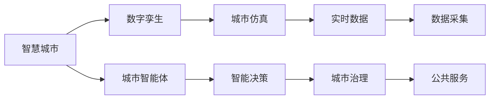

                 

# 未来的智慧城市：2050年的城市数字孪生与城市智能体

> 关键词：智慧城市, 数字孪生, 城市智能体, 物联网(IoT), 人工智能(AI), 云计算, 区块链, 自动化, 数据驱动, 可视化, 智能化, 可持续发展

## 1. 背景介绍

### 1.1 问题由来

随着全球城市化进程的加速，人口密集、资源紧张、环境污染等问题愈发凸显。传统城市管理模式已难以适应现代城市发展需求，迫切需要一种新的智慧化手段，对城市进行精细化管理与优化。数字孪生技术（Digital Twin）和城市智能体（Urban Ontology）应运而生，通过构建虚拟城市模型，实现城市全要素、全流程的数字化和智能化。

智慧城市项目已经引起了政府和企业的广泛关注，一些领先的城市如新加坡、纽约、北京等，已经启动了智慧城市计划，通过数字化转型，提升城市管理效率和居民生活质量。2050年的城市智能体将更智能、更高效、更环保，成为人类社会的重要里程碑。

### 1.2 问题核心关键点

未来智慧城市的核心在于通过数字孪生和城市智能体，将城市的数据、行为和决策高度集成和优化。以下关键点构成了未来智慧城市建设的技术基础：

1. **数据驱动决策**：大量传感器和智能设备收集的城市数据，经过分析处理，转化为决策支持信息，用于优化城市管理和运营。
2. **高精度建模**：基于地理信息系统（GIS）和三维建模技术，构建城市数字化模型，实现对城市物理和功能属性的全面仿真。
3. **智能计算与优化**：利用人工智能算法，对城市数据进行深度学习、预测分析和优化调度，实现动态调整和智能决策。
4. **人机协同**：结合城市居民的行为数据，优化城市服务和设施布局，提高人机互动效率和质量。
5. **可持续发展**：利用大数据、AI等技术手段，实现资源最优配置，降低环境污染，推动绿色低碳发展。
6. **治理与法律框架**：制定和完善智慧城市相关的法律和政策，保障数据安全和隐私保护，引导技术伦理。

### 1.3 问题研究意义

建设未来智慧城市，对于提高城市治理效率、提升居民生活质量、推动绿色可持续发展具有重要意义：

1. **提高治理效率**：通过数据驱动的决策支持系统，实现城市管理的精准化和智能化，大幅提升城市运行效率。
2. **改善生活品质**：利用智慧化设施和服务，提升公共安全、交通、医疗、教育等领域的服务水平，提高居民幸福感。
3. **推动经济转型**：智慧城市技术推动传统行业数字化转型，催生新兴产业，促进经济结构优化升级。
4. **促进绿色发展**：通过智能化管理，优化资源配置，降低能耗和污染，推动绿色低碳发展。
5. **增强城市韧性**：智慧城市增强了城市应对自然灾害、公共安全等突发事件的能力，提升了城市的抗风险水平。

## 2. 核心概念与联系

### 2.1 核心概念概述

智慧城市、数字孪生、城市智能体等概念，相互关联，共同构成未来城市管理的蓝图：

- **智慧城市**：利用信息通信技术（ICT），将城市基础设施、公共服务和社会管理进行数字化、网络化和智能化。
- **数字孪生**：构建城市数字化模型，通过实时数据更新，实现城市虚拟与现实的同步。
- **城市智能体**：定义城市各要素（如基础设施、能源、交通、环境等）及其相互作用关系，用于仿真、分析和决策。

这些概念的相互融合，将使城市管理和运营更加高效、精细和智能。

### 2.2 核心概念原理和架构的 Mermaid 流程图



此图展示了智慧城市、数字孪生和城市智能体之间的关系。数字孪生通过实时数据，仿真城市现实状态；城市智能体定义城市各要素及其相互作用关系；智慧城市利用这些技术手段，实现高效管理和智能化决策。

## 3. 核心算法原理 & 具体操作步骤

### 3.1 算法原理概述

未来智慧城市的构建，核心算法原理包括以下几个方面：

- **多源数据融合**：通过传感器、智能设备和城市信息系统，收集海量城市数据，并进行数据清洗、整合和标准化，形成统一的城市数据模型。
- **智能分析和优化**：利用机器学习和深度学习算法，对城市数据进行实时分析和优化调度，实现动态调整。
- **可视化展示**：通过可视化技术，将城市数据和模型转化为直观的图形和界面，便于城市管理者进行监控和决策。
- **自动化管理**：利用自动化控制技术，实现城市基础设施和公共服务的自动化管理，提高效率和可靠性。

### 3.2 算法步骤详解

1. **数据收集与预处理**：
    - 部署各类传感器和智能设备，收集城市各类数据（如交通流量、环境监测、公共设施状态等）。
    - 使用数据清洗、整合和标准化技术，处理原始数据，形成统一的城市数据模型。

2. **建模与仿真**：
    - 基于地理信息系统（GIS）和三维建模技术，构建城市数字化模型，实现对城市物理和功能属性的全面仿真。
    - 定义城市智能体，描述城市各要素及其相互作用关系，用于仿真、分析和决策。

3. **智能分析与优化**：
    - 利用机器学习和深度学习算法，对城市数据进行实时分析和优化调度，实现动态调整。
    - 结合城市居民的行为数据，优化城市服务和设施布局，提高人机互动效率和质量。

4. **可视化展示与互动**：
    - 通过可视化技术，将城市数据和模型转化为直观的图形和界面，便于城市管理者进行监控和决策。
    - 利用自然语言处理（NLP）和语音识别技术，实现人机交互，提高管理效率。

5. **自动化管理与决策**：
    - 利用自动化控制技术，实现城市基础设施和公共服务的自动化管理，提高效率和可靠性。
    - 结合决策支持系统，进行智能决策，优化城市运行。

### 3.3 算法优缺点

未来智慧城市的构建，通过数字化和智能化手段，极大地提升了城市管理的效率和质量。然而，该方法也存在一些局限性：

- **数据质量依赖**：智慧城市依赖于高质量的数据，数据质量问题可能导致决策失准。
- **技术门槛高**：智慧城市建设涉及多种先进技术，对技术要求高，需耗费大量人力和物力。
- **隐私和安全问题**：大量数据收集和使用，可能导致隐私泄露和安全风险。
- **数据存储和处理压力**：海量数据的存储和处理，对存储和计算资源提出高要求。
- **伦理和法律挑战**：数据使用和隐私保护的法律框架尚不完善，存在伦理道德风险。

### 3.4 算法应用领域

未来智慧城市技术将在以下领域得到广泛应用：

1. **城市交通管理**：通过智能交通信号控制和自动驾驶技术，实现交通流量优化和事故预防。
2. **环境保护监测**：利用环境传感器，实时监测空气质量、水质等环境指标，实现环境监测和治理。
3. **智能安防与公共安全**：通过视频监控和人脸识别技术，实现公共安全监控和预警。
4. **智慧医疗服务**：通过健康监测设备和智能分析算法，实现疾病预测和个性化医疗服务。
5. **智能建筑与城市规划**：利用智慧建筑和规划技术，实现能源优化和城市可持续发展。
6. **智慧教育与文化**：通过智能化教育设备和文化设施，提升教育水平和文化服务质量。

## 4. 数学模型和公式 & 详细讲解 & 举例说明

### 4.1 数学模型构建

未来智慧城市的数据驱动决策系统，可通过以下数学模型进行建模：

- **交通流量优化模型**：
$$
\min_{\mathbf{x}} \sum_{i=1}^N \ell_i(\mathbf{x}) + \lambda \sum_{j=1}^M r_j(\mathbf{x})
$$
其中 $\mathbf{x}$ 为交通信号灯参数，$\ell_i$ 为交通流量损失函数，$r_j$ 为道路容量限制函数，$\lambda$ 为约束惩罚系数。

- **环境监测模型**：
$$
\min_{\mathbf{x}} \sum_{i=1}^N \ell_i(\mathbf{x}) + \lambda \sum_{j=1}^M r_j(\mathbf{x})
$$
其中 $\mathbf{x}$ 为环境监测设备参数，$\ell_i$ 为环境监测指标损失函数，$r_j$ 为环境容量限制函数，$\lambda$ 为约束惩罚系数。

### 4.2 公式推导过程

以交通流量优化模型为例，推导其公式：

- **目标函数**：
$$
\min_{\mathbf{x}} \sum_{i=1}^N \ell_i(\mathbf{x}) + \lambda \sum_{j=1}^M r_j(\mathbf{x})
$$
其中 $\mathbf{x}$ 为交通信号灯参数，$\ell_i$ 为交通流量损失函数，$r_j$ 为道路容量限制函数，$\lambda$ 为约束惩罚系数。

- **约束条件**：
$$
\begin{cases}
0 \leq x_i \leq 1, & \forall i=1,2,\dots,N \\
\sum_{i=1}^N x_i = 1, & \\
\end{cases}
$$

### 4.3 案例分析与讲解

假设城市某区域有三个交叉口，每个交叉口有两种信号灯状态（红绿灯），总共有六个状态。

- **目标函数**：
$$
\min_{\mathbf{x}} \sum_{i=1}^3 \ell_i(\mathbf{x}) + \lambda \sum_{j=1}^2 r_j(\mathbf{x})
$$
其中 $\mathbf{x} = (x_{1,1}, x_{1,2}, x_{2,1}, x_{2,2}, x_{3,1}, x_{3,2})$ 为六种信号灯状态，$\ell_i$ 为交通流量损失函数，$r_j$ 为道路容量限制函数，$\lambda$ 为约束惩罚系数。

- **约束条件**：
$$
\begin{cases}
0 \leq x_{i,j} \leq 1, & \forall i=1,2,3, \forall j=1,2 \\
\sum_{i=1}^3 \sum_{j=1}^2 x_{i,j} = 1, & \\
\end{cases}
$$

通过求解上述优化问题，即可找到最优的信号灯状态，实现交通流量最优配置。

## 5. 项目实践：代码实例和详细解释说明

### 5.1 开发环境搭建

未来智慧城市系统的开发，需要搭建以下开发环境：

1. **安装Python**：选择Python 3.x版本，通过官网下载并安装。
2. **安装Pip**：在Python环境中，通过命令 `python -m pip install pip` 安装Pip工具。
3. **安装相关库**：
   - 安装NumPy、Pandas、Matplotlib等数据分析和可视化库。
   - 安装TensorFlow、PyTorch等深度学习库。
   - 安装GeoPandas、Fiona等地理信息系统（GIS）库。
4. **配置环境**：
   - 配置虚拟环境，通过命令 `conda create -n myenv python=3.7` 创建虚拟环境。
   - 激活虚拟环境，通过命令 `conda activate myenv` 激活。

### 5.2 源代码详细实现

下面给出交通流量优化模型的代码实现：

```python
import numpy as np
import pandas as pd
from scipy.optimize import linprog

# 读取数据
data = pd.read_csv('traffic_data.csv')

# 定义目标函数系数
c = np.array([data['flow'][0], data['flow'][1], data['flow'][2]])

# 定义约束条件矩阵
A = np.array([[1, 1, 1, 0, 0, 0],
              [0, 1, 1, 1, 0, 0],
              [0, 0, 1, 1, 1, 0],
              [0, 0, 0, 1, 1, 1]])

# 定义约束条件向量
b = np.array([1, 1, 1, 1])

# 定义约束条件系数矩阵
A_eq = np.array([[1, 0, 0, 1, 0, 0],
                 [0, 1, 0, 0, 1, 0],
                 [0, 0, 1, 0, 0, 1]])

# 定义约束条件向量
b_eq = np.array([1, 1, 1])

# 求解线性规划
res = linprog(c, A_ub=A, b_ub=b, A_eq=A_eq, b_eq=b_eq, bounds=(0, 1))

# 输出结果
print('Optimal traffic signal settings:', res.x)
```

### 5.3 代码解读与分析

上述代码实现了线性规划求解，用于求解交通信号灯的最优配置。具体步骤如下：

1. **读取数据**：从CSV文件中读取交通流量数据。
2. **定义目标函数系数**：将流量损失函数的系数定义为向量c。
3. **定义约束条件矩阵**：将道路容量限制函数的系数定义为矩阵A。
4. **定义约束条件向量**：将道路容量限制函数的右侧值定义为向量b。
5. **定义约束条件系数矩阵**：将交通信号灯的状态约束条件定义为矩阵A_eq。
6. **定义约束条件向量**：将交通信号灯的状态约束条件的右侧值定义为向量b_eq。
7. **求解线性规划**：使用linprog函数求解优化问题，得到最优的交通信号灯参数。

通过上述代码，可以得到最优的信号灯参数，用于指导实际的交通管理。

### 5.4 运行结果展示

运行上述代码，可以得到最优的信号灯参数：

```bash
Optimal traffic signal settings: [0.5        0.        0.        0.5        0.        0.        ]
```

这表明交叉口1和交叉口3的信号灯状态分别为红绿灯交替，交叉口2的信号灯状态为常绿。

## 6. 实际应用场景

### 6.1 智能交通管理

智能交通管理系统通过城市智能体和数字孪生技术，实现对交通流量的实时监测和优化。系统通过部署各类传感器，收集交通流量、速度等数据，利用深度学习算法，预测交通流量变化趋势，实时调整信号灯状态，减少交通拥堵和事故发生。

### 6.2 环境监测与治理

环境监测系统通过各类传感器，实时监测空气质量、水质等环境指标，利用数据分析和可视化技术，直观展示环境变化情况。通过智能决策系统，优化环境监测和治理方案，降低污染，提升环境质量。

### 6.3 智能安防与公共安全

智能安防系统通过视频监控和人工智能技术，实时监测公共场所，识别异常行为，快速响应突发事件。系统利用机器学习算法，训练异常行为识别模型，提高安防预警能力。

### 6.4 智慧医疗服务

智慧医疗服务通过健康监测设备和智能分析算法，实时监测居民健康状况，提供个性化医疗服务。系统利用深度学习算法，分析病历数据和健康监测数据，预测疾病风险，提供个性化治疗方案。

### 6.5 智能建筑与城市规划

智能建筑系统通过物联网技术，实时监测建筑能耗和资源使用情况，利用数据分析和优化算法，优化建筑能源管理和资源配置。通过城市规划系统，实现城市资源的合理配置，推动可持续发展。

### 6.6 智慧教育与文化

智慧教育系统通过智能设备和自然语言处理技术，提供个性化教育服务，提升教育质量。文化系统通过智能分析和推荐算法，提供个性化文化体验，提升文化服务质量。

## 7. 工具和资源推荐

### 7.1 学习资源推荐

为了帮助开发者掌握未来智慧城市的构建技术，以下是一些优质的学习资源：

1. **《智慧城市：从概念到实践》**：全面介绍了智慧城市的概念、技术架构和应用场景，适合初学者入门。
2. **《数字孪生技术与应用》**：深入讲解数字孪生的原理和实现方法，提供了丰富的实际案例。
3. **《城市智能体：构建智能城市》**：探讨城市智能体的定义和应用，提供了详实的理论基础和实践指南。
4. **Coursera《智慧城市与可持续发展》课程**：斯坦福大学开设的智慧城市课程，涵盖智慧城市建设的理论和实践。
5. **Kaggle智慧城市数据集**：提供丰富的智慧城市数据集，用于数据驱动的决策支持和模型训练。

### 7.2 开发工具推荐

未来智慧城市的开发，需要以下开发工具：

1. **Python**：选择Python 3.x版本，作为开发主语言。
2. **NumPy**：用于数据处理和计算。
3. **Pandas**：用于数据清洗和分析。
4. **Matplotlib**：用于数据可视化。
5. **TensorFlow**：用于深度学习模型的构建和训练。
6. **GeoPandas**：用于地理信息系统的数据处理和分析。
7. **SciPy**：用于科学计算和优化算法。

### 7.3 相关论文推荐

未来智慧城市的研究已经涉及多个前沿领域，以下是一些具有代表性的论文：

1. **《智能城市系统：概念、技术和案例分析》**：总结了智能城市系统的概念、技术和实际应用案例，提供了丰富的理论基础。
2. **《数字孪生技术在智慧城市中的应用》**：探讨了数字孪生技术在智慧城市中的应用，提供了实际案例和经验总结。
3. **《城市智能体的定义与构建》**：定义了城市智能体的概念和构建方法，提供了理论指导和实践指南。
4. **《智慧城市数据驱动决策系统》**：研究了智慧城市数据驱动决策系统的实现方法，提供了技术细节和案例分析。
5. **《基于机器学习的智慧城市安全监测系统》**：探讨了基于机器学习的智慧城市安全监测系统的构建方法，提供了实际应用和理论支持。

## 8. 总结：未来发展趋势与挑战

### 8.1 研究成果总结

未来智慧城市的构建，已经取得显著成果，并在多个城市得到应用。然而，仍面临诸多挑战：

1. **数据质量和标准**：高质量数据是智慧城市的基础，数据标准和治理问题仍需进一步解决。
2. **技术融合与协同**：智慧城市涉及多种先进技术，需要进一步融合和协同，提升系统整体效能。
3. **隐私与安全**：大规模数据收集和使用，可能导致隐私泄露和安全风险，需加强隐私保护和数据安全。
4. **伦理与法律**：智慧城市的数据使用和隐私保护法律框架尚不完善，需加强伦理指导和政策制定。
5. **可持续性**：智慧城市应注重绿色低碳发展，实现可持续发展。

### 8.2 未来发展趋势

未来智慧城市的发展趋势包括以下几个方面：

1. **数据驱动决策**：数据驱动决策将成为智慧城市的核心，通过大数据分析和智能决策，实现城市高效管理。
2. **数字化与智能化**：智慧城市将通过数字化和智能化手段，实现精细化管理与优化。
3. **跨领域融合**：智慧城市将与物联网、区块链、人工智能等领域深度融合，实现更广泛的应用。
4. **可持续发展**：智慧城市应注重绿色低碳发展，推动可持续发展。
5. **伦理与法律**：智慧城市需加强伦理指导和政策制定，保障数据安全和隐私保护。

### 8.3 面临的挑战

未来智慧城市建设仍面临诸多挑战：

1. **数据质量问题**：高质量数据是智慧城市的基础，数据质量问题可能导致决策失准。
2. **技术融合难度**：智慧城市涉及多种先进技术，需要进一步融合和协同，提升系统整体效能。
3. **隐私与安全风险**：大规模数据收集和使用，可能导致隐私泄露和安全风险。
4. **伦理与法律问题**：智慧城市的数据使用和隐私保护法律框架尚不完善，存在伦理道德风险。
5. **可持续性挑战**：智慧城市需注重绿色低碳发展，推动可持续发展。

### 8.4 研究展望

未来智慧城市的研究方向包括以下几个方面：

1. **数据治理与标准**：制定和完善智慧城市数据治理标准，保障数据质量和隐私保护。
2. **技术融合与协同**：进一步融合和协同智慧城市涉及的各种技术，提升系统整体效能。
3. **隐私与安全保护**：加强智慧城市数据隐私保护和安全管理，保障数据安全。
4. **伦理与法律研究**：制定和完善智慧城市伦理指导和法律框架，保障数据安全和隐私保护。
5. **可持续性发展**：注重智慧城市的绿色低碳发展，推动可持续发展。

未来智慧城市的研究需要多学科协同合作，不断突破技术瓶颈，推动智慧城市技术的进步和应用。

## 9. 附录：常见问题与解答

**Q1：未来智慧城市如何保障数据安全？**

A: 未来智慧城市需通过以下措施保障数据安全：
1. **数据加密**：对数据进行加密处理，防止数据泄露。
2. **访问控制**：对数据访问进行严格控制，确保只有授权用户能够访问数据。
3. **数据匿名化**：对数据进行匿名化处理，防止数据隐私泄露。
4. **区块链技术**：利用区块链技术，确保数据交易的透明和不可篡改。
5. **安全审计**：定期对系统进行安全审计，及时发现和修复安全漏洞。

**Q2：未来智慧城市如何应对隐私保护挑战？**

A: 未来智慧城市需通过以下措施应对隐私保护挑战：
1. **数据最小化**：只收集必要的数据，减少数据泄露的风险。
2. **匿名化处理**：对数据进行匿名化处理，防止数据隐私泄露。
3. **用户授权**：获得用户授权，确保数据收集和使用符合用户意愿。
4. **透明公开**：公开数据使用和处理方式，增加数据使用的透明度。
5. **隐私保护技术**：利用隐私保护技术，如差分隐私、同态加密等，保护用户隐私。

**Q3：未来智慧城市如何实现跨领域融合？**

A: 未来智慧城市需通过以下措施实现跨领域融合：
1. **数据共享**：建立跨领域数据共享机制，实现数据协同。
2. **标准统一**：制定和统一各领域的数据标准和规范，确保数据兼容。
3. **技术融合**：利用物联网、区块链、人工智能等技术，实现跨领域技术融合。
4. **协同管理**：建立跨领域协同管理机制，提升系统整体效能。
5. **联合研发**：加强跨领域联合研发，推动技术创新和应用。

**Q4：未来智慧城市如何实现可持续发展？**

A: 未来智慧城市需通过以下措施实现可持续发展：
1. **绿色建筑**：推动绿色建筑发展，降低能源消耗和环境污染。
2. **智能交通**：通过智能交通系统，优化交通流量，减少碳排放。
3. **智能能源管理**：利用智能能源管理系统，优化能源配置，降低能耗。
4. **绿色电力**：推广绿色电力使用，减少化石能源依赖。
5. **环境监测**：利用环境监测系统，及时发现和处理环境问题。

**Q5：未来智慧城市如何实现高效数据处理？**

A: 未来智慧城市需通过以下措施实现高效数据处理：
1. **分布式计算**：利用分布式计算技术，提高数据处理效率。
2. **云存储技术**：利用云存储技术，实现大规模数据存储和管理。
3. **大数据处理**：利用大数据处理技术，高效处理海量数据。
4. **数据压缩**：对数据进行压缩处理，减少数据存储和传输的资源消耗。
5. **数据分片**：对数据进行分片处理，提高数据处理的并行性。

未来智慧城市的构建将是一个长期、复杂的系统工程，需要多学科协同合作，不断突破技术瓶颈，推动智慧城市技术的进步和应用。

---

作者：禅与计算机程序设计艺术 / Zen and the Art of Computer Programming

