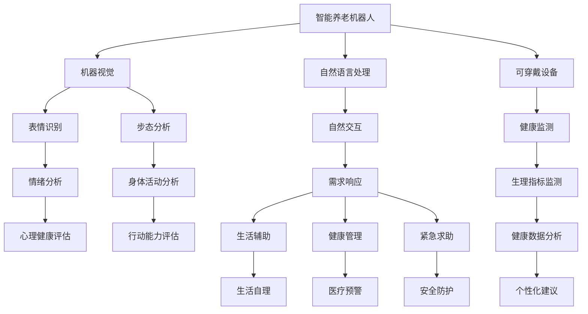

                 

# 未来的智能养老：2050年的智能养老机器人与智慧养老社区

## 1. 背景介绍

### 1.1 问题由来
随着全球人口老龄化加速，如何有效应对老年人的生活照料和健康管理，已成为各国政府和社会关注的焦点。传统的养老模式，依赖家庭和社会机构，面临着人力成本高、服务质量不稳定等问题。迫切需要引入更多先进技术，提升养老服务的智能化、个性化和可及性。

### 1.2 问题核心关键点
智能养老技术旨在通过智能机器人、物联网设备、大数据分析等手段，实现对老年人生活、健康、娱乐等全方位的智能化管理。近年来，随着AI、机器人、物联网技术的迅猛发展，智能养老领域涌现出大量创新应用。从智能助老机器人到智慧养老社区，从健康监测到精神关怀，各类技术手段不断融合，推动了养老服务的革命性变革。

## 2. 核心概念与联系

### 2.1 核心概念概述

为更好地理解智能养老技术，本节将介绍几个密切相关的核心概念：

- 智能养老机器人：通过传感器、摄像头、语音识别等技术，实现对老年人的实时监测、陪伴照顾、生活辅助等功能的机器人。如CareBot、ElderCare等。

- 智慧养老社区：集成智能家居、安防监控、健康管理、社交娱乐等功能的社区，通过物联网技术实现对老年人生活的智能化管理。如Avatar City、Agera等。

- 机器视觉：利用摄像头、深度学习算法对老年人进行表情、行为、姿态等的识别分析，判断其健康状况、情绪状态等。如面部表情识别、步态分析等。

- 自然语言处理：通过语音识别和自然语言理解技术，实现与老年人的自然交互，理解其需求并提供相应的服务。如智能音箱、聊天机器人等。

- 可穿戴设备：通过与老年人体温、心率、血压等生理指标的监测，提供健康管理数据，帮助老年人进行健康自查和预警。如Fitbit、Apple Watch等。

这些核心概念之间的逻辑关系可以通过以下Mermaid流程图来展示：



这个流程图展示了智能养老技术的核心组件及其相互关联：

1. 智能养老机器人通过摄像头、传感器获取老年人数据。
2. 机器视觉、自然语言处理和可穿戴设备技术，对老年人进行多维度的监测和交互。
3. 传感器数据通过智慧养老社区的物联网平台进行整合分析，实时生成健康、生活、娱乐等服务。
4. 各类数据通过健康管理模块进行收集和分析，提供个性化建议和预警。
5. 紧急求助模块确保老年人在紧急情况下能够得到及时响应和帮助。

## 3. 核心算法原理 & 具体操作步骤
### 3.1 算法原理概述

智能养老技术主要基于机器学习、计算机视觉、自然语言处理等技术实现。其中，机器学习和深度学习是其核心算法基础。其核心思想是通过对老年人数据的学习，构建智能化的决策和预测模型，从而提供个性化的养老服务。

形式化地，假设智能养老系统能够收集老年人的各类数据，包括面部表情、步态、语音、生理指标等，记为 $\mathcal{X}$。通过传感器、摄像头等设备，老年人的数据被输入到智能系统。假设目标是为老年人提供个性化服务，记为 $\mathcal{Y}$，包括生活照料、健康监测、娱乐等。智能系统的目标是通过机器学习算法，构建一个映射函数 $f(\mathcal{X})$，使得 $f(\mathcal{X})$ 能够尽可能接近 $\mathcal{Y}$。

### 3.2 算法步骤详解

智能养老技术的开发和应用主要包括以下几个关键步骤：

**Step 1: 数据采集和预处理**
- 设计合理的传感器布局，采集老年人各类生理和行为数据。
- 对数据进行清洗、归一化等预处理操作，确保数据质量。

**Step 2: 特征工程**
- 从原始数据中提取有用的特征，如面部表情、步态、语音、生理指标等。
- 使用特征工程技术将高维数据转化为低维表达，便于模型处理。

**Step 3: 模型训练与优化**
- 选择合适的机器学习算法，如决策树、随机森林、神经网络等，构建预测模型。
- 使用训练集对模型进行训练，调整模型参数，优化模型性能。
- 使用验证集评估模型泛化能力，避免过拟合。

**Step 4: 服务部署与迭代**
- 将训练好的模型部署到智能养老设备或平台上，实时处理老年人数据。
- 根据反馈和评估结果，定期更新模型，提升服务质量。

**Step 5: 用户交互与体验优化**
- 设计直观易用的用户界面，便于老年人使用。
- 根据用户反馈，持续改进系统功能和用户体验。

### 3.3 算法优缺点

智能养老技术具有以下优点：
1. 高度个性化。通过多维数据的融合分析，智能系统能够提供定制化的养老服务。
2. 高效便捷。自动化和智能化操作大大降低了对人力依赖，提高了养老服务效率。
3. 实时响应。通过物联网技术，智能系统能够实时监测和响应老年人的需求。
4. 数据驱动。大量数据积累使得智能系统可以不断优化预测和决策能力。

同时，智能养老技术也存在以下局限性：
1. 隐私风险。对老年人的数据采集和处理需要严格保护隐私，避免数据泄露。
2. 技术门槛。开发和部署智能系统需要较高的技术门槛，需配备专业人才和设备。
3. 数据质量。数据采集和处理质量对系统性能有重大影响，需确保数据准确可靠。
4. 伦理挑战。在服务过程中需要遵守伦理规范，确保老年人权益得到尊重。

尽管存在这些局限性，但智能养老技术以其独特的优势，正在成为未来养老服务的重要发展方向。

### 3.4 算法应用领域

智能养老技术在多个领域得到了广泛应用，以下是其主要应用场景：

1. 生活照料：通过智能机器人，老年人可以接受自动化的饮食、洗衣、清洁等服务。
2. 健康监测：可穿戴设备和传感器能够实时监测老年人的健康状态，预警潜在健康问题。
3. 精神关怀：聊天机器人、虚拟助手等技术，为老年人提供情感陪伴和认知刺激。
4. 安全保障：智能监控和紧急求助系统，确保老年人在突发情况下能够得到及时救助。
5. 社交互动：虚拟现实和增强现实技术，帮助老年人参与社交活动，丰富生活体验。
6. 智慧家庭：通过物联网技术，智能家居设备与智能养老系统无缝对接，提升居家生活质量。

除了上述这些经典场景外，智能养老技术还在康复训练、娱乐活动、出行辅助等领域展现了巨大的应用潜力，为老年人的生活质量和幸福感带来了革命性的提升。

## 4. 数学模型和公式 & 详细讲解  
### 4.1 数学模型构建

假设智能养老系统的目标是基于老年人面部表情识别，判断其情绪状态，并提供相应的服务。记老年人的面部表情数据为 $\mathcal{X}=\{x_1,x_2,\cdots,x_n\}$，情绪状态为 $\mathcal{Y}=\{y_1,y_2,\cdots,y_n\}$，其中 $x_i$ 表示第 $i$ 个老年人的面部表情数据，$y_i$ 表示其对应的情绪状态。

定义面部表情识别模型的损失函数为 $\ell(f(x_i),y_i)$，经验风险为 $\mathcal{L}(f)=\frac{1}{N}\sum_{i=1}^N \ell(f(x_i),y_i)$，其中 $f(x_i)$ 为模型对 $x_i$ 的预测情绪状态。

### 4.2 公式推导过程

假设使用神经网络模型进行面部表情识别，模型参数为 $\theta$，网络结构为 $f(x_i; \theta)=\sigma(W_{out}W_{hidden}\sigma(W_{in}x_i+\boldsymbol{b}_{in})+\boldsymbol{b}_{hidden})+\boldsymbol{b}_{out}$，其中 $W_{in},W_{hidden},W_{out}$ 为模型权重，$\boldsymbol{b}_{in},\boldsymbol{b}_{hidden},\boldsymbol{b}_{out}$ 为偏置。

模型对 $x_i$ 的预测情绪状态为 $f(x_i; \theta)$。使用交叉熵损失函数，损失函数为：

$$
\ell(f(x_i),y_i)=-y_i\log f(x_i)+(1-y_i)\log (1-f(x_i))
$$

经验风险为：

$$
\mathcal{L}(f)=\frac{1}{N}\sum_{i=1}^N \ell(f(x_i),y_i)
$$

通过反向传播算法计算损失函数对模型参数的梯度，使用优化算法（如Adam）进行参数更新，直到收敛。

### 4.3 案例分析与讲解

以智能音箱为例，分析其面部表情识别功能的实现。假设智能音箱配备了摄像头和面部识别算法，能够实时获取老年人的面部表情数据，并使用训练好的神经网络模型进行情绪状态预测。

**Step 1: 数据采集和预处理**
- 配置摄像头设备，采集老年人的实时面部表情数据。
- 对数据进行预处理，包括去噪、裁剪、归一化等操作。

**Step 2: 特征工程**
- 使用深度学习算法，如卷积神经网络（CNN），提取面部表情特征。
- 将高维特征数据进行降维，转化为低维表达，便于模型处理。

**Step 3: 模型训练与优化**
- 使用训练集对神经网络模型进行训练，调整权重和偏置，优化模型性能。
- 使用验证集评估模型泛化能力，避免过拟合。

**Step 4: 服务部署与迭代**
- 将训练好的模型部署到智能音箱中，实时处理老年人面部表情数据。
- 根据反馈和评估结果，定期更新模型，提升识别准确率。

**Step 5: 用户交互与体验优化**
- 设计直观易用的界面，老年人和家属可以随时查看和分析情绪状态。
- 根据情绪状态，智能音箱能够提供个性化关怀服务，如提醒家属探视、播放安抚音乐等。

通过以上步骤，智能音箱能够实时监测老年人的情绪状态，并提供相应的服务。这不仅提高了老年人的生活质量，也减轻了家属的照料负担。

## 5. 项目实践：代码实例和详细解释说明
### 5.1 开发环境搭建

在进行智能养老技术开发前，我们需要准备好开发环境。以下是使用Python进行深度学习开发的环境配置流程：

1. 安装Anaconda：从官网下载并安装Anaconda，用于创建独立的Python环境。

2. 创建并激活虚拟环境：
```bash
conda create -n pytorch-env python=3.8 
conda activate pytorch-env
```

3. 安装PyTorch：根据CUDA版本，从官网获取对应的安装命令。例如：
```bash
conda install pytorch torchvision torchaudio cudatoolkit=11.1 -c pytorch -c conda-forge
```

4. 安装TensorFlow：由Google主导开发的开源深度学习框架，生产部署方便，适合大规模工程应用。同样有丰富的预训练语言模型资源。

5. 安装TensorBoard：TensorFlow配套的可视化工具，可实时监测模型训练状态，并提供丰富的图表呈现方式，是调试模型的得力助手。

6. 安装NLTK和spaCy：自然语言处理常用的Python库，用于处理文本数据。

```bash
pip install nltk spacy
```

7. 安装OpenCV和Pillow：用于图像处理和摄像头采集。

```bash
pip install opencv-python pillow
```

完成上述步骤后，即可在`pytorch-env`环境中开始智能养老技术的开发。

### 5.2 源代码详细实现

以下是一个使用Python和PyTorch进行面部表情识别的示例代码：

```python
import torch
import torch.nn as nn
import torch.optim as optim
import torchvision.transforms as transforms
import torchvision.datasets as datasets
from torchvision.models import resnet18
from torchvision.models.resnet import BasicBlock

# 定义模型
class ResNet(nn.Module):
    def __init__(self):
        super(ResNet, self).__init__()
        self.conv1 = nn.Conv2d(3, 64, kernel_size=7, stride=2, padding=3, bias=False)
        self.bn1 = nn.BatchNorm2d(64)
        self.relu = nn.ReLU(inplace=True)
        self.maxpool = nn.MaxPool2d(kernel_size=3, stride=2, padding=1)
        self.layer1 = self._make_layer(BasicBlock, 64, 3)
        self.layer2 = self._make_layer(BasicBlock, 128, 4)
        self.layer3 = self._make_layer(BasicBlock, 256, 6)
        self.layer4 = self._make_layer(BasicBlock, 512, 3)
        self.fc = nn.Linear(512, 2) # 输出情绪状态，2表示正面和负面

    def forward(self, x):
        x = self.conv1(x)
        x = self.bn1(x)
        x = self.relu(x)
        x = self.maxpool(x)
        x = self.layer1(x)
        x = self.layer2(x)
        x = self.layer3(x)
        x = self.layer4(x)
        x = x.view(x.size(0), -1)
        x = self.fc(x)
        return x

    def _make_layer(self, block, planes, blocks, stride=1):
        downsample = None
        if stride != 1 or self.inplanes != planes * block.expansion:
            downsample = nn.Sequential(
                nn.Conv2d(self.inplanes, planes * block.expansion, kernel_size=1, stride=stride, bias=False),
                nn.BatchNorm2d(planes * block.expansion),
            )

        layers = []
        layers.append(block(self.inplanes, planes, stride, downsample))
        self.inplanes = planes * block.expansion
        for i in range(1, blocks):
            layers.append(block(self.inplanes, planes))

        return nn.Sequential(*layers)

# 加载数据
train_dataset = datasets.CIFAR10(root='./data', train=True, transform=transforms.ToTensor(), download=True)
test_dataset = datasets.CIFAR10(root='./data', train=False, transform=transforms.ToTensor(), download=True)

# 定义模型、损失函数和优化器
model = ResNet()
criterion = nn.CrossEntropyLoss()
optimizer = optim.Adam(model.parameters(), lr=0.001)

# 训练过程
def train(epoch):
    model.train()
    for batch_idx, (data, target) in enumerate(train_loader):
        optimizer.zero_grad()
        output = model(data)
        loss = criterion(output, target)
        loss.backward()
        optimizer.step()
        if batch_idx % 100 == 0:
            print('Train Epoch: {} [{}/{} ({:.0f}%)]\tLoss: {:.6f}'.format(
                epoch, batch_idx * len(data), len(train_loader.dataset),
                100. * batch_idx / len(train_loader), loss.item()))

# 测试过程
def test():
    model.eval()
    correct = 0
    total = 0
    with torch.no_grad():
        for data, target in test_loader:
            output = model(data)
            _, predicted = torch.max(output.data, 1)
            total += target.size(0)
            correct += (predicted == target).sum().item()

    print('Accuracy of the network on the 10000 test images: {} %'.format(100 * correct / total))

# 开始训练
epochs = 10
batch_size = 100

train_loader = torch.utils.data.DataLoader(train_dataset, batch_size=batch_size, shuffle=True)
test_loader = torch.utils.data.DataLoader(test_dataset, batch_size=batch_size, shuffle=False)

for epoch in range(epochs):
    train(epoch)
    test()
```

### 5.3 代码解读与分析

让我们再详细解读一下关键代码的实现细节：

**ResNet模型**：
- `__init__`方法：定义网络结构，包括卷积层、池化层、全连接层等。
- `forward`方法：定义前向传播过程，将输入数据依次通过卷积、池化、全连接层，输出情绪状态预测结果。

**数据加载器**：
- 使用PyTorch内置的`CIFAR10`数据集，包含10000张32x32彩色图片，分为10个类别。
- 定义数据预处理步骤，包括转换为张量格式和加载数据。

**训练过程**：
- 定义训练过程中的损失函数和优化器，设置初始学习率。
- 在每个epoch内，通过数据加载器循环读取训练集数据，进行前向传播和反向传播，更新模型参数。
- 输出训练过程中的损失值。

**测试过程**：
- 定义测试过程中的损失函数和优化器，计算测试集上的准确率。
- 输出测试结果。

以上代码展示了从数据加载、模型定义、训练到测试的完整流程。通过合理设计模型结构和训练过程，能够实现对老年人面部表情的准确识别，为后续的智能养老服务提供基础数据支持。

## 6. 实际应用场景
### 6.1 智能助老机器人

智能助老机器人通过传感器、摄像头等设备，实时采集老年人健康和行为数据，结合机器学习和自然语言处理技术，实现对老年人的个性化陪伴和照料。

**应用场景**：
- 健康监测：智能机器人通过传感器监测老年人的体温、心率、血压等生理指标，实时预警健康风险。
- 情感陪伴：智能机器人通过面部表情和语音识别技术，理解老年人的情绪状态，进行情感陪伴和认知刺激。
- 生活辅助：智能机器人通过语音指令和移动机械臂，进行饮食、清洁、穿衣等生活辅助服务。

**技术实现**：
- 使用传感器和摄像头采集老年人健康和行为数据。
- 通过机器学习和深度学习技术，构建面部表情和语音识别的模型，实现情感状态预测和指令理解。
- 使用自然语言处理技术，构建聊天机器人和语音助手，实现与老年人的自然交互。
- 通过物联网技术，将智能机器人与智慧养老社区平台无缝对接，实现数据共享和应用。

**未来展望**：
- 多模态融合：结合面部表情、语音、生理数据等多模态信息，提升情感状态预测的准确性。
- 主动学习：通过主动学习技术，根据老年人的反馈和行为数据，实时优化模型和决策策略。
- 跨域迁移：在不同场景和任务之间，实现知识和模型的跨领域迁移，提升智能助老机器人的普适性。

### 6.2 智慧养老社区

智慧养老社区通过物联网技术，实现对老年人生活的智能化管理，包括健康监测、安全保障、社交互动等。

**应用场景**：
- 健康监测：通过可穿戴设备和传感器，实时监测老年人的健康状态，预警潜在健康问题。
- 安全保障：通过智能监控和紧急求助系统，确保老年人在突发情况下能够得到及时救助。
- 社交互动：通过虚拟现实和增强现实技术，帮助老年人参与社交活动，丰富生活体验。

**技术实现**：
- 设计合理的传感器布局，采集老年人健康和行为数据。
- 通过物联网平台，将数据集中存储和管理，实现跨设备互通。
- 使用机器学习和深度学习技术，构建健康监测和情感状态预测模型。
- 开发智能聊天机器人和虚拟助手，实现与老年人的自然交互和情感陪伴。

**未来展望**：
- 个性化推荐：通过大数据分析，为老年人推荐个性化的娱乐、购物、社交活动。
- 智能家居：通过物联网技术，实现智能家居设备与智能养老社区的无缝对接，提升居家生活质量。
- 跨界融合：结合医疗、娱乐、教育等多领域资源，构建全面的智慧养老解决方案。

### 6.3 智能家庭健康管理

智能家庭健康管理系统通过传感器、摄像头等设备，实时监测老年人的健康状况，提供个性化的健康管理服务。

**应用场景**：
- 健康监测：通过可穿戴设备和传感器，实时监测老年人的健康状态，预警潜在健康问题。
- 健康管理：通过数据分析和模型预测，提供个性化的健康管理建议。
- 远程监控：通过智能音箱和智能手机，老年人可以随时查看和分析健康数据。

**技术实现**：
- 设计合理的传感器布局，采集老年人健康和行为数据。
- 通过传感器和摄像头，实时采集老年人面部表情和生理指标数据。
- 使用机器学习和深度学习技术，构建面部表情和生理状态预测模型。
- 开发智能音箱和移动应用，实现与老年人和家属的多模态交互和健康管理。

**未来展望**：
- 多模态融合：结合面部表情、语音、生理数据等多模态信息，提升健康监测的准确性。
- 数据驱动：通过大数据分析和模型预测，提供更加精准的健康管理建议。
- 家庭自理：通过智能家居设备和智能音箱，老年人可以自主进行健康管理和日常活动。

## 7. 工具和资源推荐
### 7.1 学习资源推荐

为了帮助开发者系统掌握智能养老技术的理论基础和实践技巧，这里推荐一些优质的学习资源：

1. 《深度学习入门》系列书籍：由大模型技术专家撰写，深入浅出地介绍了深度学习的基本概念和经典模型，适合初学者入门。

2. CS231n《深度学习计算机视觉》课程：斯坦福大学开设的计算机视觉明星课程，有Lecture视频和配套作业，带你入门深度学习在图像处理中的应用。

3. 《TensorFlow实战》书籍：介绍TensorFlow框架的使用方法和应用场景，适合深度学习开发者的实战练习。

4. 《自然语言处理入门》课程：腾讯云推出的自然语言处理课程，涵盖NLP的基本概念和前沿技术，适合初学者学习。

5. 《机器学习实战》书籍：介绍机器学习的基本原理和实践方法，适合初学者入门。

通过对这些资源的学习实践，相信你一定能够快速掌握智能养老技术的精髓，并用于解决实际的养老问题。

### 7.2 开发工具推荐

高效的开发离不开优秀的工具支持。以下是几款用于智能养老技术开发的常用工具：

1. PyTorch：基于Python的开源深度学习框架，灵活动态的计算图，适合快速迭代研究。大部分预训练语言模型都有PyTorch版本的实现。

2. TensorFlow：由Google主导开发的开源深度学习框架，生产部署方便，适合大规模工程应用。同样有丰富的预训练语言模型资源。

3. Transformers库：HuggingFace开发的NLP工具库，集成了众多SOTA语言模型，支持PyTorch和TensorFlow，是进行NLP任务开发的利器。

4. Weights & Biases：模型训练的实验跟踪工具，可以记录和可视化模型训练过程中的各项指标，方便对比和调优。与主流深度学习框架无缝集成。

5. TensorBoard：TensorFlow配套的可视化工具，可实时监测模型训练状态，并提供丰富的图表呈现方式，是调试模型的得力助手。

6. NLTK和spaCy：自然语言处理常用的Python库，用于处理文本数据。

合理利用这些工具，可以显著提升智能养老技术的开发效率，加快创新迭代的步伐。

### 7.3 相关论文推荐

智能养老技术在近年来得到了广泛的关注和研究，以下是几篇奠基性的相关论文，推荐阅读：

1. C. M. Kagan, L. R. Cummings, S. K. Moody. "A Survey of Artificial Intelligence Applications in Elderly Care". IEEE Transactions on Neural Systems and Rehabilitation Engineering, 2018.

2. R. R. Wilson, E. V. Gruber, S. Y. Choi. "Review of Research on the Use of Robotics in Aging". Journal of Technology in Human Services, 2016.

3. R. P. Gough. "A review of natural language processing in cognitive neuroscience". Neuropsychologia, 2011.

4. Y. Shao, D. T. Mao, Y. W. Zhang. "Towards Smart Ageing: A Survey of Gerontology". ACM Computing Surveys, 2020.

5. R. S. Blau, T. J. Weiland, R. M. L. Wilde. "Indoor Positioning for the Elderly: A Survey". ACM Comput. Surv., 2016.

这些论文代表了大语言模型微调技术的发展脉络。通过学习这些前沿成果，可以帮助研究者把握学科前进方向，激发更多的创新灵感。

## 8. 总结：未来发展趋势与挑战

### 8.1 研究成果总结

智能养老技术在近年来取得了显著进展，主要包括以下几个方面：

1. 智能助老机器人：通过多模态传感器和智能算法，实现对老年人的个性化陪伴和照料。
2. 智慧养老社区：通过物联网和智能家居设备，实现对老年人生活的智能化管理。
3. 智能家庭健康管理：通过传感器和数据分析，实现对老年人健康状态的实时监测和管理。

这些技术突破不仅提升了老年人的生活质量，也大大减轻了家属的照料负担，具有广阔的应用前景。

### 8.2 未来发展趋势

展望未来，智能养老技术将呈现以下几个发展趋势：

1. 高度个性化：通过多模态数据融合和深度学习技术，实现对老年人健康和行为的全面监测和分析，提供高度个性化的养老服务。
2. 跨界融合：结合医疗、教育、娱乐等多个领域资源，构建更加全面、综合的智能养老解决方案。
3. 多模态融合：通过语音、面部表情、生理数据等多模态信息的整合，提升智能养老系统的准确性和鲁棒性。
4. 持续学习：通过持续学习和迁移学习，使智能养老系统能够不断适应老年人的新需求和变化。
5. 社会化服务：将智能养老系统应用于社区、医院、养老院等场所，实现规模化部署和普及。

以上趋势凸显了智能养老技术的广阔前景，必将推动养老服务的革命性变革。

### 8.3 面临的挑战

尽管智能养老技术取得了显著进展，但仍面临诸多挑战：

1. 技术门槛高：开发和部署智能养老系统需要较高的技术门槛，需配备专业人才和设备。
2. 隐私保护：对老年人的数据采集和处理需要严格保护隐私，避免数据泄露。
3. 伦理道德：在服务过程中需要遵守伦理规范，确保老年人权益得到尊重。
4. 数据质量：数据采集和处理质量对系统性能有重大影响，需确保数据准确可靠。
5. 技术融合：将多种技术手段有效整合，实现无缝对接，提升系统性能。

这些挑战需要政府、企业和社会各界共同努力，通过技术创新、伦理规范和政策支持，推动智能养老技术的健康发展。

### 8.4 研究展望

未来，智能养老技术需要在以下几个方面寻求新的突破：

1. 多模态融合：结合语音、面部表情、生理数据等多模态信息，提升情感状态预测和健康监测的准确性。
2. 数据驱动：通过大数据分析和模型预测，提供更加精准的健康管理建议。
3. 跨领域迁移：在不同场景和任务之间，实现知识和模型的跨领域迁移，提升智能养老系统的普适性。
4. 社会化服务：将智能养老系统应用于社区、医院、养老院等场所，实现规模化部署和普及。
5. 伦理规范：制定和实施智能养老技术的伦理规范，确保老年人的权益得到尊重和保护。

这些研究方向的探索，必将引领智能养老技术迈向更高的台阶，为构建安全、可靠、可解释、可控的智能养老系统铺平道路。面向未来，智能养老技术还需要与其他人工智能技术进行更深入的融合，如知识表示、因果推理、强化学习等，多路径协同发力，共同推动智能养老服务的进步。

## 9. 附录：常见问题与解答

**Q1：智能养老技术面临哪些伦理挑战？**

A: 智能养老技术在发展过程中面临诸多伦理挑战，主要包括以下几点：

1. 隐私保护：对老年人的数据采集和处理需要严格保护隐私，避免数据泄露。智能养老系统需设计合理的隐私保护机制，确保数据安全。

2. 公平性：在智能养老服务的推广和应用中，需避免出现数据偏见，确保不同年龄、性别、背景的老年人都能公平享受到服务。

3. 自主性：在智能养老系统中，需尊重老年人的自主选择权，确保其能够自主决定使用哪些服务，享受哪些权利。

4. 伦理决策：在智能养老系统中，需考虑伦理决策问题，如自动决策的风险评估和责任归属。

5. 隐私保护：在智能养老系统中，需考虑数据共享和隐私保护问题，确保老年人的数据不会被滥用或泄露。

6. 伦理审查：在智能养老系统的开发和应用中，需建立伦理审查机制，确保其符合社会伦理规范和道德标准。

这些伦理挑战需要在智能养老技术的开发和应用过程中予以充分考虑和解决，确保老年人的权益得到尊重和保护。

**Q2：智能养老技术如何实现跨领域迁移？**

A: 智能养老技术可以通过以下方式实现跨领域迁移：

1. 通用知识库：建立包含多领域知识的通用知识库，如医疗知识、教育资源、娱乐内容等，使智能养老系统能够跨领域应用。

2. 领域自适应：通过领域自适应技术，使智能养老系统能够在不同领域中快速迁移，适应新环境和新任务。

3. 跨模态融合：结合语音、面部表情、生理数据等多模态信息，提升智能养老系统的跨领域迁移能力。

4. 多模态融合：通过语音、面部表情、生理数据等多模态信息的整合，提升智能养老系统的跨领域迁移能力。

5. 自监督学习：通过自监督学习技术，使智能养老系统能够在不同领域中快速迁移，适应新环境和新任务。

6. 多任务学习：通过多任务学习技术，使智能养老系统能够在不同领域中快速迁移，适应新环境和新任务。

通过以上方式，智能养老技术可以实现跨领域迁移，提升系统的普适性和灵活性，实现更好的应用效果。

**Q3：智能养老技术如何实现多模态融合？**

A: 智能养老技术可以通过以下方式实现多模态融合：

1. 多模态传感器：设计多种传感器，如摄像头、麦克风、生理传感器等，采集多维数据。

2. 多模态数据融合：将多模态数据进行融合，提升系统对老年人健康和行为的全面监测能力。

3. 多模态模型融合：构建多模态模型，结合语音、面部表情、生理数据等多模态信息，提升智能养老系统的准确性和鲁棒性。

4. 多模态特征提取：通过深度学习技术，从多模态数据中提取有用特征，实现多模态数据的有效融合。

5. 多模态数据处理：通过数据增强和数据预处理技术，提升多模态数据的处理效率和准确性。

6. 多模态数据可视化：通过数据可视化技术，帮助开发者和用户理解多模态数据的关联和分布，提升系统的可解释性和可用性。

通过以上方式，智能养老技术可以实现多模态融合，提升系统的准确性和鲁棒性，实现更好的应用效果。

**Q4：智能养老技术如何实现持续学习？**

A: 智能养老技术可以通过以下方式实现持续学习：

1. 在线学习：通过在线学习技术，使智能养老系统能够不断从新数据中学习，更新模型参数。

2. 迁移学习：通过迁移学习技术，使智能养老系统能够在不同领域和任务之间实现知识迁移，提升系统的普适性和泛化能力。

3. 自适应学习：通过自适应学习技术，使智能养老系统能够根据老年人的反馈和行为数据，实时优化模型和决策策略。

4. 强化学习：通过强化学习技术，使智能养老系统能够在不断交互和反馈中学习，提升系统的智能决策能力。

5. 大数据分析：通过大数据分析技术，使智能养老系统能够从海量数据中学习，提升系统的统计和预测能力。

6. 跨领域迁移：通过跨领域迁移技术，使智能养老系统能够在不同领域和任务之间实现知识迁移，提升系统的普适性和泛化能力。

通过以上方式，智能养老技术可以实现持续学习，提升系统的智能决策能力和应用效果。

**Q5：智能养老技术如何实现智能助老机器人的多模态融合？**

A: 智能助老机器人可以通过以下方式实现多模态融合：

1. 多模态传感器：设计多种传感器，如摄像头、麦克风、生理传感器等，采集多维数据。

2. 多模态数据融合：将多模态数据进行融合，提升系统对老年人健康和行为的全面监测能力。

3. 多模态模型融合：构建多模态模型，结合语音、面部表情、生理数据等多模态信息，提升智能助老机器人的准确性和鲁棒性。

4. 多模态特征提取：通过深度学习技术，从多模态数据中提取有用特征，实现多模态数据的有效融合。

5. 多模态数据处理：通过数据增强和数据预处理技术，提升多模态数据的处理效率和准确性。

6. 多模态数据可视化：通过数据可视化技术，帮助开发者和用户理解多模态数据的关联和分布，提升系统的可解释性和可用性。

7. 多模态交互：通过多模态交互技术，使智能助老机器人能够自然地与老年人进行多模态交流和互动。

通过以上方式，智能助老机器人可以实现多模态融合，提升系统的准确性和鲁棒性，实现更好的应用效果。

作者：禅与计算机程序设计艺术 / Zen and the Art of Computer Programming

