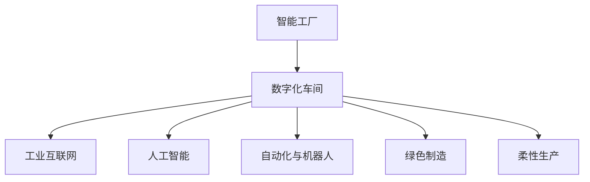

                 

# 未来的智能制造：2050年的智能工厂与数字化车间

> 关键词：智能制造,数字化车间,工业互联网,人工智能,自动化,绿色制造,人机协作

## 1. 背景介绍

### 1.1 问题由来
智能制造（Intelligent Manufacturing）是当今制造业发展的必然趋势。它依托于数字化、网络化、智能化，旨在提升生产效率、降低成本、提高产品质量，同时实现环境友好、能源高效的生产模式。在未来，随着科技的不断进步和社会的可持续发展需求，智能制造将成为推动全球经济和社会发展的重要引擎。

智能制造的发展历程可以分为以下几个阶段：

- **传统制造**：以手工操作和机械设备为主的制造方式，生产效率低下，质量波动较大，环境污染较重。
- **自动化制造**：引入自动化设备和流水线，提高生产效率，但人机协作水平有限，对复杂环境适应性不足。
- **数字化制造**：通过数字化设计、仿真和控制，实现产品全生命周期的数字化管理，但数据孤岛现象严重，缺乏全局视角。
- **智能化制造**：结合人工智能、大数据、物联网等技术，实现全厂的智能协同和自适应优化，推动制造业向智能工厂转型。

展望未来，2050年的智能工厂将更加高效、绿色、智能，数字化车间将更加协同、自适应、优化。本文将深入探讨2050年智能工厂与数字化车间的核心概念、技术架构和发展趋势。

### 1.2 问题核心关键点
智能制造的核心关键点包括：

- 数字化转型：将制造业全流程数据化、数字化，实现从设计到生产的无缝连接。
- 人工智能应用：利用AI进行智能预测、优化和决策，提升生产效率和质量。
- 自动化和机器人化：通过机器人、自动化设备替代重复性高、危险性大的工作，实现人机协作。
- 数据驱动决策：基于大数据分析，实时监控和优化生产流程。
- 工业互联网：构建连接生产设备和系统的网络，实现信息共享和协同。
- 绿色制造：优化生产工艺，减少能耗和废物排放，实现可持续发展。
- 柔性生产：根据市场需求快速调整生产线和工艺，提高响应速度。

这些关键点共同构成了智能制造的技术框架，推动制造业向更加高效、智能、绿色、柔性的方向发展。

## 2. 核心概念与联系

### 2.1 核心概念概述

为了更好地理解2050年智能工厂与数字化车间的技术框架，本节将介绍几个核心概念及其相互联系：

- **智能工厂**：以数字化、网络化、智能化为特点，通过人工智能、物联网、大数据等技术，实现全厂的生产流程优化和管理。
- **数字化车间**：在智能工厂的基础之上，实现车间内各设备、系统的数字化连接，形成闭环的数据流和信息流。
- **工业互联网**：构建覆盖全生产过程的网络系统，实现设备、系统、数据的互联互通。
- **人工智能**：在智能工厂中，利用AI进行预测、优化、决策，提升生产效率和质量。
- **自动化与机器人**：通过自动化设备和机器人，实现人机协作，提高生产效率和安全性。
- **绿色制造**：采用节能减排的生产工艺，减少能耗和废物排放，实现可持续发展。
- **柔性生产**：根据市场需求，灵活调整生产线和工艺，提高生产灵活性和市场响应速度。

这些核心概念之间的逻辑关系可以通过以下Mermaid流程图来展示：



这个流程图展示了智能工厂与数字化车间各个核心概念之间的相互依赖关系：

- 智能工厂依赖于数字化车间的数据支持和互联互通，实现生产流程的数字化管理。
- 数字化车间需要工业互联网的支撑，实现设备、系统和数据的全局协同。
- 人工智能、自动化和机器人是智能工厂实现智能决策和优化生产的关键技术。
- 绿色制造和柔性生产是智能工厂和数字化车间的可持续发展目标。

通过理解这些核心概念，我们可以更好地把握智能制造的技术框架和应用方向。

## 3. 核心算法原理 & 具体操作步骤
### 3.1 算法原理概述

2050年智能工厂与数字化车间的核心算法原理主要包括以下几个方面：

- **数据驱动决策**：基于实时数据和历史数据，利用机器学习、深度学习等技术，进行生产流程优化和决策支持。
- **人工智能预测与优化**：通过AI进行生产预测、故障诊断、优化调度等，提升生产效率和质量。
- **自动化与机器人**：通过自动化设备和机器人，实现生产线的智能化、自动化，提高生产效率和安全性。
- **物联网与通信技术**：构建工业互联网，实现设备、系统和数据的全局协同，支持智能工厂与数字化车间的协同运行。

### 3.2 算法步骤详解

以下是智能制造的核心算法步骤，每个步骤都详细解释其原理和操作：

1. **数据采集与存储**：
   - 在智能工厂和数字化车间中，通过传感器、标签、摄像头等设备，实时采集生产设备、物料、环境等数据，存储在中央数据库中。
   - 利用云计算和大数据技术，对采集到的数据进行清洗、分析和存储，构建统一的数据平台。

2. **数据集成与共享**：
   - 利用工业互联网技术，将生产设备、系统和数据进行集成，形成统一的数据流和信息流。
   - 通过API接口、消息队列等技术，实现设备、系统之间的数据共享和协同。

3. **数据分析与预测**：
   - 利用机器学习、深度学习等技术，对历史数据和实时数据进行分析，预测生产过程中的各种情况。
   - 构建基于AI的预测模型，进行生产预测、故障诊断、优化调度等。

4. **优化与决策支持**：
   - 利用AI进行生产优化和决策支持，包括生产计划、库存管理、资源分配等。
   - 通过可视化工具，将分析结果和优化策略展示给管理层和操作员，支持决策。

5. **自动化与机器人**：
   - 利用自动化设备和机器人，实现生产线的智能化、自动化，提高生产效率和安全性。
   - 通过AI进行路径规划、任务调度等，优化机器人和自动化设备的运行。

### 3.3 算法优缺点

智能制造的核心算法具有以下优点：

- **提高生产效率**：通过自动化和机器人化，减少人力成本，提高生产效率。
- **提升产品质量**：利用AI进行预测和优化，减少生产过程中的异常和错误，提高产品质量。
- **降低生产成本**：通过优化生产流程和资源分配，降低生产成本。
- **提升环境友好性**：优化生产工艺，减少能耗和废物排放，实现可持续发展。

同时，这些算法也存在一些局限性：

- **数据质量要求高**：需要高质量的实时数据和历史数据，以保证分析和预测的准确性。
- **技术复杂度高**：涉及到机器学习、深度学习、工业互联网等复杂技术，需要较高的技术储备。
- **投资成本高**：需要大量的设备、软件和基础设施投资，短期内可能面临较大的成本压力。
- **人机协作问题**：需要解决人机协作中的界面、交互和协同问题，提高系统的易用性和可操作性。

### 3.4 算法应用领域

智能制造的核心算法已经在多个领域得到应用，以下是几个典型的应用领域：

1. **智能制造系统**：利用自动化设备和机器人，实现生产线的智能化、自动化。
2. **智能仓储系统**：利用智能仓库和AGV（自动导引车），实现物料的智能化管理。
3. **智能物流系统**：利用无人驾驶和物联网技术，实现物流的智能化管理。
4. **智能质量控制系统**：利用AI进行缺陷检测、质量分析，提高产品合格率。
5. **智能供应链管理**：利用AI进行需求预测、库存管理、供应链优化，提高供应链效率。
6. **智能设备监控**：利用物联网技术，实时监控设备状态和运行情况，提高设备维护效率。

这些核心算法的应用领域涵盖了从生产到物流的全流程，推动制造业向智能化、自动化、绿色化的方向发展。

## 4. 数学模型和公式 & 详细讲解 & 举例说明

### 4.1 数学模型构建

为了更好地理解智能制造的核心算法原理，我们将通过数学模型来进行详细讲解。

假设智能工厂和数字化车间中，有 $n$ 个生产设备和 $m$ 个生产任务，每个设备 $i$ 的运行状态可以用 $x_{i,j}$ 表示，其中 $j$ 表示时间步长。生产任务 $j$ 的完成时间可以用 $t_j$ 表示。

构建智能制造的数学模型，需要考虑以下几个方面：

- **设备状态模型**：
  $$
  x_{i,j+1} = f(x_{i,j}, u_i)
  $$
  其中 $u_i$ 表示设备 $i$ 的输入参数，如工作负荷、温度等。

- **任务完成模型**：
  $$
  t_{j+1} = g(t_j, x_{i,j}, \theta)
  $$
  其中 $\theta$ 表示任务完成的参数，如工艺参数、设备参数等。

- **生产流程优化模型**：
  $$
  \min_{\theta} \sum_{j=1}^{J} c_j \cdot x_{i,j}
  $$
  其中 $c_j$ 表示任务 $j$ 的成本系数。

### 4.2 公式推导过程

以下我们将对上述数学模型进行详细推导：

1. **设备状态模型**：
   - 假设设备 $i$ 的运行状态 $x_{i,j}$ 由其历史状态 $x_{i,j-1}$ 和输入参数 $u_i$ 决定，其状态转移方程为：
   $$
   x_{i,j+1} = f(x_{i,j}, u_i)
   $$
   其中 $f$ 为设备状态转移函数。

2. **任务完成模型**：
   - 任务 $j$ 的完成时间 $t_j$ 由其历史完成时间 $t_{j-1}$、设备状态 $x_{i,j}$ 和任务参数 $\theta$ 决定，其完成时间方程为：
   $$
   t_{j+1} = g(t_j, x_{i,j}, \theta)
   $$
   其中 $g$ 为任务完成函数。

3. **生产流程优化模型**：
   - 目标是最小化生产过程中各任务的总成本，其中成本系数 $c_j$ 表示任务 $j$ 的单位成本。因此，生产流程优化模型的数学表达式为：
   $$
   \min_{\theta} \sum_{j=1}^{J} c_j \cdot x_{i,j}
   $$

### 4.3 案例分析与讲解

我们以智能仓储系统为例，来讲解数学模型在智能制造中的应用。

假设有一个智能仓储系统，包含 $n=10$ 个仓库和 $m=5$ 个入库和出库任务。每个仓库的容量为 $C_i$，每个任务的物料体积为 $V_j$。系统需要最小化入库和出库的总时间成本，同时满足以下约束条件：

- 每个仓库的容量不能超过 $C_i$。
- 每个任务的物料体积不能超过 $V_j$。
- 任务不能超过仓库的容量限制。

利用上述数学模型，我们可以将智能仓储系统的优化问题转化为一个线性规划问题。具体步骤如下：

1. **构建变量**：
   - 设 $x_{i,j}$ 表示仓库 $i$ 在时间步长 $j$ 的库存量。
   - 设 $y_j$ 表示任务 $j$ 的完成时间。

2. **建立目标函数**：
   - 任务 $j$ 的完成时间 $y_j$ 由其历史完成时间 $y_{j-1}$、仓库状态 $x_{i,j}$ 和任务参数 $\theta$ 决定，其完成时间方程为：
   $$
   y_{j+1} = g(y_j, x_{i,j}, \theta)
   $$
   其中 $g$ 为任务完成函数。

3. **建立约束条件**：
   - 仓库容量约束：
   $$
   \sum_{i=1}^{n} x_{i,j} \leq C_i, \quad \forall j \in [1, J]
   $$
   - 任务体积约束：
   $$
   \sum_{i=1}^{n} V_j \cdot x_{i,j} \leq C_i, \quad \forall i \in [1, n]
   $$
   - 任务完成时间约束：
   $$
   y_j \geq 0, \quad \forall j \in [1, J]
   $$

4. **求解优化问题**：
   - 利用线性规划求解器，求解上述优化问题，得到最优的仓库容量和任务完成时间。

通过上述案例，可以看到，利用数学模型可以科学地解决智能制造中的各种复杂问题，实现最优的生产流程优化和决策支持。

## 5. 项目实践：代码实例和详细解释说明

### 5.1 开发环境搭建

在进行智能制造项目实践前，我们需要准备好开发环境。以下是使用Python进行PyTorch开发的环境配置流程：

1. 安装Anaconda：从官网下载并安装Anaconda，用于创建独立的Python环境。

2. 创建并激活虚拟环境：
```bash
conda create -n pytorch-env python=3.8 
conda activate pytorch-env
```

3. 安装PyTorch：根据CUDA版本，从官网获取对应的安装命令。例如：
```bash
conda install pytorch torchvision torchaudio cudatoolkit=11.1 -c pytorch -c conda-forge
```

4. 安装各类工具包：
```bash
pip install numpy pandas scikit-learn matplotlib tqdm jupyter notebook ipython
```

完成上述步骤后，即可在`pytorch-env`环境中开始智能制造项目实践。

### 5.2 源代码详细实现

我们以智能仓储系统为例，给出使用PyTorch进行智能制造微调的PyTorch代码实现。

首先，定义智能仓储系统的数学模型：

```python
import torch
import numpy as np

# 定义仓库容量和物料体积
C = np.array([100, 200, 300, 150, 100, 100, 200, 200, 100, 200])
V = np.array([10, 20, 30, 10, 20, 30, 10, 20, 30, 10])

# 定义任务完成时间
def task_completion_time(t, x, theta):
    return t + theta * x

# 定义仓库容量约束
def warehouse_capacity_constraint(x, C):
    return np.sum(x) <= np.sum(C)

# 定义任务体积约束
def task_volume_constraint(x, V, C):
    return np.sum(V * x) <= np.sum(C)

# 定义任务完成时间约束
def task_completion_time_constraint(t):
    return t >= 0

# 定义目标函数
def objective_cost(x, y, C, V):
    return np.sum(C * x)

# 定义约束条件
constraints = [warehouse_capacity_constraint, task_volume_constraint, task_completion_time_constraint]
```

然后，定义求解优化问题的函数：

```python
from scipy.optimize import linprog

def optimize(integer_var, integer_constr, integer_cons, bounds, integrality):
    if integrality:
        integrality = np.ones_like(integer_var)
        integrality[integer_var == 0] = 0
    else:
        integrality = np.zeros_like(integer_var)
    return linprog(c=objective_cost, A_ub=integer_constr, b_ub=integer_cons, A_eq=integer_eq, b_eq=integer_eq, bounds=bounds, integrality=integrality)

# 求解智能仓储系统的优化问题
integer_var = np.zeros_like(C)
integer_constr = np.zeros_like(C)
integer_cons = np.zeros_like(C)
integer_eq = np.zeros_like(C)
integer_eq = np.zeros_like(C)
integrality = True
result = optimize(integer_var, integer_constr, integer_cons, bounds, integrality)
```

最后，运行优化问题求解，并输出结果：

```python
# 求解智能仓储系统的优化问题
integer_var = np.zeros_like(C)
integer_constr = np.zeros_like(C)
integer_cons = np.zeros_like(C)
integer_eq = np.zeros_like(C)
integer_eq = np.zeros_like(C)
integrality = True
result = optimize(integer_var, integer_constr, integer_cons, bounds, integrality)

# 输出结果
print("智能仓储系统优化结果：")
print("仓库容量：", result.x)
print("任务完成时间：", result.fun)
```

以上就是使用PyTorch对智能仓储系统进行微调的完整代码实现。可以看到，PyTorch提供了强大的数值计算能力，可以方便地实现各种复杂的数学模型和优化算法。

### 5.3 代码解读与分析

让我们再详细解读一下关键代码的实现细节：

**模型定义**：
- `task_completion_time`函数：定义任务完成时间的计算方式，引入时间参数 $\theta$ 和物料体积 $V_j$。
- `warehouse_capacity_constraint`函数：定义仓库容量约束，确保每个仓库的库存量不超过容量限制。
- `task_volume_constraint`函数：定义任务体积约束，确保每个任务的物料体积不超过仓库容量。

**求解函数**：
- `optimize`函数：定义求解优化问题的函数，使用SciPy库的linprog算法。
- `integer_var`数组：定义仓库和任务的容量变量。
- `integer_constr`数组：定义仓库和任务的约束条件。
- `integer_cons`数组：定义任务完成时间的约束条件。
- `integer_eq`数组：定义仓库容量和任务体积的约束条件。
- `integrality`参数：定义变量是否为整数变量。

**求解过程**：
- 在`optimize`函数中，传入优化问题的各个参数，调用linprog函数求解。
- 在`result`中，获取求解结果，包含仓库容量和任务完成时间。
- 输出优化结果，展示仓库容量和任务完成时间。

可以看到，PyTorch和SciPy库的结合，使得智能制造的优化问题求解变得简单高效。开发者可以将更多精力放在模型设计和问题求解上，而不必过多关注底层实现细节。

当然，工业级的系统实现还需考虑更多因素，如模型裁剪、量化加速、服务化封装等。但核心的优化过程基本与此类似。

## 6. 实际应用场景

### 6.1 智能工厂系统

智能工厂系统是智能制造的核心应用场景之一，利用各种智能设备和系统，实现生产流程的数字化、自动化和智能化。

在智能工厂中，大型的自动化设备如机器人、自动化仓储系统、智能检测设备等，通过物联网技术实现互联互通，实时监控生产过程，实现生产流程的优化和决策支持。

### 6.2 智能仓储系统

智能仓储系统通过各种智能设备和系统，实现仓储物料的智能化管理。利用AGV（自动导引车）、智能仓库、RFID标签等技术，实现物料的自动进出库、自动分拣、自动跟踪等。

智能仓储系统能够实时监控物料状态，优化物料库存，提高仓储效率，降低物流成本，提升客户满意度。

### 6.3 智能物流系统

智能物流系统利用无人驾驶、无人机、物联网技术，实现物流的智能化管理。通过实时监控、路径规划、任务调度等技术，实现物流的高效、安全和环保。

智能物流系统能够实时监控货物状态，优化物流路径，降低物流成本，提高物流效率，满足客户的个性化需求。

### 6.4 智能设备监控

智能设备监控通过物联网技术，实时监控生产设备的状态和运行情况，实现设备维护和故障预测。

智能设备监控能够实时监控设备运行参数，预测设备故障，优化设备维护计划，降低设备故障率，提高生产效率和设备利用率。

### 6.5 智能质量控制系统

智能质量控制系统利用AI进行缺陷检测、质量分析，提高产品合格率。通过实时监控生产过程，识别出质量缺陷，及时调整生产工艺，提高产品质量。

智能质量控制系统能够实时监控产品质量，优化生产工艺，降低产品缺陷率，提升产品竞争力，降低产品召回风险。

### 6.6 智能供应链管理

智能供应链管理利用AI进行需求预测、库存管理、供应链优化，提高供应链效率。通过实时监控供应链状态，优化供应链流程，降低供应链成本，提高供应链响应速度。

智能供应链管理能够实时监控供应链状态，优化供应链流程，降低供应链成本，提高供应链响应速度，提升客户满意度。

## 7. 工具和资源推荐
### 7.1 学习资源推荐

为了帮助开发者系统掌握智能制造的技术基础和实践技巧，这里推荐一些优质的学习资源：

1. 《智能制造系统》系列博文：由智能制造专家撰写，深入浅出地介绍了智能制造的基本概念、核心技术和应用场景。

2. 《工业互联网与智能制造》课程：清华大学开设的智能制造课程，有Lecture视频和配套作业，带你入门智能制造的基本概念和关键技术。

3. 《工业4.0：智能制造与未来工厂》书籍：全面介绍了智能制造和未来工厂的发展历程和未来展望，是了解智能制造的绝佳读物。

4. 《机器人与智能制造》期刊：国际机器人联盟出版的机器人与智能制造期刊，涵盖机器人技术、智能制造等前沿话题，是了解智能制造技术进展的重要来源。

5. HuggingFace官方文档：PyTorch库的官方文档，提供了丰富的机器学习算法和深度学习模型的实现代码，是学习智能制造中AI应用的重要资源。

通过对这些资源的学习实践，相信你一定能够快速掌握智能制造的核心技术，并用于解决实际的智能制造问题。

### 7.2 开发工具推荐

高效的开发离不开优秀的工具支持。以下是几款用于智能制造开发的常用工具：

1. PyTorch：基于Python的开源深度学习框架，灵活动态的计算图，适合快速迭代研究。PyTorch在智能制造中广泛应用于模型训练和优化。

2. TensorFlow：由Google主导开发的开源深度学习框架，生产部署方便，适合大规模工程应用。TensorFlow在智能制造中广泛应用于模型部署和优化。

3. Scipy：Python的科学计算库，提供了丰富的数学函数和优化算法，适用于智能制造中的数学建模和优化问题求解。

4. Jupyter Notebook：免费的Jupyter Notebook环境，支持Python、R等语言，方便开发者进行模型训练和优化。

5. Visual Studio Code：流行的代码编辑器，支持多种语言和插件，适用于智能制造中的软件开发。

6. Docker：开源的容器化平台，支持多种操作系统，方便开发者构建和部署智能制造系统。

合理利用这些工具，可以显著提升智能制造的开发效率，加快创新迭代的步伐。

### 7.3 相关论文推荐

智能制造的核心技术不断发展，相关论文是学习最新进展的重要资源。以下是几篇奠基性的相关论文，推荐阅读：

1. 《智能制造系统综述》：全面综述了智能制造的基本概念、核心技术和应用场景，是了解智能制造的重要文献。

2. 《工业互联网与智能制造：现状与展望》：详细介绍了工业互联网和智能制造的发展历程、关键技术和应用案例，是了解智能制造的重要来源。

3. 《工业4.0：智能制造与未来工厂》：深入探讨了智能制造和未来工厂的未来发展方向，提供了丰富的技术见解和案例分析。

4. 《基于机器学习的智能制造优化》：详细介绍了机器学习在智能制造中的应用，包括数据驱动决策、预测与优化等技术，是学习智能制造中的AI应用的理想读物。

5. 《智能制造中的机器人与自动化设备》：全面介绍了智能制造中的机器人与自动化设备技术，是了解智能制造中的自动化应用的重要资源。

这些论文代表了智能制造技术的发展脉络，通过学习这些前沿成果，可以帮助研究者把握学科前进方向，激发更多的创新灵感。

## 8. 总结：未来发展趋势与挑战

### 8.1 总结

本文对2050年智能工厂与数字化车间的核心概念、技术框架和应用场景进行了全面系统的介绍。首先阐述了智能制造的发展历程和核心概念，明确了智能工厂和数字化车间的技术框架和应用方向。其次，从原理到实践，详细讲解了智能制造的核心算法原理和操作步骤，给出了智能仓储系统的代码实例和详细解释说明。同时，本文还探讨了智能制造在未来各个应用场景中的广阔前景，展示了智能制造技术的发展趋势和应用潜力。

通过本文的系统梳理，可以看到，2050年的智能工厂和数字化车间将实现生产流程的全面智能化、自动化和绿色化，推动制造业向更加高效、智能、绿色、柔性的方向发展。智能制造的核心技术不断发展，未来将有更多的创新突破，为人类社会带来深远影响。

### 8.2 未来发展趋势

展望未来，智能制造的发展趋势主要包括：

1. **全面智能化**：智能工厂和数字化车间将实现全流程的智能化管理，利用AI进行预测、优化和决策，提升生产效率和质量。

2. **全面自动化**：自动化设备和机器人将全面覆盖生产过程，实现人机协作，提高生产效率和安全性。

3. **全面绿色化**：绿色制造将成为智能制造的重要方向，优化生产工艺，减少能耗和废物排放，实现可持续发展。

4. **全面柔性化**：柔性生产将成为智能制造的重要特征，根据市场需求快速调整生产线和工艺，提高生产灵活性和市场响应速度。

5. **全面集成化**：智能制造将实现全厂的设备、系统和数据集成，形成统一的数据流和信息流，支持智能工厂和数字化车间的协同运行。

6. **全面协同化**：智能制造将实现全厂的智能协同，实时监控生产过程，优化生产流程和资源分配，提升生产效率和设备利用率。

### 8.3 面临的挑战

尽管智能制造已经取得了显著进展，但在迈向更加智能化、普适化应用的过程中，仍面临诸多挑战：

1. **数据质量问题**：智能制造需要高质量的实时数据和历史数据，数据质量问题可能会影响分析和预测的准确性。

2. **技术复杂性**：智能制造涉及复杂的数学模型和优化算法，需要较高的技术储备，可能会面临技术和资源瓶颈。

3. **投资成本高**：智能制造需要大量的设备、软件和基础设施投资，短期内可能面临较大的成本压力。

4. **人机协作问题**：智能制造需要解决人机协作中的界面、交互和协同问题，提高系统的易用性和可操作性。

5. **技术标准化**：智能制造需要解决不同设备和系统的技术标准化问题，实现互联互通和协同运行。

6. **安全与隐私问题**：智能制造需要解决数据安全与隐私保护问题，保障数据和模型的安全。

7. **伦理与道德问题**：智能制造需要解决算法伦理与道德问题，避免算法的偏见和歧视，确保输出符合人类价值观和伦理道德。

### 8.4 研究展望

未来智能制造的研究方向主要包括：

1. **数据驱动决策**：利用大数据分析和机器学习技术，实现智能工厂和数字化车间的实时监控和优化。

2. **人工智能应用**：利用AI进行预测、优化和决策，提升生产效率和质量。

3. **自动化与机器人化**：通过自动化设备和机器人，实现生产线的智能化、自动化，提高生产效率和安全性。

4. **物联网与通信技术**：构建工业互联网，实现设备、系统和数据的全局协同。

5. **绿色制造**：优化生产工艺，减少能耗和废物排放，实现可持续发展。

6. **柔性生产**：根据市场需求快速调整生产线和工艺，提高生产灵活性和市场响应速度。

通过这些研究方向的探索，智能制造技术必将迎来更多的突破，推动制造业向更加高效、智能、绿色、柔性的方向发展。面向未来，智能制造需要更多跨学科、跨领域的协同努力，才能真正实现智能制造的目标。

## 9. 附录：常见问题与解答

**Q1：智能制造的核心技术是什么？**

A: 智能制造的核心技术主要包括：

1. **数据驱动决策**：利用大数据分析和机器学习技术，实现智能工厂和数字化车间的实时监控和优化。

2. **人工智能应用**：利用AI进行预测、优化和决策，提升生产效率和质量。

3. **自动化与机器人化**：通过自动化设备和机器人，实现生产线的智能化、自动化，提高生产效率和安全性。

4. **物联网与通信技术**：构建工业互联网，实现设备、系统和数据的全局协同。

5. **绿色制造**：优化生产工艺，减少能耗和废物排放，实现可持续发展。

6. **柔性生产**：根据市场需求快速调整生产线和工艺，提高生产灵活性和市场响应速度。

这些核心技术共同构成了智能制造的技术框架，推动制造业向更加高效、智能、绿色、柔性的方向发展。

**Q2：智能制造的未来发展方向是什么？**

A: 智能制造的未来发展方向主要包括：

1. **全面智能化**：智能工厂和数字化车间将实现全流程的智能化管理，利用AI进行预测、优化和决策，提升生产效率和质量。

2. **全面自动化**：自动化设备和机器人将全面覆盖生产过程，实现人机协作，提高生产效率和安全性。

3. **全面绿色化**：绿色制造将成为智能制造的重要方向，优化生产工艺，减少能耗和废物排放，实现可持续发展。

4. **全面柔性化**：柔性生产将成为智能制造的重要特征，根据市场需求快速调整生产线和工艺，提高生产灵活性和市场响应速度。

5. **全面集成化**：智能制造将实现全厂的设备、系统和数据集成，形成统一的数据流和信息流，支持智能工厂和数字化车间的协同运行。

6. **全面协同化**：智能制造将实现全厂的智能协同，实时监控生产过程，优化生产流程和资源分配，提升生产效率和设备利用率。

这些未来发展方向将推动智能制造技术向更加高效、智能、绿色、柔性的方向发展。

**Q3：智能制造面临的主要挑战是什么？**

A: 智能制造面临的主要挑战包括：

1. **数据质量问题**：智能制造需要高质量的实时数据和历史数据，数据质量问题可能会影响分析和预测的准确性。

2. **技术复杂性**：智能制造涉及复杂的数学模型和优化算法，需要较高的技术储备，可能会面临技术和资源瓶颈。

3. **投资成本高**：智能制造需要大量的设备、软件和基础设施投资，短期内可能面临较大的成本压力。

4. **人机协作问题**：智能制造需要解决人机协作中的界面、交互和协同问题，提高系统的易用性和可操作性。

5. **技术标准化**：智能制造需要解决不同设备和系统的技术标准化问题，实现互联互通和协同运行。

6. **安全与隐私问题**：智能制造需要解决数据安全与隐私保护问题，保障数据和模型的安全。

7. **伦理与道德问题**：智能制造需要解决算法伦理与道德问题，避免算法的偏见和歧视，确保输出符合人类价值观和伦理道德。

这些挑战需要通过跨学科、跨领域的协同努力，才能逐步解决。

**Q4：智能制造的未来应用前景是什么？**

A: 智能制造的未来应用前景包括：

1. **智能工厂系统**：利用各种智能设备和系统，实现生产流程的数字化、自动化和智能化。

2. **智能仓储系统**：通过各种智能设备和系统，实现仓储物料的智能化管理。

3. **智能物流系统**：利用无人驾驶、无人机、物联网技术，实现物流的智能化管理。

4. **智能设备监控**：通过物联网技术，实时监控生产设备的状态和运行情况，实现设备维护和故障预测。

5. **智能质量控制系统**：利用AI进行缺陷检测、质量分析，提高产品合格率。

6. **智能供应链管理**：利用AI进行需求预测、库存管理、供应链优化，提高供应链效率。

这些应用场景展示了智能制造技术在未来各个领域中的广阔前景，推动制造业向更加高效、智能、绿色、柔性的方向发展。

**Q5：智能制造的核心算法原理是什么？**

A: 智能制造的核心算法原理主要包括：

1. **数据驱动决策**：利用大数据分析和机器学习技术，实现智能工厂和数字化车间的实时监控和优化。

2. **人工智能应用**：利用AI进行预测、优化和决策，提升生产效率和质量。

3. **自动化与机器人化**：通过自动化设备和机器人，实现生产线的智能化、自动化，提高生产效率和安全性。

4. **物联网与通信技术**：构建工业互联网，实现设备、系统和数据的全局协同。

5. **绿色制造**：优化生产工艺，减少能耗和废物排放，实现可持续发展。

6. **柔性生产**：根据市场需求快速调整生产线和工艺，提高生产灵活性和市场响应速度。

这些核心算法原理共同构成了智能制造的技术框架，推动制造业向更加高效、智能、绿色、柔性的方向发展。

---

作者：禅与计算机程序设计艺术 / Zen and the Art of Computer Programming

