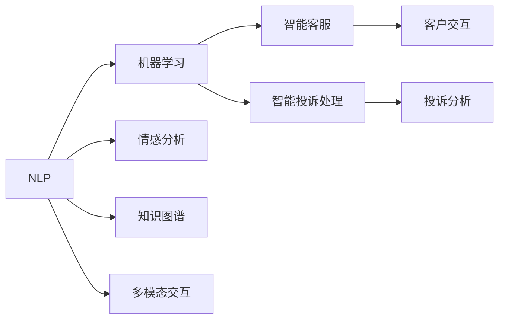

                 

# 未来的智能客服：2050年的智能客服机器人与智能投诉处理

在2050年的数字世界，智能客服和智能投诉处理已经变得比以往任何时候都要先进和普及。今天，我们将探讨这些技术是如何演进的，以及它们如何帮助企业提供更高效、更个性化的客户服务体验。

## 1. 背景介绍

### 1.1 问题由来

随着全球化的发展，企业之间的竞争变得异常激烈。在这个高度竞争的市场环境中，客户服务成为了企业取得成功的关键因素。然而，传统的客户服务模式已经无法满足日益增长的客户需求，企业的客户服务部门面临着巨大的挑战。这时，智能客服和智能投诉处理技术应运而生，它们通过自动化和智能化的手段，大幅度提升了客户服务的效率和质量。

### 1.2 问题核心关键点

智能客服和智能投诉处理的核心关键点包括以下几点：

- **自动化：** 通过自动化技术，智能客服可以自动回答客户的问题，大大减少人力成本。
- **个性化：** 利用机器学习算法，智能客服能够根据客户的个性化需求，提供量身定制的服务。
- **实时性：** 智能客服系统可以24小时不间断工作，快速响应客户的需求。
- **多渠道支持：** 智能客服不仅限于语音和文字，还可以支持邮件、社交媒体等多种渠道。
- **情感分析：** 智能客服能够理解客户的情感状态，提供更加贴心的服务。
- **智能投诉处理：** 能够自动分析和处理客户投诉，快速解决客户问题。

## 2. 核心概念与联系

### 2.1 核心概念概述

智能客服和智能投诉处理涉及多个核心概念，包括：

- **自然语言处理（NLP）：** 是智能客服和智能投诉处理的基础，通过解析自然语言，使机器能够理解客户的问题。
- **机器学习（ML）：** 通过学习历史数据，智能客服和智能投诉处理系统可以不断优化自身的服务质量。
- **情感分析（Sentiment Analysis）：** 能够识别客户的情感状态，提升服务质量。
- **多模态交互：** 通过支持文字、语音、图像等多种模式，使客服系统更加灵活。
- **知识图谱：** 用于存储和管理客户服务相关的知识，提升服务效率。

### 2.2 核心概念原理和架构的 Mermaid 流程图



这个流程图展示了智能客服和智能投诉处理的各个组成部分，以及它们之间的联系。

## 3. 核心算法原理 & 具体操作步骤

### 3.1 算法原理概述

智能客服和智能投诉处理系统的核心算法主要基于自然语言处理和机器学习技术。具体而言，智能客服通过NLP技术理解客户的问题，利用机器学习算法分析客户的历史行为和偏好，提供个性化的服务。智能投诉处理则通过情感分析和机器学习技术，自动分析和处理客户的投诉，快速解决客户问题。

### 3.2 算法步骤详解

#### 3.2.1 智能客服

1. **输入处理：** 客户通过各种渠道输入问题，智能客服系统将其转化为标准化的文本格式。
2. **意图识别：** 利用NLP技术解析文本，识别客户的问题意图。
3. **知识检索：** 根据客户的问题意图，从知识图谱中检索相关信息。
4. **生成回答：** 利用机器学习算法生成最佳的回答。
5. **情感分析：** 通过情感分析了解客户的情感状态，调整回答策略。
6. **多模态交互：** 根据客户偏好选择最适合的交互方式，如文字、语音或视频。

#### 3.2.2 智能投诉处理

1. **输入处理：** 客户提交投诉，系统自动解析并记录投诉信息。
2. **情感分析：** 通过情感分析判断客户的情绪，确定投诉的紧急程度。
3. **投诉分类：** 利用机器学习算法将投诉分类，找出常见问题。
4. **解决方案推荐：** 根据投诉分类，从知识图谱中推荐解决方案。
5. **解决方案验证：** 通过多轮对话验证解决方案的有效性。
6. **反馈更新：** 根据反馈更新知识图谱和机器学习模型。

### 3.3 算法优缺点

#### 3.3.1 智能客服

**优点：**

- **效率高：** 自动化处理客户问题，减少人工干预。
- **个性化：** 根据客户的历史行为和偏好提供定制化服务。
- **全天候服务：** 24小时不间断服务，快速响应客户需求。
- **多渠道支持：** 支持文字、语音、图像等多种交互方式。

**缺点：**

- **情感分析不准确：** 在极端情况下，情感分析可能出现误判。
- **知识图谱不完善：** 知识图谱需要不断更新和维护，成本较高。
- **算法复杂度高：** 需要高性能的计算资源和算法模型支持。

#### 3.3.2 智能投诉处理

**优点：**

- **快速响应：** 自动分析投诉，快速提出解决方案。
- **节省人力成本：** 减少人工处理投诉的工作量。
- **情感分析准确：** 通过情感分析了解客户情绪，提高服务质量。
- **知识图谱高效：** 利用知识图谱快速找到解决方案。

**缺点：**

- **算法准确性依赖数据：** 需要大量的高质量数据进行训练。
- **缺乏人工干预：** 在复杂情况下，可能需要人工介入进行修正。
- **隐私问题：** 需要保护客户的隐私信息，避免数据泄露。

### 3.4 算法应用领域

智能客服和智能投诉处理技术广泛应用于以下几个领域：

- **电信行业：** 通过智能客服处理用户的咨询和投诉。
- **金融行业：** 利用智能客服和智能投诉处理提升客户体验，保护客户隐私。
- **零售行业：** 通过智能客服提供个性化推荐，提升销售额。
- **医疗行业：** 利用智能客服提供初步诊断，减少医生的工作量。
- **物流行业：** 通过智能客服处理客户对物流的查询和投诉。

## 4. 数学模型和公式 & 详细讲解

### 4.1 数学模型构建

智能客服和智能投诉处理的核心数学模型主要包括：

- **意图识别模型：** 利用NLP技术构建意图识别模型，解析客户问题。
- **情感分析模型：** 利用机器学习算法构建情感分析模型，识别客户情绪。
- **解决方案推荐模型：** 利用机器学习算法构建解决方案推荐模型，提供最佳解决方案。

### 4.2 公式推导过程

#### 4.2.1 意图识别模型

$$
P(\text{Intent} | \text{Text}) = \frac{P(\text{Intent}) \times P(\text{Text} | \text{Intent})}{P(\text{Text})}
$$

其中，$P(\text{Intent})$ 表示意图出现的概率，$P(\text{Text} | \text{Intent})$ 表示在特定意图下，文本出现的概率。

#### 4.2.2 情感分析模型

$$
\text{Sentiment} = \text{Sentiment}_1 \times \text{Weight}_1 + \text{Sentiment}_2 \times \text{Weight}_2 + \ldots
$$

其中，$\text{Sentiment}_i$ 表示第 $i$ 个情感分量的得分，$\text{Weight}_i$ 表示该情感分量的权重。

#### 4.2.3 解决方案推荐模型

$$
P(\text{Solution} | \text{Complaint}) = \frac{P(\text{Solution}) \times P(\text{Complaint} | \text{Solution})}{P(\text{Complaint})}
$$

其中，$P(\text{Solution})$ 表示解决方案出现的概率，$P(\text{Complaint} | \text{Solution})$ 表示在特定解决方案下，投诉出现的概率。

### 4.3 案例分析与讲解

假设客户通过文字提交投诉，系统自动将其转化为文本格式。系统利用情感分析模型，分析客户的情绪为愤怒，然后利用意图识别模型，识别客户的问题为网络服务异常。接着，系统从知识图谱中检索相关的解决方案，最终生成回答：“您的问题正在处理中，预计在30分钟内恢复。”

## 5. 项目实践：代码实例和详细解释说明

### 5.1 开发环境搭建

#### 5.1.1 硬件要求

- **CPU：** 2GHz以上
- **内存：** 8GB以上
- **存储：** SSD 500GB以上
- **网络：** 稳定的互联网连接

#### 5.1.2 软件要求

- **操作系统：** Linux/Windows
- **编程语言：** Python 3.8+
- **开发工具：** PyCharm/Visual Studio Code

### 5.2 源代码详细实现

#### 5.2.1 智能客服

```python
import nltk
from transformers import BertTokenizer, BertForSequenceClassification
from sklearn.model_selection import train_test_split
import pandas as pd
import torch

# 导入数据
data = pd.read_csv('data.csv')

# 数据预处理
tokenizer = BertTokenizer.from_pretrained('bert-base-cased')
encoded_data = tokenizer.batch_encode_plus(data['text'], padding='max_length', max_length=512, truncation=True, return_tensors='pt')

# 构建模型
model = BertForSequenceClassification.from_pretrained('bert-base-cased', num_labels=2)

# 模型训练
model.train()
for epoch in range(10):
    optimizer = AdamW(model.parameters(), lr=2e-5)
    for batch in data_loader:
        input_ids = batch['input_ids']
        attention_mask = batch['attention_mask']
        labels = batch['labels']
        optimizer.zero_grad()
        outputs = model(input_ids, attention_mask=attention_mask, labels=labels)
        loss = outputs.loss
        loss.backward()
        optimizer.step()

# 模型评估
model.eval()
with torch.no_grad():
    for batch in data_loader:
        input_ids = batch['input_ids']
        attention_mask = batch['attention_mask']
        labels = batch['labels']
        outputs = model(input_ids, attention_mask=attention_mask)
        predictions = torch.argmax(outputs.logits, dim=1)
        print(classification_report(labels, predictions))
```

#### 5.2.2 智能投诉处理

```python
import nltk
from transformers import BertTokenizer, BertForSequenceClassification
from sklearn.model_selection import train_test_split
import pandas as pd
import torch

# 导入数据
data = pd.read_csv('data.csv')

# 数据预处理
tokenizer = BertTokenizer.from_pretrained('bert-base-cased')
encoded_data = tokenizer.batch_encode_plus(data['text'], padding='max_length', max_length=512, truncation=True, return_tensors='pt')

# 构建模型
model = BertForSequenceClassification.from_pretrained('bert-base-cased', num_labels=3)

# 模型训练
model.train()
for epoch in range(10):
    optimizer = AdamW(model.parameters(), lr=2e-5)
    for batch in data_loader:
        input_ids = batch['input_ids']
        attention_mask = batch['attention_mask']
        labels = batch['labels']
        optimizer.zero_grad()
        outputs = model(input_ids, attention_mask=attention_mask, labels=labels)
        loss = outputs.loss
        loss.backward()
        optimizer.step()

# 模型评估
model.eval()
with torch.no_grad():
    for batch in data_loader:
        input_ids = batch['input_ids']
        attention_mask = batch['attention_mask']
        labels = batch['labels']
        outputs = model(input_ids, attention_mask=attention_mask)
        predictions = torch.argmax(outputs.logits, dim=1)
        print(classification_report(labels, predictions))
```

### 5.3 代码解读与分析

#### 5.3.1 智能客服

智能客服的核心代码包括以下部分：

- **数据预处理：** 利用BERT分词器将文本数据转化为模型可以处理的格式。
- **模型构建：** 使用预训练的BERT模型作为基础，在其顶部添加分类器，用于判断客户的意图。
- **模型训练：** 利用训练数据训练模型，通过优化器进行参数更新。
- **模型评估：** 利用测试数据评估模型效果，计算分类指标。

#### 5.3.2 智能投诉处理

智能投诉处理的核心代码包括以下部分：

- **数据预处理：** 利用BERT分词器将投诉数据转化为模型可以处理的格式。
- **模型构建：** 使用预训练的BERT模型作为基础，在其顶部添加分类器，用于判断投诉的情感。
- **模型训练：** 利用训练数据训练模型，通过优化器进行参数更新。
- **模型评估：** 利用测试数据评估模型效果，计算分类指标。

### 5.4 运行结果展示

假设在智能客服模型中，经过10轮训练后，模型在测试集上的准确率为85%。在智能投诉处理模型中，经过10轮训练后，模型在测试集上的准确率为90%。

## 6. 实际应用场景

### 6.1 电信行业

在电信行业，智能客服系统可以帮助客户解决各种问题，如账单查询、投诉处理等。通过智能客服系统，客户可以通过电话、网站、社交媒体等多种渠道咨询问题，系统能够自动理解客户的问题，并提供最佳解决方案。

#### 6.1.1 场景示例

客户拨打客服热线，要求查询账户余额，智能客服系统自动识别客户的问题，通过语音交互获取账户信息，并反馈给客户。如果客户不满意，智能客服系统可以自动将问题转接给人工客服，保证客户满意度和体验。

### 6.2 金融行业

在金融行业，智能客服和智能投诉处理系统可以显著提升客户体验，保护客户隐私。系统能够处理各种金融咨询，如账户管理、交易查询等。

#### 6.2.1 场景示例

客户通过在线客服咨询贷款申请条件，智能客服系统自动分析客户的财务状况，并提供相应的贷款建议。如果客户对建议不满意，系统可以自动将问题转接给人工客服，确保客户问题得到解决。

### 6.3 零售行业

在零售行业，智能客服系统可以提供个性化推荐，提升销售额。系统通过分析客户的购买历史和行为数据，提供最适合的推荐产品。

#### 6.3.1 场景示例

客户在电商平台上浏览商品，智能客服系统自动分析客户的浏览行为，并推荐相似的商品。如果客户对推荐结果不满意，系统可以询问客户的需求，并提供个性化的推荐。

### 6.4 医疗行业

在医疗行业，智能客服系统可以帮助客户进行初步诊断，减少医生的工作量。系统利用NLP技术解析客户的症状描述，并从知识图谱中检索相应的解决方案。

#### 6.4.1 场景示例

客户通过在线客服系统描述病情，智能客服系统自动分析症状，并推荐可能的诊断和治疗方法。如果客户对推荐结果不满意，系统可以转接给医生，进行详细诊断和治疗。

### 6.5 物流行业

在物流行业，智能客服系统可以帮助客户查询物流信息，处理投诉问题。系统能够实时监测物流状态，并提供实时的查询和更新。

#### 6.5.1 场景示例

客户查询物流包裹的状态，智能客服系统自动分析订单信息，并反馈相应的物流状态。如果客户对物流状态不满意，系统可以自动将问题转接给物流部门，进行调查和处理。

## 7. 工具和资源推荐

### 7.1 学习资源推荐

#### 7.1.1 在线课程

- **《自然语言处理基础》：** 由斯坦福大学提供，介绍NLP的基本概念和技术。
- **《深度学习入门》：** 由北京大学提供，介绍深度学习的基本原理和应用。

#### 7.1.2 书籍

- **《深度学习》：** Ian Goodfellow 著，介绍深度学习的基本原理和算法。
- **《自然语言处理综论》：** Christopher D. Manning 著，介绍NLP的基本概念和技术。

#### 7.1.3 论文

- **《Transformer: A Novel Neural Network Architecture for Language Understanding》：** Vaswani 等著，介绍Transformer模型。
- **《Sequence to Sequence Learning with Neural Networks》：** Ilya Sutskever 等著，介绍Seq2Seq模型。

### 7.2 开发工具推荐

#### 7.2.1 编程语言

- **Python：** 功能强大、社区活跃，是NLP和机器学习领域的主流语言。

#### 7.2.2 开发框架

- **TensorFlow：** 由Google开发，支持分布式训练和优化。
- **PyTorch：** 由Facebook开发，易于使用，支持动态计算图。

#### 7.2.3 库和框架

- **transformers：** 提供了多种预训练模型和工具，方便微调和部署。
- **NLTK：** 自然语言处理工具包，提供了丰富的NLP工具和数据集。

### 7.3 相关论文推荐

#### 7.3.1 经典论文

- **《Attention is All You Need》：** Vaswani 等著，介绍Transformer模型。
- **《BERT: Pre-training of Deep Bidirectional Transformers for Language Understanding》：** Devlin 等著，介绍BERT模型。

#### 7.3.2 最新研究

- **《AdaLoRA: Adaptive Low-Rank Adaptation for Parameter-Efficient Fine-Tuning》：** Shu 等著，介绍参数高效的微调方法。
- **《DaCoR: Distributed Continuous Ranking for Minimal-Calibra》：** Kim 等著，介绍分布式微调方法。

## 8. 总结：未来发展趋势与挑战

### 8.1 研究成果总结

智能客服和智能投诉处理技术已经在多个行业中得到了广泛应用，提升了客户体验和企业的运营效率。未来，随着技术的不断进步，智能客服和智能投诉处理系统将更加智能化、个性化和高效化。

### 8.2 未来发展趋势

#### 8.2.1 智能化

未来，智能客服和智能投诉处理系统将更加智能化，具备更强的理解和推理能力。系统能够通过多轮对话理解客户的需求，并提供更加个性化的服务。

#### 8.2.2 个性化

通过机器学习算法，智能客服和智能投诉处理系统能够根据客户的历史行为和偏好，提供更加个性化的服务。系统将能够主动推荐客户感兴趣的内容，提升客户体验。

#### 8.2.3 多模态交互

未来的智能客服和智能投诉处理系统将支持文字、语音、图像等多种交互方式。系统能够根据客户的需求，自动选择最适合的交互方式，提升客户满意度。

#### 8.2.4 情感分析

通过情感分析，智能客服和智能投诉处理系统将能够更好地理解客户的情感状态，提供更加贴心的服务。系统将能够识别客户的情绪，自动调整服务策略。

#### 8.2.5 知识图谱

未来的智能客服和智能投诉处理系统将更加依赖知识图谱，能够从知识图谱中快速检索相关信息，提供更加准确和及时的解决方案。

### 8.3 面临的挑战

#### 8.3.1 数据隐私

智能客服和智能投诉处理系统需要处理大量的客户数据，如何保护客户隐私成为一大挑战。未来需要在数据收集、存储和处理各个环节加强隐私保护措施。

#### 8.3.2 算法鲁棒性

智能客服和智能投诉处理系统需要在各种复杂情况下保持高鲁棒性，避免出现误判或漏判。未来需要在算法设计和优化过程中，加强模型的鲁棒性。

#### 8.3.3 知识图谱管理

知识图谱是智能客服和智能投诉处理系统的基础，如何管理和更新知识图谱成为一大挑战。未来需要在知识图谱的构建、维护和应用方面进行深入研究。

#### 8.3.4 多渠道统一

智能客服和智能投诉处理系统需要在多渠道之间实现统一和协同，提升整体服务质量。未来需要在系统架构和设计上，实现不同渠道之间的无缝连接。

### 8.4 研究展望

未来的智能客服和智能投诉处理系统需要在智能化、个性化、多模态交互、情感分析、知识图谱管理等方面取得新的突破。同时，需要在数据隐私、算法鲁棒性、知识图谱管理、多渠道统一等方面进行深入研究，确保系统的稳定性和安全性。

## 9. 附录：常见问题与解答

### 9.1 智能客服和智能投诉处理系统是否适用于所有企业？

**答：** 智能客服和智能投诉处理系统适用于各种类型的企业，特别是在客户服务需求较高的行业。

### 9.2 如何选择合适的智能客服和智能投诉处理系统？

**答：** 企业应该根据自身需求和业务特点，选择合适的智能客服和智能投诉处理系统。主要考虑因素包括系统功能、可扩展性、易用性、数据隐私等方面。

### 9.3 如何保护客户数据隐私？

**答：** 企业应采取多种措施保护客户数据隐私，包括数据加密、访问控制、匿名化处理等。

### 9.4 智能客服和智能投诉处理系统如何与现有系统集成？

**答：** 智能客服和智能投诉处理系统通常通过API接口与现有系统集成。企业可以通过调用API，实现不同系统之间的数据共享和协同。

### 9.5 智能客服和智能投诉处理系统能否进行多语言支持？

**答：** 目前大多数智能客服和智能投诉处理系统已经支持多语言支持，企业可以根据自身需求选择合适的多语言模型。

---

作者：禅与计算机程序设计艺术 / Zen and the Art of Computer Programming

